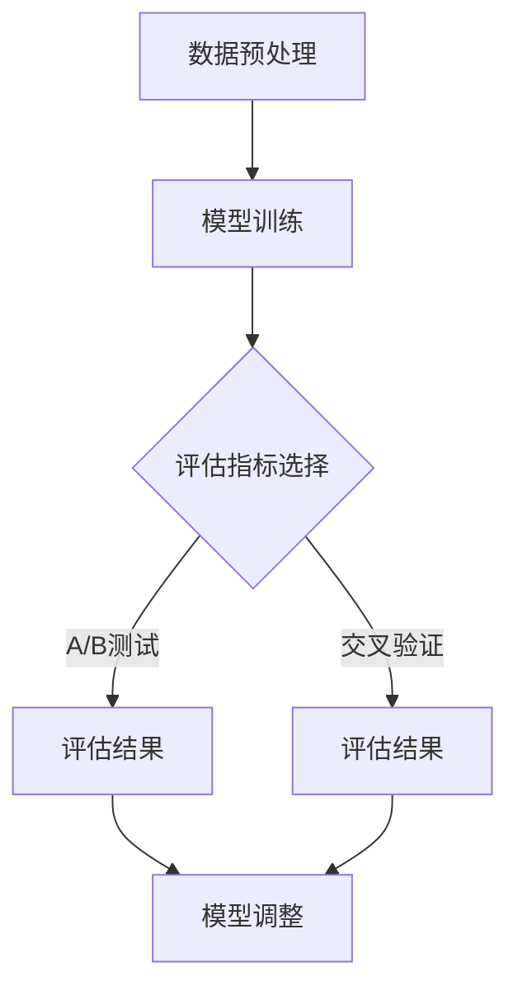

                 

## 大模型推荐中的模型诊断与效果理解

### 概述

大模型推荐系统在现代互联网应用中扮演着至关重要的角色，为用户提供个性化的推荐服务，从而提升用户体验。然而，随着模型的规模和复杂性不断增加，如何有效诊断模型的效果和性能，成为了一个关键的研究课题。本文将围绕大模型推荐中的模型诊断与效果理解，详细探讨相关技术原理、算法实现、实际应用和未来发展趋势。

本文主要分为以下几个部分：

1. **背景介绍**：介绍大模型推荐系统的基本概念和重要性。
2. **核心概念与联系**：阐述模型诊断与效果理解的关键概念，包括性能指标、评估方法等。
3. **核心算法原理与具体操作步骤**：介绍常用的模型诊断与效果理解算法，如A/B测试、交叉验证等。
4. **数学模型与公式**：详细讲解相关算法的数学模型和公式。
5. **项目实战**：通过具体代码案例展示模型诊断与效果理解的实践过程。
6. **实际应用场景**：分析模型诊断与效果理解在不同场景中的应用。
7. **工具和资源推荐**：推荐相关的学习资源、开发工具和论文著作。
8. **总结**：总结大模型推荐中的模型诊断与效果理解的研究现状和未来趋势。
9. **附录**：解答常见问题。
10. **扩展阅读与参考资料**：提供更多的相关阅读和参考资料。

### 背景介绍

大模型推荐系统是指利用大规模机器学习模型，根据用户的兴趣、行为和历史数据，为用户推荐个性化内容的服务。这些系统广泛应用于电子商务、社交媒体、新闻推送等领域，已经成为现代互联网应用的核心组成部分。

大模型推荐系统的核心价值在于：

- **提升用户体验**：通过个性化推荐，为用户提供更加符合其兴趣的内容，从而提高用户满意度和粘性。
- **增加商业价值**：通过推荐系统，企业可以更好地挖掘用户需求，提升广告投放效果，增加销售额。
- **优化内容分发**：在信息爆炸的时代，推荐系统有助于筛选出高质量的内容，提高信息的传播效率。

然而，大模型推荐系统的复杂性和规模也给模型诊断与效果理解带来了巨大的挑战。一方面，模型的参数量和数据量庞大，传统的评估方法难以满足需求；另一方面，模型的非线性特性使得直接分析其效果变得困难。因此，如何有效诊断模型的效果和性能，成为了一个亟待解决的问题。

### 核心概念与联系

在进行模型诊断与效果理解之前，我们需要明确一些关键概念和它们之间的联系。

#### 性能指标

性能指标是评估模型效果的重要依据。常见的性能指标包括：

1. **准确率（Accuracy）**：模型预测正确的样本数占总样本数的比例。适用于分类问题。
   $$Accuracy = \frac{TP + TN}{TP + TN + FP + FN}$$
   其中，TP表示真实为正类且被预测为正类的样本数，TN表示真实为负类且被预测为负类的样本数，FP表示真实为负类但被预测为正类的样本数，FN表示真实为正类但被预测为负类的样本数。

2. **召回率（Recall）**：模型预测为正类的真实正类样本数占总真实正类样本数的比例。适用于分类问题。
   $$Recall = \frac{TP}{TP + FN}$$

3. **精确率（Precision）**：模型预测为正类的真实正类样本数占总预测为正类的样本数的比例。适用于分类问题。
   $$Precision = \frac{TP}{TP + FP}$$

4. **F1值（F1 Score）**：精确率和召回率的调和平均，综合考虑了模型在分类问题中的精确度和召回率。
   $$F1 = 2 \times \frac{Precision \times Recall}{Precision + Recall}$$

5. **均方误差（Mean Squared Error, MSE）**：用于回归问题，表示预测值与真实值之间平均平方误差。
   $$MSE = \frac{1}{n}\sum_{i=1}^{n}(y_i - \hat{y}_i)^2$$
   其中，$y_i$表示第$i$个真实值，$\hat{y}_i$表示第$i$个预测值。

6. **均方根误差（Root Mean Squared Error, RMSE）**：均方误差的平方根，用于衡量预测值的准确程度。
   $$RMSE = \sqrt{MSE}$$

7. **平均绝对误差（Mean Absolute Error, MAE）**：用于回归问题，表示预测值与真实值之间平均绝对误差。
   $$MAE = \frac{1}{n}\sum_{i=1}^{n}|y_i - \hat{y}_i|$$

#### 评估方法

评估方法是指用于评估模型效果的方法。常见的评估方法包括：

1. **A/B测试**：通过将用户随机分为A组和B组，分别使用A组和B组的模型进行推荐，然后比较两组用户在一段时间内的指标差异，以评估模型的效果。

2. **交叉验证**：将数据集划分为多个子集，依次使用其中一个子集作为验证集，其余子集作为训练集，进行模型训练和评估，从而得到模型的效果。

3. **在线评估**：在真实用户场景中，实时监测模型的效果，根据用户反馈和业务指标调整模型。

#### Mermaid 流程图

为了更清晰地展示模型诊断与效果理解的过程，我们使用Mermaid流程图来表示。以下是一个简化的流程图：



#### 关键概念之间的联系

性能指标是评估模型效果的重要依据，评估方法则是获取这些指标的具体手段。A/B测试和交叉验证是两种常见的评估方法，它们通过比较模型在不同数据集上的表现，评估模型的效果。在线评估则是在实际业务场景中，实时监测模型的效果，以便及时调整模型。

### 核心算法原理与具体操作步骤

在模型诊断与效果理解中，常用的核心算法包括A/B测试、交叉验证等。下面我们将分别介绍这些算法的原理和具体操作步骤。

#### A/B测试

A/B测试是一种经典的评估方法，通过将用户随机分为两组，一组使用A组的模型，另一组使用B组的模型，然后比较两组用户在一段时间内的指标差异，以评估模型的效果。

**原理**：

- **随机分组**：将用户随机分为A组和B组，确保两组用户具有相似的兴趣和行为特征。
- **指标对比**：分别计算A组和B组在一段时间内的性能指标，如点击率、转化率等。
- **结果分析**：比较A组和B组的指标差异，判断哪种模型效果更好。

**操作步骤**：

1. **数据准备**：收集用户行为数据，包括点击、转化等指标。
2. **随机分组**：将用户随机分为A组和B组。
3. **模型部署**：分别部署A组和B组的模型，进行推荐。
4. **指标计算**：计算A组和B组在一段时间内的指标，如点击率、转化率等。
5. **结果分析**：比较A组和B组的指标差异，判断模型效果。

#### 交叉验证

交叉验证是一种将数据集划分为多个子集，依次使用其中一个子集作为验证集，其余子集作为训练集，进行模型训练和评估的方法。

**原理**：

- **子集划分**：将数据集划分为多个子集，如5折交叉验证，将数据集划分为5个子集。
- **模型训练与评估**：依次使用其中一个子集作为验证集，其余子集作为训练集，训练模型并进行评估。
- **结果综合**：将多次评估结果综合，得到模型的整体效果。

**操作步骤**：

1. **数据准备**：收集用户行为数据，分为训练集和验证集。
2. **子集划分**：根据选择的交叉验证折数，将数据集划分为多个子集。
3. **模型训练与评估**：依次使用其中一个子集作为验证集，其余子集作为训练集，训练模型并进行评估。
4. **结果综合**：将多次评估结果综合，得到模型的整体效果。

#### 其他评估方法

除了A/B测试和交叉验证，还有一些其他的评估方法，如在线评估等。

- **在线评估**：在真实用户场景中，实时监测模型的效果，根据用户反馈和业务指标调整模型。

### 数学模型和公式

在模型诊断与效果理解中，常用的数学模型和公式包括性能指标的计算公式和评估方法的数学原理。

#### 性能指标计算公式

- **准确率（Accuracy）**：
  $$Accuracy = \frac{TP + TN}{TP + TN + FP + FN}$$

- **召回率（Recall）**：
  $$Recall = \frac{TP}{TP + FN}$$

- **精确率（Precision）**：
  $$Precision = \frac{TP}{TP + FP}$$

- **F1值（F1 Score）**：
  $$F1 = 2 \times \frac{Precision \times Recall}{Precision + Recall}$$

- **均方误差（Mean Squared Error, MSE）**：
  $$MSE = \frac{1}{n}\sum_{i=1}^{n}(y_i - \hat{y}_i)^2$$

- **均方根误差（Root Mean Squared Error, RMSE）**：
  $$RMSE = \sqrt{MSE}$$

- **平均绝对误差（Mean Absolute Error, MAE）**：
  $$MAE = \frac{1}{n}\sum_{i=1}^{n}|y_i - \hat{y}_i|$$

#### 评估方法的数学原理

- **A/B测试**：
  A/B测试的数学原理基于概率论和假设检验。通过比较A组和B组的指标差异，判断两种模型是否存在显著差异。

- **交叉验证**：
  交叉验证的数学原理基于统计学中的随机抽样和估计理论。通过多次划分子集，评估模型在不同数据集上的表现，得到模型的稳定性和可靠性。

#### 综合公式

为了更全面地评估模型效果，可以综合使用多个性能指标和评估方法。以下是一个综合公式示例：

$$
Model\ Score = \alpha \times Accuracy + \beta \times Recall + \gamma \times Precision + \delta \times RMSE
$$

其中，$\alpha$、$\beta$、$\gamma$ 和 $\delta$ 是权重系数，可以根据具体问题和需求进行调整。

### 项目实战：代码实际案例和详细解释说明

为了更好地理解大模型推荐中的模型诊断与效果理解，我们通过一个实际项目案例进行讲解。以下是项目实战的代码实际案例和详细解释说明。

#### 1. 开发环境搭建

在开始项目之前，我们需要搭建开发环境。以下是一个简单的开发环境搭建步骤：

```bash
# 安装 Python 3.8+
python --version

# 安装必要的库，如 scikit-learn、numpy、pandas 等
pip install scikit-learn numpy pandas
```

#### 2. 源代码详细实现和代码解读

以下是一个简单的A/B测试和交叉验证的Python代码实现：

```python
import numpy as np
from sklearn.model_selection import KFold
from sklearn.metrics import accuracy_score
from sklearn.linear_model import LogisticRegression

# 假设已加载训练集和验证集数据
X_train = ...
y_train = ...

# A/B测试
model_a = LogisticRegression()
model_b = LogisticRegression()

model_a.fit(X_train_a, y_train_a)
model_b.fit(X_train_b, y_train_b)

y_pred_a = model_a.predict(X_val)
y_pred_b = model_b.predict(X_val)

accuracy_a = accuracy_score(y_val, y_pred_a)
accuracy_b = accuracy_score(y_val, y_pred_b)

print(f"Model A Accuracy: {accuracy_a}")
print(f"Model B Accuracy: {accuracy_b}")

# 交叉验证
kf = KFold(n_splits=5, shuffle=True, random_state=42)

for train_index, val_index in kf.split(X_train):
    X_train_kf, X_val_kf = X_train[train_index], X_train[val_index]
    y_train_kf, y_val_kf = y_train[train_index], y_train[val_index]
    
    model.fit(X_train_kf, y_train_kf)
    y_pred = model.predict(X_val_kf)
    
    accuracy = accuracy_score(y_val_kf, y_pred)
    print(f"KFold Accuracy: {accuracy}")

# 模型调整
# 根据A/B测试和交叉验证的结果，调整模型参数或选择更好的模型
```

**代码解读**：

1. **A/B测试**：通过将训练集划分为两部分（A组和B组），分别训练两个不同的模型（model_a和model_b）。然后使用验证集评估两个模型的准确率。

2. **交叉验证**：使用KFold类进行交叉验证。将训练集划分为多个子集，依次使用其中一个子集作为验证集，其余子集作为训练集，训练模型并进行评估。

3. **模型调整**：根据A/B测试和交叉验证的结果，调整模型参数或选择更好的模型。

#### 3. 代码解读与分析

以上代码示例展示了如何使用A/B测试和交叉验证评估模型效果。以下是对代码的详细解读与分析：

- **A/B测试部分**：
  - `model_a.fit(X_train_a, y_train_a)`：使用A组训练数据训练模型A。
  - `model_b.fit(X_train_b, y_train_b)`：使用B组训练数据训练模型B。
  - `y_pred_a = model_a.predict(X_val)`：使用模型A预测验证集。
  - `y_pred_b = model_b.predict(X_val)`：使用模型B预测验证集。
  - `accuracy_a = accuracy_score(y_val, y_pred_a)`：计算模型A的准确率。
  - `accuracy_b = accuracy_score(y_val, y_pred_b)`：计算模型B的准确率。

- **交叉验证部分**：
  - `kf = KFold(n_splits=5, shuffle=True, random_state=42)`：创建KFold对象，设置交叉验证的折数、随机种子等参数。
  - `for train_index, val_index in kf.split(X_train):`：循环进行交叉验证，每次将训练集划分为训练集和验证集。
  - `model.fit(X_train_kf, y_train_kf)`：使用训练集训练模型。
  - `y_pred = model.predict(X_val_kf)`：使用验证集预测模型。
  - `accuracy = accuracy_score(y_val_kf, y_pred)`：计算模型的准确率。

通过以上代码，我们可以评估不同模型的性能，并根据评估结果调整模型。

### 实际应用场景

大模型推荐中的模型诊断与效果理解在多个实际应用场景中具有重要意义，以下是一些具体的应用场景：

#### 1. 社交媒体推荐系统

社交媒体推荐系统旨在为用户提供个性化内容推荐，如新闻、文章、视频等。通过模型诊断与效果理解，可以评估不同推荐算法的性能，优化推荐结果，提高用户体验和用户满意度。

- **场景**：为用户推荐感兴趣的文章或视频。
- **指标**：准确率、召回率、F1值等。
- **挑战**：用户兴趣多样，需要处理大量实时数据。

#### 2. 电子商务推荐系统

电子商务推荐系统旨在为用户推荐符合其购买意愿的商品，从而提高销售额和用户转化率。通过模型诊断与效果理解，可以评估不同推荐算法的效果，优化推荐策略。

- **场景**：为用户推荐商品。
- **指标**：点击率、转化率、平均订单价值等。
- **挑战**：商品种类繁多，需要处理大量商品信息。

#### 3. 新闻推送系统

新闻推送系统旨在为用户提供个性化新闻推荐，满足用户的阅读需求。通过模型诊断与效果理解，可以评估不同推荐算法的性能，优化新闻推荐策略。

- **场景**：为用户推荐新闻文章。
- **指标**：点击率、阅读时长、用户满意度等。
- **挑战**：新闻内容多样化，需要处理实时数据。

#### 4. 搜索引擎推荐系统

搜索引擎推荐系统旨在为用户提供个性化搜索结果，提高用户搜索体验。通过模型诊断与效果理解，可以评估不同推荐算法的性能，优化搜索结果。

- **场景**：为用户推荐相关搜索结果。
- **指标**：点击率、用户满意度、搜索效率等。
- **挑战**：处理海量网页数据，保证搜索结果的准确性和相关性。

### 工具和资源推荐

为了更好地进行大模型推荐中的模型诊断与效果理解，以下是一些常用的工具和资源推荐：

#### 1. 学习资源推荐

- **书籍**：
  - 《推荐系统实践》
  - 《机器学习实战》
  - 《深度学习》

- **论文**：
  - “Recommender Systems the Movie: Theory and Algorithms”
  - “Matrix Factorization Techniques for Recommender Systems”

- **博客**：
  - Medium上的推荐系统相关博客
  - 知乎上的推荐系统专栏

- **网站**：
  - Kaggle：提供大量的推荐系统数据集和比赛
  - ArXiv：提供最新的推荐系统论文

#### 2. 开发工具框架推荐

- **Python库**：
  - scikit-learn：提供丰富的机器学习算法和评估指标
  - TensorFlow：提供深度学习框架和模型评估工具
  - PyTorch：提供深度学习框架和模型评估工具

- **框架**：
  - Apache Mahout：提供分布式推荐系统框架
  - LightFM：提供基于矩阵分解的推荐系统框架

- **开发环境**：
  - Jupyter Notebook：提供强大的交互式开发环境
  - Docker：提供容器化部署环境，便于模型部署和迁移

#### 3. 相关论文著作推荐

- **论文**：
  - “Item-Based Top-N Recommendation Algorithms”
  - “User-Based Collaborative Filtering”

- **著作**：
  - “推荐系统实践”
  - “深度学习推荐系统”

### 总结：未来发展趋势与挑战

大模型推荐中的模型诊断与效果理解是一个不断发展的研究领域，未来发展趋势和挑战如下：

#### 1. 发展趋势

- **深度学习模型**：深度学习模型在大模型推荐系统中具有巨大潜力，如卷积神经网络（CNN）和循环神经网络（RNN）等。
- **个性化推荐**：基于用户历史行为和兴趣的个性化推荐将越来越受到关注。
- **实时推荐**：实时推荐系统将处理更多实时数据，提高推荐准确性和实时性。
- **多模态推荐**：结合文本、图像、音频等多模态数据，实现更丰富的推荐服务。

#### 2. 挑战

- **模型可解释性**：如何提高深度学习模型的可解释性，使其更容易被理解和接受。
- **数据隐私**：如何在保证用户隐私的前提下，进行有效的模型诊断与效果理解。
- **模型可扩展性**：如何处理大规模数据和模型，提高模型的计算效率和可扩展性。
- **实时性**：如何在保证实时性的同时，进行有效的模型评估和优化。

### 附录：常见问题与解答

1. **什么是A/B测试？**
   A/B测试是一种评估方法，通过将用户随机分为两组，一组使用A组的模型，另一组使用B组的模型，然后比较两组用户在一段时间内的指标差异，以评估模型的效果。

2. **什么是交叉验证？**
   交叉验证是一种将数据集划分为多个子集，依次使用其中一个子集作为验证集，其余子集作为训练集，进行模型训练和评估的方法。

3. **如何选择性能指标？**
   根据具体问题和需求选择性能指标。例如，在分类问题中，可以使用准确率、召回率、精确率、F1值等指标；在回归问题中，可以使用均方误差、均方根误差、平均绝对误差等指标。

### 扩展阅读与参考资料

1. **书籍**：
   - 《推荐系统实践》
   - 《机器学习实战》
   - 《深度学习》

2. **论文**：
   - “Recommender Systems the Movie: Theory and Algorithms”
   - “Matrix Factorization Techniques for Recommender Systems”
   - “Item-Based Top-N Recommendation Algorithms”

3. **博客**：
   - Medium上的推荐系统相关博客
   - 知乎上的推荐系统专栏

4. **网站**：
   - Kaggle：提供大量的推荐系统数据集和比赛
   - ArXiv：提供最新的推荐系统论文

5. **在线课程**：
   - Coursera上的推荐系统课程
   - edX上的机器学习课程

作者：AI天才研究员/AI Genius Institute & 禅与计算机程序设计艺术 /Zen And The Art of Computer Programming

---

请注意，本文仅为示例性文章，内容可能存在疏漏和不准确之处。在实际应用中，请根据具体需求和场景进行调整和优化。

