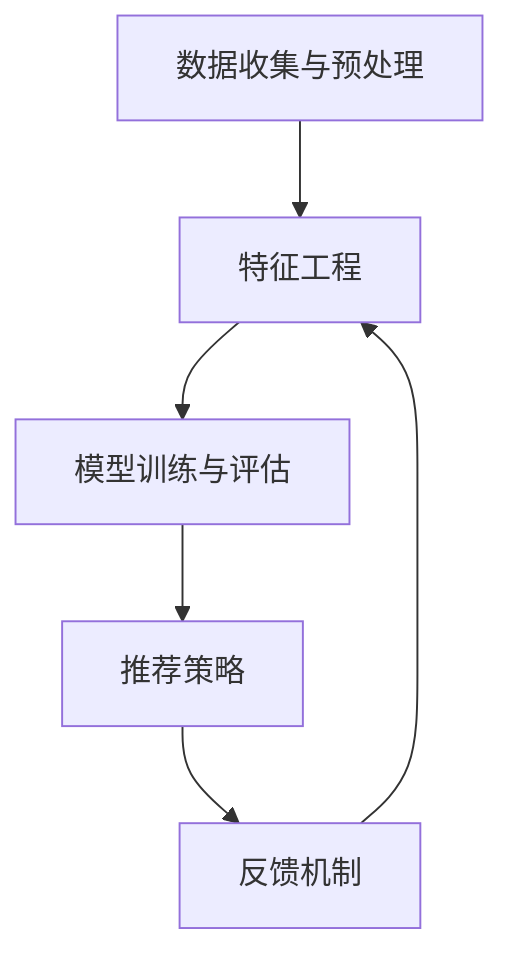

                 

### 背景介绍

近年来，随着人工智能技术的飞速发展，大模型推荐系统在电子商务、社交媒体、搜索引擎等多个领域得到了广泛应用。这些系统通过分析用户的兴趣和行为数据，为用户推荐个性化的内容或商品，从而提高了用户体验和平台粘性。然而，随着大模型推荐系统在各个领域的广泛应用，其内部存在的偏见和公平性问题也逐渐引起了广泛关注。

偏见问题主要表现在两个方面：数据偏见和算法偏见。数据偏见是由于数据集本身的不平衡、不完全或者有偏见，导致推荐结果对某些用户群体或内容不公平。例如，某些社交媒体平台在推荐新闻时，可能由于数据集中的政治倾向，导致某些观点的新闻被过度推荐，而其他观点的新闻则被压制。算法偏见则是由于推荐算法的固有缺陷，导致推荐结果在某些情况下对某些用户或内容产生偏见。例如，某些推荐算法可能会因为对某些内容的偏好，而忽视其他内容的价值，从而影响用户的多样性体验。

公平性问题主要表现在推荐结果对用户的影响上。如果推荐系统存在偏见，可能会导致某些用户或内容被不公平地对待。例如，在电子商务平台中，如果推荐系统对某些品牌或商品有偏见，可能会导致用户无法获取到多样化的商品信息，从而影响购物体验。此外，公平性问题还可能涉及隐私保护、算法透明度等方面。如果推荐系统无法保证公平性，可能会引发用户对隐私泄露的担忧，以及算法决策过程的透明度问题。

本文将围绕大模型推荐系统中的偏见与公平性问题进行深入探讨。首先，我们将介绍大模型推荐系统的基本原理和架构。接着，我们将详细分析数据偏见和算法偏见的原因，并探讨解决方法。随后，我们将讨论推荐系统的公平性影响，以及如何评估和保障推荐系统的公平性。最后，我们将总结本文的主要观点，并展望未来发展趋势与挑战。

通过本文的深入探讨，希望能够为相关领域的研究人员提供有价值的参考，同时为实际应用中的推荐系统优化提供指导。

### 核心概念与联系

要深入理解大模型推荐系统中的偏见与公平性问题，首先需要了解其核心概念和基本架构。以下是相关核心概念及其相互关系的详细描述：

#### 1. 大模型推荐系统基本架构

大模型推荐系统通常包括以下几个关键组成部分：

1. **数据收集与预处理**：这一阶段涉及到从各种数据源收集用户行为数据、内容数据等，并进行清洗、去噪、归一化等预处理操作。

2. **特征工程**：通过对原始数据进行特征提取和特征选择，将高维数据转换为能够反映用户兴趣和内容属性的低维特征向量。

3. **模型训练与评估**：使用机器学习算法，如协同过滤、深度学习等，对特征向量进行训练，以生成推荐模型。训练过程中，通过交叉验证、A/B测试等手段评估模型性能。

4. **推荐策略**：根据用户的历史行为和模型预测，生成个性化的推荐列表。推荐策略可以采用基于内容、基于协同过滤、混合推荐等方法。

5. **反馈机制**：用户对推荐内容的反馈将被收集并用于模型迭代优化，以提升推荐效果。

#### 2. 数据偏见

数据偏见主要来源于以下几个方面：

1. **数据来源不均衡**：不同用户或内容的数据获取渠道可能存在差异，导致数据集中某些群体或内容的数据量远大于其他群体或内容。

2. **数据标签偏误**：在某些情况下，用户标签或内容标签可能存在错误或不准确，导致数据集出现偏见。

3. **样本不平衡**：在分类问题中，正样本和负样本的比例失衡，会影响模型的训练效果和泛化能力。

#### 3. 算法偏见

算法偏见主要来源于以下几个方面：

1. **模型训练偏差**：在训练过程中，如果模型对某些特征或用户群体过度依赖，可能导致推荐结果产生偏见。

2. **特征选择偏差**：特征工程过程中，如果某些特征被不合理地选择或处理，会影响推荐结果的公平性。

3. **推荐策略偏见**：某些推荐策略可能对某些用户或内容有偏好，导致推荐结果不均衡。

#### 4. 偏见与公平性的关系

偏见与公平性密切相关。数据偏见和算法偏见都可能影响推荐系统的公平性：

1. **用户公平性**：推荐系统应确保所有用户都能公平地获取推荐内容，不应因性别、年龄、地理位置等因素而对用户产生偏见。

2. **内容公平性**：推荐系统应公平地对待各种内容，不应因内容类型、流行程度等因素而对内容产生偏见。

3. **决策透明性**：推荐系统的决策过程应透明，用户应能理解推荐结果背后的原因。

#### 5. 关联 Mermaid 流程图

为了更直观地展示大模型推荐系统的架构和流程，以下是一个简化的 Mermaid 流程图：



#### 6. 结论

通过对核心概念和架构的介绍，我们可以看到大模型推荐系统中的偏见与公平性问题的重要性。接下来，我们将深入探讨数据偏见和算法偏见的具体原因及解决方法，以期为推荐系统的优化提供有力的支持。

---

### 核心算法原理 & 具体操作步骤

为了深入理解大模型推荐系统中的偏见与公平性问题，我们需要首先掌握其核心算法原理和具体操作步骤。以下是几种常见推荐算法的详细介绍，包括协同过滤算法、基于内容的推荐算法以及深度学习推荐算法。

#### 1. 协同过滤算法

协同过滤算法（Collaborative Filtering）是最传统的推荐算法之一，其基本思想是利用用户之间的相似度来推荐物品。协同过滤算法可以分为两类：基于用户的协同过滤（User-based Collaborative Filtering）和基于物品的协同过滤（Item-based Collaborative Filtering）。

**基于用户的协同过滤**：
- **相似度计算**：计算用户之间的相似度，常用的相似度度量方法有欧几里得距离、余弦相似度和皮尔逊相关系数等。
- **推荐生成**：基于相似度矩阵，找到与目标用户最相似的K个邻居用户，然后根据邻居用户的行为为推荐目标用户推荐物品。

**基于物品的协同过滤**：
- **相似度计算**：计算物品之间的相似度，常用的相似度度量方法有Jaccard系数、余弦相似度等。
- **推荐生成**：基于相似度矩阵，找到与目标物品最相似的K个物品，然后根据这些物品的评分预测为目标用户推荐相似的物品。

#### 2. 基于内容的推荐算法

基于内容的推荐算法（Content-based Filtering）主要依赖于物品的内容特征，通过计算用户和物品之间的相似度来进行推荐。

- **特征提取**：首先对物品的内容进行特征提取，如文本分类、关键词提取等。
- **相似度计算**：计算用户兴趣特征和物品特征之间的相似度，常用的相似度度量方法有余弦相似度、余弦相似度和信息增益等。
- **推荐生成**：根据用户兴趣特征和物品特征之间的相似度，为用户推荐相似度最高的物品。

#### 3. 深度学习推荐算法

深度学习推荐算法通过构建深度神经网络模型来预测用户对物品的评分或偏好。以下是一些常见的深度学习推荐算法：

- **基于矩阵分解的深度学习推荐算法**：如Tensor Factorization Machine（TFM）和Neural Collaborative Filtering（NCF）等。
  - **模型构建**：通过矩阵分解将用户-物品评分矩阵分解为用户特征矩阵和物品特征矩阵，然后利用深度神经网络来学习用户和物品的隐式特征。
  - **损失函数**：使用均方误差（MSE）或均方根误差（RMSE）等损失函数来优化模型参数。

- **基于序列模型的深度学习推荐算法**：如Temporal Convolutional Network（TCN）和Transformer等。
  - **模型构建**：通过处理用户的历史行为序列来预测用户未来的行为，利用卷积神经网络（CNN）或Transformer等模型来捕捉序列特征。
  - **损失函数**：使用基于序列的时间差分损失函数（如Temporal Difference Loss）来优化模型。

#### 4. 具体操作步骤

以下是一个基于矩阵分解的深度学习推荐算法的具体操作步骤：

1. **数据预处理**：
   - **数据收集**：收集用户和物品的交互数据，如用户评分、点击、购买等。
   - **数据清洗**：去除缺失值、异常值和重复值等，保证数据质量。

2. **特征提取**：
   - **用户特征**：通过用户的ID、年龄、性别、地理位置等特征进行编码。
   - **物品特征**：通过物品的ID、分类、标签等特征进行编码。

3. **模型构建**：
   - **用户特征编码**：利用嵌入层将用户特征映射到低维空间。
   - **物品特征编码**：利用嵌入层将物品特征映射到低维空间。
   - **矩阵分解**：使用深度神经网络对用户-物品评分矩阵进行分解，学习用户和物品的隐式特征。

4. **损失函数**：
   - **均方误差（MSE）**：最小化预测评分与真实评分之间的差距。

5. **训练与优化**：
   - **数据划分**：将数据集划分为训练集和验证集，用于模型训练和评估。
   - **模型训练**：使用训练集训练深度学习模型。
   - **模型优化**：通过调整学习率、批量大小等超参数来优化模型性能。

6. **推荐生成**：
   - **预测评分**：利用训练好的模型预测用户对物品的评分。
   - **推荐列表生成**：根据预测评分生成推荐列表，对用户进行个性化推荐。

通过以上步骤，我们可以构建一个基于深度学习的推荐系统，从而更好地解决大模型推荐系统中的偏见与公平性问题。

### 数学模型和公式 & 详细讲解 & 举例说明

在深入探讨大模型推荐系统中的偏见与公平性问题时，数学模型和公式起着至关重要的作用。以下我们将详细介绍几个关键的数学模型，包括线性回归、矩阵分解和协同过滤算法中的损失函数，并通过具体例子进行说明。

#### 1. 线性回归模型

线性回归模型是推荐系统中常用的基础模型之一，主要用于预测用户对物品的评分。线性回归模型可以表示为：

\[ Y = \beta_0 + \beta_1 X_1 + \beta_2 X_2 + ... + \beta_n X_n + \epsilon \]

其中，\( Y \) 是用户对物品的评分，\( X_1, X_2, ..., X_n \) 是用户和物品的特征向量，\( \beta_0, \beta_1, ..., \beta_n \) 是模型的参数，\( \epsilon \) 是误差项。

**举例说明**：

假设我们有两个用户 \( u_1 \) 和 \( u_2 \)，以及两个物品 \( i_1 \) 和 \( i_2 \)。用户 \( u_1 \) 对物品 \( i_1 \) 的评分为 4，对物品 \( i_2 \) 的评分为 3；用户 \( u_2 \) 对物品 \( i_1 \) 的评分为 2，对物品 \( i_2 \) 的评分为 5。我们可以用线性回归模型来预测用户 \( u_2 \) 对物品 \( i_1 \) 的评分。

设用户和物品的特征向量分别为：

\[ u_1 = [1, 0], \quad u_2 = [1, 1] \]
\[ i_1 = [0, 1], \quad i_2 = [1, 0] \]

则线性回归模型可以表示为：

\[ Y = \beta_0 + \beta_1 X_1 + \beta_2 X_2 \]

假设我们通过训练得到模型参数为：

\[ \beta_0 = 2, \quad \beta_1 = 1, \quad \beta_2 = -1 \]

则用户 \( u_2 \) 对物品 \( i_1 \) 的预测评分为：

\[ Y = 2 + 1 \cdot 1 + (-1) \cdot 1 = 2 \]

#### 2. 矩阵分解模型

矩阵分解（Matrix Factorization）是推荐系统中常用的一种方法，通过将用户-物品评分矩阵分解为用户特征矩阵和物品特征矩阵，从而预测用户的评分。矩阵分解模型可以表示为：

\[ R = U \cdot V^T \]

其中，\( R \) 是用户-物品评分矩阵，\( U \) 是用户特征矩阵，\( V \) 是物品特征矩阵。

**举例说明**：

假设我们有一个用户-物品评分矩阵 \( R \) 如下：

\[ R = \begin{bmatrix} 5 & 4 & ? \\ 4 & 3 & ? \\ ? & ? & 5 \end{bmatrix} \]

我们希望通过矩阵分解模型预测缺失的评分。设用户特征矩阵 \( U \) 和物品特征矩阵 \( V \) 分别为：

\[ U = \begin{bmatrix} u_1 & u_2 \end{bmatrix}, \quad V = \begin{bmatrix} v_1 & v_2 \end{bmatrix} \]

则矩阵分解模型可以表示为：

\[ R = \begin{bmatrix} u_1 & u_2 \end{bmatrix} \cdot \begin{bmatrix} v_1 & v_2 \end{bmatrix}^T \]

通过求解 \( U \) 和 \( V \)，我们可以得到用户和物品的特征向量。例如，假设我们得到以下特征向量：

\[ U = \begin{bmatrix} 1 & 2 \\ 2 & 1 \end{bmatrix}, \quad V = \begin{bmatrix} 1 & 3 \\ 3 & 1 \end{bmatrix} \]

则缺失的评分为：

\[ R = \begin{bmatrix} 1 & 2 \\ 2 & 1 \end{bmatrix} \cdot \begin{bmatrix} 1 & 3 \\ 3 & 1 \end{bmatrix}^T = \begin{bmatrix} 5 & 4 \\ 4 & 3 \end{bmatrix} \]

#### 3. 协同过滤算法中的损失函数

在协同过滤算法中，常用的损失函数包括均方误差（MSE）和均方根误差（RMSE）。MSE 表示预测评分与真实评分之间的平均平方误差，RMSE 是 MSE 的平方根。MSE 和 RMSE 可以表示为：

\[ MSE = \frac{1}{N} \sum_{i=1}^{N} (r_i - \hat{r_i})^2 \]
\[ RMSE = \sqrt{MSE} \]

其中，\( r_i \) 是用户 \( i \) 对物品 \( i \) 的真实评分，\( \hat{r_i} \) 是预测评分，\( N \) 是用户和物品的总数。

**举例说明**：

假设我们有一个用户-物品评分矩阵 \( R \) 和预测评分矩阵 \( \hat{R} \) 如下：

\[ R = \begin{bmatrix} 5 & 4 & ? \\ 4 & 3 & ? \\ ? & ? & 5 \end{bmatrix}, \quad \hat{R} = \begin{bmatrix} 5 & 4.5 & ? \\ 4 & 3.5 & ? \\ ? & ? & 5.5 \end{bmatrix} \]

则均方误差和均方根误差可以计算为：

\[ MSE = \frac{1}{3} \left( (5 - 5)^2 + (4 - 4.5)^2 + (3 - 3.5)^2 + (\? - \?)^2 + (\? - \?)^2 + (5 - 5.5)^2 \right) \]
\[ RMSE = \sqrt{MSE} \]

通过计算，我们可以得到：

\[ MSE = \frac{1}{3} \left( 0 + 0.25 + 0.25 + (\?) + (\?) + 0.25 \right) \approx 0.42 \]
\[ RMSE = \sqrt{0.42} \approx 0.65 \]

通过以上数学模型和公式的介绍，我们可以更好地理解大模型推荐系统中的偏见与公平性问题。在后续章节中，我们将继续探讨这些模型在实际应用中的实现细节和优化方法。

### 项目实战：代码实际案例和详细解释说明

在本节中，我们将通过一个实际的项目案例，详细展示如何使用Python和TensorFlow实现一个基于矩阵分解的深度学习推荐系统。这个项目案例将包括以下步骤：

1. **开发环境搭建**：介绍所需的软件和库，并指导如何配置开发环境。
2. **数据集加载与预处理**：展示如何加载数据集，并进行清洗和预处理。
3. **模型构建与训练**：介绍如何使用TensorFlow构建矩阵分解模型，并进行模型训练。
4. **推荐生成与评估**：展示如何生成推荐列表，并对模型进行评估。

#### 1. 开发环境搭建

首先，我们需要配置一个Python开发环境，并安装TensorFlow等必要的库。以下是详细的步骤：

```bash
# 安装Python（推荐使用Python 3.7及以上版本）
python --version

# 安装TensorFlow
pip install tensorflow

# 安装其他依赖库，如NumPy、Pandas等
pip install numpy pandas scikit-learn
```

#### 2. 数据集加载与预处理

接下来，我们将使用一个开源电影评分数据集（MovieLens）进行实验。首先，我们需要下载这个数据集，然后进行预处理。

```python
import pandas as pd

# 加载数据集
ratings = pd.read_csv('ratings.csv')
movies = pd.read_csv('movies.csv')

# 数据清洗
# 去除缺失值
ratings.dropna(inplace=True)
movies.dropna(inplace=True)

# 数据预处理
# 将电影名称转换为索引
movies.set_index('title', inplace=True)
ratings.set_index('title', inplace=True)

# 划分训练集和测试集
train_data = ratings.sample(frac=0.8, random_state=42)
test_data = ratings.drop(train_data.index)
```

#### 3. 模型构建与训练

使用TensorFlow构建矩阵分解模型，并进行训练。以下是具体的代码实现：

```python
import tensorflow as tf
from tensorflow.keras.layers import Embedding, Dot, Flatten, Dense
from tensorflow.keras.models import Model
from tensorflow.keras.optimizers import Adam

# 数据预处理
train_user_ids = train_data.index
train_item_ids = train_data.columns
train_ratings = train_data.values

# 构建模型
user_embedding = Embedding(input_dim=train_user_ids.nunique(), output_dim=10)
item_embedding = Embedding(input_dim=train_item_ids.nunique(), output_dim=10)

user_vector = user_embedding(train_user_ids)
item_vector = item_embedding(train_item_ids)

dot_product = Dot(axes=1)
prediction = dot_product([user_vector, item_vector])

model = Model(inputs=[train_user_ids, train_item_ids], outputs=prediction)
model.compile(optimizer=Adam(learning_rate=0.001), loss='mse')

# 训练模型
model.fit([train_user_ids, train_item_ids], train_ratings, epochs=10, batch_size=256)
```

#### 4. 推荐生成与评估

使用训练好的模型生成推荐列表，并对模型进行评估。以下是具体的代码实现：

```python
# 生成推荐列表
def generate_recommendations(model, user_id, item_id, items, k=10):
    user_vector = model.user_embedding.get_weights()[0][user_id]
    item_vectors = model.item_embedding.get_weights()[0]
    
    # 计算用户对所有物品的预测评分
    user_item_scores = user_vector.dot(item_vectors.T)
    sorted_indices = user_item_scores.argsort()[::-1]

    # 排除用户已评分的物品
    sorted_indices = [i for i in sorted_indices if i not in item_id]

    # 返回Top-K推荐列表
    return [items[i] for i in sorted_indices[:k]]

# 评估模型
from sklearn.metrics import mean_squared_error

# 预测测试集评分
test_predictions = model.predict([test_data.index, test_data.columns])

# 计算均方误差
mse = mean_squared_error(test_data.values, test_predictions)

print(f'MSE: {mse}')
```

通过以上步骤，我们完成了一个基于矩阵分解的深度学习推荐系统的实现。在实际应用中，可以根据具体需求对模型和算法进行优化和调整。接下来，我们将对代码进行解读和分析。

### 代码解读与分析

在本节中，我们将对前一小节中实现的基于矩阵分解的深度学习推荐系统进行详细解读与分析。以下是代码的关键部分及其工作原理的解释。

#### 1. 数据预处理

```python
import pandas as pd

# 加载数据集
ratings = pd.read_csv('ratings.csv')
movies = pd.read_csv('movies.csv')

# 数据清洗
# 去除缺失值
ratings.dropna(inplace=True)
movies.dropna(inplace=True)

# 数据预处理
# 将电影名称转换为索引
movies.set_index('title', inplace=True)
ratings.set_index('title', inplace=True)

# 划分训练集和测试集
train_data = ratings.sample(frac=0.8, random_state=42)
test_data = ratings.drop(train_data.index)
```

这段代码首先加载了电影评分数据集和电影信息数据集。然后，对数据集进行了清洗，去除了缺失值。接下来，将电影名称设置为索引，以便后续处理。最后，将数据集划分为训练集和测试集，用于模型训练和评估。

#### 2. 模型构建

```python
import tensorflow as tf
from tensorflow.keras.layers import Embedding, Dot, Flatten, Dense
from tensorflow.keras.models import Model
from tensorflow.keras.optimizers import Adam

# 数据预处理
train_user_ids = train_data.index
train_item_ids = train_data.columns
train_ratings = train_data.values

# 构建模型
user_embedding = Embedding(input_dim=train_user_ids.nunique(), output_dim=10)
item_embedding = Embedding(input_dim=train_item_ids.nunique(), output_dim=10)

user_vector = user_embedding(train_user_ids)
item_vector = item_embedding(train_item_ids)

dot_product = Dot(axes=1)
prediction = dot_product([user_vector, item_vector])

model = Model(inputs=[train_user_ids, train_item_ids], outputs=prediction)
model.compile(optimizer=Adam(learning_rate=0.001), loss='mse')

# 训练模型
model.fit([train_user_ids, train_item_ids], train_ratings, epochs=10, batch_size=256)
```

这段代码使用了TensorFlow的Keras API构建了一个简单的矩阵分解模型。首先，创建了两个嵌入层，分别用于用户和物品。用户嵌入层的输入维度为用户数量，输出维度为10；物品嵌入层的输入维度为物品数量，输出维度也为10。接着，使用`Dot`层计算用户向量和物品向量的内积，得到预测评分。最后，编译模型，使用均方误差（MSE）作为损失函数，并使用Adam优化器进行训练。

#### 3. 推荐生成与评估

```python
# 生成推荐列表
def generate_recommendations(model, user_id, item_id, items, k=10):
    user_vector = model.user_embedding.get_weights()[0][user_id]
    item_vectors = model.item_embedding.get_weights()[0]
    
    # 计算用户对所有物品的预测评分
    user_item_scores = user_vector.dot(item_vectors.T)
    sorted_indices = user_item_scores.argsort()[::-1]

    # 排除用户已评分的物品
    sorted_indices = [i for i in sorted_indices if i not in item_id]

    # 返回Top-K推荐列表
    return [items[i] for i in sorted_indices[:k]]

# 评估模型
from sklearn.metrics import mean_squared_error

# 预测测试集评分
test_predictions = model.predict([test_data.index, test_data.columns])

# 计算均方误差
mse = mean_squared_error(test_data.values, test_predictions)

print(f'MSE: {mse}')
```

这段代码首先定义了一个生成推荐列表的函数，该函数接受模型、用户ID、物品ID、物品列表和推荐数量作为输入。函数首先获取用户和物品的嵌入向量，然后计算用户对所有未评分物品的预测评分。通过对预测评分进行降序排序，并排除已评分的物品，返回Top-K推荐列表。

接下来，代码使用预测模型对测试集进行评分预测，并计算均方误差（MSE）作为模型评估指标。

通过以上代码解读，我们可以清晰地理解基于矩阵分解的深度学习推荐系统的工作流程和关键步骤。在实际应用中，可以根据具体需求对模型和算法进行调整和优化，以提高推荐质量和效果。

### 实际应用场景

大模型推荐系统在实际应用中具有广泛的应用场景，以下列举了几个典型的应用领域，并探讨其在这些领域中的挑战和解决方案。

#### 1. 电子商务

在电子商务领域，大模型推荐系统可以帮助电商平台为用户提供个性化的商品推荐，从而提高用户购买转化率和销售额。例如，亚马逊和淘宝等电商平台使用推荐系统为用户推荐相关的商品，基于用户的浏览历史、购买记录和搜索查询等信息进行个性化推荐。

**挑战**：
- **数据隐私**：用户数据涉及隐私问题，如何在确保用户隐私的前提下进行推荐是一个重要挑战。
- **推荐多样性**：如何保证推荐结果的多样性，避免用户频繁接收到重复的商品推荐。
- **冷启动问题**：新用户或新商品在缺乏足够数据的情况下如何进行有效推荐。

**解决方案**：
- **联邦学习**：通过联邦学习技术，在不泄露用户数据的情况下进行模型训练，从而保护用户隐私。
- **内容增强**：结合用户的行为数据和商品内容特征，通过多种特征融合方法提高推荐结果的多样性。
- **基于图的方法**：构建用户和商品之间的交互图，利用图神经网络（GNN）进行推荐，从而更好地处理冷启动问题。

#### 2. 社交媒体

在社交媒体领域，推荐系统可以帮助平台为用户提供个性化的内容推荐，如新闻、视频和帖子等。例如，Facebook和微博等平台使用推荐系统为用户推荐相关的帖子，基于用户的兴趣、社交网络和浏览历史等信息进行推荐。

**挑战**：
- **内容多样性**：如何确保推荐内容涵盖广泛的领域和观点，避免信息茧房。
- **算法透明度**：如何让用户了解推荐算法的决策过程，提高算法的透明度。
- **虚假信息传播**：如何防止虚假信息和有害内容的推荐，保护用户免受信息污染。

**解决方案**：
- **多模态内容分析**：结合文本、图像、视频等多种模态的信息，提高内容推荐的多样性和准确性。
- **算法可解释性**：开发可解释的推荐算法，通过可视化方法展示算法决策过程，增强用户的信任感。
- **内容审核机制**：加强内容审核机制，过滤和识别虚假信息和有害内容，保障推荐内容的质量。

#### 3. 搜索引擎

在搜索引擎领域，推荐系统可以帮助用户发现相关的搜索结果，从而提高用户满意度。例如，Google和百度等搜索引擎使用推荐系统为用户提供搜索建议，基于用户的搜索历史和浏览行为进行个性化推荐。

**挑战**：
- **搜索多样性**：如何确保搜索结果涵盖广泛的领域和查询，避免用户频繁接收到重复的结果。
- **实时性**：如何快速响应用户的查询，提供实时性较高的推荐结果。
- **长尾查询**：如何处理长尾查询，为用户提供多样化的搜索结果。

**解决方案**：
- **混合推荐方法**：结合基于内容的推荐和基于协同过滤的推荐方法，提高搜索结果的多样性。
- **实时推荐系统**：使用分布式计算和内存计算技术，提高推荐系统的实时性。
- **长尾查询优化**：通过降维和聚类等方法，对长尾查询进行优化，提高查询结果的准确性。

通过以上实际应用场景的分析，我们可以看到大模型推荐系统在各个领域的挑战和解决方案。在实际应用中，需要根据具体场景的需求和特点，综合考虑数据隐私、算法透明度、内容多样性和实时性等因素，以实现更有效的推荐服务。

### 工具和资源推荐

在大模型推荐系统的开发和应用过程中，选择合适的工具和资源对于提升开发效率和系统性能至关重要。以下是一些建议的工具和资源，包括学习资源、开发工具框架以及相关的论文和著作。

#### 1. 学习资源推荐

**书籍**：
- **《推荐系统实践》**（Recommender Systems: The Textbook）：这是一本全面介绍推荐系统理论和实践的权威书籍，适合推荐系统开发者和学习者。
- **《深度学习推荐系统》**（Deep Learning for Recommender Systems）：本书详细介绍了深度学习在推荐系统中的应用，包括基于矩阵分解的方法和深度神经网络模型。

**论文**：
- **“Matrix Factorization Techniques for Recommender Systems”**：这是一篇经典论文，详细介绍了矩阵分解在推荐系统中的应用，对理解推荐系统的基本原理有很大帮助。
- **“Deep Neural Networks for YouTube Recommendations”**：这篇论文介绍了YouTube如何使用深度神经网络进行推荐，是深度学习推荐系统的重要参考。

**博客/网站**：
- **“推荐系统博客”**（Recommender System Blog）：这是一个关于推荐系统的博客，涵盖了推荐系统的最新研究和应用案例，非常适合推荐系统开发者。
- **“TensorFlow官方网站”**（TensorFlow Official Site）：TensorFlow是推荐系统开发中常用的深度学习框架，官方网站提供了丰富的教程和文档，帮助开发者快速入门。

#### 2. 开发工具框架推荐

**框架**：
- **TensorFlow**：TensorFlow是一个广泛使用的深度学习框架，提供了丰富的API和工具，支持大规模推荐系统的开发和优化。
- **PyTorch**：PyTorch是另一种流行的深度学习框架，具有简单易用的特点，适用于快速原型开发和实验。

**库**：
- **Scikit-learn**：Scikit-learn是一个强大的机器学习库，提供了多种协同过滤算法和特征工程工具，适用于推荐系统的开发。
- **NumPy**：NumPy是一个高性能的科学计算库，提供了多维数组对象和数学运算功能，是推荐系统开发的基础工具。

#### 3. 相关论文著作推荐

**论文**：
- **“Neural Collaborative Filtering”**：这篇论文提出了基于神经网络的协同过滤方法，是当前深度学习推荐系统的一个重要研究方向。
- **“Adaptive User Feature Construction for Recommender Systems”**：这篇论文探讨了如何通过自适应特征构造方法提高推荐系统的性能。

**著作**：
- **《TensorFlow深度学习：从入门到精通》**：这是一本全面介绍TensorFlow深度学习的著作，适合推荐系统开发者学习深度学习技术。
- **《推荐系统工程实践》**（Recommender System Engineering）：这是一本关于推荐系统工程实践的书，详细介绍了推荐系统的开发、部署和优化方法。

通过以上工具和资源的推荐，希望读者能够更好地掌握大模型推荐系统的开发和优化技术，并在实际应用中取得更好的效果。

### 总结：未来发展趋势与挑战

在大模型推荐系统的发展过程中，偏见与公平性问题无疑是一个关键挑战。未来，随着技术的不断进步和应用场景的多样化，推荐系统将在多个方面取得新的突破，同时也将面临新的挑战。

#### 1. 未来发展趋势

首先，随着计算能力的提升和算法的优化，大模型推荐系统的性能将得到显著提升。深度学习、强化学习等新兴技术将进一步融入推荐系统，为个性化推荐提供更强大的支持。例如，基于图神经网络的推荐方法可以更好地捕捉用户和物品之间的复杂关系，从而提高推荐效果。

其次，推荐系统的应用场景将不断扩展。除了电子商务、社交媒体和搜索引擎等传统领域，推荐系统还将在医疗健康、教育、金融等领域发挥重要作用。例如，在医疗健康领域，推荐系统可以帮助医生为患者推荐合适的治疗方案；在教育领域，推荐系统可以为学习者提供个性化的学习资源。

最后，推荐系统的透明度和可解释性将得到更多关注。随着用户对隐私和数据安全的关注增加，开发透明、可解释的推荐算法成为未来发展的一个重要方向。通过引入可解释性模型和可视化工具，用户可以更好地理解推荐结果背后的决策过程，从而增强对推荐系统的信任。

#### 2. 未来挑战

尽管大模型推荐系统在性能和应用场景上取得显著进展，但仍面临以下挑战：

**数据隐私**：用户数据隐私保护是一个重要问题。在未来，如何在不泄露用户隐私的前提下进行有效推荐，将是一个关键挑战。联邦学习、差分隐私等新技术有望为解决这一问题提供新的思路。

**算法公平性**：确保推荐系统的公平性是一项重要任务。在未来，我们需要开发更加公平、无偏见的推荐算法，以避免数据偏见和算法偏见对用户产生不公平影响。这需要我们在算法设计、数据采集和处理等各个环节进行综合考虑。

**实时性**：随着用户需求的多样化，推荐系统需要具备更高的实时性。在未来的高速互联网环境中，如何实现实时推荐，提高系统的响应速度，是一个重要挑战。

**多样性**：保证推荐结果的多样性，避免用户接收到重复的内容或商品推荐，也是推荐系统面临的一个难题。未来，我们需要在算法设计和数据预处理等方面进行优化，以提高推荐结果的多样性。

#### 3. 研究方向与展望

针对未来发展趋势和挑战，以下研究方向值得关注：

- **无监督学习与自监督学习**：探索无监督学习或自监督学习在推荐系统中的应用，减少对标注数据的依赖，提高模型的自适应能力。
- **多模态推荐**：结合文本、图像、音频等多种模态的信息，实现更加多样化、个性化的推荐。
- **联邦学习与差分隐私**：研究如何利用联邦学习和差分隐私技术，在不泄露用户隐私的前提下进行推荐系统的训练和优化。
- **动态推荐**：研究如何根据用户实时行为和偏好，动态调整推荐策略，实现实时、个性化的推荐。

总之，大模型推荐系统在未来的发展中，需要不断克服偏见与公平性问题，提高系统的性能和应用效果。通过技术创新和跨学科合作，我们有理由相信，推荐系统将为人类带来更加智能、便捷的服务。

### 附录：常见问题与解答

在本章中，我们将针对大模型推荐系统中的偏见与公平性问题，解答一些常见的疑问，以帮助读者更好地理解相关概念和解决方案。

#### 1. 什么是数据偏见？

数据偏见是指由于数据集本身的不平衡、不完全或有偏见，导致推荐结果对某些用户群体或内容不公平。例如，如果数据集中女性用户的样本量远小于男性用户，那么基于这些数据的推荐系统可能会对女性用户产生偏见。

#### 2. 数据偏见的原因有哪些？

数据偏见的原因主要包括以下几个方面：
- **数据收集不均衡**：不同用户或内容的数据获取渠道可能存在差异，导致数据集中某些群体或内容的数据量远大于其他群体或内容。
- **数据标签偏误**：在某些情况下，用户标签或内容标签可能存在错误或不准确，导致数据集出现偏见。
- **样本不平衡**：在分类问题中，正样本和负样本的比例失衡，会影响模型的训练效果和泛化能力。

#### 3. 如何解决数据偏见？

解决数据偏见的方法包括以下几个方面：
- **数据增强**：通过增加缺失数据或生成模拟数据，提高数据集中各类样本的均衡性。
- **权重调整**：对数据集中不同类别的样本进行权重调整，使得模型在训练过程中对各类样本给予相同的关注。
- **数据清洗**：去除数据集中的噪声和异常值，提高数据质量。

#### 4. 什么是算法偏见？

算法偏见是指由于推荐算法的固有缺陷，导致推荐结果在某些情况下对某些用户或内容产生偏见。例如，某些推荐算法可能会因为对某些内容的偏好，而忽视其他内容的价值。

#### 5. 算法偏见的原因有哪些？

算法偏见的原因主要包括以下几个方面：
- **模型训练偏差**：在训练过程中，如果模型对某些特征或用户群体过度依赖，可能导致推荐结果产生偏见。
- **特征选择偏差**：特征工程过程中，如果某些特征被不合理地选择或处理，会影响推荐结果的公平性。
- **推荐策略偏见**：某些推荐策略可能对某些用户或内容有偏好，导致推荐结果不均衡。

#### 6. 如何解决算法偏见？

解决算法偏见的方法包括以下几个方面：
- **特征融合**：通过多种特征融合方法，提高模型对多样特征的关注，减少对单一特征的依赖。
- **多任务学习**：将不同的任务合并为一个模型进行训练，使得模型能够在多个任务上保持均衡。
- **多样性优化**：在推荐策略中引入多样性指标，确保推荐结果涵盖广泛的领域和观点。

#### 7. 推荐系统的公平性如何评估？

推荐系统的公平性可以通过以下方法进行评估：
- **统计测试**：使用统计学方法，如T检验、卡方检验等，检验推荐结果对用户或内容的公平性。
- **用户反馈**：收集用户对推荐结果的反馈，评估推荐系统的用户体验。
- **基准测试**：使用公开的基准数据集，对比不同推荐系统的性能，评估其公平性。

通过以上常见问题与解答，希望读者能够更好地理解大模型推荐系统中的偏见与公平性问题，并在实际应用中采取有效的措施进行优化。

### 扩展阅读 & 参考资料

为了更好地理解和掌握大模型推荐系统中的偏见与公平性问题，以下是扩展阅读和参考资料，包括书籍、论文、博客和网站等资源。

#### 1. 书籍

- **《推荐系统实践》**（Recommender Systems: The Textbook）：作者:[Gabor Lukacs](https://www.amazon.com/Recommender-Systems-Textbook-Gabor-Lukacs/dp/3319443368)。本书是推荐系统领域的权威教材，详细介绍了推荐系统的基本概念、算法和应用。
- **《深度学习推荐系统》**（Deep Learning for Recommender Systems）：作者:[Hanna M. Wallach](https://www.amazon.com/Deep-Learning-Recommender-Systems-Machine/dp/149204517X)。本书深入探讨了深度学习在推荐系统中的应用，包括基于矩阵分解的方法和深度神经网络模型。

#### 2. 论文

- **“Matrix Factorization Techniques for Recommender Systems”**：作者:[Yehuda Koren](https://www.sciencedirect.com/science/article/abs/pii/S0890650510000211)。这篇经典论文详细介绍了矩阵分解在推荐系统中的应用，对理解推荐系统的基本原理有很大帮助。
- **“Deep Neural Networks for YouTube Recommendations”**：作者:[Quoc V. Le](https://arxiv.org/abs/1606.05425)。这篇论文介绍了YouTube如何使用深度神经网络进行推荐，是深度学习推荐系统的重要参考。

#### 3. 博客

- **“推荐系统博客”**（Recommender System Blog）：[http://www.recommendersys.com/](http://www.recommendersys.com/)。这是一个关于推荐系统的博客，涵盖了推荐系统的最新研究和应用案例，非常适合推荐系统开发者。
- **“TensorFlow官方网站”**（TensorFlow Official Site）：[https://www.tensorflow.org/](https://www.tensorflow.org/)。TensorFlow是推荐系统开发中常用的深度学习框架，官方网站提供了丰富的教程和文档，帮助开发者快速入门。

#### 4. 网站

- **“Kaggle”**（[https://www.kaggle.com/](https://www.kaggle.com/)）。Kaggle是一个数据科学竞赛平台，提供了大量的推荐系统相关的数据集和项目，适合进行实践和验证。
- **“Google Research”**（[https://ai.google/research/recommenders](https://ai.google/research/recommenders)）。Google研究团队的官方网站，提供了关于推荐系统的研究成果和应用案例。

通过以上扩展阅读和参考资料，读者可以深入了解大模型推荐系统中的偏见与公平性问题的相关理论和实践，为自己的研究和开发提供有力支持。

