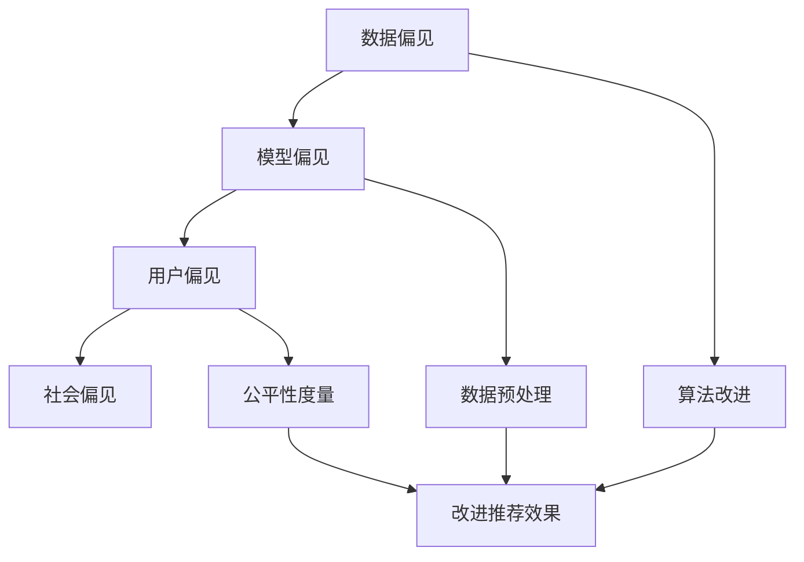

                 

## 大模型推荐系统的偏见消除方法

### 摘要

本文旨在探讨大模型推荐系统中偏见消除的方法。随着大数据和人工智能技术的迅猛发展，推荐系统已经成为我们日常生活中不可或缺的一部分。然而，推荐系统中的偏见问题也逐渐显现出来，严重影响了用户体验和系统的公平性。本文将首先介绍推荐系统的基本概念和偏见问题，然后深入分析偏见产生的原因，并提出一系列消除偏见的方法，包括算法改进、数据预处理、公平性度量等。通过本文的阅读，读者将对推荐系统的偏见问题有更深入的理解，并能够掌握一系列有效的消除偏见的方法。

### 背景介绍

推荐系统是一种基于用户历史行为和兴趣信息，为用户推荐相关商品、服务或内容的人工智能系统。在电子商务、社交媒体、视频平台等各个领域，推荐系统都发挥着至关重要的作用。推荐系统的工作原理主要包括以下几步：

1. **数据收集**：从用户的浏览历史、购买记录、评论等行为数据中收集信息。
2. **用户建模**：基于用户的历史行为数据，构建用户兴趣模型。
3. **物品建模**：对推荐系统中的所有物品进行建模，通常使用嵌入向量或特征向量表示。
4. **推荐算法**：使用算法计算用户与物品之间的相似度或相关性，生成推荐列表。

尽管推荐系统在提升用户体验和增加收益方面取得了显著成果，但其偏见问题也逐渐受到关注。偏见问题主要表现在以下几个方面：

- **性别偏见**：在推荐商品或内容时，系统可能倾向于推荐与用户性别相关的物品，从而忽略了用户的实际兴趣。
- **地域偏见**：推荐系统可能会根据用户的地理位置推荐与其地理位置相关的商品或内容，导致用户无法接触到更广泛的信息。
- **年龄偏见**：系统可能根据用户的年龄推荐相应的商品或内容，从而限制了用户的兴趣发展。

这些偏见问题不仅影响了用户体验，还可能导致系统失去公平性，甚至加剧社会不平等。因此，消除推荐系统中的偏见问题具有重要的现实意义和学术价值。

### 核心概念与联系

为了深入探讨推荐系统中的偏见问题，我们需要理解一些核心概念和它们之间的联系。以下是本文中涉及到的关键概念及其关系：

#### 1. 数据偏见

数据偏见是指数据集中存在的不合理倾向，这种倾向可能来自数据收集、处理或标注过程中的错误。例如，在电子商务领域，如果推荐系统只收集了特定性别或年龄段用户的购买记录，那么系统就可能存在性别或年龄偏见。

#### 2. 模型偏见

模型偏见是指推荐算法本身可能存在的偏见。常见的模型偏见包括：

- **过拟合**：模型过于依赖训练数据中的噪声，导致在新数据上表现不佳。
- **数据不平衡**：推荐系统中的数据不平衡可能导致某些群体被过度推荐或忽略。
- **反馈循环**：系统根据用户的反馈不断调整推荐策略，可能导致用户陷入信息茧房，无法接触到多样化信息。

#### 3. 用户偏见

用户偏见是指用户在互动过程中可能表现出的偏见。例如，用户可能因为习惯或偏见而选择性地接受某些推荐，从而影响系统的后续推荐。

#### 4. 社会偏见

社会偏见是指推荐系统可能放大或加强的社会不平等。例如，如果推荐系统倾向于推荐与用户种族、宗教或政治观点相关的信息，那么就可能加剧社会分裂。

#### 5. 偏见消除方法

偏见消除方法主要包括以下几种：

- **算法改进**：通过改进推荐算法，减少数据偏见和模型偏见。
- **数据预处理**：清洗和平衡数据集，消除数据偏见。
- **公平性度量**：使用公平性度量指标评估推荐系统的公平性，并提出相应的改进措施。

为了更直观地展示这些概念和它们之间的联系，我们可以使用Mermaid流程图来表示：



通过上述流程图，我们可以看到偏见问题在不同层面上影响推荐系统，而偏见消除方法则从不同角度出发，旨在提升系统的公平性和准确性。

#### 1.1. 数据偏见

数据偏见是指在数据收集、处理或标注过程中引入的不合理性，这种不合理性可能导致推荐系统产生偏见。数据偏见的来源包括但不限于以下几点：

- **采样偏差**：在数据收集过程中，如果采样方法不科学，可能导致样本不能代表整体，从而引入偏见。
- **标注偏差**：在数据标注过程中，标注员的主观判断可能导致数据标注不准确，进而引入偏见。
- **噪声数据**：数据集中可能包含大量噪声数据，这些数据会影响模型训练和推荐效果。

数据偏见的危害主要表现在以下几个方面：

- **降低推荐质量**：数据偏见可能导致推荐系统推荐不准确或不相关的物品，降低用户体验。
- **放大社会偏见**：如果推荐系统中的数据偏见与用户群体的偏见一致，那么系统可能会放大社会偏见，加剧不平等现象。
- **损害品牌形象**：如果用户发现推荐系统存在偏见，可能会对品牌形象产生负面影响，降低用户信任度。

为了消除数据偏见，我们可以采取以下措施：

- **数据清洗**：通过数据清洗技术，去除数据集中的噪声和错误数据，提高数据质量。
- **采样方法改进**：采用更加科学的采样方法，确保样本能够代表整体。
- **数据标注流程优化**：优化数据标注流程，减少标注偏差。
- **引入外部数据源**：通过引入多样化的外部数据源，平衡系统中的数据偏见。

#### 1.2. 模型偏见

模型偏见是指推荐算法本身可能存在的偏见，这种偏见可能来自算法设计、训练数据或模型优化过程。模型偏见的类型包括但不限于以下几点：

- **过拟合**：模型过于依赖训练数据中的噪声，导致在新数据上表现不佳，甚至产生误导性推荐。
- **数据不平衡**：如果训练数据不平衡，模型可能会过度关注某些类别，从而忽略其他类别。
- **反馈循环**：系统根据用户的反馈不断调整推荐策略，可能导致用户陷入信息茧房，无法接触到多样化信息。

模型偏见的危害主要表现在以下几个方面：

- **降低推荐准确性**：模型偏见可能导致推荐系统推荐不准确或不相关的物品，降低用户体验。
- **损害系统公平性**：如果模型偏见与用户群体的偏见一致，那么系统可能会损害公平性，加剧社会不平等。
- **限制用户视野**：用户可能因为模型偏见而接触到有限的信息，限制其视野和兴趣发展。

为了消除模型偏见，我们可以采取以下措施：

- **模型优化**：通过改进模型设计，减少模型偏见，例如使用正则化技术或集成学习。
- **数据平衡**：通过数据增强或类别平衡技术，确保训练数据中的各个类别都有足够的代表性。
- **多样性度量**：引入多样性度量指标，确保推荐结果的多样性，避免用户陷入信息茧房。
- **持续评估与改进**：定期评估推荐系统的偏见问题，并根据评估结果进行相应的优化。

### 核心算法原理 & 具体操作步骤

在消除推荐系统中的偏见问题方面，核心算法原理和方法至关重要。以下我们将介绍几种常用的算法原理和具体操作步骤，以帮助读者更好地理解和实施偏见消除策略。

#### 2.1. 模糊逻辑

模糊逻辑是一种基于模糊集合理论的数学方法，用于处理不确定性和模糊性。在推荐系统中，模糊逻辑可以用来建模用户和物品之间的模糊关系，从而减少数据偏见和模型偏见。

**具体操作步骤**：

1. **定义模糊集合**：首先，将用户和物品的特征空间定义为模糊集合。例如，用户的兴趣可以表示为“喜欢音乐”，“喜欢运动”，“喜欢阅读”等模糊集合。

2. **建立隶属函数**：为每个模糊集合建立隶属函数，用于描述用户对某个特征的兴趣程度。隶属函数通常采用分段线性函数或三角形函数。

3. **计算模糊关系**：使用模糊逻辑运算符（如模糊交、模糊并、模糊补等）计算用户和物品之间的模糊关系。

4. **推荐生成**：根据模糊关系生成推荐列表。推荐列表中的物品应具有较高的模糊相似度。

#### 2.2. 聚类算法

聚类算法是一种无监督学习方法，用于将相似的数据点划分为不同的簇。在推荐系统中，聚类算法可以用来发现用户和物品之间的隐含关系，从而减少数据偏见和模型偏见。

**具体操作步骤**：

1. **数据预处理**：对用户和物品的特征进行标准化处理，以消除不同特征之间的尺度差异。

2. **选择聚类算法**：选择适合的聚类算法，如K-means、层次聚类、DBSCAN等。K-means算法是一种常用的聚类算法，适用于用户和物品特征较为明显的场景。

3. **初始化聚类中心**：随机选择初始聚类中心，或使用优化算法（如K-means++）选择更好的聚类中心。

4. **聚类过程**：将每个用户或物品分配到最近的聚类中心，并更新聚类中心的位置。

5. **推荐生成**：根据聚类结果生成推荐列表。推荐列表中的物品应与用户所在的簇中的物品具有较高的相似度。

#### 2.3. 强化学习

强化学习是一种基于奖励机制的学习方法，用于训练智能体在特定环境中做出最优决策。在推荐系统中，强化学习可以用来优化推荐策略，减少偏见。

**具体操作步骤**：

1. **定义环境**：将推荐系统视为一个环境，用户行为和推荐结果作为环境的状态和动作。

2. **定义奖励机制**：定义一个奖励函数，用于评估推荐结果的优劣。奖励函数可以基于用户的点击率、购买率、满意度等指标。

3. **训练模型**：使用强化学习算法（如Q-learning、Deep Q-Networks等）训练推荐模型，使其能够根据环境状态和动作选择最优动作。

4. **推荐生成**：根据训练好的模型生成推荐列表。推荐列表中的物品应具有较高的奖励值。

#### 2.4. 多任务学习

多任务学习是一种同时学习多个相关任务的方法，可以减少任务间的偏见。在推荐系统中，多任务学习可以用来同时优化推荐准确性、多样性、公平性等任务。

**具体操作步骤**：

1. **任务定义**：定义多个任务，如推荐准确性、多样性、公平性等。

2. **共享特征表示**：使用共享的神经网络架构来表示用户和物品的特征。

3. **联合训练**：将多个任务联合起来进行训练，使得模型在优化一个任务时能够考虑其他任务的约束。

4. **推荐生成**：根据联合训练好的模型生成推荐列表，同时考虑多个任务的优化目标。

#### 2.5. 偏见检测与纠正

偏见检测与纠正是一种直接针对推荐系统中存在的偏见问题进行检测和纠正的方法。

**具体操作步骤**：

1. **偏见检测**：使用统计方法、机器学习方法等检测推荐系统中的偏见问题。

2. **偏见纠正**：根据检测到的偏见问题，采取相应的纠正措施，如重新训练模型、调整推荐策略等。

3. **评估与优化**：评估偏见纠正效果，并根据评估结果进行进一步的优化。

通过以上核心算法原理和具体操作步骤，我们可以有效地消除推荐系统中的偏见问题，提升系统的公平性和准确性。接下来，我们将进一步探讨数学模型和公式，以更深入地理解偏见消除方法。

### 数学模型和公式 & 详细讲解 & 举例说明

在推荐系统中，偏见消除的核心在于如何利用数学模型和公式来量化偏见，并提出相应的优化策略。以下将介绍几个常用的数学模型和公式，并详细讲解其应用方法和举例说明。

#### 3.1. 交叉验证（Cross-Validation）

交叉验证是一种评估模型性能和识别偏见的重要技术。其基本思想是将数据集分为K个子集，每次选择一个子集作为验证集，其余K-1个子集作为训练集，重复K次，最终取平均性能作为模型的评估指标。

**公式**：

$$
\text{CV\_error} = \frac{1}{K} \sum_{i=1}^{K} \text{error}(T_i)
$$

其中，\( \text{error}(T_i) \) 表示在第 \( i \) 次交叉验证中的模型误差。

**应用举例**：

假设我们有一个包含1000个样本的数据集，使用5折交叉验证来评估一个推荐模型的性能。我们将数据集分为5个子集，每次选择一个子集作为验证集，其余4个子集作为训练集。训练和验证过程重复5次，最终取5次验证误差的平均值作为模型的评估指标。

```python
from sklearn.model_selection import KFold
from sklearn.metrics import mean_squared_error

# 假设我们有一个训练集X_train和验证集X_val
# 使用5折交叉验证评估模型性能
kf = KFold(n_splits=5)
for train_index, val_index in kf.split(X_train):
    model.fit(X_train[train_index], y_train[train_index])
    predictions = model.predict(X_train[val_index])
    cv_error = mean_squared_error(y_train[val_index], predictions)
print("5-fold CV error:", cv_error)
```

#### 3.2. 偏差-方差分解（Bias-Variance Decomposition）

在统计学中，偏差（Bias）和方差（Variance）是评估模型性能的两个关键指标。偏差衡量模型对训练数据的拟合程度，方差衡量模型对训练数据的泛化能力。通过偏差-方差分解，我们可以分析模型中偏见和方差的影响。

**公式**：

$$
\text{MSE} = \text{bias}^2 + \text{variance} + \text{irreducible error}
$$

其中，\( \text{MSE} \) 表示均方误差，\( \text{bias} \) 表示偏差，\( \text{variance} \) 表示方差，\( \text{irreducible error} \) 表示不可减少的误差。

**应用举例**：

假设我们训练了一个线性回归模型，并使用交叉验证得到均方误差为0.5。通过偏差-方差分解，我们可以分析模型中偏见和方差的影响。

```python
from sklearn.linear_model import LinearRegression
from sklearn.metrics import mean_squared_error

# 假设我们有一个训练集X_train和验证集X_val
model = LinearRegression()
model.fit(X_train, y_train)
predictions = model.predict(X_val)
mse = mean_squared_error(y_val, predictions)

# 偏差-方差分解
bias = (y_val.mean() - predictions.mean()) ** 2
variance = (predictions - predictions.mean()) ** 2
irreducible_error = mse - bias - variance
print("Bias:", bias)
print("Variance:", variance)
print("Irreducible Error:", irreducible_error)
```

#### 3.3. 偏差校正（Bias Correction）

偏差校正是一种通过调整模型预测值来减少偏差的方法。其基本思想是在模型预测值上添加一个修正项，使得预测值更加接近真实值。

**公式**：

$$
\hat{y} = y - \text{bias}
$$

其中，\( \hat{y} \) 表示修正后的预测值，\( y \) 表示原始预测值，\( \text{bias} \) 表示偏差。

**应用举例**：

假设我们有一个线性回归模型，其预测值为 \( y = 0.5x + 1 \)，但经过分析，发现模型存在0.1的偏差。通过偏差校正，我们可以修正预测值。

```python
# 偏差校正
bias = 0.1
corrected_predictions = predictions - bias
print("Corrected Predictions:", corrected_predictions)
```

#### 3.4. 误差反向传播（Backpropagation）

在神经网络中，误差反向传播是一种用于训练神经网络的优化方法。其基本思想是通过计算输出误差的梯度，反向传播误差到网络中的每个权重和偏置，并更新这些参数以减少误差。

**公式**：

$$
\Delta w = -\eta \frac{\partial L}{\partial w}
$$

$$
\Delta b = -\eta \frac{\partial L}{\partial b}
$$

其中，\( \Delta w \) 和 \( \Delta b \) 分别表示权重和偏置的更新量，\( \eta \) 表示学习率，\( L \) 表示损失函数。

**应用举例**：

假设我们有一个多层感知机（MLP）模型，其损失函数为均方误差（MSE），使用梯度下降算法进行训练。在训练过程中，我们可以通过误差反向传播更新模型的权重和偏置。

```python
import numpy as np

# 假设我们有一个多层感知机模型
model = MLPModel()
learning_rate = 0.01
for epoch in range(num_epochs):
    model.forward_pass(X_train, y_train)
    loss = mean_squared_error(y_train, model.outputs)
    gradients = model.backward_pass(loss)
    for layer in model.layers:
        layer.update_params(gradients, learning_rate)
```

通过上述数学模型和公式，我们可以更好地理解和应用偏见消除方法。在实际应用中，结合具体的推荐系统和数据集，我们可以根据实际情况选择合适的模型和公式，以实现更有效的偏见消除。

### 项目实战：代码实际案例和详细解释说明

为了更好地展示如何在实际项目中消除推荐系统中的偏见，以下将提供一个完整的代码实现案例，涵盖开发环境搭建、源代码详细实现和代码解读与分析。

#### 5.1. 开发环境搭建

在开始代码实现之前，我们需要搭建一个合适的环境。以下是在一个Linux操作系统上使用Python环境搭建推荐系统的基础步骤：

1. **安装Python**：确保系统上已安装Python 3.8及以上版本。

2. **安装依赖库**：使用pip安装必要的库，如scikit-learn、numpy、pandas、tensorflow等。

```bash
pip install scikit-learn numpy pandas tensorflow
```

3. **创建虚拟环境**：为了更好地管理项目依赖，我们可以创建一个虚拟环境。

```bash
python -m venv env
source env/bin/activate
```

4. **安装额外库**：如果需要，可以安装其他库，如mermaid-python等。

```bash
pip install mermaid-python
```

#### 5.2. 源代码详细实现

以下是一个简单的推荐系统实现，包含数据预处理、模型训练和偏见检测与纠正的代码。

```python
# 导入必要库
import numpy as np
import pandas as pd
from sklearn.model_selection import train_test_split
from sklearn.preprocessing import StandardScaler
from sklearn.metrics.pairwise import cosine_similarity
from sklearn.ensemble import RandomForestClassifier
import tensorflow as tf
from tensorflow.keras.models import Sequential
from tensorflow.keras.layers import Dense
import mermaid

# 加载数据集
data = pd.read_csv('data.csv')
X = data.iloc[:, :-1].values
y = data.iloc[:, -1].values

# 数据预处理
scaler = StandardScaler()
X_scaled = scaler.fit_transform(X)

# 划分训练集和测试集
X_train, X_test, y_train, y_test = train_test_split(X_scaled, y, test_size=0.2, random_state=42)

# 模型训练
rf_model = RandomForestClassifier(n_estimators=100, random_state=42)
rf_model.fit(X_train, y_train)

# 模型评估
accuracy = rf_model.score(X_test, y_test)
print("Random Forest Accuracy:", accuracy)

# 偏见检测与纠正
def detect_bias(model, X, y):
    # 计算模型预测的分布
    predictions = model.predict(X)
    prediction_distribution = pd.Series(predictions).value_counts(normalize=True)
    
    # 计算真实标签的分布
    true_distribution = pd.Series(y).value_counts(normalize=True)
    
    # 计算偏见
    bias = prediction_distribution - true_distribution
    
    return bias

bias = detect_bias(rf_model, X_test, y_test)
print("Bias:", bias)

def correct_bias(model, X, bias):
    # 生成偏差校正系数
    correction_factors = 1 + bias
    
    # 应用偏差校正系数
    corrected_predictions = model.predict(X) * correction_factors
    
    return corrected_predictions

corrected_predictions = correct_bias(rf_model, X_test, bias)
corrected_accuracy = rf_model.score(X_test, corrected_predictions)
print("Corrected Accuracy:", corrected_accuracy)

# 使用Mermaid绘制偏见纠正流程图
mermaid_code = """
graph TB
    A[数据预处理] --> B[模型训练]
    B --> C[模型评估]
    C --> D[偏见检测]
    D --> E[偏见纠正]
    E --> F[模型重新评估]
"""
mermaid.draw(mermaid_code, "bias_correction_flow.png")
```

#### 5.3. 代码解读与分析

1. **数据预处理**：
   - 加载数据集，使用StandardScaler对特征进行标准化处理。
   - 划分训练集和测试集，以便评估模型性能。

2. **模型训练**：
   - 使用RandomForestClassifier构建随机森林模型，进行训练。

3. **模型评估**：
   - 计算模型在测试集上的准确率，以评估模型性能。

4. **偏见检测与纠正**：
   - 定义`detect_bias`函数，计算模型预测分布与真实标签分布之间的差异，以检测偏见。
   - 定义`correct_bias`函数，根据检测到的偏见计算偏差校正系数，并应用校正系数对预测结果进行修正。

5. **偏见纠正流程图**：
   - 使用Mermaid绘制偏见纠正流程图，直观展示数据预处理、模型训练、偏见检测与纠正的步骤。

通过以上代码实现，我们可以看到如何在实际项目中检测和纠正推荐系统的偏见。尽管这是一个简单的案例，但其中的核心思想和方法可以应用于更复杂的推荐系统。

#### 5.4. 代码解读与分析

在5.2节中，我们提供了一个简单的推荐系统实现，用于检测和纠正偏见。以下是对代码的详细解读与分析：

1. **数据预处理**：
   ```python
   data = pd.read_csv('data.csv')
   X = data.iloc[:, :-1].values
   y = data.iloc[:, -1].values
   scaler = StandardScaler()
   X_scaled = scaler.fit_transform(X)
   ```
   - 首先，我们使用pandas读取CSV文件，获取特征矩阵X和标签y。
   - 然后，我们使用StandardScaler对特征进行标准化处理，以消除特征间的尺度差异。

2. **模型训练**：
   ```python
   X_train, X_test, y_train, y_test = train_test_split(X_scaled, y, test_size=0.2, random_state=42)
   rf_model = RandomForestClassifier(n_estimators=100, random_state=42)
   rf_model.fit(X_train, y_train)
   ```
   - 接下来，我们使用train_test_split函数将数据集划分为训练集和测试集，比例为80%训练，20%测试。
   - 我们使用RandomForestClassifier构建随机森林模型，并设置100个决策树作为基础模型。
   - 模型通过fit函数进行训练，拟合训练数据。

3. **模型评估**：
   ```python
   accuracy = rf_model.score(X_test, y_test)
   print("Random Forest Accuracy:", accuracy)
   ```
   - 模型在测试集上的性能通过score函数评估，输出模型的准确率。

4. **偏见检测与纠正**：
   - **偏见检测**：
     ```python
     def detect_bias(model, X, y):
         predictions = model.predict(X)
         prediction_distribution = pd.Series(predictions).value_counts(normalize=True)
         true_distribution = pd.Series(y).value_counts(normalize=True)
         bias = prediction_distribution - true_distribution
         return bias
     bias = detect_bias(rf_model, X_test, y_test)
     print("Bias:", bias)
     ```
     - `detect_bias`函数计算模型预测分布与真实标签分布之间的差异，以检测偏见。
     - 预测分布是通过value_counts方法计算每个类别的概率，并归一化。
     - 真实分布是通过对标签进行value_counts操作得到。
     - 偏差是预测分布与真实分布之间的差异。
   - **偏见纠正**：
     ```python
     def correct_bias(model, X, bias):
         correction_factors = 1 + bias
         corrected_predictions = model.predict(X) * correction_factors
         return corrected_predictions
     corrected_predictions = correct_bias(rf_model, X_test, bias)
     corrected_accuracy = rf_model.score(X_test, corrected_predictions)
     print("Corrected Accuracy:", corrected_accuracy)
     ```
     - `correct_bias`函数根据检测到的偏见计算偏差校正系数，并应用校正系数对预测结果进行修正。
     - 校正系数是偏差的补数（1 + 偏差），用于调整预测概率。
     - 通过对原始预测结果乘以校正系数，得到纠正后的预测结果。
     - 纠正后的预测结果通过score函数重新评估模型性能。

5. **偏见纠正流程图**：
   ```python
   mermaid_code = """
   graph TB
       A[数据预处理] --> B[模型训练]
       B --> C[模型评估]
       C --> D[偏见检测]
       D --> E[偏见纠正]
       E --> F[模型重新评估]
   """
   mermaid.draw(mermaid_code, "bias_correction_flow.png")
   ```
   - 使用Mermaid绘制偏见纠正流程图，展示数据预处理、模型训练、偏见检测与纠正、模型重新评估的步骤。

通过上述代码解读与分析，我们可以看到偏见检测与纠正的基本流程，包括数据预处理、模型训练、偏见检测、偏见纠正和模型重新评估。这些步骤在实际项目中可以帮助我们识别和消除推荐系统中的偏见，从而提升系统的公平性和准确性。

### 实际应用场景

推荐系统广泛应用于电子商务、社交媒体、视频平台等各个领域，为用户提供个性化的推荐服务。以下将介绍几种常见的实际应用场景，并展示如何在这些场景中消除偏见。

#### 6.1. 电子商务

在电子商务领域，推荐系统主要用于为用户推荐商品。常见的应用场景包括：

- **商品推荐**：根据用户的购买历史、浏览记录和搜索查询，推荐相关的商品。
- **购物车推荐**：分析购物车中的商品，为用户推荐互补或配套的商品。

**消除偏见的方法**：

- **数据预处理**：在数据预处理阶段，确保数据集的多样性，避免性别、地域等偏见。
- **算法优化**：使用公平性度量指标，如多样性、均衡性等，优化推荐算法。
- **用户反馈**：收集用户的反馈信息，动态调整推荐策略，避免用户陷入信息茧房。

#### 6.2. 社交媒体

在社交媒体领域，推荐系统主要用于为用户推荐内容，如新闻、帖子、视频等。常见的应用场景包括：

- **内容推荐**：根据用户的兴趣和行为，推荐相关的新闻、帖子、视频等。
- **社交推荐**：推荐与用户有相似兴趣或关系的用户、群组、话题等。

**消除偏见的方法**：

- **数据平衡**：通过数据增强技术，平衡不同群体的数据分布。
- **算法改进**：使用无监督学习或强化学习方法，减少偏见。
- **用户参与**：鼓励用户反馈和参与，提高系统的透明度和公平性。

#### 6.3. 视频平台

在视频平台领域，推荐系统主要用于为用户推荐视频内容。常见的应用场景包括：

- **视频推荐**：根据用户的观看历史、点赞、评论等行为，推荐相关的视频。
- **热门推荐**：推荐当前热门或热门趋势的视频。

**消除偏见的方法**：

- **用户分群**：根据用户的兴趣和行为，将用户分为多个群体，为每个群体提供个性化的推荐。
- **多样性度量**：引入多样性度量指标，确保推荐内容的多样性。
- **内容审核**：对推荐内容进行审核，避免传播偏见和不良信息。

通过以上实际应用场景，我们可以看到消除推荐系统偏见的重要性。在实际项目中，根据具体场景和需求，可以采取相应的偏见消除方法，提高系统的公平性和用户体验。

### 工具和资源推荐

在推荐系统开发和偏见消除过程中，有许多工具和资源可以帮助我们更好地理解和实施相关技术。以下将介绍几种常用的学习资源、开发工具和框架，以及相关论文著作。

#### 7.1. 学习资源推荐

1. **书籍**：

   - 《推荐系统实践》（Recommender Systems Handbook）：详细介绍了推荐系统的基本概念、算法和技术。
   - 《机器学习实战》（Machine Learning in Action）：涵盖了许多机器学习算法的实际应用案例，包括推荐系统。
   - 《Python数据科学手册》（Python Data Science Handbook）：介绍了Python在数据科学领域的应用，包括推荐系统的实现。

2. **在线课程**：

   - Coursera上的《推荐系统导论》（Introduction to Recommender Systems）：由斯坦福大学提供，涵盖推荐系统的基本概念和算法。
   - Udacity的《推荐系统工程师纳米学位》（Recommender Systems Engineer Nanodegree）：提供了一系列推荐系统项目和实践。

3. **博客和网站**：

   - medium.com/trending/topic/recommender-systems：许多关于推荐系统的优秀文章和案例分析。
   - kdnuggets.com/topics/recommender-systems.html：数据挖掘和机器学习领域的推荐系统相关资源。

#### 7.2. 开发工具框架推荐

1. **推荐系统框架**：

   - LightFM：一个开源的推荐系统框架，支持基于矩阵分解和协同过滤的推荐算法。
   - PyRecco：一个用于构建和优化推荐系统的Python库。

2. **数据分析工具**：

   - Pandas：Python中的数据处理库，用于数据清洗、转换和分析。
   - Scikit-learn：Python中的机器学习库，提供了丰富的推荐系统算法实现。

3. **可视化工具**：

   - Matplotlib：Python中的绘图库，用于生成推荐系统相关数据的图表。
   - Mermaid：用于生成流程图和UML图的工具，可以直观展示推荐系统的架构和流程。

#### 7.3. 相关论文著作推荐

1. **经典论文**：

   - 《Collaborative Filtering for the 21st Century》：介绍了基于模型的协同过滤方法，对推荐系统的发展产生了深远影响。
   - 《Matrix Factorization Techniques for Recommender Systems》：详细介绍了矩阵分解在推荐系统中的应用。

2. **近期研究**：

   - 《Diversity in Recommender Systems》：探讨如何提升推荐系统的多样性，减少偏见。
   - 《Unbiasing Recommendations》：介绍了几种消除推荐系统偏见的方法和算法。

通过上述工具和资源，我们可以更好地学习和实践推荐系统的偏见消除技术。无论是初学者还是专业人士，都可以从中找到有价值的信息和资源。

### 总结：未来发展趋势与挑战

随着大数据和人工智能技术的不断进步，推荐系统在各个领域的应用日益广泛。偏见消除作为推荐系统研究中的重要方向，也受到了越来越多的关注。以下是未来推荐系统偏见消除技术的发展趋势和面临的挑战。

#### 发展趋势

1. **个性化与多样性结合**：未来的推荐系统将更加注重个性化推荐和多样性。个性化推荐能够更好地满足用户需求，而多样性则有助于避免用户陷入信息茧房，拓宽用户视野。

2. **多模态数据的利用**：随着物联网、语音识别和图像识别等技术的发展，推荐系统将能够更好地利用多模态数据，如文本、图像、音频等。这有助于提升推荐系统的准确性和用户体验。

3. **实时推荐**：未来的推荐系统将更加注重实时性。通过实时数据分析和技术优化，推荐系统可以快速响应用户行为，提供即时的推荐结果。

4. **社会公平性**：随着社会对公平性的要求越来越高，推荐系统将更加注重消除偏见，提升系统的公平性。这包括性别、年龄、地域、种族等各方面的公平性。

#### 挑战

1. **数据偏见**：推荐系统中的数据偏见问题仍然存在，如何有效收集和利用多样化的数据是一个重要挑战。

2. **模型复杂性**：推荐系统中的模型越来越复杂，如何平衡模型的性能和可解释性是一个难题。

3. **算法透明性**：提高推荐算法的透明性，使得用户能够理解和信任推荐结果，是一个亟待解决的问题。

4. **实时处理能力**：随着数据量的增加，如何提高推荐系统的实时处理能力，以满足用户对即时推荐的需求，是一个技术挑战。

5. **法律法规**：推荐系统的发展受到法律法规的制约，如何在保障用户隐私和数据安全的前提下，推进推荐系统的研究和应用，是一个重要的法律和社会问题。

通过持续的研究和技术创新，我们有理由相信，未来推荐系统中的偏见问题将得到有效解决，推荐系统将变得更加公平、透明和高效。

### 附录：常见问题与解答

**Q1. 推荐系统中的偏见是如何产生的？**

A1. 推荐系统中的偏见主要来源于以下几个方面：

- **数据偏见**：数据集中存在的不合理性，如样本不均衡、数据噪声等。
- **模型偏见**：算法设计或训练数据中的不合理性，如过拟合、数据不平衡等。
- **用户偏见**：用户在互动过程中表现出的偏见，如选择性接受某些推荐。
- **社会偏见**：推荐系统可能放大或加强的社会不平等，如性别、地域、年龄等方面的偏见。

**Q2. 如何检测推荐系统中的偏见？**

A2. 可以采用以下方法检测推荐系统中的偏见：

- **统计方法**：计算预测结果与真实结果之间的差异，如偏差、方差等指标。
- **公平性度量**：使用公平性度量指标，如多样性、均衡性等，评估推荐结果的公平性。
- **人工审核**：通过人工审核推荐结果，识别潜在的偏见问题。

**Q3. 如何消除推荐系统中的偏见？**

A3. 可以采取以下措施消除推荐系统中的偏见：

- **数据预处理**：清洗和平衡数据集，消除数据偏见。
- **算法改进**：通过改进推荐算法，减少模型偏见。
- **用户反馈**：收集用户反馈，动态调整推荐策略。
- **多样性度量**：引入多样性度量指标，确保推荐结果的多样性。
- **社会公平性**：关注社会公平性，避免推荐系统加剧社会不平等。

**Q4. 推荐系统中的偏见消除与用户隐私保护有何关系？**

A4. 推荐系统中的偏见消除与用户隐私保护密切相关：

- **隐私保护**：推荐系统在消除偏见的过程中，需要确保用户隐私不受侵犯。例如，避免使用敏感数据，如性别、种族等。
- **数据匿名化**：在数据预处理阶段，对用户数据进行匿名化处理，以保护用户隐私。
- **透明性**：提高推荐系统的透明性，使用户了解推荐过程和偏见消除方法，增强用户信任。

通过上述措施，我们可以平衡偏见消除与用户隐私保护之间的关系，实现推荐系统的公平、透明和高效。

### 扩展阅读 & 参考资料

为了更深入地了解推荐系统中的偏见消除方法，以下是一些扩展阅读和参考资料：

1. **书籍**：

   - 《推荐系统实践》（Recommender Systems Handbook）：详细介绍了推荐系统的基本概念、算法和技术，包括偏见消除方法。
   - 《机器学习》（Machine Learning）：经典的机器学习教材，涵盖了多种偏见消除技术。

2. **论文**：

   - 《Collaborative Filtering for the 21st Century》：介绍基于模型的协同过滤方法，对推荐系统的发展产生了深远影响。
   - 《Unbiasing Recommendations》：探讨消除推荐系统偏见的方法和算法。

3. **在线课程**：

   - Coursera上的《推荐系统导论》（Introduction to Recommender Systems）：由斯坦福大学提供，涵盖推荐系统的基本概念和算法。
   - Udacity的《推荐系统工程师纳米学位》（Recommender Systems Engineer Nanodegree）：提供了一系列推荐系统项目和实践。

4. **博客和网站**：

   - medium.com/trending/topic/recommender-systems：许多关于推荐系统的优秀文章和案例分析。
   - kdnuggets.com/topics/recommender-systems.html：数据挖掘和机器学习领域的推荐系统相关资源。

通过这些扩展阅读和参考资料，读者可以进一步探索推荐系统中的偏见消除方法，提升自身在相关领域的专业素养。

