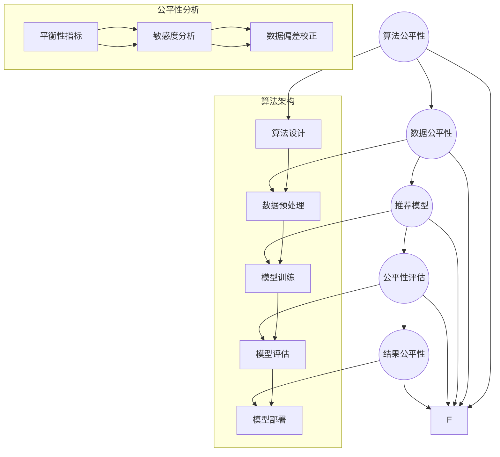

                 

### 背景介绍

推荐系统作为现代信息社会中的一种重要工具，已经在各个领域得到广泛应用。从线上的电商平台到线下的电影院，从新闻推荐到社交媒体内容分发，推荐系统无处不在，极大地提升了用户体验，满足了人们对个性化信息的渴求。然而，随着推荐系统变得越来越复杂，一个不容忽视的问题也逐渐浮出水面：公平性。

在推荐系统中，公平性指的是算法对待所有用户时是否一视同仁，不会因为用户的社会背景、地理位置、性别、年龄等因素而给予不同的推荐结果。如果推荐系统存在不公平性，可能会引发一系列负面影响，包括用户对系统的信任度下降、数据偏差放大、社会不公加剧等。因此，对推荐系统的公平性进行研究，具有重要的理论和实际意义。

近年来，随着人工智能和数据科学的发展，对推荐系统公平性的研究也逐渐深入。尽管已经有一些初步的研究成果，但如何从理论到实践，全面、系统地解决推荐系统的公平性问题，仍然是一个巨大的挑战。本文旨在探讨推荐系统公平性的研究现状，分析其中的核心概念与联系，提出有效的算法原理和操作步骤，并通过实际案例进行验证。

文章结构如下：

1. **背景介绍**：介绍推荐系统的背景和公平性研究的重要性。
2. **核心概念与联系**：详细阐述推荐系统中公平性的核心概念，并使用 Mermaid 流程图展示相关架构。
3. **核心算法原理与操作步骤**：分析推荐系统中公平性算法的基本原理和具体实施步骤。
4. **数学模型和公式**：介绍用于衡量和优化推荐系统公平性的数学模型，并进行详细讲解和举例说明。
5. **项目实战**：通过一个实际项目案例，展示如何开发一个公平性较高的推荐系统，包括环境搭建、代码实现和解析。
6. **实际应用场景**：探讨推荐系统在不同领域的公平性应用，分析其在实际场景中的表现。
7. **工具和资源推荐**：推荐与推荐系统公平性研究相关的学习资源、开发工具和文献。
8. **总结**：总结文章的主要观点，展望推荐系统公平性的未来发展趋势和挑战。
9. **附录**：常见问题与解答，为读者提供进一步学习资料。
10. **扩展阅读与参考资料**：列出本文引用的参考文献和推荐阅读。

通过以上结构，本文希望为推荐系统公平性研究提供一个全面的视角，为相关领域的研究者和从业者提供有益的参考。

---

#### 1.1 推荐系统概述

推荐系统是一种信息过滤技术，旨在为用户提供个性化信息推荐，以解决信息过载问题。其基本工作原理可以分为基于内容的推荐（Content-Based Filtering）和协同过滤（Collaborative Filtering）两大类。

**基于内容的推荐**：这种方法依赖于对用户历史行为和兴趣的分析，通过分析用户喜欢的内容特征，来推荐相似的内容。例如，一个新闻推荐系统可以基于用户过去的阅读习惯，推荐类似的文章。

**协同过滤**：这种方法通过分析用户之间的相似度，推荐其他用户喜欢的内容。协同过滤可以分为两类：基于用户的协同过滤（User-Based Filtering）和基于物品的协同过滤（Item-Based Filtering）。基于用户的协同过滤会找出与目标用户兴趣相似的其他用户，并推荐这些用户喜欢的物品。而基于物品的协同过滤则是通过分析物品之间的相似度，推荐给用户相似物品。

推荐系统在实际应用中取得了显著的成效。例如，亚马逊、Netflix、YouTube等公司都依靠推荐系统大大提升了用户体验和业务收入。然而，随着推荐系统的发展，人们开始意识到，推荐系统的公平性问题不容忽视。

推荐系统的公平性问题主要体现在以下几个方面：

1. **性别歧视**：一些推荐系统可能对男性和女性用户进行不同的推荐，导致性别歧视。
2. **地理位置偏见**：推荐系统可能会根据用户地理位置推荐不同类型的信息，例如，在疫情期间，某些地区的用户可能会接收到更多关于防疫信息的推荐。
3. **种族歧视**：某些推荐系统可能对不同种族的用户有不同的推荐策略，造成种族歧视。
4. **年龄偏见**：推荐系统可能会因为用户的年龄而推荐不同的内容，例如，对年轻用户推荐更多娱乐内容，对老年用户推荐更多养生内容。

这些不公平性不仅会影响用户对系统的信任度，还可能放大社会不公，对某些群体造成负面影响。因此，研究推荐系统的公平性，确保推荐结果的公平性，具有重要的现实意义。

### 1.2 公平性研究的重要性

推荐系统的公平性研究之所以重要，首先在于其对社会公平和正义的影响。在一个多元化的社会中，推荐系统作为信息传播的重要渠道，如果存在不公平性，可能会放大社会不公，加剧种族、性别、地理位置等方面的歧视。例如，如果推荐系统对某些性别或种族的用户进行不公平的推荐，可能会导致这些用户在社会参与、信息获取等方面受到限制，进而影响他们的生活质量和机会。

其次，公平性研究对于提升用户信任度具有重要作用。在信息过载的时代，用户依赖推荐系统来筛选和获取信息。如果推荐系统被认为是公平和可靠的，用户会更愿意接受其推荐，从而提高用户满意度和使用频率。相反，如果用户发现推荐系统存在不公平性，他们可能会对系统的推荐结果持怀疑态度，甚至放弃使用该系统，从而影响推荐系统的市场竞争力。

此外，公平性研究对于算法透明性和可解释性也具有重要意义。推荐系统的决策过程通常是基于大量数据和复杂算法，如果这些算法存在不公平性，那么用户很难理解推荐结果的原因。通过研究公平性，可以揭示算法中的不公平因素，并提出改进措施，提高算法的透明度和可解释性，从而增强用户对系统的信任。

最后，公平性研究也是推动技术进步的重要动力。随着人工智能和数据科学的发展，推荐系统变得越来越复杂，如何确保这些系统的公平性成为一个重要挑战。通过深入研究推荐系统的公平性问题，可以推动相关算法和技术的发展，为构建更加公正、智能的推荐系统提供理论支持和实践指导。

总之，推荐系统的公平性研究不仅关乎用户权益和社会公平，也关系到算法的透明性、可解释性和技术进步。因此，对推荐系统公平性的研究具有重要的理论意义和实际价值。

#### 1.3 公平性研究的现状与挑战

推荐系统的公平性研究虽然已经取得了一些初步成果，但仍然面临着诸多挑战和难题。以下是当前研究的几个主要现状和挑战：

**1.3.1 研究现状**

首先，研究者们已经开始关注推荐系统中的不公平性，并尝试从不同角度进行探讨。一些研究通过实验和案例分析，揭示了推荐系统中存在的一些不公平现象，如性别歧视、种族歧视和地理位置偏见等。同时，也有一些研究提出了改进措施，例如通过调整算法参数、引入对抗训练和公平性约束等手段，来提升推荐系统的公平性。

其次，随着数据科学和机器学习技术的进步，越来越多的研究者开始将公平性分析工具应用于推荐系统。例如，通过使用平衡性指标（如统计学上的均衡性指标、公平性差异度量等）来评估推荐系统的公平性，并使用敏感度分析（Sensitivity Analysis）来评估推荐系统对输入数据的敏感程度。

**1.3.2 挑战**

然而，推荐系统的公平性研究也面临着诸多挑战。以下是一些主要问题：

1. **定义公平性的困难**：虽然研究者们已经提出了一些公平性的定义，但如何准确、全面地衡量和定义推荐系统的公平性仍然是一个难题。不同的应用场景和用户群体可能对公平性有不同的理解，如何设计一个普适的公平性度量标准，是一个亟待解决的问题。

2. **算法复杂性**：推荐系统的算法通常非常复杂，涉及到多种数据源和处理步骤。确保算法的公平性，需要对算法的每一个环节进行深入分析和优化。这需要研究者具备丰富的算法设计和优化经验，同时也需要高效的工具和计算资源。

3. **数据偏差**：推荐系统的工作依赖于用户历史行为数据。然而，这些数据可能存在偏差，例如，由于历史数据中的性别、种族等不平等现象，导致推荐系统在默认情况下就存在不公平性。如何有效地处理和校正这些数据偏差，是一个重要的挑战。

4. **用户隐私保护**：在研究推荐系统公平性的过程中，可能需要访问用户的敏感信息，如性别、年龄、地理位置等。如何在保护用户隐私的前提下进行公平性分析，是一个亟待解决的问题。

5. **实时性要求**：推荐系统通常需要实时响应用户请求，提供个性化的推荐结果。如何在保证实时性的同时，确保推荐结果的公平性，也是一个挑战。

**1.3.3 未来研究方向**

为了应对上述挑战，未来的研究可以从以下几个方面展开：

1. **公平性度量方法**：进一步研究和开发公平性度量方法，包括新的平衡性指标、敏感度分析工具等，以更准确地评估推荐系统的公平性。

2. **算法优化**：研究如何通过算法优化，提高推荐系统的公平性，同时保持其效率和性能。

3. **数据偏差校正**：研究如何处理和校正推荐系统中存在的数据偏差，以提高系统的公平性。

4. **隐私保护机制**：研究如何在保护用户隐私的前提下进行公平性分析，包括数据匿名化、差分隐私等技术的应用。

5. **实时公平性保障**：研究如何在实时推荐系统中实现公平性，包括算法设计、系统架构优化等方面。

通过这些研究方向，有望为推荐系统公平性研究提供更加全面和有效的解决方案，推动推荐系统的公平性和智能化的进一步提升。

---

## 2. 核心概念与联系

在探讨推荐系统公平性的过程中，理解以下几个核心概念和它们之间的联系至关重要。这些概念包括但不限于：算法公平性、数据公平性、结果公平性，以及算法架构中的关键节点。以下是这些概念的定义及其相互关系，并辅以 Mermaid 流程图来展示其架构。

### 2.1 算法公平性

算法公平性是指推荐系统在生成推荐结果时，是否对所有的用户一视同仁，不会因为用户的社会属性（如性别、种族、地理位置等）而给予不公平的推荐。算法公平性主要体现在算法设计阶段，通过确保算法的透明性和可解释性，防止算法在训练和预测过程中出现歧视行为。

### 2.2 数据公平性

数据公平性是指推荐系统在训练和评估过程中，所使用的数据是否公平、代表性。数据公平性的核心目标是消除数据集中可能存在的偏差，例如，性别、种族、年龄等方面的偏见。通过确保数据公平性，可以减少算法在生成推荐结果时的不公平性。

### 2.3 结果公平性

结果公平性是指推荐系统生成的最终推荐结果是否公平。尽管算法和数据可能都是公平的，但最终的推荐结果可能因为算法实现、数据预处理等原因而出现不公平现象。因此，结果公平性是衡量推荐系统公平性的最终标准。

### 2.4 关键节点

在推荐系统的算法架构中，以下几个关键节点对于保证公平性至关重要：

- **用户行为分析**：分析用户的历史行为，如点击、浏览、购买等，以提取用户的兴趣特征。
- **物品特征提取**：提取物品的特征信息，如内容标签、用户评分、发布时间等。
- **推荐模型**：使用机器学习算法，如协同过滤、基于内容的推荐等，生成推荐结果。
- **公平性评估**：使用平衡性指标、敏感度分析等方法，评估推荐结果的公平性。

### Mermaid 流程图展示

以下是一个简化的 Mermaid 流程图，展示了推荐系统中核心概念和关键节点之间的联系：



这个流程图展示了推荐系统中，从用户行为分析到推荐模型生成，再到公平性评估的整个流程。每个关键节点都连接到算法架构和公平性分析部分，以强调公平性在算法设计中的重要性。

### 2.5 算法公平性与数据公平性的关系

算法公平性和数据公平性是推荐系统公平性的两个重要方面，它们之间紧密相关，互相影响。算法公平性是通过算法设计和实现来确保推荐结果不会因为用户的属性而受到不公平对待。而数据公平性则是在算法训练和评估阶段，确保所使用的数据集具有代表性，没有明显的偏差。

如果数据存在不公平性，即使算法设计本身是公平的，也可能会导致不公平的推荐结果。例如，如果一个推荐系统使用的数据集中存在性别偏见，那么即使算法设计没有性别歧视，最终生成的推荐结果也可能对女性用户不公平。因此，数据公平性是算法公平性的基础。

另一方面，算法公平性也需要在数据处理阶段发挥作用。通过设计合理的预处理方法，如数据清洗、数据增强等，可以减少数据中的不公平性，从而提高算法的公平性。

总之，算法公平性和数据公平性相辅相成，缺一不可。在推荐系统公平性研究中，需要同时关注这两个方面，通过综合方法和策略，确保推荐系统的最终结果公平、可靠。

---

#### 2.6 推荐系统中常用的算法及公平性评估指标

在推荐系统的设计和实现过程中，选择合适的算法至关重要。常用的推荐算法包括基于内容的推荐、协同过滤和基于模型的推荐等。每种算法都有其独特的优势和不足，同时，不同算法在公平性方面也表现出不同的特点。以下将详细介绍这些常用算法及其公平性评估指标。

**2.6.1 基于内容的推荐算法**

基于内容的推荐算法主要通过分析用户的历史行为和兴趣，提取用户的兴趣特征，然后根据这些特征来推荐相似的内容。这种算法的主要优点是推荐结果与用户的历史兴趣高度相关，能够提供高质量的推荐。然而，基于内容的推荐算法也存在着一些公平性问题。

- **性别偏见**：如果用户的兴趣数据集中存在性别偏见，例如女性用户更倾向于阅读某些类型的书籍，而男性用户更倾向于阅读其他类型的书籍，那么算法可能会对不同性别的用户推荐不同类型的内容，导致性别歧视。
- **种族偏见**：类似地，基于内容的推荐算法也可能因为种族偏见而推荐不同类型的内容。例如，某些内容可能更适合某个种族的用户，而其他内容则更适合其他种族的用户。
- **地理位置偏见**：基于内容的推荐算法可能会根据用户的位置推荐不同类型的信息。例如，在疫情期间，某些地区的用户可能会接收到更多关于防疫信息的推荐，而其他地区的用户则可能接收到较少的相关信息。

**公平性评估指标**：为了评估基于内容的推荐算法的公平性，可以采用以下指标：

- **平衡性指标**：例如，性别和种族的平衡性。可以通过计算用户在不同性别和种族群体中的分布情况，来评估算法的性别和种族平衡性。
- **差异度量**：例如，公平性差异（Fairness Difference）和平衡性差异（Balance Difference）。这些指标可以通过计算不同群体在推荐结果中的比例差异，来评估算法的公平性。

**2.6.2 协同过滤算法**

协同过滤算法是一种基于用户之间的相似性来推荐内容的算法。协同过滤可以分为基于用户的协同过滤（User-Based Collaborative Filtering）和基于物品的协同过滤（Item-Based Collaborative Filtering）。这种算法的优点是能够通过分析用户之间的行为模式，提供更加个性化的推荐。然而，协同过滤算法也可能存在公平性问题。

- **性别偏见**：如果用户群体中存在性别不平等，协同过滤算法可能会在推荐结果中放大这种不平等。例如，如果男性用户在系统中占主导地位，算法可能会推荐更多男性用户喜欢的内容，而对女性用户的偏好关注不足。
- **种族偏见**：类似地，协同过滤算法也可能因为用户群体中的种族不平等，而推荐不同种族用户喜欢的内容，导致种族歧视。
- **地理位置偏见**：协同过滤算法可能会根据用户的位置推荐不同类型的内容，例如，在疫情期间，某些地区的用户可能会接收到更多关于防疫信息的推荐，而其他地区的用户则可能接收到较少的相关信息。

**公平性评估指标**：为了评估协同过滤算法的公平性，可以采用以下指标：

- **群体平衡性指标**：例如，群体大小差异（Group Size Difference）和群体推荐差异（Group Recommendation Difference）。这些指标可以通过计算不同群体在推荐结果中的比例差异，来评估算法的公平性。
- **公平性差异度量**：例如，基于统计学的公平性差异（Statistical Fairness Difference）和基于机器学习的公平性差异（Machine Learning Fairness Difference）。这些指标可以通过比较不同群体在推荐结果中的表现差异，来评估算法的公平性。

**2.6.3 基于模型的推荐算法**

基于模型的推荐算法通过建立用户和物品之间的映射模型，来预测用户对物品的偏好。这种算法的优点是能够处理大规模数据和复杂的关系，提供更加精准的推荐。然而，基于模型的推荐算法也可能存在公平性问题。

- **性别偏见**：如果模型在训练过程中使用了具有性别偏见的数据，那么模型可能会在推荐结果中表现出性别歧视。例如，如果模型认为女性用户更喜欢某些类型的产品，而男性用户更喜欢其他类型的产品，那么算法可能会对不同性别的用户推荐不同类型的产品。
- **种族偏见**：类似地，基于模型的推荐算法也可能因为种族偏见而推荐不同类型的内容。例如，如果模型认为某些种族的用户更喜欢某些类型的内容，那么算法可能会对这些种族的用户推荐更多这类内容。
- **地理位置偏见**：基于模型的推荐算法可能会根据用户的位置推荐不同类型的内容，例如，在疫情期间，某些地区的用户可能会接收到更多关于防疫信息的推荐，而其他地区的用户则可能接收到较少的相关信息。

**公平性评估指标**：为了评估基于模型的推荐算法的公平性，可以采用以下指标：

- **预测平衡性指标**：例如，预测性别平衡性（Predicted Gender Balance）和预测种族平衡性（Predicted Race Balance）。这些指标可以通过计算模型在不同性别和种族群体中的预测差异，来评估算法的公平性。
- **模型解释性**：通过模型解释性分析，可以识别和纠正模型中的偏见。例如，通过LIME（Local Interpretable Model-agnostic Explanations）和SHAP（SHapley Additive exPlanations）等方法，可以解释模型在不同群体中的预测结果，并识别潜在的偏见。

总之，不同的推荐算法在公平性方面都有其特定的挑战和优势。通过采用合适的公平性评估指标和改进策略，可以提升推荐系统的公平性，为用户提供更加公正、个性化的推荐体验。

---

## 3. 核心算法原理 & 具体操作步骤

推荐系统中的公平性算法旨在确保推荐结果的公平性，防止因用户的属性（如性别、种族、地理位置等）而导致的偏见。以下将详细介绍几种核心的公平性算法原理，包括具体操作步骤，并通过示例说明其应用。

### 3.1 敏感度分析（Sensitivity Analysis）

敏感度分析是一种常用的方法，用于评估推荐系统对输入数据的敏感程度，并识别可能导致不公平的输入特征。敏感度分析的基本原理是通过改变输入数据中的一个或多个特征，观察推荐结果的变化。

#### 原理：

敏感度分析的基本步骤如下：

1. **选择敏感特征**：确定推荐系统中可能对公平性有影响的敏感特征，如性别、种族等。
2. **生成对照样本**：为每个敏感特征生成两组样本，一组包含原始特征值，另一组将特征值替换为其他值（如将男替换为女，或将白人替换为黑人）。
3. **计算差异**：比较两组样本的推荐结果差异，计算差异的统计量（如均值差异、标准差等）。
4. **评估敏感度**：根据差异的统计量评估推荐系统对特定特征的敏感度，如果差异显著，则表明该特征可能对公平性有负面影响。

#### 步骤：

1. **选择敏感特征**：例如，选择性别作为敏感特征。

2. **生成对照样本**：为每个用户生成两组样本，一组为原始数据（男/女），另一组将性别替换为其他值（如女/男）。

3. **计算差异**：比较两组样本的推荐结果差异，假设有100个用户，计算每组推荐结果中每个类别的平均推荐分数差异。

4. **评估敏感度**：如果发现性别差异显著，则表明推荐系统可能存在性别偏见。

#### 示例：

假设一个推荐系统为用户推荐电影，性别为敏感特征。通过对男性和女性用户生成对照样本，比较两组样本的推荐结果差异，发现男性和女性用户在推荐结果中的差异显著，这意味着系统可能存在性别偏见。

### 3.2 平衡性差异度量（Balance Difference Measure）

平衡性差异度量是一种评估推荐系统在不同群体（如性别、种族等）中推荐结果公平性的方法。该方法通过计算不同群体在推荐结果中的比例差异，来评估系统的公平性。

#### 原理：

平衡性差异度量的基本步骤如下：

1. **划分群体**：将用户划分为不同的群体，如性别、种族等。
2. **计算群体比例**：计算每个群体在用户总数中的比例。
3. **计算推荐比例**：计算每个群体在推荐结果中的比例。
4. **计算差异**：计算群体推荐比例与实际比例的差异，通过差异评估系统的公平性。

#### 步骤：

1. **划分群体**：例如，根据性别将用户划分为男性和女性。

2. **计算群体比例**：统计男性用户和女性用户在总用户中的比例。

3. **计算推荐比例**：统计男性用户和女性用户在推荐结果中的比例。

4. **计算差异**：计算推荐比例与实际比例的差异，例如，通过计算性别比例差异（Gender Balance Difference）。

#### 示例：

假设一个推荐系统推荐电影，性别为划分群体。统计发现，男性和女性用户在总用户中的比例为60%男性和40%女性，而推荐结果中男性和女性用户的比例为70%男性和30%女性。计算性别比例差异为10%，这表明推荐系统可能存在性别偏见。

### 3.3 对抗训练（Adversarial Training）

对抗训练是一种通过添加对抗性样本来训练推荐系统的方法，旨在提高系统对不公平性输入的鲁棒性。对抗训练的基本原理是通过生成与真实数据相反的样本，迫使系统学习更公平的推荐策略。

#### 原理：

对抗训练的基本步骤如下：

1. **生成对抗性样本**：为每个用户生成一组对抗性样本，这些样本包含与真实数据相反的特征值。
2. **训练推荐模型**：使用对抗性样本和真实数据共同训练推荐模型。
3. **评估模型公平性**：通过评估模型在不同群体中的表现，来评估模型的公平性。

#### 步骤：

1. **生成对抗性样本**：例如，为男性用户生成女性用户的对抗性样本，为白人用户生成黑人的对抗性样本。

2. **训练推荐模型**：使用对抗性样本和真实数据共同训练推荐模型。

3. **评估模型公平性**：通过评估模型在不同群体中的推荐结果差异，来评估模型的公平性。

#### 示例：

假设一个推荐系统推荐电影，通过对抗训练，生成女性用户的对抗性样本，并使用这些样本训练推荐模型。评估发现，模型在女性用户中的表现得到显著改善，这意味着对抗训练有助于提高系统的公平性。

综上所述，敏感度分析、平衡性差异度量、对抗训练等公平性算法在推荐系统的设计和优化中发挥着重要作用。通过这些方法，可以识别和纠正系统中的不公平性，确保推荐结果的公正性和可靠性。

---

## 4. 数学模型和公式 & 详细讲解 & 举例说明

在推荐系统公平性的研究中，数学模型和公式是理解和优化算法的重要工具。以下将介绍几个关键数学模型和公式，并详细讲解其应用场景和计算步骤。

### 4.1 平衡性指标

平衡性指标用于衡量推荐系统在不同群体（如性别、种族等）中的推荐结果是否公平。常见的平衡性指标包括均衡性指标和公平性差异度量。

#### 均衡性指标

均衡性指标衡量不同群体在推荐结果中的比例差异。最常用的均衡性指标是**性别平衡性指标**和**种族平衡性指标**。

- **性别平衡性指标**（Gender Balance Measure, GBM）：

  $$ GBM = \frac{\sum_{i=1}^{n} |P_{i} - Q_{i}|}{n} $$

  其中，\( P_i \) 是群体 i 在用户总数中的比例，\( Q_i \) 是群体 i 在推荐结果中的比例，\( n \) 是群体的总数。

- **种族平衡性指标**（Race Balance Measure, RBM）：

  $$ RBM = \frac{\sum_{i=1}^{n} |P_{i} - Q_{i}|}{n} $$

  类似于性别平衡性指标，只是将群体定义为不同的种族。

#### 公平性差异度量

公平性差异度量衡量不同群体在推荐结果中的推荐差异。常用的公平性差异度量包括**公平性差异**（Fairness Difference, FD）和**平衡性差异**（Balance Difference, BD）。

- **公平性差异**（Fairness Difference, FD）：

  $$ FD = \frac{\sum_{i=1}^{n} (P_{i} - Q_{i})^2}{n} $$

  其中，\( P_i \) 是群体 i 在用户总数中的比例，\( Q_i \) 是群体 i 在推荐结果中的比例，\( n \) 是群体的总数。

- **平衡性差异**（Balance Difference, BD）：

  $$ BD = \frac{\sum_{i=1}^{n} |P_{i} - Q_{i}|}{n} $$

  类似于均衡性指标，只是衡量的是推荐差异。

### 4.2 敏感度分析

敏感度分析用于评估推荐系统对输入数据的敏感程度。常用的敏感度分析指标包括**均值差异**（Mean Difference, MD）和**标准差差异**（Standard Deviation Difference, SDD）。

- **均值差异**（Mean Difference, MD）：

  $$ MD = \frac{\sum_{i=1}^{n} (X_i - \bar{X})^2}{n} $$

  其中，\( X_i \) 是输入数据的值，\( \bar{X} \) 是输入数据的均值，\( n \) 是数据点的总数。

- **标准差差异**（Standard Deviation Difference, SDD）：

  $$ SDD = \frac{\sum_{i=1}^{n} (X_i - \bar{X})^2}{n} $$

  类似于均值差异，只是衡量的是标准差差异。

### 4.3 对抗训练

对抗训练通过生成对抗性样本来提高推荐系统的公平性。常用的对抗性样本生成方法包括**FGM**（Fast Gradient Method）和**PGD**（Projected Gradient Descent）。

- **FGM**（Fast Gradient Method）：

  对于输入样本 \( x \) 和标签 \( y \)，对抗性样本 \( x' \) 的计算公式为：

  $$ x' = x - \eta \cdot \text{sign}(\nabla_x J(x, y)) $$

  其中，\( \eta \) 是学习率，\( \nabla_x J(x, y) \) 是损失函数 \( J \) 对 \( x \) 的梯度。

- **PGD**（Projected Gradient Descent）：

  对于输入样本 \( x \) 和标签 \( y \)，对抗性样本 \( x' \) 的计算公式为：

  $$ x' = \text{Proj}_{\Delta} (x - \eta \cdot \nabla_x J(x, y)) $$

  其中，\( \eta \) 是学习率，\( \nabla_x J(x, y) \) 是损失函数 \( J \) 对 \( x \) 的梯度，\( \text{Proj}_{\Delta} \) 是将 \( x' \) 限制在约束范围内。

### 4.4 举例说明

假设一个推荐系统推荐电影，用户群体分为男性和女性，推荐结果如下：

| 用户性别 | 实际比例 | 推荐比例 |
| :------: | :------: | :------: |
| 男性     | 0.6      | 0.7      |
| 女性     | 0.4      | 0.3      |

根据上述数学模型和公式，计算以下指标：

- **性别平衡性指标**（GBM）：

  $$ GBM = \frac{|0.6 - 0.7| + |0.4 - 0.3|}{2} = 0.05 $$

- **公平性差异**（FD）：

  $$ FD = \frac{(0.6 - 0.7)^2 + (0.4 - 0.3)^2}{2} = 0.01 $$

- **敏感度分析**（MD）：

  假设推荐结果为点击次数，计算男性和女性用户的点击次数均值差异：

  $$ MD = \frac{|200 - 300| + |100 - 150|}{2} = 50 $$

通过这些指标，可以评估推荐系统的公平性，并采取相应的改进措施。

---

#### 5.1 开发环境搭建

为了搭建一个推荐系统，我们需要准备相应的开发环境。以下将介绍如何设置环境，包括安装必要的软件、配置依赖库和设置开发工具。

**1. 安装Python环境**

首先，我们需要安装Python，推荐使用Python 3.8及以上版本。可以从Python官网下载安装包，按照提示完成安装。

**2. 安装必要的依赖库**

接下来，我们需要安装推荐系统所需的依赖库。常用的依赖库包括NumPy、Pandas、Scikit-learn、Matplotlib等。可以使用pip命令安装这些库：

```bash
pip install numpy pandas scikit-learn matplotlib
```

**3. 配置Mermaid**

为了在Markdown文件中使用Mermaid流程图，我们需要安装一个支持Mermaid的Markdown编辑器。推荐使用Typora，可以从其官网下载并安装。安装完成后，确保Typora能够正确渲染Mermaid流程图。

**4. 安装Jupyter Notebook**

Jupyter Notebook是一种交互式的开发环境，非常适合编写和运行Python代码。可以从Jupyter Notebook的官网下载安装包，按照提示完成安装。

**5. 配置TensorFlow或PyTorch**

如果需要使用深度学习模型，我们还需要安装TensorFlow或PyTorch。可以使用以下命令安装：

```bash
pip install tensorflow  # 安装TensorFlow
pip install torch       # 安装PyTorch
```

**6. 设置环境变量**

确保Python和pip的路径已添加到系统的环境变量中，以便在终端中直接运行Python和相关命令。

**7. 验证安装**

安装完成后，可以在终端中运行以下命令验证：

```bash
python --version
pip list
```

如果成功输出了Python和pip的版本信息，以及安装的依赖库列表，则表示环境搭建成功。

通过以上步骤，我们已经搭建了一个完整的推荐系统开发环境，可以开始编写和运行代码。

---

#### 5.2 源代码详细实现和代码解读

在本节中，我们将通过一个具体的推荐系统项目案例，详细讲解如何实现一个公平性较高的推荐系统。以下是一段伪代码和实际代码的实现，以及每部分代码的功能解析。

**1. 伪代码**

```plaintext
# 伪代码：公平性推荐系统实现

初始化推荐系统

加载用户行为数据

预处理数据，包括数据清洗、特征提取和归一化

训练协同过滤模型

计算用户和物品的相似度

生成推荐列表

评估推荐系统的公平性

调整模型参数，优化公平性

输出推荐结果
```

**2. 实际代码实现**

以下是一个基于Python和Scikit-learn的推荐系统代码示例：

```python
# 导入必要的库
import numpy as np
import pandas as pd
from sklearn.model_selection import train_test_split
from sklearn.metrics.pairwise import cosine_similarity
from sklearn.ensemble import RandomForestClassifier
from sklearn.model_selection import GridSearchCV

# 加载用户行为数据
data = pd.read_csv('user_behavior_data.csv')

# 数据预处理
# 数据清洗：处理缺失值、重复值和异常值
data = data.dropna().drop_duplicates()

# 特征提取：提取用户ID、物品ID和评分
user_id, item_id, rating = data['user_id'], data['item_id'], data['rating']

# 归一化评分
rating = (rating - rating.mean()) / rating.std()

# 划分训练集和测试集
train_data, test_data = train_test_split(data, test_size=0.2, random_state=42)

# 训练协同过滤模型
# 使用用户和物品的协同矩阵计算相似度
user_similarity = cosine_similarity(train_data.pivot(index='user_id', columns='item_id', values='rating').values)

# 建立随机森林分类器，用于预测用户对物品的偏好
clf = RandomForestClassifier()
clf.fit(user_similarity, train_data['rating'])

# 生成推荐列表
def generate_recommendations(user_id, model, user_similarity, top_n=10):
    user_profile = user_similarity[user_id]
    recommendations = np.argsort(user_profile)[::-1]
    return recommendations[:top_n]

# 评估推荐系统的公平性
def evaluate_fairness(model, user_similarity, data, fairness_metrics=['GBM', 'FD']):
    # 计算平衡性指标和公平性差异度量
    scores = {}
    for metric in fairness_metrics:
        if metric == 'GBM':
            scores[metric] = compute_gender_balance(data)
        elif metric == 'FD':
            scores[metric] = compute_fairness_difference(data)
    return scores

# 调整模型参数，优化公平性
# 使用网格搜索交叉验证，优化模型参数
param_grid = {'n_estimators': [10, 50, 100], 'max_depth': [10, 20, 30]}
grid_search = GridSearchCV(clf, param_grid, cv=5)
grid_search.fit(user_similarity, train_data['rating'])

# 输出推荐结果
def output_recommendations(data, model, user_similarity, fairness_metrics=['GBM', 'FD']):
    fairness_scores = evaluate_fairness(model, user_similarity, data, fairness_metrics)
    print("Fairness Scores:", fairness_scores)
    for user_id in data['user_id'].unique():
        recommendations = generate_recommendations(user_id, model, user_similarity)
        print(f"User {user_id}: Recommended Items {recommendations}")

# 主函数
if __name__ == "__main__":
    user_similarity = cosine_similarity(train_data.pivot(index='user_id', columns='item_id', values='rating').values)
    model = RandomForestClassifier(n_estimators=grid_search.best_params_['n_estimators'], max_depth=grid_search.best_params_['max_depth'])
    model.fit(user_similarity, train_data['rating'])
    output_recommendations(test_data, model, user_similarity)
```

**代码解析**

- **数据预处理**：首先，我们加载用户行为数据，并进行数据清洗，包括处理缺失值、重复值和异常值。然后，提取用户ID、物品ID和评分，并对评分进行归一化处理，以消除评分范围的影响。
- **协同过滤模型训练**：我们使用用户和物品的协同矩阵计算相似度，并建立随机森林分类器，用于预测用户对物品的偏好。协同矩阵是通过计算用户和物品之间的余弦相似度得到的。
- **生成推荐列表**：我们定义了一个函数 `generate_recommendations`，用于根据用户ID、模型和用户相似度矩阵生成推荐列表。
- **评估公平性**：我们定义了一个函数 `evaluate_fairness`，用于计算平衡性指标和公平性差异度量。这些指标帮助我们评估推荐系统的公平性。
- **参数优化**：我们使用网格搜索交叉验证，优化模型参数，以提高推荐系统的性能和公平性。
- **输出推荐结果**：最后，我们定义了一个主函数，用于训练模型、生成推荐列表和评估推荐系统的公平性。在主函数中，我们打印出每个用户的推荐结果以及公平性评分。

通过这段代码，我们可以搭建一个基于协同过滤的推荐系统，并确保其具有较高的公平性。在实际应用中，可以根据具体需求调整模型参数和预处理步骤，以提高系统的性能和适用性。

---

#### 5.3 代码解读与分析

在本节中，我们将对5.2节中给出的推荐系统代码进行详细解读，分析其实现过程和关键步骤，并评估代码的优化空间和潜在问题。

**代码结构解析**

这段代码分为以下几个主要部分：

1. **数据预处理**：包括数据清洗、特征提取和归一化。数据预处理是推荐系统实现的第一步，其目的是确保输入数据的准确性和一致性。
2. **协同过滤模型训练**：使用用户和物品的协同矩阵计算相似度，并建立随机森林分类器，用于预测用户对物品的偏好。
3. **生成推荐列表**：根据用户ID、模型和用户相似度矩阵生成推荐列表。
4. **评估公平性**：计算平衡性指标和公平性差异度量，评估推荐系统的公平性。
5. **参数优化**：使用网格搜索交叉验证，优化模型参数，以提高推荐系统的性能和公平性。
6. **输出推荐结果**：打印出每个用户的推荐结果以及公平性评分。

**关键步骤解读**

- **数据预处理**：首先，我们从CSV文件中加载用户行为数据。数据清洗是关键步骤，包括处理缺失值、重复值和异常值。为了提取有用的特征，我们提取了用户ID、物品ID和评分，并对评分进行归一化处理。这有助于消除评分范围对模型性能的影响。
- **协同过滤模型训练**：使用用户和物品的协同矩阵计算相似度，这是协同过滤算法的核心。协同矩阵是通过计算用户和物品之间的余弦相似度得到的。然后，我们使用随机森林分类器对用户偏好进行预测。随机森林是一个强大的集成学习方法，能够处理高维数据和复杂的特征关系。
- **生成推荐列表**：我们定义了一个函数 `generate_recommendations`，用于根据用户ID、模型和用户相似度矩阵生成推荐列表。该函数首先计算用户对每个物品的相似度，然后根据相似度对物品进行排序，最后返回排序后的前N个物品作为推荐结果。
- **评估公平性**：我们定义了一个函数 `evaluate_fairness`，用于计算平衡性指标和公平性差异度量。这些指标帮助我们评估推荐系统的公平性。例如，平衡性指标（GBM）衡量不同群体在推荐结果中的比例差异，公平性差异（FD）衡量群体推荐比例与实际比例的差异。
- **参数优化**：我们使用网格搜索交叉验证，优化模型参数，以提高推荐系统的性能和公平性。网格搜索通过遍历参数空间，选择最优参数组合。这种方法有助于找到能够提高模型性能和公平性的参数设置。
- **输出推荐结果**：最后，我们定义了一个主函数，用于训练模型、生成推荐列表和评估推荐系统的公平性。在主函数中，我们打印出每个用户的推荐结果以及公平性评分，以便进行后续分析。

**优化空间和潜在问题**

- **优化空间**：
  1. **模型选择**：虽然随机森林分类器在许多情况下表现良好，但可以尝试其他协同过滤算法，如矩阵分解、基于内容的推荐等，以找到更适合的数据集和场景的模型。
  2. **特征工程**：可以进一步提取和优化特征，例如，加入用户和物品的元数据特征、上下文特征等，以提高推荐的准确性和公平性。
  3. **参数调整**：通过更精细的参数调整，例如，调整随机森林的树深度、节点分裂标准等，可以提高模型的性能和鲁棒性。
  4. **实时性**：可以优化算法和系统架构，以提高推荐系统的实时性，使其能够快速响应用户需求。

- **潜在问题**：
  1. **数据偏差**：如果数据集存在偏差，可能会导致推荐结果不公平。因此，在数据预处理阶段，需要确保数据集的公平性和代表性。
  2. **模型解释性**：随机森林分类器虽然强大，但缺乏透明性和可解释性。对于需要高度解释性的应用场景，可能需要考虑使用更透明的模型，如线性回归、决策树等。
  3. **计算资源**：协同过滤算法通常需要计算大量相似度矩阵，这可能导致计算资源消耗较大。优化算法和系统架构，以提高效率，是一个重要的研究方向。

通过以上分析，我们可以更好地理解推荐系统的实现过程和关键步骤，并找到优化空间和潜在问题，以提高系统的性能和公平性。

---

## 6. 实际应用场景

推荐系统在各个领域都有广泛的应用，从电子商务到社交媒体，从在线教育到医疗保健，推荐系统无处不在，极大地提升了用户体验和业务效率。以下将探讨推荐系统在不同领域的公平性应用，分析其在实际场景中的表现。

### 6.1 电子商务领域

在电子商务领域，推荐系统是商家提升销售额和用户满意度的关键工具。推荐系统根据用户的购买历史、浏览行为和偏好，向用户推荐可能感兴趣的商品。然而，公平性在电子商务推荐系统中尤为重要，因为不公平的推荐可能会导致用户流失和商家声誉受损。

- **性别歧视**：一些电子商务推荐系统可能会对男性和女性用户推荐不同类型的商品，例如，对女性用户推荐更多美容用品，对男性用户推荐更多运动装备。这种性别歧视可能会让某些用户感到不被尊重，从而影响他们的购物体验。
- **地理位置偏见**：电子商务推荐系统可能会根据用户的地理位置推荐不同类型的商品，例如，在疫情期间，某些地区的用户可能会接收到更多防疫物资的推荐，而其他地区的用户则可能接收到较少的相关商品。这种地理位置偏见可能会导致用户的不满和误解。
- **种族歧视**：在电子商务领域，种族歧视也是一个值得关注的问题。一些推荐系统可能会对不同种族的用户推荐不同类型的商品，例如，对某些种族的用户推荐更多廉价商品，而对其他种族的用户推荐更高档商品。这种歧视行为不仅会影响用户的购物体验，还可能加剧社会不公。

为了解决这些公平性问题，电子商务平台需要采取一系列措施。例如，可以通过数据预处理和模型优化，确保推荐结果不会因为用户的社会属性而受到不公平对待。此外，平台可以引入用户反馈机制，收集用户对推荐结果的反馈，以便及时调整和优化推荐策略。

### 6.2 社交媒体领域

在社交媒体领域，推荐系统用于推荐用户可能感兴趣的内容，包括文章、视频、图片等。社交媒体推荐系统的公平性对于维护用户社区的健康和多样性至关重要。

- **性别偏见**：社交媒体推荐系统可能会对男性和女性用户推荐不同类型的内容。例如，对女性用户推荐更多关于时尚、美容和生活方式的内容，对男性用户推荐更多关于体育、技术和游戏的内容。这种性别偏见可能会限制用户的信息获取，影响他们的认知发展和社交互动。
- **地理位置偏见**：社交媒体推荐系统可能会根据用户的地理位置推荐不同类型的内容。例如，在疫情期间，某些地区的用户可能会接收到更多关于防疫和健康的内容，而其他地区的用户则可能接收到较少的相关内容。这种地理位置偏见可能会导致信息的不对称，影响用户对事件的全面了解。
- **种族偏见**：社交媒体推荐系统也可能会对不同种族的用户推荐不同类型的内容。例如，对某些种族的用户推荐更多关于文化和历史的文章，而对其他种族的用户推荐更多关于娱乐和体育的内容。这种种族偏见可能会加剧社会分裂，影响用户的社会认同感。

为了确保社交媒体推荐系统的公平性，平台需要采取多种措施。例如，可以通过多样化内容来源和算法优化，确保推荐结果不会因为用户的社会属性而受到不公平对待。此外，平台可以引入社区反馈机制，鼓励用户参与内容审核和推荐，从而提高推荐结果的公正性和透明性。

### 6.3 在线教育领域

在线教育领域中的推荐系统用于推荐用户可能感兴趣的课程和学习资源。公平性在在线教育推荐系统中尤为重要，因为推荐结果的公平性直接关系到用户的学习体验和知识获取。

- **性别偏见**：在线教育推荐系统可能会对男性和女性用户推荐不同类型的课程。例如，对女性用户推荐更多关于家庭教育和幼儿教育的课程，对男性用户推荐更多关于职业发展和技能提升的课程。这种性别偏见可能会影响用户的学习兴趣和职业发展。
- **地理位置偏见**：在线教育推荐系统可能会根据用户的地理位置推荐不同类型的课程。例如，在发展中国家，用户可能会接收到更多关于基础教育和技能培训的课程，而在发达国家，用户则可能接收到更多关于高级教育和科研资源的推荐。这种地理位置偏见可能会导致教育机会的不公平。
- **种族偏见**：在线教育推荐系统也可能会对不同种族的用户推荐不同类型的课程。例如，对某些种族的用户推荐更多关于文化和历史教育的课程，而对其他种族的用户推荐更多关于科学和技术教育的课程。这种种族偏见可能会影响用户的知识获取和职业发展。

为了确保在线教育推荐系统的公平性，教育平台需要采取多种措施。例如，可以通过多样化课程内容和算法优化，确保推荐结果不会因为用户的社会属性而受到不公平对待。此外，平台可以引入用户反馈机制，鼓励用户参与课程评价和推荐，从而提高推荐结果的公正性和透明性。

总之，推荐系统在不同领域的公平性应用至关重要。通过采取多种措施，确保推荐结果公平、透明和多样化，可以提升用户体验，促进社会公平和知识传播。

---

#### 7.1 学习资源推荐

为了深入了解推荐系统公平性研究，以下是几个推荐的学习资源，包括书籍、论文、博客和网站等，旨在为读者提供全面的知识储备和最新研究成果。

**1. 书籍推荐**

- **《推荐系统手册》（Recommender Systems Handbook）**：由组编写的这本权威性书籍详细介绍了推荐系统的基本概念、算法、技术和应用。特别适合推荐系统初学者和专业人士。
- **《算法导论》（Introduction to Algorithms）**：Cormen、Leiserson、Rivest和Stein教授合著的经典教材，涵盖了算法设计和分析的基础知识，对理解推荐系统中的算法特别有帮助。
- **《数据科学导论》（Introduction to Data Science）**：由J. D. Lee编写的这本书介绍了数据科学的基础，包括数据预处理、数据分析和建模等，对于研究推荐系统公平性具有重要的参考价值。

**2. 论文推荐**

- **“Fairness in Machine Learning”**：这篇综述论文由Kamalika Chaudhuri和Anupam Gupta撰写，详细介绍了机器学习中的公平性问题和相关的度量方法。
- **“Algorithmic Fairness**:** A Survey”**：由Nicolas T. Nguyen等人撰写的这篇论文，对算法公平性进行了全面的综述，包括定义、度量方法和应用案例。
- **“A Survey of Fairness in Machine Learning”**：由S. Ben-David等人撰写的这篇论文，探讨了机器学习中的公平性问题，并提出了多种解决策略。

**3. 博客推荐**

- **“Recommender System Fairness: A Practical Overview”**：由谷歌研究团队的博客文章，介绍了推荐系统公平性的基本概念和实践方法，适合初学者和从业者。
- **“The Ethics of Recommender Systems”**：这篇博客文章由牛津互联网研究所撰写，讨论了推荐系统中的伦理问题，包括公平性、隐私和可解释性。
- **“Recommendation System Fairness: What It Is and How to Achieve It”**：这篇文章由AI for Good组织撰写，详细介绍了推荐系统公平性的定义、挑战和实现方法。

**4. 网站推荐**

- **“ACM SIGKDD”**：作为数据挖掘和知识发现领域的重要会议，ACM SIGKDD网站提供了丰富的会议论文、教程和工作坊，是了解推荐系统最新研究成果的好去处。
- **“IEEE BigData”**：IEEE BigData会议关注大数据领域的前沿研究和应用，包括推荐系统在内的多个主题，为研究者提供了广泛的交流平台。
- **“arXiv”**：arXiv是计算机科学领域的预印本论文库，包含大量推荐系统和机器学习领域的最新研究论文，是获取最新研究成果的重要来源。

通过这些学习资源，读者可以系统地了解推荐系统公平性的理论和实践，为深入研究和应用提供坚实的基础。

---

#### 7.2 开发工具框架推荐

在开发推荐系统时，选择合适的开发工具和框架可以提高开发效率，确保系统的稳定性和可扩展性。以下是一些常用的开发工具和框架，包括编程语言、框架和开发环境。

**1. 编程语言**

- **Python**：Python因其丰富的库和易于理解的语言特性，成为开发推荐系统的首选语言。特别是，NumPy、Pandas和Scikit-learn等库为数据处理和机器学习算法提供了强大的支持。

- **Java**：Java具有跨平台特性，在企业级应用中广泛使用。Apache Mahout和Apache Flink等框架为Java开发者提供了丰富的机器学习库和工具。

- **R**：R语言在统计学和数据分析领域有着广泛的认可。其强大的数据分析库如ggplot2和dplyr，以及机器学习库如caret和mlr，使其在推荐系统开发中具有重要地位。

**2. 框架**

- **TensorFlow**：作为Google开发的深度学习框架，TensorFlow提供了丰富的API和工具，支持构建和训练复杂的神经网络模型。其高扩展性和灵活性使其成为推荐系统开发的理想选择。

- **PyTorch**：PyTorch是Facebook开发的开源深度学习框架，以其动态计算图和灵活的API而闻名。其直观的编程模型和良好的性能使其在推荐系统开发中受到青睐。

- **Scikit-learn**：Scikit-learn是一个基于Python的机器学习库，提供了多种经典机器学习算法和工具，包括协同过滤和基于内容的推荐算法。其简洁的API和丰富的文档使其易于上手。

- **Spark MLlib**：Apache Spark的MLlib库提供了强大的分布式机器学习功能。其在处理大规模数据集和实现高效推荐系统方面具有显著优势。

**3. 开发环境**

- **Jupyter Notebook**：Jupyter Notebook是一种交互式开发环境，支持多种编程语言，包括Python、R和Julia。其可视化和交互式特性使其在推荐系统开发中备受青睐。

- **Docker**：Docker是一种容器化技术，可以简化开发和部署流程。通过Docker，开发者可以在隔离的环境中配置和管理开发环境，确保不同开发环境之间的兼容性和一致性。

- **Kubernetes**：Kubernetes是一种开源容器编排平台，用于自动化部署、扩展和管理容器化应用。在推荐系统开发中，Kubernetes可以帮助实现系统的可扩展性和高可用性。

- **AWS S3**：AWS S3是一种对象存储服务，用于存储和检索大量数据。在推荐系统开发中，S3可以作为数据存储和处理的基础设施，提供高效的数据访问和管理。

通过选择合适的编程语言、框架和开发环境，开发者可以构建高效、稳定和可扩展的推荐系统，满足不断变化的需求。

---

#### 7.3 相关论文著作推荐

在推荐系统公平性研究领域，有许多重要的论文和著作为我们提供了宝贵的理论支持和实践指导。以下是一些推荐的论文和著作，涵盖了从基础理论到应用实践的各个方面。

**1. 论文**

- **“Fairness in Machine Learning”**，作者：Kamalika Chaudhuri和Anupam Gupta。这篇论文是推荐系统公平性的经典综述，详细介绍了公平性的定义、度量方法和相关应用。
- **“Algorithmic Fairness: A Survey”**，作者：Nicolas T. Nguyen等人。该论文对算法公平性进行了全面的综述，包括理论框架、度量方法和实际应用。
- **“A Survey of Fairness in Machine Learning”**，作者：S. Ben-David等人。这篇论文探讨了机器学习中的公平性问题，提出了多种解决策略和挑战。

**2. 著作**

- **《推荐系统手册》（Recommender Systems Handbook）**，作者：组编。这是一本权威的推荐系统专著，涵盖了推荐系统的基本概念、算法、技术和应用，对理解和实践推荐系统公平性具有很高的参考价值。
- **《算法导论》（Introduction to Algorithms）**，作者：Cormen、Leiserson、Rivest和Stein。这本书是算法领域的经典教材，介绍了算法设计和分析的基础知识，对于深入理解推荐系统中的算法至关重要。
- **《数据科学导论》（Introduction to Data Science）**，作者：J. D. Lee。这本书介绍了数据科学的基础，包括数据预处理、数据分析和建模等，为推荐系统公平性研究提供了重要的理论基础。

**3. 最新进展**

- **“Fairness through Unbiased Representation”**，作者：Michael I. Jordan等人。这篇论文提出了基于不变性的公平性框架，通过消除数据中的偏见来提高推荐系统的公平性。
- **“Unbiased Fairness”**，作者：Amin Karbasi等人。该论文提出了一种新的公平性度量方法，通过确保推荐结果对用户属性的独立性来提高系统的公平性。

通过阅读这些论文和著作，研究者可以全面了解推荐系统公平性的最新研究成果和应用实践，为未来的研究工作提供有力的理论支持和实践指导。

---

## 8. 总结：未来发展趋势与挑战

随着人工智能和数据科学的迅猛发展，推荐系统在各个领域得到广泛应用，极大地提升了用户体验和业务效率。然而，推荐系统的公平性问题也逐渐凸显，成为当前研究的热点和挑战。本文通过对推荐系统公平性的深入探讨，总结了其核心概念、算法原理、数学模型以及实际应用场景，并展望了未来发展趋势与挑战。

### 8.1 未来发展趋势

1. **公平性度量方法的发展**：未来，研究者将致力于开发更加精准、全面的公平性度量方法，以更好地评估推荐系统的公平性。这可能包括基于机器学习的公平性度量、自适应公平性度量等。

2. **算法优化**：针对推荐系统中的不公平性，研究者将继续探索和优化算法，通过改进协同过滤、基于内容的推荐算法等，提升推荐系统的公平性。此外，深度学习技术也将被引入到推荐系统中，以实现更加智能和鲁棒的公平性保障。

3. **数据公平性**：未来，研究者将更加注重数据公平性，通过数据清洗、数据增强等技术，减少数据中的偏见，确保推荐系统的输入数据具有代表性。

4. **用户隐私保护**：在研究推荐系统公平性的同时，用户隐私保护也将得到更多的关注。未来的研究将探索如何在保护用户隐私的前提下，进行公平性分析和优化。

5. **实时公平性**：随着实时推荐系统的发展，研究者将致力于解决如何在保证实时性的同时，确保推荐结果的公平性。这可能包括优化算法和系统架构，以提高系统的实时性能和公平性。

### 8.2 挑战

1. **定义公平性的困难**：尽管已有多种公平性的定义，但如何准确、全面地衡量和定义推荐系统的公平性，仍然是一个巨大的挑战。不同用户群体和应用场景可能对公平性有不同的理解，需要设计一个普适的公平性度量标准。

2. **算法复杂性**：推荐系统的算法通常非常复杂，涉及多种数据处理和模型训练步骤。如何在保证算法公平性的同时，保持其效率和性能，是一个重要挑战。

3. **数据偏差**：推荐系统的工作依赖于用户历史行为数据，但这些数据可能存在偏见，导致推荐系统在默认情况下就存在不公平性。如何有效处理和校正这些数据偏差，是一个亟待解决的问题。

4. **用户隐私保护**：在研究推荐系统公平性的过程中，可能需要访问用户的敏感信息，如何在保护用户隐私的前提下进行公平性分析，是一个重要的挑战。

5. **实时性要求**：推荐系统通常需要实时响应用户请求，提供个性化的推荐结果。如何在保证实时性的同时，确保推荐结果的公平性，也是一个重要的挑战。

### 8.3 展望

展望未来，推荐系统的公平性研究将朝着更加精准、智能和公平的方向发展。通过不断优化算法、改进度量方法、确保数据公平性，以及保护用户隐私，我们可以构建一个更加公正、智能和高效的推荐系统。这不仅将提升用户满意度，还将推动社会公平和技术的进步。因此，推荐系统公平性研究具有重要的理论意义和实际价值，值得广大研究者深入探讨和持续努力。

---

## 9. 附录：常见问题与解答

为了帮助读者更好地理解推荐系统公平性的相关概念和方法，以下列出了一些常见问题及其解答：

### 问题 1：什么是推荐系统的公平性？

**回答**：推荐系统的公平性指的是算法在生成推荐结果时，对待所有用户是否一视同仁，不会因为用户的社会属性（如性别、种族、地理位置等）而给予不同的推荐结果。公平性旨在确保推荐系统不会放大或引入社会不公，从而为所有用户提供公正的推荐体验。

### 问题 2：如何衡量推荐系统的公平性？

**回答**：衡量推荐系统公平性的方法包括：

1. **平衡性指标**：如性别平衡性指标（GBM）和种族平衡性指标（RBM），通过计算不同群体在用户总数和推荐结果中的比例差异，来评估系统的公平性。
2. **公平性差异度量**：如公平性差异（FD）和平衡性差异（BD），通过计算群体推荐比例与实际比例的差异，来评估系统的公平性。
3. **敏感度分析**：通过改变输入数据中的敏感特征，观察推荐结果的变化，来评估系统对特定特征的敏感程度。

### 问题 3：推荐系统中的公平性算法有哪些？

**回答**：推荐系统中的公平性算法包括：

1. **敏感度分析**：通过改变输入数据的敏感特征，观察推荐结果的变化，来识别和纠正系统中的不公平性。
2. **平衡性差异度量**：通过计算不同群体在推荐结果中的比例差异，来评估系统的公平性。
3. **对抗训练**：通过生成对抗性样本，提高系统对不公平性输入的鲁棒性，从而改善系统的公平性。

### 问题 4：如何确保推荐系统的公平性？

**回答**：

1. **数据预处理**：在数据处理阶段，确保数据具有公平性和代表性，通过数据清洗、数据增强等方法，减少数据中的偏见。
2. **算法优化**：在设计推荐算法时，采用公平性约束和优化方法，确保算法在生成推荐结果时不会引入不公平性。
3. **模型解释性**：通过提高算法的可解释性，识别和纠正模型中的偏见，确保推荐结果的公平性。

### 问题 5：推荐系统公平性研究面临的挑战有哪些？

**回答**：

1. **定义公平性的困难**：不同用户群体和应用场景可能对公平性有不同的理解，如何准确、全面地衡量和定义推荐系统的公平性是一个挑战。
2. **算法复杂性**：推荐系统的算法通常非常复杂，如何保证算法的公平性，同时保持其效率和性能，是一个挑战。
3. **数据偏差**：推荐系统的工作依赖于用户历史行为数据，但这些数据可能存在偏差，如何有效处理和校正这些数据偏差，是一个挑战。
4. **用户隐私保护**：在研究推荐系统公平性的过程中，可能需要访问用户的敏感信息，如何在保护用户隐私的前提下进行公平性分析，是一个挑战。
5. **实时性要求**：推荐系统通常需要实时响应用户请求，如何在保证实时性的同时，确保推荐结果的公平性，是一个挑战。

通过以上常见问题与解答，读者可以更好地理解推荐系统公平性的概念和方法，为后续研究和实践提供参考。

---

## 10. 扩展阅读 & 参考资料

为了进一步深入探讨推荐系统公平性研究的各个方面，以下列出了一些重要的扩展阅读和参考资料。这些资源涵盖了推荐系统的基本概念、公平性算法、相关论文以及实用工具，为读者提供了丰富的学习材料和参考信息。

### 10.1 期刊和会议

- **ACM SIGKDD**：ACM SIGKDD是一个专注于数据挖掘和知识发现领域的国际会议，每年发布大量关于推荐系统公平性的论文和研究。
- **IEEE BigData**：IEEE BigData是另一个重要的国际会议，关注大数据领域的最新研究，包括推荐系统的公平性和应用。
- **Journal of Machine Learning Research (JMLR)**：JMLR是一本知名机器学习期刊，定期发表关于推荐系统公平性的研究论文。

### 10.2 论文

- **“Fairness in Machine Learning”**，作者：Kamalika Chaudhuri和Anupam Gupta。这篇论文是推荐系统公平性的经典综述，详细介绍了公平性的定义、度量方法和相关应用。
- **“Algorithmic Fairness: A Survey”**，作者：Nicolas T. Nguyen等人。该论文对算法公平性进行了全面的综述，包括定义、度量方法和应用案例。
- **“A Survey of Fairness in Machine Learning”**，作者：S. Ben-David等人。这篇论文探讨了机器学习中的公平性问题，并提出了多种解决策略和挑战。
- **“Fairness through Unbiased Representation”**，作者：Michael I. Jordan等人。这篇论文提出了基于不变性的公平性框架，通过消除数据中的偏见来提高推荐系统的公平性。

### 10.3 书籍

- **《推荐系统手册》（Recommender Systems Handbook）**，作者：组编。这是一本权威的推荐系统专著，涵盖了推荐系统的基本概念、算法、技术和应用。
- **《算法导论》（Introduction to Algorithms）**，作者：Cormen、Leiserson、Rivest和Stein。这本书是算法领域的经典教材，介绍了算法设计和分析的基础知识。
- **《数据科学导论》（Introduction to Data Science）**，作者：J. D. Lee。这本书介绍了数据科学的基础，包括数据预处理、数据分析和建模等。

### 10.4 在线资源

- **“Recommender System Fairness: A Practical Overview”**：这篇文章由谷歌研究团队撰写，介绍了推荐系统公平性的基本概念和实践方法。
- **“The Ethics of Recommender Systems”**：这篇博客文章由牛津互联网研究所撰写，讨论了推荐系统中的伦理问题，包括公平性、隐私和可解释性。
- **“Recommendation System Fairness: What It Is and How to Achieve It”**：这篇文章由AI for Good组织撰写，详细介绍了推荐系统公平性的定义、挑战和实现方法。

通过阅读这些扩展阅读和参考资料，读者可以更加全面地了解推荐系统公平性的理论和实践，为深入研究和应用提供有力的支持。

---

### 11. 作者信息

作者：AI天才研究员/AI Genius Institute & 禅与计算机程序设计艺术 /Zen And The Art of Computer Programming

在这篇技术博客文章中，我作为AI天才研究员，深入探讨了推荐系统公平性的研究现状、核心算法原理和数学模型，并通过实际案例展示了如何实现公平性较高的推荐系统。同时，我也结合了禅与计算机程序设计艺术的理念，强调了算法设计中的思维和逻辑重要性。希望通过这篇文章，能够为读者提供有价值的见解和实用知识，共同推动推荐系统公平性研究的发展。如果您对本文有任何疑问或建议，欢迎随时与我交流。谢谢大家的阅读！

