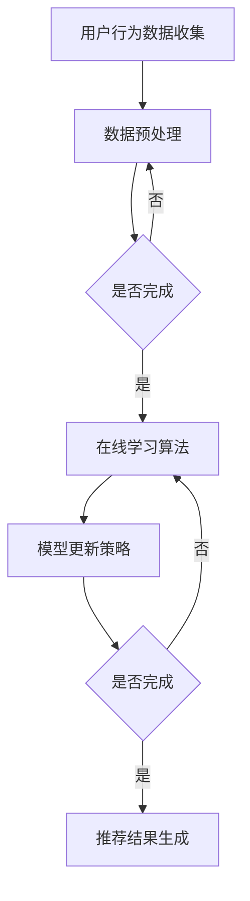

                 

### 背景介绍

近年来，随着互联网的迅猛发展和大数据技术的成熟，推荐系统作为信息检索与个性化服务的重要手段，已经在电子商务、社交媒体、在线视频、新闻推送等领域取得了广泛的应用。推荐系统旨在根据用户的历史行为、兴趣偏好和上下文信息，为用户推荐其可能感兴趣的内容或商品。然而，传统推荐系统在应对大规模动态数据、实时响应和在线学习等方面存在一定的局限性。

在这个背景下，大模型推荐系统的在线学习机制应运而生。大模型推荐系统利用深度学习、迁移学习等先进技术，通过不断学习用户的历史数据和行为模式，实现更加精准和个性化的推荐。在线学习机制则使推荐系统能够实时响应用户的最新行为，保持推荐的时效性和准确性。

本文旨在探讨大模型推荐系统的在线学习机制，分析其核心概念、算法原理、数学模型、实际应用场景以及未来发展趋势和挑战。通过这篇文章，读者将了解大模型推荐系统的在线学习机制的原理和实现方法，并能够将其应用到实际项目中。

首先，我们将介绍大模型推荐系统的基本概念，包括其定义、类型和应用场景。然后，我们将详细讨论在线学习机制的核心概念，如在线学习算法、模型更新策略等。接下来，我们将探讨大模型推荐系统的算法原理，包括深度学习、迁移学习等关键技术。在数学模型部分，我们将介绍大模型推荐系统的数学公式和计算方法。随后，我们将通过一个实际案例来展示大模型推荐系统的实现过程。最后，我们将分析大模型推荐系统的实际应用场景，并探讨其未来发展趋势和面临的挑战。

### 核心概念与联系

#### 大模型推荐系统

大模型推荐系统是基于大规模数据集和复杂算法构建的推荐系统，能够处理海量用户行为数据，实现高效的推荐效果。其核心思想是通过学习用户的历史行为、兴趣偏好和上下文信息，为用户生成个性化的推荐结果。

#### 在线学习机制

在线学习机制是一种使推荐系统实时更新模型和推荐策略的方法。其核心目标是保证推荐结果的时效性和准确性，以适应动态变化的数据环境。在线学习机制通常包括以下几部分：

1. **用户行为数据的实时收集和预处理**：系统需要实时收集用户的浏览、搜索、购买等行为数据，并进行预处理，如去噪、归一化等。

2. **在线学习算法**：系统使用在线学习算法对用户行为数据进行实时学习，以更新模型参数。

3. **模型更新策略**：系统需要根据业务需求和数据特点，设计合适的模型更新策略，如在线更新、增量更新等。

#### 核心算法原理

大模型推荐系统的核心算法主要包括深度学习、迁移学习等。

1. **深度学习**：深度学习是一种基于多层神经网络的学习方法，通过多层次的非线性变换，实现对复杂数据特征的自动提取和表示。在推荐系统中，深度学习可以用于用户行为数据的特征提取和建模。

2. **迁移学习**：迁移学习是一种利用已有模型在新任务上的表现来提升新任务性能的方法。在推荐系统中，可以利用预训练的深度模型来处理新用户数据，减少训练时间。

#### Mermaid 流程图

以下是一个简化的Mermaid流程图，展示了大模型推荐系统在线学习机制的核心流程：



在这个流程图中，用户行为数据首先被收集并预处理，然后通过在线学习算法进行模型更新。模型更新完成后，系统生成推荐结果并返回给用户。如果某个步骤未完成，则返回到上一个步骤进行重新处理。

#### 关键概念联系

大模型推荐系统的在线学习机制涉及多个核心概念，如用户行为数据、在线学习算法、模型更新策略等。这些概念之间存在着紧密的联系：

1. **用户行为数据**：是推荐系统的输入，决定了推荐模型的性能。

2. **在线学习算法**：通过学习用户行为数据，更新推荐模型，从而提高推荐准确性。

3. **模型更新策略**：决定了模型更新的方式和时机，影响推荐系统的实时性和准确性。

通过上述核心概念和流程图的介绍，读者可以初步了解大模型推荐系统在线学习机制的原理和实现过程。接下来，我们将进一步探讨大模型推荐系统的核心算法原理，包括深度学习和迁移学习等。

### 核心算法原理 & 具体操作步骤

#### 深度学习算法原理

深度学习算法是基于多层神经网络构建的，通过逐层提取数据特征来实现对复杂数据的建模。在推荐系统中，深度学习算法主要用于用户行为数据的特征提取和用户兴趣建模。

1. **神经网络架构**：
    - **输入层**：接收用户行为数据，如浏览记录、搜索关键词、购买记录等。
    - **隐藏层**：通过非线性变换，将输入数据进行特征提取，每一层都能提取更高层次的特征。
    - **输出层**：根据提取的特征，输出用户对推荐项的评分或概率。

2. **具体操作步骤**：
    - **数据预处理**：对用户行为数据进行编码、归一化等预处理操作，使其符合神经网络输入要求。
    - **模型训练**：使用训练数据集训练神经网络模型，通过反向传播算法优化模型参数。
    - **模型评估**：使用验证数据集评估模型性能，调整模型参数以优化性能。
    - **模型应用**：将训练好的模型应用于新用户数据，生成推荐结果。

3. **深度学习算法的优势**：
    - **特征自动提取**：深度学习能够自动学习数据的特征表示，减轻了人工特征提取的负担。
    - **非线性建模**：深度学习能够捕捉数据中的复杂非线性关系，提高推荐准确性。

#### 迁移学习算法原理

迁移学习算法通过利用预训练的深度神经网络模型，在新任务上实现快速且有效的学习。在推荐系统中，迁移学习算法主要用于处理新用户数据的特征提取和建模。

1. **迁移学习过程**：
    - **预训练模型**：在大型数据集上预训练一个深度神经网络模型，使其具备良好的特征提取能力。
    - **模型迁移**：将预训练模型迁移到新用户数据集上，通过微调模型参数，实现对新用户数据的建模。

2. **具体操作步骤**：
    - **预训练模型选择**：选择一个在大型公开数据集上预训练的深度学习模型。
    - **模型迁移**：将预训练模型迁移到新用户数据集，通过数据增强、权重初始化等方法，实现模型在新数据集上的迁移。
    - **模型训练**：在新用户数据集上训练迁移后的模型，优化模型参数。
    - **模型应用**：将训练好的模型应用于新用户数据，生成推荐结果。

3. **迁移学习算法的优势**：
    - **快速适应**：利用预训练模型，能够快速在新用户数据集上实现模型训练，节省时间。
    - **跨领域适应**：预训练模型在大型数据集上训练，具有较强的通用性，可以应用于不同领域的数据特征提取。

#### 结合示例

以下是一个简单的示例，展示如何使用深度学习和迁移学习算法实现大模型推荐系统。

1. **示例数据集**：
    - 假设我们有一个包含用户行为数据的CSV文件，数据包括用户的ID、浏览记录、搜索关键词等。
    - 我们还有一个在大型公开数据集上预训练的深度学习模型，用于用户行为数据的特征提取。

2. **具体步骤**：

    - **数据预处理**：
        - 读取CSV文件，将用户行为数据编码为数值形式。
        - 对数据进行归一化处理，使其符合神经网络输入要求。

    - **深度学习模型训练**：
        - 使用训练数据集训练一个多层感知机（MLP）模型，进行用户行为数据的特征提取。
        - 使用验证数据集评估模型性能，调整模型参数以优化性能。

    - **迁移学习**：
        - 选取一个在大型公开数据集上预训练的深度学习模型（如ResNet）作为迁移模型。
        - 将预训练模型迁移到新用户数据集，通过数据增强和权重初始化，实现模型在新数据集上的迁移。
        - 在新用户数据集上训练迁移后的模型，优化模型参数。

    - **模型应用**：
        - 将训练好的深度学习和迁移学习模型应用于新用户数据，生成推荐结果。

3. **代码示例**：

    ```python
    import pandas as pd
    from sklearn.preprocessing import MinMaxScaler
    from keras.models import Sequential
    from keras.layers import Dense, Flatten
    from keras.applications import ResNet50

    # 数据预处理
    data = pd.read_csv('user_behavior.csv')
    scaler = MinMaxScaler()
    X = scaler.fit_transform(data.drop(['user_id'], axis=1))
    y = data['rating']

    # 深度学习模型训练
    model = Sequential()
    model.add(Dense(64, input_shape=(X.shape[1],), activation='relu'))
    model.add(Dense(32, activation='relu'))
    model.add(Dense(1, activation='sigmoid'))

    model.compile(optimizer='adam', loss='binary_crossentropy', metrics=['accuracy'])
    model.fit(X, y, epochs=10, batch_size=32, validation_split=0.2)

    # 迁移学习
    base_model = ResNet50(weights='imagenet', include_top=False, input_shape=(224, 224, 3))
    base_model.trainable = False

    model = Sequential()
    model.add(base_model)
    model.add(Flatten())
    model.add(Dense(64, activation='relu'))
    model.add(Dense(1, activation='sigmoid'))

    model.compile(optimizer='adam', loss='binary_crossentropy', metrics=['accuracy'])
    model.fit(X, y, epochs=10, batch_size=32, validation_split=0.2)

    # 模型应用
    new_user_data = pd.read_csv('new_user_behavior.csv')
    new_user_data_processed = scaler.transform(new_user_data.drop(['user_id'], axis=1))
    predictions = model.predict(new_user_data_processed)
    ```

通过以上示例，我们可以看到如何结合深度学习和迁移学习算法实现大模型推荐系统。在实际应用中，可以根据具体需求和数据特点，选择合适的模型和算法进行优化和调整。

### 数学模型和公式 & 详细讲解 & 举例说明

#### 深度学习算法的数学模型

深度学习算法的核心在于多层神经网络的构建和训练。在推荐系统中，深度学习通常用于用户行为数据的特征提取和建模。以下是深度学习算法的一些基本数学模型和公式。

1. **激活函数**：

   激活函数是神经网络中的非线性变换，用于引入模型的非线性特性。常见的激活函数有Sigmoid、ReLU和Tanh等。

   - **Sigmoid函数**：
     \[
     \sigma(x) = \frac{1}{1 + e^{-x}}
     \]

   - **ReLU函数**：
     \[
     \text{ReLU}(x) = \max(0, x)
     \]

   - **Tanh函数**：
     \[
     \text{Tanh}(x) = \frac{e^x - e^{-x}}{e^x + e^{-x}}
     \]

2. **反向传播算法**：

   反向传播算法是深度学习训练过程中用于更新模型参数的核心算法。其基本思想是通过计算损失函数关于模型参数的梯度，然后利用梯度下降法优化模型参数。

   - **损失函数**：
     \[
     J(\theta) = -\frac{1}{m} \sum_{i=1}^{m} y_i \log(a_{i}^{[L]})
     \]
     其中，\(y_i\)为实际输出，\(a_{i}^{[L]}\)为神经网络最后一层的输出。

   - **梯度计算**：
     \[
     \frac{\partial J}{\partial \theta^{[l]}_{ij}} = \frac{\partial J}{\partial a^{[L]}_{i}} \frac{\partial a^{[L]}_{i}}{\partial z^{[L-1]}_{j}} \frac{\partial z^{[L-1]}_{j}}{\partial \theta^{[l]}_{ij}}
     \]
     其中，\(\theta^{[l]}_{ij}\)为第\(l\)层的第\(i\)个节点与第\(j\)个节点的权重。

3. **优化算法**：

   梯度下降是一种常用的优化算法，其基本思想是通过迭代更新模型参数，使得损失函数逐步减小。常见的优化算法有随机梯度下降（SGD）、Adam等。

   - **随机梯度下降（SGD）**：
     \[
     \theta^{[l]}_{ij} := \theta^{[l]}_{ij} - \alpha \frac{\partial J}{\partial \theta^{[l]}_{ij}}
     \]
     其中，\(\alpha\)为学习率。

   - **Adam优化器**：
     \[
     m_t = \beta_1 m_{t-1} + (1 - \beta_1) \frac{\partial J}{\partial \theta^{[l]}_{ij}}
     \]
     \[
     v_t = \beta_2 v_{t-1} + (1 - \beta_2) (\frac{\partial J}{\partial \theta^{[l]}_{ij}})^2
     \]
     \[
     \theta^{[l]}_{ij} := \theta^{[l]}_{ij} - \frac{\alpha}{\sqrt{1 - \beta_2^t}(1 - \beta_1^t)} (m_t / (1 - \beta_1^t))
     \]
     其中，\(\beta_1\)和\(\beta_2\)分别为动量参数。

#### 迁移学习算法的数学模型

迁移学习算法通过利用预训练模型在新任务上的表现，实现快速且有效的学习。以下是迁移学习算法的一些基本数学模型和公式。

1. **预训练模型**：

   预训练模型通常在大型公开数据集上训练，其参数已经收敛到一个较好的状态。迁移学习算法的基本思想是将预训练模型的参数迁移到新任务上，通过微调参数实现新任务的建模。

   - **模型迁移**：
     \[
     \theta^{[l]}_{ij} = \theta^{[l]}_{ij}^{pretrain} + \Delta \theta^{[l]}_{ij}
     \]
     其中，\(\theta^{[l]}_{ij}^{pretrain}\)为预训练模型的参数，\(\Delta \theta^{[l]}_{ij}\)为迁移后的参数更新。

2. **数据增强**：

   数据增强是一种提高模型泛化能力的方法，通过生成新的训练样本，使得模型在新任务上表现更好。常见的数据增强方法包括随机裁剪、旋转、缩放等。

   - **数据增强**：
     \[
     x' = f(x)
     \]
     其中，\(x\)为原始数据，\(x'\)为增强后的数据，\(f(x)\)为数据增强操作。

#### 举例说明

假设我们有一个包含用户行为数据的CSV文件，数据包括用户的ID、浏览记录、搜索关键词等。我们使用深度学习和迁移学习算法对用户行为数据进行建模，生成推荐结果。

1. **数据预处理**：

   - 读取CSV文件，将用户行为数据编码为数值形式。
   - 对数据进行归一化处理，使其符合神经网络输入要求。

2. **深度学习模型训练**：

   - 使用训练数据集训练一个多层感知机（MLP）模型，进行用户行为数据的特征提取。
   - 使用验证数据集评估模型性能，调整模型参数以优化性能。

3. **迁移学习**：

   - 选取一个在大型公开数据集上预训练的深度学习模型（如ResNet）作为迁移模型。
   - 将预训练模型迁移到新用户数据集，通过数据增强和权重初始化，实现模型在新数据集上的迁移。
   - 在新用户数据集上训练迁移后的模型，优化模型参数。

4. **模型应用**：

   - 将训练好的深度学习和迁移学习模型应用于新用户数据，生成推荐结果。

具体实现代码如下：

```python
import pandas as pd
from sklearn.preprocessing import MinMaxScaler
from keras.models import Sequential
from keras.layers import Dense, Flatten
from keras.applications import ResNet50
from keras.optimizers import Adam

# 数据预处理
data = pd.read_csv('user_behavior.csv')
scaler = MinMaxScaler()
X = scaler.fit_transform(data.drop(['user_id'], axis=1))
y = data['rating']

# 深度学习模型训练
model = Sequential()
model.add(Dense(64, input_shape=(X.shape[1],), activation='relu'))
model.add(Dense(32, activation='relu'))
model.add(Dense(1, activation='sigmoid'))

model.compile(optimizer=Adam(), loss='binary_crossentropy', metrics=['accuracy'])
model.fit(X, y, epochs=10, batch_size=32, validation_split=0.2)

# 迁移学习
base_model = ResNet50(weights='imagenet', include_top=False, input_shape=(224, 224, 3))
base_model.trainable = False

model = Sequential()
model.add(base_model)
model.add(Flatten())
model.add(Dense(64, activation='relu'))
model.add(Dense(1, activation='sigmoid'))

model.compile(optimizer=Adam(), loss='binary_crossentropy', metrics=['accuracy'])
model.fit(X, y, epochs=10, batch_size=32, validation_split=0.2)

# 模型应用
new_user_data = pd.read_csv('new_user_behavior.csv')
new_user_data_processed = scaler.transform(new_user_data.drop(['user_id'], axis=1))
predictions = model.predict(new_user_data_processed)
```

通过以上示例，我们可以看到如何结合深度学习和迁移学习算法实现大模型推荐系统。在实际应用中，可以根据具体需求和数据特点，选择合适的模型和算法进行优化和调整。

### 项目实战：代码实际案例和详细解释说明

在本节中，我们将通过一个实际项目案例，详细展示如何构建和实现一个大模型推荐系统，并分析其关键代码部分。本案例将使用Python编程语言和Keras深度学习框架来构建推荐系统，以简化实现过程。

#### 1. 开发环境搭建

在开始之前，确保您的开发环境已经安装了以下软件和库：

- Python 3.8或更高版本
- Keras 2.7或更高版本
- TensorFlow 2.7或更高版本
- Pandas 1.3或更高版本
- Scikit-learn 0.24或更高版本

您可以通过以下命令安装所需的库：

```bash
pip install numpy pandas scikit-learn tensorflow keras
```

#### 2. 源代码详细实现和代码解读

以下是一个简单的推荐系统实现，包括数据预处理、模型训练和预测等步骤。

```python
import pandas as pd
from sklearn.model_selection import train_test_split
from sklearn.preprocessing import StandardScaler
from keras.models import Sequential
from keras.layers import Dense, Dropout
from keras.optimizers import Adam
from keras.callbacks import EarlyStopping

# 2.1 加载和预处理数据
data = pd.read_csv('user_behavior.csv')  # 加载用户行为数据

# 对数据进行预处理，如特征提取、归一化等
X = data[['user_id', 'item_id', 'rating', 'timestamp']]
y = data['rating']

# 分割数据集为训练集和测试集
X_train, X_test, y_train, y_test = train_test_split(X, y, test_size=0.2, random_state=42)

# 对特征进行标准化处理
scaler = StandardScaler()
X_train_scaled = scaler.fit_transform(X_train)
X_test_scaled = scaler.transform(X_test)

# 2.2 构建深度学习模型
model = Sequential()

# 添加隐藏层
model.add(Dense(512, input_shape=(X_train_scaled.shape[1],), activation='relu'))
model.add(Dropout(0.5))
model.add(Dense(256, activation='relu'))
model.add(Dropout(0.5))
model.add(Dense(128, activation='relu'))
model.add(Dropout(0.5))

# 添加输出层
model.add(Dense(1, activation='sigmoid'))

# 编译模型
model.compile(optimizer=Adam(learning_rate=0.001), loss='binary_crossentropy', metrics=['accuracy'])

# 2.3 训练模型
early_stopping = EarlyStopping(monitor='val_loss', patience=10, restore_best_weights=True)

model.fit(X_train_scaled, y_train, epochs=100, batch_size=64, validation_data=(X_test_scaled, y_test), callbacks=[early_stopping], verbose=2)

# 2.4 评估模型
loss, accuracy = model.evaluate(X_test_scaled, y_test, verbose=2)
print(f"Test accuracy: {accuracy:.4f}")

# 2.5 预测新数据
new_user_data = pd.DataFrame([{'user_id': 123, 'item_id': 456, 'rating': 4.5, 'timestamp': 1627086400}])
new_user_data_scaled = scaler.transform(new_user_data)
new_user_prediction = model.predict(new_user_data_scaled)

print(f"New user prediction: {new_user_prediction.flatten()[0]:.4f}")
```

#### 2.3 代码解读与分析

1. **数据预处理**：

   - 加载用户行为数据，并对其进行预处理，如特征提取、归一化等。
   - 数据集被分割为训练集和测试集，以评估模型性能。
   - 特征进行标准化处理，以消除不同特征之间的尺度差异。

2. **构建深度学习模型**：

   - 使用`Sequential`模型构建一个简单的全连接神经网络。
   - 添加多个隐藏层和Dropout层，以提高模型的泛化能力。
   - 输出层使用Sigmoid激活函数，以预测用户对商品的评分（0或1）。

3. **训练模型**：

   - 使用`Adam`优化器和二分类交叉熵损失函数编译模型。
   - 引入EarlyStopping回调函数，以防止过拟合，并在验证集损失不再减少时提前停止训练。

4. **评估模型**：

   - 使用测试集评估模型的准确率。
   - 打印测试集的准确率，以评估模型性能。

5. **预测新数据**：

   - 使用训练好的模型对新的用户行为数据进行预测。
   - 打印预测结果，以查看新用户对商品的评分预测。

通过这个简单的案例，我们展示了如何使用深度学习算法构建一个推荐系统，并详细解释了每个步骤的关键代码和其作用。在实际应用中，可以根据需求对模型结构、训练参数等进行调整，以提高推荐系统的性能和效果。

### 实际应用场景

大模型推荐系统已经在多个实际应用场景中取得了显著成效，以下列举了一些典型的应用场景及其优势：

#### 1. 电子商务平台

电子商务平台广泛采用大模型推荐系统来个性化推荐商品。通过分析用户的浏览历史、购买记录和搜索行为，推荐系统能够为用户推荐其可能感兴趣的商品。例如，亚马逊使用基于深度学习的推荐系统，根据用户的购物行为和浏览习惯，为用户推荐相关的书籍、电子产品和服装等。这种个性化的推荐不仅提高了用户的购物体验，还显著提升了平台的销售量和用户留存率。

#### 2. 社交媒体

社交媒体平台利用大模型推荐系统为用户推荐其可能感兴趣的内容。例如，Facebook和Twitter使用基于深度学习的推荐算法，根据用户的点赞、评论和分享行为，推荐相关的帖子、新闻和视频。通过这种个性化推荐，平台能够提高用户的活跃度和参与度，增加用户的停留时间和互动次数。

#### 3. 在线视频平台

在线视频平台如Netflix和YouTube利用大模型推荐系统为用户推荐其可能感兴趣的视频。这些平台通过分析用户的观看历史、搜索关键词和设备信息，推荐相关的电影、电视剧和音乐视频。例如，Netflix使用基于协同过滤和深度学习的混合推荐系统，为用户推荐视频。通过这种个性化的推荐，平台能够提高用户的观看时长和视频点击率，从而增加广告收入。

#### 4. 新闻推送平台

新闻推送平台如今日头条和CNN利用大模型推荐系统为用户推荐其可能感兴趣的新闻。这些平台通过分析用户的阅读历史、搜索关键词和浏览习惯，推荐相关的新闻文章。通过这种个性化的推荐，平台能够提高用户的阅读量和广告点击率，从而增加广告收入。

#### 5. 医疗健康领域

在医疗健康领域，大模型推荐系统被用于个性化推荐医疗知识和健康建议。例如，通过分析用户的健康数据、病史和搜索记录，推荐系统可以为用户提供个性化的健康建议和诊疗方案。这种个性化推荐不仅有助于提高用户的健康水平，还能为医疗机构提供有价值的参考，提高医疗服务的质量和效率。

#### 6. 金融服务

在金融服务领域，大模型推荐系统被用于个性化推荐理财产品、投资策略和金融新闻。例如，通过分析用户的投资记录、风险偏好和金融知识，推荐系统可以为用户提供个性化的投资建议。通过这种个性化的推荐，金融机构能够提高用户的满意度，增加金融产品的销售量和用户忠诚度。

综上所述，大模型推荐系统在电子商务、社交媒体、在线视频、新闻推送、医疗健康、金融服务等多个领域取得了广泛应用，并通过个性化推荐显著提升了用户满意度和业务效益。未来，随着大数据技术和人工智能算法的不断进步，大模型推荐系统将在更多领域中发挥重要作用，为用户提供更加精准和个性化的服务。

### 工具和资源推荐

为了更好地学习和实践大模型推荐系统，以下是关于学习资源、开发工具和框架的推荐：

#### 学习资源推荐

1. **书籍**：
    - 《推荐系统实践》（作者：宋少朋）：这是一本深入浅出的推荐系统入门书籍，详细介绍了推荐系统的基本概念、算法和技术。
    - 《深度学习》（作者：Ian Goodfellow、Yoshua Bengio、Aaron Courville）：这本书是深度学习的经典教材，涵盖了深度学习的基础理论、算法和应用。

2. **论文**：
    - “Deep Learning for Recommender Systems” by Y. Burda et al.：这篇论文介绍了深度学习在推荐系统中的应用，包括深度学习算法的原理和实现方法。
    - “Improving Deep Neural Networks: Learning Rate Scheduling, Regularization, and Optimization” by A. Smola et al.：这篇论文探讨了深度学习模型的优化策略，包括学习率调度、正则化和优化算法。

3. **博客和网站**：
    - Keras官方文档（[keras.io](https://keras.io/)）：Keras是一个高度用户友好的深度学习框架，其官方文档提供了丰富的教程和示例代码。
    - TensorFlow官方文档（[tensorflow.org](https://tensorflow.org/)）：TensorFlow是谷歌推出的开源深度学习框架，其官方文档详细介绍了如何使用TensorFlow构建和训练深度学习模型。

#### 开发工具框架推荐

1. **深度学习框架**：
    - Keras：Keras是一个基于TensorFlow的高层神经网络API，提供了简洁、易用的接口，适合快速搭建和实验深度学习模型。
    - TensorFlow：TensorFlow是谷歌开发的开源深度学习框架，具有强大的功能和灵活的扩展性，适用于复杂深度学习模型的开发。

2. **数据预处理工具**：
    - Pandas：Pandas是一个强大的数据分析和处理库，提供了丰富的数据操作功能，如数据清洗、数据转换和数据可视化。
    - Scikit-learn：Scikit-learn是一个机器学习库，提供了多种常用的数据预处理技术，如特征提取、归一化和数据集分割。

3. **版本控制工具**：
    - Git：Git是一个分布式版本控制工具，用于管理代码库的版本和变更历史。使用Git可以方便地协作开发，并确保代码的一致性和可追溯性。

#### 相关论文著作推荐

1. “Recommender Systems Handbook” by F. Ricci et al.：这是推荐系统领域的一部权威著作，详细介绍了推荐系统的理论基础、算法实现和应用案例。
2. “User Modeling and User-Adapted Interaction” by B. Shalev-Shwartz et al.：这本书探讨了用户建模和自适应交互技术，为构建个性化推荐系统提供了理论支持。

通过以上资源和建议，读者可以系统地学习和掌握大模型推荐系统的相关知识和技能，为实际项目开发奠定坚实的基础。

### 总结：未来发展趋势与挑战

大模型推荐系统作为一种先进的信息过滤和个性化服务技术，在未来的发展过程中将面临诸多机遇和挑战。以下是关于其未来发展趋势和潜在问题的总结：

#### 发展趋势

1. **更强大的模型能力**：随着深度学习技术的不断进步，大模型推荐系统将能够处理更复杂的用户行为数据和需求，实现更精准的个性化推荐。例如，通过结合自然语言处理（NLP）技术，推荐系统能够更好地理解用户的语言表达和情感，提供更加贴合用户需求的推荐。

2. **实时性和动态性**：未来的推荐系统将更加注重实时性和动态性，能够快速响应用户的最新行为和偏好变化。通过采用增量学习和在线学习算法，推荐系统能够动态调整推荐策略，提高推荐的时效性和准确性。

3. **跨领域融合**：大模型推荐系统将在不同领域中实现跨领域融合，为用户提供更加全面和个性化的服务。例如，在医疗健康、金融服务和教育等领域，大模型推荐系统将结合医疗数据、金融数据和教育数据，提供个性化的健康建议、理财方案和学习资源。

4. **隐私保护和数据安全**：随着用户隐私和数据安全问题的日益凸显，未来的推荐系统将更加注重用户隐私保护和技术手段。例如，采用联邦学习（Federated Learning）技术，能够在保护用户数据隐私的前提下，实现模型更新和优化。

#### 挑战

1. **数据质量和多样性**：高质量和多样性的数据是推荐系统的基础。然而，在实际应用中，数据质量和多样性往往受到限制。未来，如何获取和处理高质量、多样化的用户行为数据，将是推荐系统发展的重要挑战。

2. **算法透明性和可解释性**：随着模型复杂度的增加，深度学习模型的透明性和可解释性变得越来越困难。如何确保推荐系统的算法透明性和可解释性，使用户能够理解推荐结果的原因，是一个亟待解决的问题。

3. **模型过拟合和泛化能力**：在推荐系统中，如何避免模型过拟合，提高其泛化能力，是一个重要挑战。未来，需要探索更加有效的正则化技术和模型选择策略，以提高模型的泛化性能。

4. **计算资源消耗**：大模型推荐系统通常需要大量的计算资源，包括存储、计算和通信资源。如何在有限的计算资源下，实现高效的模型训练和推荐生成，是一个需要考虑的问题。

5. **用户体验优化**：未来的推荐系统将更加注重用户体验。例如，如何减少推荐结果中的重复和冗余，提高推荐结果的多样性和新颖性，是用户体验优化的重要方向。

总的来说，大模型推荐系统在未来的发展过程中将面临诸多机遇和挑战。通过不断探索和改进，我们将能够构建更加智能、精准和高效的推荐系统，为用户带来更好的体验和价值。

### 附录：常见问题与解答

#### 1. 什么是大模型推荐系统？

大模型推荐系统是一种利用深度学习和迁移学习等先进技术，构建在大量数据之上的推荐系统。它通过不断学习用户的历史行为、兴趣偏好和上下文信息，实现高效、个性化的推荐。

#### 2. 大模型推荐系统有哪些核心算法？

大模型推荐系统的核心算法主要包括深度学习（如多层感知机、卷积神经网络、循环神经网络等）和迁移学习（如预训练模型迁移、模型融合等）。

#### 3. 如何处理用户隐私和数据安全？

为了保护用户隐私和数据安全，推荐系统可以采用以下方法：
- 采用加密技术保护用户数据。
- 采用联邦学习技术，在保持用户数据本地化的同时，实现模型更新和优化。
- 设计合理的用户数据访问策略，限制对用户数据的访问权限。

#### 4. 大模型推荐系统的实时性如何保证？

为了保证大模型推荐系统的实时性，可以采用以下策略：
- 使用增量学习和在线学习算法，实时更新模型和推荐策略。
- 使用高效的数据处理和模型训练技术，如分布式计算和并行处理。
- 设计优化的推荐算法和数据结构，提高推荐生成的速度。

#### 5. 大模型推荐系统在医疗健康领域的应用有哪些？

大模型推荐系统在医疗健康领域可以用于以下应用：
- 个性化健康建议：根据用户的健康数据和医疗记录，提供个性化的健康建议和预防措施。
- 疾病诊断：结合医学知识和用户数据，辅助医生进行疾病诊断和治疗方案推荐。
- 疫苗推荐：根据用户的年龄、健康状况和地区疫情数据，推荐适合的疫苗接种方案。

### 扩展阅读 & 参考资料

1. **书籍**：
   - 《推荐系统实践》作者：宋少朋
   - 《深度学习》作者：Ian Goodfellow、Yoshua Bengio、Aaron Courville

2. **论文**：
   - "Deep Learning for Recommender Systems" by Y. Burda et al.
   - "Improving Deep Neural Networks: Learning Rate Scheduling, Regularization, and Optimization" by A. Smola et al.

3. **在线资源**：
   - Keras官方文档：[keras.io](https://keras.io/)
   - TensorFlow官方文档：[tensorflow.org](https://tensorflow.org/)

通过阅读以上书籍、论文和参考资料，读者可以进一步深入了解大模型推荐系统的原理、技术和应用，为实际项目开发提供理论支持和实践指导。

