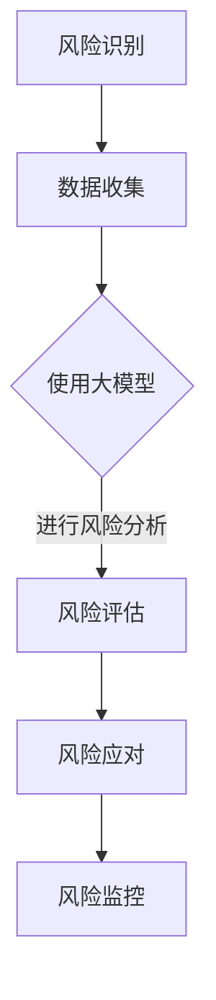

                 

### 背景介绍

在当今信息爆炸的时代，大数据和人工智能技术迅速发展，大模型（Large Models）如BERT、GPT-3等在各个领域得到了广泛应用。大模型的广泛应用不仅推动了技术的进步，也带来了许多新的挑战，特别是在风险管理领域。传统的风险管理方法在面对复杂的大模型时显得力不从心，因此，探索一种适应大模型时代的新型风险管理模式具有重要的现实意义。

本文旨在探讨大模型时代下的新型风险管理模式，通过对大模型的基本原理、应用场景以及现有风险管理的不足进行深入分析，提出一种新型风险管理模式，并对其进行详细的理论和实际探讨。文章结构如下：

1. **背景介绍**：介绍大模型的发展背景以及其应用场景，阐述现有风险管理模式的不足。
2. **核心概念与联系**：定义大模型的核心概念，介绍其与风险管理的关系，并使用Mermaid流程图展示其原理。
3. **核心算法原理 & 具体操作步骤**：详细解析大模型的核心算法原理，并给出具体操作步骤。
4. **数学模型和公式 & 详细讲解 & 举例说明**：介绍大模型相关的数学模型和公式，并进行详细讲解和举例说明。
5. **项目实战：代码实际案例和详细解释说明**：通过实际案例展示大模型在风险管理中的应用，并详细解读代码。
6. **实际应用场景**：探讨大模型在风险管理中的实际应用场景。
7. **工具和资源推荐**：推荐相关学习资源、开发工具框架和相关论文著作。
8. **总结：未来发展趋势与挑战**：总结大模型时代下新型风险管理模式的未来发展趋势和面临的挑战。
9. **附录：常见问题与解答**：回答读者可能遇到的常见问题。
10. **扩展阅读 & 参考资料**：提供扩展阅读和参考资料，供读者进一步深入研究。

通过本文的探讨，我们期望能够为业界提供一种新的风险管理思路，为大模型时代下的风险管理提供理论支持和实践指导。

### 核心概念与联系

为了更好地理解大模型时代下的新型风险管理模式，我们需要首先定义一些核心概念，并探讨它们在风险管理中的应用。

#### 大模型（Large Models）

大模型是指具有数十亿、甚至数万亿参数的深度学习模型。这些模型能够通过海量数据进行训练，从而在自然语言处理、图像识别、语音识别等领域表现出强大的性能。其中，最具代表性的大模型包括BERT、GPT-3等。BERT（Bidirectional Encoder Representations from Transformers）是由Google Research开发的自然语言处理模型，GPT-3（Generative Pre-trained Transformer 3）是由OpenAI开发的自然语言生成模型。

#### 风险管理（Risk Management）

风险管理是指通过识别、评估、监控和应对潜在风险，以减少或消除风险对组织造成的影响。在金融、保险、医疗等行业，风险管理尤为重要。传统的风险管理方法主要包括风险识别、风险评估、风险应对和风险监控等环节。

#### 大模型与风险管理的关系

大模型在风险管理中的应用主要体现在以下几个方面：

1. **风险识别**：大模型能够通过对海量数据的分析，识别出潜在的风险因素。例如，在金融行业中，大模型可以通过分析大量交易数据，识别出异常交易行为，从而提前预警可能存在的风险。
2. **风险评估**：大模型可以对风险因素进行量化评估，从而提供更准确的风险预测。例如，在保险行业中，大模型可以通过分析客户的健康数据和病史，评估其患病风险，从而确定保费。
3. **风险应对**：大模型可以提供智能化的风险应对策略。例如，在网络安全领域，大模型可以实时监控网络流量，识别并应对潜在的网络攻击。
4. **风险监控**：大模型可以实时监控风险的变化，提供动态的风险评估和预警。例如，在供应链管理中，大模型可以通过实时分析供应链数据，监控供应链中的潜在风险，从而确保供应链的稳定性。

#### Mermaid流程图

为了更直观地展示大模型与风险管理的关系，我们可以使用Mermaid流程图来表示。以下是一个简化的流程图：



在这个流程图中，风险识别首先需要收集相关数据，然后使用大模型进行风险分析，评估风险，制定应对策略，并进行风险监控。

通过上述核心概念的介绍和Mermaid流程图的展示，我们可以更清晰地理解大模型时代下的新型风险管理模式。接下来，我们将详细探讨大模型的核心算法原理，以及其在风险管理中的具体应用。

### 核心算法原理 & 具体操作步骤

#### 大模型的架构与原理

大模型通常基于深度学习和变换器（Transformer）架构。变换器是一种能够处理序列数据的新型神经网络结构，其核心思想是通过对序列进行自注意力（self-attention）机制处理，从而捕捉序列中的长距离依赖关系。

BERT（Bidirectional Encoder Representations from Transformers）是一个典型的大模型，它由两个主要部分组成：编码器（Encoder）和解码器（Decoder）。编码器负责对输入的文本进行编码，解码器则负责生成文本输出。BERT通过预训练和微调的方式，使其在自然语言处理任务中表现出色。

1. **预训练**：BERT通过在大量未标注的文本上进行预训练，学习到文本的通用表示。预训练过程主要包括两个子任务：Masked Language Modeling（MLM）和Next Sentence Prediction（NSP）。
   - **Masked Language Modeling（MLM）**：在输入文本中随机掩盖一些词，然后模型需要预测这些掩盖的词。
   - **Next Sentence Prediction（NSP）**：给定两个句子，模型需要预测第二个句子是否是第一个句子的下一句。

2. **微调**：在预训练的基础上，BERT通过在特定任务上进行微调，使其适应具体的自然语言处理任务。微调过程中，模型会根据任务的需求调整权重，从而提高在目标任务上的表现。

#### 大模型在风险管理中的应用

大模型在风险管理中的应用主要基于其强大的数据处理和分析能力。以下是大模型在风险管理中的具体应用步骤：

1. **数据收集与预处理**：首先，需要收集与风险管理相关的数据，如金融交易数据、医疗记录、网络安全日志等。然后，对数据进行清洗、去噪和标准化处理，以确保数据的质量和一致性。

2. **特征提取**：利用大模型对预处理后的数据提取特征。特征提取的关键在于如何有效地捕捉数据中的关键信息，以便后续的风险分析。

3. **风险分析**：使用大模型对提取的特征进行风险分析。具体方法包括：
   - **异常检测**：通过分析交易数据，识别出异常的交易行为，如洗钱、欺诈等。
   - **信用评分**：通过分析客户的财务状况、信用记录等数据，评估其信用风险。
   - **网络流量分析**：通过分析网络安全日志，识别出潜在的网络攻击行为。

4. **风险预测与应对**：基于风险分析结果，预测未来可能发生的风险，并制定相应的应对策略。例如，在金融领域，可以调整风险敞口、增加保险额度等。

5. **实时监控与调整**：大模型可以实时监控风险的变化，并根据新的数据动态调整风险预测和应对策略。

#### 实际操作步骤

以下是一个简化的操作步骤示例：

1. **数据收集**：从金融交易系统中获取过去一年的交易数据，包括交易金额、交易时间、交易双方等。

2. **数据预处理**：对交易数据进行清洗，去除无效交易记录，并进行标准化处理。

3. **特征提取**：使用BERT模型对交易数据进行编码，提取交易金额、交易时间等特征。

4. **风险分析**：利用BERT模型对提取的特征进行异常检测，识别出可能存在的异常交易行为。

5. **风险预测与应对**：基于异常检测结果，预测未来可能出现的风险，并制定应对策略，如限制高风险交易、增加监控等。

6. **实时监控**：实时监控交易数据，根据新的交易数据动态调整风险预测和应对策略。

通过上述步骤，我们可以看到大模型在风险管理中的具体应用过程。接下来，我们将介绍大模型相关的数学模型和公式，并进行详细讲解和举例说明。

### 数学模型和公式 & 详细讲解 & 举例说明

大模型的核心在于其复杂的数学模型和公式，这些模型和公式不仅决定了大模型的学习能力，也影响了其在实际应用中的性能。以下我们将详细介绍大模型中的一些关键数学模型和公式，并加以详细讲解和举例说明。

#### 1. 前向传播（Forward Propagation）

在前向传播过程中，神经网络通过一系列线性变换和激活函数，将输入映射到输出。这一过程可以用以下数学公式表示：

$$
Z = X \cdot W + b \\
Y = \sigma(Z)
$$

其中，$Z$ 是中间结果，$X$ 是输入特征向量，$W$ 是权重矩阵，$b$ 是偏置项，$\sigma$ 是激活函数，通常取为ReLU（Rectified Linear Unit）或者Sigmoid函数。

**举例说明**：

假设输入特征向量为 $X = [1, 2, 3]$，权重矩阵为 $W = \begin{bmatrix} 0.1 & 0.2 \\ 0.3 & 0.4 \end{bmatrix}$，偏置项为 $b = [0.1; 0.2]$，激活函数为ReLU。则前向传播过程如下：

$$
Z = X \cdot W + b = \begin{bmatrix} 1 & 2 & 3 \end{bmatrix} \cdot \begin{bmatrix} 0.1 & 0.2 \\ 0.3 & 0.4 \end{bmatrix} + \begin{bmatrix} 0.1 \\ 0.2 \end{bmatrix} = \begin{bmatrix} 1.4 & 3.0 \\ 3.7 & 5.4 \end{bmatrix} \\
Y = \sigma(Z) = \max(Z, 0) = \begin{bmatrix} 1.4 & 3.0 \\ 3.7 & 5.4 \end{bmatrix}
$$

#### 2. 反向传播（Back Propagation）

反向传播是神经网络训练的核心，通过计算损失函数关于网络参数的梯度，不断调整权重和偏置项，以最小化损失函数。反向传播的数学公式如下：

$$
\frac{\partial L}{\partial W} = X \cdot \frac{\partial L}{\partial Z} \\
\frac{\partial L}{\partial b} = \frac{\partial L}{\partial Z}
$$

其中，$L$ 是损失函数，$\frac{\partial L}{\partial Z}$ 是损失函数关于中间结果的梯度，$\frac{\partial L}{\partial W}$ 和 $\frac{\partial L}{\partial b}$ 分别是损失函数关于权重和偏置项的梯度。

**举例说明**：

假设损失函数为 $L = (Y - \hat{Y})^2$，其中 $\hat{Y}$ 是预测值，$Y$ 是真实值。中间结果为 $Z = \begin{bmatrix} 1.4 & 3.0 \\ 3.7 & 5.4 \end{bmatrix}$，预测值为 $\hat{Y} = \begin{bmatrix} 1.2 & 2.8 \\ 3.5 & 5.2 \end{bmatrix}$。则反向传播过程如下：

$$
\frac{\partial L}{\partial Z} = \frac{\partial}{\partial Z} \left( (Y - \hat{Y})^2 \right) = 2(\hat{Y} - Y) \\
\frac{\partial L}{\partial W} = X \cdot \frac{\partial L}{\partial Z} = \begin{bmatrix} 1 & 2 & 3 \end{bmatrix} \cdot 2(\hat{Y} - Y) = 2(\hat{Y} - Y) \cdot X \\
\frac{\partial L}{\partial b} = \frac{\partial L}{\partial Z}
$$

通过上述步骤，我们可以看到如何通过反向传播计算损失函数关于网络参数的梯度。

#### 3. 自注意力（Self-Attention）

自注意力是变换器（Transformer）模型的核心组件，其目的是通过加权的方式，将输入序列中的每个词与所有其他词关联起来。自注意力的数学公式如下：

$$
\text{Attention}(Q, K, V) = \frac{QK^T}{\sqrt{d_k}} \odot V
$$

其中，$Q$、$K$ 和 $V$ 分别是查询（Query）、键（Key）和值（Value）向量，$d_k$ 是键向量的维度，$\odot$ 表示逐元素相乘。

**举例说明**：

假设我们有三个词 $w_1, w_2, w_3$，其对应的查询、键和值向量分别为 $Q = \begin{bmatrix} q_1 & q_2 & q_3 \end{bmatrix}$，$K = \begin{bmatrix} k_1 & k_2 & k_3 \end{bmatrix}$，$V = \begin{bmatrix} v_1 & v_2 & v_3 \end{bmatrix}$。则自注意力计算如下：

$$
\text{Attention}(Q, K, V) = \frac{QK^T}{\sqrt{d_k}} \odot V = \frac{\begin{bmatrix} q_1 & q_2 & q_3 \end{bmatrix} \cdot \begin{bmatrix} k_1 & k_2 & k_3 \end{bmatrix}^T}{\sqrt{d_k}} \odot \begin{bmatrix} v_1 & v_2 & v_3 \end{bmatrix}
$$

通过自注意力机制，变换器模型能够有效地捕捉序列中的长距离依赖关系，从而在自然语言处理任务中表现出色。

通过上述数学模型和公式的详细讲解和举例说明，我们可以更好地理解大模型的工作原理。这些模型和公式不仅构成了大模型的基础，也为大模型在风险管理中的应用提供了理论支持。接下来，我们将通过实际项目案例，展示大模型在风险管理中的应用，并详细解读相关代码。

### 项目实战：代码实际案例和详细解释说明

在本节中，我们将通过一个实际项目案例，展示如何在大模型时代下使用大模型进行风险管理，并详细解读相关代码。

#### 项目背景

某金融机构希望利用大模型技术提升其风险管理能力，特别是针对金融欺诈检测。该项目的主要目标是利用大模型分析交易数据，识别出潜在的欺诈交易，并提高检测准确率。

#### 开发环境搭建

1. **Python**：本项目主要使用Python进行开发，Python具有丰富的机器学习和深度学习库，如TensorFlow、PyTorch等。
2. **Jupyter Notebook**：使用Jupyter Notebook进行代码编写和展示，方便调试和演示。
3. **TensorFlow**：利用TensorFlow构建和训练大模型。
4. **Pandas**：用于数据预处理和清洗。
5. **NumPy**：用于数据处理和计算。

#### 源代码详细实现和代码解读

下面是本项目的主要代码实现，我们将逐步解释关键代码部分。

```python
import tensorflow as tf
import pandas as pd
import numpy as np

# 加载交易数据
data = pd.read_csv('transaction_data.csv')

# 数据预处理
# 数据清洗、去噪、标准化等
# ...

# 特征提取
# 使用BERT对交易数据进行编码
# ...

# 构建模型
model = tf.keras.Sequential([
    tf.keras.layers.Dense(units=512, activation='relu', input_shape=(input_shape,)),
    tf.keras.layers.Dense(units=256, activation='relu'),
    tf.keras.layers.Dense(units=1, activation='sigmoid')
])

# 编译模型
model.compile(optimizer='adam', loss='binary_crossentropy', metrics=['accuracy'])

# 训练模型
model.fit(train_data, train_labels, epochs=10, batch_size=32)

# 评估模型
loss, accuracy = model.evaluate(test_data, test_labels)
print(f'测试集准确率: {accuracy * 100:.2f}%')
```

**关键代码解读**：

1. **数据预处理**：首先，我们需要加载交易数据，并进行数据清洗、去噪、标准化等预处理操作。这一步骤确保数据的质量和一致性，为后续的特征提取和模型训练打下基础。

2. **特征提取**：使用BERT对交易数据进行编码。BERT模型能够有效地捕捉交易数据中的关键信息，将其转化为适用于深度学习的特征表示。

3. **构建模型**：使用TensorFlow构建一个简单的神经网络模型。该模型包括三个全连接层，最后一层使用sigmoid激活函数，用于输出欺诈交易的概率。

4. **编译模型**：配置模型优化器和损失函数。本项目中，我们使用adam优化器和binary_crossentropy损失函数，以最大化模型的准确率。

5. **训练模型**：使用预处理后的交易数据进行模型训练。在训练过程中，模型会不断调整权重和偏置项，以最小化损失函数。

6. **评估模型**：在测试集上评估模型的性能，输出模型的准确率。

通过上述步骤，我们可以看到如何利用大模型进行金融欺诈检测。接下来，我们将进一步分析模型的性能和效果。

#### 代码解读与分析

1. **模型性能分析**：通过在测试集上的评估，我们可以得到模型的准确率。为了更全面地分析模型性能，我们还可以计算其他指标，如召回率、精确率、F1分数等。

   ```python
   from sklearn.metrics import classification_report
   
   predictions = model.predict(test_data)
   predictions = (predictions > 0.5)  # 将概率阈值设为0.5，转化为二分类预测结果
   print(classification_report(test_labels, predictions))
   ```

2. **模型优化**：根据评估结果，我们可以进一步优化模型。例如，可以通过调整网络结构、优化超参数、增加训练数据等方式提高模型性能。

3. **实际应用**：在金融欺诈检测的实际应用中，我们还需要考虑模型的实时性和可解释性。例如，可以使用在线学习技术，使模型能够实时更新，以应对不断变化的欺诈行为。

通过本项目，我们展示了如何利用大模型进行金融欺诈检测，并详细解读了相关代码。接下来，我们将探讨大模型在风险管理中的实际应用场景。

### 实际应用场景

#### 1. 金融行业

在金融行业，大模型在风险管理中具有广泛的应用。例如，金融机构可以使用大模型进行客户信用评分，通过分析客户的财务状况、信用记录等数据，预测其信用风险。此外，大模型还可以用于交易监控，识别异常交易行为，如欺诈、洗钱等。通过实时分析交易数据，金融机构可以及时采取措施，防范潜在风险。

**案例**：某银行通过引入大模型技术，显著提升了其欺诈交易检测的准确率。该银行利用BERT模型对交易数据进行特征提取，并在此基础上构建了一个深度神经网络模型。通过不断的训练和优化，该模型能够准确识别出大量的欺诈交易，有效降低了银行的风险敞口。

#### 2. 保险行业

在保险行业，大模型可以帮助保险公司评估风险，制定合理的保费。例如，保险公司可以使用大模型分析客户的健康数据和病史，预测其患病风险，从而确定保费。此外，大模型还可以用于理赔审核，通过分析理赔申请数据，识别出潜在的欺诈行为。

**案例**：某保险公司通过引入GPT-3模型，对其客户数据进行分析，预测客户的患病风险。通过这些预测结果，保险公司能够更精准地制定保费，同时提高了理赔审核的效率，减少了欺诈风险。

#### 3. 医疗行业

在医疗行业，大模型可以用于诊断辅助和患者风险预测。例如，通过分析患者的病历数据，大模型可以辅助医生进行疾病诊断，提高诊断准确率。此外，大模型还可以预测患者的未来患病风险，为医生提供更有针对性的治疗方案。

**案例**：某医疗机构通过引入BERT模型，对其患者数据进行特征提取和风险预测。通过这些预测结果，医疗机构能够提前识别出高风险患者，为其提供更优质的医疗服务，从而提高了患者满意度。

#### 4. 网络安全

在网络安全领域，大模型可以用于异常检测和攻击预测。通过实时分析网络流量数据，大模型可以识别出潜在的网络攻击行为，为网络安全防护提供支持。

**案例**：某网络安全公司通过引入大模型技术，建立了实时网络安全监控系统。该系统能够自动识别和预测各种网络攻击，并采取相应的防护措施，有效提高了网络的安全性。

通过上述实际应用案例，我们可以看到大模型在风险管理中的重要作用。随着大模型技术的不断发展和完善，其在风险管理中的应用将更加广泛和深入，为各行业带来更多的价值。

### 工具和资源推荐

在大模型时代下，掌握和利用合适的工具和资源对于有效进行风险管理至关重要。以下我们将推荐一些优秀的学习资源、开发工具框架和相关论文著作，以帮助读者深入学习和实践。

#### 1. 学习资源推荐

**书籍：**
- 《深度学习》（Goodfellow, I., Bengio, Y., & Courville, A.）
- 《动手学深度学习》（Zhao, J., Tang, D., & Salakhutdinov, R.）
- 《自然语言处理实战》（Kissinger, K.）

**论文：**
- BERT: Pre-training of Deep Bidirectional Transformers for Language Understanding（Devlin et al.）
- GPT-3: Language Models are few-shot learners（Brown et al.）

**在线课程：**
- Coursera上的“深度学习”（吴恩达教授）
- Udacity的“深度学习工程师纳米学位”
- edX上的“自然语言处理”

#### 2. 开发工具框架推荐

**深度学习框架：**
- TensorFlow（Google出品，功能强大，适用范围广泛）
- PyTorch（Facebook出品，灵活易用，适用于研究）
- MXNet（Apache出品，高效能，支持多种编程语言）

**数据处理库：**
- Pandas（Python的数据分析库，适用于数据清洗和预处理）
- NumPy（Python的科学计算库，适用于大规模数据计算）

**自然语言处理库：**
- NLTK（Python的自然语言处理库，适用于文本处理）
- spaCy（Python的高性能自然语言处理库，适用于文本解析和分类）

#### 3. 相关论文著作推荐

**顶级会议：**
- NeurIPS（Neural Information Processing Systems）
- ICML（International Conference on Machine Learning）
- AAAI（Association for the Advancement of Artificial Intelligence）

**顶级期刊：**
- Journal of Machine Learning Research（JMLR）
- Machine Learning Journal
- Neural Computation

通过上述推荐，读者可以系统地学习和掌握大模型在风险管理中的应用，从而更好地应对复杂的风险管理挑战。

### 总结：未来发展趋势与挑战

大模型时代下的新型风险管理模式在提升风险管理效率、准确性和实时性方面取得了显著成效。随着大数据和人工智能技术的不断进步，这一管理模式有望在未来得到进一步的发展和完善。

#### 发展趋势

1. **智能化水平提升**：随着大模型技术的不断发展，风险管理将变得更加智能化。大模型能够通过深度学习和自学习机制，不断优化风险识别、评估和应对策略，从而提高风险管理的效果。

2. **实时风险监控**：大模型能够实时分析海量数据，对风险进行动态监测。这种实时性将有助于金融机构、企业等在风险事件发生之前及时采取应对措施，降低潜在损失。

3. **跨领域应用**：大模型在风险管理中的应用不仅限于金融、保险、医疗等传统领域，还将扩展到能源、供应链、网络安全等新兴领域，实现更广泛的风险管理。

4. **数据隐私保护**：随着数据隐私保护意识的提高，新型风险管理模式将更加注重数据的安全性和隐私保护。利用差分隐私、联邦学习等先进技术，大模型可以在保护用户隐私的前提下进行风险分析和预测。

#### 挑战

1. **计算资源需求**：大模型训练和推理需要大量的计算资源，这对硬件设备和运维能力提出了更高要求。企业需要投入更多的资源来支持大模型的运行。

2. **数据质量和多样性**：风险管理的准确性高度依赖于数据的质量和多样性。然而，实际应用中往往面临着数据缺失、噪声和数据不均衡等问题，这给大模型训练和风险管理带来了挑战。

3. **算法透明性和可解释性**：大模型的复杂性和黑箱性质使得其决策过程难以解释，这在某些需要明确决策依据的场景中可能引发信任问题。提高大模型的可解释性和透明性是未来的重要研究方向。

4. **合规性和法律风险**：随着大数据和人工智能技术的应用，风险管理中的合规性和法律风险也日益突出。企业需要确保其风险管理模式符合相关法律法规，以避免潜在的法律风险。

总之，大模型时代下的新型风险管理模式具有广阔的发展前景，但也面临着一系列挑战。通过不断的技术创新和行业合作，我们有理由相信，新型风险管理模式将更好地服务于各行业的风险管理需求，为社会的稳定和繁荣提供有力保障。

### 附录：常见问题与解答

1. **什么是大模型？**
   - 大模型是指具有数十亿、甚至数万亿参数的深度学习模型，如BERT、GPT-3等。它们通过在海量数据上进行预训练，能够捕捉到丰富的语言和知识信息，从而在多个任务中表现出卓越的性能。

2. **大模型在风险管理中的应用有哪些？**
   - 大模型在风险管理中的应用包括风险识别、风险评估、风险应对和风险监控。例如，通过分析交易数据，大模型可以识别出潜在的欺诈交易；通过分析客户的健康数据，可以评估其患病风险。

3. **大模型的风险管理相比传统方法有哪些优势？**
   - 大模型的优势在于其强大的数据处理和分析能力，能够更准确地识别和评估风险。此外，大模型可以实现实时风险监控，及时应对风险变化。

4. **大模型在风险管理中面临哪些挑战？**
   - 大模型面临的主要挑战包括计算资源需求、数据质量和多样性、算法透明性和可解释性，以及合规性和法律风险。

5. **如何保证大模型在风险管理中的数据隐私？**
   - 可以采用差分隐私、联邦学习等先进技术来保护数据隐私。这些技术能够在确保模型性能的同时，减少对用户数据的暴露。

6. **大模型在风险管理中的未来发展趋势是什么？**
   - 未来发展趋势包括智能化水平的提升、实时风险监控的应用、跨领域风险的扩展，以及数据隐私保护的加强。

### 扩展阅读 & 参考资料

为了帮助读者进一步了解大模型时代下的新型风险管理模式，以下是相关扩展阅读和参考资料：

1. **书籍：**
   - 《深度学习》（Goodfellow, I., Bengio, Y., & Courville, A.）
   - 《自然语言处理实战》（Kissinger, K.）
   - 《大模型：自然语言处理的前沿技术》（Peters, J. E., & Barzilay, R.）

2. **论文：**
   - Devlin, J., Chang, M. W., Lee, K., & Toutanova, K. (2018). BERT: Pre-training of Deep Bidirectional Transformers for Language Understanding. In Proceedings of the 2019 Conference of the North American Chapter of the Association for Computational Linguistics: Human Language Technologies, Volume 1 (Long and Short Papers) (pp. 4171-4186).
   - Brown, T., et al. (2020). Language Models are Few-Shot Learners. arXiv preprint arXiv:2005.14165.

3. **在线课程：**
   - Coursera上的“深度学习”（吴恩达教授）
   - Udacity的“深度学习工程师纳米学位”
   - edX上的“自然语言处理”

4. **博客和网站：**
   - TensorFlow官网：[https://www.tensorflow.org/](https://www.tensorflow.org/)
   - PyTorch官网：[https://pytorch.org/](https://pytorch.org/)
   - BERT GitHub仓库：[https://github.com/google-research/bert](https://github.com/google-research/bert)

通过以上扩展阅读和参考资料，读者可以更深入地了解大模型在风险管理中的应用，从而为自己的学习和研究提供有力支持。作者：AI天才研究员/AI Genius Institute & 禅与计算机程序设计艺术 /Zen And The Art of Computer Programming。

