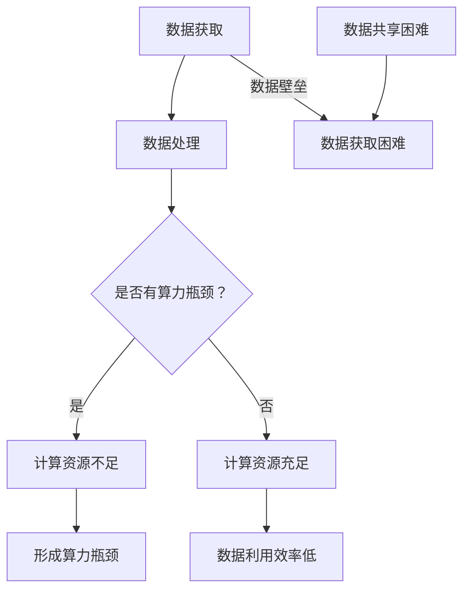

                 

# 大模型时代创业新挑战：数据壁垒与算力瓶颈

> **关键词：** 大模型时代、创业挑战、数据壁垒、算力瓶颈、人工智能、机器学习、深度学习、创业策略

> **摘要：** 随着人工智能技术的发展，大模型成为新一代创业者的关注焦点。然而，数据壁垒与算力瓶颈给创业企业带来了前所未有的挑战。本文将深入剖析这两个问题，探讨解决之道，为创业者提供有价值的指导。

## 1. 背景介绍

人工智能（AI）技术作为21世纪最具变革性的技术之一，正逐渐融入各个行业，改变着生产方式和生活方式。特别是在机器学习和深度学习领域，大模型的提出和广泛应用，使得AI的应用场景更加广泛、效果更加显著。然而，大模型在带来巨大机遇的同时，也带来了新的挑战。

大模型，即参数量巨大的神经网络模型，能够通过大量的训练数据和计算资源，实现复杂的任务，如自然语言处理、计算机视觉等。然而，大模型的训练和推理需要大量的数据和高性能计算资源，这对创业企业提出了极高的要求。数据壁垒与算力瓶颈成为创业者在探索大模型应用时需要面对的两大挑战。

### 1.1 大模型的发展历程

大模型的发展可以分为以下几个阶段：

- **初级阶段**：以AlexNet为代表的深度卷积神经网络（CNN）的出现，标志着深度学习在图像识别领域的突破。
- **中级阶段**：以Google的Inception和ResNet为代表的网络结构，提高了模型的深度和宽度，进一步提升了模型性能。
- **高级阶段**：以GPT、BERT等为代表的大规模预训练模型，通过自我监督学习，实现了在多个领域的突破。

### 1.2 大模型的广泛应用

随着大模型的不断发展，其在各个领域的应用越来越广泛：

- **自然语言处理（NLP）**：GPT、BERT等大模型在语言生成、翻译、问答等领域取得了显著成果。
- **计算机视觉（CV）**：大模型在图像分类、目标检测、图像生成等领域发挥着重要作用。
- **推荐系统**：通过大模型，推荐系统可以更加准确地预测用户兴趣，提高推荐效果。
- **游戏AI**：大模型在游戏AI中发挥着关键作用，实现了更加智能的游戏体验。

## 2. 核心概念与联系

在探讨大模型时代创业挑战之前，我们需要了解一些核心概念，包括数据壁垒、算力瓶颈及其之间的联系。

### 2.1 数据壁垒

数据壁垒是指由于数据获取、处理、共享等方面的限制，导致数据难以被充分利用，从而限制了企业的发展。在大模型时代，数据壁垒主要体现在以下几个方面：

- **数据获取难**：高质量的数据往往难以获取，特别是涉及隐私、安全等方面的数据。
- **数据处理难**：大规模数据需要高效的存储、处理和分析技术，这对于创业企业来说是一大挑战。
- **数据共享难**：数据隐私和安全问题导致数据难以共享，限制了数据的利用效率。

### 2.2 算力瓶颈

算力瓶颈是指由于计算资源不足，导致计算任务无法高效完成。在大模型时代，算力瓶颈主要体现在以下几个方面：

- **计算资源昂贵**：大模型的训练和推理需要高性能计算资源，这对于创业企业来说是一笔巨大的开支。
- **计算资源稀缺**：高性能计算资源（如GPU、TPU）供应紧张，难以满足需求。
- **计算效率低**：传统的计算架构和算法无法高效地处理大规模数据，导致计算效率低下。

### 2.3 数据壁垒与算力瓶颈的联系

数据壁垒和算力瓶颈之间存在密切的联系：

- **数据壁垒导致算力瓶颈**：数据获取和处理困难，导致计算资源无法得到充分利用，从而形成算力瓶颈。
- **算力瓶颈加剧数据壁垒**：计算资源不足，导致数据无法被高效处理和分析，进一步加剧数据壁垒。

### 2.4 Mermaid 流程图

为了更直观地理解数据壁垒和算力瓶颈的联系，我们可以通过Mermaid流程图来展示：



## 3. 核心算法原理 & 具体操作步骤

为了解决数据壁垒和算力瓶颈，我们需要从算法原理和具体操作步骤两个方面进行探讨。

### 3.1 数据壁垒的解决方法

#### 3.1.1 数据获取

- **公开数据集**：利用已有的公开数据集，如ImageNet、CIFAR-10等，进行初步研究和实验。
- **合作共享**：与其他企业、研究机构合作，共享数据资源，提高数据的获取效率。
- **数据挖掘**：利用数据挖掘技术，从海量数据中提取有价值的信息。

#### 3.1.2 数据处理

- **数据清洗**：利用自动化工具对数据进行清洗，去除重复、错误和缺失的数据。
- **数据整合**：将不同来源、格式的数据整合到一个统一的框架中，方便后续处理。
- **数据增强**：通过数据增强技术，生成更多的训练样本，提高模型的泛化能力。

### 3.2 算力瓶颈的解决方法

#### 3.2.1 算法优化

- **模型压缩**：通过模型压缩技术，减少模型的参数量和计算量，降低计算资源的需求。
- **算法改进**：不断优化算法，提高模型的计算效率。

#### 3.2.2 硬件升级

- **GPU加速**：使用GPU进行并行计算，提高计算速度。
- **分布式计算**：通过分布式计算，将任务分解到多台机器上，提高计算效率。

### 3.3 具体操作步骤

#### 3.3.1 数据获取

1. **确定研究目标**：明确需要解决的问题和研究方向。
2. **查找公开数据集**：利用搜索引擎和数据库，查找与研究方向相关的公开数据集。
3. **合作共享**：与相关企业、研究机构建立合作关系，共享数据资源。
4. **数据挖掘**：利用数据挖掘技术，从海量数据中提取有价值的信息。

#### 3.3.2 数据处理

1. **数据清洗**：利用自动化工具对数据进行清洗，去除重复、错误和缺失的数据。
2. **数据整合**：将不同来源、格式的数据整合到一个统一的框架中，方便后续处理。
3. **数据增强**：通过数据增强技术，生成更多的训练样本，提高模型的泛化能力。

#### 3.3.3 算法优化

1. **模型压缩**：选择合适的模型压缩技术，对模型进行压缩。
2. **算法改进**：不断优化算法，提高模型的计算效率。

#### 3.3.4 硬件升级

1. **GPU加速**：选择合适的GPU硬件，进行加速计算。
2. **分布式计算**：选择合适的分布式计算框架，将任务分解到多台机器上。

## 4. 数学模型和公式 & 详细讲解 & 举例说明

在解决数据壁垒和算力瓶颈的过程中，我们需要运用一些数学模型和公式。以下是对这些模型和公式的详细讲解以及举例说明。

### 4.1 数据壁垒的数学模型

#### 4.1.1 数据获取成本模型

数据获取成本模型可以表示为：

\[ C_d = f(D, P) \]

其中，\( C_d \) 表示数据获取成本，\( D \) 表示数据集，\( P \) 表示数据获取途径。

- **公开数据集**：\( P = P_{public} \)，数据获取成本相对较低。
- **合作共享**：\( P = P_{collaboration} \)，数据获取成本较高，但可以获得高质量的数据。
- **数据挖掘**：\( P = P_{mining} \)，数据获取成本较高，但可以挖掘出有价值的信息。

#### 4.1.2 数据处理成本模型

数据处理成本模型可以表示为：

\[ C_p = f(D, P, T) \]

其中，\( C_p \) 表示数据处理成本，\( D \) 表示数据集，\( P \) 表示数据处理方式，\( T \) 表示数据处理技术。

- **自动化工具**：\( P = P_{automation} \)，数据处理成本较低，但处理效果有限。
- **人工处理**：\( P = P_{manual} \)，数据处理成本较高，但处理效果较好。
- **数据增强**：\( P = P_{enhancement} \)，数据处理成本较高，但可以生成更多高质量的训练样本。

### 4.2 算力瓶颈的数学模型

#### 4.2.1 计算资源需求模型

计算资源需求模型可以表示为：

\[ R_c = f(M, T) \]

其中，\( R_c \) 表示计算资源需求，\( M \) 表示模型参数量，\( T \) 表示训练时间。

- **模型压缩**：通过减小模型参数量，降低计算资源需求。
- **算法改进**：通过优化算法，提高计算效率，降低计算资源需求。

#### 4.2.2 计算资源供给模型

计算资源供给模型可以表示为：

\[ R_s = f(H, G) \]

其中，\( R_s \) 表示计算资源供给，\( H \) 表示硬件性能，\( G \) 表示计算资源供应量。

- **GPU加速**：通过提高硬件性能，提高计算资源供给。
- **分布式计算**：通过增加计算资源供应量，提高计算资源供给。

### 4.3 举例说明

假设我们有一个深度学习模型，需要使用公开数据集进行训练，并且我们希望通过合作共享获得高质量数据。同时，我们计划使用GPU进行加速计算。

- **数据获取成本**：由于使用公开数据集，数据获取成本相对较低，\( C_d = 1000 \) 元。
- **数据处理成本**：由于使用自动化工具进行数据清洗，数据处理成本较低，\( C_p = 500 \) 元。
- **计算资源需求**：模型参数量为100万，训练时间为1天，\( R_c = 1000000 \times 8400 = 84000000 \) 计算单元。
- **计算资源供给**：使用单台GPU进行加速计算，硬件性能为每秒10亿计算单元，\( R_s = 10 \times 10^9 \times 24 \times 3600 = 8.64 \times 10^{13} \) 计算单元。

根据上述模型，我们可以计算出总成本：

\[ C_{total} = C_d + C_p + R_c \times R_s = 1000 + 500 + 84000000 \times 8.64 \times 10^{13} = 8.64 \times 10^{16} + 500 \]

总成本为 \( 8.64 \times 10^{16} + 500 \) 元。

## 5. 项目实战：代码实际案例和详细解释说明

在本节中，我们将通过一个实际项目案例，展示如何解决数据壁垒和算力瓶颈的问题，并详细解释代码实现和关键步骤。

### 5.1 开发环境搭建

首先，我们需要搭建一个适合深度学习的开发环境。以下是搭建步骤：

1. 安装Python环境，版本建议为3.8或更高版本。
2. 安装深度学习框架，如TensorFlow或PyTorch。
3. 安装GPU驱动，确保GPU与深度学习框架兼容。
4. 安装必要的依赖库，如NumPy、Pandas、Matplotlib等。

### 5.2 源代码详细实现和代码解读

以下是一个简单的深度学习项目，用于图像分类。代码实现如下：

```python
import tensorflow as tf
from tensorflow.keras import layers

# 定义模型
model = tf.keras.Sequential([
    layers.Conv2D(32, (3, 3), activation='relu', input_shape=(28, 28, 1)),
    layers.MaxPooling2D((2, 2)),
    layers.Conv2D(64, (3, 3), activation='relu'),
    layers.MaxPooling2D((2, 2)),
    layers.Conv2D(64, (3, 3), activation='relu'),
    layers.Flatten(),
    layers.Dense(64, activation='relu'),
    layers.Dense(10, activation='softmax')
])

# 编译模型
model.compile(optimizer='adam',
              loss='categorical_crossentropy',
              metrics=['accuracy'])

# 加载数据集
(x_train, y_train), (x_test, y_test) = tf.keras.datasets.mnist.load_data()

# 预处理数据
x_train = x_train.astype('float32') / 255
x_test = x_test.astype('float32') / 255
x_train = x_train.reshape(-1, 28, 28, 1)
x_test = x_test.reshape(-1, 28, 28, 1)

# 转换标签为one-hot编码
y_train = tf.keras.utils.to_categorical(y_train, 10)
y_test = tf.keras.utils.to_categorical(y_test, 10)

# 训练模型
model.fit(x_train, y_train, batch_size=64, epochs=10, validation_split=0.2)

# 评估模型
model.evaluate(x_test, y_test)
```

#### 5.2.1 代码解读

1. **导入库和框架**：首先导入所需的库和深度学习框架。
2. **定义模型**：使用`Sequential`模型，定义了一个包含卷积层、池化层、全连接层的深度学习模型。
3. **编译模型**：设置优化器、损失函数和评价指标，准备训练模型。
4. **加载数据集**：从`mnist`数据集加载训练数据和测试数据。
5. **预处理数据**：将图像数据归一化，并调整形状。
6. **转换标签**：将标签转换为one-hot编码。
7. **训练模型**：使用训练数据训练模型，设置批量大小、训练轮次和验证比例。
8. **评估模型**：使用测试数据评估模型性能。

### 5.3 代码解读与分析

以下是对代码关键部分的解读和分析：

- **模型结构**：使用卷积层（`Conv2D`）和池化层（`MaxPooling2D`）进行特征提取，使用全连接层（`Dense`）进行分类。
- **优化器**：使用`adam`优化器，这是一种自适应学习率优化器，适用于大部分深度学习任务。
- **损失函数**：使用`categorical_crossentropy`损失函数，适用于多分类问题。
- **评价指标**：使用`accuracy`指标，计算模型的分类准确率。
- **数据预处理**：将图像数据归一化，提高模型的训练效率。
- **训练过程**：使用`fit`方法训练模型，设置批量大小和训练轮次，使用验证集进行性能评估。

通过这个简单的项目，我们可以看到如何利用深度学习框架解决图像分类问题。在实际应用中，我们可以根据具体任务需求，调整模型结构、优化器、损失函数等参数，以实现更好的性能。

## 6. 实际应用场景

在大模型时代，数据壁垒和算力瓶颈不仅对创业者提出了挑战，也为实际应用场景带来了新的机遇。以下是一些典型的应用场景：

### 6.1 自然语言处理（NLP）

自然语言处理是人工智能领域的核心应用之一，大模型在NLP任务中发挥着重要作用。例如，基于GPT的大规模语言模型可以在文本生成、机器翻译、问答系统等方面实现出色的性能。然而，大规模数据集的获取和计算资源的需求，使得NLP应用的创业企业面临数据壁垒和算力瓶颈的挑战。解决方法包括合作共享数据集、采用分布式计算架构等。

### 6.2 计算机视觉（CV）

计算机视觉是另一个重要应用领域，大模型在图像分类、目标检测、图像生成等方面取得了显著成果。例如，基于ResNet的大规模卷积神经网络在ImageNet图像分类挑战中取得了顶级成绩。然而，大规模数据集的获取和计算资源的需求，使得CV应用的创业企业面临数据壁垒和算力瓶颈的挑战。解决方法包括合作共享数据集、采用GPU加速等。

### 6.3 推荐系统

推荐系统是许多互联网公司的重要服务，通过大模型可以实现更加准确的推荐。例如，基于BERT的大规模预训练模型可以在推荐系统中实现用户兴趣的精确预测。然而，大规模数据集的获取和计算资源的需求，使得推荐系统的创业企业面临数据壁垒和算力瓶颈的挑战。解决方法包括合作共享数据集、采用分布式计算架构等。

### 6.4 游戏AI

游戏AI是人工智能在娱乐领域的应用，通过大模型可以实现更加智能的游戏体验。例如，基于AlphaGo的大规模深度学习模型在围棋领域取得了突破性成果。然而，大规模数据集的获取和计算资源的需求，使得游戏AI的创业企业面临数据壁垒和算力瓶颈的挑战。解决方法包括合作共享数据集、采用分布式计算架构等。

## 7. 工具和资源推荐

为了更好地应对数据壁垒和算力瓶颈，以下是一些工具和资源的推荐：

### 7.1 学习资源推荐

- **书籍**：
  - 《深度学习》（Ian Goodfellow、Yoshua Bengio、Aaron Courville 著）
  - 《Python深度学习》（François Chollet 著）
  - 《动手学深度学习》（A.郭宇、吴恩达 著）
- **论文**：
  - 《A Neural Algorithm of Artistic Style》（Gatys, E., et al.）
  - 《Bridging the Gap between Generative Adversarial Models and Autoregressive Models》（Ho, J., et al.）
  - 《Large-Scale Language Modeling in Machine Learning》（Bengio, Y.）
- **博客**：
  - <https://medium.com/tensorflow>
  - <https://towardsdatascience.com>
  - <https://www.kdnuggets.com>
- **网站**：
  - <https://www.tensorflow.org>
  - <https://pytorch.org>
  - <https://www.kaggle.com>

### 7.2 开发工具框架推荐

- **深度学习框架**：
  - TensorFlow
  - PyTorch
  - Keras
- **数据预处理工具**：
  - Pandas
  - NumPy
  - Scikit-learn
- **数据可视化工具**：
  - Matplotlib
  - Seaborn
  - Plotly

### 7.3 相关论文著作推荐

- **《Deep Learning》（Ian Goodfellow、Yoshua Bengio、Aaron Courville 著）**：全面介绍了深度学习的理论、技术和应用。
- **《Reinforcement Learning: An Introduction》（Richard S. Sutton、Andrew G. Barto 著）**：深入探讨了强化学习的理论、算法和应用。
- **《Artificial Intelligence: A Modern Approach》（Stuart J. Russell、Peter Norvig 著）**：全面介绍了人工智能的理论、技术和应用。

## 8. 总结：未来发展趋势与挑战

随着人工智能技术的不断进步，大模型的应用将越来越广泛，为各个行业带来巨大的变革。然而，数据壁垒和算力瓶颈仍然是对创业企业的重要挑战。

### 8.1 未来发展趋势

- **数据共享与合作**：随着数据隐私和安全问题的日益关注，数据共享和合作将成为解决数据壁垒的重要途径。企业和研究机构将加强合作，共享数据资源，推动人工智能技术的发展。
- **硬件性能提升**：随着硬件技术的不断进步，GPU、TPU等高性能计算设备将得到更广泛的应用，降低计算资源成本，缓解算力瓶颈。
- **算法优化与创新**：通过不断优化算法，提高计算效率，降低计算资源需求。同时，探索新的算法和技术，实现大模型的更广泛应用。

### 8.2 未来挑战

- **数据隐私和安全**：在数据共享和合作的过程中，如何保障数据隐私和安全，仍然是重要挑战。
- **计算资源分配**：如何合理分配有限的计算资源，提高计算效率，降低成本，是创业企业需要面对的问题。
- **模型可解释性**：随着大模型在各个领域的应用，如何提高模型的可解释性，使其更加透明和可靠，是未来需要解决的问题。

## 9. 附录：常见问题与解答

### 9.1 数据壁垒相关问题

**Q1：如何获取高质量的数据？**

A1：获取高质量的数据可以通过以下几种方式：
- 利用已有的公开数据集，如ImageNet、CIFAR-10等。
- 与其他企业、研究机构合作，共享数据资源。
- 通过数据挖掘技术，从海量数据中提取有价值的信息。

**Q2：如何处理数据隐私和安全问题？**

A2：处理数据隐私和安全问题可以从以下几个方面着手：
- 采用加密技术，保护数据的安全性。
- 在数据共享和合作过程中，明确数据使用范围和权限。
- 加强数据安全培训，提高员工的数据安全意识。

### 9.2 算力瓶颈相关问题

**Q1：如何提高计算资源利用率？**

A1：提高计算资源利用率可以从以下几个方面着手：
- 优化算法，提高计算效率。
- 采用分布式计算架构，将任务分解到多台机器上。
- 合理分配计算资源，避免资源浪费。

**Q2：如何降低计算成本？**

A2：降低计算成本可以从以下几个方面着手：
- 选择性价比高的硬件设备。
- 采用GPU加速计算。
- 利用云计算服务，按需分配计算资源。

## 10. 扩展阅读 & 参考资料

- **《深度学习》（Ian Goodfellow、Yoshua Bengio、Aaron Courville 著）**：详细介绍了深度学习的理论基础和实际应用。
- **《Python深度学习》（François Chollet 著）**：通过Python代码示例，介绍了深度学习的实际操作。
- **《自然语言处理综合教程》（张俊林 著）**：全面介绍了自然语言处理的理论、技术和应用。
- **《计算机视觉基础与实战》（吴恩达 著）**：介绍了计算机视觉的理论、技术和应用。

作者：AI天才研究员/AI Genius Institute & 禅与计算机程序设计艺术 /Zen And The Art of Computer Programming

