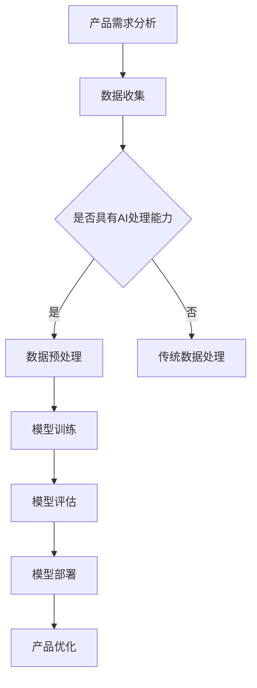

                 

# 大模型时代的创业产品经理挑战：AI 驱动的技能升级

## 关键词：大模型、创业、产品经理、AI、技能升级、技术博客

## 摘要

本文将探讨大模型时代对创业产品经理的挑战，以及如何通过AI驱动的技能升级来应对这些挑战。我们将深入分析大模型的定义、工作原理及其在产品管理中的应用，并探讨产品经理在这一新时代所需的新技能。通过结合具体案例和实用工具推荐，本文旨在为产品经理提供一条清晰的发展路径，以在快速变化的AI技术领域中保持竞争力。

## 1. 背景介绍

在过去的几十年中，人工智能（AI）技术经历了飞速的发展，从简单的规则引擎到复杂的大模型，如BERT、GPT-3等，AI的应用场景已经从实验室走向了商业世界。大模型，特别是基于深度学习的模型，通过大量的数据训练，能够实现前所未有的准确度和性能，为各种行业带来了革命性的变化。

创业产品经理作为连接技术和市场的桥梁，在这个AI驱动的时代面临着新的挑战。首先，他们需要了解并掌握AI的基础知识，以便能够更好地理解技术和市场趋势。其次，他们需要具备快速学习和适应新技能的能力，因为AI技术的发展速度非常快。此外，产品经理还需要具备创新思维和战略眼光，以利用AI技术创造出具有竞争力的产品。

本文将围绕以下几个核心问题展开：

- 大模型是什么？它们如何工作？
- 产品经理需要哪些AI相关的技能？
- 如何利用AI技术提升产品管理效率？
- 创业产品经理在AI时代面临的挑战和机遇是什么？
- 如何通过技能升级来应对这些挑战？

通过上述问题的探讨，本文旨在为创业产品经理提供一套完整的AI技能升级方案，以在未来的竞争中占据有利地位。

## 2. 核心概念与联系

### 2.1 大模型定义

大模型，通常指的是那些拥有数亿至数十亿参数的深度学习模型。这些模型可以通过大量的数据进行训练，以实现高度复杂的任务，如文本生成、图像识别、语音识别等。例如，GPT-3拥有1750亿个参数，是当前最大的语言模型之一。

### 2.2 工作原理

大模型的工作原理基于深度学习，这是一种模仿人脑神经网络结构的学习方式。深度学习模型通过多个层次的神经元处理输入数据，从而学习和提取数据的特征。在训练过程中，模型会不断调整内部参数，以最小化预测误差。通过这种自下而上的学习方式，大模型能够逐渐理解输入数据的复杂结构，并做出准确的预测。

### 2.3 产品管理中的应用

在大模型时代，产品经理可以利用这些先进的技术来提升产品设计的精准度和用户体验。例如，通过文本生成模型，产品经理可以快速生成产品文档、用户手册等；通过图像识别模型，可以优化产品界面的设计和用户体验。

### 2.4 Mermaid 流程图

为了更直观地理解大模型在产品管理中的应用，我们可以使用Mermaid绘制一个简单的流程图。以下是示例：



在上面的流程图中，产品需求分析是整个流程的起点，通过数据收集和预处理，产品经理将数据转化为可以用于模型训练的形式。随后，模型训练和评估是核心步骤，通过不断的迭代优化，最终将训练好的模型部署到产品中，以实现产品优化。

通过上述核心概念和联系的分析，我们可以看到大模型在产品管理中的应用潜力。接下来，我们将进一步探讨大模型的具体算法原理和操作步骤。

## 3. 核心算法原理 & 具体操作步骤

### 3.1 深度学习基础

深度学习是构建大模型的核心技术。其基本原理是通过多层神经网络（Neural Networks）对数据进行建模和预测。每一层神经网络都由若干个神经元（Neurons）组成，神经元之间通过权重（Weights）连接，输入数据经过前向传播（Forward Propagation），在每一层中通过激活函数（Activation Function）进行处理，最终在输出层得到预测结果。

### 3.2 前向传播

前向传播是深度学习中的核心过程。具体步骤如下：

1. **初始化参数**：设定神经网络的初始权重和偏置。
2. **输入数据**：将输入数据输入到第一层神经网络。
3. **逐层计算**：每一层神经元的输出由前一层神经元的输出通过权重和偏置计算得到。
4. **激活函数**：对每个神经元的输出应用激活函数，如ReLU、Sigmoid、Tanh等。
5. **输出结果**：最终输出层的输出即为预测结果。

### 3.3 反向传播

反向传播是调整神经网络参数的关键过程。具体步骤如下：

1. **计算误差**：计算输出层的实际值与预测值之间的误差。
2. **误差反向传播**：将误差沿着神经网络反向传播，计算每一层神经元的梯度。
3. **参数更新**：根据梯度调整神经网络的权重和偏置。
4. **迭代优化**：重复上述过程，直到误差达到可接受的范围。

### 3.4 模型训练

模型训练是构建大模型的关键步骤。具体步骤如下：

1. **数据集划分**：将数据集划分为训练集、验证集和测试集。
2. **初始化模型**：创建神经网络结构，初始化参数。
3. **训练过程**：
   - 使用训练集数据进行前向传播和反向传播。
   - 记录训练过程中的误差和模型性能。
   - 根据性能指标调整学习率和其他超参数。
4. **模型评估**：在验证集和测试集上评估模型性能，确保模型的泛化能力。

### 3.5 模型部署

模型部署是将训练好的模型应用到实际产品中的过程。具体步骤如下：

1. **模型保存**：将训练好的模型参数保存到文件中。
2. **模型加载**：将保存的模型参数加载到应用程序中。
3. **实时预测**：对输入数据进行预处理，使用加载的模型进行实时预测。
4. **结果输出**：将预测结果输出到用户界面或API。

通过上述核心算法原理和具体操作步骤的分析，我们可以看到构建和部署大模型的复杂性。这不仅需要深入理解深度学习的理论基础，还需要掌握实际的编程和数据处理技能。对于创业产品经理来说，这既是挑战，也是机遇。

### 4. 数学模型和公式 & 详细讲解 & 举例说明

#### 4.1 深度学习中的数学公式

深度学习中的数学模型涉及多个方面，包括线性代数、微积分、概率论等。以下是几个核心公式及其解释：

##### 4.1.1 激活函数

激活函数是深度学习中用于引入非线性特性的函数。常用的激活函数包括ReLU、Sigmoid和Tanh。

- **ReLU（Rectified Linear Unit）**:

  $$ f(x) = \max(0, x) $$

 ReLU函数在输入小于0时返回0，在输入大于等于0时返回输入值。这种函数形式简单，且在训练过程中有助于加速收敛。

- **Sigmoid**:

  $$ f(x) = \frac{1}{1 + e^{-x}} $$

  Sigmoid函数将输入映射到(0, 1)区间，常用于二分类问题。

- **Tanh**:

  $$ f(x) = \frac{e^x - e^{-x}}{e^x + e^{-x}} $$

  Tanh函数将输入映射到(-1, 1)区间，类似于Sigmoid函数，但输出值的范围更对称。

##### 4.1.2 前向传播

前向传播过程中，每个神经元的输出可以通过以下公式计算：

$$ z_i = \sum_{j} w_{ij} * a_{j} + b_i $$

其中，$z_i$是第$i$个神经元的输出，$w_{ij}$是第$i$个神经元与第$j$个神经元之间的权重，$a_j$是第$j$个神经元的输出，$b_i$是第$i$个神经元的偏置。

##### 4.1.3 梯度下降

梯度下降是深度学习训练过程中的核心算法。其目的是通过反向传播计算损失函数的梯度，并更新模型参数。

$$ \Delta w_{ij} = -\alpha * \frac{\partial J}{\partial w_{ij}} $$

其中，$\Delta w_{ij}$是权重$w_{ij}$的更新量，$\alpha$是学习率，$J$是损失函数。

#### 4.2 举例说明

为了更好地理解上述数学公式，我们通过一个简单的例子来说明。

假设我们有一个两层的神经网络，第一层有两个神经元，第二层有一个神经元。输入数据为$x_1 = 2, x_2 = 3$。权重和偏置如下：

$$ w_{11} = 0.5, w_{12} = 0.3, b_1 = 0.2 \\
w_{21} = 0.4, w_{22} = 0.6, b_2 = 0.1 $$

使用ReLU函数作为激活函数，我们计算第一层神经元的输出：

$$ a_1 = \max(0, 0.5*2 + 0.3*3 + 0.2) = 2.5 \\
a_2 = \max(0, 0.5*2 + 0.3*3 + 0.2) = 2.5 $$

然后计算第二层神经元的输出：

$$ z_1 = 0.4*2.5 + 0.6*2.5 + 0.1 = 2.0 $$

最后，假设我们的损失函数为平方误差：

$$ J = (z_1 - y)^2 $$

其中，$y$是真实标签。通过反向传播，我们可以计算每个参数的梯度，并更新模型参数。

#### 4.3 模型优化

在实际应用中，我们通常需要对模型进行优化，以提高其性能。以下是一些常用的优化技术：

- **学习率调整**：通过动态调整学习率，可以加速模型收敛。
- **批量归一化**（Batch Normalization）：通过对每一层的输入进行归一化处理，可以减少内部协变量转移。
- **正则化**：通过添加正则项（如L1、L2正则化），可以防止模型过拟合。

通过上述数学模型和公式的详细讲解和举例说明，我们可以看到深度学习中的数学原理如何应用于实际模型构建和优化。这对于创业产品经理来说，是一个重要的基础。

### 5. 项目实战：代码实际案例和详细解释说明

#### 5.1 开发环境搭建

在开始编写代码之前，我们需要搭建一个合适的环境。以下是一个基于Python和TensorFlow的简单环境搭建步骤：

1. **安装Python**：确保安装了Python 3.7或更高版本。
2. **安装TensorFlow**：通过以下命令安装TensorFlow：

   ```bash
   pip install tensorflow
   ```

3. **安装其他依赖**：根据需要安装其他库，例如NumPy、Pandas等。

#### 5.2 源代码详细实现和代码解读

以下是一个简单的基于深度学习的文本分类模型的实现，我们将使用TensorFlow和Keras构建这个模型。

```python
import tensorflow as tf
from tensorflow.keras.models import Sequential
from tensorflow.keras.layers import Dense, Embedding, GlobalAveragePooling1D
from tensorflow.keras.preprocessing.sequence import pad_sequences

# 加载数据集
max_sequence_length = 100
vocab_size = 10000
embedding_dim = 16

# 假设我们已经有一个文本数据集和标签
texts = ['this is the first text', 'this is the second text', 'another example text']
labels = [0, 1, 0]

# 将文本转换为序列
tokenizer = tf.keras.preprocessing.text.Tokenizer(num_words=vocab_size)
tokenizer.fit_on_texts(texts)
sequences = tokenizer.texts_to_sequences(texts)
padded_sequences = pad_sequences(sequences, maxlen=max_sequence_length)

# 构建模型
model = Sequential([
    Embedding(vocab_size, embedding_dim, input_length=max_sequence_length),
    GlobalAveragePooling1D(),
    Dense(24, activation='relu'),
    Dense(1, activation='sigmoid')
])

# 编译模型
model.compile(optimizer='adam', loss='binary_crossentropy', metrics=['accuracy'])

# 训练模型
model.fit(padded_sequences, labels, epochs=10, verbose=2)
```

上述代码首先导入了TensorFlow的库，并设置了一些基本参数，如最大序列长度、词汇表大小和嵌入维度。接下来，我们假设已经有一个文本数据集和相应的标签，然后使用Tokenizer将文本转换为序列，并使用pad_sequences将序列填充为最大序列长度。

**模型构建**部分使用了`Sequential`模型，并添加了`Embedding`、`GlobalAveragePooling1D`和`Dense`层。`Embedding`层用于将词汇转换为嵌入向量，`GlobalAveragePooling1D`层用于对序列进行平均，`Dense`层用于输出分类结果。

**编译模型**部分设置了优化器、损失函数和评估指标。

**训练模型**部分使用`fit`方法对模型进行训练。

#### 5.3 代码解读与分析

上述代码提供了一个简单的文本分类模型实现。以下是对代码的详细解读：

- **数据预处理**：首先，我们使用Tokenizer将文本转换为序列。这一步是深度学习模型处理文本数据的关键步骤，通过将文本转换为数字序列，我们可以使用神经网络进行处理。

- **模型构建**：我们使用`Sequential`模型构建了一个简单的多层感知机模型。`Embedding`层将词汇映射到嵌入空间，`GlobalAveragePooling1D`层对序列进行平均处理，将序列数据转化为一个固定大小的向量，`Dense`层用于输出分类结果。

- **模型编译**：在编译模型时，我们设置了`adam`优化器和`binary_crossentropy`损失函数。`adam`是一种常用的优化器，能够自适应调整学习率。`binary_crossentropy`适用于二分类问题。

- **模型训练**：使用`fit`方法训练模型，通过多次迭代，模型会逐渐调整内部参数，以最小化损失函数。

通过上述项目实战，我们可以看到如何使用深度学习构建一个简单的文本分类模型。这对于创业产品经理来说，是一个宝贵的实践经验，有助于他们在实际项目中应用AI技术。

### 6. 实际应用场景

在AI技术飞速发展的今天，创业产品经理可以借助AI技术提升产品管理和开发效率。以下是一些实际应用场景：

#### 6.1 文本分析

文本分析是AI技术的一个重要应用领域。通过自然语言处理（NLP）技术，产品经理可以分析用户评论、反馈和需求，快速了解用户需求和市场趋势。例如，使用文本分类模型，产品经理可以将用户评论自动分类为正面、负面或中立，从而及时调整产品方向。

#### 6.2 用户画像

用户画像是一种通过数据分析构建用户特征的工具。产品经理可以利用机器学习算法，根据用户的行为数据和偏好，生成详细的用户画像。这有助于产品经理了解不同用户群体的需求和行为习惯，从而提供个性化的产品和服务。

#### 6.3 预测分析

预测分析是利用历史数据预测未来趋势的一种技术。产品经理可以通过时间序列分析、回归分析等方法，预测产品销量、用户留存率等关键指标。这有助于产品经理制定更加科学的营销策略和产品规划。

#### 6.4 自动化测试

自动化测试是提高软件开发效率的重要手段。通过AI技术，产品经理可以构建自动化测试框架，实现代码的自动化测试和持续集成。这有助于提高软件质量和开发效率。

#### 6.5 聊天机器人

聊天机器人是一种通过语音或文本与用户进行交互的人工智能系统。产品经理可以开发智能聊天机器人，为用户提供24/7的客服支持，提高用户满意度。例如，阿里巴巴的客服机器人“阿里小蜜”就是一个成功的案例。

通过上述实际应用场景，我们可以看到AI技术在产品管理中的巨大潜力。创业产品经理需要不断学习和掌握这些技术，以提升产品竞争力。

### 7. 工具和资源推荐

#### 7.1 学习资源推荐

为了帮助创业产品经理掌握AI技术，以下是几个推荐的学习资源：

- **书籍**：
  - 《深度学习》（Deep Learning） - Ian Goodfellow, Yoshua Bengio, Aaron Courville
  - 《Python深度学习》（Deep Learning with Python） - François Chollet
- **在线课程**：
  - Coursera的“深度学习”（Deep Learning）课程 - Andrew Ng
  - Udacity的“深度学习纳米学位”（Deep Learning Nanodegree）
- **博客和网站**：
  - TensorFlow官方文档 - tensorflow.org
  - Keras官方文档 - keras.io
  - Medium上的AI和机器学习相关文章

#### 7.2 开发工具框架推荐

以下是一些实用的开发工具和框架，有助于创业产品经理构建和部署AI模型：

- **开发环境**：
  - Jupyter Notebook：适用于数据分析和模型训练
  - PyCharm：强大的Python集成开发环境
- **框架和库**：
  - TensorFlow：用于构建和训练深度学习模型
  - Keras：基于TensorFlow的高层API，简化模型构建过程
  - NumPy：用于数值计算和数据处理
- **数据可视化工具**：
  - Matplotlib：用于数据可视化
  - Seaborn：基于Matplotlib的统计图形库

#### 7.3 相关论文著作推荐

为了深入了解AI技术的研究进展，以下是几篇具有代表性的论文和著作：

- **论文**：
  - "A Theoretically Grounded Application of Dropout in Recurrent Neural Networks" - Yarin Gal and Zoubin Ghahramani
  - "BERT: Pre-training of Deep Bidirectional Transformers for Language Understanding" - Jacob Devlin, Ming-Wei Chang, Kenton Lee, and Kristina Toutanova
- **著作**：
  - 《人工智能：一种现代的方法》（Artificial Intelligence: A Modern Approach） - Stuart Russell and Peter Norvig

通过这些工具和资源，创业产品经理可以不断提升自己的技能，应对AI时代的挑战。

### 8. 总结：未来发展趋势与挑战

在AI技术的推动下，创业产品经理面临着前所未有的机遇和挑战。未来，AI技术将继续在各个领域深化应用，从自然语言处理到计算机视觉，从推荐系统到预测分析，AI将为产品经理提供更多工具和手段来提升产品竞争力。

然而，这也意味着产品经理需要不断学习新的技能和知识。首先，深入理解AI的基础理论和算法是必不可少的。其次，产品经理需要具备数据驱动和创新思维，以应对快速变化的市场需求和技术趋势。此外，团队协作和沟通能力也至关重要，因为AI技术的应用往往需要多学科的知识和技能。

总之，AI时代的创业产品经理不仅要具备技术能力，还需要具备战略眼光和领导力，以引领团队在激烈的市场竞争中脱颖而出。

### 9. 附录：常见问题与解答

#### 问题1：产品经理需要掌握哪些AI基础知识？

**解答**：产品经理需要掌握以下基础知识：

- 深度学习和神经网络的基本概念
- 数据预处理和特征工程
- 自然语言处理和计算机视觉的基本原理
- 模型评估和优化方法

#### 问题2：如何将AI技术应用到产品管理中？

**解答**：将AI技术应用到产品管理中的步骤如下：

- 确定业务目标和问题
- 收集和处理数据
- 选择合适的AI算法和模型
- 构建和训练模型
- 部署模型到产品中并进行评估和优化

#### 问题3：如何提升自己的AI技能？

**解答**：以下方法有助于提升AI技能：

- 学习相关的书籍、课程和博客
- 参与在线论坛和社区，与他人交流经验
- 实践项目，将理论知识应用到实际场景
- 持续关注最新的研究进展和技术动态

### 10. 扩展阅读 & 参考资料

为了更深入地了解AI技术和产品管理的最新动态，以下是几篇推荐的文章和参考资料：

- "AI in Product Management: A Primer" - A blog post providing an overview of AI's impact on product management.
- "AI Product Management: Building Products that Matter" - A book focused on AI-driven product management strategies.
- "Product Management in the Age of AI" - An article discussing the role of AI in shaping future product management practices.
- "Deep Learning on Medium" - A collection of articles on deep learning and its applications in various fields.

通过这些扩展阅读和参考资料，产品经理可以进一步拓展自己的知识和视野。

