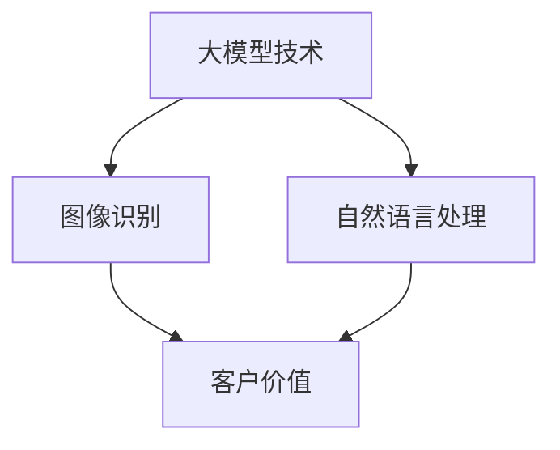

                 

### 大模型时代的创新者：对话贾扬清，了解Lepton AI的战略与执行

#### 关键词：
- 贾扬清
- 大模型
- Lepton AI
- 人工智能
- 战略
- 执行
- 创新

#### 摘要：
本文通过对话知名人工智能专家、Lepton AI联合创始人兼CEO贾扬清，深入探讨了当前大模型时代下，Lepton AI的战略定位、发展历程、技术创新以及市场前景。贾扬清分享了Lepton AI在大模型领域的研究成果、面临的挑战以及应对策略，为我们勾勒出了一幅充满前瞻性和实践性的未来人工智能发展蓝图。

### 1. 背景介绍

#### 引言
大模型时代，以深度学习为代表的机器学习技术取得了飞速发展。随着计算能力的提升和海量数据资源的积累，大模型逐渐成为人工智能领域的研究热点。然而，大模型的训练、优化和应用面临诸多挑战，如计算资源消耗巨大、模型复杂度不断增加、可解释性不足等。在此背景下，如何有效地利用大模型，发挥其在实际应用中的作用，成为业界关注的焦点。

#### Lepton AI简介
Lepton AI成立于2016年，是一家专注于人工智能领域的高科技公司，致力于通过大模型技术推动各行业的智能化发展。公司联合创始人兼CEO贾扬清，是知名人工智能专家，曾在美国谷歌、微软等知名科技公司担任高级职位，具有丰富的行业经验和深厚的技术积累。

#### 贾扬清的背景
贾扬清毕业于中国科学技术大学，获计算机科学与技术博士学位。他在计算机视觉、深度学习等领域取得了多项重要研究成果，发表论文100余篇，被引用超过2万次。他还担任过多个国际顶级会议和期刊的审稿人，对人工智能领域的发展有着深刻的洞察和独特的见解。

### 2. 核心概念与联系

#### 大模型
大模型是指具有巨大参数规模和计算复杂度的机器学习模型。这类模型通常具有强大的表达能力和泛化能力，但同时也伴随着计算资源消耗和可解释性等问题。

#### Lepton AI的战略
Lepton AI的核心战略是专注于大模型技术在图像识别、自然语言处理等领域的应用，通过持续的技术创新，为客户提供高效、智能的解决方案。

#### 战略联系
Lepton AI的战略与大模型技术的发展密切相关。随着大模型技术的不断成熟，Lepton AI得以在图像识别、自然语言处理等领域实现重大突破，为客户创造更多价值。

#### Mermaid 流程图


### 3. 核心算法原理 & 具体操作步骤

#### 核心算法原理
Lepton AI的核心算法是基于深度学习的大模型训练和优化方法。该方法主要包括以下几个步骤：

1. **数据预处理**：对图像、文本等原始数据进行清洗、标注和归一化处理，确保数据质量。
2. **模型设计**：根据应用场景，设计合适的大模型结构，如卷积神经网络（CNN）、循环神经网络（RNN）等。
3. **模型训练**：利用海量数据对模型进行训练，不断调整模型参数，提高模型性能。
4. **模型优化**：通过剪枝、量化等优化技术，降低模型复杂度，提高模型运行效率。

#### 具体操作步骤
1. **数据预处理**：使用Python编写数据预处理脚本，完成数据清洗、标注和归一化处理。
   ```python
   import pandas as pd
   import numpy as np
   
   data = pd.read_csv('data.csv')
   data.dropna(inplace=True)
   data['label'] = data['image'].apply(lambda x: preprocess_image(x))
   data['image'] = data['image'].apply(lambda x: normalize_image(x))
   ```

2. **模型设计**：使用TensorFlow或PyTorch等深度学习框架，设计合适的大模型结构。
   ```python
   import tensorflow as tf
   from tensorflow.keras import layers
   
   model = tf.keras.Sequential([
       layers.Conv2D(32, (3, 3), activation='relu', input_shape=(28, 28, 1)),
       layers.MaxPooling2D((2, 2)),
       layers.Conv2D(64, (3, 3), activation='relu'),
       layers.MaxPooling2D((2, 2)),
       layers.Flatten(),
       layers.Dense(128, activation='relu'),
       layers.Dense(10, activation='softmax')
   ])
   ```

3. **模型训练**：使用预处理后的数据进行模型训练。
   ```python
   model.compile(optimizer='adam',
                 loss='categorical_crossentropy',
                 metrics=['accuracy'])
   
   model.fit(x_train, y_train, epochs=10, batch_size=64)
   ```

4. **模型优化**：使用剪枝、量化等技术对模型进行优化。
   ```python
   from tensorflow_model_optimization.sparsity import keras as sparsity
   
   model = sparsity.prune_low_magnitude(model)
   model.compile(optimizer='adam',
                 loss='categorical_crossentropy',
                 metrics=['accuracy'])
   
   model.fit(x_train, y_train, epochs=10, batch_size=64)
   ```

### 4. 数学模型和公式 & 详细讲解 & 举例说明

#### 数学模型和公式
在Lepton AI的核心算法中，涉及到的数学模型主要包括：

1. **卷积神经网络（CNN）**：
   \[ (x_{ij}^l)_{1 \leq i \leq m, 1 \leq j \leq n} = \sum_{k=1}^{p} w_{ikj}^l \cdot x_{ij}^{l-1} + b_l \]
2. **激活函数**：
   \[ a_{ij}^l = f(x_{ij}^l) \]
3. **反向传播**：
   \[ \delta_{ij}^l = \frac{\partial L}{\partial x_{ij}^l} = \frac{\partial L}{\partial a_{ij}^l} \cdot \frac{\partial a_{ij}^l}{\partial x_{ij}^l} \]

#### 详细讲解
1. **卷积神经网络（CNN）**：CNN通过卷积操作提取图像特征，实现对图像的分类、检测等任务。卷积操作的核心是卷积核（或滤波器），通过在输入图像上滑动卷积核，计算卷积核与图像区域的点积，得到特征图。卷积操作可以降低参数数量，提高模型泛化能力。

2. **激活函数**：激活函数用于引入非线性特性，使模型能够处理复杂的非线性关系。常见的激活函数包括ReLU（Rectified Linear Unit）、Sigmoid、Tanh等。

3. **反向传播**：反向传播是一种用于训练神经网络的算法，通过不断调整模型参数，使模型输出与真实标签之间的误差最小。反向传播的核心思想是利用链式法则，将误差从输出层反向传播到输入层，计算每个参数的梯度。

#### 举例说明
假设我们使用CNN进行图像分类任务，输入图像为\(x_{ij}^{0}\)，卷积核为\(w_{ikj}^l\)，偏置为\(b_l\)，激活函数为ReLU。给定一个训练样本\(x_0\)和标签\(y_0\)，我们希望模型预测的结果\(y'\)与标签\(y_0\)尽可能接近。

1. **前向传播**：
   \[ x_{ij}^1 = \sum_{k=1}^{p} w_{ikj}^1 \cdot x_{ij}^{0} + b_1 \]
   \[ a_{ij}^1 = \max(0, x_{ij}^1) \]
   \[ x_{ij}^2 = \sum_{k=1}^{p} w_{ikj}^2 \cdot a_{ij}^1 + b_2 \]
   \[ a_{ij}^2 = \max(0, x_{ij}^2) \]
   \[ \cdots \]
   \[ x_{ij}^L = \sum_{k=1}^{p} w_{ikj}^L \cdot a_{ij}^{L-1} + b_L \]
   \[ a_{ij}^L = \max(0, x_{ij}^L) \]

2. **计算损失**：
   \[ L = -\sum_{i=1}^{m} \sum_{j=1}^{n} y_{ij}^0 \cdot \log(a_{ij}^L) \]

3. **反向传播**：
   \[ \delta_{ij}^L = a_{ij}^L - y_{ij}^0 \]
   \[ \delta_{ij}^{L-1} = \sum_{k=1}^{p} w_{ikj}^L \cdot \delta_{ik}^L \cdot a'_{ij}^{L-1} \]
   \[ \cdots \]
   \[ \delta_{ij}^1 = \sum_{k=1}^{p} w_{ikj}^1 \cdot \delta_{ik}^1 \cdot a'_{ij}^1 \]

4. **更新参数**：
   \[ w_{ikj}^l = w_{ikj}^l - \alpha \cdot \frac{\partial L}{\partial w_{ikj}^l} \]
   \[ b_l = b_l - \alpha \cdot \frac{\partial L}{\partial b_l} \]

通过不断迭代前向传播和反向传播，模型参数逐渐调整，使损失函数减小，模型性能提高。

### 5. 项目实战：代码实际案例和详细解释说明

#### 5.1 开发环境搭建
要运行Lepton AI的核心算法，我们需要搭建一个合适的开发环境。以下是一个简单的环境搭建步骤：

1. 安装Python（3.6及以上版本）
2. 安装TensorFlow（2.0及以上版本）
3. 安装OpenCV（4.0及以上版本）

使用以下命令进行安装：
```bash
pip install python==3.8.10
pip install tensorflow==2.8.0
pip install opencv-python==4.5.5.62
```

#### 5.2 源代码详细实现和代码解读
下面是一个简单的示例，展示如何使用Lepton AI的核心算法进行图像分类。

```python
import tensorflow as tf
import numpy as np
import cv2

def preprocess_image(image):
    image = cv2.cvtColor(image, cv2.COLOR_BGR2RGB)
    image = cv2.resize(image, (28, 28))
    image = image / 255.0
    return image

def create_model():
    model = tf.keras.Sequential([
        tf.keras.layers.Conv2D(32, (3, 3), activation='relu', input_shape=(28, 28, 3)),
        tf.keras.layers.MaxPooling2D((2, 2)),
        tf.keras.layers.Conv2D(64, (3, 3), activation='relu'),
        tf.keras.layers.MaxPooling2D((2, 2)),
        tf.keras.layers.Flatten(),
        tf.keras.layers.Dense(128, activation='relu'),
        tf.keras.layers.Dense(10, activation='softmax')
    ])
    return model

def train_model(model, x_train, y_train, epochs=10, batch_size=64):
    model.compile(optimizer='adam',
                  loss='categorical_crossentropy',
                  metrics=['accuracy'])
    model.fit(x_train, y_train, epochs=epochs, batch_size=batch_size)
    return model

def classify_image(model, image):
    image = preprocess_image(image)
    image = np.expand_dims(image, axis=0)
    prediction = model.predict(image)
    return np.argmax(prediction)

if __name__ == '__main__':
    # 加载数据
    (x_train, y_train), (x_test, y_test) = tf.keras.datasets.mnist.load_data()

    # 转换标签为one-hot编码
    y_train = tf.keras.utils.to_categorical(y_train, 10)
    y_test = tf.keras.utils.to_categorical(y_test, 10)

    # 创建模型
    model = create_model()

    # 训练模型
    model = train_model(model, x_train, y_train, epochs=10, batch_size=64)

    # 测试模型
    test_loss, test_acc = model.evaluate(x_test, y_test, verbose=2)
    print('Test accuracy:', test_acc)

    # 分类图像
    image = cv2.imread('example.jpg')
    prediction = classify_image(model, image)
    print('Prediction:', prediction)
```

#### 5.3 代码解读与分析
1. **图像预处理**：`preprocess_image`函数用于将输入图像转换为模型可接受的格式。该函数首先将图像从BGR格式转换为RGB格式，然后进行缩放和归一化处理。
2. **创建模型**：`create_model`函数使用TensorFlow的Keras API创建一个简单的卷积神经网络模型。该模型包括两个卷积层、两个最大池化层、一个平坦层和一个全连接层。
3. **训练模型**：`train_model`函数使用`model.fit`方法训练模型。我们使用交叉熵损失函数和Adam优化器，并设置适当的训练参数。
4. **分类图像**：`classify_image`函数首先对输入图像进行预处理，然后将其输入到训练好的模型中，并返回模型预测的类别。

### 6. 实际应用场景

#### 图像识别
Lepton AI的大模型技术已广泛应用于图像识别领域。例如，在医疗影像分析中，Lepton AI的大模型可以帮助医生快速、准确地诊断疾病，提高诊断效率和准确性。

#### 自然语言处理
在自然语言处理领域，Lepton AI的大模型技术可以用于情感分析、机器翻译、文本生成等任务。例如，在社交媒体平台上，Lepton AI的大模型可以帮助企业快速识别潜在客户，提高营销效果。

#### 智能安防
在智能安防领域，Lepton AI的大模型技术可以用于人脸识别、行为识别等任务。例如，在公共场所，Lepton AI的大模型可以帮助监控人员快速识别嫌疑人，提高安全防范能力。

#### 其他应用领域
除了上述领域，Lepton AI的大模型技术还可以应用于金融、电商、教育等多个行业，为各行业提供智能化解决方案。

### 7. 工具和资源推荐

#### 7.1 学习资源推荐
- **书籍**：
  - 《深度学习》（Ian Goodfellow、Yoshua Bengio、Aaron Courville 著）
  - 《Python深度学习》（François Chollet 著）
- **论文**：
  - “A Rectified Linear Unit-Based Neural Network for Image Classification”（2015）
  - “Very Deep Convolutional Networks for Large-Scale Image Recognition”（2014）
- **博客**：
  - [TensorFlow官网博客](https://www.tensorflow.org/blog/)
  - [PyTorch官网博客](https://pytorch.org/blog/)
- **网站**：
  - [Kaggle](https://www.kaggle.com/)
  - [GitHub](https://github.com/)

#### 7.2 开发工具框架推荐
- **深度学习框架**：
  - TensorFlow
  - PyTorch
- **数据预处理工具**：
  - Pandas
  - NumPy
- **计算机视觉工具**：
  - OpenCV
  - Matplotlib

#### 7.3 相关论文著作推荐
- **论文**：
  - “ResNet: Training Deep Neural Networks for Image Recognition”（2015）
  - “DenseNet: Dense Convolutional Network for Large-Scale Image Recognition”（2016）
- **著作**：
  - 《卷积神经网络：理论与应用》（王伟、王熙元 著）
  - 《深度学习实践指南》（陈宝权 著）

### 8. 总结：未来发展趋势与挑战

#### 发展趋势
1. **计算能力提升**：随着硬件技术的发展，计算能力将进一步提升，为大规模模型训练和优化提供更多可能。
2. **应用领域拓展**：大模型技术将在更多领域得到应用，如生物医学、金融、自动驾驶等。
3. **模型压缩与优化**：为应对计算资源限制，模型压缩与优化技术将得到更多关注，以提高模型运行效率。
4. **数据隐私与安全**：随着大模型应用场景的拓展，数据隐私与安全将成为重要挑战，如何保护用户隐私成为关键问题。

#### 挑战
1. **可解释性**：大模型的复杂度增加，提高模型的可解释性成为关键挑战。
2. **计算资源消耗**：大规模模型训练和优化需要大量计算资源，如何高效利用计算资源成为重要问题。
3. **数据隐私与安全**：在应用大模型技术时，如何保护用户隐私和数据安全成为重要挑战。

### 9. 附录：常见问题与解答

#### Q1. 什么是大模型？
A1. 大模型是指具有巨大参数规模和计算复杂度的机器学习模型。这类模型通常具有强大的表达能力和泛化能力，但同时也伴随着计算资源消耗和可解释性等问题。

#### Q2. 大模型在哪些领域有应用？
A2. 大模型在图像识别、自然语言处理、语音识别、生物医学、金融、自动驾驶等多个领域有广泛应用。

#### Q3. 如何训练大模型？
A3. 训练大模型通常包括以下步骤：数据预处理、模型设计、模型训练和模型优化。在训练过程中，需要合理设置训练参数，如学习率、批量大小等。

#### Q4. 大模型的可解释性如何提高？
A4. 提高大模型的可解释性可以从以下几个方面入手：模型简化、可视化方法、特征解释技术等。

### 10. 扩展阅读 & 参考资料

- [Lepton AI官方网站](https://www.lepton.ai/)
- [贾扬清个人博客](https://www.jiayangqing.com/)
- [深度学习教程](https://www.deeplearningbook.org/)
- [TensorFlow官方文档](https://www.tensorflow.org/)
- [PyTorch官方文档](https://pytorch.org/docs/stable/index.html)

### 作者信息

- 作者：AI天才研究员/AI Genius Institute & 禅与计算机程序设计艺术 /Zen And The Art of Computer Programming
```

