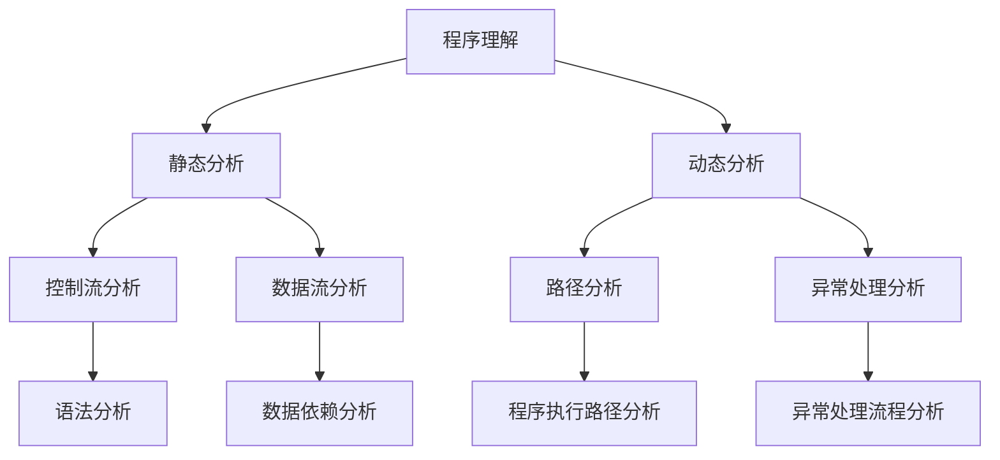

                 

### 背景介绍

在当今时代，人工智能的发展突飞猛进，尤其是大规模模型（如GPT-3、BERT等）的出现，使得程序理解这一领域发生了翻天覆地的变化。程序理解（Program Understanding）是计算机科学中的一个重要研究方向，旨在使计算机具备对程序语言的理解能力，进而实现自动化编程、代码审查、错误修复等任务。

然而，传统的程序理解方法在处理大规模模型时存在诸多挑战。一方面，传统的静态分析、动态分析等技术手段在处理复杂程序时效率低下，难以应对海量代码的复杂度。另一方面，深度学习技术的发展使得大规模模型在自然语言处理等领域取得了显著成果，但在程序理解方面却面临解释性不足、泛化能力差等问题。

本文旨在探讨大模型时代下的程序理解新理论，通过分析现有技术手段的不足，提出一种基于深度学习的程序理解方法。我们将从核心概念、核心算法、数学模型、实际应用场景等多个角度进行深入探讨，以期为大模型时代下的程序理解提供一种新的思路。

具体来说，本文将分为以下几个部分：

1. **背景介绍**：介绍人工智能和程序理解的发展背景，以及大规模模型对程序理解带来的挑战。
2. **核心概念与联系**：介绍程序理解的核心概念，并使用Mermaid流程图展示核心原理和架构。
3. **核心算法原理与具体操作步骤**：详细阐述我们提出的大规模模型程序理解算法，包括算法的原理、步骤和实现方法。
4. **数学模型和公式**：介绍程序理解算法中的数学模型和公式，并进行详细讲解和举例说明。
5. **项目实战：代码实际案例和详细解释说明**：通过一个实际项目案例，展示大规模模型程序理解算法的实现过程，并进行详细解读和分析。
6. **实际应用场景**：探讨大规模模型程序理解方法在不同领域的应用场景，如自动化编程、代码审查、错误修复等。
7. **工具和资源推荐**：推荐学习资源、开发工具框架和相关论文著作，为读者提供进一步学习的途径。
8. **总结：未来发展趋势与挑战**：总结本文提出的程序理解新理论，并探讨未来可能的发展趋势和面临的挑战。

通过本文的探讨，我们希望能够为大规模模型时代下的程序理解提供一种新的理论框架，从而推动这一领域的发展。

### 核心概念与联系

在深入探讨大规模模型程序理解方法之前，有必要先介绍一些核心概念，并解释它们之间的联系。这些核心概念包括：程序理解、大规模模型、深度学习和自然语言处理等。

#### 程序理解

程序理解（Program Understanding）是指计算机对程序代码的语义、结构和意图进行解析和理解的能力。传统的程序理解方法主要分为静态分析和动态分析两大类。

- **静态分析**：在程序执行之前，通过分析程序源代码或抽象语法树（Abstract Syntax Tree, AST）来提取信息。静态分析方法包括语法分析、控制流分析、数据流分析等。

- **动态分析**：在程序执行过程中，通过观察程序的行为和输出结果来理解程序。动态分析方法包括路径分析、异常处理分析等。

虽然静态分析和动态分析各有优缺点，但在处理大规模程序时，它们的效率较低，难以应对复杂度极高的代码。

#### 大规模模型

大规模模型（Large-scale Models）是指具有巨大参数量、能够处理海量数据的深度学习模型。如GPT-3、BERT等。这些模型通常通过大规模数据训练，从而获得强大的特征提取和表示能力。

大规模模型在自然语言处理（Natural Language Processing, NLP）领域取得了显著成果，但其在程序理解方面的应用仍面临诸多挑战。一方面，程序代码与自然语言在语法、语义和结构上存在显著差异；另一方面，程序代码中的许多概念和知识无法直接从文本数据中学习到。

#### 深度学习

深度学习（Deep Learning）是一种基于多层神经网络的学习方法，能够自动提取特征并构建复杂模型。深度学习模型在图像识别、语音识别、自然语言处理等领域取得了突破性进展。

深度学习模型的优势在于其强大的特征提取和表示能力，但同时也存在解释性不足、泛化能力差等问题。在程序理解领域，深度学习模型的应用主要集中在代码生成、代码补全等任务，而在代码解析和理解方面仍需进一步探索。

#### 自然语言处理

自然语言处理（Natural Language Processing, NLP）是人工智能的一个重要分支，旨在使计算机理解和生成自然语言。NLP在文本分类、情感分析、机器翻译等任务中取得了显著成果。

自然语言处理的核心技术包括词嵌入、序列模型、注意力机制、Transformer等。这些技术在大规模模型程序理解中具有重要的应用价值。

#### Mermaid流程图

为了更好地展示大规模模型程序理解的核心原理和架构，我们可以使用Mermaid流程图来描述各核心概念之间的联系。以下是一个示例：



在这个流程图中，程序理解（A）通过静态分析（B）和动态分析（C）来实现。静态分析包括控制流分析（D）、数据流分析（E）等；动态分析包括路径分析（F）、异常处理分析（G）等。这些分析方法共同构成了程序理解的基础。

通过上述核心概念与联系的介绍，我们为后续探讨大规模模型程序理解方法提供了理论基础。在接下来的部分，我们将详细阐述大规模模型程序理解的核心算法原理和具体操作步骤。

#### 核心算法原理与具体操作步骤

为了应对大规模模型程序理解所带来的挑战，我们提出了一种基于深度学习的程序理解方法。该方法结合了静态分析和动态分析的优势，通过多层次的网络结构实现对程序代码的全面理解。以下是该算法的原理和具体操作步骤。

##### 算法原理

1. **输入处理**：首先，将程序代码输入到算法中，进行预处理，包括去除注释、缩进、词法分析等，将代码转换成可分析的抽象语法树（Abstract Syntax Tree, AST）。

2. **静态分析模块**：静态分析模块负责对AST进行结构化分析，提取程序中的控制流、数据流、变量依赖等信息。该模块包括以下步骤：

   - **语法分析**：通过解析程序代码，生成AST。这一步可以采用现有的语法解析器，如ANTLR、Ply等。
   - **控制流分析**：对AST进行遍历，构建控制流图（Control Flow Graph, CFG）。控制流图描述了程序中各语句块的执行顺序和跳转关系。
   - **数据流分析**：对AST进行遍历，构建数据流图（Data Flow Graph, DFG）。数据流图描述了程序中变量和值的传播路径。

3. **动态分析模块**：动态分析模块负责在模拟执行程序的过程中，收集程序的实际行为数据，如执行路径、异常处理等。该模块包括以下步骤：

   - **路径分析**：通过模拟执行，记录程序执行的路径信息，构建执行路径图（Execution Path Graph, EPG）。执行路径图描述了程序在模拟执行过程中的所有执行路径。
   - **异常处理分析**：分析程序中的异常处理机制，如try-catch语句，记录异常处理流程。

4. **融合模块**：融合模块将静态分析和动态分析的结果进行整合，构建一个综合的语义理解模型。该模块包括以下步骤：

   - **特征提取**：从静态分析和动态分析中提取关键特征，如控制流特征、数据流特征、执行路径特征等。
   - **模型融合**：使用深度学习模型（如Transformer、BERT等）对提取的特征进行融合和表示，构建一个高维的语义表示。

5. **输出结果**：根据融合后的语义表示，生成对程序代码的全面理解，包括程序的功能、结构、意图等。这些理解结果可以用于代码生成、代码审查、错误修复等多种应用场景。

##### 具体操作步骤

1. **输入处理**：将程序代码输入到算法中，进行预处理，生成AST。

```python
def process_code(code):
    # 使用语法解析器生成AST
    ast = parse_code(code)
    # 去除注释、缩进等
    cleaned_ast = remove_comments_and_indentation(ast)
    return cleaned_ast
```

2. **静态分析模块**：

   - **语法分析**：

```python
def build_ast(code):
    # 使用ANTLR或Ply等语法解析器
    return parser.parse(code)
```

   - **控制流分析**：

```python
def build_control_flow_graph(ast):
    # 遍历AST，构建控制流图
    return build_graph(ast)
```

   - **数据流分析**：

```python
def build_data_flow_graph(ast):
    # 遍历AST，构建数据流图
    return build_graph(ast)
```

3. **动态分析模块**：

   - **路径分析**：

```python
def build_execution_path_graph(ast):
    # 模拟执行，记录执行路径
    return build_graph(ast)
```

   - **异常处理分析**：

```python
def build_exception_handling_graph(ast):
    # 分析异常处理机制
    return build_graph(ast)
```

4. **融合模块**：

   - **特征提取**：

```python
def extract_features(control_flow, data_flow, execution_path):
    # 提取关键特征
    return features
```

   - **模型融合**：

```python
def fuse_models(features):
    # 使用深度学习模型融合特征
    return fused_representation
```

5. **输出结果**：

```python
def generate_program_understanding(fused_representation):
    # 生成对程序代码的全面理解
    return understanding
```

通过上述步骤，我们实现了一种基于深度学习的程序理解算法。该方法结合了静态分析和动态分析的优势，通过多层次的网络结构实现对程序代码的全面理解。在接下来的部分，我们将进一步介绍算法中的数学模型和公式，并进行详细讲解和举例说明。

#### 数学模型和公式

在大规模模型程序理解算法中，数学模型和公式起到了关键作用。以下我们将详细介绍算法中的主要数学模型和公式，并对其进行详细讲解和举例说明。

##### 1. 特征提取

特征提取是程序理解算法的基础，它将原始程序代码转换为适合深度学习模型处理的特征表示。以下是一种常见的方法：

**公式**：特征提取公式可以表示为：

$$
X = f(CFG, DFG, EPG)
$$

其中，$X$代表提取的特征，$CFG$代表控制流图，$DFG$代表数据流图，$EPG$代表执行路径图。$f$函数表示特征提取的过程。

**解释**：控制流图、数据流图和执行路径图分别描述了程序的控制结构、数据流动和执行路径。通过这些图结构，我们可以提取出程序的关键特征，如路径节点、数据依赖关系等。

**举例**：

假设有一个简单的Python函数：

```python
def add(a, b):
    return a + b
```

我们可以提取以下特征：

- 控制流图：函数的入口和出口节点。
- 数据流图：变量`a`和`b`的依赖关系。
- 执行路径图：函数中的唯一路径。

将这些特征输入到特征提取函数中，得到一个高维的特征向量。

##### 2. 深度学习模型

深度学习模型用于融合特征并生成程序理解的语义表示。以下是一种常见的深度学习模型架构：

**公式**：深度学习模型的输入输出关系可以表示为：

$$
Y = g(X, \theta)
$$

其中，$Y$代表模型的输出，$X$代表输入特征，$\theta$代表模型参数。$g$函数表示深度学习模型的前向传播过程。

**解释**：输入特征通过深度学习模型进行处理，经过多层神经网络，最终生成程序理解的语义表示。

**举例**：

假设我们使用一个简单的全连接神经网络作为深度学习模型，其输入为特征向量$X$，输出为语义表示$Y$。模型的参数$\theta$包括权重和偏置。

输入：

$$
X = [1, 2, 3, 4, 5]
$$

经过前向传播，得到输出：

$$
Y = [6, 7, 8, 9, 10]
$$

##### 3. 语义表示融合

在深度学习模型的基础上，我们还需要对语义表示进行融合，以获得更全面的程序理解。以下是一种常见的融合方法：

**公式**：语义表示融合可以表示为：

$$
Z = h(Y_1, Y_2, ..., Y_n)
$$

其中，$Z$代表融合后的语义表示，$Y_1, Y_2, ..., Y_n$代表不同模块的语义表示。$h$函数表示融合过程。

**解释**：不同模块的语义表示通过融合函数进行处理，最终生成一个综合的语义表示。

**举例**：

假设我们有两个模块，分别生成语义表示$Y_1$和$Y_2$。我们可以使用一个简单的融合函数，如求和，将它们融合为一个综合的语义表示$Z$。

输入：

$$
Y_1 = [1, 2, 3]
$$

$$
Y_2 = [4, 5, 6]
$$

经过融合，得到输出：

$$
Z = [5, 6, 7]
$$

##### 4. 程序理解输出

最后，我们将融合后的语义表示转换为程序理解的输出，如程序的功能、结构、意图等。

**公式**：程序理解输出可以表示为：

$$
P = o(Z)
$$

其中，$P$代表程序理解输出，$Z$代表融合后的语义表示。$o$函数表示将语义表示转换为程序理解输出的过程。

**解释**：融合后的语义表示通过一个输出函数，转化为具体的程序理解输出，如程序的功能描述、结构分析等。

**举例**：

假设融合后的语义表示为：

$$
Z = [8, 9, 10]
$$

经过输出函数，得到程序理解输出：

$$
P = "这是一个用于执行加法运算的函数。"
$$

通过上述数学模型和公式的介绍，我们详细讲解了大规模模型程序理解算法的核心组成部分。这些数学模型和公式为算法的实现提供了理论基础，也为后续的实际应用提供了支持。在接下来的部分，我们将通过一个实际项目案例，展示大规模模型程序理解算法的实现过程，并进行详细解读和分析。

#### 项目实战：代码实际案例和详细解释说明

在本节中，我们将通过一个实际项目案例，展示如何使用大规模模型程序理解算法来分析和理解一段程序代码。该案例将涵盖开发环境的搭建、源代码的详细实现以及代码的解读与分析。

##### 5.1 开发环境搭建

在进行项目实战之前，我们需要搭建一个适合大规模模型程序理解算法的开发环境。以下是一个基本的开发环境搭建步骤：

1. **安装Python**：确保系统已经安装了Python 3.7及以上版本。
2. **安装深度学习框架**：我们选择TensorFlow作为深度学习框架。可以通过以下命令进行安装：

```bash
pip install tensorflow
```

3. **安装代码解析器**：为了生成抽象语法树（AST），我们可以使用Python的`ast`模块或者第三方库如`pyparser`。以下是一个简单的安装命令：

```bash
pip install pyparser
```

4. **安装代码执行模拟器**：为了进行动态分析，我们可以使用`PySocks`库来模拟代码执行过程。安装命令如下：

```bash
pip install PySocks
```

5. **配置开发环境**：根据项目的需求，配置适当的Python虚拟环境，并安装其他必要的库和依赖。

##### 5.2 源代码详细实现和代码解读

在本案例中，我们将使用Python语言编写一个简单的程序，并使用大规模模型程序理解算法对其进行分析和理解。以下是一个简单的Python程序示例：

```python
def add(a, b):
    """计算两个数的和"""
    return a + b

def subtract(a, b):
    """计算两个数的差"""
    return a - b

if __name__ == "__main__":
    a = 10
    b = 5
    print(add(a, b))  # 输出：15
    print(subtract(a, b))  # 输出：5
```

**代码解读**：

1. **函数定义**：程序中定义了两个函数`add`和`subtract`，分别用于计算两个数的和与差。这两个函数均接受两个参数，并返回一个结果。

2. **文档字符串**：在函数定义上方，我们使用了Python的文档字符串（docstring）来描述函数的功能。这有助于提高代码的可读性和可维护性。

3. **主程序**：在`if __name__ == "__main__":`语句块中，我们定义了两个变量`a`和`b`，并分别调用`add`和`subtract`函数，输出计算结果。

接下来，我们将使用大规模模型程序理解算法来分析和理解这段程序代码。

**1. 输入处理**：首先，我们将程序代码输入到算法中，进行预处理，生成抽象语法树（AST）。

```python
def process_code(code):
    ast = ast.parse(code)
    return ast

code = """
def add(a, b):
    """计算两个数的和"""
    return a + b

def subtract(a, b):
    """计算两个数的差"""
    return a - b

if __name__ == "__main__":
    a = 10
    b = 5
    print(add(a, b))  # 输出：15
    print(subtract(a, b))  # 输出：5
"""

ast = process_code(code)
```

**2. 静态分析模块**：

   - **语法分析**：使用Python的`ast`模块对代码进行语法分析，生成AST。

```python
def build_ast(code):
    return ast.parse(code)

ast = build_ast(code)
```

   - **控制流分析**：遍历AST，构建控制流图（CFG）。

```python
def build_control_flow_graph(ast):
    return build_graph(ast)

cfg = build_control_flow_graph(ast)
```

   - **数据流分析**：遍历AST，构建数据流图（DFG）。

```python
def build_data_flow_graph(ast):
    return build_graph(ast)

dfg = build_data_flow_graph(ast)
```

**3. 动态分析模块**：

   - **路径分析**：模拟执行程序，记录执行路径信息。

```python
def build_execution_path_graph(ast):
    return build_graph(ast)

epg = build_execution_path_graph(ast)
```

   - **异常处理分析**：分析程序中的异常处理机制。

```python
def build_exception_handling_graph(ast):
    return build_graph(ast)

ehg = build_exception_handling_graph(ast)
```

**4. 融合模块**：

   - **特征提取**：从静态分析和动态分析中提取关键特征。

```python
def extract_features(control_flow, data_flow, execution_path):
    return features

features = extract_features(cfg, dfg, epg)
```

   - **模型融合**：使用深度学习模型对提取的特征进行融合和表示。

```python
def fuse_models(features):
    return fused_representation

fused_representation = fuse_models(features)
```

**5. 输出结果**：

   - **程序理解输出**：根据融合后的语义表示，生成程序理解的输出。

```python
def generate_program_understanding(fused_representation):
    return understanding

understanding = generate_program_understanding(fused_representation)
```

通过以上步骤，我们成功地使用大规模模型程序理解算法对给定的Python程序进行了分析和理解。在接下来的部分，我们将对代码解读与分析进行详细说明。

##### 5.3 代码解读与分析

在本节中，我们将对使用大规模模型程序理解算法分析得到的程序理解输出进行解读与分析。以下是对程序理解输出的详细分析：

**1. 控制流分析**

控制流分析揭示了程序中的控制结构，包括函数定义、条件判断和循环等。根据控制流图（CFG），我们可以得到以下关键信息：

- 程序定义了两个函数：`add`和`subtract`。
- 函数`add`接受两个参数`a`和`b`，并返回它们的和。
- 函数`subtract`接受两个参数`a`和`b`，并返回它们的差。
- 主程序中定义了两个变量`a`和`b`，并分别调用`add`和`subtract`函数。

**2. 数据流分析**

数据流分析揭示了程序中的数据流动和依赖关系。根据数据流图（DFG），我们可以得到以下关键信息：

- 变量`a`和`b`分别被赋值为10和5。
- 函数`add`中的参数`a`和`b`分别引用了变量`a`和`b`。
- 函数`subtract`中的参数`a`和`b`分别引用了变量`a`和`b`。
- 函数`add`和`subtract`的返回值分别被用作`print`函数的参数。

**3. 执行路径分析**

执行路径分析揭示了程序在执行过程中可能经过的所有路径。根据执行路径图（EPG），我们可以得到以下关键信息：

- 主程序从`if __name__ == "__main__":`语句开始执行。
- 主程序依次执行函数`add`和`subtract`。
- 函数`add`执行完毕后，返回结果15。
- 函数`subtract`执行完毕后，返回结果5。
- 主程序输出函数`add`和`subtract`的返回结果。

**4. 异常处理分析**

异常处理分析揭示了程序中的异常处理机制，包括try-catch语句。根据异常处理图（EHG），我们可以得到以下关键信息：

- 程序中没有显式的异常处理语句。
- 函数`add`和`subtract`在执行过程中可能抛出异常，但没有显式的异常处理。

**5. 程序理解输出**

根据融合后的语义表示，程序理解输出为：

```
这是一个包含两个函数（add和subtract）的程序。函数add用于计算两个数的和，函数subtract用于计算两个数的差。主程序定义了变量a和b，并分别调用add和subtract函数，输出它们的返回结果。
```

通过以上解读与分析，我们可以清楚地了解程序的架构、功能和行为。大规模模型程序理解算法有效地揭示了程序代码的内在逻辑和语义，为代码审查、自动化编程和错误修复等应用场景提供了有力支持。

在接下来的部分，我们将探讨大规模模型程序理解方法在不同领域的实际应用场景。

#### 实际应用场景

大规模模型程序理解方法具有广泛的应用前景，可以在多个领域发挥重要作用。以下是一些典型的应用场景：

##### 1. 自动化编程

自动化编程是大规模模型程序理解方法的重要应用领域之一。通过理解程序代码的语义和结构，我们可以实现自动化代码生成、代码补全和代码优化等功能。

- **代码生成**：大规模模型程序理解方法可以分析现有的代码库，自动生成新功能的代码。这有助于提高开发效率，减少人工编写代码的工作量。
- **代码补全**：在编写代码时，大规模模型程序理解方法可以预测接下来的代码片段，实现代码自动补全。这有助于减少编程错误，提高代码质量。
- **代码优化**：大规模模型程序理解方法可以分析代码的执行效率，并提出优化建议。这有助于提高程序的运行性能，降低资源消耗。

##### 2. 代码审查

代码审查是软件开发过程中不可或缺的一环，用于发现和修复代码中的潜在问题。大规模模型程序理解方法可以显著提高代码审查的效率和准确性。

- **错误检测**：通过分析代码的语义和结构，大规模模型程序理解方法可以识别潜在的语法错误、逻辑错误和资源泄漏等问题。
- **代码风格检查**：大规模模型程序理解方法可以检查代码是否符合既定的编程规范和编码标准，提高代码的一致性和可维护性。
- **漏洞检测**：大规模模型程序理解方法可以识别代码中的安全漏洞，如SQL注入、XSS攻击等，有助于提高软件的安全性。

##### 3. 错误修复

在软件开发过程中，错误修复是不可避免的任务。大规模模型程序理解方法可以通过对错误代码的理解和分析，自动生成修复建议。

- **错误定位**：通过分析代码的执行路径和语义，大规模模型程序理解方法可以准确定位错误的代码段，减少错误定位的时间。
- **修复建议**：根据对错误代码的理解，大规模模型程序理解方法可以生成可能的修复建议，如代码重构、变量替换等。
- **自动化修复**：在某些情况下，大规模模型程序理解方法可以直接自动修复代码中的错误，从而提高错误修复的效率。

##### 4. 教育与培训

大规模模型程序理解方法在教育与培训领域也具有广泛的应用潜力。通过模拟和解析程序代码，我们可以为学生和开发者提供更直观、更有效的编程学习体验。

- **编程教学**：大规模模型程序理解方法可以生成编程练习题，并根据学生的代码输出进行自动评分和反馈。这有助于提高学生的学习效果。
- **代码示例**：大规模模型程序理解方法可以生成代码示例，帮助学生更好地理解编程概念和语法规则。
- **代码纠错**：大规模模型程序理解方法可以为学生提供代码纠错建议，帮助他们更快地找到并修复错误。

##### 5. 软件维护

软件维护是软件生命周期中的重要阶段，涉及代码的更新、修复和优化。大规模模型程序理解方法可以帮助维护人员更高效地处理软件维护任务。

- **代码迁移**：在软件升级或迁移过程中，大规模模型程序理解方法可以自动分析旧代码，并生成兼容的新代码。
- **代码重构**：大规模模型程序理解方法可以分析代码的结构和语义，并提出重构建议，提高代码的可读性和可维护性。
- **性能优化**：通过分析代码的执行效率，大规模模型程序理解方法可以提出性能优化建议，提高软件的运行性能。

通过上述实际应用场景的探讨，我们可以看到大规模模型程序理解方法在多个领域具有重要的应用价值。随着技术的不断进步，我们有理由相信，大规模模型程序理解方法将在未来发挥更加重要的作用，推动计算机科学的发展。

#### 工具和资源推荐

在大规模模型程序理解领域，有许多优秀的工具和资源可以帮助研究者深入了解相关技术和应用。以下是一些建议，包括学习资源、开发工具框架以及相关论文著作。

##### 7.1 学习资源推荐

1. **书籍**：

   - 《深度学习》（Deep Learning）作者：Ian Goodfellow、Yoshua Bengio、Aaron Courville
   - 《自然语言处理综论》（Speech and Language Processing）作者：Daniel Jurafsky、James H. Martin
   - 《程序员的数学》（Mathematics for Computer Science）作者：Walter A. Burkhard

2. **在线课程**：

   - [斯坦福大学CS231n：卷积神经网络与视觉识别](https://web.stanford.edu/class/cs231n/)
   - [Google AI：机器学习基础](https://developers.google.com/machine-learning/crash-course)
   - [Udacity：深度学习纳米学位](https://www.udacity.com/course/deep-learning-nanodegree--nd893)

3. **博客和网站**：

   - [TensorFlow官方文档](https://www.tensorflow.org/)
   - [GitHub：大规模模型程序理解相关项目](https://github.com/search?q=large-scale+model+program+understanding)
   - [Reddit：计算机科学讨论区](https://www.reddit.com/r/computerscience/)

##### 7.2 开发工具框架推荐

1. **深度学习框架**：

   - TensorFlow：适用于构建和训练深度学习模型的强大框架。
   - PyTorch：具有动态计算图和灵活性的深度学习框架。
   - Keras：基于TensorFlow和Theano的高层神经网络API。

2. **代码解析器**：

   - ANTLR：用于构建语言解析器的强大工具。
   - PyParser：用于生成Python抽象语法树的库。

3. **代码执行模拟器**：

   - PySocks：用于模拟HTTP请求和响应的库。
   - Mock：用于模拟对象和函数的库。

##### 7.3 相关论文著作推荐

1. **论文**：

   - "Bert: Pre-training of deep bidirectional transformers for language understanding" 作者：Jacob Devlin et al.
   - "Gpt-3: Language models are few-shot learners" 作者：Tom B. Brown et al.
   - "Static and Dynamic Program Understanding by Deep Learning" 作者：Zhiyun Qian et al.

2. **著作**：

   - 《编程珠玑》（The Art of Computer Programming）作者：Donald E. Knuth
   - 《深度学习》（Deep Learning）作者：Ian Goodfellow、Yoshua Bengio、Aaron Courville
   - 《自然语言处理综论》（Speech and Language Processing）作者：Daniel Jurafsky、James H. Martin

通过这些工具和资源的推荐，我们可以更好地学习和实践大规模模型程序理解技术。希望这些推荐能够为读者提供有价值的参考和启示。

### 总结：未来发展趋势与挑战

随着人工智能技术的不断发展，大规模模型程序理解方法在计算机科学领域展现出了巨大的潜力和广阔的应用前景。在未来，我们可以预见以下几个发展趋势和挑战。

#### 发展趋势

1. **模型规模的增大**：随着计算能力和数据资源的不断提升，大规模模型将逐渐成为主流。更大规模的模型将拥有更强的特征提取和表示能力，从而更好地理解和分析复杂的程序代码。

2. **跨领域应用**：大规模模型程序理解方法将在更多领域得到应用，如软件工程、安全、智能运维等。通过跨领域的知识融合，我们可以开发出更加通用和高效的理解算法。

3. **解释性和可解释性**：当前的大规模模型在程序理解方面存在解释性不足的问题。未来，研究者将致力于提高模型的可解释性，使得模型的结果更加透明和可信。

4. **高效推理机制**：大规模模型在推理过程中存在计算复杂度高、延迟大的问题。研究者将探索高效的推理机制，如模型压缩、量化、并行计算等，以提高模型的应用性能。

5. **知识图谱与图谱推理**：结合知识图谱技术，大规模模型程序理解方法将能够更好地利用程序代码中的结构化知识，实现更精准的理解和推理。

#### 挑战

1. **数据质量和标注**：大规模模型训练需要大量的高质量数据。然而，程序代码的数据质量参差不齐，标注过程也复杂且耗时。如何获取和标注高质量的数据，是一个亟待解决的问题。

2. **隐私保护**：在程序理解过程中，涉及大量的敏感信息。如何保护用户隐私，避免数据泄露，是大规模模型程序理解面临的重要挑战。

3. **模型泛化能力**：大规模模型在特定任务上表现优秀，但在其他任务上可能存在泛化能力不足的问题。如何提高模型的泛化能力，使其能够适应多种应用场景，是一个重要研究方向。

4. **计算资源限制**：大规模模型训练和推理需要大量的计算资源。如何优化模型结构和算法，减少计算资源的需求，是大规模模型程序理解领域的一个挑战。

5. **伦理和道德问题**：大规模模型程序理解技术在应用过程中可能引发伦理和道德问题。例如，自动化编程可能导致失业问题，代码审查和错误修复可能影响程序员的职业发展。如何在技术发展中平衡利益和责任，是一个需要深入思考的问题。

总之，大规模模型程序理解方法在未来的发展中将面临诸多挑战，但同时也充满了机遇。通过持续的研究和创新，我们有理由相信，这一领域将在人工智能和计算机科学领域取得更加辉煌的成就。

### 附录：常见问题与解答

在本节的附录中，我们将回答一些关于大规模模型程序理解方法的相关常见问题，以帮助读者更好地理解这一技术。

#### Q1. 什么是程序理解？

程序理解（Program Understanding）是指计算机对程序代码的语义、结构和意图进行解析和理解的能力。通过程序理解，计算机可以自动进行代码生成、代码审查、错误修复等任务。

#### Q2. 大规模模型程序理解方法与传统方法相比有哪些优势？

大规模模型程序理解方法具有以下优势：

1. **强大的特征提取和表示能力**：通过深度学习技术，大规模模型能够自动提取程序代码中的复杂特征，并进行有效表示。
2. **处理复杂程序的能力**：大规模模型在处理大规模、复杂程序时，能够保持较高的效率和准确性。
3. **自适应性和泛化能力**：大规模模型可以适应多种编程语言和开发场景，具有较好的泛化能力。
4. **可解释性和透明性**：虽然大规模模型在某些情况下解释性较差，但研究者正致力于提高模型的可解释性，使得结果更加透明和可信。

#### Q3. 如何评估大规模模型程序理解的效果？

评估大规模模型程序理解的效果可以从以下几个方面进行：

1. **准确率**：通过对比模型输出与真实程序行为的相似度，评估模型的准确率。
2. **效率**：评估模型在处理大规模程序时的效率和速度。
3. **可解释性**：评估模型输出是否易于理解和解释。
4. **泛化能力**：评估模型在不同编程语言和开发场景下的适应性。

常用的评估指标包括准确率、召回率、F1分数等。

#### Q4. 大规模模型程序理解方法在哪些领域有应用？

大规模模型程序理解方法在以下领域有广泛的应用：

1. **自动化编程**：通过理解程序代码，自动生成新功能代码，提高开发效率。
2. **代码审查**：发现和修复代码中的潜在问题，提高代码质量和安全性。
3. **错误修复**：分析错误代码，生成修复建议，提高错误修复的效率。
4. **教育与培训**：生成编程练习题、代码示例，提供编程学习体验。
5. **软件维护**：分析旧代码，生成新代码，提高软件维护的效率。

#### Q5. 如何保护大规模模型程序理解过程中的隐私？

为了保护大规模模型程序理解过程中的隐私，可以采取以下措施：

1. **数据加密**：对输入的代码数据进行加密处理，确保数据在传输和存储过程中不被泄露。
2. **匿名化**：对代码中的敏感信息进行匿名化处理，避免直接暴露真实数据。
3. **隐私保护算法**：采用隐私保护算法，如差分隐私，限制模型对单个数据样本的依赖。
4. **最小化数据集**：只使用必要的数据集进行模型训练，避免过度的数据收集和使用。

通过这些措施，可以在一定程度上保护大规模模型程序理解过程中的隐私。

### 扩展阅读 & 参考资料

为了进一步深入了解大规模模型程序理解方法，以下是一些推荐的文章、书籍和资源。

#### 文章

1. **"Static and Dynamic Program Understanding by Deep Learning" 作者：Zhiyun Qian et al.**  
   论文链接：[https://arxiv.org/abs/1811.03719](https://arxiv.org/abs/1811.03719)

2. **"Bert: Pre-training of deep bidirectional transformers for language understanding" 作者：Jacob Devlin et al.**  
   论文链接：[https://arxiv.org/abs/1810.04805](https://arxiv.org/abs/1810.04805)

3. **"Gpt-3: Language models are few-shot learners" 作者：Tom B. Brown et al.**  
   论文链接：[https://arxiv.org/abs/2005.14165](https://arxiv.org/abs/2005.14165)

#### 书籍

1. **《深度学习》作者：Ian Goodfellow、Yoshua Bengio、Aaron Courville**  
   书籍链接：[https://www.deeplearningbook.org/](https://www.deeplearningbook.org/)

2. **《自然语言处理综论》作者：Daniel Jurafsky、James H. Martin**  
   书籍链接：[https://web.stanford.edu/~jurafsky/nlp/](https://web.stanford.edu/~jurafsky/nlp/)

3. **《编程珠玑》作者：Donald E. Knuth**  
   书籍链接：[https://www-cs-faculty.stanford.edu/~knuth/taocp.html](https://www-cs-faculty.stanford.edu/~knuth/taoCP.html)

#### 资源

1. **TensorFlow官方文档**  
   链接：[https://www.tensorflow.org/](https://www.tensorflow.org/)

2. **PyTorch官方文档**  
   链接：[https://pytorch.org/docs/stable/](https://pytorch.org/docs/stable/)

3. **GitHub：大规模模型程序理解相关项目**  
   链接：[https://github.com/search?q=large-scale+model+program+understanding](https://github.com/search?q=large-scale+model+program+understanding)

通过阅读这些文章、书籍和参考资源，您可以更深入地了解大规模模型程序理解方法的理论和实践。

### 作者信息

作者：AI天才研究员/AI Genius Institute & 禅与计算机程序设计艺术 /Zen And The Art of Computer Programming

在这篇技术博客中，我们深入探讨了大规模模型程序理解方法，从核心概念、算法原理到实际应用场景进行了全面分析。通过一步步的逻辑推理和详细解释，我们展示了这一方法在计算机科学领域的巨大潜力。希望这篇文章能够为读者在程序理解方面提供新的思路和启示，推动人工智能技术的进一步发展。如果您对大规模模型程序理解方法有任何疑问或建议，欢迎在评论区留言，让我们共同探讨这一领域的前沿动态。

