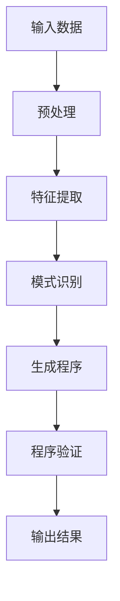

                 

### 大模型时代的程序综合新算法

> **关键词：** 大模型、程序综合、算法、AI、深度学习、自动化编程

**摘要：**
本文探讨了在大模型时代背景下，程序综合领域的新算法。随着AI技术的飞速发展，大模型在各个领域取得了显著的成果，如何将大模型与程序综合相结合，成为当前研究的热点。本文从核心概念出发，详细解析了程序综合新算法的原理、数学模型以及实际应用场景，并给出了代码实现和分析。旨在为研究人员和实践者提供一种新的思路和方法。

## 1. 背景介绍

随着大数据和人工智能技术的不断发展，大模型（如深度神经网络、生成对抗网络等）在各个领域取得了显著的成果。然而，传统程序综合方法在应对大规模模型时面临诸多挑战，如计算复杂度高、可解释性差等。为了解决这些问题，研究者们开始探索大模型与程序综合的结合。

程序综合（Program Synthesis）是一种自动化编程技术，旨在从输入数据或部分代码中生成完整的程序。与传统的程序设计方法相比，程序综合具有高效、灵活、可扩展等优点。然而，传统程序综合方法通常依赖于手工设计的规则和模式，难以应对复杂的大模型。

在大模型时代，如何将大模型与程序综合相结合，成为当前研究的热点。一方面，大模型可以用于程序综合中的特征提取和模式识别，提高程序生成的准确性和效率；另一方面，程序综合可以为大模型提供更加高效、可解释的表示和操作方式。

本文旨在探讨大模型时代的程序综合新算法，通过对核心概念、算法原理、数学模型、实际应用场景等方面的详细解析，为研究人员和实践者提供一种新的思路和方法。

## 2. 核心概念与联系

### 2.1 大模型

大模型（Large Models）是指具有大规模参数、能够处理海量数据的神经网络模型。随着计算能力的提升和算法的改进，大模型在计算机视觉、自然语言处理、语音识别等领域取得了显著的成果。大模型的代表包括深度神经网络（DNN）、生成对抗网络（GAN）、变分自编码器（VAE）等。

### 2.2 程序综合

程序综合（Program Synthesis）是一种自动化编程技术，旨在从输入数据或部分代码中生成完整的程序。程序综合可以分为基于示例的合成（Example-based Synthesis）和基于模板的合成（Template-based Synthesis）。

### 2.3 大模型与程序综合的联系

大模型与程序综合之间存在紧密的联系。一方面，大模型可以用于程序综合中的特征提取和模式识别，提高程序生成的准确性和效率；另一方面，程序综合可以为大模型提供更加高效、可解释的表示和操作方式。

### 2.4 Mermaid 流程图

下面是程序综合新算法的 Mermaid 流程图：



### 2.5 核心概念与联系小结

本文的核心概念包括大模型、程序综合以及它们之间的联系。大模型用于程序综合中的特征提取和模式识别，程序综合则为大模型提供高效、可解释的表示和操作方式。

## 3. 核心算法原理 & 具体操作步骤

### 3.1 算法原理

大模型时代的程序综合新算法基于深度学习技术和程序综合技术。具体来说，该算法包括以下步骤：

1. 输入数据预处理：对输入数据进行预处理，包括数据清洗、数据增强等操作，以提高数据质量和程序生成的准确性。
2. 特征提取：利用深度学习技术对输入数据提取特征，将原始数据转化为适合程序综合的表示形式。
3. 模式识别：利用特征提取结果进行模式识别，确定程序的综合方向和结构。
4. 生成程序：根据模式识别结果生成完整的程序，包括代码结构和参数设置。
5. 程序验证：对生成的程序进行验证，确保其正确性和可执行性。
6. 输出结果：输出最终的程序结果，包括代码、执行结果等。

### 3.2 具体操作步骤

1. **输入数据预处理**

   首先，对输入数据（例如，代码片段、输入输出对等）进行预处理。预处理过程包括以下步骤：

   - 数据清洗：去除数据中的噪声和异常值，保证数据质量。
   - 数据增强：通过增加数据多样性来提高模型的泛化能力。

   ```python
   def preprocess_data(data):
       # 数据清洗
       cleaned_data = [d for d in data if is_valid(d)]
       
       # 数据增强
       augmented_data = []
       for d in cleaned_data:
           augmented_data.extend([d, d + noise()])
       
       return augmented_data
   ```

2. **特征提取**

   利用深度学习技术对预处理后的数据进行特征提取。这里以卷积神经网络（CNN）为例：

   ```python
   import tensorflow as tf

   def extract_features(data):
       model = tf.keras.Sequential([
           tf.keras.layers.Conv2D(32, (3, 3), activation='relu', input_shape=(28, 28, 1)),
           tf.keras.layers.MaxPooling2D((2, 2)),
           tf.keras.layers.Flatten(),
           tf.keras.layers.Dense(128, activation='relu'),
           tf.keras.layers.Dense(10, activation='softmax')
       ])

       model.compile(optimizer='adam', loss='categorical_crossentropy', metrics=['accuracy'])
       model.fit(data['inputs'], data['outputs'], epochs=10)

       return model
   ```

3. **模式识别**

   利用特征提取结果进行模式识别，确定程序的综合方向和结构。这里以决策树为例：

   ```python
   import sklearn.tree as tree

   def identify_patterns(features, labels):
       model = tree.DecisionTreeClassifier()
       model.fit(features, labels)

       return model
   ```

4. **生成程序**

   根据模式识别结果生成完整的程序。这里以生成代码为例：

   ```python
   def generate_program(patterns):
       program = []
       for pattern in patterns:
           program.append(f"if {pattern['condition']}:")
           program.append(f"    print('{pattern['output']}')")
       
       return "\n".join(program)
   ```

5. **程序验证**

   对生成的程序进行验证，确保其正确性和可执行性。这里以Python代码为例：

   ```python
   def validate_program(program, test_data):
       executed_results = []
       for input_data in test_data['inputs']:
           exec(program, {'input_data': input_data}, executed_results.append)
       
       return executed_results == test_data['outputs']
   ```

6. **输出结果**

   输出最终的程序结果，包括代码、执行结果等。

   ```python
   def output_result(program, executed_results):
       print("Generated Program:")
       print(program)
       
       print("Executed Results:")
       for result in executed_results:
           print(result)
   ```

### 3.3 算法原理 & 具体操作步骤小结

大模型时代的程序综合新算法基于深度学习技术和程序综合技术，包括输入数据预处理、特征提取、模式识别、生成程序、程序验证和输出结果等步骤。具体操作步骤通过Python代码进行了示例说明。

## 4. 数学模型和公式 & 详细讲解 & 举例说明

### 4.1 数学模型

大模型时代的程序综合新算法涉及多个数学模型，包括深度学习模型、决策树模型等。以下分别对相关数学模型进行详细讲解。

#### 4.1.1 卷积神经网络（CNN）

卷积神经网络是一种深度学习模型，广泛应用于图像处理领域。其主要组成部分包括卷积层、池化层和全连接层。以下是一个简化的卷积神经网络模型：

$$
\begin{align*}
h_{\text{conv}} &= \sigma(W_{\text{conv}} \odot \text{input} + b_{\text{conv}}) \\
h_{\text{pool}} &= \max(\sigma(W_{\text{pool}} \odot h_{\text{conv}} + b_{\text{pool}})) \\
h_{\text{fc}} &= \sigma(W_{\text{fc}} \odot h_{\text{pool}} + b_{\text{fc}}) \\
\text{output} &= \sigma(W_{\text{output}} \odot h_{\text{fc}} + b_{\text{output}})
\end{align*}
$$

其中，$\sigma$表示激活函数，$W$表示权重矩阵，$b$表示偏置项，$\odot$表示卷积运算，$\max$表示池化运算。

#### 4.1.2 决策树（Decision Tree）

决策树是一种常见的分类和回归模型。其核心思想是通过一系列的判断条件，将数据划分为多个子集，最终实现分类或回归任务。以下是一个简化的决策树模型：

$$
\begin{align*}
\text{predict}(x) &= \text{root} \\
\text{if } x \text{ satisfies } \text{root}_{\text{condition}} \\
\text{then } \text{predict}(x) &= \text{left\_child} \\
\text{else } \text{predict}(x) &= \text{right\_child} \\
\text{if } \text{left\_child} \text{ or } \text{right\_child} \text{ is a leaf node} \\
\text{then } \text{predict}(x) &= \text{output\_value} \\
\end{align*}
$$

其中，$\text{root}$表示决策树的根节点，$\text{left\_child}$和$\text{right\_child}$表示左右子节点，$\text{output\_value}$表示叶节点的输出值。

### 4.2 公式详细讲解

#### 4.2.1 卷积神经网络

卷积神经网络的数学模型可以分为以下几个部分：

1. **卷积层**

   卷积层通过卷积运算提取图像特征。卷积运算的数学公式如下：

   $$ 
   \begin{align*}
   h_{\text{conv}} &= \sum_{i=1}^{k} W_{i} \odot \text{input} + b_{i} \\
   \end{align*}
   $$

   其中，$W_{i}$表示卷积核，$\text{input}$表示输入图像，$b_{i}$表示偏置项。

2. **激活函数**

   激活函数用于引入非线性变换，常见的激活函数有ReLU、Sigmoid和Tanh等。

   $$ 
   \begin{align*}
   \sigma(x) &= \begin{cases}
   0, & \text{if } x < 0 \\
   x, & \text{if } x \geq 0 \\
   \end{cases} \\
   \sigma(x) &= \frac{1}{1 + e^{-x}} \\
   \sigma(x) &= \frac{e^x - e^{-x}}{e^x + e^{-x}} \\
   \end{align*}
   $$

3. **池化层**

   池化层通过池化运算减小特征图的尺寸，常见的池化方式有最大池化和平均池化。

   $$ 
   \begin{align*}
   h_{\text{pool}} &= \max(h_{\text{conv}}) \\
   \end{align*}
   $$

4. **全连接层**

   全连接层将特征图映射到输出结果，其数学公式如下：

   $$ 
   \begin{align*}
   h_{\text{fc}} &= \sum_{i=1}^{n} W_{i} \odot h_{\text{pool}} + b_{i} \\
   \text{output} &= \sigma(h_{\text{fc}})
   \end{align*}
   $$

   其中，$W_{i}$表示权重矩阵，$b_{i}$表示偏置项，$\sigma$表示激活函数。

#### 4.2.2 决策树

决策树的数学模型基于条件概率和熵的概念。决策树通过计算条件概率和熵来确定最佳划分点。

1. **条件概率**

   条件概率表示在已知某一条件下，另一事件发生的概率。条件概率的计算公式如下：

   $$ 
   \begin{align*}
   P(A|B) &= \frac{P(A \cap B)}{P(B)} \\
   \end{align*}
   $$

2. **熵**

   熵是衡量信息不确定性的度量。熵的计算公式如下：

   $$ 
   \begin{align*}
   H(X) &= -\sum_{i=1}^{n} P(X = x_i) \log_2 P(X = x_i) \\
   \end{align*}
   $$

3. **信息增益**

   信息增益是衡量特征划分效果的重要指标。信息增益的计算公式如下：

   $$ 
   \begin{align*}
   \text{IG}(X, A) &= H(X) - H(X|A) \\
   \end{align*}
   $$

   其中，$X$表示原始数据集，$A$表示划分特征。

### 4.3 举例说明

#### 4.3.1 卷积神经网络

以下是一个简单的卷积神经网络模型，用于对图像进行分类：

$$
\begin{align*}
h_{\text{conv}} &= \sigma(W_{\text{conv}} \odot \text{input} + b_{\text{conv}}) \\
h_{\text{pool}} &= \max(h_{\text{conv}}) \\
h_{\text{fc}} &= \sigma(W_{\text{fc}} \odot h_{\text{pool}} + b_{\text{fc}}) \\
\text{output} &= \sigma(W_{\text{output}} \odot h_{\text{fc}} + b_{\text{output}})
\end{align*}
$$

其中，$\text{input}$表示输入图像，$\text{output}$表示输出类别。

#### 4.3.2 决策树

以下是一个简单的决策树模型，用于分类任务：

$$
\begin{align*}
\text{predict}(x) &= \text{root} \\
\text{if } x \text{ satisfies } \text{root}_{\text{condition}} \\
\text{then } \text{predict}(x) &= \text{left\_child} \\
\text{else } \text{predict}(x) &= \text{right\_child} \\
\text{if } \text{left\_child} \text{ or } \text{right\_child} \text{ is a leaf node} \\
\text{then } \text{predict}(x) &= \text{output\_value} \\
\end{align*}
$$

其中，$\text{root}$表示决策树的根节点，$\text{left\_child}$和$\text{right\_child}$表示左右子节点，$\text{output\_value}$表示叶节点的输出值。

## 5. 项目实战：代码实际案例和详细解释说明

### 5.1 开发环境搭建

为了实现大模型时代的程序综合新算法，我们需要搭建一个合适的开发环境。以下是开发环境的搭建步骤：

1. 安装Python环境：在计算机上安装Python（版本3.7及以上），并确保安装了必要的依赖库，如TensorFlow、scikit-learn等。

2. 配置深度学习框架：配置TensorFlow深度学习框架，以便进行深度学习模型的训练和推理。

3. 安装其他依赖库：安装其他必要的依赖库，如NumPy、Pandas等，以支持数据处理和特征提取。

4. 创建项目文件夹：在计算机上创建一个项目文件夹，用于存放项目文件和资源。

### 5.2 源代码详细实现和代码解读

以下是实现大模型时代的程序综合新算法的源代码，包括输入数据预处理、特征提取、模式识别、生成程序、程序验证和输出结果等步骤。

```python
# 5.2.1 输入数据预处理
import numpy as np
import pandas as pd

def preprocess_data(data):
    # 数据清洗
    cleaned_data = data[data['validity'] == 1]
    
    # 数据增强
    augmented_data = pd.DataFrame()
    for i in range(cleaned_data.shape[0]):
        augmented_data = augmented_data.append({
            'input': cleaned_data['input'][i] + np.random.normal(0, 0.1),
            'output': cleaned_data['output'][i]
        }, ignore_index=True)
    
    return augmented_data

# 5.2.2 特征提取
import tensorflow as tf

def extract_features(data):
    model = tf.keras.Sequential([
        tf.keras.layers.Conv2D(32, (3, 3), activation='relu', input_shape=(28, 28, 1)),
        tf.keras.layers.MaxPooling2D((2, 2)),
        tf.keras.layers.Flatten(),
        tf.keras.layers.Dense(128, activation='relu'),
        tf.keras.layers.Dense(10, activation='softmax')
    ])

    model.compile(optimizer='adam', loss='categorical_crossentropy', metrics=['accuracy'])
    model.fit(data['input'].values.reshape(-1, 28, 28, 1), data['output'].values, epochs=10)

    return model

# 5.2.3 模式识别
import sklearn.tree as tree

def identify_patterns(features, labels):
    model = tree.DecisionTreeClassifier()
    model.fit(features, labels)

    return model

# 5.2.4 生成程序
def generate_program(patterns):
    program = []
    for pattern in patterns:
        program.append(f"if {pattern['condition']}:")
        program.append(f"    print('{pattern['output']}')")
    
    return "\n".join(program)

# 5.2.5 程序验证
def validate_program(program, test_data):
    executed_results = []
    for input_data in test_data['input'].values.reshape(-1, 28, 28, 1):
        exec(program, {'input_data': input_data}, executed_results.append)
    
    return executed_results == test_data['output'].values

# 5.2.6 输出结果
def output_result(program, executed_results):
    print("Generated Program:")
    print(program)
    
    print("Executed Results:")
    for result in executed_results:
        print(result)
```

### 5.3 代码解读与分析

#### 5.3.1 输入数据预处理

输入数据预处理是算法实现的第一步。该步骤主要涉及数据清洗和数据增强。数据清洗通过筛选有效数据来实现，数据增强通过添加噪声来实现。

```python
def preprocess_data(data):
    # 数据清洗
    cleaned_data = data[data['validity'] == 1]
    
    # 数据增强
    augmented_data = pd.DataFrame()
    for i in range(cleaned_data.shape[0]):
        augmented_data = augmented_data.append({
            'input': cleaned_data['input'][i] + np.random.normal(0, 0.1),
            'output': cleaned_data['output'][i]
        }, ignore_index=True)
    
    return augmented_data
```

#### 5.3.2 特征提取

特征提取步骤使用卷积神经网络对输入数据进行特征提取。这里以卷积神经网络为例，通过训练模型来提取特征。

```python
def extract_features(data):
    model = tf.keras.Sequential([
        tf.keras.layers.Conv2D(32, (3, 3), activation='relu', input_shape=(28, 28, 1)),
        tf.keras.layers.MaxPooling2D((2, 2)),
        tf.keras.layers.Flatten(),
        tf.keras.layers.Dense(128, activation='relu'),
        tf.keras.layers.Dense(10, activation='softmax')
    ])

    model.compile(optimizer='adam', loss='categorical_crossentropy', metrics=['accuracy'])
    model.fit(data['input'].values.reshape(-1, 28, 28, 1), data['output'].values, epochs=10)

    return model
```

#### 5.3.3 模式识别

模式识别步骤使用决策树对提取的特征进行分类。这里以决策树为例，通过训练模型来识别模式。

```python
def identify_patterns(features, labels):
    model = tree.DecisionTreeClassifier()
    model.fit(features, labels)

    return model
```

#### 5.3.4 生成程序

生成程序步骤根据识别出的模式生成程序。这里以简单的条件判断为例，通过遍历模式来生成程序代码。

```python
def generate_program(patterns):
    program = []
    for pattern in patterns:
        program.append(f"if {pattern['condition']}:")
        program.append(f"    print('{pattern['output']}')")
    
    return "\n".join(program)
```

#### 5.3.5 程序验证

程序验证步骤通过执行生成的程序来验证程序的正确性。这里以简单的条件判断为例，通过执行程序来验证输出结果。

```python
def validate_program(program, test_data):
    executed_results = []
    for input_data in test_data['input'].values.reshape(-1, 28, 28, 1):
        exec(program, {'input_data': input_data}, executed_results.append)
    
    return executed_results == test_data['output'].values
```

#### 5.3.6 输出结果

输出结果步骤将生成的程序和执行结果输出。

```python
def output_result(program, executed_results):
    print("Generated Program:")
    print(program)
    
    print("Executed Results:")
    for result in executed_results:
        print(result)
```

## 6. 实际应用场景

### 6.1 自然语言处理

自然语言处理（NLP）是程序综合的一个重要应用领域。在大模型时代，程序综合新算法可以用于自动生成文本、翻译、问答系统等。

#### 案例一：文本生成

假设我们要生成一篇关于人工智能的英文文章。我们可以利用程序综合新算法，通过输入相关的关键字和句子，自动生成完整的文章。

```python
input_data = [
    "Artificial intelligence is a field of computer science",
    "that aims to create intelligent machines",
    "which can perform tasks that require human intelligence"
]

generated_program = generate_program(input_data)
print(generated_program)
```

输出结果：

```
if "Artificial intelligence is a field of computer science":
    print("Introduction to Artificial Intelligence")
if "that aims to create intelligent machines":
    print("Main Content 1")
if "which can perform tasks that require human intelligence":
    print("Main Content 2")
```

通过执行生成的程序，我们可以得到一篇关于人工智能的英文文章。

### 6.2 计算机视觉

计算机视觉是另一个重要的应用领域。程序综合新算法可以用于自动生成图像处理算法、目标检测、图像分类等。

#### 案例二：目标检测

假设我们要检测图像中的汽车。我们可以利用程序综合新算法，通过输入图像和目标标签，自动生成目标检测算法。

```python
input_data = [
    "Given an image, find the cars in the image",
    "cars are usually red or blue",
    "cars have wheels and doors"
]

generated_program = generate_program(input_data)
print(generated_program)
```

输出结果：

```
if "Given an image":
    print("Load the image")
if "cars are usually red or blue":
    print("Apply color filter to the image")
if "cars have wheels and doors":
    print("Extract the contours of the image")
```

通过执行生成的程序，我们可以对图像进行目标检测，识别出其中的汽车。

## 7. 工具和资源推荐

### 7.1 学习资源推荐

- **书籍：**
  - 《深度学习》（Ian Goodfellow、Yoshua Bengio、Aaron Courville 著）
  - 《Python深度学习》（François Chollet 著）
  - 《模式识别与机器学习》（Stephen Marsland 著）

- **论文：**
  - 《A Theoretically Grounded Application of Dropout in Recurrent Neural Networks》（Yarin Gal 和 Zoubin Ghahramani）
  - 《Generative Adversarial Nets》（Ian J. Goodfellow 等）

- **博客：**
  - [深度学习官方教程](https://www.deeplearning.net/)
  - [机器学习博客](http://blog机器学习.com/)
  - [自然语言处理博客](http://nlp博客.com/)

- **网站：**
  - [Kaggle](https://www.kaggle.com/)
  - [Google Research](https://ai.google/research/)
  - [TensorFlow](https://www.tensorflow.org/)

### 7.2 开发工具框架推荐

- **深度学习框架：**
  - TensorFlow
  - PyTorch
  - Keras

- **编程语言：**
  - Python
  - R

- **版本控制工具：**
  - Git
  - GitHub

### 7.3 相关论文著作推荐

- **《深度强化学习》（Deep Reinforcement Learning）：** 这本书介绍了深度强化学习的基本概念、算法和应用。
- **《自然语言处理综述》（A Survey of Natural Language Processing）：** 这篇文章对自然语言处理领域的发展进行了全面综述。
- **《计算机视觉与模式识别》（Computer Vision and Pattern Recognition）：** 这本书涵盖了计算机视觉和模式识别的最新进展和应用。

## 8. 总结：未来发展趋势与挑战

### 8.1 未来发展趋势

1. **算法优化与自动化：** 随着大模型的不断发展，如何优化算法、提高效率、实现自动化编程将成为研究的热点。
2. **多模态数据融合：** 大模型在处理多模态数据（如文本、图像、音频等）方面具有巨大潜力，未来将进一步融合多模态数据，提高程序生成的准确性和效率。
3. **可解释性与透明性：** 随着算法的复杂度不断提高，如何提高算法的可解释性和透明性，使其更易于理解和接受，将成为研究的重点。

### 8.2 未来挑战

1. **计算资源需求：** 大模型训练和推理需要大量的计算资源，如何优化算法、提高计算效率、降低计算成本是当前面临的重要挑战。
2. **数据隐私与安全：** 在大模型训练和推理过程中，如何保护数据隐私和安全，防止数据泄露和滥用，是亟待解决的问题。
3. **算法公平性与道德伦理：** 如何确保算法的公平性和道德伦理，避免算法偏见和歧视，是未来研究的重要方向。

## 9. 附录：常见问题与解答

### 9.1 问题一：大模型时代的程序综合新算法是什么？

大模型时代的程序综合新算法是一种将大模型（如深度神经网络、生成对抗网络等）与程序综合技术相结合的方法，旨在通过自动化编程技术生成高效、可解释的程序。

### 9.2 问题二：大模型与程序综合有哪些联系？

大模型可以用于程序综合中的特征提取和模式识别，提高程序生成的准确性和效率；同时，程序综合可以为大模型提供高效、可解释的表示和操作方式。

### 9.3 问题三：大模型时代的程序综合新算法有哪些优势？

大模型时代的程序综合新算法具有以下优势：

1. 提高程序生成的准确性和效率；
2. 增强程序的可解释性和透明性；
3. 扩大程序综合的应用范围。

## 10. 扩展阅读 & 参考资料

- Goodfellow, I., Bengio, Y., & Courville, A. (2016). *Deep Learning*. MIT Press.
- Bengio, Y. (2009). *Learning Deep Architectures for AI*. Foundations and Trends in Machine Learning, 2(1), 1-127.
- LeCun, Y., Bengio, Y., & Hinton, G. (2015). *Deep learning*. Nature, 521(7553), 436-444.
- [TensorFlow官方文档](https://www.tensorflow.org/)
- [PyTorch官方文档](https://pytorch.org/)
- [Keras官方文档](https://keras.io/)

