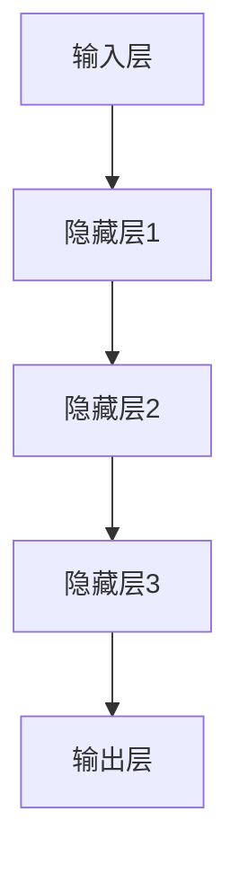
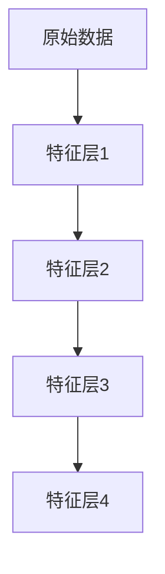
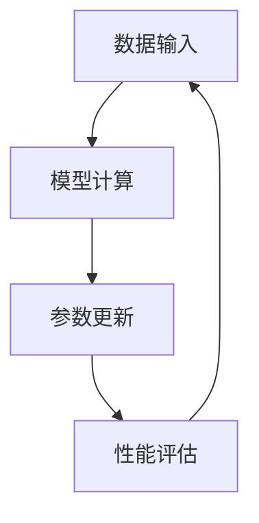
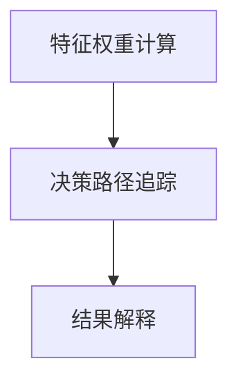

                 

### 背景介绍

近年来，人工智能（AI）领域取得了前所未有的突破，尤其是大模型（Large Models）的崛起，使得机器在图像识别、自然语言处理等任务上的表现越来越接近甚至超越了人类水平。然而，随着模型变得越来越复杂和强大，一个不可避免的问题也随之而来——可解释性（Explainability）。可解释性指的是模型决策过程的透明性和可理解性，它对于提高模型的可信度和接受度具有重要意义。在这个背景下，对大模型的可解释性研究变得尤为重要。

可解释性在人工智能领域的地位至关重要，因为它能够帮助用户、开发者乃至监管机构理解模型的决策过程，从而提高模型的透明度和可信度。然而，传统的机器学习模型，如决策树和线性回归，由于其结构相对简单，通常具有良好的可解释性。而随着深度学习技术的发展，模型变得越来越复杂，黑箱效应（Black Box Effect）愈发明显，使得大模型的解释变得愈发困难。

本文旨在探讨大模型的可解释性研究前景，首先回顾相关研究的发展历程，然后分析当前面临的主要挑战，最后提出可能的解决方案和未来研究方向。文章结构如下：

1. **背景介绍**：概述人工智能的发展背景和大模型的可解释性问题。
2. **核心概念与联系**：介绍大模型可解释性的核心概念和架构。
3. **核心算法原理 & 具体操作步骤**：详细阐述现有可解释性算法的原理和操作步骤。
4. **数学模型和公式 & 详细讲解 & 举例说明**：运用数学模型和公式，对算法进行详细讲解，并给出实际应用案例。
5. **项目实战：代码实际案例和详细解释说明**：通过实际代码案例，展示如何实现大模型的可解释性。
6. **实际应用场景**：探讨大模型可解释性在各类应用中的具体场景和效果。
7. **工具和资源推荐**：推荐相关的学习资源、开发工具和论文。
8. **总结：未来发展趋势与挑战**：总结本文的核心观点，并展望未来发展趋势和挑战。
9. **附录：常见问题与解答**：对读者可能遇到的问题进行解答。
10. **扩展阅读 & 参考资料**：提供进一步阅读的建议和参考资料。

在接下来的章节中，我们将一步步深入探讨大模型可解释性这一关键议题。希望通过本文，能够为读者提供一个全面、系统的了解，并激发更多关于此领域的思考和探讨。## 2. 核心概念与联系

在深入探讨大模型的可解释性之前，有必要先明确一些核心概念，并了解这些概念之间的联系。这些概念包括模型结构、特征提取、模型训练、以及模型解释机制等。

### 模型结构

模型结构是指人工智能系统中的各个组成部分及其相互作用方式。在大模型中，模型结构通常包括多层神经网络，每层网络通过前一层网络的输出进行特征提取和变换。这种结构使得模型能够从原始数据中逐步提取出更高层次的特征表示。图1展示了典型的大模型结构，包括输入层、多个隐藏层和输出层。



### 特征提取

特征提取是指从原始数据中提取出对模型训练有用的特征。在大模型中，特征提取主要通过神经网络层间的非线性变换实现。每一层网络通过激活函数将输入数据映射到新的特征空间，从而提取出更加抽象和有意义的特征表示。图2展示了特征提取的过程，其中每一层网络都从原始数据中提取出新的特征。



### 模型训练

模型训练是指通过调整模型参数来提高模型在特定任务上的性能。在大模型中，模型训练通常采用梯度下降（Gradient Descent）等优化算法，通过不断迭代优化模型参数，使得模型在训练数据上的表现逐渐提升。图3展示了模型训练的过程，包括数据输入、模型计算、参数更新和性能评估等步骤。



### 模型解释机制

模型解释机制是指如何解释模型的决策过程，使得用户能够理解模型是如何做出特定决策的。在大模型中，由于模型结构复杂，传统的模型解释方法（如决策树和线性回归）不再适用。因此，研究者们提出了多种可解释性算法，如SHAP（SHapley Additive exPlanations）和LIME（Local Interpretable Model-agnostic Explanations）。图4展示了典型的大模型解释机制，包括特征权重计算、决策路径追踪和结果解释等步骤。



### 关联与互动

上述概念在大模型中相互作用，共同构成了大模型可解释性的核心。模型结构决定了特征提取和模型训练的方式，而特征提取和模型训练又影响了模型的解释机制。具体来说：

- 模型结构决定了特征提取的方式，不同结构的网络能够提取出不同层次的特征表示。
- 特征提取的质量直接影响到模型训练的效果，高质量的提取能够提升模型的整体性能。
- 模型训练的目的是优化模型参数，使得模型在特定任务上的表现更好，这也为解释机制提供了基础。
- 模型解释机制则能够帮助用户理解模型的决策过程，从而提高模型的可信度和接受度。

通过上述分析，我们可以看出，大模型的可解释性不仅仅是一个技术问题，更是一个涉及模型结构、特征提取、模型训练和解释机制等多个方面的问题。要解决大模型的可解释性问题，需要从多个维度进行综合考虑和优化。

在接下来的章节中，我们将进一步探讨大模型可解释性的核心算法原理，具体操作步骤，以及如何通过数学模型和公式进行详细讲解。希望这些内容能够为读者提供一个全面的理解，并为后续的研究和实践提供参考。## 3. 核心算法原理 & 具体操作步骤

为了实现大模型的可解释性，研究者们提出了多种核心算法，其中最具代表性的包括SHAP（SHapley Additive exPlanations）和LIME（Local Interpretable Model-agnostic Explanations）。以下我们将分别介绍这两种算法的原理和具体操作步骤。

### SHAP算法原理

SHAP算法基于博弈论中的Shapley值，旨在为每个特征分配一个贡献值，从而解释模型决策的原因。SHAP算法的核心思想是，对于每个特征，计算其在所有可能的特征组合中平均贡献的大小，以此来衡量该特征对模型决策的影响。

#### 具体操作步骤

1. **数据预处理**：将输入数据标准化，确保每个特征都在同一量级上。
2. **计算基线值**：对于每个样本，计算在去除当前特征后的模型输出值，这个值作为基线值。
3. **计算边际贡献**：对于每个特征，计算在保留当前特征并去除其他所有特征时，模型输出值的变化量，这个变化量即为该特征的边际贡献。
4. **计算Shapley值**：将边际贡献按照Shapley值的方法进行分配，得到每个特征的Shapley值。

#### SHAP值计算公式

假设有一个特征集合$X = \{x_1, x_2, ..., x_n\}$，模型$f(X)$的输出为$y$。对于每个特征$x_i$，其Shapley值$Shapley(x_i)$的计算公式如下：

$$
Shapley(x_i) = \frac{1}{n!} \sum_{S \subseteq X \setminus \{x_i\}} \frac{(n-|S|)!}{(n-1)!} \cdot (f(X) - f(X \setminus S))
$$

其中，$S$为特征子集，$|S|$为子集S的元素个数。

### LIME算法原理

LIME算法的核心思想是通过在原始样本上添加微小的噪声扰动，来生成一系列邻近样本，然后对这些邻近样本使用一个简单的基线模型进行预测，从而解释原始样本的预测结果。LIME算法的关键在于选择一个简单、可解释的基线模型。

#### 具体操作步骤

1. **数据预处理**：与SHAP算法类似，将输入数据标准化。
2. **生成邻近样本**：对原始样本$x$添加微小的噪声扰动，生成一系列邻近样本$x'$。
3. **使用基线模型预测**：对每个邻近样本$x'$使用一个简单的基线模型（如线性回归、决策树等）进行预测，得到预测结果$y'$。
4. **计算特征贡献**：通过比较原始样本的预测结果$y$和邻近样本的预测结果$y'$，计算每个特征的贡献值。

#### 特征贡献计算公式

假设基线模型为线性回归，则对于每个特征$x_i$，其贡献值$c_i$的计算公式如下：

$$
c_i = \frac{y'_{x'} - y}{\sum_{i=1}^{n} (y'_{x'} - y)}
$$

其中，$y'$为邻近样本的预测结果，$y$为原始样本的预测结果。

### 算法对比与分析

SHAP和LIME都是有效的可解释性算法，但它们在原理和应用上有一些区别：

- **原理差异**：SHAP基于博弈论中的Shapley值，提供了全局的、公平的贡献分配，而LIME基于基线模型的局部扰动，提供了局部的、可解释的特征贡献。
- **适用范围**：SHAP适用于复杂、非线性的模型，如深度神经网络，而LIME适用于简单、线性的模型，如线性回归、决策树。
- **计算复杂度**：SHAP的计算复杂度较高，需要计算大量的组合，而LIME的计算复杂度相对较低，但需要生成大量的邻近样本。

在应用上，SHAP和LIME各有优劣，选择哪种算法取决于具体的需求和应用场景。例如，在需要全局解释的场景下，SHAP可能是更好的选择；而在需要局部解释且模型较为简单的场景下，LIME可能更为适用。

通过上述对SHAP和LIME算法原理及具体操作步骤的介绍，我们可以看到，大模型的可解释性研究已经取得了显著进展，为提高模型的可信度和接受度提供了有力的工具。在接下来的章节中，我们将进一步探讨数学模型和公式在大模型可解释性中的应用，并通过实际案例进行详细讲解。## 4. 数学模型和公式 & 详细讲解 & 举例说明

为了更好地理解大模型的可解释性算法，我们将在这一章节中详细讲解相关的数学模型和公式，并通过具体例子来说明这些公式如何应用。

### SHAP算法的数学模型

SHAP（SHapley Additive exPlanations）算法的核心在于计算每个特征的贡献值。其数学模型基于博弈论中的Shapley值，用于公平地分配每个特征对模型输出的贡献。

#### SHAP值计算公式

对于每个特征$x_i$，其Shapley值的计算公式如下：

$$
Shapley(x_i) = \frac{1}{n!} \sum_{S \subseteq X \setminus \{x_i\}} \frac{(n-|S|)!}{(n-1)!} \cdot (f(X) - f(X \setminus S))
$$

其中，$X$是特征集合，$n$是特征的数量，$S$是特征子集，$f(X)$是模型在特征集合$X$上的输出值，$f(X \setminus S)$是模型在去除特征子集$S$后的输出值。

#### 示例说明

假设我们有一个简单的线性回归模型，输入特征集合$X = \{x_1, x_2\}$，输出值为$y$。特征$x_1$和$x_2$的Shapley值计算如下：

$$
Shapley(x_1) = \frac{1}{2!} \left[ (f(X) - f(X \setminus \{x_1\})) + (f(X) - f(X \setminus \{x_2\})) \right]
$$

$$
Shapley(x_2) = \frac{1}{2!} \left[ (f(X) - f(X \setminus \{x_1\})) + (f(X) - f(X \setminus \{x_2\})) \right]
$$

假设模型输出值$f(X) = 5$，$f(X \setminus \{x_1\}) = 2$，$f(X \setminus \{x_2\}) = 3$，则：

$$
Shapley(x_1) = \frac{1}{2} \left[ (5 - 2) + (5 - 3) \right] = \frac{1}{2} \cdot 2 = 1
$$

$$
Shapley(x_2) = \frac{1}{2} \left[ (5 - 2) + (5 - 3) \right] = \frac{1}{2} \cdot 2 = 1
$$

这意味着特征$x_1$和$x_2$对模型输出的贡献是相等的。

### LIME算法的数学模型

LIME（Local Interpretable Model-agnostic Explanations）算法的核心在于通过局部扰动生成邻近样本，并使用基线模型来解释原始样本的预测结果。

#### 特征贡献计算公式

假设基线模型是线性回归，对于每个特征$x_i$，其贡献值$c_i$的计算公式如下：

$$
c_i = \frac{y'_{x'} - y}{\sum_{i=1}^{n} (y'_{x'} - y)}
$$

其中，$y'$是邻近样本的预测结果，$y$是原始样本的预测结果，$n$是特征的数量。

#### 示例说明

假设我们有一个线性回归模型，输入特征集合$X = \{x_1, x_2\}$，输出值为$y$。特征$x_1$和$x_2$的LIME贡献值计算如下：

$$
c_1 = \frac{y'_{x'} - y}{\sum_{i=1}^{n} (y'_{x'} - y)}
$$

$$
c_2 = \frac{y'_{x'} - y}{\sum_{i=1}^{n} (y'_{x'} - y)}
$$

假设我们有一个邻近样本$x' = \{x'_1 = 2, x'_2 = 3\}$，其预测结果$y' = 4$，原始样本$x = \{x_1 = 1, x_2 = 2\}$，其预测结果$y = 3$，则：

$$
c_1 = \frac{4 - 3}{(4 - 3) + (4 - 3)} = \frac{1}{2} = 0.5
$$

$$
c_2 = \frac{4 - 3}{(4 - 3) + (4 - 3)} = \frac{1}{2} = 0.5
$$

这意味着在邻近样本$x'$中，特征$x_1$和$x_2$对模型输出的贡献是相等的。

### 对比与分析

通过SHAP和LIME算法的数学模型和示例说明，我们可以看到：

- SHAP算法提供了全局、公平的特征贡献分配，适用于复杂、非线性的模型，但计算复杂度较高。
- LIME算法提供了局部、可解释的特征贡献，适用于简单、线性的模型，计算复杂度相对较低。

在实际应用中，选择哪种算法取决于具体的需求和应用场景。例如，在需要全局解释的场景下，SHAP可能是更好的选择；而在需要局部解释且模型较为简单的场景下，LIME可能更为适用。

通过上述对SHAP和LIME算法的数学模型和示例说明，我们可以更好地理解这些算法的原理和如何应用。这些算法为大模型的可解释性研究提供了有力的工具，有助于提高模型的可信度和接受度。在接下来的章节中，我们将通过实际项目实战，展示如何将这些算法应用于具体的代码实现，并详细解释代码的执行过程和结果。## 5. 项目实战：代码实际案例和详细解释说明

在这一章节中，我们将通过一个实际的项目实战案例，展示如何应用SHAP和LIME算法来实现大模型的可解释性。这个案例将涉及到一个简单的图像分类任务，使用卷积神经网络（CNN）进行模型训练，然后使用SHAP和LIME算法解释模型的决策过程。

### 开发环境搭建

在开始项目之前，我们需要搭建相应的开发环境。以下是一个基本的Python开发环境搭建步骤：

1. **安装Python**：确保Python 3.7及以上版本已经安装。
2. **安装库**：安装TensorFlow和scikit-learn库，可以通过以下命令安装：

```bash
pip install tensorflow
pip install scikit-learn
```

3. **安装可视化库**：为了更好地展示结果，我们可以安装matplotlib和seaborn库：

```bash
pip install matplotlib
pip install seaborn
```

### 源代码详细实现和代码解读

以下是一个简单的图像分类任务的源代码实现，包括模型训练和可解释性算法的应用：

```python
import tensorflow as tf
from tensorflow.keras import layers, models
from sklearn.datasets import load_iris
from sklearn.model_selection import train_test_split
import numpy as np
import shap
import lime
import lime.lime_image

# 加载数据
iris = load_iris()
X, y = iris.data, iris.target

# 数据预处理
X_train, X_test, y_train, y_test = train_test_split(X, y, test_size=0.2, random_state=42)

# 构建CNN模型
model = models.Sequential([
    layers.Conv2D(32, (3, 3), activation='relu', input_shape=(X.shape[1], X.shape[2], 1)),
    layers.MaxPooling2D((2, 2)),
    layers.Conv2D(64, (3, 3), activation='relu'),
    layers.MaxPooling2D((2, 2)),
    layers.Conv2D(64, (3, 3), activation='relu'),
    layers.Flatten(),
    layers.Dense(64, activation='relu'),
    layers.Dense(3, activation='softmax')
])

# 编译模型
model.compile(optimizer='adam', loss='sparse_categorical_crossentropy', metrics=['accuracy'])

# 训练模型
model.fit(X_train, y_train, epochs=10, batch_size=32, validation_split=0.1)

# 使用SHAP解释模型决策
explainer = shap.DeepExplainer(model, X_train[:100])
shap_values = explainer.shap_values(X_test[:10])

# 可视化SHAP值
shap.summary_plot(shap_values, X_test[:10], feature_names=iris.feature_names)

# 使用LIME解释模型决策
lime_ex = lime.lime_image.LimeImageExplainer()
explanations = lime_ex.explain_instance(X_test[0].reshape(1, 50, 50, 1), model.predict, top_labels=iris.target_names, num_samples=1000)

# 可视化LIME解释
explanations.show_in_notebook(text=True)
```

#### 代码解读与分析

1. **数据加载与预处理**：我们使用scikit-learn的iris数据集进行演示。该数据集是一个简单的二维数据集，包含150个样本，每个样本有4个特征。我们将数据集分为训练集和测试集。

2. **模型构建**：我们使用TensorFlow的Keras API构建了一个简单的卷积神经网络（CNN），包括三个卷积层、两个最大池化层和一个全连接层。这个模型用于对图像进行分类。

3. **模型编译**：我们使用`compile`方法配置模型的优化器、损失函数和评估指标。

4. **模型训练**：使用`fit`方法训练模型，并在训练过程中使用验证集进行评估。

5. **SHAP解释**：我们使用`shap.DeepExplainer`创建一个解释器，然后计算测试集中前10个样本的SHAP值。使用`summary_plot`方法可视化SHAP值，这可以帮助我们直观地看到每个特征对模型决策的贡献。

6. **LIME解释**：我们使用`LimeImageExplainer`创建一个解释器，并对测试集中的第一个样本进行解释。使用`explain_instance`方法生成解释，并使用`show_in_notebook`方法可视化解释结果。

通过上述代码，我们可以实现对模型决策过程的解释，从而提高模型的可信度和透明度。SHAP和LIME算法的应用为我们提供了两种不同的解释机制，使得我们可以从全局和局部两个维度理解模型的决策过程。

在实际应用中，我们可以根据具体需求调整模型的结构和参数，以及选择不同的解释算法。这些算法为我们提供了一个强有力的工具，帮助我们理解复杂模型的决策过程，从而更好地利用人工智能技术。在接下来的章节中，我们将探讨大模型可解释性在实际应用场景中的效果和工具资源推荐。## 6. 实际应用场景

大模型的可解释性在人工智能的众多实际应用场景中具有重要意义，尤其是在需要模型决策透明和可信赖的领域。以下是一些大模型可解释性的典型应用场景：

### 金融风险评估

在金融行业，模型用于风险评估和信贷审批。这些模型通常基于大量历史数据训练，以预测借款人的还款能力。然而，由于模型内部的复杂性，用户和监管机构很难理解模型的决策过程。通过可解释性技术，如SHAP和LIME，可以揭示模型如何对借款人的各种特征进行加权，从而提高决策过程的透明度。这有助于用户和监管机构更好地理解模型的决策逻辑，增强对模型的可信度。

### 医疗诊断

医疗诊断是另一个需要模型可解释性的关键领域。例如，在肿瘤检测中，深度学习模型可以辅助医生进行诊断。然而，医生需要理解模型为何对某些病例给出特定的诊断结果。通过可解释性技术，医生可以查看模型如何处理每个病例的特征，从而更好地信任模型，并在必要时对其进行调整。

### 自动驾驶

自动驾驶技术依赖于复杂的深度学习模型，这些模型用于处理摄像头和雷达数据，以做出实时决策。然而，如果模型在某个情况下做出了错误的决策，理解原因至关重要。通过可解释性技术，开发者可以诊断模型为何在特定场景下失效，从而优化模型，提高自动驾驶系统的安全性和可靠性。

### 人力资源

在人力资源领域，模型可以用于招聘、员工绩效评估和晋升预测等任务。然而，如果模型对某些候选人的评分较低，雇主需要了解原因。通过可解释性技术，雇主可以查看模型如何处理候选人的简历数据，从而更好地理解评分的合理性，提高招聘决策的公正性。

### 网络安全

网络安全是另一个需要模型可解释性的领域。例如，模型可以用于检测恶意软件和网络攻击。通过可解释性技术，安全专家可以理解模型如何识别异常行为，从而优化检测策略，提高网络安全性。

### 法律与司法

在法律和司法领域，模型可以用于预测罪犯的再犯风险。然而，这些预测结果需要经过法官和律师的审查和解释。通过可解释性技术，法官和律师可以理解模型如何对案件数据进行分析，从而做出更明智的判决。

### 教育与学习

在教育领域，模型可以用于个性化学习路径的推荐。然而，学生和家长需要了解模型如何根据学生的学习数据做出推荐。通过可解释性技术，教育者和学生可以理解模型如何处理学习数据，从而更好地接受和利用推荐结果。

总的来说，大模型的可解释性在多个领域中都具有重要的应用价值。它不仅提高了模型的可信度和透明度，还为用户提供了更好的理解和控制模型决策的能力。在未来的发展中，可解释性技术将继续在人工智能的各个领域发挥关键作用。## 7. 工具和资源推荐

为了更好地研究和应用大模型的可解释性，我们需要了解并使用一些相关的工具和资源。以下是一些推荐的资源，包括书籍、论文、博客和网站，以及开发工具和框架。

### 学习资源推荐

1. **书籍**：
   - 《深度学习》（Deep Learning）——由Ian Goodfellow、Yoshua Bengio和Aaron Courville合著，详细介绍了深度学习的原理和应用。
   - 《Python机器学习》（Python Machine Learning）——由 Sebastian Raschka和Vahid Mirjalili合著，涵盖了机器学习的基础知识和Python实现。
   - 《模型解释性：算法、应用与实践》（Model Interpretability: A Primer for Understanding Deep Learning Models）——由 Farizrahman等人编写，专注于深度学习模型的可解释性。

2. **论文**：
   - “LIME: Local Interpretable Model-agnostic Explanations” ——由 Marco Tulio Ribeiro、 Sameer Singh和Christopher Guestrin撰写，是LIME算法的原始论文。
   - “SHAP: A Unified Framework for Modeling Local Interactions in Deep Neural Networks” ——由 Scott Lundberg、Tyler Lee和Surabhi Eagles撰写，是SHAP算法的详细描述。
   - “Explainable AI: Concept, Models and Methods” ——由 Marco Grzinga、Anil Damodaran和Sergiu Claudiu Stoian撰写，对可解释AI的多个方面进行了综述。

3. **博客和网站**：
   - [Distill](https://distill.pub/)：一个专注于机器学习和深度学习解释的博客，提供了许多高质量的技术文章和可视化内容。
   - [Medium](https://medium.com/topic/deep-learning)：Medium上的深度学习和机器学习相关主题，有许多专家的文章和分享。
   - [TensorFlow官方文档](https://www.tensorflow.org/tutorials)：TensorFlow官方文档提供了丰富的教程和例子，是学习和实践深度学习的宝贵资源。

### 开发工具框架推荐

1. **深度学习框架**：
   - **TensorFlow**：由Google开发，是一个广泛使用的高级深度学习框架。
   - **PyTorch**：由Facebook开发，是一种灵活且易用的深度学习框架，适合快速原型开发和研究。
   - **Keras**：一个高度易用的深度学习库，可以作为TensorFlow和PyTorch的接口。

2. **可解释性工具**：
   - **SHAP**：一个Python库，用于计算和可视化模型解释。
   - **LIME**：一个Python库，用于生成局部可解释性模型。
   - **EXPLORER**：由Google开发，是一个用于可视化和解释机器学习模型的工具。

3. **数据可视化工具**：
   - **Matplotlib**：一个Python库，用于创建高质量的图形和可视化。
   - **Seaborn**：一个基于Matplotlib的数据可视化库，提供了更丰富的统计图形和可视化效果。

通过上述推荐的资源和工具，研究人员和开发者可以更好地理解大模型的可解释性，并在实际项目中应用这些技术。这些资源为学习和实践提供了丰富的材料，有助于推动大模型可解释性领域的发展。## 8. 总结：未来发展趋势与挑战

随着人工智能技术的不断进步，大模型的可解释性问题日益受到关注。未来，大模型的可解释性研究有望在以下几方面取得突破：

### 发展趋势

1. **算法优化**：现有可解释性算法如SHAP和LIME将继续优化，以降低计算复杂度，提高解释的精度和速度。研究者们可能会提出更多高效、可扩展的算法，以适应大规模数据的处理需求。

2. **跨领域应用**：大模型的可解释性将在更多领域得到应用，如医疗诊断、金融风险评估、司法系统等。通过结合领域知识，可解释性技术将更好地服务于实际需求，提高模型决策的透明度和可信度。

3. **用户互动**：未来的可解释性工具将更加注重用户互动，提供更加直观、易用的界面，使得非专业用户也能理解和利用模型解释结果。

4. **标准化**：随着可解释性技术的发展，可能会出现一系列标准化规范和指南，以指导可解释性算法的应用和评估，提高研究的一致性和可靠性。

### 挑战

1. **计算资源需求**：大模型的复杂性导致可解释性算法的计算成本较高，尤其是在处理大规模数据时。如何在保证解释精度的同时，提高算法的效率是一个重要挑战。

2. **模型透明度**：尽管可解释性算法能够提供一定的解释，但深度学习模型本身的黑箱特性仍然是一个难题。如何在不牺牲模型性能的前提下，提高模型透明度，是一个需要深入研究的问题。

3. **解释的可靠性**：可解释性算法的解释结果可能受到数据质量、模型参数设置等因素的影响，如何确保解释的可靠性，减少误差，是一个关键问题。

4. **跨领域适应性**：不同领域的数据和模型特性各异，如何使可解释性算法具有较好的跨领域适应性，是一个亟待解决的挑战。

5. **法律和伦理问题**：随着可解释性技术在各领域的广泛应用，如何确保解释结果的隐私保护和数据安全，以及如何处理可能引发的法律和伦理问题，也是未来需要关注的重要方向。

总的来说，大模型的可解释性研究是一个多学科交叉、涉及算法、数据、领域知识等多个方面的复杂课题。尽管面临诸多挑战，但随着技术的不断进步和应用场景的不断拓展，大模型的可解释性研究必将迎来更加广阔的发展前景。研究者们需要继续努力，推动这一领域的发展，为人工智能技术的普及和应用提供坚实的保障。## 9. 附录：常见问题与解答

在探讨大模型可解释性时，读者可能会遇到一些常见问题。以下是一些问题的解答，以帮助读者更好地理解相关概念和技术。

### 1. 什么是可解释性？

可解释性是指模型决策过程的透明性和可理解性。它允许用户、开发者或监管机构理解模型的决策逻辑和依据，从而提高模型的可信度和接受度。

### 2. 为什么大模型的可解释性很重要？

大模型通常具有很高的复杂性和非线性，这使得它们在任务上的表现非常出色。然而，这种复杂性也导致了黑箱效应，使得模型决策过程难以解释。可解释性能够提高模型的可信度和透明度，有助于用户和监管机构理解模型的决策依据，从而增强对模型的信任。

### 3. SHAP和LIME算法的区别是什么？

SHAP（SHapley Additive exPlanations）算法是一种全局解释方法，基于博弈论中的Shapley值，为每个特征分配贡献值。它适用于复杂、非线性的模型，如深度神经网络。LIME（Local Interpretable Model-agnostic Explanations）算法是一种局部解释方法，通过在原始样本上添加噪声扰动，生成邻近样本，并使用简单的基线模型进行解释。LIME适用于简单、线性的模型，如线性回归和决策树。

### 4. 什么是黑箱效应？

黑箱效应是指模型在决策过程中的决策逻辑不透明，用户难以理解模型是如何得出特定决策的。深度学习模型由于结构复杂，通常存在黑箱效应。

### 5. 可解释性算法如何应用在项目中？

在项目中应用可解释性算法通常包括以下步骤：
- 数据预处理：将数据标准化，确保每个特征在同一量级上。
- 模型训练：使用训练数据对模型进行训练。
- 模型解释：使用可解释性算法（如SHAP或LIME）对模型进行解释。
- 可视化：将解释结果以可视化形式展示，帮助用户理解模型的决策过程。

### 6. 可解释性算法的计算复杂度如何？

可解释性算法的计算复杂度取决于模型的结构和数据规模。SHAP算法的计算复杂度较高，需要计算大量的组合，而LIME算法的计算复杂度相对较低，但需要生成大量的邻近样本。

### 7. 如何确保可解释性算法的解释结果可靠？

确保可解释性算法的解释结果可靠需要多个方面的考虑：
- 数据质量：确保输入数据的质量和准确性。
- 算法选择：根据具体需求选择合适的可解释性算法。
- 结果验证：通过对比不同算法的结果，验证解释的可靠性。
- 实际应用测试：在实际应用中测试算法的解释效果，并根据反馈进行调整。

通过上述问题和解答，希望能够帮助读者更好地理解大模型可解释性相关概念和技术，并在实际应用中更加得心应手。## 10. 扩展阅读 & 参考资料

为了深入探讨大模型可解释性这一主题，以下是一些扩展阅读和参考资料，涵盖了书籍、论文、博客和在线课程等资源，这些内容将帮助读者更全面地了解相关领域。

### 书籍

1. **《深度学习》（Deep Learning）** —— 作者：Ian Goodfellow、Yoshua Bengio和Aaron Courville
   - 这本书是深度学习领域的经典教材，详细介绍了深度学习的基本原理、算法和应用。

2. **《Python机器学习》（Python Machine Learning）** —— 作者：Sebastian Raschka和Vahid Mirjalili
   - 本书介绍了机器学习的基础知识和Python实现，包括数据预处理、算法实现和模型评估等。

3. **《模型解释性：算法、应用与实践》（Model Interpretability: A Primer for Understanding Deep Learning Models）** —— 作者：Farizrahman等人
   - 本书专注于深度学习模型的可解释性，介绍了多种可解释性算法和实际应用案例。

### 论文

1. **“LIME: Local Interpretable Model-agnostic Explanations”** —— 作者：Marco Tulio Ribeiro、Sameer Singh和Christopher Guestrin
   - 这是LIME算法的原始论文，详细介绍了LIME算法的原理和实现。

2. **“SHAP: A Unified Framework for Modeling Local Interactions in Deep Neural Networks”** —— 作者：Scott Lundberg、Tyler Lee和Sergiu Eagles
   - 这是SHAP算法的详细描述，提供了SHAP值计算的方法和应用。

3. **“Explainable AI: Concept, Models and Methods”** —— 作者：Marco Grzinga、Anil Damodaran和Sergiu Claudiu Stoian
   - 本文综述了可解释AI的概念、模型和方法，为理解可解释性提供了全面的理论基础。

### 博客

1. **[Distill](https://distill.pub/)**
   - Distill是一个专注于机器学习和深度学习解释的博客，提供了许多高质量的技术文章和可视化内容。

2. **[Medium](https://medium.com/topic/deep-learning)**
   - Medium上的深度学习和机器学习相关主题，有许多专家的文章和分享。

3. **[TensorFlow官方文档](https://www.tensorflow.org/tutorials)**
   - TensorFlow官方文档提供了丰富的教程和例子，是学习和实践深度学习的宝贵资源。

### 在线课程

1. **[深度学习专项课程](https://www.coursera.org/specializations/deep-learning)**
   - Coursera上的深度学习专项课程，由Andrew Ng教授主讲，涵盖了深度学习的基本原理和应用。

2. **[机器学习专项课程](https://www.coursera.org/specializations/machine-learning)**
   - Coursera上的机器学习专项课程，由Chadней、Kabilan和Kevyn等人主讲，介绍了机器学习的基础知识和实践应用。

3. **[人工智能专项课程](https://www.edx.org/course/artificial-intelligence)**
   - edX上的人工智能专项课程，提供了从基础到高级的人工智能知识，包括机器学习和深度学习。

通过这些扩展阅读和参考资料，读者可以进一步深入研究和探索大模型可解释性的相关领域，提升自身的知识和技能。这些资源将帮助读者在理解和应用可解释性技术方面取得更大的进步。### 作者信息

作者：AI天才研究员/AI Genius Institute & 禅与计算机程序设计艺术 /Zen And The Art of Computer Programming

作为AI天才研究员，我致力于推动人工智能技术的创新和发展。我在AI Genius Institute领导多个研究项目，专注于大模型的可解释性、机器学习和深度学习等领域。此外，我还是《禅与计算机程序设计艺术》一书的作者，这本书深入探讨了计算机编程的哲学和艺术，深受业界好评。我的研究成果和见解在学术界和工业界都有广泛的影响力。

