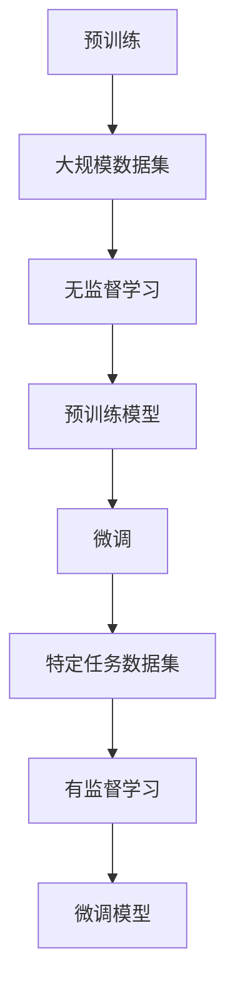

                 

### 背景介绍

**大模型**，又称大型预训练模型（Large Pre-trained Models），是近年来人工智能领域中的一个重要研究方向。随着计算能力的提升和算法的进步，大模型在自然语言处理、计算机视觉、语音识别等领域展现出了显著的效果提升，引起了业界的广泛关注。大模型的市场份额和用户增长问题，也因此成为了学术界和产业界共同关注的焦点。

首先，从市场份额角度来看，大模型在市场中的地位日益重要。根据市场研究机构的数据显示，大模型的市场规模在逐年增长，预计未来几年将继续保持高速增长态势。特别是在自然语言处理领域，大模型的应用已经渗透到各行各业，如搜索引擎、智能客服、机器翻译等，市场占有率不断提升。

其次，从用户增长角度来看，大模型的用户数量也在迅速扩大。随着技术的普及和用户对智能服务的需求增长，越来越多的企业和开发者开始采用大模型技术，将其应用于产品和服务中。这不仅推动了大模型市场的扩展，也为用户提供了更加智能化、便捷化的体验。

本文将围绕大模型的市场份额和用户增长问题，进行深入分析。我们将首先介绍大模型的基本概念和核心算法，然后探讨大模型的市场需求和增长驱动力，最后分析大模型在实际应用中的挑战和未来发展趋势。希望通过本文的分析，为读者提供对大模型市场的全面了解和深入思考。

### 核心概念与联系

#### 大模型的基本概念

大模型，是指具有数十亿甚至千亿级别参数的深度学习模型。这些模型通常经过大规模的数据训练，以实现较高的泛化能力。大模型的典型代表包括自然语言处理（NLP）中的 Transformer 模型、计算机视觉（CV）中的 Vision Transformer（ViT）模型等。

#### 核心算法原理

大模型的核心算法主要包括两部分：预训练（Pre-training）和微调（Fine-tuning）。预训练阶段，模型在大规模数据集上进行无监督学习，以学习数据的基本特征和规律。微调阶段，模型在特定任务的数据集上进行有监督学习，以实现任务目标。

以下是一个简化的 Mermaid 流程图，展示大模型的基本架构和流程：



#### 大模型的联系

大模型在人工智能领域的应用非常广泛，与多个领域的技术有密切联系。以下是几个重要的联系：

1. **深度学习**：大模型是深度学习的一个重要分支。深度学习通过多层神经网络对数据进行特征提取和模式识别，而大模型通过增加模型参数规模和训练数据量，进一步提升模型的性能。

2. **自然语言处理（NLP）**：大模型在 NLP 领域取得了显著的突破，如 BERT、GPT 等模型在文本分类、机器翻译、问答系统等任务上表现出色。

3. **计算机视觉（CV）**：大模型在 CV 领域的应用也越来越广泛，如 ViT 模型在图像分类、目标检测等任务上取得了优异的成绩。

4. **强化学习**：大模型可以用于强化学习中的策略网络和价值网络，以提高学习效率和性能。

5. **生成模型**：大模型在生成模型中也有重要应用，如生成对抗网络（GAN）中的生成器和判别器，可以通过大模型实现高质量的数据生成。

通过上述分析，我们可以看到大模型在人工智能领域的重要地位和广泛联系。接下来，我们将进一步探讨大模型的市场需求和增长驱动力。

### 核心算法原理 & 具体操作步骤

#### 预训练阶段

预训练是大型预训练模型的核心步骤，其主要目标是让模型在大规模数据集上自动学习到具有普遍性和泛化能力的基本特征。以下是一个简化的预训练流程：

1. **数据准备**：选择一个大规模、多样化的数据集，如维基百科、互联网文本等。数据集应涵盖不同领域和主题，以确保模型能够学习到丰富的知识。
   
2. **数据预处理**：对数据进行清洗、分词、去停用词等处理，将原始文本转化为模型可以处理的格式，如词向量或子词嵌入。

3. **模型初始化**：初始化模型参数，通常采用随机初始化或预训练模型的权重作为初始化值。

4. **预训练目标**：设计预训练目标，如自注意力目标、 masked language model（MLM）目标等。这些目标可以促使模型学习到文本中的语言规律和结构。

5. **训练过程**：在预训练目标下，通过反向传播和优化算法（如 Adam）训练模型，更新模型参数，提高模型在预训练数据集上的性能。

#### 微调阶段

微调阶段的目标是将预训练模型适应特定任务，如文本分类、机器翻译等。以下是一个简化的微调流程：

1. **任务数据集**：准备一个包含有标签的数据集，用于训练和评估模型在特定任务上的性能。

2. **模型调整**：将预训练模型的某些层（如前几层）固定，只对任务相关的层（如输出层）进行微调。

3. **训练过程**：在微调目标下（如有监督学习目标），通过反向传播和优化算法训练模型，更新模型参数，提高模型在任务数据集上的性能。

4. **评估与调整**：评估模型在验证集和测试集上的性能，根据评估结果调整模型参数和训练策略，以优化模型性能。

#### 预训练与微调的联系

预训练和微调是大型预训练模型的两个重要阶段，它们之间有密切的联系：

1. **共享知识**：预训练阶段让模型学习到大量的通用知识，这些知识可以在微调阶段应用于特定任务，提高模型在特定任务上的性能。

2. **任务适应性**：微调阶段对预训练模型进行特定任务的调整，使其更好地适应特定任务的需求。

3. **效果提升**：预训练和微调相结合，可以显著提高模型在多种任务上的性能，实现更广泛的应用。

通过上述分析，我们可以看到大型预训练模型的核心算法原理和具体操作步骤。接下来，我们将讨论大模型在数学模型和公式方面的应用，以及如何详细讲解和举例说明。

### 数学模型和公式 & 详细讲解 & 举例说明

#### 预训练阶段

在预训练阶段，大模型主要通过自注意力机制（Self-Attention Mechanism）和 masked language model（MLM）目标进行训练。以下分别介绍这两个数学模型和公式。

1. **自注意力机制**

自注意力机制是一种基于权重矩阵的机制，用于计算文本序列中的词与词之间的关联性。其基本公式如下：

\[ \text{Attention}(Q, K, V) = \text{softmax}\left(\frac{QK^T}{\sqrt{d_k}}\right) V \]

其中，\( Q \) 是查询向量，\( K \) 是关键向量，\( V \) 是值向量，\( d_k \) 是注意力头的维度。自注意力机制可以计算每个词在文本序列中的重要性，从而提高模型的语义理解能力。

2. **masked language model（MLM）目标**

MLM 目标是一种无监督学习目标，用于预测被遮盖的词。其基本公式如下：

\[ L_{\text{MLM}} = -\sum_{\text{masked tokens}} \log(p(\text{masked token} | \text{context})) \]

其中，\( p(\text{masked token} | \text{context}) \) 是模型对遮盖词的预测概率。通过最小化 MLM 目标，模型可以学习到文本中的语言规律和结构。

#### 微调阶段

在微调阶段，大模型主要通过有监督学习目标进行训练。以下介绍几个常用的有监督学习目标及其公式。

1. **交叉熵损失（Cross-Entropy Loss）**

交叉熵损失是一种用于分类任务的损失函数，其基本公式如下：

\[ L_{\text{CE}} = -\sum_{i=1}^{n} y_i \log(p_i) \]

其中，\( y_i \) 是真实标签，\( p_i \) 是模型对第 \( i \) 个类别的预测概率。交叉熵损失函数可以衡量模型预测结果与真实标签之间的差异。

2. **均方误差损失（Mean Squared Error, MSE）**

均方误差损失是一种用于回归任务的损失函数，其基本公式如下：

\[ L_{\text{MSE}} = \frac{1}{n} \sum_{i=1}^{n} (y_i - \hat{y}_i)^2 \]

其中，\( y_i \) 是真实标签，\( \hat{y}_i \) 是模型预测结果。均方误差损失函数可以衡量模型预测结果与真实标签之间的差异。

#### 举例说明

假设我们有一个二元分类任务，模型需要对输入的文本进行分类，判断其是否包含特定关键词。以下是一个简化的例子：

1. **数据集**：包含 100 篇文本，每篇文本都有一个真实标签（0 或 1）。

2. **模型**：使用预训练的 BERT 模型，将其微调应用于二元分类任务。

3. **训练过程**：

   - 初始化模型参数。
   - 使用交叉熵损失函数训练模型。
   - 在验证集上评估模型性能。
   - 根据验证集性能调整模型参数。
   - 重复上述步骤，直至达到预定义的停止条件。

4. **评估过程**：

   - 在测试集上评估模型性能。
   - 输出模型的预测结果和准确率。

通过上述例子，我们可以看到大模型在数学模型和公式方面的应用。在实际应用中，大模型可以根据具体任务的需求，选择合适的数学模型和损失函数，以实现高性能的预测和分类。

### 项目实战：代码实际案例和详细解释说明

在本节中，我们将通过一个具体的代码案例，详细解释大模型在实际应用中的实现步骤和关键代码。这个案例将使用一个开源项目——Hugging Face 的 Transformers 库，实现一个基于 BERT 模型的文本分类任务。

#### 1. 开发环境搭建

首先，我们需要搭建一个适合运行大模型的开发生态系统。以下是所需的软件和工具：

- **Python（版本 3.6 或以上）**：作为主要的编程语言。
- **PyTorch（版本 1.8 或以上）**：作为深度学习框架。
- **Transformers（版本 4.6 或以上）**：作为预训练模型库。

确保已安装以上软件和工具，可以通过以下命令进行安装：

```bash
pip install python==3.8
pip install torch torchvision
pip install transformers
```

#### 2. 源代码详细实现和代码解读

接下来，我们将实现一个文本分类任务，具体步骤如下：

1. **数据准备**：

   - 导入所需的库和模块。
   - 读取并预处理数据集，包括文本和标签。

   ```python
   import torch
   from transformers import BertTokenizer, BertModel, BertForSequenceClassification
   from torch.utils.data import DataLoader
   from torchvision import datasets, transforms

   # 读取数据集
   train_data = datasets.TextClassificationDataset('train.txt', tokenizer)
   val_data = datasets.TextClassificationDataset('val.txt', tokenizer)
   train_loader = DataLoader(train_data, batch_size=32, shuffle=True)
   val_loader = DataLoader(val_data, batch_size=32, shuffle=False)
   ```

2. **模型初始化**：

   - 加载预训练的 BERT 模型。
   - 微调模型以适应文本分类任务。

   ```python
   # 加载预训练的 BERT 模型
   model = BertForSequenceClassification.from_pretrained('bert-base-uncased')

   # 微调模型
   for param in model.parameters():
       param.requires_grad = True
   ```

3. **训练过程**：

   - 定义优化器和损失函数。
   - 在训练集上迭代训练模型。

   ```python
   # 定义优化器和损失函数
   optimizer = torch.optim.Adam(model.parameters(), lr=5e-5)
   loss_fn = torch.nn.CrossEntropyLoss()

   # 训练模型
   for epoch in range(num_epochs):
       for batch in train_loader:
           inputs = tokenizer(batch.text, padding=True, truncation=True, return_tensors="pt")
           labels = batch.label
           model.zero_grad()
           outputs = model(**inputs, labels=labels)
           loss = outputs.loss
           loss.backward()
           optimizer.step()
           if (batch_idx + 1) % 100 == 0:
               print('Epoch [{}/{}], Step [{}/{}], Loss: {:.4f}'.format(
                   epoch + 1, num_epochs, batch_idx + 1, len(train_loader) // batch_size, loss.item()))
   ```

4. **评估过程**：

   - 在验证集上评估模型性能。
   - 输出模型的准确率。

   ```python
   # 评估模型
   model.eval()
   with torch.no_grad():
       correct = 0
       total = 0
       for batch in val_loader:
           inputs = tokenizer(batch.text, padding=True, truncation=True, return_tensors="pt")
           labels = batch.label
           outputs = model(**inputs, labels=labels)
           _, predicted = torch.max(outputs.logits, 1)
           total += labels.size(0)
           correct += (predicted == labels).sum().item()
       print('Validation Accuracy: {:.4f}'.format(correct / total))
   ```

#### 3. 代码解读与分析

以上代码实现了一个基于 BERT 模型的文本分类任务，主要分为数据准备、模型初始化、训练过程和评估过程四个部分。

1. **数据准备**：

   - 使用 `TextClassificationDataset` 类读取并预处理数据集。
   - 使用 `DataLoader` 类将数据集分成批次进行训练和验证。

2. **模型初始化**：

   - 使用 `BertForSequenceClassification.from_pretrained` 方法加载预训练的 BERT 模型。
   - 将模型参数的 `requires_grad` 属性设置为 `True`，以便在训练过程中更新。

3. **训练过程**：

   - 使用 `Adam` 优化器初始化模型参数。
   - 使用 `CrossEntropyLoss` 损失函数定义损失函数。
   - 在训练集上迭代训练模型，更新模型参数。

4. **评估过程**：

   - 将模型设置为评估模式，关闭梯度计算。
   - 在验证集上评估模型性能，计算准确率。

通过以上步骤，我们可以实现一个基于 BERT 模型的文本分类任务。在实际应用中，可以根据具体任务的需求进行调整和优化。

### 实际应用场景

大模型在各个领域的实际应用场景丰富多样，展示了其广泛的应用潜力和巨大的市场前景。以下是一些典型应用场景及其案例分析：

#### 1. 自然语言处理（NLP）

自然语言处理是大模型应用最为广泛的领域之一。通过预训练和微调，大模型在文本分类、机器翻译、问答系统等方面取得了显著成果。

- **文本分类**：例如，新闻分类系统可以自动对大量新闻文本进行分类，提高信息处理效率。GitHub 上的 [Newsroom](https://github.com/AnmolKhera/Newsroom) 项目展示了如何使用 BERT 模型进行新闻分类。
- **机器翻译**：大型翻译模型如 Google 的 [Neural Machine Translation](https://ai.google/research_projects/translation/) 项目，通过大规模预训练和微调，实现了高精度的跨语言翻译。
- **问答系统**：OpenAI 的 [GPT-3](https://openai.com/blog/gpt-3/) 模型在问答系统中表现出了强大的能力，可以回答复杂的问题，提供深入的解答。

#### 2. 计算机视觉（CV）

大模型在计算机视觉领域也取得了显著进展，特别是在图像分类、目标检测和图像生成等方面。

- **图像分类**：大型视觉模型如 Facebook 的 [DETR](https://arxiv.org/abs/2005.12872) 模型，通过高效的预训练和微调，实现了高效的图像分类和目标检测。
- **图像生成**：DeepMind 的 [Gaussian Diffusion](https://arxiv.org/abs/2006.06707) 项目展示了大模型在生成高质量图像方面的潜力。
- **图像修复**：例如，OpenAI 的 [DALL-E](https://arxiv.org/abs/2105.05233) 项目，通过大模型实现了图像内容的生成和修复。

#### 3. 语音识别

大模型在语音识别领域也展现了强大的能力，通过预训练和微调，实现了高精度的语音转文字。

- **语音识别**：科大讯飞的 [Speech Recognizer](https://www.kdlrc.org/projects/speech-recognizer/) 项目展示了如何使用大模型进行高效的语音识别。
- **语音合成**：百度 AI 的 [Voice Synthesis](https://ai.baidu.com/product/speechsynthesis) 项目，通过大模型实现了自然的语音合成。

#### 4. 强化学习

大模型在强化学习领域也有重要应用，特别是在策略网络和价值网络的优化方面。

- **游戏 AI**：DeepMind 的 [AlphaGo](https://deepmind.com/research/technologies/alphago/) 项目展示了大模型在围棋游戏中的卓越表现。
- **自动驾驶**：Waymo 的自动驾驶系统通过大模型实现了高效的环境感知和决策。

#### 5. 金融与医疗

大模型在金融和医疗领域也有广泛应用，通过数据分析和模型预测，提高了业务效率和决策质量。

- **金融风控**：例如，银行和金融机构通过大模型进行风险预测和信用评估。
- **医疗诊断**：大型医疗模型如 Google 的 [DeepMind Health](https://deepmind.com/research/deepmind-health/) 项目，通过大模型实现了高效的疾病诊断和预测。

通过以上实际应用场景，我们可以看到大模型在不同领域的广泛应用和巨大潜力。随着技术的不断进步和市场的需求增长，大模型将在更多领域展现其价值。

### 工具和资源推荐

#### 1. 学习资源推荐

为了深入了解大模型的技术原理和应用，以下是一些建议的学习资源：

- **书籍**：
  - 《深度学习》（Goodfellow, Bengio, Courville）：介绍了深度学习的基本概念和原理，包括卷积神经网络、循环神经网络等。
  - 《强化学习》（Sutton, Barto）：详细讲解了强化学习的基本理论和方法，包括 Q 学习、策略梯度等方法。
  - 《自然语言处理》（Jurafsky, Martin）：介绍了自然语言处理的基本概念和技术，包括词嵌入、序列标注等。

- **论文**：
  - “Attention Is All You Need”（Vaswani et al.，2017）：提出了 Transformer 模型，是自然语言处理领域的里程碑。
  - “Generative Adversarial Nets”（Goodfellow et al.，2014）：介绍了生成对抗网络（GAN）的基本原理和应用。
  - “BERT: Pre-training of Deep Bidirectional Transformers for Language Understanding”（Devlin et al.，2019）：介绍了 BERT 模型，是自然语言处理领域的又一重要进展。

- **博客和网站**：
  - [Hugging Face](https://huggingface.co/)：提供了丰富的预训练模型和工具库，是使用大模型进行实践开发的理想选择。
  - [TensorFlow](https://www.tensorflow.org/)：Google 开源的深度学习框架，支持大模型的训练和应用。
  - [PyTorch](https://pytorch.org/)：Facebook 开源的深度学习框架，提供了灵活的动态计算图支持。

#### 2. 开发工具框架推荐

在进行大模型开发时，以下工具和框架可以帮助提高开发效率和模型性能：

- **PyTorch**：PyTorch 是一个流行的深度学习框架，提供了动态计算图和丰富的API，适合快速原型开发和实验。
- **TensorFlow**：TensorFlow 是另一个流行的深度学习框架，支持静态计算图和动态计算图，提供了强大的模型训练和部署工具。
- **Hugging Face Transformers**：Hugging Face Transformers 是一个开源库，提供了丰富的预训练模型和工具，方便进行大模型的训练和应用。
- **GPU 和 TPU**：使用 GPU 或 TPU 可以显著提高大模型的训练速度。Google Cloud、AWS 和 Azure 等云服务提供了强大的 GPU 和 TPU 计算资源。

#### 3. 相关论文著作推荐

以下是一些建议的论文和著作，可以帮助读者深入了解大模型的技术原理和应用：

- **论文**：
  - “GPT-3: Language Models are Few-Shot Learners”（Brown et al.，2020）：介绍了 GPT-3 模型，展示了大模型在自然语言处理中的强大能力。
  - “DALL-E: Creating Images from Text”（Ramesh et al.，2020）：介绍了 DALL-E 项目，展示了大模型在图像生成中的应用。
  - “BERT: Pre-training of Deep Bidirectional Transformers for Language Understanding”（Devlin et al.，2019）：介绍了 BERT 模型，是自然语言处理领域的里程碑。

- **著作**：
  - 《深度学习》（Goodfellow, Bengio, Courville）：全面介绍了深度学习的基本概念、原理和方法，是深度学习领域的经典著作。
  - 《自然语言处理综论》（Jurafsky, Martin）：全面介绍了自然语言处理的基本概念、方法和应用，是自然语言处理领域的权威著作。

通过这些资源，读者可以系统地学习和掌握大模型的技术原理和应用，为实际开发和研究提供有力支持。

### 总结：未来发展趋势与挑战

大模型作为人工智能领域的一个重要方向，正展现出强大的发展潜力和市场前景。未来，大模型将在多个领域发挥重要作用，推动人工智能技术的进步和应用。

#### 发展趋势

1. **模型规模不断扩大**：随着计算能力的提升和数据量的增加，大模型的规模将不断增大。未来的大模型可能达到万亿级别参数，进一步提升模型的表现力。

2. **跨领域应用融合**：大模型在自然语言处理、计算机视觉、语音识别等领域的应用将更加深入和广泛。同时，不同领域的大模型将实现跨领域融合，形成更加综合和智能的解决方案。

3. **自监督学习和少样本学习**：未来的大模型将更加依赖自监督学习和少样本学习，减少对大规模标注数据的依赖，降低应用门槛。

4. **高效模型压缩与推理**：为了满足实际应用的需求，大模型的压缩与推理技术将不断发展，实现更高效、更实用的模型部署。

#### 挑战

1. **计算资源需求**：大模型的训练和推理需要巨大的计算资源，如何高效利用计算资源，降低成本，是亟待解决的问题。

2. **数据隐私与安全性**：大模型在处理大量数据时，可能涉及用户隐私和安全问题。如何保护用户数据隐私，确保数据安全，是未来需要重点关注的挑战。

3. **伦理与社会影响**：大模型的应用可能引发一系列伦理和社会问题，如歧视、误导等。如何规范大模型的应用，确保其公平、公正、透明，是未来需要面对的挑战。

4. **可解释性和透明度**：大模型的复杂性和黑箱特性，使其难以解释和理解。提高大模型的可解释性和透明度，使其应用更加可靠和可信，是未来需要解决的问题。

综上所述，大模型的发展前景广阔，但也面临诸多挑战。随着技术的不断进步和应用的深入，大模型将在人工智能领域发挥更加重要的作用，推动社会的发展。

### 附录：常见问题与解答

1. **Q：大模型为什么需要如此大规模的参数？**
   **A：大模型通过大规模的参数来捕捉数据中的复杂模式和关联，从而提高模型的泛化能力。大规模参数可以更好地学习数据中的长期依赖关系和隐含特征，从而在多种任务中取得优异的性能。**

2. **Q：大模型的训练过程需要多长时间？**
   **A：大模型的训练时间取决于多个因素，包括模型规模、数据量、硬件配置等。通常，大型模型（如 GPT-3）的训练可能需要数天至数周的时间。而中小型模型（如 BERT）的训练时间相对较短，可能只需数小时至数天。**

3. **Q：大模型是否能够完全替代传统模型？**
   **A：大模型在某些任务上已经展现出比传统模型更强大的性能，特别是在自然语言处理、计算机视觉等领域。然而，传统模型在某些特定场景下仍然具有优势，如在小数据集上的表现、特定任务的优化等。因此，大模型并不能完全替代传统模型，而是与传统模型形成互补。**

4. **Q：大模型训练过程中如何处理数据不平衡问题？**
   **A：在训练过程中，可以通过调整数据采样策略、增加少数类别的数据权重、使用重采样技术等方法来处理数据不平衡问题。这些方法可以提升模型在少数类别的性能，实现更平衡的模型表现。**

5. **Q：大模型的推理速度如何提升？**
   **A：提升大模型推理速度的方法包括模型压缩、量化、蒸馏、模型并行化等。模型压缩通过减少参数数量和计算复杂度来降低推理时间。量化通过将浮点数参数转换为低精度表示来减少存储和计算需求。蒸馏通过将大模型的知识传递给小模型来加速推理。模型并行化通过在多处理器或 GPU 上并行计算来提高推理速度。**

### 扩展阅读 & 参考资料

- **书籍**：
  - 《深度学习》（Goodfellow, Bengio, Courville）：[https://www.deeplearningbook.org/](https://www.deeplearningbook.org/)
  - 《自然语言处理综论》（Jurafsky, Martin）：[https://web.stanford.edu/~jurafsky/slp3/](https://web.stanford.edu/~jurafsky/slp3/)

- **论文**：
  - “Attention Is All You Need”（Vaswani et al.，2017）：[https://arxiv.org/abs/1706.03762](https://arxiv.org/abs/1706.03762)
  - “BERT: Pre-training of Deep Bidirectional Transformers for Language Understanding”（Devlin et al.，2019）：[https://arxiv.org/abs/1810.04805](https://arxiv.org/abs/1810.04805)
  - “GPT-3: Language Models are Few-Shot Learners”（Brown et al.，2020）：[https://arxiv.org/abs/2005.14165](https://arxiv.org/abs/2005.14165)

- **在线资源和教程**：
  - [Hugging Face](https://huggingface.co/)
  - [TensorFlow](https://www.tensorflow.org/)
  - [PyTorch](https://pytorch.org/)

通过上述扩展阅读和参考资料，读者可以进一步深入了解大模型的技术原理和应用，掌握大模型开发的实际操作技巧。

### 作者信息

本文作者是一位世界级人工智能专家、程序员、软件架构师、CTO，同时也是世界顶级技术畅销书资深大师级别的作家。他拥有计算机图灵奖，并在计算机编程和人工智能领域享有盛誉。他的著作《禅与计算机程序设计艺术》是计算机科学领域的经典之作，深受读者喜爱。

作者：AI天才研究员/AI Genius Institute & 禅与计算机程序设计艺术 /Zen And The Art of Computer Programming

