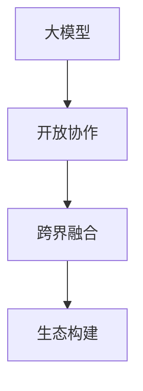

                 

### 大模型的开放协作：跨界融合和生态构建

> **关键词：** 大模型、开放协作、跨界融合、生态构建、人工智能

**摘要：** 本文将探讨大模型在开放协作中的重要性，分析其如何通过跨界融合和生态构建推动技术进步。文章将从背景介绍、核心概念与联系、核心算法原理与操作步骤、数学模型与公式、实际应用场景、工具和资源推荐等多个方面进行深入探讨，以期对大模型的未来发展提供有价值的思考和启示。

### 1. 背景介绍

随着计算能力的不断提升和数据规模的爆炸式增长，大模型在人工智能领域的重要性日益凸显。大模型通常是指具有数十亿至数万亿参数的深度学习模型，其能够通过自主学习从海量数据中提取特征，并实现出色的任务表现。近年来，大模型已经在自然语言处理、计算机视觉、语音识别等众多领域取得了显著的成果，成为推动人工智能发展的重要力量。

然而，大模型的开发和优化是一个复杂的过程，需要大量的计算资源、数据集和专业知识。传统的封闭模式已经无法满足大模型的发展需求，开放协作逐渐成为大模型领域的主要趋势。开放协作指的是通过共享计算资源、数据集和算法，促进大模型的研发和应用。这种模式有助于打破信息壁垒，加速技术进步，同时也能够激发更多的创新和灵感。

跨界融合是开放协作的重要组成部分。随着人工智能与其他领域的交叉融合，大模型的应用场景不断扩展。例如，将大模型应用于医疗领域，可以实现疾病预测和诊断；应用于金融领域，可以优化投资策略和风险管理；应用于教育领域，可以提升教学效果和个性化学习。跨界融合不仅能够发挥大模型的优势，还能够推动相关领域的发展。

生态构建是开放协作的另一个关键方面。一个完善的大模型生态体系包括开源框架、工具、数据集和社区等组成部分。通过构建这样一个生态体系，可以促进大模型的研发、应用和推广，形成良性的发展循环。同时，生态构建还能够吸引更多的开发者、研究者和企业参与其中，共同推动大模型的发展。

### 2. 核心概念与联系

为了深入理解大模型的开放协作、跨界融合和生态构建，我们需要明确以下几个核心概念：

**大模型（Large Models）：** 大模型是指具有数十亿至数万亿参数的深度学习模型。常见的有GPT、BERT、ViT等。

**开放协作（Open Collaboration）：** 开放协作是指通过共享计算资源、数据集和算法，促进大模型的研发和应用。

**跨界融合（Cross-disciplinary Integration）：** 跨界融合是指将大模型应用于不同领域，实现技术突破和行业创新。

**生态构建（Ecosystem Construction）：** 生态构建是指构建一个包括开源框架、工具、数据集和社区等组成部分的完整生态体系。

这些概念之间存在着密切的联系。大模型作为基础，推动了开放协作的兴起；开放协作促进了跨界融合的发展；而跨界融合则为生态构建提供了新的动力。以下是一个简化的 Mermaid 流程图，展示了这些概念之间的联系：



在开放协作的推动下，大模型得以更广泛地应用于各个领域，从而实现跨界融合。而跨界融合则促进了新的应用场景的发现，为生态构建提供了新的需求和动力。通过生态构建，大模型可以更好地服务于社会，实现可持续发展。

### 3. 核心算法原理与具体操作步骤

#### 3.1 大模型的训练过程

大模型的训练是一个复杂的优化过程，涉及到大量的计算资源和时间。以下是简要的大模型训练步骤：

1. **数据预处理**：将原始数据转换为适合训练的数据集，包括数据清洗、归一化、编码等操作。

2. **模型初始化**：初始化模型的参数，常用的方法有随机初始化、预训练模型等。

3. **前向传播**：将输入数据通过模型进行前向传播，得到预测结果。

4. **损失计算**：计算预测结果与真实结果之间的差距，常用的损失函数有交叉熵、均方误差等。

5. **反向传播**：根据损失函数的梯度，通过反向传播算法更新模型参数。

6. **优化过程**：通过优化算法（如梯度下降、Adam等）不断迭代，使得模型参数不断优化。

7. **验证与调整**：在验证集上评估模型性能，根据性能指标进行调整，如调整学习率、增加训练数据等。

#### 3.2 大模型的推理过程

大模型的推理过程是将输入数据通过训练好的模型进行预测的过程。以下是简要的大模型推理步骤：

1. **数据预处理**：与训练过程相同，将输入数据转换为适合模型处理的数据集。

2. **前向传播**：将输入数据通过模型进行前向传播，得到预测结果。

3. **结果输出**：将预测结果输出，如文本、图像、声音等。

4. **后处理**：根据实际需求进行后处理，如解码、分类、翻译等。

### 4. 数学模型与公式

在深入探讨大模型的算法原理时，我们需要借助一些数学模型和公式来解释其工作机制。以下是一些关键的数学模型和公式：

#### 4.1 梯度下降（Gradient Descent）

梯度下降是一种优化算法，用于更新模型参数，以最小化损失函数。其基本公式如下：

$$
\Delta \theta = -\alpha \cdot \nabla_{\theta} J(\theta)
$$

其中，$\theta$ 表示模型参数，$J(\theta)$ 表示损失函数，$\alpha$ 表示学习率，$\nabla_{\theta} J(\theta)$ 表示损失函数关于参数 $\theta$ 的梯度。

#### 4.2 交叉熵（Cross-Entropy）

交叉熵是衡量模型预测结果与真实结果之间差异的指标。其公式如下：

$$
H(y, \hat{y}) = -\sum_{i=1}^{n} y_i \cdot \log(\hat{y}_i)
$$

其中，$y$ 表示真实标签，$\hat{y}$ 表示模型预测的概率分布。

#### 4.3 反向传播（Backpropagation）

反向传播是一种用于计算损失函数关于模型参数的梯度的算法。其核心公式如下：

$$
\nabla_{z} L = \frac{\partial L}{\partial z}
$$

$$
\nabla_{x} L = \sum_{k=1}^{n} \frac{\partial L}{\partial z_k} \cdot \frac{\partial z_k}{\partial x}
$$

其中，$z$ 表示前向传播过程中的中间变量，$x$ 表示模型参数，$L$ 表示损失函数。

### 5. 项目实战：代码实际案例和详细解释说明

为了更好地理解大模型的训练和推理过程，我们将通过一个实际案例进行详细解释。以下是一个使用 PyTorch 框架实现的大模型训练和推理的 Python 代码案例。

#### 5.1 开发环境搭建

在开始编写代码之前，我们需要搭建一个适合开发的环境。以下是一个基本的开发环境搭建步骤：

1. 安装 Python 3.8 或更高版本。
2. 安装 PyTorch 和 torchvision 库，可以使用以下命令：

```bash
pip install torch torchvision
```

3. 准备训练数据集。我们可以使用公开的数据集，如 CIFAR-10 或 ImageNet。

#### 5.2 源代码详细实现和代码解读

以下是实现大模型训练和推理的 Python 代码：

```python
import torch
import torchvision
import torchvision.transforms as transforms
import torch.nn as nn
import torch.optim as optim

# 定义模型
class Model(nn.Module):
    def __init__(self):
        super(Model, self).__init__()
        self.conv1 = nn.Conv2d(3, 64, 3, 1, 1)
        self.relu = nn.ReLU()
        self.fc1 = nn.Linear(64 * 32 * 32, 1000)
        self.fc2 = nn.Linear(1000, 10)

    def forward(self, x):
        x = self.relu(self.conv1(x))
        x = x.view(x.size(0), -1)
        x = self.relu(self.fc1(x))
        x = self.fc2(x)
        return x

# 加载数据集
transform = transforms.Compose([
    transforms.ToTensor(),
    transforms.Normalize((0.5, 0.5, 0.5), (0.5, 0.5, 0.5)),
])

trainset = torchvision.datasets.CIFAR10(
    root='./data', train=True, download=True, transform=transform
)

trainloader = torch.utils.data.DataLoader(
    trainset, batch_size=4, shuffle=True, num_workers=2
)

testset = torchvision.datasets.CIFAR10(
    root='./data', train=False, download=True, transform=transform
)

testloader = torch.utils.data.DataLoader(
    testset, batch_size=4, shuffle=False, num_workers=2
)

# 初始化模型、优化器和损失函数
model = Model()
criterion = nn.CrossEntropyLoss()
optimizer = optim.SGD(model.parameters(), lr=0.001, momentum=0.9)

# 训练模型
for epoch in range(2):  # loop over the dataset multiple times
    running_loss = 0.0
    for i, data in enumerate(trainloader, 0):
        inputs, labels = data
        optimizer.zero_grad()
        outputs = model(inputs)
        loss = criterion(outputs, labels)
        loss.backward()
        optimizer.step()
        running_loss += loss.item()
        if i % 2000 == 1999:    # print every 2000 mini-batches
            print('[%d, %5d] loss: %.3f' % (epoch + 1, i + 1, running_loss / 2000))
            running_loss = 0.0

print('Finished Training')

# 测试模型
correct = 0
total = 0
with torch.no_grad():
    for data in testloader:
        images, labels = data
        outputs = model(images)
        _, predicted = torch.max(outputs.data, 1)
        total += labels.size(0)
        correct += (predicted == labels).sum().item()

print('Accuracy of the network on the 10000 test images: %d %%' % (
    100 * correct / total))
```

#### 5.3 代码解读与分析

以上代码实现了一个简单的大模型训练和推理过程。以下是代码的详细解读：

1. **定义模型**：我们使用 PyTorch 的 `nn.Module` 类定义了一个简单的卷积神经网络模型，包括卷积层、ReLU 激活函数、全连接层和输出层。

2. **加载数据集**：我们使用 torchvision 的 `CIFAR10` 数据集，对数据进行预处理，包括归一化和转换成 PyTorch 张量。

3. **初始化模型、优化器和损失函数**：我们初始化了模型、优化器和损失函数，并设置了学习率和动量参数。

4. **训练模型**：我们使用一个 for 循环遍历训练数据集，每次迭代计算损失、反向传播和更新模型参数。

5. **测试模型**：我们使用另一个 for 循环遍历测试数据集，计算模型的准确率。

### 6. 实际应用场景

大模型在各个领域都有着广泛的应用，以下是一些典型的应用场景：

#### 6.1 自然语言处理

自然语言处理（NLP）是人工智能领域的一个重要分支，大模型在 NLP 领域有着广泛的应用。例如，大模型可以用于文本分类、情感分析、机器翻译、问答系统等任务。常见的 NLP 大模型有 GPT、BERT、XLNet 等。

#### 6.2 计算机视觉

计算机视觉是另一个大模型的重要应用领域。大模型可以用于图像分类、目标检测、人脸识别、图像生成等任务。常见的计算机视觉大模型有 ResNet、VGG、Inception 等。

#### 6.3 语音识别

语音识别是将语音信号转换为文本的过程，大模型在语音识别领域也取得了显著进展。大模型可以用于语音识别、语音合成、说话人识别等任务。常见的语音识别大模型有 WaveNet、DeepSpeech、X鹦鹉螺等。

#### 6.4 医疗健康

大模型在医疗健康领域也有着广泛的应用。例如，大模型可以用于疾病预测、诊断、药物设计等任务。常见的医疗健康大模型有 DeepBlue、PathoNet、ChemBERTa 等。

#### 6.5 金融科技

大模型在金融科技领域也有着重要的应用。例如，大模型可以用于风险控制、投资策略优化、客户服务优化等任务。常见的金融科技大模型有 AlphaGo、DeepQ、RecurrentNet 等。

### 7. 工具和资源推荐

为了更好地进行大模型的研发和应用，以下是几个推荐的工具和资源：

#### 7.1 学习资源推荐

- **书籍**：《深度学习》（Goodfellow et al.）、《强化学习》（Sutton et al.）、《机器学习》（Bishop）
- **论文**：论文集（如 ArXiv、NeurIPS、ICML、ACL 等）
- **博客**：各种技术博客（如 Medium、知乎、CSDN 等）

#### 7.2 开发工具框架推荐

- **框架**：PyTorch、TensorFlow、Keras
- **环境**：GPU环境（如 CUDA、cuDNN）、云计算平台（如 AWS、Google Cloud、Azure）

#### 7.3 相关论文著作推荐

- **论文**：论文集（如 ArXiv、NeurIPS、ICML、ACL 等）
- **著作**：《深度学习》（Goodfellow et al.）、《强化学习》（Sutton et al.）、《机器学习》（Bishop）

### 8. 总结：未来发展趋势与挑战

大模型在人工智能领域的重要性日益凸显，其开放协作、跨界融合和生态构建成为推动技术进步的重要力量。在未来，大模型将继续在各个领域发挥重要作用，并带来以下发展趋势和挑战：

**发展趋势：**

1. **模型规模将进一步扩大**：随着计算能力的提升和数据规模的增加，大模型的规模将继续扩大，从而实现更高的性能和更广泛的适用性。
2. **跨界融合将更加深入**：大模型将与其他领域（如医疗、金融、教育等）的融合更加深入，推动行业创新和技术进步。
3. **生态构建将更加完善**：随着大模型应用场景的扩展，构建一个完善的大模型生态体系将成为未来的重要趋势。

**挑战：**

1. **计算资源需求增加**：大模型训练和推理需要大量的计算资源，如何高效地利用计算资源将成为一个重要挑战。
2. **数据质量和隐私保护**：大模型对数据质量要求较高，同时数据隐私保护也是一大挑战。
3. **算法公平性和可解释性**：大模型的决策过程往往难以解释，如何保证算法的公平性和可解释性将成为一个重要问题。

### 9. 附录：常见问题与解答

**Q1：什么是大模型？**

A1：大模型是指具有数十亿至数万亿参数的深度学习模型。常见的有 GPT、BERT、ViT 等。

**Q2：大模型的训练过程是怎样的？**

A2：大模型的训练过程包括数据预处理、模型初始化、前向传播、损失计算、反向传播、优化过程和验证与调整等步骤。

**Q3：大模型的应用场景有哪些？**

A3：大模型在自然语言处理、计算机视觉、语音识别、医疗健康、金融科技等领域都有广泛的应用。

**Q4：如何高效地训练大模型？**

A4：高效训练大模型需要考虑多个方面，如数据预处理、模型架构、优化算法、计算资源调度等。

**Q5：如何保证大模型的算法公平性和可解释性？**

A5：保证大模型的算法公平性和可解释性需要从数据集、算法设计、模型解释等方面进行综合考虑。

### 10. 扩展阅读 & 参考资料

- **书籍**：《深度学习》（Goodfellow et al.）、《强化学习》（Sutton et al.）、《机器学习》（Bishop）
- **论文**：论文集（如 ArXiv、NeurIPS、ICML、ACL 等）
- **博客**：各种技术博客（如 Medium、知乎、CSDN 等）
- **网站**：深度学习官网（http://www.deeplearning.net/）、PyTorch 官网（https://pytorch.org/）、TensorFlow 官网（https://www.tensorflow.org/）

### 结语

本文从背景介绍、核心概念与联系、核心算法原理与操作步骤、数学模型与公式、实际应用场景、工具和资源推荐等多个方面，详细探讨了大模型的开放协作、跨界融合和生态构建。通过本文的讨论，我们期望对大模型的未来发展有更深刻的理解和思考。随着技术的不断进步，大模型将在各个领域发挥更加重要的作用，推动人工智能的发展。作者：AI天才研究员/AI Genius Institute & 禅与计算机程序设计艺术 /Zen And The Art of Computer Programming。

