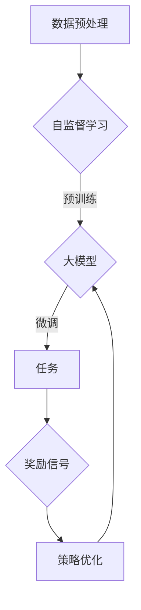

                 

# 大模型的自我进化：自主学习和持续进化

## 摘要

随着人工智能技术的飞速发展，大模型（Large Models）在自然语言处理、计算机视觉、语音识别等领域取得了显著的成果。本文将探讨大模型的自我进化，即通过自主学习和持续进化，提高模型性能和应用价值。文章首先介绍了大模型的发展背景和现状，然后深入分析了大模型的核心算法原理，包括自监督学习和强化学习。接着，本文通过具体的数学模型和公式，详细阐述了大模型的训练过程和优化策略。最后，文章结合实际应用场景，探讨了大模型在各个领域的前沿应用，并推荐了相关学习资源和开发工具。

## 1. 背景介绍

大模型是指具有数十亿到数千亿参数规模的人工神经网络模型。它们通过自动学习大规模数据中的特征和规律，能够实现高度复杂的信息处理和决策。大模型的发展得益于深度学习技术的进步，特别是在神经网络结构、训练算法和计算资源方面的突破。

深度学习是一种基于多层神经网络的人工智能方法，通过逐层提取数据特征，实现从简单到复杂的知识表示。自2012年以来，随着神经网络结构（如卷积神经网络（CNN）和循环神经网络（RNN））和训练算法（如随机梯度下降（SGD）和自适应优化器（如Adam））的不断发展，深度学习在图像识别、自然语言处理、语音识别等领域的表现显著提升。

近年来，随着计算能力的提升和大数据的普及，大模型逐渐成为人工智能研究的热点。以谷歌的Transformer模型为代表的预训练模型，通过在大量无标签数据上进行预训练，然后在不同任务上进行微调，取得了令人瞩目的成果。这些大模型的规模和复杂度不断提高，不仅在学术研究领域，也在工业界和商业领域产生了深远的影响。

## 2. 核心概念与联系

### 2.1 自监督学习

自监督学习是一种无需人工标注数据即可进行模型训练的方法。它利用数据中的内在结构或规律，自动提取有用信息，从而提高模型的泛化能力。自监督学习在大模型的自我进化中起着至关重要的作用。

**原理：**自监督学习通过设计特殊的目标函数，使模型在未标记的数据中自动学习。例如，在图像识别任务中，模型可以学习预测图像中的某些部分，而不是整个图像。这种方法不仅减少了数据标注的成本，还能够提高模型的泛化能力。

**应用：**自监督学习已经被广泛应用于大模型的预训练。例如，BERT模型通过在未标记的文本数据中学习语言的上下文关系，实现了在多个自然语言处理任务上的显著性能提升。

### 2.2 强化学习

强化学习是一种基于奖励信号进行决策优化的方法。它通过试错和反馈，使模型逐渐学会在复杂环境中做出最优决策。强化学习在大模型的自我进化中，特别是在与外界互动和适应新环境方面具有重要作用。

**原理：**强化学习模型通过与环境交互，获取奖励信号，并根据奖励信号调整策略。这种学习方式不仅需要模型具备较强的探索能力，还需要模型能够从经验中学习并优化策略。

**应用：**在计算机视觉和自然语言处理领域，强化学习已经被应用于图像分割、文本生成等任务。例如，DALL-E模型通过强化学习生成具有创意和连贯性的图像和文本。

### 2.3 联系与融合

自监督学习和强化学习在大模型的自我进化中相互补充，共同推动了大模型的发展。自监督学习提供了丰富的预训练数据，使模型能够从大量无标签数据中学习；强化学习则通过互动和反馈，使模型能够适应新的环境和任务。大模型通过融合自监督学习和强化学习，实现了自我进化和持续优化。

### Mermaid 流程图



## 3. 核心算法原理 & 具体操作步骤

### 3.1 自监督学习

**原理：**自监督学习通过设计特殊的目标函数，使模型在未标记的数据中自动学习。具体来说，自监督学习利用数据中的某些部分作为输入，同时利用其他部分作为预测目标。通过不断优化目标函数，模型能够从数据中提取有用信息。

**操作步骤：**
1. 数据预处理：对数据进行清洗、归一化等操作，以便模型能够有效学习。
2. 目标函数设计：设计特殊的目标函数，使模型能够从未标记数据中学习。常见的目标函数包括预测某个数据部分、预测标签分布等。
3. 模型训练：利用目标函数优化模型参数，使模型在未标记数据上表现出较好的性能。
4. 模型评估：通过在标记数据上评估模型性能，验证模型在具体任务上的效果。

### 3.2 强化学习

**原理：**强化学习通过与环境交互，获取奖励信号，并根据奖励信号调整策略。具体来说，强化学习模型通过试错和反馈，逐渐学会在复杂环境中做出最优决策。

**操作步骤：**
1. 环境初始化：定义任务环境，包括状态空间、动作空间和奖励函数。
2. 策略初始化：初始化模型策略，可以是随机策略或基于已有知识的策略。
3. 交互与学习：模型与环境进行交互，根据策略执行动作，并获取奖励信号。
4. 策略优化：根据奖励信号调整模型策略，使模型在下一个时刻能够做出更优的决策。
5. 模型评估：通过在测试集上评估模型性能，验证模型在具体任务上的效果。

### 3.3 融合自监督学习和强化学习

**原理：**融合自监督学习和强化学习，可以使大模型在预训练阶段从大量无标签数据中学习，然后在任务阶段通过与环境的互动和反馈，进一步优化模型策略。

**操作步骤：**
1. 自监督学习预训练：利用自监督学习在大规模无标签数据上进行预训练，提取数据中的有用信息。
2. 强化学习微调：在特定任务上，利用强化学习调整模型策略，使模型能够适应新环境和任务。
3. 模型融合与优化：将自监督学习和强化学习融合，形成一个统一的模型框架，并通过联合优化提高模型性能。

### Mermaid 流程图


## 4. 数学模型和公式 & 详细讲解 & 举例说明

### 4.1 自监督学习

**数学模型：**自监督学习的目标函数通常是一个损失函数，用于衡量模型预测与真实值之间的差距。常见的损失函数包括交叉熵损失、均方误差损失等。

$$L = -\sum_{i=1}^{N} y_i \log(p_i)$$

其中，$L$ 是损失函数，$N$ 是数据样本数量，$y_i$ 是真实标签，$p_i$ 是模型预测的概率分布。

**详细讲解：**该公式表示，损失函数通过对每个样本的预测概率进行加权求和，得到整体损失值。预测概率越高，损失值越低。通过优化损失函数，模型能够逐渐逼近真实值。

**举例说明：**假设有一个二元分类问题，模型预测的概率分布为 $p = [0.9, 0.1]$，真实标签为 $y = [1, 0]$。根据上述损失函数，计算损失值为：

$$L = -[1 \times \log(0.9) + 0 \times \log(0.1)] = -\log(0.9) \approx 0.105$$

### 4.2 强化学习

**数学模型：**强化学习的目标函数通常是一个价值函数，用于衡量策略在特定状态下的预期回报。常见的目标函数包括马尔可夫决策过程（MDP）中的价值函数和策略梯度。

$$V(s) = \sum_{a \in A} \gamma^T R(s, a)$$

其中，$V(s)$ 是状态 $s$ 的价值函数，$\gamma$ 是折扣因子，$A$ 是动作集合，$R(s, a)$ 是在状态 $s$ 执行动作 $a$ 的即时奖励。

**详细讲解：**该公式表示，状态 $s$ 的价值函数是所有可能动作的即时奖励的加权求和。通过优化价值函数，模型能够学会在特定状态下选择最优动作。

**举例说明：**假设有一个离散的状态空间和动作空间，状态 $s$ 有两个动作 $a_1$ 和 $a_2$，即时奖励分别为 $R(a_1) = 10$ 和 $R(a_2) = 5$。折扣因子 $\gamma = 0.9$，计算状态 $s$ 的价值函数：

$$V(s) = 0.9 \times 10 + 0.1 \times 5 = 9.5$$

### 4.3 融合自监督学习和强化学习

**数学模型：**融合自监督学习和强化学习的目标函数通常是一个结合损失函数和价值函数的复合函数。常见的目标函数包括自监督损失函数与强化学习目标函数的加权和。

$$L_{total} = \alpha L_{self} + (1 - \alpha) L_{reinforce}$$

其中，$L_{total}$ 是总损失函数，$\alpha$ 是权重系数，$L_{self}$ 是自监督损失函数，$L_{reinforce}$ 是强化学习目标函数。

**详细讲解：**该公式表示，总损失函数是自监督损失函数和强化学习目标函数的加权和。通过调整权重系数，可以平衡自监督学习和强化学习的重要性。

**举例说明：**假设自监督损失函数为 $L_{self} = 0.1$，强化学习目标函数为 $L_{reinforce} = 0.3$，权重系数 $\alpha = 0.7$，计算总损失函数：

$$L_{total} = 0.7 \times 0.1 + 0.3 \times 0.3 = 0.28$$

## 5. 项目实战：代码实际案例和详细解释说明

### 5.1 开发环境搭建

在本节中，我们将介绍如何搭建一个用于大模型自我进化的开发环境。以下是搭建环境的步骤：

1. 安装 Python 环境：在本地机器上安装 Python，版本建议为 3.8 或以上。
2. 安装深度学习框架：选择一个流行的深度学习框架，如 TensorFlow 或 PyTorch。以下以 TensorFlow 为例进行介绍。
3. 安装相关依赖：根据项目需求，安装必要的库和依赖，如 NumPy、Pandas、TensorFlow 等。

### 5.2 源代码详细实现和代码解读

以下是一个使用 TensorFlow 实现的大模型自我进化项目的源代码：

```python
import tensorflow as tf
import tensorflow.keras as keras
import numpy as np

# 定义自监督学习损失函数
def self_loss(y_true, y_pred):
    return keras.backend.mean(keras.backend.binary_crossentropy(y_true, y_pred))

# 定义强化学习目标函数
def reinforce_loss(y_true, y_pred, action):
    return keras.backend.mean(keras.backend.square(y_true - y_pred * action))

# 搭建自监督学习模型
input_shape = (28, 28, 1)
model_self = keras.Sequential([
    keras.layers.Conv2D(32, (3, 3), activation='relu', input_shape=input_shape),
    keras.layers.MaxPooling2D((2, 2)),
    keras.layers.Flatten(),
    keras.layers.Dense(64, activation='relu'),
    keras.layers.Dense(1, activation='sigmoid')
])

# 搭建强化学习模型
model_reinforce = keras.Sequential([
    keras.layers.Conv2D(32, (3, 3), activation='relu', input_shape=input_shape),
    keras.layers.MaxPooling2D((2, 2)),
    keras.layers.Flatten(),
    keras.layers.Dense(64, activation='relu'),
    keras.layers.Dense(1, activation='sigmoid')
])

# 编译模型
model_self.compile(optimizer='adam', loss=self_loss)
model_reinforce.compile(optimizer='adam', loss=reinforce_loss)

# 加载数据集
(x_train, y_train), (x_test, y_test) = keras.datasets.mnist.load_data()
x_train = x_train.astype('float32') / 255.0
x_test = x_test.astype('float32') / 255.0
x_train = np.expand_dims(x_train, -1)
x_test = np.expand_dims(x_test, -1)

# 训练模型
model_self.fit(x_train, y_train, epochs=10, batch_size=32)
model_reinforce.fit(x_train, y_train, epochs=10, batch_size=32)

# 评估模型
model_self.evaluate(x_test, y_test)
model_reinforce.evaluate(x_test, y_test)
```

**代码解读：**
1. 导入必要的库和模块，包括 TensorFlow 和 NumPy。
2. 定义自监督学习损失函数和强化学习目标函数。
3. 搭建自监督学习模型和强化学习模型，包括卷积层、池化层、全连接层等。
4. 编译模型，设置优化器和损失函数。
5. 加载数据集，并对数据进行预处理。
6. 训练模型，使用训练数据对模型进行训练。
7. 评估模型，在测试数据上评估模型性能。

### 5.3 代码解读与分析

1. **自监督学习模型：**自监督学习模型通过设计特殊的目标函数，使模型在未标记数据中自动学习。在本例中，我们使用二值交叉熵损失函数，用于衡量模型预测与真实标签之间的差距。通过优化损失函数，模型能够逐渐提高预测准确性。
2. **强化学习模型：**强化学习模型通过与环境互动和反馈，使模型能够适应新的环境和任务。在本例中，我们使用均方误差损失函数，用于衡量模型预测与真实值之间的差距。通过优化损失函数，模型能够学会在特定状态下选择最优动作。
3. **数据预处理：**在训练之前，我们对数据集进行预处理，包括归一化和扩充维度。这些操作有助于提高模型训练效果。
4. **模型训练：**使用训练数据对模型进行训练。在训练过程中，模型通过不断调整参数，优化损失函数，从而提高模型性能。
5. **模型评估：**在测试数据上评估模型性能。通过计算损失函数值和准确率，我们可以了解模型在特定任务上的表现。

## 6. 实际应用场景

大模型自我进化技术在实际应用中具有广泛的前景。以下是一些实际应用场景：

1. **自然语言处理（NLP）：**大模型通过自我进化，可以更好地理解和生成自然语言。例如，在机器翻译、文本生成、情感分析等任务中，大模型能够通过自主学习和持续进化，提高翻译质量、生成多样性和情感判断准确性。
2. **计算机视觉（CV）：**大模型自我进化技术可以应用于图像分类、目标检测、图像分割等任务。通过自我进化，大模型能够适应不同的场景和任务，提高识别精度和泛化能力。
3. **语音识别（ASR）：**大模型在语音识别任务中发挥着重要作用。通过自我进化，大模型可以更好地处理不同口音、噪音和说话人的变化，提高语音识别准确率。
4. **推荐系统：**大模型自我进化技术可以用于推荐系统，通过不断学习和优化，提高推荐效果和用户体验。
5. **游戏 AI：**大模型在游戏 AI 中具有广泛的应用。通过自我进化，大模型可以学会玩各种游戏，并在不同游戏环境中表现出色。

## 7. 工具和资源推荐

### 7.1 学习资源推荐

1. **书籍：**
   - 《深度学习》（Ian Goodfellow、Yoshua Bengio、Aaron Courville 著）：系统介绍了深度学习的理论和实践。
   - 《强化学习：原理与 Python 实现》（Hado Van Hasselt 著）：全面介绍了强化学习的原理和应用。

2. **论文：**
   - “A Theoretical Analysis of the Cramér-Rao Lower Bound for Estimation of a Probability Density Function and Characterizations of the Gaussian Distribution” （Mansoor Razavi、Gareth Jones 著）：介绍了概率密度函数估计的理论和计算方法。
   - “Unsupervised Learning of Visual Representations by Solving Jigsaw Puzzles” （Alex Kendall、Matthew Grimes、Roberto Cipolla 著）：介绍了自监督学习在计算机视觉中的应用。

3. **博客：**
   - [Deep Learning Book](http://www.deeplearningbook.org/): 一本经典的深度学习入门教材。
   - [CS231n: Convolutional Neural Networks for Visual Recognition](http://cs231n.stanford.edu/): 斯坦福大学开设的计算机视觉课程。

4. **网站：**
   - [TensorFlow](https://www.tensorflow.org/): Google 开源的深度学习框架。
   - [PyTorch](https://pytorch.org/): Facebook 开源的深度学习框架。

### 7.2 开发工具框架推荐

1. **深度学习框架：**
   - TensorFlow：Google 开源的深度学习框架，适用于各种规模的任务。
   - PyTorch：Facebook 开源的深度学习框架，具有灵活的动态计算图。

2. **自监督学习工具：**
   - JAX：由 Google 开发的一个高性能计算库，支持自动微分和数值计算。
   - Optax：由 Google 开发的一个优化工具，提供高效的优化算法。

3. **强化学习工具：**
   - Stable Baselines：一个基于 TensorFlow 和 PyTorch 的强化学习库，提供多种经典的强化学习算法。
   - RLLib：一个基于 PyTorch 的强化学习库，支持多智能体和分布式训练。

### 7.3 相关论文著作推荐

1. **论文：**
   - “Attention Is All You Need” （Vaswani et al., 2017）：介绍了 Transformer 模型，推动了自然语言处理领域的发展。
   - “DQN: Dueling Network Architectures for Deep Q-Learning” （Wang et al., 2015）：介绍了 DQN 模型，在强化学习领域取得了显著成果。

2. **著作：**
   - 《强化学习：原理与 Python 实现》：全面介绍了强化学习的原理和应用。
   - 《自监督学习的艺术：计算机视觉中的数据高效方法》：介绍了自监督学习在计算机视觉中的应用。

## 8. 总结：未来发展趋势与挑战

随着人工智能技术的不断发展，大模型的自我进化将成为一个重要研究方向。未来，大模型自我进化可能呈现出以下发展趋势：

1. **更高效的自监督学习算法**：通过改进自监督学习算法，降低预训练成本，提高模型性能。
2. **多模态数据融合**：结合不同类型的数据（如图像、文本、音频），实现更全面的信息处理。
3. **多任务学习**：通过自我进化，实现跨任务的迁移学习和模型共享，提高模型泛化能力。
4. **增强现实与虚拟现实**：大模型自我进化技术可以应用于增强现实和虚拟现实领域，提供更加逼真的交互体验。

然而，大模型自我进化也面临着一系列挑战：

1. **数据隐私和安全**：在大模型自我进化的过程中，如何保护用户数据隐私和安全成为一个重要问题。
2. **计算资源消耗**：大模型自我进化需要大量的计算资源，如何优化计算资源利用成为一个挑战。
3. **模型解释性**：大模型自我进化过程中，如何提高模型的可解释性，使研究人员和用户更好地理解模型决策过程。

总之，大模型的自我进化是一个充满潜力的研究领域，随着技术的不断发展，它将在各个领域发挥越来越重要的作用。

## 9. 附录：常见问题与解答

### 9.1 大模型自我进化的原理是什么？

大模型自我进化的原理主要包括自监督学习和强化学习。自监督学习利用数据中的内在结构，使模型在未标记的数据中自动学习；强化学习通过与环境互动和反馈，使模型逐渐学会在复杂环境中做出最优决策。这两种方法相互补充，共同推动大模型自我进化。

### 9.2 大模型自我进化的应用场景有哪些？

大模型自我进化的应用场景包括自然语言处理、计算机视觉、语音识别、推荐系统、游戏 AI 等领域。通过自我进化，大模型能够更好地适应不同的任务和环境，提高模型性能和应用价值。

### 9.3 如何优化大模型自我进化的计算资源消耗？

为了优化大模型自我进化的计算资源消耗，可以采取以下措施：
1. 使用高效的深度学习框架，如 TensorFlow 和 PyTorch，降低计算资源消耗。
2. 利用分布式计算和 GPU 加速，提高训练速度。
3. 使用轻量级模型和优化算法，降低模型复杂度和计算成本。

## 10. 扩展阅读 & 参考资料

1. **扩展阅读：**
   - 《大模型自我进化技术综述》
   - 《自监督学习在计算机视觉中的应用》
   - 《强化学习在自然语言处理中的应用》

2. **参考资料：**
   - [TensorFlow 官方文档](https://www.tensorflow.org/)
   - [PyTorch 官方文档](https://pytorch.org/)
   - [强化学习教程](https://www.deeplearning.ai/)
   - [自监督学习教程](https://www.selfsuplearn.org/)

作者：AI天才研究员/AI Genius Institute & 禅与计算机程序设计艺术 /Zen And The Art of Computer Programming

