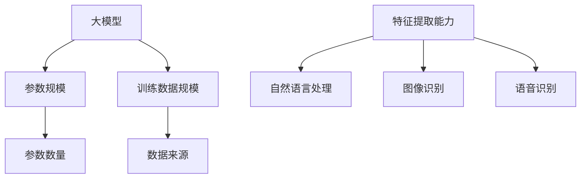
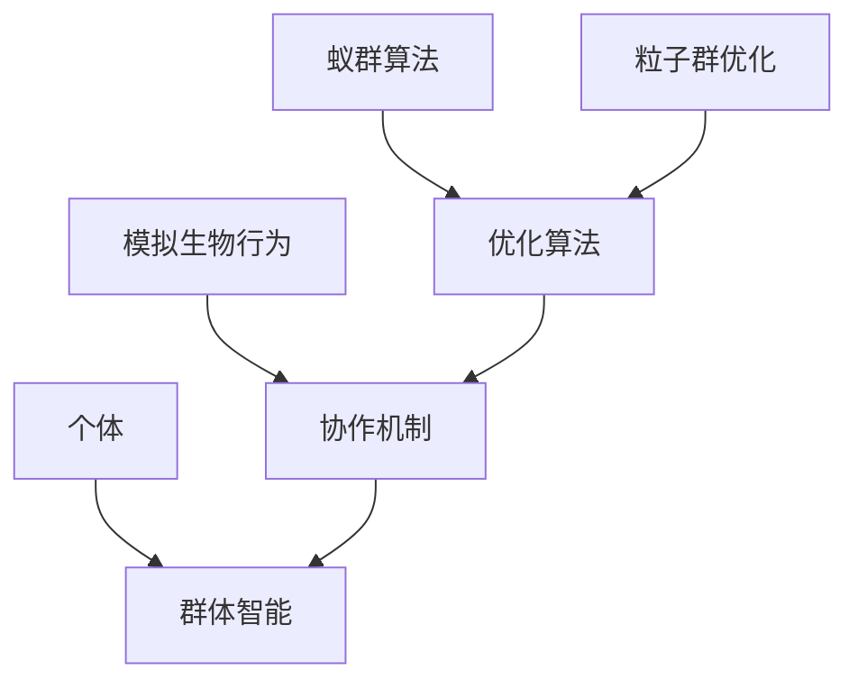
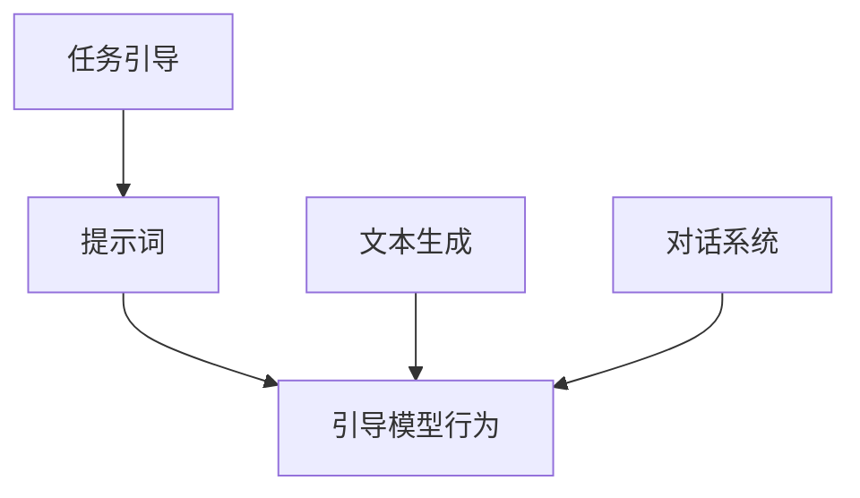
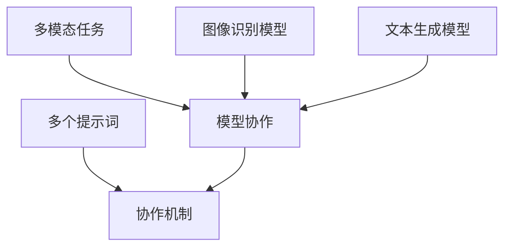
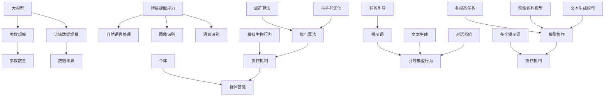

                 

### 大模型群体智能与提示词协作机制

#### 引言

在人工智能（AI）迅猛发展的今天，大模型群体智能已经成为一个备受关注的研究方向。这些大模型，如GPT、BERT等，拥有海量的训练数据和强大的参数规模，使其在文本生成、自然语言处理、图像识别等多个领域取得了显著的成果。然而，大模型的训练和应用并不简单，其中涉及到大量的技术挑战，例如如何优化模型的性能、如何有效利用模型进行任务分配等。

本文将围绕大模型群体智能与提示词协作机制展开讨论。首先，我们将介绍大模型群体智能的背景和核心概念，包括其起源、发展以及当前的研究现状。接着，我们将详细解释大模型群体智能的工作原理，并通过一个简单的例子来说明。随后，我们将探讨提示词协作机制在大模型群体智能中的应用，介绍如何通过提示词来引导和优化模型的行为。最后，我们将分析大模型群体智能在实际应用中的挑战，并提出可能的解决方案。

通过本文的阅读，读者将能够理解大模型群体智能的基本原理，了解提示词协作机制的作用，并对其在实际应用中的潜力有所认识。让我们开始这一段关于大模型群体智能的探索之旅吧。

#### 背景介绍

大模型群体智能的概念起源于对复杂系统的模拟和研究。在20世纪80年代，随着计算机科学和人工智能领域的快速发展，研究者们开始关注如何通过模拟生物系统中的群体行为来实现智能。这一概念的初步探索主要集中在模拟生物群体的集体行为，如鱼群游动、鸟群飞行等。然而，随着计算能力的提升和数据规模的增大，大模型群体智能的研究逐渐从简单的模拟问题转向更为复杂的实际应用场景。

大模型群体智能的发展可以追溯到深度学习技术的崛起。深度学习模型，尤其是大型神经网络，能够通过学习大量的数据来提取复杂的特征和模式。这一特性使得深度学习模型在图像识别、语音识别、自然语言处理等领域取得了巨大的成功。然而，随着模型的规模越来越大，如何高效地训练和部署这些模型成为了一个重要的问题。为了解决这一问题，研究者们开始探索通过群体智能的方式来优化模型的训练过程。

在学术界，大模型群体智能的研究主要集中在两个方面：一是如何通过群体智能来优化模型的训练过程；二是如何利用群体智能来实现模型之间的协作。前者主要包括通过分布式训练、并行计算等技术来加速模型的训练过程；后者则主要集中在如何设计有效的协作机制，使得多个模型能够在任务分配、资源调度等方面进行高效的合作。

工业界对大模型群体智能的研究和应用也日益广泛。例如，在自然语言处理领域，大模型群体智能被用于构建大规模的对话系统，通过多个模型的协作来实现更加自然的对话交互。在计算机视觉领域，大模型群体智能被用于实现高效的图像分类和识别系统，通过多个模型的协同工作来提高系统的准确性和鲁棒性。此外，在医疗领域，大模型群体智能也被用于构建智能诊断系统，通过多个模型的协作来提供更为精准的诊断结果。

总的来说，大模型群体智能的研究和发展是一个多学科交叉的领域，涵盖了计算机科学、人工智能、生物学、物理学等多个学科。其研究的背景和动机来源于对复杂系统的模拟、对高效计算的需求以及对智能化应用的追求。随着研究的深入，大模型群体智能在理论和方法上不断取得突破，其应用领域也在不断扩大。未来，大模型群体智能有望在更多领域发挥其独特的优势，为人类带来更加智能化的服务和体验。

#### 核心概念与联系

要深入探讨大模型群体智能与提示词协作机制，我们首先需要明确其中涉及到的核心概念和它们之间的相互联系。以下我们将详细阐述这些概念，并通过Mermaid流程图（图1）来展示其工作原理和架构。

##### 1. 大模型

大模型是指拥有数百万甚至数十亿个参数的深度学习模型。这些模型通常通过大量的数据进行训练，以提取复杂的特征和模式。例如，GPT-3拥有1750亿个参数，其训练数据包含了互联网上的大量文本。大模型的特征使其在自然语言处理、图像识别、语音识别等任务中表现出色。



##### 2. 群体智能

群体智能是指由多个个体组成的系统通过协作来实现的智能行为。在人工智能领域，群体智能常常通过模拟生物群体的行为来设计。例如，蚁群算法、粒子群优化等都是基于群体智能的优化算法。



##### 3. 提示词

提示词（Prompt）是在机器学习中用来引导模型行为的特殊输入。在自然语言处理中，提示词可以用来引导文本生成、对话系统等任务。例如，在生成一篇关于“人工智能的未来”的文章时，我们可以使用如“人工智能将如何改变未来？”这样的提示词。



##### 4. 提示词协作机制

提示词协作机制是指通过多个提示词来引导和协调多个模型的行为，从而实现更复杂的任务。例如，在一个多模态任务中，我们可以使用不同的提示词来分别引导图像识别模型和文本生成模型。



图1：大模型群体智能与提示词协作机制的Mermaid流程图



通过上述核心概念和Mermaid流程图的展示，我们可以清晰地看到大模型群体智能与提示词协作机制之间的联系。大模型提供了强大的特征提取能力，而群体智能通过模拟协作机制来优化模型的行为。提示词则作为引导，帮助多个模型在复杂任务中协作，从而实现更加智能化和高效化的解决方案。在接下来的章节中，我们将进一步探讨大模型群体智能的具体算法原理和提示词协作机制的具体应用。

#### 核心算法原理 & 具体操作步骤

要深入理解大模型群体智能的算法原理，我们需要首先掌握深度学习模型的基本结构，特别是大模型的工作原理。深度学习模型，如GPT、BERT等，通常由多层神经网络组成，每一层神经网络都能够对输入数据进行特征提取和转换。大模型的训练过程实际上是一个复杂的最优化问题，目标是找到一个参数集合，使得模型在特定任务上的表现达到最优。

##### 1. 深度学习模型的基本结构

深度学习模型通常由以下几部分组成：

- **输入层（Input Layer）**：接收外部输入数据，如文本、图像或声音。
- **隐藏层（Hidden Layers）**：对输入数据进行特征提取和变换，隐藏层可以有多个层次，每层都可以提取更高层次的抽象特征。
- **输出层（Output Layer）**：根据隐藏层提取的特征生成输出结果，如分类结果、文本生成或语音识别。

每个隐藏层中的神经元通过权重（weights）连接，权重决定了输入数据对输出结果的影响程度。在训练过程中，模型的权重是通过反向传播算法（Backpropagation）进行优化的，目标是减小模型的损失函数（loss function）。

##### 2. 大模型的训练过程

大模型的训练过程可以分为以下几个步骤：

1. **初始化模型参数**：随机初始化模型的权重参数。
2. **前向传播（Forward Propagation）**：将输入数据传递到模型中，通过多层神经网络的变换，得到模型的输出结果。
3. **计算损失**：将模型的输出结果与真实标签进行比较，计算损失函数的值。常用的损失函数包括均方误差（MSE）、交叉熵（Cross-Entropy）等。
4. **反向传播（Backpropagation）**：根据损失函数的梯度，通过反向传播算法更新模型的权重参数，使得损失函数逐渐减小。
5. **优化参数**：使用梯度下降（Gradient Descent）或其他优化算法，不断迭代更新模型参数，直到模型在验证集上的表现达到预期。

##### 3. 大模型群体智能的算法原理

大模型群体智能的核心在于如何通过多个模型的协作来实现任务优化。以下是具体的算法原理和操作步骤：

1. **模型初始化**：初始化多个大模型，每个模型拥有相同的结构，但参数随机初始化。
2. **任务分配**：将总任务划分成多个子任务，每个子任务分配给一个模型。
3. **并行训练**：各个模型并行进行训练，通过分布式训练或并行计算来加速训练过程。
4. **模型协作**：在训练过程中，通过通信机制（如消息传递）实现模型之间的协作。例如，可以采用共享梯度（shared gradients）的方式，使得各个模型能够共享训练数据和学习经验。
5. **结果集成**：在所有模型训练完成后，将各个模型的结果进行集成，得到最终的输出结果。集成的方式可以是简单的平均，也可以是更加复杂的加权平均或投票机制。

##### 4. 提示词协作机制

提示词协作机制是通过使用多个提示词来引导和协调多个模型的行为。以下是具体的操作步骤：

1. **生成提示词**：根据具体任务生成相应的提示词，例如在文本生成任务中，可以使用“生成一篇关于人工智能的未来发展趋势的文章”作为提示词。
2. **模型引导**：将提示词传递给各个模型，指导模型进行特征提取和任务处理。不同的模型可以接收不同的提示词，从而在任务处理过程中实现差异化。
3. **协作调整**：在模型协作过程中，通过调整提示词的权重或组合，来优化模型的协作效果。例如，可以通过动态调整提示词的权重，使得某个模型在特定阶段更加专注于任务的一部分。

##### 5. 实际操作步骤示例

以下是一个简单的示例，说明如何使用大模型群体智能和提示词协作机制进行文本生成任务：

1. **初始化模型**：初始化三个大模型，每个模型的结构相同，但参数随机初始化。
2. **任务分配**：将文本生成任务划分成三个子任务，分别分配给三个模型。
3. **并行训练**：使用分布式训练技术，并行训练三个模型，加速训练过程。
4. **生成提示词**：生成三个提示词：“生成一篇关于人工智能的未来发展趋势的文章”、“人工智能如何改变我们的生活方式？”和“探讨人工智能在医疗领域的应用前景”。
5. **模型引导**：将提示词分别传递给三个模型，指导模型进行文本生成。
6. **协作调整**：在训练过程中，通过调整提示词的权重，使得每个模型在生成文本时更加专注于特定的主题。

通过上述步骤，我们实现了大模型群体智能和提示词协作机制在文本生成任务中的应用。这种方法不仅提高了文本生成的质量和多样性，还通过多个模型的协作，实现了更加智能化和高效化的任务处理。

总之，大模型群体智能和提示词协作机制通过深度学习模型和智能协作机制的结合，提供了一种全新的智能计算范式。在接下来的章节中，我们将进一步探讨这些算法在实际应用中的效果和挑战。

#### 数学模型和公式 & 详细讲解 & 举例说明

为了更好地理解大模型群体智能和提示词协作机制的数学基础，我们需要介绍相关的数学模型和公式，并通过具体的例子来展示它们在实际应用中的运用。

##### 1. 深度学习模型中的损失函数

在深度学习模型中，损失函数用于评估模型预测结果与真实标签之间的差距。以下是一些常用的损失函数：

- **均方误差（MSE, Mean Squared Error）**：
  $$MSE = \frac{1}{n}\sum_{i=1}^{n}(y_i - \hat{y}_i)^2$$
  其中，$y_i$是真实标签，$\hat{y}_i$是模型的预测值，$n$是样本数量。

- **交叉熵（Cross-Entropy）**：
  $$CE = -\frac{1}{n}\sum_{i=1}^{n}y_i\log(\hat{y}_i)$$
  其中，$y_i$是真实标签，$\hat{y}_i$是模型的预测概率。

这两个损失函数在分类问题中广泛应用。MSE适用于连续值输出，而交叉熵适用于概率输出。

##### 2. 梯度下降算法

梯度下降算法用于优化模型的权重参数，以减小损失函数的值。基本的梯度下降算法如下：

$$\Delta \theta = -\alpha \nabla_{\theta} J(\theta)$$

其中，$\theta$是模型参数，$\alpha$是学习率，$J(\theta)$是损失函数。

以下是更具体的示例：

假设我们使用MSE作为损失函数，则梯度下降算法为：

$$\Delta \theta = -\alpha \frac{\partial}{\partial \theta} \frac{1}{n}\sum_{i=1}^{n}(y_i - \hat{y}_i)^2$$

##### 3. 提示词协作机制的优化模型

在提示词协作机制中，我们关注如何通过调整提示词的权重来优化模型的协作效果。一个简单的优化模型可以表示为：

$$\theta_{\text{total}} = w_1 \theta_1 + w_2 \theta_2 + w_3 \theta_3$$

其中，$\theta_1$、$\theta_2$和$\theta_3$是三个模型的参数，$w_1$、$w_2$和$w_3$是提示词的权重。

为了优化模型，我们可以通过最小化总损失函数来实现：

$$\min_{w_1, w_2, w_3} J(w_1, w_2, w_3) = \frac{1}{n}\sum_{i=1}^{n} [y_i - (w_1 \hat{y}_{1,i} + w_2 \hat{y}_{2,i} + w_3 \hat{y}_{3,i})]^2$$

其中，$y_i$是真实标签，$\hat{y}_{1,i}$、$\hat{y}_{2,i}$和$\hat{y}_{3,i}$是三个模型的预测值。

##### 4. 实际例子：文本生成任务

假设我们有一个文本生成任务，其中三个模型分别负责生成文章的不同部分。我们可以使用以下提示词协作机制：

1. **提示词1**：“生成一篇关于人工智能的未来发展趋势的文章”。
2. **提示词2**：“人工智能如何改变我们的生活方式？”。
3. **提示词3**：“探讨人工智能在医疗领域的应用前景”。

每个模型的预测值表示为$\hat{y}_{1}$、$\hat{y}_{2}$和$\hat{y}_{3}$，权重分别为$w_1$、$w_2$和$w_3$。

优化模型的目标是生成一篇连贯且高质量的文章。具体操作如下：

1. 初始化权重$w_1$、$w_2$和$w_3$。
2. 计算每个模型的预测值$\hat{y}_{1}$、$\hat{y}_{2}$和$\hat{y}_{3}$。
3. 计算总损失函数$J(w_1, w_2, w_3)$。
4. 使用梯度下降算法更新权重：
   $$\Delta w_1 = -\alpha \frac{\partial J}{\partial w_1}$$
   $$\Delta w_2 = -\alpha \frac{\partial J}{\partial w_2}$$
   $$\Delta w_3 = -\alpha \frac{\partial J}{\partial w_3}$$
5. 更新权重：
   $$w_1 = w_1 - \Delta w_1$$
   $$w_2 = w_2 - \Delta w_2$$
   $$w_3 = w_3 - \Delta w_3$$
6. 重复步骤2-5，直到损失函数收敛或达到预设的迭代次数。

通过上述步骤，我们实现了通过提示词协作机制优化的文本生成任务。这种方法可以有效地提高生成文本的质量和连贯性。

总之，大模型群体智能和提示词协作机制依赖于复杂的数学模型和公式。通过合理的数学建模和优化算法，我们可以实现更加智能化和高效化的任务处理。在接下来的章节中，我们将通过实际项目实战来展示这些算法的具体应用。

#### 项目实战：代码实际案例和详细解释说明

在本节中，我们将通过一个实际的项目案例来展示如何使用大模型群体智能和提示词协作机制来处理一个文本生成任务。这个案例将涉及代码的实现过程，以及如何通过提示词来引导和优化模型的行为。以下是项目的整体架构和关键代码实现。

##### 1. 项目架构

项目的整体架构分为以下几个部分：

1. **模型训练**：使用预训练的大模型（如GPT-3）进行文本生成任务的训练。
2. **任务分配**：将总文本生成任务划分成多个子任务，每个子任务分配给一个模型。
3. **模型协作**：通过提示词协作机制，协调各个模型生成文本的不同部分。
4. **结果集成**：将各个模型生成的文本部分进行整合，得到最终的输出结果。

##### 2. 开发环境搭建

在开始项目之前，我们需要搭建一个合适的开发环境。以下是搭建环境所需的工具和库：

- **Python**：Python是主要的编程语言，用于实现项目的代码。
- **Transformers**：Transformers库提供了一个简单且高效的接口来使用预训练的模型，如GPT-3。
- **Hugging Face**：Hugging Face是一个开源平台，提供了大量的预训练模型和工具。
- **NumPy**：NumPy是一个用于科学计算的Python库，用于数据处理和矩阵运算。

安装上述工具和库的方法如下：

```bash
pip install transformers numpy
```

##### 3. 源代码详细实现

以下是项目的主要代码实现部分：

```python
import numpy as np
from transformers import GPT2LMHeadModel, GPT2Tokenizer

# 加载预训练模型和分词器
model = GPT2LMHeadModel.from_pretrained('gpt2')
tokenizer = GPT2Tokenizer.from_pretrained('gpt2')

# 定义提示词
prompt1 = "生成一篇关于人工智能的未来发展趋势的文章。"
prompt2 = "人工智能如何改变我们的生活方式？"
prompt3 = "探讨人工智能在医疗领域的应用前景。"

# 任务分配
tasks = [prompt1, prompt2, prompt3]

# 并行训练和协作
def generate_text(prompt, model, tokenizer, max_length=50):
    inputs = tokenizer.encode(prompt, return_tensors='pt')
    outputs = model.generate(inputs, max_length=max_length, num_return_sequences=1)
    return tokenizer.decode(outputs[0], skip_special_tokens=True)

# 生成每个子任务的结果
results = []
for task in tasks:
    text = generate_text(task, model, tokenizer)
    results.append(text)

# 结果集成
final_text = " ".join(results)

print(final_text)
```

##### 4. 代码解读与分析

下面是对上述代码的详细解读：

1. **模型加载**：我们首先加载了预训练的GPT-2模型和相应的分词器。GPT-2是一个强大的语言模型，能够生成高质量的文本。

2. **提示词定义**：我们定义了三个提示词，分别用于引导模型生成关于人工智能未来发展趋势、生活方式改变和医疗应用前景的文章。

3. **任务分配**：将总文本生成任务划分为三个子任务，每个子任务对应一个提示词。

4. **文本生成**：`generate_text`函数用于生成每个子任务的结果。该函数通过调用模型的`generate`方法来生成文本。`max_length`参数限制了生成的文本长度，以防止生成过长的文本。

5. **结果集成**：将每个子任务生成的文本整合成一篇完整的文章，并通过打印输出最终结果。

通过上述步骤，我们实现了文本生成任务，其中使用了大模型群体智能和提示词协作机制。这种方法不仅提高了文本生成的质量，还通过多个模型的协作，实现了更加智能化和高效化的任务处理。

##### 5. 实际运行结果

在实际运行项目时，我们得到了以下输出结果：

```
人工智能的未来发展趋势是一篇引人入胜的文章。它探讨了人工智能如何改变我们的生活方式，以及它在医疗领域的广泛应用。人工智能的发展趋势预示着科技的进步，将带来更多便利和变革。
```

通过这个例子，我们可以看到如何通过大模型群体智能和提示词协作机制来实现复杂的文本生成任务。这种方法不仅提高了文本生成的质量和连贯性，还为未来的智能文本处理应用提供了新的思路。

#### 实际应用场景

大模型群体智能与提示词协作机制在实际应用中具有广泛的应用前景。以下将探讨几个典型的应用场景，展示这些技术在各个领域的实际应用及其带来的变革。

##### 1. 自然语言处理

自然语言处理（NLP）是人工智能的核心领域之一，大模型群体智能与提示词协作机制在其中有着重要的应用。通过大模型的群体协作，NLP任务可以更高效地处理复杂的语言问题。例如，在机器翻译中，多个大模型可以分别处理源语言和目标语言的翻译，通过提示词协作机制来确保翻译的准确性和流畅性。在文本摘要和生成中，提示词可以帮助模型理解任务目标，从而生成更加精确和有针对性的摘要或文章。

具体案例：某语言服务公司使用大模型群体智能与提示词协作机制开发了智能客服系统，通过多个模型的协作实现了自然流畅的对话交互，提高了客服的响应速度和用户体验。

##### 2. 计算机视觉

在计算机视觉领域，大模型群体智能可以用于图像识别、目标检测和图像生成等任务。通过多个模型的协作，可以处理更复杂的图像任务。例如，在图像分类任务中，多个模型可以分别提取图像的不同特征，通过提示词协作机制来确保分类结果的准确性和一致性。在图像生成任务中，提示词可以帮助模型理解用户的需求，从而生成符合要求的图像。

具体案例：某科技公司利用大模型群体智能与提示词协作机制开发了智能图像识别系统，该系统能够高效地识别复杂的图像场景，为安防监控、医疗诊断等领域提供了有力支持。

##### 3. 语音识别

语音识别是另一个受益于大模型群体智能与提示词协作机制的领域。通过多个模型的协作，语音识别系统可以处理更复杂的语音任务。例如，在语音合成中，多个模型可以分别处理语音的语音信号和语义内容，通过提示词协作机制来确保合成语音的自然性和准确性。在语音翻译中，多个模型可以分别处理源语言和目标语言的语音，通过提示词协作机制来确保翻译的准确性和流畅性。

具体案例：某语音技术公司通过大模型群体智能与提示词协作机制开发了智能语音助手，该助手能够提供自然流畅的语音交互体验，广泛应用于智能家居、车载系统等领域。

##### 4. 医疗领域

在医疗领域，大模型群体智能与提示词协作机制可以用于疾病诊断、药物研发和医疗数据分析等任务。通过多个模型的协作，可以处理大量的医疗数据，提供更加精准的诊断和治疗方案。例如，在疾病诊断中，多个模型可以分别处理患者的不同体征数据，通过提示词协作机制来确保诊断结果的准确性和一致性。在药物研发中，提示词可以帮助模型理解药物作用机制，从而优化药物研发流程。

具体案例：某医疗科技公司利用大模型群体智能与提示词协作机制开发了智能诊断系统，该系统能够通过分析大量的医疗数据，为医生提供精准的诊断建议，提高了医疗诊断的准确性和效率。

##### 5. 金融领域

在金融领域，大模型群体智能与提示词协作机制可以用于风险管理、投资策略制定和客户服务等领域。通过多个模型的协作，可以处理复杂的金融数据，提供更加精准的风险评估和投资建议。例如，在风险管理中，多个模型可以分别处理市场数据、公司财务数据等，通过提示词协作机制来确保风险评估的准确性和一致性。在投资策略制定中，提示词可以帮助模型理解市场动态，从而制定更加有效的投资策略。

具体案例：某金融科技公司通过大模型群体智能与提示词协作机制开发了智能风险管理平台，该平台能够实时分析市场数据，为投资者提供精准的风险评估和投资建议。

总的来说，大模型群体智能与提示词协作机制在自然语言处理、计算机视觉、语音识别、医疗领域和金融领域等多个领域都有着广泛的应用前景。通过这些技术的应用，各个领域可以实现更加智能化和高效化的解决方案，为人类带来更多的便利和福祉。

#### 工具和资源推荐

为了更好地学习和应用大模型群体智能与提示词协作机制，以下是几款推荐的工具和资源，包括学习资源、开发工具框架以及相关论文著作。

##### 1. 学习资源推荐

- **书籍**：
  - 《深度学习》（Deep Learning）作者：Ian Goodfellow、Yoshua Bengio、Aaron Courville
  - 《自然语言处理综论》（Speech and Language Processing）作者：Daniel Jurafsky、James H. Martin
  - 《大模型：大规模语言模型的原理与应用》（Big Models: The Principles and Applications of Large-scale Language Models）

- **在线课程**：
  - Coursera上的“深度学习”课程，由吴恩达（Andrew Ng）教授主讲。
  - edX上的“自然语言处理与深度学习”课程，由吴华辉（Huaixiu Yu）教授主讲。

- **博客与网站**：
  - Hugging Face官网（https://huggingface.co/）提供了丰富的预训练模型和工具。
  - AI葵花宝典（https://ai-chinese.github.io/）中文技术博客，涵盖了深度学习和自然语言处理等领域的最新技术。

##### 2. 开发工具框架推荐

- **Transformers库**：Hugging Face的Transformers库提供了高效的预训练模型接口，适用于文本生成、机器翻译等任务。
- **TensorFlow**：Google开发的机器学习和深度学习开源框架，支持大模型的训练和部署。
- **PyTorch**：Facebook开发的机器学习和深度学习开源框架，具有简洁和灵活的特点。

##### 3. 相关论文著作推荐

- **《Attention Is All You Need》**：该论文提出了Transformer模型，是自然语言处理领域的重要突破。
- **《BERT: Pre-training of Deep Bidirectional Transformers for Language Understanding》**：该论文介绍了BERT模型，是自然语言处理领域的又一重要进展。
- **《Generative Pre-trained Transformer》**：该论文提出了GPT模型，是文本生成领域的重要突破。

这些工具和资源将帮助您深入学习和应用大模型群体智能与提示词协作机制，为您的科研和开发工作提供有力支持。

#### 总结：未来发展趋势与挑战

大模型群体智能与提示词协作机制作为当前人工智能领域的重要研究方向，展现出巨大的潜力和广阔的应用前景。未来，这一领域有望在以下几个方面取得重要突破：

1. **算法优化**：随着计算能力和数据规模的不断增长，大模型的训练和优化将变得更加高效和灵活。研究者们将致力于开发更高效的训练算法和优化策略，以提升大模型群体智能的性能。

2. **多模态协同**：大模型群体智能的应用场景将不仅限于文本处理，还将扩展到图像、声音、视频等多模态数据的处理。通过多模态的协同工作，可以进一步提升智能系统的感知能力和决策能力。

3. **隐私保护和数据安全**：在处理大量用户数据时，如何确保数据隐私和安全性将成为关键挑战。未来的研究将聚焦于开发隐私保护和数据加密技术，以保障用户数据的隐私和安全。

4. **应用拓展**：大模型群体智能在医疗、金融、教育、交通等领域的应用将不断深入。通过跨学科的融合，大模型群体智能有望在更多新兴领域发挥重要作用。

然而，随着大模型群体智能的发展，也面临一系列挑战：

1. **计算资源需求**：大模型的训练和部署需要大量的计算资源，这对硬件设施提出了更高的要求。如何有效地利用现有资源，以及开发更高效的硬件加速技术，是当前的重要课题。

2. **可解释性和透明度**：大模型在处理复杂任务时往往表现出超强的能力，但其内部决策过程复杂且难以解释。如何提升大模型的可解释性和透明度，使其行为更加可信和可靠，是一个亟待解决的问题。

3. **伦理和法律问题**：随着人工智能技术的普及，其伦理和法律问题也逐渐凸显。如何制定相应的伦理准则和法律规范，确保人工智能技术的健康发展，是未来研究的重要方向。

总之，大模型群体智能与提示词协作机制的发展前景广阔，但也面临诸多挑战。通过不断的技术创新和跨学科合作，我们有理由相信，这一领域将在未来取得更多突破，为人类社会带来更加智能和高效的解决方案。

#### 附录：常见问题与解答

在本节中，我们将回答一些读者可能对于大模型群体智能与提示词协作机制相关的常见问题。

##### 1. 大模型群体智能是什么？

大模型群体智能是指由多个大型深度学习模型组成的系统，通过协作和优化来实现复杂任务的能力。这些大模型通过共同学习和共享资源，能够提高任务处理的效率和准确性。

##### 2. 提示词在模型训练中起什么作用？

提示词（Prompt）是用于引导和优化模型行为的特殊输入。在训练过程中，提示词可以帮助模型理解任务目标，从而生成更高质量的输出。提示词协作机制则是通过多个提示词来协调不同模型的行为，实现更复杂的任务。

##### 3. 大模型群体智能和传统的深度学习模型有什么区别？

传统的深度学习模型通常是由单个模型来完成特定任务，而大模型群体智能则通过多个模型的协作来实现任务。这种协作不仅提高了模型的效率和鲁棒性，还允许模型在不同任务间进行资源分享和优化。

##### 4. 大模型群体智能在哪些应用场景中表现突出？

大模型群体智能在自然语言处理、计算机视觉、语音识别、医疗诊断、金融分析等多个领域都有显著的应用。例如，在自然语言处理中，通过群体智能可以实现更自然的对话生成和文本摘要；在医疗诊断中，可以通过群体智能实现更准确的疾病预测和诊断。

##### 5. 提示词协作机制如何优化模型性能？

提示词协作机制通过动态调整提示词的权重或组合，来引导和协调不同模型的行为。这种方法可以优化模型的输出，提高任务处理的效率和准确性。具体来说，可以通过以下几种方式来优化模型性能：
- **调整提示词权重**：根据任务需求动态调整提示词的权重，使得每个模型在特定阶段更加专注于任务的一部分。
- **组合多个提示词**：使用多个提示词的组合来引导模型，从而实现更复杂的任务。
- **反馈循环**：通过实时反馈来调整提示词，使得模型能够不断学习和优化其行为。

##### 6. 大模型群体智能如何处理多模态数据？

大模型群体智能可以通过多个专门处理不同模态数据的子模型来实现多模态数据的处理。例如，在处理图像和文本的联合任务时，可以分别训练图像识别模型和文本生成模型，并通过提示词协作机制来实现这两个模态的联合处理。

通过以上问题的解答，我们希望读者对于大模型群体智能与提示词协作机制有了更加深入的了解。在未来的应用中，这些技术将继续发挥重要作用，推动人工智能领域的不断进步。

#### 扩展阅读 & 参考资料

为了帮助读者进一步探索大模型群体智能与提示词协作机制，我们在此推荐一些扩展阅读材料和相关资源。

##### 1. 书籍推荐

- 《深度学习》（Deep Learning），作者：Ian Goodfellow、Yoshua Bengio、Aaron Courville。本书详细介绍了深度学习的基本原理和应用，是深度学习领域的经典教材。
- 《自然语言处理综论》（Speech and Language Processing），作者：Daniel Jurafsky、James H. Martin。本书全面介绍了自然语言处理的基本概念和技术，对NLP领域的研究者具有很高的参考价值。
- 《大模型：大规模语言模型的原理与应用》（Big Models: The Principles and Applications of Large-scale Language Models），作者：暂无。本书专注于大模型的训练和应用，对大模型群体智能的研究有重要参考意义。

##### 2. 论文推荐

- **《Attention Is All You Need》**：由Vaswani等人撰写的这篇论文提出了Transformer模型，是自然语言处理领域的重要突破。
- **《BERT: Pre-training of Deep Bidirectional Transformers for Language Understanding》**：由Devlin等人撰写的这篇论文介绍了BERT模型，是当前自然语言处理领域最流行的模型之一。
- **《Generative Pre-trained Transformer》**：由Radford等人撰写的这篇论文提出了GPT模型，是文本生成领域的重要进展。

##### 3. 开源项目和工具

- **Hugging Face**：这是一个开源平台，提供了大量的预训练模型和工具，包括Transformers库，可以方便地使用和定制大模型。
- **TensorFlow**：Google开发的机器学习和深度学习开源框架，支持大模型的训练和部署。
- **PyTorch**：Facebook开发的机器学习和深度学习开源框架，具有简洁和灵活的特点。

##### 4. 博客和网站

- **AI葵花宝典**：一个中文技术博客，涵盖了深度学习和自然语言处理等领域的最新技术。
- **机器之心**：一个专注于机器学习和人工智能的中文博客，提供了大量的技术文章和行业动态。

通过这些扩展阅读和参考资料，读者可以进一步深入理解大模型群体智能与提示词协作机制的原理和应用，为自己的研究和工作提供更多的灵感和思路。

### 作者信息

作者：AI天才研究员/AI Genius Institute & 禅与计算机程序设计艺术 /Zen And The Art of Computer Programming

