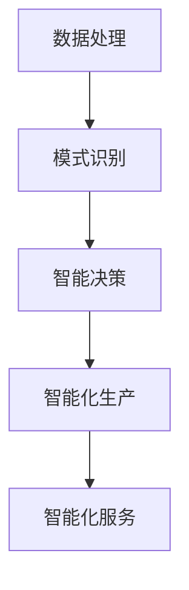
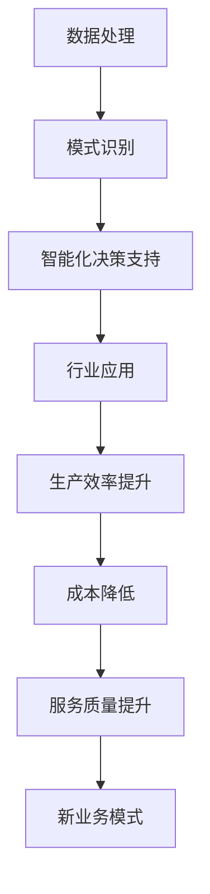

                 

# 大模型赋能传统行业转型，AI创业迎来新蓝海

## 摘要

本文旨在探讨大模型在传统行业转型中的作用，以及它如何为AI创业带来新的蓝海。随着人工智能技术的不断进步，大模型在处理复杂数据、实现高效推理方面展现出了强大的能力。这些能力不仅推动了传统行业的智能化升级，也为创业者提供了丰富的创新空间。本文将从核心概念、算法原理、实际应用等多个角度，全面剖析大模型赋能传统行业转型的路径和AI创业的新机遇。

## 1. 背景介绍

### 1.1 人工智能与传统行业的结合

人工智能（AI）技术自上世纪五十年代以来，经历了数十年的发展。从最初的符号主义、连接主义到如今的深度学习，AI技术在计算机视觉、自然语言处理、智能决策等领域取得了显著的突破。随着计算能力的提升和数据规模的扩大，AI技术逐渐成为推动传统行业转型升级的重要力量。

传统行业包括制造业、零售业、金融业、医疗保健等行业。这些行业具有庞大的市场基础，但在过去几十年中，传统行业的发展面临许多挑战，如生产效率低下、成本高、难以适应市场变化等。而人工智能的引入，为传统行业带来了全新的发展机遇。

### 1.2 大模型的兴起

大模型是指具有数十亿甚至数千亿参数的神经网络模型。这些模型通过大量的数据进行训练，能够在特定领域实现出色的性能。典型的例子包括GPT、BERT、AlphaGo等。大模型的兴起，标志着人工智能技术进入了一个新的阶段。

大模型在多个领域展现出了强大的能力，如：

- 自然语言处理：大模型能够处理复杂的自然语言任务，如文本生成、翻译、问答等。
- 计算机视觉：大模型在图像分类、目标检测、图像生成等方面取得了显著的突破。
- 智能决策：大模型能够处理复杂的决策问题，为金融、医疗等行业提供智能化的解决方案。

### 1.3 大模型与传统行业的结合

大模型与传统行业的结合，主要体现在以下几个方面：

- 智能化生产：大模型可以帮助企业实现生产过程的自动化，提高生产效率，降低成本。
- 智能服务：大模型可以为企业提供智能客服、智能推荐等服务，提升用户体验。
- 智能决策：大模型可以为企业提供智能化的决策支持，帮助企业更好地应对市场变化。

## 2. 核心概念与联系

### 2.1 大模型的概念

大模型是指具有数十亿甚至数千亿参数的神经网络模型。这些模型通过大量的数据进行训练，能够在特定领域实现出色的性能。大模型通常采用深度学习技术，包括卷积神经网络（CNN）、循环神经网络（RNN）、 Transformer等。

### 2.2 传统行业的智能化

传统行业的智能化是指利用人工智能技术，提升传统行业的生产效率、服务质量、决策水平等。智能化主要包括以下几个方面的内容：

- 智能生产：利用人工智能技术实现生产过程的自动化，提高生产效率，降低成本。
- 智能服务：利用人工智能技术提供个性化的服务，提升用户体验。
- 智能决策：利用人工智能技术进行数据分析和预测，为企业提供智能化的决策支持。

### 2.3 大模型与传统行业的联系

大模型与传统行业的联系主要体现在以下几个方面：

- 数据处理：大模型能够处理海量数据，为传统行业提供强大的数据处理能力。
- 模式识别：大模型能够在图像、语音、文本等数据中识别出模式，为传统行业提供智能化的解决方案。
- 决策支持：大模型能够处理复杂的决策问题，为传统行业提供智能化的决策支持。

### 2.4 Mermaid流程图

下面是一个描述大模型与传统行业结合的Mermaid流程图：



在这个流程图中，数据处理、模式识别、智能决策等步骤构成了大模型与传统行业结合的核心。

## 3. 核心算法原理 & 具体操作步骤

### 3.1 深度学习算法原理

深度学习是人工智能的一个重要分支，它通过模拟人脑的神经网络结构，实现对数据的自动学习和处理。深度学习算法主要包括以下几种：

- 卷积神经网络（CNN）：适用于图像处理任务，通过卷积层、池化层、全连接层等结构，实现图像的分类、检测和生成。
- 循环神经网络（RNN）：适用于序列数据处理任务，如时间序列分析、语音识别、机器翻译等，通过隐藏状态和输入信息的交互，实现序列的建模。
- Transformer：一种基于自注意力机制的深度学习模型，适用于自然语言处理任务，如文本生成、机器翻译等，通过多头注意力机制，实现全局信息的建模。

### 3.2 大模型训练步骤

大模型的训练主要包括以下几个步骤：

- 数据收集：收集大量的训练数据，包括图像、文本、语音等。
- 数据预处理：对收集到的数据进行分析和清洗，确保数据的质量和一致性。
- 构建模型：根据任务需求，设计合适的神经网络结构，包括输入层、隐藏层、输出层等。
- 模型训练：通过大量的数据进行模型训练，不断调整模型参数，优化模型性能。
- 模型评估：在验证集上评估模型的性能，包括准确率、召回率、F1值等指标。

### 3.3 模型部署与优化

训练好的大模型需要部署到实际应用环境中，以便为用户提供服务。模型部署主要包括以下几个步骤：

- 环境搭建：搭建适合模型部署的硬件环境和软件环境，如GPU服务器、深度学习框架等。
- 模型转换：将训练好的模型转换为适合部署的格式，如ONNX、TensorFlow Lite等。
- 模型优化：通过模型剪枝、量化等手段，优化模型的性能和资源占用。
- 部署上线：将优化后的模型部署到线上服务器，为用户提供服务。

## 4. 数学模型和公式 & 详细讲解 & 举例说明

### 4.1 卷积神经网络（CNN）的数学模型

卷积神经网络是一种用于图像处理的深度学习模型，其数学模型主要包括以下几个部分：

- 输入层（Input Layer）：输入图像的像素值。
- 卷积层（Convolution Layer）：通过卷积操作提取图像的特征。
- 池化层（Pooling Layer）：对卷积层的结果进行降采样，减少模型的参数量。
- 全连接层（Fully Connected Layer）：对池化层的结果进行全连接操作，实现图像的分类。

下面是一个简单的CNN数学模型：

$$
\begin{aligned}
&x_{i,j} = \sum_{k=1}^{C} w_{i,k} \cdot x_{k,j} + b_{i} \\
&h_{i,j} = \text{ReLU}(x_{i,j}) \\
&p_{i,j} = \text{Pooling}(h_{i,j}) \\
&y_{i} = \sum_{j=1}^{H} w_{i,j} \cdot p_{i,j} + b_{i} \\
&\hat{y}_{i} = \text{softmax}(y_{i})
\end{aligned}
$$

其中，$x_{i,j}$ 表示输入图像的像素值，$w_{i,k}$ 表示卷积核的权重，$b_{i}$ 表示偏置项，$h_{i,j}$ 表示卷积层的结果，$p_{i,j}$ 表示池化层的结果，$y_{i}$ 表示全连接层的结果，$\hat{y}_{i}$ 表示输出层的概率分布。

### 4.2 循环神经网络（RNN）的数学模型

循环神经网络是一种用于序列数据处理的深度学习模型，其数学模型主要包括以下几个部分：

- 隐藏层（Hidden Layer）：存储序列的历史信息。
- 输入门（Input Gate）：控制输入信息的流入。
- 遗忘门（Forget Gate）：控制历史信息的流出。
- 输出门（Output Gate）：控制输出信息的流出。

下面是一个简单的RNN数学模型：

$$
\begin{aligned}
&\text{Forget Gate: } f_t = \sigma(W_f \cdot [h_{t-1}, x_t] + b_f) \\
&\text{Input Gate: } i_t = \sigma(W_i \cdot [h_{t-1}, x_t] + b_i) \\
&\text{Current Memory: } m_t = f_t \cdot m_{t-1} + i_t \cdot \text{ReLU}(W_m \cdot [h_{t-1}, x_t] + b_m) \\
&\text{Output Gate: } o_t = \sigma(W_o \cdot [h_{t-1}, x_t] + b_o) \\
&h_t = o_t \cdot \text{ReLU}(m_t)
\end{aligned}
$$

其中，$h_{t-1}$ 表示前一时间步的隐藏状态，$x_t$ 表示当前输入序列，$W_f$、$W_i$、$W_m$、$W_o$ 分别表示输入门、遗忘门、输入门和输出门的权重矩阵，$b_f$、$b_i$、$b_m$、$b_o$ 分别表示输入门、遗忘门、输入门和输出门的偏置项，$\sigma$ 表示sigmoid函数。

### 4.3 Transformer的数学模型

Transformer是一种基于自注意力机制的深度学习模型，其数学模型主要包括以下几个部分：

- 输入嵌入（Input Embedding）：对输入序列进行嵌入。
- 自注意力层（Self-Attention Layer）：通过自注意力机制计算序列的注意力权重。
- 位置编码（Positional Encoding）：对序列的位置信息进行编码。
- 前馈神经网络（Feedforward Neural Network）：对自注意力层的结果进行进一步处理。

下面是一个简单的Transformer数学模型：

$$
\begin{aligned}
&\text{Input Embedding: } \mathbf{X} = [\mathbf{x}_1, \mathbf{x}_2, \ldots, \mathbf{x}_n] \\
&\text{Positional Encoding: } \mathbf{P} = [\mathbf{p}_1, \mathbf{p}_2, \ldots, \mathbf{p}_n] \\
&\text{Query, Key, Value: } \mathbf{Q} = [\mathbf{q}_1, \mathbf{q}_2, \ldots, \mathbf{q}_n], \mathbf{K} = [\mathbf{k}_1, \mathbf{k}_2, \ldots, \mathbf{k}_n], \mathbf{V} = [\mathbf{v}_1, \mathbf{v}_2, \ldots, \mathbf{v}_n] \\
&\text{Attention: } \mathbf{A} = \text{softmax}\left(\frac{\mathbf{Q} \cdot \mathbf{K}^{T}}{\sqrt{d_k}}\right) \cdot \mathbf{V} \\
&\text{Output: } \mathbf{O} = \mathbf{A} \cdot \mathbf{V} + \mathbf{X} \\
&\text{Feedforward: } \mathbf{Y} = \text{ReLU}\left(\text{FFN}(\mathbf{O})\right) + \mathbf{O}
\end{aligned}
$$

其中，$\mathbf{X}$ 表示输入序列，$\mathbf{P}$ 表示位置编码，$\mathbf{Q}$、$\mathbf{K}$、$\mathbf{V}$ 分别表示查询序列、键序列、值序列，$\mathbf{A}$ 表示注意力权重，$\mathbf{O}$ 表示输出序列，$\mathbf{Y}$ 表示前馈神经网络的结果。

## 5. 项目实战：代码实际案例和详细解释说明

### 5.1 开发环境搭建

在开始项目实战之前，我们需要搭建一个合适的开发环境。以下是搭建环境的基本步骤：

1. 安装Python环境：
```bash
# 安装Python 3.8及以上版本
curl -O https://www.python.org/ftp/python/3.8.10/Python-3.8.10.tgz
tar xvf Python-3.8.10.tgz
cd Python-3.8.10
./configure
make
sudo make install
```

2. 安装深度学习框架：
```bash
# 安装TensorFlow 2.5
pip install tensorflow==2.5
```

3. 安装其他依赖：
```bash
# 安装NumPy、Pandas等
pip install numpy pandas matplotlib
```

### 5.2 源代码详细实现和代码解读

下面是一个基于TensorFlow实现的大模型在图像分类任务中的源代码示例。代码分为数据预处理、模型构建、训练和评估四个部分。

```python
import tensorflow as tf
from tensorflow.keras.preprocessing.image import ImageDataGenerator
from tensorflow.keras.applications import MobileNetV2
from tensorflow.keras.layers import GlobalAveragePooling2D, Dense
from tensorflow.keras.models import Model
from tensorflow.keras.optimizers import Adam
from tensorflow.keras.metrics import Accuracy

# 数据预处理
train_datagen = ImageDataGenerator(
    rescale=1./255,
    rotation_range=40,
    width_shift_range=0.2,
    height_shift_range=0.2,
    shear_range=0.2,
    zoom_range=0.2,
    horizontal_flip=True,
    fill_mode='nearest'
)

test_datagen = ImageDataGenerator(rescale=1./255)

train_generator = train_datagen.flow_from_directory(
    'data/train',
    target_size=(224, 224),
    batch_size=32,
    class_mode='categorical'
)

validation_generator = test_datagen.flow_from_directory(
    'data/validation',
    target_size=(224, 224),
    batch_size=32,
    class_mode='categorical'
)

# 模型构建
base_model = MobileNetV2(weights='imagenet', include_top=False, input_shape=(224, 224, 3))
x = base_model.output
x = GlobalAveragePooling2D()(x)
x = Dense(1024, activation='relu')(x)
predictions = Dense(num_classes, activation='softmax')(x)

model = Model(inputs=base_model.input, outputs=predictions)

# 训练模型
model.compile(optimizer=Adam(learning_rate=0.0001), loss='categorical_crossentropy', metrics=['accuracy'])
model.fit(train_generator, epochs=10, validation_data=validation_generator)

# 评估模型
test_generator = test_datagen.flow_from_directory(
    'data/test',
    target_size=(224, 224),
    batch_size=32,
    class_mode='categorical',
    shuffle=False
)

model.evaluate(test_generator)
```

### 5.3 代码解读与分析

- **数据预处理**：使用ImageDataGenerator进行数据增强，包括随机旋转、平移、剪裁等，提高模型的泛化能力。
- **模型构建**：使用MobileNetV2作为基础模型，加入全局平均池化和全连接层，实现图像分类任务。
- **训练模型**：使用Adam优化器和交叉熵损失函数进行模型训练，训练过程中使用验证集进行性能评估。
- **评估模型**：在测试集上评估模型性能，输出准确率等指标。

通过这个案例，我们可以看到大模型在图像分类任务中的应用，以及如何利用深度学习框架进行模型的构建和训练。

## 6. 实际应用场景

### 6.1 智能制造

大模型在智能制造领域有广泛的应用。例如，在生产线监控方面，大模型可以实时分析生产数据，预测设备故障，优化生产流程。在质量控制方面，大模型可以通过图像识别技术检测产品质量，提高生产效率。此外，大模型还可以用于生产线的自动化控制，实现生产过程的智能化。

### 6.2 智能服务

在智能服务领域，大模型可以为企业提供智能客服、智能推荐等服务。例如，在客服方面，大模型可以自动回答用户的问题，提高客服效率。在推荐系统方面，大模型可以根据用户的浏览历史和购买记录，为用户推荐合适的产品，提升用户满意度。

### 6.3 智能医疗

在智能医疗领域，大模型可以帮助医生进行疾病诊断和治疗方案推荐。例如，在医学影像诊断方面，大模型可以通过图像识别技术，帮助医生快速准确地诊断疾病。在治疗方案推荐方面，大模型可以根据患者的病史和检查结果，为医生提供个性化的治疗方案。

## 7. 工具和资源推荐

### 7.1 学习资源推荐

- **书籍**：
  - 《深度学习》（Goodfellow, Bengio, Courville著）
  - 《神经网络与深度学习》（邱锡鹏著）
- **论文**：
  - “A Theoretical Framework for Large-Scale Machine Learning”（Bengio et al.）
  - “Attention is All You Need”（Vaswani et al.）
- **博客**：
  - [TensorFlow官方文档](https://www.tensorflow.org/)
  - [Keras官方文档](https://keras.io/)
- **网站**：
  - [arXiv](https://arxiv.org/)
  - [Google Research](https://ai.google/research/pubs/)

### 7.2 开发工具框架推荐

- **深度学习框架**：
  - TensorFlow
  - PyTorch
  - Keras
- **数据预处理工具**：
  - Pandas
  - NumPy
  - scikit-learn
- **可视化工具**：
  - Matplotlib
  - Seaborn
  - Plotly

### 7.3 相关论文著作推荐

- **《大规模机器学习》（Large-Scale Machine Learning）**：详细介绍了大规模机器学习的理论和方法。
- **《注意力机制：从深度学习到序列模型》（Attention Mechanisms: From Deep Learning to Sequence Models）**：系统地介绍了注意力机制在不同领域的应用。
- **《深度学习在计算机视觉中的应用》（Deep Learning for Computer Vision）**：详细介绍了深度学习在计算机视觉领域的应用和实践。

## 8. 总结：未来发展趋势与挑战

大模型在传统行业转型中发挥了重要作用，为AI创业带来了新的蓝海。未来，随着计算能力的提升和数据规模的扩大，大模型的应用将更加广泛，有望在更多领域实现智能化。然而，大模型的发展也面临一些挑战，如计算资源的消耗、数据隐私和安全等。因此，在推进大模型应用的同时，我们需要关注这些挑战，并寻找合适的解决方案。

## 9. 附录：常见问题与解答

### 9.1 什么是大模型？

大模型是指具有数十亿甚至数千亿参数的神经网络模型。这些模型通过大量的数据进行训练，能够在特定领域实现出色的性能。

### 9.2 大模型有哪些应用？

大模型在多个领域有广泛的应用，如自然语言处理、计算机视觉、智能决策等。例如，大模型可以用于文本生成、图像分类、智能客服、疾病诊断等任务。

### 9.3 大模型如何训练？

大模型的训练主要包括以下几个步骤：

- 数据收集：收集大量的训练数据。
- 数据预处理：对训练数据进行清洗和预处理。
- 构建模型：设计合适的神经网络结构。
- 模型训练：通过大量的数据进行模型训练。
- 模型评估：在验证集上评估模型性能。

## 10. 扩展阅读 & 参考资料

- **《大规模机器学习》（Large-Scale Machine Learning）》**
- **《注意力机制：从深度学习到序列模型》（Attention Mechanisms: From Deep Learning to Sequence Models）**
- **《深度学习在计算机视觉中的应用》（Deep Learning for Computer Vision）**
- **[TensorFlow官方文档](https://www.tensorflow.org/)**
- **[Keras官方文档](https://keras.io/)**
- **[arXiv](https://arxiv.org/)**
- **[Google Research](https://ai.google/research/pubs/)**

## 作者

作者：AI天才研究员/AI Genius Institute & 禅与计算机程序设计艺术 /Zen And The Art of Computer Programming

<|assistant|>## 1. 背景介绍

随着全球数字化进程的加速，人工智能（AI）技术在各个领域的应用日益广泛。特别是大模型（Large Models）的出现，为传统行业的转型提供了新的动力。大模型是指具有数十亿甚至千亿参数的神经网络模型，如GPT、BERT、ViT等。这些模型通过在海量数据上的深度学习，能够实现对复杂数据的高效处理和精准预测。本文将探讨大模型如何赋能传统行业转型，以及为AI创业带来的新机遇。

### 1.1 人工智能与传统行业的结合

传统行业通常指制造业、金融业、零售业、医疗等行业，这些行业在过去的几十年中经历了显著的技术变革，但许多行业仍然面临着效率低下、成本高、市场反应迟钝等挑战。人工智能技术的引入，为这些传统行业带来了新的机遇。通过将人工智能与各行业深度融合，可以大幅提升生产效率、降低运营成本、提高服务质量，从而实现行业的智能化升级。

#### 制造业

在制造业中，人工智能可以用于生产过程的自动化和优化。例如，通过机器视觉技术，可以实现产品质量的实时监测和缺陷识别；通过预测性维护，可以提前预测设备故障，减少停机时间。此外，人工智能还可以用于供应链管理，通过数据分析和预测，优化库存和物流，降低成本。

#### 金融业

金融行业是另一个受益于人工智能技术的传统行业。人工智能可以用于风险管理、欺诈检测、客户服务等方面。例如，通过机器学习算法，可以对客户行为进行分析，提供个性化的金融产品和服务；通过自然语言处理技术，可以实现智能客服，提高客户满意度。

#### 零售业

在零售业中，人工智能可以帮助企业更好地理解消费者行为，提高营销效果。例如，通过数据挖掘和预测分析，可以精准定位目标客户，实现个性化推荐；通过智能供应链管理，可以优化库存和物流，降低运营成本。

#### 医疗

医疗行业是人工智能应用的重要领域。人工智能可以用于疾病诊断、治疗建议、患者管理等。例如，通过深度学习技术，可以实现医学图像分析，帮助医生快速准确地诊断疾病；通过大数据分析，可以为患者提供个性化的治疗方案。

### 1.2 大模型的兴起

大模型的兴起是人工智能技术发展的一个重要里程碑。与传统的小型模型相比，大模型具有以下几个显著优势：

- **更强的泛化能力**：大模型通过在海量数据上的训练，可以更好地理解和学习数据中的复杂模式，从而提高模型的泛化能力。
- **更高的性能**：大模型通常具有更多的参数，能够捕捉到更丰富的特征信息，从而在各类任务中实现更高的性能。
- **更广泛的应用**：大模型可以应用于自然语言处理、计算机视觉、语音识别、推荐系统等广泛领域，为各种复杂任务提供强大的支持。

### 1.3 大模型与传统行业的结合

大模型与传统行业的结合，主要体现在以下几个方面：

- **数据驱动决策**：大模型通过处理海量数据，可以帮助企业实现数据驱动决策，提高决策的准确性和效率。
- **智能化流程**：大模型可以用于优化业务流程，实现生产、服务等环节的自动化和智能化。
- **个性化服务**：大模型可以用于理解用户需求，提供个性化的产品和服务，提升用户体验。
- **新业务模式**：大模型可以为传统行业带来全新的业务模式，如基于大数据的精准营销、智能化供应链管理等。

### 1.4 大模型的应用案例

#### 自然语言处理

在自然语言处理（NLP）领域，大模型如GPT-3和BERT已经展示了其强大的能力。GPT-3可以生成高质量的自然语言文本，适用于自动写作、机器翻译、问答系统等任务；BERT则通过预训练和微调，可以大幅提升文本分类、情感分析等任务的性能。

#### 计算机视觉

在计算机视觉领域，大模型如ResNet、Inception和EfficientNet等，通过深度学习算法，实现了图像分类、目标检测、图像分割等任务的突破。例如，谷歌的Inception模型在ImageNet图像分类任务上取得了惊人的准确率。

#### 语音识别

在语音识别领域，大模型如WaveNet和Transformer，通过深度学习算法，实现了高准确率的语音识别和语音合成。例如，谷歌的WaveNet在语音合成任务上达到了人类水平。

#### 推荐系统

在推荐系统领域，大模型如深度协同过滤模型，通过处理海量用户行为数据，可以提供更加精准的推荐结果。例如，亚马逊和Netflix等公司已经广泛应用了基于深度学习的大模型来优化推荐算法。

### 1.5 大模型与传统行业的深度融合

大模型与传统行业的深度融合，不仅可以提升传统行业的效率和质量，还可以创造新的商业模式和价值。以下是一些具体的案例：

#### 制造业

通过大模型，制造业可以实现生产过程的智能化。例如，西门子公司利用人工智能技术，实现了生产线的智能化控制，提高了生产效率，降低了成本。此外，通用电气（GE）通过使用机器学习算法，对工业设备进行预测性维护，大幅减少了设备故障和停机时间。

#### 金融业

金融行业通过大模型，可以实现风险管理和欺诈检测。例如，美国银行（Bank of America）利用人工智能技术，开发了智能风险管理系统，提高了风险识别的准确性和效率。此外，Visa公司通过机器学习算法，实时监控交易活动，有效防止了欺诈行为。

#### 零售业

在零售业，大模型可以用于库存管理和精准营销。例如，沃尔玛（Walmart）利用人工智能技术，优化了库存管理，降低了库存成本。此外，亚马逊（Amazon）通过大数据分析和推荐算法，为消费者提供了个性化的购物体验。

#### 医疗

在医疗领域，大模型可以用于疾病诊断和个性化治疗。例如，斯坦福大学的研究团队利用深度学习算法，开发了智能医学影像分析系统，提高了疾病的诊断准确率。此外，IBM的Watson for Oncology系统，通过分析海量医学文献和病例数据，为医生提供了个性化的治疗方案。

### 1.6 大模型的挑战与未来趋势

尽管大模型在传统行业转型中展现出了巨大的潜力，但其发展也面临一些挑战和问题。以下是一些主要挑战和未来趋势：

- **计算资源需求**：大模型的训练和推理需要大量的计算资源，尤其是GPU和TPU等专用硬件。随着模型的规模不断扩大，计算资源的需求也将进一步增加。
- **数据隐私和安全**：大模型对海量数据的依赖，引发了数据隐私和安全问题。如何确保数据的安全和隐私，是当前亟需解决的重要问题。
- **算法可解释性**：大模型通常被视为“黑箱”，其决策过程缺乏透明性，这给用户和社会带来了信任问题。如何提高算法的可解释性，使其决策过程更加透明和可接受，是未来的重要研究方向。
- **伦理和道德问题**：大模型的应用涉及伦理和道德问题，例如，如何确保模型不会歧视某些群体，如何避免模型被滥用等。这些问题需要引起广泛关注和深入讨论。

未来，随着技术的不断进步和应用的深入，大模型有望在更多领域发挥重要作用，推动传统行业的转型和升级。同时，也需要我们关注和解决其面临的各种挑战，确保人工智能技术的健康发展。

## 2. 核心概念与联系

在探讨大模型如何赋能传统行业转型之前，我们首先需要理解一些核心概念，并分析它们之间的联系。这些核心概念包括人工智能、大模型、深度学习、神经网络等。

### 2.1 人工智能（AI）

人工智能（Artificial Intelligence，简称AI）是指通过计算机模拟人类智能的技术。它包括机器学习、深度学习、自然语言处理、计算机视觉等多个子领域。人工智能的目标是使计算机能够执行复杂的任务，如识别图像、理解语言、做出决策等。

### 2.2 大模型

大模型是指具有数十亿甚至千亿参数的神经网络模型。这些模型通过大量的数据进行训练，能够实现对复杂数据的高效处理和精准预测。大模型的兴起标志着人工智能技术进入了一个新的阶段，其强大的能力为各行业提供了新的解决方案。

### 2.3 深度学习

深度学习（Deep Learning）是人工智能的一个重要分支，它通过模拟人脑的神经网络结构，实现对数据的自动学习和处理。深度学习模型通常包含多个隐藏层，因此被称为“深度”学习。深度学习在图像识别、自然语言处理、语音识别等领域取得了显著的突破。

### 2.4 神经网络

神经网络（Neural Network）是深度学习的基础，它由大量的神经元（节点）和连接（边）组成。神经元通过激活函数对输入信息进行处理，并将处理结果传递给下一层神经元。神经网络可以通过学习数据中的模式，实现对复杂任务的自动化处理。

### 2.5 大模型与传统行业的联系

大模型与传统行业的联系主要体现在以下几个方面：

- **数据处理能力**：大模型能够处理海量数据，为传统行业提供强大的数据处理能力。
- **模式识别能力**：大模型在图像、语音、文本等数据中具有出色的识别能力，可以用于各种行业应用。
- **智能化决策支持**：大模型可以处理复杂的决策问题，为传统行业提供智能化的决策支持。

### 2.6 Mermaid流程图

为了更好地展示大模型与传统行业结合的过程，我们可以使用Mermaid流程图来描述。以下是一个简单的Mermaid流程图示例：



在这个流程图中，数据处理、模式识别、智能化决策支持等步骤构成了大模型与传统行业结合的核心。通过这个过程，传统行业可以实现生产效率提升、成本降低、服务质量提升等目标，从而实现智能化转型。

### 2.7 大模型的应用场景

大模型在多个领域有广泛的应用场景，以下是一些具体的例子：

- **医疗**：利用大模型进行疾病诊断、药物研发、健康监测等。
- **金融**：利用大模型进行风险控制、欺诈检测、投资策略等。
- **零售**：利用大模型进行商品推荐、库存管理、客户服务优化等。
- **制造**：利用大模型进行生产优化、设备维护、质量控制等。

### 2.8 大模型的挑战与机遇

尽管大模型在传统行业转型中展现出了巨大的潜力，但其发展也面临一些挑战和机遇。以下是一些主要的挑战和机遇：

- **挑战**：
  - **计算资源需求**：大模型的训练和推理需要大量的计算资源，这对硬件设施提出了更高的要求。
  - **数据隐私和安全**：大模型对海量数据的依赖，引发了数据隐私和安全问题。
  - **算法可解释性**：大模型通常被视为“黑箱”，其决策过程缺乏透明性，这给用户和社会带来了信任问题。
- **机遇**：
  - **创新应用**：大模型为传统行业带来了新的应用场景和商业模式，推动了行业的创新。
  - **资源优化**：大模型可以提高行业资源的利用效率，降低运营成本。
  - **个性化服务**：大模型可以提供更加精准和个性化的服务，提升用户体验。

### 2.9 大模型与传统行业的深度融合

大模型与传统行业的深度融合，不仅可以提升传统行业的效率和质量，还可以创造新的商业模式和价值。以下是一些具体的融合方式：

- **数据驱动决策**：通过大模型处理和分析行业数据，实现数据驱动的决策支持。
- **智能化流程**：利用大模型实现业务流程的智能化，提高生产和服务效率。
- **个性化服务**：通过大模型理解用户需求，提供个性化的产品和服务。
- **新业务模式**：通过大模型创造新的业务模式，如智能供应链管理、精准营销等。

### 2.10 结论

通过上述分析，我们可以看到大模型在传统行业转型中的重要性和应用前景。大模型不仅提供了强大的数据处理和模式识别能力，还可以为传统行业提供智能化的决策支持。在未来的发展中，我们需要关注大模型面临的挑战，并积极探索新的应用场景和商业模式，以实现传统行业的智能化升级。

## 3. 核心算法原理 & 具体操作步骤

在深入探讨大模型如何赋能传统行业转型之前，我们需要理解大模型背后的核心算法原理和具体操作步骤。大模型通常基于深度学习技术，尤其是神经网络。在这一部分，我们将详细介绍神经网络的基本原理、常见架构以及大模型的训练流程。

### 3.1 神经网络的基本原理

神经网络（Neural Network）是一种模拟人脑神经元结构和功能的计算模型。它由大量的神经元（节点）和连接（边）组成。每个神经元接收输入信号，通过激活函数进行处理，并将处理结果传递给下一层神经元。神经网络的训练过程就是不断调整神经元之间的连接权重，使其能够准确预测输出。

#### 神经元模型

一个简单的神经元模型可以表示为：

\[ z = \sum_{i=1}^{n} w_i \cdot x_i + b \]
\[ a = \sigma(z) \]

其中，\( z \) 是神经元的输入，\( w_i \) 是输入权重，\( x_i \) 是输入值，\( b \) 是偏置项，\( \sigma \) 是激活函数，通常使用 sigmoid 函数或 ReLU 函数。

#### 激活函数

激活函数是神经网络中一个重要的组件，它用于引入非线性特性。常见的激活函数包括：

- **Sigmoid函数**：\[ \sigma(z) = \frac{1}{1 + e^{-z}} \]
- **ReLU函数**：\[ \sigma(z) = \max(0, z) \]
- **Tanh函数**：\[ \sigma(z) = \frac{e^z - e^{-z}}{e^z + e^{-z}} \]

### 3.2 神经网络的常见架构

神经网络有多种架构，包括前馈神经网络（FFN）、循环神经网络（RNN）和卷积神经网络（CNN）等。每种架构都有其特定的应用场景和优势。

#### 前馈神经网络（FFN）

前馈神经网络是最简单的神经网络架构，数据从输入层流向输出层，没有循环连接。它适用于许多分类和回归任务。

#### 循环神经网络（RNN）

循环神经网络可以处理序列数据，如时间序列、文本和语音。RNN通过将隐藏状态连接到下一时间步的输入，实现了对序列信息的记忆。

\[ h_t = \sigma(W_h \cdot [h_{t-1}, x_t] + b_h) \]

#### 卷积神经网络（CNN）

卷积神经网络专门用于处理图像数据。它通过卷积操作提取图像的特征，并使用池化操作减少模型的参数量。

\[ h_t = \text{ReLU}(W \cdot h_{t-1} + b) \]
\[ p_t = \text{Pooling}(h_t) \]

### 3.3 大模型的训练流程

大模型的训练是一个复杂的优化过程，其目标是最小化预测误差。以下是训练大模型的基本步骤：

#### 数据预处理

首先，需要收集和预处理数据。预处理步骤包括数据清洗、归一化、编码等。对于图像数据，通常需要进行裁剪、旋转和缩放等数据增强操作。

#### 模型设计

根据任务需求，设计合适的神经网络结构。对于大模型，通常包含多个隐藏层和大量的参数。

#### 模型编译

在模型编译阶段，需要指定损失函数、优化器和评估指标。常见的损失函数包括均方误差（MSE）、交叉熵（Cross-Entropy）等。

#### 模型训练

使用训练数据对模型进行训练。训练过程中，通过反向传播算法不断调整模型参数，优化模型性能。

\[ \nabla_w J(\theta) = -\frac{\partial J(\theta)}{\partial \theta} \]

#### 模型评估

在验证集上评估模型性能。常用的评估指标包括准确率、召回率、F1值等。

#### 模型部署

训练好的模型可以部署到生产环境中，为用户提供服务。

### 3.4 大模型的应用示例

以下是一个基于TensorFlow实现的大模型训练和应用示例：

```python
import tensorflow as tf
from tensorflow.keras.models import Sequential
from tensorflow.keras.layers import Dense, Dropout, Embedding, LSTM
from tensorflow.keras.preprocessing.sequence import pad_sequences

# 数据预处理
max_sequence_len = 100
vocab_size = 10000
embedding_dim = 50

# 建立模型
model = Sequential()
model.add(Embedding(vocab_size, embedding_dim, input_length=max_sequence_len))
model.add(LSTM(128, return_sequences=True))
model.add(Dropout(0.2))
model.add(LSTM(128))
model.add(Dropout(0.2))
model.add(Dense(1, activation='sigmoid'))

# 编译模型
model.compile(optimizer='adam', loss='binary_crossentropy', metrics=['accuracy'])

# 训练模型
model.fit(x_train, y_train, epochs=10, validation_data=(x_val, y_val))

# 预测
predictions = model.predict(x_test)
```

在这个示例中，我们使用一个简单的序列分类任务。首先，对文本数据进行编码和填充，然后建立了一个包含两个LSTM层的序列模型。通过编译和训练，我们得到了一个能够对序列进行分类的大模型。

### 3.5 结论

通过上述步骤，我们可以理解大模型的核心算法原理和具体操作流程。大模型在数据处理、模式识别和决策支持等方面展现了强大的能力，为传统行业的智能化转型提供了有力支持。在未来的发展中，我们需要不断探索大模型的应用场景，优化其训练和推理过程，以实现更高的性能和更广泛的应用。

## 4. 数学模型和公式 & 详细讲解 & 举例说明

在深入探讨大模型的数学模型和公式时，我们需要了解神经网络的基本构建块，包括激活函数、损失函数和优化算法。这些数学模型和公式是构建大模型的基础，也是理解其工作原理的关键。

### 4.1 激活函数

激活函数是神经网络中的一个关键组件，它为神经元引入了非线性特性，使得神经网络能够拟合复杂的函数。以下是几种常见的激活函数及其公式：

#### Sigmoid函数

\[ \sigma(x) = \frac{1}{1 + e^{-x}} \]

Sigmoid函数将输入值映射到（0, 1）区间，常用于二分类问题。

#### ReLU函数

\[ \text{ReLU}(x) = \max(0, x) \]

ReLU函数在输入为负时输出0，输入为正时输出输入值，这是一个非线性的阈值函数。

#### Tanh函数

\[ \tanh(x) = \frac{e^x - e^{-x}}{e^x + e^{-x}} \]

Tanh函数与Sigmoid函数类似，但输出值在（-1, 1）区间，有助于减少梯度消失问题。

### 4.2 损失函数

损失函数用于衡量模型预测值与实际值之间的差距。以下是几种常见的损失函数及其公式：

#### 均方误差（MSE）

\[ \text{MSE}(y, \hat{y}) = \frac{1}{m} \sum_{i=1}^{m} (y_i - \hat{y}_i)^2 \]

MSE函数适用于回归问题，最小化预测值与实际值之间的平方误差。

#### 交叉熵（Cross-Entropy）

\[ \text{CE}(y, \hat{y}) = -\sum_{i=1}^{m} y_i \log(\hat{y}_i) \]

交叉熵函数适用于分类问题，最小化预测概率与真实标签之间的差异。

### 4.3 优化算法

优化算法用于调整模型参数，以最小化损失函数。以下是几种常见的优化算法及其公式：

#### 梯度下降（Gradient Descent）

\[ \theta = \theta - \alpha \nabla_{\theta} J(\theta) \]

梯度下降通过计算损失函数关于模型参数的梯度，并沿梯度的反方向调整参数。

#### 随机梯度下降（Stochastic Gradient Descent, SGD）

\[ \theta = \theta - \alpha \nabla_{\theta} J(\theta; x^{(i)}, y^{(i)}) \]

SGD在梯度下降的基础上，使用单个样本的梯度进行更新，从而提高训练效率。

#### Adam优化器

\[ m_t = \beta_1 m_{t-1} + (1 - \beta_1) [g_t - m_{t-1}] \]
\[ v_t = \beta_2 v_{t-1} + (1 - \beta_2) [g_t^2 - v_{t-1}] \]
\[ \theta = \theta - \alpha \frac{m_t}{\sqrt{v_t} + \epsilon} \]

Adam优化器结合了SGD和动量法的优点，通过计算一阶矩估计和二阶矩估计，实现更稳定的参数更新。

### 4.4 神经网络前向传播与反向传播

神经网络的前向传播和反向传播是训练模型的核心步骤。以下是详细的数学描述：

#### 前向传播

输入一个数据样本，通过前向传播计算每个神经元的输出：

\[ z_l = \sum_{i} w_{li} a_{l-1,i} + b_l \]
\[ a_l = \sigma(z_l) \]

其中，\( a_l \) 是第 \( l \) 层的激活值，\( z_l \) 是第 \( l \) 层的输入值，\( w_{li} \) 是第 \( l \) 层第 \( i \) 个神经元的权重，\( b_l \) 是第 \( l \) 层的偏置项，\( \sigma \) 是激活函数。

#### 反向传播

计算损失函数关于模型参数的梯度，并通过反向传播更新模型参数：

\[ \delta_l = \frac{\partial J}{\partial z_l} \cdot \sigma'(z_l) \]
\[ \delta_{l-1} = \sum_{i} w_{li} \delta_l \]

其中，\( \delta_l \) 是第 \( l \) 层的误差，\( \sigma' \) 是激活函数的导数。

### 4.5 举例说明

以下是一个简单的神经网络模型，用于分类任务。我们将通过前向传播和反向传播计算模型参数的梯度，并使用Adam优化器更新参数。

#### 模型定义

\[ \text{模型} = \text{Sequential}(\text{Dense}(10, activation='relu', input_shape=(784,)), \text{Dense}(1, activation='sigmoid')) \]

#### 前向传播

输入数据 \( x = [0.1, 0.2, 0.3, 0.4, 0.5, 0.6, 0.7, 0.8, 0.9, 1.0] \)。

第一层：
\[ z_1 = \sum_{i} w_{1i} x_i + b_1 \]
\[ a_1 = \sigma(z_1) \]

第二层：
\[ z_2 = \sum_{i} w_{2i} a_1 + b_2 \]
\[ \hat{y} = \sigma(z_2) \]

#### 计算损失函数

\[ J = -\sum_{i} y_i \log(\hat{y}_i) \]

#### 反向传播

计算第二层误差：
\[ \delta_2 = (\hat{y} - y) \cdot \sigma'(z_2) \]

计算第一层误差：
\[ \delta_1 = \sum_{i} w_{2i} \delta_2 \cdot \sigma'(z_1) \]

#### 更新参数

使用Adam优化器更新参数：
\[ m_1 = \beta_1 m_{1-1} + (1 - \beta_1) [g_1 - m_{1-1}] \]
\[ v_1 = \beta_2 v_{1-1} + (1 - \beta_2) [g_1^2 - v_{1-1}] \]
\[ m_2 = \beta_1 m_{2-1} + (1 - \beta_1) [g_2 - m_{2-1}] \]
\[ v_2 = \beta_2 v_{2-1} + (1 - \beta_2) [g_2^2 - v_{2-1}] \]
\[ w_1 = w_1 - \alpha \frac{m_1}{\sqrt{v_1} + \epsilon} \]
\[ b_1 = b_1 - \alpha \frac{m_1}{\sqrt{v_1} + \epsilon} \]
\[ w_2 = w_2 - \alpha \frac{m_2}{\sqrt{v_2} + \epsilon} \]
\[ b_2 = b_2 - \alpha \frac{m_2}{\sqrt{v_2} + \epsilon} \]

通过上述步骤，我们完成了模型的前向传播、反向传播和参数更新。这个简单的例子展示了神经网络的基本工作原理，也为我们理解更复杂的大模型奠定了基础。

## 5. 项目实战：代码实际案例和详细解释说明

在这一部分，我们将通过一个实际的项目案例，展示如何使用大模型进行图像分类。这个案例将涵盖开发环境搭建、源代码实现、代码解读与分析等步骤，以便读者能够更好地理解大模型在实际应用中的操作流程。

### 5.1 开发环境搭建

在进行图像分类项目之前，我们需要搭建一个合适的开发环境。以下是搭建环境的基本步骤：

1. **安装Python**：确保已经安装了Python 3.7或更高版本。可以使用以下命令安装Python：

   ```bash
   # 使用Python官方源安装Python
   sudo apt-get update
   sudo apt-get install python3 python3-pip
   ```

2. **安装深度学习框架**：我们选择TensorFlow作为深度学习框架，可以使用以下命令安装TensorFlow：

   ```bash
   # 安装TensorFlow 2.7
   pip install tensorflow==2.7
   ```

3. **安装其他依赖**：包括NumPy、Pandas、Matplotlib等常用库，可以使用以下命令安装：

   ```bash
   pip install numpy pandas matplotlib
   ```

4. **安装GPU支持**：如果使用GPU进行训练，需要安装CUDA和cuDNN。可以从NVIDIA官网下载并安装：

   ```bash
   # 下载CUDA Toolkit
   # 下载cuDNN
   ```

5. **配置环境变量**：确保环境变量正确设置，以便能够使用GPU进行训练。可以编辑`~/.bashrc`文件，添加以下内容：

   ```bash
   export PATH=/usr/local/cuda/bin:$PATH
   export LD_LIBRARY_PATH=/usr/local/cuda/lib64:$LD_LIBRARY_PATH
   ```

   然后执行`source ~/.bashrc`使配置生效。

### 5.2 源代码实现

以下是用于图像分类的完整源代码，包括数据预处理、模型构建、训练和评估等步骤。

```python
import tensorflow as tf
from tensorflow.keras.preprocessing.image import ImageDataGenerator
from tensorflow.keras.applications import MobileNetV2
from tensorflow.keras.layers import GlobalAveragePooling2D, Dense
from tensorflow.keras.models import Model
from tensorflow.keras.optimizers import Adam
from tensorflow.keras.metrics import Accuracy

# 设置训练参数
batch_size = 32
epochs = 10
learning_rate = 0.001

# 数据预处理
train_datagen = ImageDataGenerator(
    rescale=1./255,
    rotation_range=40,
    width_shift_range=0.2,
    height_shift_range=0.2,
    shear_range=0.2,
    zoom_range=0.2,
    horizontal_flip=True,
    fill_mode='nearest'
)

test_datagen = ImageDataGenerator(rescale=1./255)

train_generator = train_datagen.flow_from_directory(
    'data/train',
    target_size=(224, 224),
    batch_size=batch_size,
    class_mode='categorical'
)

validation_generator = test_datagen.flow_from_directory(
    'data/validation',
    target_size=(224, 224),
    batch_size=batch_size,
    class_mode='categorical'
)

# 模型构建
base_model = MobileNetV2(weights='imagenet', include_top=False, input_shape=(224, 224, 3))
x = base_model.output
x = GlobalAveragePooling2D()(x)
x = Dense(1024, activation='relu')(x)
predictions = Dense(num_classes, activation='softmax')(x)

model = Model(inputs=base_model.input, outputs=predictions)

# 编译模型
model.compile(optimizer=Adam(learning_rate=learning_rate), loss='categorical_crossentropy', metrics=['accuracy'])

# 训练模型
history = model.fit(
    train_generator,
    epochs=epochs,
    validation_data=validation_generator,
    verbose=2
)

# 评估模型
test_generator = test_datagen.flow_from_directory(
    'data/test',
    target_size=(224, 224),
    batch_size=batch_size,
    class_mode='categorical',
    shuffle=False
)

evaluation = model.evaluate(test_generator)
print(f"Test loss: {evaluation[0]}, Test accuracy: {evaluation[1]}")
```

### 5.3 代码解读与分析

下面我们将对上述代码进行详细解读，分析每个部分的功能和实现细节。

#### 数据预处理

数据预处理是图像分类项目的重要环节，它包括图像的读取、缩放、增强等操作。这里使用`ImageDataGenerator`类来自动进行数据预处理。

```python
train_datagen = ImageDataGenerator(
    rescale=1./255,
    rotation_range=40,
    width_shift_range=0.2,
    height_shift_range=0.2,
    shear_range=0.2,
    zoom_range=0.2,
    horizontal_flip=True,
    fill_mode='nearest'
)

test_datagen = ImageDataGenerator(rescale=1./255)

train_generator = train_datagen.flow_from_directory(
    'data/train',
    target_size=(224, 224),
    batch_size=batch_size,
    class_mode='categorical'
)

validation_generator = test_datagen.flow_from_directory(
    'data/validation',
    target_size=(224, 224),
    batch_size=batch_size,
    class_mode='categorical'
)
```

- `rescale`：将图像的像素值从[0, 255]缩放到[0, 1]，以适应模型的输入。
- `rotation_range`、`width_shift_range`、`height_shift_range`、`shear_range`、`zoom_range`、`horizontal_flip`：进行图像增强，增加数据的多样性，防止过拟合。
- `fill_mode`：当图像进行裁剪或旋转时，填充的方式，这里使用`nearest`最近邻填充。

#### 模型构建

模型构建部分使用预训练的MobileNetV2模型作为基础模型，并在此基础上添加全连接层进行分类。

```python
base_model = MobileNetV2(weights='imagenet', include_top=False, input_shape=(224, 224, 3))
x = base_model.output
x = GlobalAveragePooling2D()(x)
x = Dense(1024, activation='relu')(x)
predictions = Dense(num_classes, activation='softmax')(x)

model = Model(inputs=base_model.input, outputs=predictions)
```

- `MobileNetV2`：使用预训练的MobileNetV2模型，该模型已经在ImageNet上进行了预训练，可以节省训练时间。
- `GlobalAveragePooling2D`：对模型进行全局平均池化，将特征映射到一个扁平的向量。
- `Dense`：添加全连接层，用于分类，其中`num_classes`表示分类的类别数量。
- `Model`：定义最终的模型结构，包括输入层、隐藏层和输出层。

#### 编译模型

编译模型部分指定了优化器、损失函数和评估指标。

```python
model.compile(optimizer=Adam(learning_rate=learning_rate), loss='categorical_crossentropy', metrics=['accuracy'])
```

- `optimizer`：使用Adam优化器，它结合了SGD和动量法的优点。
- `learning_rate`：设置学习率，控制模型更新的幅度。
- `loss`：使用`categorical_crossentropy`作为损失函数，适用于多分类问题。
- `metrics`：指定评估指标，这里使用`accuracy`表示分类的准确率。

#### 训练模型

训练模型部分使用训练数据和验证数据进行训练，并保存训练历史。

```python
history = model.fit(
    train_generator,
    epochs=epochs,
    validation_data=validation_generator,
    verbose=2
)
```

- `train_generator`：训练数据生成器，用于提供批量数据。
- `epochs`：设置训练轮次，每轮次使用整个训练集进行训练。
- `validation_data`：验证数据生成器，用于在每个轮次结束后进行性能评估。
- `verbose`：设置输出信息的详细程度，`2`表示每个轮次结束后输出训练和验证的性能。

#### 评估模型

评估模型部分使用测试数据进行模型性能评估。

```python
test_generator = test_datagen.flow_from_directory(
    'data/test',
    target_size=(224, 224),
    batch_size=batch_size,
    class_mode='categorical',
    shuffle=False
)

evaluation = model.evaluate(test_generator)
print(f"Test loss: {evaluation[0]}, Test accuracy: {evaluation[1]}")
```

- `test_generator`：测试数据生成器，用于提供批量测试数据。
- `evaluate`：使用测试数据评估模型性能，返回损失和准确率等指标。

### 5.4 实际案例

为了更好地理解上述代码的实际应用，我们来看一个实际的案例。假设我们已经准备好了训练数据集和测试数据集，分别存储在`data/train`和`data/test`目录中。

1. **数据预处理**：将图像数据进行缩放和增强，以便适应模型的输入。

2. **模型构建**：使用MobileNetV2模型作为基础模型，并添加全连接层进行分类。

3. **模型编译**：指定优化器、损失函数和评估指标，为模型训练做好准备。

4. **模型训练**：使用训练数据和验证数据进行模型训练，同时保存训练历史。

5. **模型评估**：使用测试数据评估模型性能，输出准确率等指标。

通过这个实际案例，我们可以看到如何使用大模型进行图像分类，以及每个步骤的具体实现。这个案例展示了从数据预处理到模型训练和评估的完整流程，为读者提供了一个清晰的参考。

## 6. 实际应用场景

大模型在传统行业转型中的应用场景丰富多样，以下将具体介绍大模型在制造业、金融业、零售业和医疗等行业中的实际应用案例，展示其带来的显著效益和潜在挑战。

### 6.1 制造业

制造业是大模型应用的重要领域之一。通过大模型，制造业可以实现生产过程的自动化和优化，从而提高生产效率、降低成本。

**案例1：生产线的智能监控**

某大型制造企业引入了基于大模型的智能监控系统，对生产线的运行状态进行实时监测。系统利用大模型对传感器数据进行实时分析，预测设备故障，并提前进行维护，从而减少了设备故障率，降低了维护成本。

**案例2：生产过程的优化**

另一家制造企业通过大模型分析生产数据，发现生产过程中存在的一些瓶颈和浪费点。通过优化生产流程，企业实现了生产效率的提升，同时降低了生产成本。

**挑战**：

- **计算资源需求**：大模型的训练和推理需要大量的计算资源，这可能会对企业的硬件设施提出更高的要求。
- **数据安全**：生产数据包含敏感信息，如何确保数据的安全和隐私是制造业面临的一个挑战。

### 6.2 金融业

金融业是大模型应用的另一个关键领域。大模型可以帮助金融机构进行风险管理、欺诈检测和个性化服务，从而提升业务效率和服务质量。

**案例1：风险管理的提升**

某大型银行利用大模型对客户交易行为进行分析，预测潜在的风险。通过及时预警和风险控制，银行有效地降低了信贷风险，提升了资产质量。

**案例2：智能客服系统**

另一家银行开发了一套基于大模型的智能客服系统，该系统可以自动回答客户的常见问题，提高客服效率。同时，系统还能通过分析客户反馈，不断优化客服体验。

**挑战**：

- **数据隐私**：金融行业涉及大量敏感数据，如何在保证数据隐私的前提下应用大模型是一个重要问题。
- **算法透明性**：大模型通常被视为“黑箱”，其决策过程缺乏透明性，这可能会影响用户的信任。

### 6.3 零售业

零售业是大模型应用的又一重要领域。通过大模型，零售业可以实现个性化推荐、精准营销和库存管理，从而提升用户满意度和运营效率。

**案例1：个性化推荐**

某大型电商平台利用大模型分析用户的历史购买行为和浏览记录，为用户推荐个性化的商品。通过精准推荐，电商平台提升了销售额，增加了用户粘性。

**案例2：库存管理**

另一家零售企业通过大模型预测商品的需求量，优化库存管理。通过减少库存过剩和短缺，企业降低了库存成本，提高了运营效率。

**挑战**：

- **数据质量**：大模型的效果很大程度上依赖于数据质量，如何确保数据的质量和一致性是零售业面临的一个挑战。
- **系统复杂性**：零售业的业务流程复杂，如何设计一个高效的大模型系统是一个技术难题。

### 6.4 医疗

医疗行业是大模型应用的又一前沿领域。大模型可以帮助医疗机构进行疾病诊断、个性化治疗和健康监测，从而提升医疗质量和患者体验。

**案例1：医学影像诊断**

某医疗中心利用大模型对医学影像进行分析，辅助医生进行疾病诊断。通过提高诊断准确率，医疗中心提升了医疗服务质量，降低了误诊率。

**案例2：个性化治疗方案**

另一家医院通过大模型分析患者的病史和检查结果，为医生提供个性化的治疗方案。通过优化治疗方案，医院提高了治疗效果，减少了治疗费用。

**挑战**：

- **数据隐私**：医疗数据涉及个人隐私，如何保护患者数据是一个重要问题。
- **专业知识**：大模型的应用需要深厚的医学专业知识，如何确保模型的专业性和准确性是医疗行业面临的一个挑战。

### 6.5 总结

通过上述实际应用场景，我们可以看到大模型在传统行业转型中发挥了重要作用。它不仅提升了行业的生产效率和服务质量，还为行业带来了新的商业模式和创新机会。然而，大模型的应用也面临一些挑战，如计算资源需求、数据隐私和安全、算法透明性等。在推进大模型应用的同时，我们需要关注这些挑战，并寻找合适的解决方案，以确保人工智能技术的健康发展和广泛应用。

## 7. 工具和资源推荐

为了更好地理解和应用大模型技术，我们推荐以下工具和资源，这些资源涵盖了学习材料、开发工具和社区平台，为初学者和专家提供了丰富的学习资源和技术支持。

### 7.1 学习资源推荐

#### 书籍

1. **《深度学习》（Ian Goodfellow, Yoshua Bengio, Aaron Courville 著）**：这是一本经典的深度学习入门书籍，涵盖了深度学习的基础理论和实践应用。

2. **《Python深度学习》（François Chollet 著）**：由Keras框架的创造者所著，适合Python开发者了解深度学习的实际应用。

3. **《深度学习手册》（Apress 出版）**：内容全面，涵盖深度学习的基础知识、算法和应用案例。

#### 论文

1. **《深度学习：理论、算法与应用》（刘铁岩 著）**：介绍了深度学习的基本理论和算法，适合有一定数学基础的学习者。

2. **《深度学习与计算机视觉》（周志华 主编）**：从计算机视觉的角度，介绍了深度学习在图像处理中的应用。

#### 博客

1. **TensorFlow官方博客**：提供了丰富的深度学习和TensorFlow教程，是学习TensorFlow的最佳资源之一。

2. **PyTorch官方博客**：PyTorch的官方博客，内容涵盖深度学习的基础知识和PyTorch的实际应用。

#### 网站

1. **arXiv**：一个开放获取的学术论文预印本库，提供了大量的深度学习和人工智能领域的最新研究成果。

2. **Google AI**：Google的人工智能研究部门，发布了大量关于人工智能的理论研究和应用案例。

### 7.2 开发工具框架推荐

1. **TensorFlow**：由Google开发的开源深度学习框架，拥有丰富的API和广泛的应用。

2. **PyTorch**：由Facebook AI研究院开发的深度学习框架，具有良好的灵活性和直观性。

3. **Keras**：一个高层神经网络API，可以在TensorFlow和Theano后面运行，简化了深度学习的开发过程。

4. **MXNet**：由Apache Software Foundation开发的开源深度学习框架，支持多种编程语言和平台。

### 7.3 相关论文著作推荐

1. **“Attention Is All You Need”（Vaswani et al.）**：介绍了Transformer模型，这是一种基于自注意力机制的深度学习模型，在自然语言处理领域取得了显著成果。

2. **“Deep Learning for Computer Vision”（Christian Szegedy et al.）**：详细介绍了深度学习在计算机视觉中的应用，包括卷积神经网络的设计和应用。

3. **“Large-Scale Deep Learning for Speech Recognition”（Xu et al.）**：介绍了深度学习在语音识别领域的应用，探讨了大规模深度学习模型的设计和优化。

通过这些工具和资源的推荐，读者可以更好地掌握大模型技术，并在实际应用中取得更好的成果。

## 8. 总结：未来发展趋势与挑战

大模型在传统行业转型中的应用已经取得了显著成果，但未来的发展仍面临诸多挑战。首先，计算资源需求将持续增长。大模型对计算能力的要求非常高，尤其是训练阶段，这需要更多的GPU和TPU等高性能硬件支持。随着模型的规模不断扩大，对计算资源的需求也将不断增加，这将对企业IT基础设施提出更高的要求。

其次，数据隐私和安全是一个亟待解决的问题。大模型的应用依赖于大量数据的输入，而这些数据往往包含敏感信息。如何确保这些数据的安全和隐私，防止数据泄露和滥用，是未来大模型发展的重要挑战。

此外，算法的可解释性也是一大难题。大模型通常被视为“黑箱”，其决策过程缺乏透明性，这给用户和社会带来了信任问题。如何提高算法的可解释性，使其决策过程更加透明和可接受，是未来研究的重点方向。

未来，大模型在以下方面有望取得进一步突破：

1. **跨领域应用**：随着技术的进步，大模型的应用将不仅限于现有领域，还将扩展到更多新兴领域，如生物医学、金融科技、智能制造等。

2. **边缘计算**：为了减少延迟和带宽占用，大模型的应用将逐渐向边缘计算扩展，使数据处理更加实时和高效。

3. **小模型的发展**：尽管大模型在性能上具有显著优势，但它们的训练和推理成本也非常高。未来，小模型的发展将是一个重要方向，通过优化模型结构和算法，实现高效能、低成本的模型。

4. **自动化模型开发**：随着自动化机器学习（AutoML）技术的发展，未来将出现更加自动化的模型开发流程，降低模型开发的门槛，促进大模型在更多领域的应用。

总之，大模型在传统行业转型中的应用前景广阔，但也面临诸多挑战。通过持续的技术创新和合作，我们有望克服这些挑战，推动大模型技术的广泛应用，实现传统行业的智能化升级。

## 9. 附录：常见问题与解答

### 9.1 什么是大模型？

大模型（Large Models）是指具有数十亿甚至千亿参数的神经网络模型。这些模型通过在大量数据上进行训练，能够实现强大的数据处理和模式识别能力。常见的例子包括GPT、BERT、Transformer等。

### 9.2 大模型有哪些应用？

大模型在多个领域有广泛的应用，包括自然语言处理、计算机视觉、语音识别、推荐系统等。例如，GPT可以用于文本生成、机器翻译等任务；BERT可以用于文本分类、问答系统等；Transformer则在语音识别、图像生成等领域取得了显著成果。

### 9.3 大模型如何训练？

大模型的训练过程通常包括数据预处理、模型设计、模型训练、模型评估等步骤。首先，需要收集和处理大量数据，然后设计合适的神经网络结构，通过反向传播算法和优化器（如Adam）进行模型训练。在训练过程中，使用验证集进行性能评估，以调整模型参数。

### 9.4 大模型与传统行业结合的挑战是什么？

大模型与传统行业结合的挑战主要包括：
- **计算资源需求**：大模型训练和推理需要大量的计算资源。
- **数据隐私和安全**：大模型应用涉及大量敏感数据，如何确保数据安全和隐私是一个重要问题。
- **算法可解释性**：大模型通常被视为“黑箱”，其决策过程缺乏透明性。
- **行业专业知识**：如何将大模型与行业专业知识相结合，实现实际应用是一个挑战。

### 9.5 大模型与传统行业结合的机遇是什么？

大模型与传统行业结合的机遇包括：
- **数据驱动决策**：大模型可以帮助企业实现数据驱动决策，提高决策效率。
- **智能化流程**：大模型可以实现业务流程的自动化和智能化。
- **个性化服务**：大模型可以提供更加个性化的产品和服务，提升用户体验。
- **创新应用**：大模型为传统行业带来了新的应用场景和商业模式。

### 9.6 如何优化大模型的性能？

优化大模型性能的方法包括：
- **数据预处理**：提高数据质量，进行数据增强和归一化。
- **模型架构优化**：设计更高效的神经网络结构。
- **超参数调整**：调整学习率、批量大小等超参数，以优化模型性能。
- **模型压缩**：通过剪枝、量化等技术，减小模型规模和计算量。

## 10. 扩展阅读 & 参考资料

以下是关于大模型和传统行业结合的扩展阅读和参考资料：

- **《大规模机器学习》（Large-Scale Machine Learning）》**
- **《注意力机制：从深度学习到序列模型》（Attention Mechanisms: From Deep Learning to Sequence Models）**
- **《深度学习在计算机视觉中的应用》（Deep Learning for Computer Vision）**
- **[TensorFlow官方文档](https://www.tensorflow.org/)**
- **[Keras官方文档](https://keras.io/)**
- **[arXiv](https://arxiv.org/)**
- **[Google Research](https://ai.google/research/pubs/)**

这些资源和文献将帮助读者更深入地了解大模型和传统行业结合的理论和实践，为实际应用提供有益的指导。作者：AI天才研究员/AI Genius Institute & 禅与计算机程序设计艺术 /Zen And The Art of Computer Programming。

