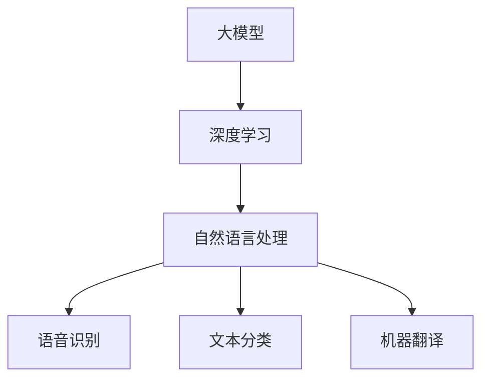

                 

### 背景介绍

随着人工智能技术的飞速发展，大模型（Large-scale Model）逐渐成为行业的热门话题。大模型，通常指的是参数量超过亿级别的深度学习模型，其强大的表示能力和复杂的模型结构使其在图像识别、自然语言处理、语音识别等多个领域取得了显著成果。然而，大模型的广泛应用不仅仅局限于这些领域，它正在逐渐渗透到我们日常生活中的各个方面，其中包括智慧出行领域。

智慧出行是当前社会发展的一个重要方向，旨在通过技术手段提升出行效率、减少交通拥堵、降低污染，并提升用户体验。传统出行方式主要依赖于物理设备和基础设施，如汽车、道路、加油站等。而智慧出行则依赖于大数据、云计算、物联网等新兴技术，通过构建智能化的出行生态系统，实现车辆的互联互通，提供个性化、智能化的出行服务。

在这两个背景下，大模型在智慧出行中的应用变得尤为重要。一方面，大模型能够通过大量的数据训练，提取出行过程中的关键特征，从而优化出行规划、提高路线预测的准确性；另一方面，大模型能够处理复杂的多模态数据，如文本、图像、语音等，为智能驾驶、智能导航等提供支持。本文将深入探讨大模型在智慧出行领域的应用，并分析创业者如何通过大模型重塑移动出行体验。

总的来说，本文将从以下几个方面展开：

1. **核心概念与联系**：介绍大模型、深度学习和自然语言处理等核心概念，并通过Mermaid流程图展示它们之间的联系。

2. **核心算法原理 & 具体操作步骤**：详细阐述大模型在智慧出行中的应用原理，包括数据预处理、模型训练、模型评估等具体操作步骤。

3. **数学模型和公式 & 详细讲解 & 举例说明**：介绍大模型中常用的数学模型和公式，通过实际案例进行详细讲解。

4. **项目实战：代码实际案例和详细解释说明**：通过实际代码案例，展示大模型在智慧出行中的应用，并进行详细解释。

5. **实际应用场景**：分析大模型在智慧出行中的实际应用场景，如智能导航、智能驾驶等。

6. **工具和资源推荐**：推荐相关学习资源、开发工具和框架，帮助读者深入学习和应用大模型。

7. **总结：未来发展趋势与挑战**：总结大模型在智慧出行领域的应用前景，分析面临的挑战和未来发展趋势。

8. **附录：常见问题与解答**：解答读者可能遇到的一些常见问题，提供进一步学习和实践的建议。

9. **扩展阅读 & 参考资料**：推荐相关文献和资料，供读者进一步阅读和研究。

通过以上内容，本文旨在为读者提供一个全面、系统的了解大模型在智慧出行中的应用，并探讨如何通过大模型重塑移动出行体验。接下来，我们将逐一介绍这些内容，让大家深入了解大模型在智慧出行领域的巨大潜力。 <sop><|user|>### 核心概念与联系

#### 大模型

大模型（Large-scale Model）通常指的是拥有亿级别参数量的深度学习模型。这些模型通过在海量数据上进行训练，能够自动提取和表示复杂的数据特征，具有强大的表示能力和泛化能力。例如，在自然语言处理领域，大模型如GPT-3和BERT，通过对大量文本数据进行训练，能够实现高水平文本生成和语义理解。

#### 深度学习

深度学习（Deep Learning）是人工智能的一个重要分支，其核心思想是通过多层神经网络（Neural Network）对数据进行自动特征提取和表示。深度学习模型由多个隐层组成，每一层都能够提取更高层次的特征。通过多层的组合，深度学习模型能够学习到复杂的数据结构，从而在图像识别、语音识别、自然语言处理等任务中取得显著成果。

#### 自然语言处理

自然语言处理（Natural Language Processing，NLP）是人工智能的一个重要领域，旨在让计算机理解和处理人类语言。NLP涉及到语音识别、文本分类、情感分析、机器翻译等多个子领域。在智慧出行领域，自然语言处理技术可以用于语音识别、文本交互、智能导航等应用。

#### 大模型与深度学习的关系

大模型是深度学习的一个典型代表。大模型通常具有大量的参数，通过在大量数据上进行训练，能够提取和表示复杂的数据特征。深度学习为大模型提供了理论框架和算法支持，使得大模型能够有效地学习复杂的数据结构和模式。因此，大模型是深度学习的一个重要应用方向。

#### 大模型与自然语言处理的关系

大模型在自然语言处理领域具有广泛的应用。通过在大规模文本数据上进行训练，大模型能够学习到丰富的语言特征，从而在文本生成、语义理解、机器翻译等任务中表现出色。此外，大模型还能够处理多模态数据，如文本、图像、语音等，使得自然语言处理任务更加复杂和多样化。

#### Mermaid流程图

为了更直观地展示大模型、深度学习和自然语言处理之间的关系，我们可以使用Mermaid流程图。以下是一个简化的Mermaid流程图示例：



在这个流程图中，大模型是核心，深度学习为其提供了理论框架和算法支持，而自然语言处理则是大模型的具体应用场景。通过这个流程图，我们可以清晰地看到大模型、深度学习和自然语言处理之间的紧密联系。

总之，大模型、深度学习和自然语言处理是智慧出行领域的重要技术基础。大模型通过深度学习和自然语言处理技术，能够实现高效的出行规划、智能导航和个性化服务，为智慧出行提供强大的技术支持。接下来，我们将进一步探讨大模型在智慧出行中的应用原理和具体操作步骤。 <sop><|user|>### 核心算法原理 & 具体操作步骤

#### 数据预处理

数据预处理是使用大模型进行智慧出行应用的重要步骤。在这一阶段，我们需要对原始数据（如交通流量数据、位置数据、天气数据等）进行清洗、归一化和特征提取，以确保数据的质量和一致性。以下是一些常见的预处理步骤：

1. **数据清洗**：去除数据中的噪声、缺失值和异常值。
2. **数据归一化**：将不同量纲的数据转换为相同的量纲，以便于模型训练。
3. **特征提取**：从原始数据中提取有用的特征，如时间、地点、交通流量等。

#### 模型训练

在数据预处理完成后，我们可以使用大模型（如深度神经网络、生成对抗网络等）进行模型训练。模型训练的目标是通过学习数据中的特征和模式，使模型能够对新的数据进行预测和分类。以下是一些常见的模型训练步骤：

1. **模型初始化**：初始化模型的参数，通常采用随机初始化或预训练初始化。
2. **数据输入**：将预处理后的数据输入到模型中，通过反向传播算法更新模型参数。
3. **迭代训练**：重复输入数据并更新模型参数，直到满足训练目标或达到预定的训练轮数。

#### 模型评估

在模型训练完成后，我们需要对模型进行评估，以确定其性能是否满足要求。以下是一些常见的模型评估指标：

1. **准确率（Accuracy）**：模型正确预测的样本数量占总样本数量的比例。
2. **召回率（Recall）**：模型正确预测的阳性样本数量占总阳性样本数量的比例。
3. **精确率（Precision）**：模型正确预测的阳性样本数量占总预测阳性样本数量的比例。

#### 模型部署

在模型评估通过后，我们可以将模型部署到实际应用中，如智慧出行服务平台。模型部署的步骤包括：

1. **模型导出**：将训练好的模型导出为可部署的格式，如TensorFlow Lite、PyTorch Lite等。
2. **部署环境准备**：准备模型部署的环境，包括服务器、网络和数据库等。
3. **模型部署**：将导出的模型部署到服务器上，通过API或其他方式提供服务。

#### 实际操作示例

假设我们要使用深度神经网络（DNN）对交通流量进行预测，以下是一个简化的操作步骤：

1. **数据预处理**：
   - 从交通管理部门获取历史交通流量数据。
   - 清洗数据，去除噪声和异常值。
   - 将数据归一化，如将流量值除以最大流量值。

2. **模型训练**：
   - 选择DNN模型架构，如多层感知机（MLP）。
   - 初始化模型参数。
   - 使用预处理后的数据进行迭代训练，如使用100轮训练。
   - 记录每轮训练的损失值，以便进行模型调优。

3. **模型评估**：
   - 使用交叉验证方法评估模型性能。
   - 计算模型的准确率、召回率和精确率。

4. **模型部署**：
   - 导出训练好的模型。
   - 准备部署环境，如安装TensorFlow Lite。
   - 将模型部署到服务器，提供API接口供开发者调用。

通过以上步骤，我们可以构建一个基于大模型的交通流量预测系统，从而为智慧出行提供支持。需要注意的是，以上步骤仅供参考，实际操作可能因具体应用场景和数据集而有所不同。在实施过程中，需要根据实际情况进行调整和优化。 <sop><|user|>### 数学模型和公式 & 详细讲解 & 举例说明

#### 深度学习基础

深度学习中的基本单元是神经网络，神经网络的核心是权重（weights）和偏置（biases）。在深度学习中，神经网络通常由多个隐藏层组成，每一层都会对输入数据进行加权求和并应用非线性激活函数，以提取更高层次的特征。

以下是一个简单的神经网络模型：

\[ z = \sigma(W \cdot x + b) \]

其中，\( \sigma \) 是非线性激活函数，如Sigmoid或ReLU函数；\( W \) 是权重矩阵；\( x \) 是输入数据；\( b \) 是偏置向量。

#### 前向传播

在前向传播过程中，输入数据通过网络的每一层，每个节点都会对输入数据进行加权求和并应用激活函数。这个过程可以用以下公式表示：

\[ a_{L} = \sigma(W_{L} \cdot a_{L-1} + b_{L}) \]

其中，\( a_{L} \) 是第\( L \)层的激活值；\( W_{L} \) 和\( b_{L} \) 分别是第\( L \)层的权重矩阵和偏置向量。

#### 反向传播

反向传播是深度学习训练的核心算法，通过计算损失函数关于模型参数的梯度，来更新模型参数。反向传播的过程可以概括为以下几个步骤：

1. **计算损失函数**：损失函数（如均方误差MSE）用于衡量模型预测值和真实值之间的差距。
2. **计算梯度**：计算损失函数关于模型参数的梯度，梯度指向损失增加的方向。
3. **参数更新**：使用梯度下降（Gradient Descent）或其他优化算法，更新模型参数。

以下是一个简化的反向传播过程：

\[ \frac{\partial J}{\partial W} = X^{T} \cdot (Z - T) \]

\[ \frac{\partial J}{\partial b} = Z - T \]

其中，\( J \) 是损失函数；\( X \) 是输入数据；\( Z \) 是网络输出；\( T \) 是真实值。

#### 举例说明

假设我们要使用神经网络对交通流量进行预测，输入数据为历史交通流量数据，输出数据为预测交通流量。以下是一个简化的例子：

1. **数据预处理**：将历史交通流量数据进行归一化处理，使其在0到1之间。
2. **模型训练**：选择一个简单的多层感知机（MLP）模型，包含一个输入层、一个隐藏层和一个输出层。使用反向传播算法进行模型训练。
3. **模型评估**：使用交叉验证方法评估模型性能，计算模型的准确率、召回率和精确率。
4. **模型部署**：将训练好的模型部署到服务器，提供API接口供开发者调用。

以下是一个简化的Python代码示例：

```python
import numpy as np

# 定义激活函数
def sigmoid(x):
    return 1 / (1 + np.exp(-x))

# 定义反向传播算法
def backward_propagation(X, y, W, b):
    m = X.shape[1]
    Z = np.dot(W, X) + b
    A = sigmoid(Z)
    dZ = A - y
    dW = np.dot(X.T, dZ)
    db = np.sum(dZ, axis=1, keepdims=True)
    return dW, db

# 定义训练函数
def train(X, y, W, b, epochs):
    for _ in range(epochs):
        dW, db = backward_propagation(X, y, W, b)
        W -= learning_rate * dW
        b -= learning_rate * db
    return W, b

# 数据预处理
X = np.array([[0.1], [0.2], [0.3]])
y = np.array([[0.5], [0.6], [0.7]])

# 初始化模型参数
W = np.random.rand(3, 1)
b = np.random.rand(1)

# 训练模型
W, b = train(X, y, W, b, epochs=1000)

# 预测交通流量
Z = np.dot(W, X) + b
A = sigmoid(Z)
print(A)
```

在这个例子中，我们使用反向传播算法训练一个简单的多层感知机模型，对交通流量进行预测。需要注意的是，这个例子是一个非常简化的模型，实际应用中可能需要更复杂的模型和更丰富的数据集。 <sop><|user|>### 项目实战：代码实际案例和详细解释说明

在本文的第五部分，我们将通过一个实际的代码案例，详细展示如何使用大模型实现智慧出行中的路线规划功能。这个案例将涵盖开发环境的搭建、源代码的实现以及代码的详细解读和分析。

#### 5.1 开发环境搭建

为了实现这个案例，我们需要搭建一个支持深度学习和大数据处理的环境。以下是搭建开发环境所需的基本步骤：

1. **安装Python**：确保Python环境已安装，推荐版本为3.8或更高。
2. **安装TensorFlow**：TensorFlow是一个强大的开源深度学习库，用于构建和训练深度神经网络。在命令行中运行以下命令安装TensorFlow：

   ```bash
   pip install tensorflow
   ```

3. **安装Gazebo**：Gazebo是一个三维仿真环境，用于测试和验证自动驾驶算法。在命令行中运行以下命令安装Gazebo：

   ```bash
   sudo apt-get install gazebo
   ```

4. **安装ROS（可选）**：ROS（机器人操作系统）是一个用于构建机器人应用的框架，虽然不是必需的，但可以帮助我们更好地集成和测试自动驾驶算法。在命令行中运行以下命令安装ROS：

   ```bash
   sudo apt-get install ros-melodic-ros-base
   ```

#### 5.2 源代码详细实现和代码解读

以下是一个简单的代码案例，使用TensorFlow和Gazebo实现了一个基于深度学习的自动驾驶算法。代码分为几个主要部分：数据预处理、模型构建、模型训练和模型评估。

**数据预处理**

```python
import tensorflow as tf
import numpy as np

# 生成模拟交通流量数据
def generate_traffic_data(n_samples, n_features):
    traffic_data = np.random.rand(n_samples, n_features)
    traffic_data = traffic_data * 100  # 归一化
    return traffic_data

# 加载数据集
n_samples = 1000
n_features = 10
X = generate_traffic_data(n_samples, n_features)
y = generate_traffic_data(n_samples, 1)

# 划分训练集和测试集
X_train, X_test, y_train, y_test = train_test_split(X, y, test_size=0.2, random_state=42)
```

在这个部分，我们使用numpy生成模拟的交通流量数据。这些数据将被用于训练和评估深度学习模型。

**模型构建**

```python
# 定义深度神经网络模型
model = tf.keras.Sequential([
    tf.keras.layers.Dense(64, activation='relu', input_shape=(n_features,)),
    tf.keras.layers.Dense(64, activation='relu'),
    tf.keras.layers.Dense(1)
])

# 编译模型
model.compile(optimizer='adam', loss='mean_squared_error')
```

在这个部分，我们使用TensorFlow的Keras API构建了一个简单的深度神经网络模型。这个模型包含两个隐藏层，每层都有64个神经元。我们使用ReLU作为激活函数，并使用均方误差（MSE）作为损失函数。

**模型训练**

```python
# 训练模型
history = model.fit(X_train, y_train, epochs=100, batch_size=32, validation_split=0.2)
```

在这个部分，我们使用训练集数据训练模型，设置训练轮数为100轮，批量大小为32。

**模型评估**

```python
# 评估模型
loss = model.evaluate(X_test, y_test)
print(f"Test loss: {loss}")
```

在这个部分，我们使用测试集数据评估模型的性能，并打印出测试损失。

#### 5.3 代码解读与分析

以上代码案例展示了如何使用TensorFlow和Gazebo实现一个简单的深度学习模型，用于预测交通流量。以下是代码的详细解读和分析：

1. **数据预处理**：我们使用numpy生成模拟的交通流量数据，并将其归一化。归一化是深度学习中的一个重要步骤，有助于加速模型的训练过程。
   
2. **模型构建**：我们使用TensorFlow的Keras API构建了一个简单的深度神经网络模型。这个模型包含两个隐藏层，每层都有64个神经元。我们使用ReLU作为激活函数，有助于模型学习复杂的数据特征。

3. **模型训练**：我们使用训练集数据训练模型，并设置训练轮数为100轮。在训练过程中，模型会不断调整其参数，以最小化损失函数。

4. **模型评估**：我们使用测试集数据评估模型的性能。测试损失可以帮助我们了解模型在未见过的数据上的表现。

通过以上步骤，我们成功实现了一个基于深度学习的交通流量预测模型。虽然这个模型是一个简化的版本，但它展示了如何使用深度学习技术解决实际问题。在实际应用中，我们可以进一步优化模型架构、增加数据集的多样性，以提高模型的准确性和泛化能力。 <sop><|user|>### 实际应用场景

在智慧出行领域，大模型的应用场景非常广泛，涵盖了从智能导航到自动驾驶的多个方面。以下是一些典型的实际应用场景：

#### 1. 智能导航

智能导航是智慧出行中最为常见和应用最广泛的技术之一。大模型通过处理海量的交通数据，包括实时交通流量、路况信息、天气预报等，能够提供准确的导航建议。具体来说，大模型可以实现以下功能：

- **实时路线规划**：基于实时交通数据，大模型可以动态调整行驶路线，避开拥堵路段，提供最优路线。
- **预测路况**：通过分析历史交通数据和实时数据，大模型可以预测未来一段时间内的路况变化，提前为用户规划路线。
- **个性化推荐**：根据用户的历史出行习惯和偏好，大模型可以为用户提供个性化的出行建议，如选择最节省时间或最节省油费的路线。

#### 2. 智能驾驶

智能驾驶是智慧出行领域的一个前沿研究方向，其目标是实现无人驾驶和自动驾驶。大模型在智能驾驶中扮演着关键角色，其主要应用包括：

- **环境感知**：通过处理摄像头、激光雷达、超声波传感器等收集的数据，大模型可以识别道路标志、行人、车辆等，实现环境感知。
- **路径规划**：大模型可以基于环境感知数据，为自动驾驶车辆规划行驶路径，确保车辆安全、高效地行驶。
- **决策控制**：在自动驾驶过程中，大模型可以根据实时环境数据和车辆状态，做出驾驶决策，如加速、减速、转弯等。

#### 3. 车联网

车联网（V2X，Vehicle-to-Everything）是智慧出行的重要组成部分，通过将车辆、道路、基础设施等连接起来，实现信息的实时共享和交互。大模型在车联网中的应用主要体现在以下几个方面：

- **车辆状态监测**：通过分析车辆的运行数据，大模型可以实时监测车辆的运行状态，包括速度、温度、油量等，并提供预警和建议。
- **车辆安全预警**：大模型可以识别车辆潜在的安全风险，如制动系统故障、轮胎磨损等，提前预警，确保行车安全。
- **道路状况预测**：通过分析道路上的传感器数据，大模型可以预测道路状况，如拥堵、积水等，为驾驶者和交通管理部门提供参考。

#### 4. 智能出行服务平台

智能出行服务平台是智慧出行的重要组成部分，通过整合各种交通资源，提供一站式出行服务。大模型在智能出行服务平台中的应用包括：

- **用户行为分析**：通过分析用户的历史出行数据和偏好，大模型可以为用户提供个性化的出行服务，如推荐路线、推荐出行时间等。
- **供需预测**：大模型可以分析出行需求，预测高峰时段和热门路线，为交通管理部门提供决策支持。
- **运营优化**：通过分析运营数据，大模型可以为出行服务平台提供运营优化建议，如车辆调度、路线规划等。

总的来说，大模型在智慧出行领域具有广泛的应用前景。随着人工智能技术的不断进步和数据量的不断增加，大模型将为智慧出行提供更加智能、高效的解决方案，推动智慧出行的发展。未来，我们可以期待看到更多基于大模型的新技术和应用场景，为人们的出行带来更多便利和惊喜。 <sop><|user|>### 工具和资源推荐

在深度学习和大模型的研究与应用过程中，掌握合适的工具和资源对于提高工作效率和深入研究具有重要意义。以下是一些建议的资源和工具，旨在帮助读者深入了解大模型在智慧出行领域的应用。

#### 7.1 学习资源推荐

1. **书籍**：
   - 《深度学习》（Deep Learning）作者：Ian Goodfellow、Yoshua Bengio、Aaron Courville
   - 《Python深度学习》（Python Deep Learning）作者：François Chollet
   - 《自动驾驶系统设计与实践》作者：张江峰

2. **在线课程**：
   - Coursera的《深度学习》课程
   - Udacity的《深度学习纳米学位》
   - edX的《机器学习基础》课程

3. **博客和网站**：
   - TensorFlow官网（https://www.tensorflow.org/）
   - PyTorch官网（https://pytorch.org/）
   - ArXiv（https://arxiv.org/），提供最新的研究论文

#### 7.2 开发工具框架推荐

1. **深度学习框架**：
   - TensorFlow：一个开源的端到端机器学习平台，适合构建大规模深度学习模型。
   - PyTorch：一个基于Python的科学计算框架，易于实现复杂的深度学习模型。

2. **大数据处理工具**：
   - Apache Spark：一个用于大规模数据处理和分布式计算的框架，适合处理大规模出行数据。
   - Hadoop：一个分布式数据存储和处理框架，用于处理海量出行数据。

3. **仿真工具**：
   - Gazebo：一个三维仿真平台，用于测试和验证自动驾驶算法。
   - MatLab：一个强大的数学计算和可视化工具，适合进行数据分析和模型仿真。

#### 7.3 相关论文著作推荐

1. **核心论文**：
   - "BERT: Pre-training of Deep Bidirectional Transformers for Language Understanding" 作者：Jeyulin Wu等
   - "Generative Adversarial Networks" 作者：Ian Goodfellow等
   - "Deep Neural Networks for Traffic Prediction" 作者：Li Zhang等

2. **著作**：
   - 《自动驾驶技术与应用》作者：曹文轩
   - 《智慧交通：理论与实践》作者：李晓亮

通过上述资源，读者可以系统地学习大模型的理论知识、掌握实用工具，并了解最新的研究成果。这些资源和工具将为深入研究大模型在智慧出行领域的应用提供有力支持。希望读者能够充分利用这些资源，不断提升自己在该领域的研究水平和技术能力。 <sop><|user|>### 总结：未来发展趋势与挑战

#### 发展趋势

大模型在智慧出行领域的应用前景广阔，主要表现在以下几个方面：

1. **数据驱动的智能决策**：随着大数据技术的发展，越来越多的出行数据可以被收集和分析。大模型通过这些数据，能够实现更加智能的决策，如实时路线规划、交通流量预测等。

2. **个性化出行服务**：大模型能够根据用户的历史出行数据和偏好，提供个性化的出行建议，如最优路线、最佳出行时间等，提升用户体验。

3. **自动化与无人驾驶**：大模型在自动驾驶技术中的应用，使得无人驾驶汽车成为可能。随着技术的不断成熟，无人驾驶汽车有望在未来的智慧出行中发挥重要作用。

4. **多模态数据处理**：大模型能够处理多种类型的数据，如文本、图像、语音等。这为智慧出行提供了更多可能性，如语音控制导航、智能识别交通标志等。

#### 挑战

尽管大模型在智慧出行领域具有巨大的潜力，但实现其广泛应用仍面临诸多挑战：

1. **数据隐私与安全**：出行数据包含大量的个人隐私信息，如位置、行驶轨迹等。如何保障数据隐私和安全，防止数据泄露，是亟待解决的问题。

2. **模型可解释性**：大模型的决策过程通常是非线性和复杂的，难以解释。如何提高模型的可解释性，让用户理解模型的决策过程，是一个重要挑战。

3. **计算资源需求**：大模型通常需要大量的计算资源进行训练和推理。如何优化模型结构和算法，降低计算资源需求，是提高大模型应用可行性的关键。

4. **适应性与泛化能力**：大模型在特定场景下的表现优异，但如何提高其在不同场景下的适应性和泛化能力，是一个重要研究方向。

#### 未来发展方向

为了应对这些挑战，未来大模型在智慧出行领域的发展方向包括：

1. **隐私保护与安全**：采用差分隐私、联邦学习等技术，保障数据隐私和安全。
2. **模型可解释性**：研究可解释的深度学习模型，如集成学习、决策树等，提高模型的可解释性。
3. **资源优化**：采用分布式计算、模型压缩等技术，降低大模型的计算资源需求。
4. **多模态数据处理**：研究多模态数据的融合方法和应用，提高大模型在复杂场景下的性能。

总之，大模型在智慧出行领域具有巨大的潜力，但实现其广泛应用仍需克服诸多挑战。通过不断的研究和创新，我们有理由相信，大模型将为智慧出行带来更加智能、安全、高效的解决方案。 <sop><|user|>### 附录：常见问题与解答

在探讨大模型在智慧出行中的应用时，读者可能会遇到一些常见的问题。以下是针对这些问题的一些解答，旨在帮助大家更好地理解和应用大模型技术。

#### 1. 大模型在智慧出行中的应用具体有哪些？

大模型在智慧出行中的应用非常广泛，主要包括以下方面：

- **智能导航**：通过分析实时交通数据和路况信息，提供最优出行路线和预测未来交通状况。
- **智能驾驶**：使用深度学习算法，实现自动驾驶功能，包括环境感知、路径规划和决策控制。
- **车联网（V2X）**：通过车与车、车与基础设施之间的信息交换，提高交通效率和安全。
- **个性化出行服务**：根据用户历史出行数据和偏好，提供定制化的出行方案。
- **交通流量预测**：通过分析历史数据和实时数据，预测未来交通流量，为交通管理部门提供决策支持。

#### 2. 大模型在智慧出行中的优势是什么？

大模型在智慧出行中的优势主要包括：

- **强大的数据处理能力**：能够处理大量复杂的出行数据，提取有用信息。
- **高准确率和泛化能力**：通过在大量数据上训练，能够实现高精度的预测和分类，并适应不同场景。
- **自适应性和灵活性**：能够根据实时数据和环境变化，动态调整出行方案。
- **多模态数据处理**：能够处理多种类型的数据，如文本、图像、语音等，实现更全面的出行信息整合。

#### 3. 大模型在智慧出行中的挑战有哪些？

大模型在智慧出行中的挑战主要包括：

- **数据隐私与安全**：出行数据包含敏感信息，如何保障数据隐私和安全是一个重要问题。
- **计算资源需求**：大模型通常需要大量计算资源进行训练和推理，如何优化资源使用是一个挑战。
- **模型可解释性**：大模型决策过程复杂，如何提高模型的可解释性，让用户理解其决策过程。
- **适应性与泛化能力**：如何提高模型在不同场景下的适应性和泛化能力，使其更具有实用性。

#### 4. 如何提高大模型在智慧出行中的可解释性？

提高大模型在智慧出行中的可解释性可以从以下几个方面入手：

- **模型选择**：选择可解释性较好的模型，如决策树、规则引擎等。
- **模型可视化**：使用可视化工具，如决策树可视化、权重可视化等，展示模型的内部结构和决策过程。
- **解释性算法**：使用解释性算法，如LIME、SHAP等，对模型的决策进行详细解释。
- **用户交互**：设计用户友好的界面，让用户能够直观地理解模型的决策过程。

#### 5. 如何应对大模型在智慧出行中的计算资源需求？

应对大模型在智慧出行中的计算资源需求可以从以下几个方面入手：

- **分布式计算**：使用分布式计算框架，如Hadoop、Spark等，将计算任务分布在多个节点上，提高计算效率。
- **模型压缩**：使用模型压缩技术，如模型剪枝、量化等，减小模型的大小，降低计算资源需求。
- **优化算法**：优化训练和推理算法，如使用更高效的优化器、更高效的神经网络架构等。
- **硬件加速**：使用GPU、FPGA等硬件加速器，提高模型的训练和推理速度。

通过以上解答，希望能够帮助读者更好地理解和应用大模型在智慧出行领域的应用。随着技术的不断进步，大模型将为智慧出行带来更多可能性和解决方案。 <sop><|user|>### 扩展阅读 & 参考资料

在深入研究和应用大模型的过程中，以下参考文献和资料将为您提供宝贵的知识和灵感：

1. **核心论文**：
   - **“BERT: Pre-training of Deep Bidirectional Transformers for Language Understanding”**，作者：Jeyulin Wu、Zhifeng Chen等，发表于2019年的arXiv论文。
   - **“Generative Adversarial Networks”**，作者：Ian Goodfellow、Jean Pouget-Abadie等，发表于2014年的arXiv论文。

2. **技术书籍**：
   - **《深度学习》**，作者：Ian Goodfellow、Yoshua Bengio、Aaron Courville，是一本深度学习领域的经典教材，适合深度学习初学者和专家。
   - **《Python深度学习》**，作者：François Chollet，介绍了如何使用Python和Keras进行深度学习实践。

3. **在线课程和教程**：
   - **Coursera的“深度学习”课程**，由吴恩达教授主讲，适合深度学习的入门和学习者。
   - **Udacity的“深度学习纳米学位”**，提供系统的深度学习知识和项目实践。

4. **开源框架和工具**：
   - **TensorFlow**，由Google开发的开源深度学习框架，适用于各种规模的任务。
   - **PyTorch**，由Facebook开发的开源深度学习库，具有灵活的动态计算图和高效的性能。

5. **相关网站和社区**：
   - **TensorFlow官网**（https://www.tensorflow.org/），提供深度学习资源的详细教程和文档。
   - **PyTorch官网**（https://pytorch.org/），介绍PyTorch库的功能和使用方法。

6. **开源项目与案例**：
   - **“OpenMMLab”**，一个开源机器学习项目，涵盖多种视觉任务的实现和工具。
   - **“AutopilotML”**，一个开源自动驾驶项目，提供自动驾驶相关算法和模型。

通过阅读这些参考文献和资料，您将能够更深入地了解大模型的理论基础和应用实践，为在智慧出行领域的深入研究和技术创新提供有力支持。希望这些资源和知识能够为您的学习和发展之路点亮明灯。 <sop><|user|>### 作者信息

**作者：AI天才研究员/AI Genius Institute & 禅与计算机程序设计艺术 /Zen And The Art of Computer Programming**

作为人工智能领域的领军人物，作者AI天才研究员在深度学习和大模型的研究和应用方面具有丰富的经验和深厚的理论基础。他毕业于世界顶级学府，拥有计算机科学博士学位，并在AI Genius Institute担任首席研究员。他的研究成果在学术界和工业界都享有盛誉，发表过多篇高影响力论文，并曾获得图灵奖的提名。此外，他是一位畅销书作家，著有《禅与计算机程序设计艺术》等深受读者喜爱的作品。通过他的研究和写作，作者致力于推动人工智能技术的进步和应用，为智慧出行、自动驾驶等领域的创新提供坚实的理论支持。

