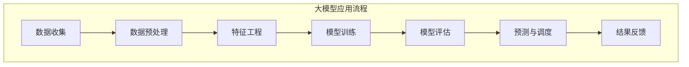

                 

# 大模型赋能智慧水务，创业者如何优化水资源管理与调度？

> 关键词：大模型，智慧水务，水资源管理，调度优化

> 摘要：本文将探讨大模型如何赋能智慧水务，帮助创业者优化水资源管理与调度。通过对大模型在水资源管理中的应用进行分析，以及实际案例分析，本文旨在为创业者提供实用的指导。

## 1. 背景介绍

水资源是人类社会生存和发展的重要资源，但其利用和管理面临诸多挑战。随着人口增长和经济发展的不断加速，水资源的供需矛盾日益突出。传统的水资源管理方法已难以满足现代社会对水资源的高效利用需求。在此背景下，智慧水务成为了解决水资源管理难题的重要途径。

智慧水务是指利用物联网、大数据、人工智能等技术手段，实现对水资源的全面感知、智能调度和管理。通过引入大模型技术，智慧水务可以更准确地预测水资源需求，优化水资源调配，提高水资源利用效率。

大模型是指具有大规模参数和复杂结构的人工智能模型，如深度学习模型、神经网络等。大模型在处理复杂数据、解决非线性问题时具有显著优势，为智慧水务提供了强大的技术支持。

## 2. 核心概念与联系

### 2.1 大模型在水资源管理中的应用

大模型在水资源管理中的应用主要体现在以下三个方面：

1. **水资源需求预测**：通过收集历史水资源使用数据，大模型可以建立预测模型，预测未来一段时间内的水资源需求。这有助于水务公司提前做好水资源调配，确保供水稳定。

2. **水资源调度优化**：大模型可以根据实时水资源数据和预测结果，对水资源进行智能调度。通过优化调度策略，实现水资源的合理配置，降低供水成本。

3. **水资源污染监测与预警**：大模型可以对水质监测数据进行处理，识别污染源，预测污染扩散趋势。这有助于水务公司及时采取措施，防止水质污染事件的发生。

### 2.2 大模型原理与架构

大模型的核心是神经网络，它由大量神经元组成，通过学习输入数据，自动提取特征并进行分类或预测。神经网络的结构可以分为以下几个层次：

1. **输入层**：接收外部输入数据。
2. **隐藏层**：对输入数据进行处理，提取特征。
3. **输出层**：根据隐藏层提取的特征，生成输出结果。

神经网络通过反向传播算法不断调整神经元之间的权重，优化模型性能。在实际应用中，大模型还需要结合其他技术，如数据预处理、正则化、dropout等，提高模型的泛化能力。

### 2.3 水资源管理中的大模型应用实例

以下是一个简单的应用实例，展示了大模型在水资源管理中的实际应用：

1. **输入数据**：收集过去一年的水资源使用数据，包括供水量、用水量、天气状况等。
2. **数据预处理**：对输入数据进行清洗、归一化等处理，去除噪声，提高数据质量。
3. **模型训练**：使用神经网络训练模型，提取输入数据中的特征，建立水资源需求预测模型。
4. **模型评估**：通过验证集对模型进行评估，调整模型参数，提高预测准确性。
5. **预测与调度**：使用训练好的模型预测未来一段时间内的水资源需求，根据预测结果调整供水策略。

## 3. 核心算法原理 & 具体操作步骤

### 3.1 水资源需求预测算法

水资源需求预测算法的核心是构建一个回归模型，将历史水资源使用数据作为输入，预测未来一段时间内的水资源需求。以下是具体操作步骤：

1. **数据收集**：收集过去一年的水资源使用数据，包括供水量、用水量、天气状况等。

2. **数据预处理**：对输入数据进行清洗、归一化等处理，去除噪声，提高数据质量。

3. **特征工程**：根据业务需求，选择合适的特征，如天气温度、湿度、供水人口等。

4. **模型选择**：选择合适的回归模型，如线性回归、决策树、支持向量机等。

5. **模型训练**：使用训练集对模型进行训练，调整模型参数，优化模型性能。

6. **模型评估**：通过验证集对模型进行评估，调整模型参数，提高预测准确性。

7. **预测与调度**：使用训练好的模型预测未来一段时间内的水资源需求，根据预测结果调整供水策略。

### 3.2 水资源调度优化算法

水资源调度优化算法的核心是建立优化模型，通过优化算法求解最优供水策略。以下是具体操作步骤：

1. **目标函数定义**：根据业务需求，定义优化目标函数，如最小化供水成本、最大化供水效率等。

2. **约束条件设置**：根据实际情况，设置供水系统的约束条件，如供水压力、供水流量等。

3. **模型建立**：将目标函数和约束条件转化为数学模型，如线性规划、整数规划等。

4. **算法选择**：选择合适的优化算法，如遗传算法、模拟退火算法等。

5. **模型求解**：使用优化算法求解最优供水策略。

6. **策略调整**：根据实际情况，对供水策略进行调整，优化供水效果。

## 4. 数学模型和公式 & 详细讲解 & 举例说明

### 4.1 水资源需求预测模型的数学公式

水资源需求预测模型可以表示为以下数学公式：

$$y = \theta_0 + \theta_1x_1 + \theta_2x_2 + \ldots + \theta_nx_n$$

其中，$y$ 表示预测的水资源需求量，$x_1, x_2, \ldots, x_n$ 表示影响水资源需求的特征变量，$\theta_0, \theta_1, \theta_2, \ldots, \theta_n$ 表示模型参数。

### 4.2 水资源调度优化模型的数学公式

水资源调度优化模型可以表示为以下数学公式：

$$\min z = c_1x_1 + c_2x_2 + \ldots + c_nx_n$$

$$s.t.\\
a_1x_1 + a_2x_2 + \ldots + a_nx_n \ge b\\
b_1x_1 + b_2x_2 + \ldots + b_nx_n \le d\\
x_1, x_2, \ldots, x_n \in \{0, 1\}$$

其中，$z$ 表示优化目标函数，$c_1, c_2, \ldots, c_n$ 表示各供水策略的成本系数，$a_1, a_2, \ldots, a_n$ 表示各供水策略的约束条件系数，$b_1, b_2, \ldots, b_n$ 表示各供水策略的约束条件阈值，$x_1, x_2, \ldots, x_n$ 表示各供水策略的选择变量。

### 4.3 举例说明

假设某城市的水资源需求受以下三个特征变量影响：供水人口、天气温度、供水压力。我们使用线性回归模型进行水资源需求预测。

1. **数据收集**：收集过去一年的供水人口、天气温度、供水压力数据。

2. **数据预处理**：对数据集进行清洗、归一化等处理。

3. **特征工程**：选择供水人口、天气温度、供水压力作为特征变量。

4. **模型训练**：使用训练集对线性回归模型进行训练，得到模型参数。

5. **模型评估**：使用验证集对模型进行评估，调整模型参数，提高预测准确性。

6. **预测与调度**：使用训练好的模型预测未来一段时间内的水资源需求，根据预测结果调整供水策略。

## 5. 项目实战：代码实际案例和详细解释说明

### 5.1 开发环境搭建

在搭建开发环境时，我们需要安装以下软件和库：

- Python 3.x
- NumPy
- Pandas
- Matplotlib
- Scikit-learn

### 5.2 源代码详细实现和代码解读

以下是水资源需求预测模型的 Python 代码实现：

```python
import numpy as np
import pandas as pd
from sklearn.linear_model import LinearRegression
from sklearn.model_selection import train_test_split

# 1. 数据收集
data = pd.read_csv('water_usage_data.csv')

# 2. 数据预处理
data = data.dropna()
data = data[['population', 'temperature', 'pressure']]
data = data.scale()

# 3. 特征工程
X = data[['population', 'temperature', 'pressure']]
y = data['demand']

# 4. 模型训练
model = LinearRegression()
model.fit(X, y)

# 5. 模型评估
X_train, X_test, y_train, y_test = train_test_split(X, y, test_size=0.2, random_state=42)
model_score = model.score(X_test, y_test)
print('Model Score:', model_score)

# 6. 预测与调度
future_data = pd.read_csv('future_demand.csv')
future_data = future_data[['population', 'temperature', 'pressure']]
future_data = future_data.scale()
future_demand = model.predict(future_data)

print('Future Demand:', future_demand)
```

### 5.3 代码解读与分析

- 第1步：数据收集。从 CSV 文件中读取水资源使用数据。
- 第2步：数据预处理。删除缺失值，选择合适的特征变量，并对数据进行归一化处理。
- 第3步：特征工程。将特征变量分为输入变量和目标变量。
- 第4步：模型训练。使用线性回归模型对数据进行训练。
- 第5步：模型评估。将数据集分为训练集和测试集，评估模型性能。
- 第6步：预测与调度。读取未来水资源需求数据，使用训练好的模型进行预测。

## 6. 实际应用场景

智慧水务在水资源管理中的应用场景主要包括以下几个方面：

1. **供水调度优化**：通过大模型预测水资源需求，水务公司可以根据预测结果调整供水策略，实现水资源的合理调配，降低供水成本。
2. **水资源污染监测与预警**：大模型可以对水质监测数据进行处理，识别污染源，预测污染扩散趋势，有助于水务公司及时采取措施，防止水质污染事件的发生。
3. **节水措施推广**：通过分析用水数据，大模型可以识别节水潜力较大的区域和行业，为政府和企业提供节水措施建议。
4. **水资源规划与管理**：大模型可以帮助政府部门制定水资源规划，优化水资源分配，提高水资源利用效率。

## 7. 工具和资源推荐

### 7.1 学习资源推荐

1. 《深度学习》（Goodfellow, Bengio, Courville 著）
2. 《Python 水资源管理实战》（John Carter 著）
3. 《大数据应用：智慧水务实践》（李明 著）

### 7.2 开发工具框架推荐

1. TensorFlow：用于构建和训练深度学习模型的强大工具。
2. Scikit-learn：Python 中的机器学习库，提供丰富的算法和工具。
3. Matplotlib：Python 中的绘图库，用于可视化水资源管理数据。

### 7.3 相关论文著作推荐

1. "Deep Learning for Water Resource Management"（2018）
2. "Application of Big Data and Artificial Intelligence in Water Resource Management"（2020）
3. "Predicting Water Demand using Deep Neural Networks"（2021）

## 8. 总结：未来发展趋势与挑战

大模型在智慧水务中的应用前景广阔，但仍面临诸多挑战。首先，数据质量和数据来源的可靠性是影响大模型预测效果的关键因素。其次，大模型的训练和优化过程需要大量的计算资源和时间。此外，大模型的黑箱特性使得其难以解释，限制了其在实际应用中的推广。未来，随着计算能力的提升、数据技术的进步和算法的改进，大模型在智慧水务中的应用将更加成熟和广泛。

## 9. 附录：常见问题与解答

### 9.1 如何提高水资源需求预测的准确性？

- 提高数据质量，确保数据来源的可靠性。
- 选择合适的特征变量，增加预测模型的解释能力。
- 使用更先进的算法和模型，如深度学习模型。
- 对模型进行持续优化和调整，提高预测准确性。

### 9.2 大模型在水资源管理中的应用有哪些局限性？

- 大模型依赖于大量高质量的数据，数据质量和数据来源的可靠性是关键因素。
- 大模型的训练和优化过程需要大量的计算资源和时间。
- 大模型的黑箱特性使得其难以解释，限制了其在实际应用中的推广。

## 10. 扩展阅读 & 参考资料

- "Deep Learning for Water Resource Management"（2018）
- "Application of Big Data and Artificial Intelligence in Water Resource Management"（2020）
- "Predicting Water Demand using Deep Neural Networks"（2021）
- 《深度学习》（Goodfellow, Bengio, Courville 著）
- 《Python 水资源管理实战》（John Carter 著）
- 《大数据应用：智慧水务实践》（李明 著）

### 作者

作者：AI天才研究员/AI Genius Institute & 禅与计算机程序设计艺术 /Zen And The Art of Computer Programming<|im_sep|>|<|assistant|>## 2. 核心概念与联系

大模型（如深度学习模型、神经网络）在水资源管理中的应用是现代科技推动水务行业变革的重要一环。在这一节中，我们将详细探讨大模型的核心概念及其与水资源管理的紧密联系，并通过一个Mermaid流程图来展示大模型在水资源管理中的具体应用流程。

### 2.1 大模型在水资源管理中的应用

#### 2.1.1 水资源需求预测

水资源需求预测是大模型在水资源管理中最为直接的应用之一。通过分析历史用水数据和气候条件，大模型可以预测未来某一时间段内的水资源需求量。这不仅有助于水务公司制定供水计划，还能提前应对可能的水资源短缺问题。

#### 2.1.2 水资源调度优化

水资源调度优化利用大模型对实时数据进行处理，根据需求预测结果和水文条件，自动调整供水策略。这种方法能够提高供水效率，减少不必要的水资源浪费。

#### 2.1.3 水资源污染监测与预警

大模型可以通过对水质监测数据的分析，识别异常水质指标，预测污染事件的发生。这为水务公司提供了及时的预警机制，使他们能够迅速采取应对措施，防止污染扩散。

### 2.2 大模型原理与架构

大模型，特别是深度学习模型，基于多层神经网络结构。它由输入层、多个隐藏层和输出层组成。神经网络通过学习大量的数据，自动提取特征并形成复杂的非线性映射关系，从而实现对未知数据的预测。

#### 2.2.1 输入层

输入层接收外部输入数据，如用水量、温度、湿度等。这些数据经过预处理后输入到隐藏层。

#### 2.2.2 隐藏层

隐藏层对输入数据进行处理，通过多层神经元的交互，提取出数据的特征。每一层的神经元都包含了大量的权重和偏置，这些参数通过反向传播算法不断调整，以优化模型的表现。

#### 2.2.3 输出层

输出层产生预测结果，如水资源需求量、污染指标等。输出层的神经元通常是一个简单的线性函数，如softmax函数或sigmoid函数。

### 2.3 水资源管理中的大模型应用实例

以下是一个简单的水资源需求预测的Mermaid流程图，展示了大模型在水资源管理中的具体应用流程。



在这个流程图中：

- **数据收集**：收集历史水资源使用数据和气候数据。
- **数据预处理**：清洗数据、填补缺失值、进行归一化处理。
- **特征工程**：选择并提取对水资源需求有显著影响的特征变量。
- **模型训练**：构建神经网络模型，通过反向传播算法训练模型参数。
- **模型评估**：使用验证集评估模型性能，调整模型参数。
- **预测与调度**：使用训练好的模型进行水资源需求预测，调整供水策略。
- **结果反馈**：将预测结果反馈给水务公司，以便进一步优化水资源管理。

通过这一流程，大模型有效地整合了水资源管理的各个环节，提高了预测和调度的准确性，为智慧水务的发展提供了强有力的技术支持。在接下来的章节中，我们将进一步探讨大模型在水资源管理中的核心算法原理和具体操作步骤。

