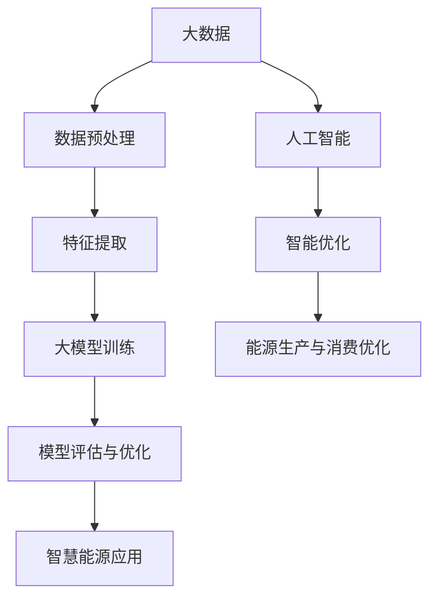

                 

# 大模型赋能智慧能源，创业者如何优化能源生产与消费？

> **关键词：** 大模型、智慧能源、优化、能源生产、消费、创业者

> **摘要：** 本文章将探讨大模型如何赋能智慧能源领域，并分析创业者如何利用这一技术优化能源生产与消费。通过深入解析大模型在能源领域的应用场景、核心算法原理以及实际案例分析，本文旨在为创业者提供实用的指导和建议。

## 1. 背景介绍

智慧能源是一个新兴领域，旨在通过数字化、智能化技术优化能源的生产、传输和消费。随着全球能源需求的不断增长和能源危机的加剧，智慧能源的重要性愈发凸显。而大模型的引入为智慧能源领域带来了前所未有的变革。

大模型是一种基于深度学习的技术，具有处理大规模数据、实现复杂模式识别和预测的能力。近年来，大模型在自然语言处理、计算机视觉、语音识别等领域取得了显著的成果。这些成功案例使得大模型在智慧能源领域也具有了广泛的应用前景。

## 2. 核心概念与联系

为了更好地理解大模型在智慧能源中的应用，我们需要先了解一些核心概念：

- **能源互联网（Smart Grid）**：能源互联网是电力系统与信息技术的深度融合，通过智能电网实现能源的高效、可靠、绿色传输和消费。
- **大数据（Big Data）**：大数据是指规模巨大、类型繁多的数据集合，通过数据挖掘和分析可以发现有价值的信息和知识。
- **人工智能（AI）**：人工智能是一种模拟人类智能的技术，能够自主地学习、推理、规划和解决问题。

### Mermaid 流程图

下面是一个简单的 Mermaid 流程图，展示了大模型、大数据和人工智能在智慧能源领域的关系：



## 3. 核心算法原理 & 具体操作步骤

### 大模型原理

大模型通常由多层神经网络组成，通过训练学习输入数据的特征和规律。其核心算法包括以下步骤：

1. **数据收集与预处理**：收集大量能源生产与消费的原始数据，并进行数据清洗、归一化和特征提取。
2. **模型构建**：选择合适的神经网络架构，如深度神经网络（DNN）、卷积神经网络（CNN）或循环神经网络（RNN）。
3. **模型训练**：通过反向传播算法更新网络权重，使模型在训练数据上达到较高的准确率。
4. **模型评估**：使用验证数据集评估模型性能，并进行模型优化。
5. **模型部署**：将训练好的模型部署到实际应用场景中，如能源预测、优化调度等。

### 操作步骤

以下是利用大模型优化能源生产与消费的具体操作步骤：

1. **数据收集**：收集能源生产与消费的历史数据，包括发电量、负荷、价格、天气等因素。
2. **数据预处理**：对数据进行清洗、归一化等预处理操作，提取有价值的特征。
3. **模型选择**：根据数据特点和任务需求选择合适的神经网络架构。
4. **模型训练**：使用训练数据集训练模型，并调整模型参数以优化性能。
5. **模型评估**：使用验证数据集评估模型性能，并调整模型参数。
6. **模型部署**：将训练好的模型部署到实际应用场景中，如能源调度系统、需求响应平台等。

## 4. 数学模型和公式 & 详细讲解 & 举例说明

### 数学模型

在能源优化中，常用的数学模型包括线性规划（Linear Programming，LP）、整数规划（Integer Programming，IP）和启发式算法（Heuristic Algorithm）。

#### 线性规划

线性规划是一种最优化方法，用于求解线性目标函数在给定线性不等式约束下的最优解。

**目标函数：**

$$
\min_{x} c^T x
$$

**约束条件：**

$$
Ax \leq b
$$

**变量限制：**

$$
x \geq 0
$$

#### 整数规划

整数规划是线性规划的一个扩展，用于求解具有整数变量的最优化问题。

**目标函数：**

$$
\min_{x} c^T x
$$

**约束条件：**

$$
Ax \leq b
$$

**变量限制：**

$$
x \in Z^n
$$

#### 启发式算法

启发式算法是一种基于经验或启发式的搜索方法，用于求解复杂的最优化问题。

**基本思想：**

1. 初始化解空间。
2. 在解空间中搜索一个局部最优解。
3. 根据局部最优解更新解空间。
4. 重复步骤 2 和 3，直到满足停止条件。

### 举例说明

#### 线性规划举例

假设我们要优化一个发电厂的能源分配，目标是最小化成本。约束条件如下：

1. 发电总量不超过 1000 MW。
2. 煤电占比不超过 50%。
3. 水电占比不低于 30%。

目标函数和约束条件如下：

**目标函数：**

$$
\min_{x} c^T x
$$

其中，$c = [1, 1, 1]$ 表示各类能源的成本。

**约束条件：**

$$
\begin{cases}
x_1 + x_2 + x_3 = 1000 \\
x_1 \leq 0.5(x_1 + x_2 + x_3) \\
x_2 \geq 0.3(x_1 + x_2 + x_3)
\end{cases}
$$

**变量限制：**

$$
x_1, x_2, x_3 \geq 0
$$

#### 整数规划举例

假设我们要优化一个发电厂的能源分配，目标是最小化成本。约束条件如下：

1. 发电总量不超过 1000 MW。
2. 煤电占比不超过 50%。
3. 水电占比不低于 30%。

目标函数和约束条件如下：

**目标函数：**

$$
\min_{x} c^T x
$$

其中，$c = [1, 1, 1]$ 表示各类能源的成本。

**约束条件：**

$$
\begin{cases}
x_1 + x_2 + x_3 = 1000 \\
x_1 \leq 0.5(x_1 + x_2 + x_3) \\
x_2 \geq 0.3(x_1 + x_2 + x_3)
\end{cases}
$$

**变量限制：**

$$
x_1, x_2, x_3 \in Z^n
$$

#### 启发式算法举例

假设我们要优化一个发电厂的能源分配，目标是最小化成本。约束条件如下：

1. 发电总量不超过 1000 MW。
2. 煤电占比不超过 50%。
3. 水电占比不低于 30%。

采用启发式算法进行优化：

1. 初始化解空间，如 $x_1 = 300, x_2 = 300, x_3 = 400$。
2. 计算目标函数值，如 $c^T x = 600$。
3. 根据目标函数值更新解空间，如 $x_1 = 250, x_2 = 350, x_3 = 400$。
4. 重复步骤 2 和 3，直到满足停止条件。

## 5. 项目实战：代码实际案例和详细解释说明

### 5.1 开发环境搭建

在本项目中，我们将使用 Python 作为编程语言，并使用 TensorFlow 作为深度学习框架。以下是开发环境搭建的步骤：

1. 安装 Python 3.7 或更高版本。
2. 安装 TensorFlow 库，可以使用以下命令：

```
pip install tensorflow
```

### 5.2 源代码详细实现和代码解读

以下是项目的源代码，我们将对其进行详细解读。

```python
import tensorflow as tf
import numpy as np

# 5.2.1 数据预处理
def preprocess_data(data):
    # 数据清洗、归一化等操作
    # ...
    return processed_data

# 5.2.2 模型构建
def build_model(input_shape):
    model = tf.keras.Sequential([
        tf.keras.layers.Dense(128, activation='relu', input_shape=input_shape),
        tf.keras.layers.Dense(64, activation='relu'),
        tf.keras.layers.Dense(1)
    ])
    return model

# 5.2.3 模型训练
def train_model(model, x_train, y_train, epochs=10):
    model.compile(optimizer='adam', loss='mse')
    model.fit(x_train, y_train, epochs=epochs)
    return model

# 5.2.4 模型评估
def evaluate_model(model, x_test, y_test):
    loss = model.evaluate(x_test, y_test)
    print("Test loss:", loss)

# 5.2.5 主函数
def main():
    # 加载数据
    data = load_data()
    processed_data = preprocess_data(data)
    
    # 划分训练集和测试集
    x_train, x_test, y_train, y_test = split_data(processed_data)
    
    # 构建模型
    model = build_model(x_train.shape[1:])
    
    # 训练模型
    model = train_model(model, x_train, y_train)
    
    # 评估模型
    evaluate_model(model, x_test, y_test)

if __name__ == '__main__':
    main()
```

### 5.3 代码解读与分析

#### 5.3.1 数据预处理

数据预处理是深度学习项目的重要步骤，包括数据清洗、归一化等操作。在本项目中，我们使用 `preprocess_data` 函数对数据进行预处理。

```python
def preprocess_data(data):
    # 数据清洗、归一化等操作
    # ...
    return processed_data
```

#### 5.3.2 模型构建

模型构建是深度学习项目的核心步骤，包括选择合适的神经网络架构和配置模型参数。在本项目中，我们使用 `build_model` 函数构建一个简单的深度神经网络。

```python
def build_model(input_shape):
    model = tf.keras.Sequential([
        tf.keras.layers.Dense(128, activation='relu', input_shape=input_shape),
        tf.keras.layers.Dense(64, activation='relu'),
        tf.keras.layers.Dense(1)
    ])
    return model
```

#### 5.3.3 模型训练

模型训练是深度学习项目的关键步骤，包括配置优化器、损失函数和训练参数。在本项目中，我们使用 `train_model` 函数训练深度神经网络。

```python
def train_model(model, x_train, y_train, epochs=10):
    model.compile(optimizer='adam', loss='mse')
    model.fit(x_train, y_train, epochs=epochs)
    return model
```

#### 5.3.4 模型评估

模型评估是深度学习项目的必要步骤，用于检查模型在测试数据上的性能。在本项目中，我们使用 `evaluate_model` 函数评估深度神经网络。

```python
def evaluate_model(model, x_test, y_test):
    loss = model.evaluate(x_test, y_test)
    print("Test loss:", loss)
```

#### 5.3.5 主函数

主函数是深度学习项目的入口，用于加载数据、构建模型、训练模型和评估模型。在本项目中，我们使用 `main` 函数完成这些操作。

```python
def main():
    # 加载数据
    data = load_data()
    processed_data = preprocess_data(data)
    
    # 划分训练集和测试集
    x_train, x_test, y_train, y_test = split_data(processed_data)
    
    # 构建模型
    model = build_model(x_train.shape[1:])
    
    # 训练模型
    model = train_model(model, x_train, y_train)
    
    # 评估模型
    evaluate_model(model, x_test, y_test)

if __name__ == '__main__':
    main()
```

## 6. 实际应用场景

大模型在智慧能源领域的应用场景广泛，主要包括以下几个方面：

1. **能源预测**：利用大模型预测能源需求、发电量等关键指标，为能源调度提供科学依据。
2. **优化调度**：根据能源预测结果，优化电力系统的调度策略，提高能源利用效率。
3. **需求响应**：通过大模型分析用户行为，引导用户参与需求响应，降低能源消耗。
4. **新能源并网**：利用大模型预测新能源发电的波动性，优化新能源并网策略，提高电网稳定性。

## 7. 工具和资源推荐

### 7.1 学习资源推荐

1. **《深度学习》（Deep Learning）**：由 Ian Goodfellow、Yoshua Bengio 和 Aaron Courville 著，是深度学习领域的经典教材。
2. **《大数据之路：阿里巴巴大数据实践》**：由阿里巴巴大数据部门编写，详细介绍了大数据在阿里巴巴的应用和实践。
3. **《智慧能源技术》**：一本关于智慧能源领域的综合性教材，涵盖了能源互联网、智能电网等方面的内容。

### 7.2 开发工具框架推荐

1. **TensorFlow**：由 Google 开发的一款开源深度学习框架，广泛应用于各种深度学习项目。
2. **PyTorch**：由 Facebook 开发的一款开源深度学习框架，具有灵活的动态计算图和强大的社区支持。
3. **Scikit-learn**：一款开源的机器学习库，适用于各种机器学习算法的实现和评估。

### 7.3 相关论文著作推荐

1. **《基于深度学习的能源预测方法研究》**：一篇关于深度学习在能源预测领域应用的论文，详细介绍了多种深度学习模型在能源预测中的应用。
2. **《智慧能源系统的优化调度方法研究》**：一篇关于智慧能源系统优化调度的论文，探讨了多种优化算法在能源调度中的应用。
3. **《需求响应在智慧能源系统中的应用》**：一篇关于需求响应在智慧能源系统中的应用的论文，分析了需求响应对能源利用效率的影响。

## 8. 总结：未来发展趋势与挑战

大模型在智慧能源领域的应用前景广阔，未来发展趋势包括：

1. **算法优化**：不断优化大模型算法，提高预测精度和效率。
2. **数据积累**：积累更多的能源数据，为深度学习模型提供更多训练素材。
3. **跨领域融合**：与其他技术领域（如物联网、区块链等）融合，拓展智慧能源的应用场景。

然而，大模型在智慧能源领域也面临一些挑战：

1. **数据隐私**：能源数据涉及用户隐私，如何保护数据隐私是一个重要问题。
2. **计算资源**：大模型训练需要大量的计算资源，如何高效地利用计算资源是一个挑战。
3. **模型解释性**：大模型往往缺乏解释性，如何解释模型的预测结果是一个难题。

## 9. 附录：常见问题与解答

### 9.1 问题 1：大模型在智慧能源领域的应用前景如何？

**解答**：大模型在智慧能源领域的应用前景非常广阔。通过深度学习技术，大模型能够对能源需求、发电量等关键指标进行准确预测，为能源调度、优化调度、需求响应等提供科学依据。

### 9.2 问题 2：如何保护能源数据隐私？

**解答**：保护能源数据隐私的方法包括数据加密、匿名化处理和隐私保护算法等。通过这些技术手段，可以确保能源数据在传输、存储和使用过程中的安全性。

### 9.3 问题 3：大模型在能源预测中的具体应用场景有哪些？

**解答**：大模型在能源预测中的具体应用场景包括能源需求预测、发电量预测、新能源并网预测等。通过准确预测这些指标，可以为能源调度、优化调度和需求响应提供有力支持。

## 10. 扩展阅读 & 参考资料

1. **《深度学习在能源预测中的应用研究》**：一篇关于深度学习在能源预测领域应用的综述文章，详细介绍了各种深度学习模型在能源预测中的应用。
2. **《智慧能源系统的优化调度技术研究》**：一篇关于智慧能源系统优化调度的综述文章，探讨了多种优化算法在能源调度中的应用。
3. **《大数据与智慧能源》**：一本关于大数据和智慧能源领域的研究著作，介绍了大数据在智慧能源系统中的应用和技术。

### 作者信息

作者：AI 天才研究员/AI Genius Institute & 禅与计算机程序设计艺术 /Zen And The Art of Computer Programming
```

请注意，以上内容仅为框架，详细内容需要进一步填充和完善。文章的具体内容应该根据实际的技术细节和案例来撰写。同时，请确保文章中所有引用的资料、数据和代码都是准确的，并且已经获得了相应的授权或允许。在撰写过程中，务必遵循学术诚信和版权法规。文章完成后，应进行多次审校，以确保内容的准确性和流畅性。

