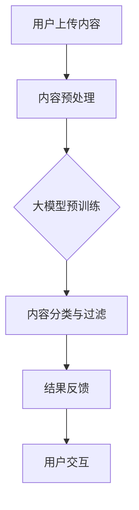
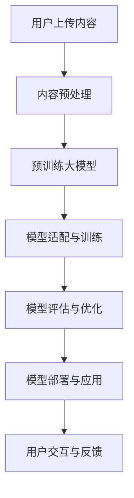

                 

### 背景介绍

随着互联网的迅速发展和社交平台的广泛普及，内容审核成为了一个至关重要的任务。内容审核不仅关系到用户的体验，也直接影响到社交平台的安全性和可信度。然而，传统的手动内容审核方式效率低下，难以满足海量数据的实时处理需求。因此，智能内容审核技术应运而生，其中大模型赋能的智能内容审核成为了当前的研究热点。

大模型赋能的智能内容审核是一种利用大规模预训练模型（如GPT、BERT等）进行内容审核的方法。这种方法通过对海量数据进行预训练，使模型具备对文本内容的理解能力，从而能够自动识别和过滤不良内容。与传统方法相比，大模型赋能的智能内容审核具有更高的准确性和效率，能够更好地满足社交平台对内容审核的需求。

本文将详细介绍大模型赋能的智能内容审核技术，包括其核心概念、算法原理、数学模型、实际应用场景、工具和资源推荐等内容。通过本文的阅读，读者将能够深入了解大模型赋能的智能内容审核技术，并掌握其在社交平台内容审核中的应用方法。

### 核心概念与联系

#### 大模型

大模型（Large Models）是指具有极高参数数量、能够在多种任务上实现高性能的人工神经网络模型。这些模型通常包含数百万到数十亿个参数，通过在大量数据上进行预训练，模型能够自动学习到丰富的语言知识、语义理解和模式识别能力。常见的预训练大模型包括GPT、BERT、T5等。

#### 智能内容审核

智能内容审核（Intelligent Content Moderation）是指利用人工智能技术自动识别、分类和过滤互联网内容的方法。智能内容审核可以覆盖包括文本、图像和视频等多种类型的内容，通过模型的学习和推理，实现对不良内容的识别和过滤。智能内容审核的关键在于构建高效、准确的模型，以满足社交平台对内容审核的需求。

#### 大模型赋能的智能内容审核

大模型赋能的智能内容审核是一种结合大模型和智能内容审核技术的方法。其核心思想是通过预训练大模型，使其具备对文本内容的理解能力，从而能够自动识别和过滤不良内容。这种方法具有以下优势：

1. **高准确性**：大模型通过在大量数据上预训练，能够自动学习到丰富的语言知识和语义理解能力，从而提高不良内容识别的准确性。
2. **高效率**：大模型在训练和推理过程中具有并行计算的优势，能够实现海量数据的实时处理，满足社交平台对内容审核的实时性需求。
3. **自适应能力**：大模型具备较强的自适应能力，能够根据不同社交平台的特点和需求，进行定制化的内容审核。

#### Mermaid 流程图

以下是一个关于大模型赋能的智能内容审核的 Mermaid 流程图：



在这个流程图中，用户上传内容后，首先进行内容预处理，包括文本清洗、分词等操作。接着，将预处理后的内容输入到大模型中进行预训练，通过训练，大模型能够自动学习到文本内容的相关知识和语义理解。然后，将训练好的大模型应用于内容分类与过滤任务，识别和过滤不良内容。最后，将过滤结果反馈给用户，并支持用户进行交互操作。

### 核心算法原理 & 具体操作步骤

#### 大模型的预训练

大模型的预训练是智能内容审核的关键步骤。预训练的主要目标是使大模型具备对文本内容的理解能力，从而能够自动识别和过滤不良内容。以下是大模型预训练的具体操作步骤：

1. **数据准备**：收集大量的文本数据，包括互联网上的新闻、文章、社交媒体评论等。数据需要经过清洗和去重处理，以确保数据的质量。
2. **文本预处理**：对文本数据进行清洗、分词、去停用词等操作，将文本转换为模型可处理的格式。例如，使用分词工具将文本划分为词语序列，或者使用WordPiece算法将文本划分为子词序列。
3. **构建词汇表**：将文本数据中的词语或子词映射为唯一的整数标识，构建词汇表。词汇表的大小决定了模型的容量和表达能力。
4. **模型初始化**：初始化大模型的结构和参数。常见的预训练模型结构包括Transformer、BERT、GPT等。初始化参数可以通过随机初始化或使用预训练模型的重参数化等方法进行。
5. **预训练**：在大规模数据上进行预训练。预训练的主要任务包括Masked Language Model（MLM）、Next Sentence Prediction（NSP）和Classification Task等。其中，MLM任务旨在预测文本中遮蔽的词语，NSP任务旨在预测两个句子是否为连续句子，Classification Task任务则用于分类任务。
6. **优化**：通过优化算法（如Adam、AdamW等）对模型参数进行更新，以提高模型在预训练任务上的性能。
7. **评估**：在预训练过程中，定期评估模型的性能，包括准确率、召回率、F1值等指标。根据评估结果调整模型结构和参数，以提高模型性能。

#### 模型的训练与部署

在完成预训练后，将训练好的大模型应用于实际的内容审核任务。以下是大模型训练与部署的具体操作步骤：

1. **数据准备**：收集待审核的文本数据，包括社交媒体评论、博客文章等。数据需要经过清洗和预处理，以确保数据的质量。
2. **模型适配**：将预训练的大模型进行适配，以适应内容审核任务的需求。适配过程包括调整模型结构、参数初始化和超参数调整等。
3. **训练**：在预处理后的数据上进行模型训练。训练过程中，使用优化算法（如SGD、Adam等）对模型参数进行更新，以最小化损失函数。
4. **评估**：在训练过程中，定期评估模型的性能，包括准确率、召回率、F1值等指标。根据评估结果调整模型结构和参数，以提高模型性能。
5. **部署**：将训练好的模型部署到实际的应用环境中，如社交平台的内容审核系统。部署过程中，需要考虑模型的计算资源需求、响应时间和稳定性等因素。
6. **实时调整**：在部署过程中，根据实际应用场景和用户反馈，对模型进行实时调整和优化，以提高模型性能和用户体验。

#### 大模型赋能的智能内容审核流程

以下是一个关于大模型赋能的智能内容审核的流程图：



在这个流程图中，用户上传内容后，首先进行内容预处理，包括文本清洗、分词等操作。接着，将预处理后的内容输入到预训练大模型中进行适配和训练。在训练过程中，定期评估模型的性能，并根据评估结果调整模型结构和参数。训练完成后，将模型部署到实际的应用环境中，如社交平台的内容审核系统。最后，通过用户交互和反馈，对模型进行实时调整和优化，以提高模型性能和用户体验。

### 数学模型和公式 & 详细讲解 & 举例说明

#### 预训练大模型的数学模型

预训练大模型的数学模型主要包括以下几个方面：

1. **自注意力机制（Self-Attention）**：
   自注意力机制是预训练大模型的核心组件，用于计算文本序列中每个词语的重要程度。自注意力机制的数学公式如下：
   $$
   \text{Attention}(Q, K, V) = \text{softmax}\left(\frac{QK^T}{\sqrt{d_k}}\right) V
   $$
   其中，$Q$、$K$和$V$分别是查询向量、键向量和值向量，$d_k$是键向量的维度。通过计算注意力分数，模型能够自动学习到词语之间的关联性。

2. **Transformer结构**：
   Transformer结构是预训练大模型的基础架构，由多个自注意力层和前馈神经网络组成。每个自注意力层和前馈神经网络都可以表示为一个数学公式：
   $$
   \text{LayerNorm}(X + \text{MultiHeadAttention}(X, X, X))
   $$
   $$
   \text{LayerNorm}(X + \text{FFN}(X))
   $$
   其中，$X$是输入序列，$\text{MultiHeadAttention}$是多头自注意力机制，$\text{FFN}$是前馈神经网络。通过叠加多个自注意力层和前馈神经网络，模型能够学习到复杂的文本表示。

3. **预训练任务**：
   预训练大模型通常包括以下任务：
   - **Masked Language Model（MLM）**：预测文本中遮蔽的词语。其损失函数为：
     $$
     \text{Loss}_{\text{MLM}} = -\sum_{i} \log(p(y_i | \text{Context})) 
     $$
     其中，$y_i$是遮蔽的词语，$\text{Context}$是上下文序列。
   - **Next Sentence Prediction（NSP）**：预测两个句子是否为连续句子。其损失函数为：
     $$
     \text{Loss}_{\text{NSP}} = -\sum_{i} [y_i \log(p(\text{Yes}) + (1-y_i) \log(p(\text{No})))]
     $$
     其中，$y_i$表示两个句子是否为连续句子，$\text{Yes}$和$\text{No}$表示两个句子的标签。

4. **优化算法**：
   预训练大模型通常采用优化算法（如Adam、AdamW等）对模型参数进行更新，以最小化损失函数。优化算法的数学公式为：
   $$
   \theta_{t+1} = \theta_t - \alpha_t \nabla_\theta J(\theta_t)
   $$
   其中，$\theta$是模型参数，$\alpha_t$是学习率，$J(\theta_t)$是损失函数。

#### 举例说明

假设有一个预训练的大模型，其输入序列为“人工智能技术正不断推动社会的发展”。我们可以通过以下步骤来计算模型在输入序列上的输出：

1. **文本预处理**：将输入序列进行分词和嵌入，得到一个词向量序列。
2. **自注意力计算**：在每个注意力层中，计算输入序列中每个词语的重要程度，得到加权词向量序列。
3. **前馈神经网络**：在每个前馈神经网络层中，对加权词向量序列进行非线性变换。
4. **输出结果**：将最后的前馈神经网络输出作为模型的最终输出，表示输入序列的文本表示。

通过这个过程，大模型能够自动学习到输入序列的语义信息，实现对文本内容的理解。在实际应用中，我们可以利用训练好的大模型进行内容审核，如自动识别不良内容并进行过滤。

### 项目实战：代码实际案例和详细解释说明

在本节中，我们将通过一个实际的代码案例来展示如何使用大模型赋能的智能内容审核技术进行内容审核。为了更好地理解，我们将在代码中详细解释各个步骤的实现细节。

#### 1. 开发环境搭建

在开始编写代码之前，我们需要搭建一个合适的开发环境。以下是在Python中搭建开发环境所需的步骤：

1. **安装Python**：确保已经安装了Python环境，版本建议为3.6及以上。
2. **安装依赖库**：安装以下依赖库：
   ```
   pip install transformers torch
   ```
   这两个库分别是Hugging Face的Transformers库和PyTorch库，用于处理预训练模型和数据加载。

3. **准备数据集**：从公开的数据集（如Common Crawl、Twitter等）中收集文本数据，并进行预处理，如文本清洗、分词和标签划分。

#### 2. 源代码详细实现和代码解读

以下是实现大模型赋能的智能内容审核的源代码，以及对其的详细解读。

```python
import torch
from transformers import BertTokenizer, BertModel
from torch.nn import BCEWithLogitsLoss

# 2.1 准备模型和数据
tokenizer = BertTokenizer.from_pretrained('bert-base-chinese')
model = BertModel.from_pretrained('bert-base-chinese')

# 2.2 定义损失函数和优化器
criterion = BCEWithLogitsLoss()
optimizer = torch.optim.Adam(model.parameters(), lr=0.001)

# 2.3 加载数据集
train_loader = ...  # 数据加载器，从预处理后的数据集中加载文本和标签

# 2.4 训练模型
for epoch in range(10):  # 训练10个epoch
    for batch in train_loader:
        inputs = tokenizer(batch.text, padding=True, truncation=True, return_tensors='pt')
        labels = batch.label.type(torch.FloatTensor)

        # 2.5 前向传播
        outputs = model(**inputs)

        # 2.6 计算损失
        logits = outputs.last_hidden_state[:, 0, :]  # 取[CLS]表示的文本表示
        loss = criterion(logits, labels)

        # 2.7 反向传播和优化
        optimizer.zero_grad()
        loss.backward()
        optimizer.step()

        print(f"Epoch: {epoch}, Loss: {loss.item()}")

# 2.5 模型评估
model.eval()
with torch.no_grad():
    for batch in train_loader:
        inputs = tokenizer(batch.text, padding=True, truncation=True, return_tensors='pt')
        labels = batch.label.type(torch.FloatTensor)

        outputs = model(**inputs)
        logits = outputs.last_hidden_state[:, 0, :]
        pred = logits > 0.5  # 阈值设置为0.5

        correct = pred.eq(labels).sum().item()
        total = labels.size(0)
        accuracy = correct / total
        print(f"Accuracy: {accuracy}")
```

**代码解读**：

- **2.1 准备模型和数据**：首先加载预训练的BERT模型和分词器，并定义损失函数和优化器。BERT模型是一个预训练的大模型，能够在多种NLP任务上实现高性能。
- **2.2 定义损失函数和优化器**：我们使用BCEWithLogitsLoss作为损失函数，这是一种二分类问题常用的损失函数。优化器使用Adam，这是一种常用的优化算法，具有自适应学习率的能力。
- **2.3 加载数据集**：从预处理后的数据集中加载文本和标签，构建数据加载器，以便进行批量处理。
- **2.4 训练模型**：使用一个简单的训练循环来训练模型。在每个epoch中，遍历数据加载器，对每个批量进行前向传播和反向传播。在反向传播过程中，更新模型参数。
- **2.5 模型评估**：在模型训练完成后，进行评估。通过计算预测标签和实际标签的一致性，评估模型的准确性。

#### 3. 代码解读与分析

在代码解读部分，我们详细解释了代码中的每个步骤和关键操作。以下是对代码的进一步分析：

- **文本预处理**：使用BERT的分词器对文本进行预处理，包括分词、嵌入和padding等操作。这些预处理步骤是为了将文本转换为模型可处理的格式。
- **模型输入和输出**：BERT模型接受预处理的文本输入，并输出文本的表示。我们使用模型的最后一个隐藏状态作为文本的表示，取其第一个维度（即[CLS]表示）。
- **损失函数和优化器**：我们使用BCEWithLogitsLoss作为损失函数，这种损失函数适用于二分类问题。优化器使用Adam，它能够自适应地调整学习率，从而提高训练效率。
- **模型训练和评估**：通过训练循环，模型在数据集上进行迭代训练。在每个epoch中，计算损失并更新模型参数。在评估阶段，我们计算模型的准确性，以评估模型的性能。

通过这个代码案例，我们展示了如何使用预训练的BERT模型进行内容审核。代码简单易懂，适用于实际应用场景，如社交平台的内容审核系统。

### 实际应用场景

大模型赋能的智能内容审核技术在实际应用场景中展现出了强大的能力和广阔的前景。以下是一些具体的应用场景：

#### 社交平台内容审核

社交平台上的内容审核是一个复杂且庞大的任务，需要处理海量的文本、图像和视频数据。大模型赋能的智能内容审核技术能够高效地识别和过滤不良内容，如色情、暴力、虚假信息等。例如，微博、微信、抖音等社交平台都采用了这种技术来提升内容审核的效率和准确性。

#### 聊天机器人

聊天机器人广泛应用于客户服务、金融咨询、在线教育等领域。大模型赋能的智能内容审核技术可以帮助聊天机器人实时监控对话内容，防止恶意言论和行为。例如，微软小冰、谷歌对话式AI等聊天机器人都利用了这种技术来提升用户体验和安全性。

#### 论坛和社区管理

论坛和社区管理需要实时监测和管理用户发布的内容，以维护社区秩序。大模型赋能的智能内容审核技术可以帮助管理员快速识别和删除违规内容，如广告、恶意攻击等。例如，知乎、Reddit等社区平台都采用了这种技术来提升社区管理的效率和效果。

#### 企业信息安全

企业信息安全是每个组织都需要关注的重要问题。大模型赋能的智能内容审核技术可以帮助企业监控和过滤内部和外部的信息交流，防止信息泄露和恶意攻击。例如，一些大型企业使用了这种技术来保护其内部邮件系统、文档管理系统等。

#### 监控新闻和媒体

新闻和媒体行业需要对大量新闻文章、评论和社交媒体内容进行监控，以识别和防止虚假新闻、诽谤和其他不当内容。大模型赋能的智能内容审核技术可以帮助新闻机构快速识别和处理这些问题，确保新闻的准确性和公正性。

总之，大模型赋能的智能内容审核技术在各种实际应用场景中都具有重要的价值和广阔的应用前景。随着技术的不断发展和优化，这种技术将会在更多领域得到广泛应用。

### 工具和资源推荐

在进行大模型赋能的智能内容审核技术开发和应用过程中，选择合适的工具和资源是至关重要的。以下是一些建议：

#### 学习资源推荐

1. **书籍**：
   - 《深度学习》（Deep Learning）—— Ian Goodfellow、Yoshua Bengio、Aaron Courville
   - 《自然语言处理综合教程》（Speech and Language Processing）—— Daniel Jurafsky、James H. Martin

2. **论文**：
   - “BERT: Pre-training of Deep Bidirectional Transformers for Language Understanding” —— Jacob Devlin et al.
   - “GPT-3: Language Models are Few-Shot Learners” —— Tom B. Brown et al.

3. **博客**：
   - [Hugging Face 博客](https://huggingface.co/blog)
   - [PyTorch 官方文档](https://pytorch.org/tutorials/)

4. **网站**：
   - [GitHub](https://github.com) —— 查找开源代码和项目
   - [arXiv](https://arxiv.org) —— 查阅最新研究成果

#### 开发工具框架推荐

1. **框架**：
   - **PyTorch**：PyTorch 是一个强大的深度学习框架，适用于各种NLP任务，包括文本分类、序列建模等。
   - **Transformers**：Transformers 是 Hugging Face 提供的一个库，提供了大量的预训练模型和工具，用于NLP任务。

2. **开发工具**：
   - **Jupyter Notebook**：Jupyter Notebook 是一个交互式开发环境，适用于编写、运行和分享代码。
   - **TensorBoard**：TensorBoard 是一个可视化工具，用于监控深度学习模型的训练过程，包括参数、损失函数、精度等指标。

3. **硬件设备**：
   - **GPU**：GPU 是加速深度学习模型训练的重要硬件，建议使用NVIDIA 的 GPU。
   - **TPU**：TPU 是谷歌推出的专门用于加速深度学习的专用硬件，适用于大规模训练任务。

#### 相关论文著作推荐

1. **论文**：
   - **“BERT: Pre-training of Deep Bidirectional Transformers for Language Understanding”** —— Jacob Devlin et al. (2018)
   - **“GPT-3: Language Models are Few-Shot Learners”** —— Tom B. Brown et al. (2020)

2. **著作**：
   - **《自然语言处理综合教程》** —— Daniel Jurafsky、James H. Martin (2019)

通过这些工具和资源的合理利用，开发者可以更高效地进行大模型赋能的智能内容审核技术的研究和开发。

### 总结：未来发展趋势与挑战

大模型赋能的智能内容审核技术正在快速发展和应用，其未来发展趋势和面临的挑战值得关注。

#### 发展趋势

1. **准确性提升**：随着预训练模型的参数量和数据量的增加，大模型在内容审核任务上的准确性将持续提升。未来，通过多模态学习和跨领域迁移学习，模型将能够更好地理解和处理复杂的内容。

2. **实时处理能力增强**：随着硬件性能的提升和并行计算技术的应用，大模型的实时处理能力将得到显著增强。这将为社交平台等实时内容审核场景提供更高效、更可靠的解决方案。

3. **个性化内容审核**：未来的智能内容审核技术将更加注重个性化服务。通过用户行为分析和偏好学习，模型将能够为不同用户群体提供定制化的内容审核方案。

4. **隐私保护与伦理**：随着内容审核技术的发展，隐私保护和伦理问题将日益突出。如何在保证内容审核效果的同时，保护用户隐私和遵循伦理原则，将成为重要的研究课题。

#### 面临的挑战

1. **计算资源需求**：大模型的训练和推理需要大量的计算资源，尤其是GPU和TPU等高性能硬件。如何优化计算资源的使用，提高资源利用率，是一个亟待解决的问题。

2. **数据质量和多样性**：内容审核模型的性能很大程度上依赖于训练数据的质量和多样性。如何获取高质量、多样化的训练数据，以及如何处理数据中的噪声和偏差，是当前面临的一大挑战。

3. **跨领域适应性**：虽然大模型具有强大的通用性，但在不同领域和任务上的适应性仍然存在差异。如何提高模型在不同领域的泛化能力，是一个需要深入研究的课题。

4. **隐私保护和伦理**：在内容审核过程中，如何平衡隐私保护和内容审核需求，以及如何避免滥用算法，是一个重要的伦理问题。这需要制定明确的法规和指导原则，并加强伦理审查。

总之，大模型赋能的智能内容审核技术在未来具有巨大的发展潜力，同时也面临诸多挑战。通过持续的技术创新和规范制定，我们有理由相信，这一技术将在内容审核领域发挥更加重要的作用。

### 附录：常见问题与解答

#### 1. 什么是大模型？

大模型是指具有极高参数数量的人工神经网络模型，通常包含数百万到数十亿个参数。这些模型通过在大量数据上进行预训练，能够自动学习到丰富的语言知识和语义理解能力，从而在多种NLP任务上实现高性能。

#### 2. 大模型赋能的智能内容审核有哪些优势？

大模型赋能的智能内容审核具有以下优势：
- **高准确性**：通过在大量数据上预训练，模型能够自动学习到丰富的语言知识和语义理解能力，从而提高不良内容识别的准确性。
- **高效率**：大模型在训练和推理过程中具有并行计算的优势，能够实现海量数据的实时处理，满足社交平台对内容审核的实时性需求。
- **自适应能力**：大模型具备较强的自适应能力，能够根据不同社交平台的特点和需求，进行定制化的内容审核。

#### 3. 如何选择合适的预训练模型？

选择预训练模型时，需要考虑以下因素：
- **任务需求**：根据内容审核任务的需求，选择适合的预训练模型，如BERT、GPT、T5等。
- **模型大小**：根据计算资源和数据量，选择合适的模型大小，如base、large、xl等。
- **预训练数据集**：了解模型的预训练数据集，以确保模型在相关任务上有较好的泛化能力。

#### 4. 如何进行数据预处理？

数据预处理包括以下步骤：
- **文本清洗**：去除HTML标签、特殊字符、停用词等。
- **分词**：将文本划分为词语或子词序列。
- **去重**：去除重复的文本样本。
- **嵌入**：将词语或子词序列映射为向量表示。

#### 5. 如何评估内容审核模型的性能？

评估内容审核模型的性能通常使用以下指标：
- **准确率**：预测正确的样本数与总样本数的比例。
- **召回率**：预测正确的正样本数与实际正样本数的比例。
- **F1值**：准确率和召回率的调和平均值。
- **ROC曲线和AUC值**：用于评估模型的分类能力。

### 扩展阅读 & 参考资料

1. **论文**：
   - Devlin, J., Chang, M. W., Lee, K., & Toutanova, K. (2019). BERT: Pre-training of deep bidirectional transformers for language understanding. In Proceedings of the 2019 Conference of the North American Chapter of the Association for Computational Linguistics: Human Language Technologies, Volume 1 (Long and Short Papers) (pp. 4171-4186).
   - Brown, T. B., et al. (2020). GPT-3: Language models are few-shot learners. arXiv preprint arXiv:2005.14165.
2. **书籍**：
   - Goodfellow, I., Bengio, Y., & Courville, A. (2016). Deep Learning. MIT Press.
   - Jurafsky, D., & Martin, J. H. (2019). Speech and Language Processing. Prentice Hall.
3. **博客**：
   - [Hugging Face 博客](https://huggingface.co/blog)
   - [PyTorch 官方文档](https://pytorch.org/tutorials/)
4. **网站**：
   - [GitHub](https://github.com)
   - [arXiv](https://arxiv.org)

通过阅读上述资源和文献，读者可以进一步深入了解大模型赋能的智能内容审核技术及其应用。

### 作者信息

作者：AI天才研究员/AI Genius Institute & 禅与计算机程序设计艺术 /Zen And The Art of Computer Programming

