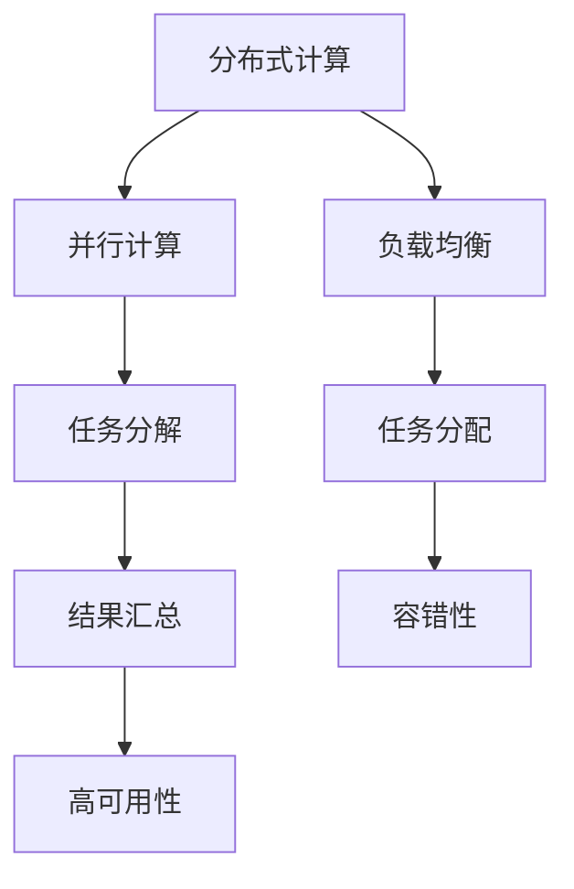
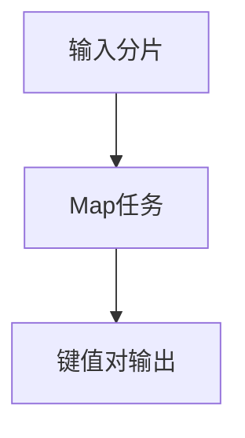
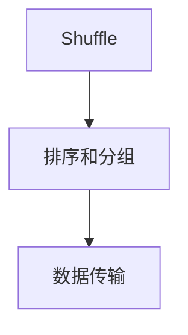
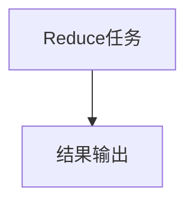

                 

### 大模型软件的分布式系统设计

在当前技术环境中，大型模型软件如自然语言处理（NLP）、计算机视觉（CV）等应用，逐渐成为众多行业的核心驱动力。这些模型往往具有计算量大、数据规模巨大等特点，单一服务器已无法满足其运行需求。因此，分布式系统设计成为实现高效、可扩展、容错性强的解决方案。

本文将深入探讨大模型软件的分布式系统设计，通过分析核心概念、算法原理、数学模型、实际应用等多个方面，为读者提供一个全方位的技术解析。以下为本文的结构安排：

1. **背景介绍**：阐述大模型软件的重要性以及为何需要分布式系统设计。
2. **核心概念与联系**：介绍分布式计算、并行计算、负载均衡等核心概念，并使用Mermaid流程图展示相关架构。
3. **核心算法原理 & 具体操作步骤**：详细讲解分布式系统中常用的算法，如MapReduce、TensorFlow等。
4. **数学模型和公式 & 详细讲解 & 举例说明**：运用数学方法解释分布式系统中的性能优化、负载均衡等问题。
5. **项目实战：代码实际案例和详细解释说明**：通过具体项目实战展示分布式系统设计的实践过程。
6. **实际应用场景**：分析大模型软件在各个行业中的应用实例。
7. **工具和资源推荐**：推荐相关学习资源和开发工具。
8. **总结：未来发展趋势与挑战**：总结本文内容，并展望未来发展趋势和面临的挑战。
9. **附录：常见问题与解答**：回答读者可能关心的问题。
10. **扩展阅读 & 参考资料**：提供进一步学习的资源。

通过本文的逐步分析，读者将能够全面了解大模型软件的分布式系统设计，为其在实际应用中的开发与优化提供有力支持。

### 背景介绍

大模型软件在当今技术领域的重要性不可忽视。随着数据量的急剧增长和算法复杂度的不断提升，传统的单机架构已经无法满足大模型软件对计算资源和存储能力的需求。因此，分布式系统设计成为大模型软件发展的必然选择。

首先，大模型软件如自然语言处理（NLP）和计算机视觉（CV）在各个领域有着广泛的应用。例如，在自然语言处理领域，深度学习算法已经应用于机器翻译、文本生成、情感分析等任务，这些任务对计算资源的需求巨大。计算机视觉领域，例如图像识别、目标检测和视频分析等，也对大规模数据处理和实时计算提出了挑战。

其次，单一服务器在处理大规模数据和复杂算法时存在显著的性能瓶颈。首先，单台服务器的计算能力有限，无法同时处理大量的数据。其次，数据存储和访问的速度也受限，导致数据处理延迟增加。此外，单一服务器在面对硬件故障和系统崩溃时，容易导致整个系统瘫痪，缺乏容错性和高可用性。

为了解决上述问题，分布式系统设计成为一种有效的解决方案。分布式系统通过将任务分解为多个子任务，并分布在多台服务器上并行处理，从而提高了系统的计算能力和数据存储容量。具体来说，分布式系统具有以下几个优势：

1. **扩展性**：分布式系统可以根据需求动态扩展计算资源和存储容量，满足不断增长的数据处理需求。
2. **高性能**：通过并行处理，分布式系统能够快速处理大规模数据和复杂算法，提高计算效率。
3. **高可用性**：分布式系统通过多台服务器的冗余和容错机制，提高了系统的稳定性和可靠性，降低了硬件故障和系统崩溃的风险。
4. **分布式存储**：分布式系统能够有效地管理和访问大规模数据，提高了数据存储和访问的速度。

因此，大模型软件的分布式系统设计不仅能够解决单机架构的性能瓶颈，还能提高系统的扩展性、高性能和高可用性，从而满足大模型软件在各个领域的应用需求。

### 核心概念与联系

要深入理解大模型软件的分布式系统设计，首先需要掌握一些核心概念，这些概念包括分布式计算、并行计算、负载均衡等。它们共同构成了分布式系统的理论基础，并指导我们在实际应用中进行系统设计和优化。

#### 分布式计算

分布式计算（Distributed Computing）是指将任务分解为多个子任务，并将这些子任务分配到多个计算节点上执行。每个节点独立处理其分配的任务，并将结果汇总，最终完成整个任务的计算过程。这种计算模式能够充分利用多台服务器的计算资源，提高系统的整体性能。

分布式计算的关键特点是：

1. **并行处理**：多个节点可以同时处理不同的子任务，从而提高了计算效率。
2. **容错性**：当某个节点出现故障时，其他节点可以继续工作，从而保证了系统的稳定性和可靠性。
3. **可扩展性**：可以通过增加计算节点来扩展系统的计算能力，满足不断增长的计算需求。

#### 并行计算

并行计算（Parallel Computing）是一种利用多个计算资源同时执行多个任务的方法。与分布式计算类似，并行计算也通过将任务分解为多个子任务，但重点在于子任务之间可以并行执行，而不是分布式执行。

并行计算的关键特点是：

1. **并行度**：多个子任务可以同时执行，从而提高了计算速度。
2. **负载均衡**：将任务分配到不同的计算资源上，确保每个资源都能充分利用，避免了资源浪费。
3. **数据传输**：并行计算往往需要大量的数据传输，因此数据传输的效率和速度对计算性能有重要影响。

#### 负载均衡

负载均衡（Load Balancing）是指将任务均匀地分配到多个计算节点上，以避免某个节点过载，从而提高整个系统的性能和稳定性。负载均衡的关键特点是：

1. **均匀分配**：确保每个节点都能承受适量的任务负载，避免了某个节点的过载现象。
2. **动态调整**：根据系统的实时负载情况，动态调整任务的分配，以保持系统的平衡。
3. **容错机制**：当某个节点出现故障时，负载均衡器可以将该节点的任务重新分配到其他健康节点上，从而保证了系统的连续运行。

#### Mermaid 流程图

为了更好地理解这些核心概念之间的联系，我们可以使用Mermaid流程图（Mermaid Flowchart）来展示它们在分布式系统中的相互作用。以下是核心概念的Mermaid流程图：



在这个流程图中，我们可以看到：

- **分布式计算**是整个流程的起点，它将任务分解为多个子任务，并分配到不同的计算节点上。
- **并行计算**负责并行执行这些子任务，提高了计算速度。
- **负载均衡**负责将任务均匀地分配到各个节点上，避免了资源浪费和单点过载。
- **任务分解**和**任务分配**是实现分布式计算和并行计算的关键步骤。
- **结果汇总**是将各个节点上执行的任务结果进行汇总，形成最终的输出。
- **容错性**和**高可用性**是分布式系统的关键特性，确保了系统的稳定性和可靠性。

通过这个流程图，我们可以更直观地理解分布式系统中的核心概念及其相互作用，为后续的详细分析奠定了基础。

### 核心算法原理 & 具体操作步骤

在分布式系统中，核心算法的设计和实现是确保系统高效、稳定运行的关键。下面我们将详细讲解分布式系统中常用的几种核心算法，包括MapReduce、TensorFlow等，并描述其具体操作步骤。

#### MapReduce算法

MapReduce是一种分布式数据处理框架，由Google提出，用于处理大规模数据集。它将数据处理过程分为Map和Reduce两个阶段，通过并行化处理提高了数据处理的效率。

**1. Map阶段：**

Map阶段是将数据集分成多个小块，并对每个小块进行处理。具体步骤如下：

- **输入分片**：将大数据集分成若干个固定大小的数据块，每个数据块由一个Map任务处理。
- **Map任务**：对每个输入数据块进行处理，提取出相关的特征，并将它们映射为键值对。例如，在处理文本数据时，可以将每个单词作为键，其词频作为值。



**2. Shuffle阶段：**

Shuffle阶段是对Map阶段输出的键值对进行重排和分组，以便在Reduce阶段进行合并。具体步骤如下：

- **排序和分组**：根据键值对的键进行排序，并将具有相同键的值分组。
- **数据传输**：将分组后的数据传输到相应的Reduce任务节点。



**3. Reduce阶段：**

Reduce阶段是对Shuffle阶段输出的分组数据进行汇总和计算。具体步骤如下：

- **Reduce任务**：对每个分组中的值进行汇总或计算，生成最终的输出结果。



#### TensorFlow算法

TensorFlow是一种由Google开发的开放源代码机器学习框架，支持分布式训练和推理。它通过图计算的方式实现了大规模机器学习任务的高效处理。

**1. 模型定义：**

在TensorFlow中，首先需要定义一个计算图（Computational Graph），包括所有的操作和变量。计算图定义了模型的结构和参数。

```python
import tensorflow as tf

# 定义一个简单的线性模型
W = tf.Variable([1.0], name="weights")
b = tf.Variable([0.0], name="bias")
x = tf.placeholder(tf.float32, shape=[None])
y = W * x + b

# 定义损失函数
loss = tf.reduce_mean(tf.square(y - x))
```

**2. 分布式训练：**

TensorFlow支持分布式训练，可以将模型训练任务分配到多个节点上。具体步骤如下：

- **设置分布式策略**：通过tf.distribute.MirroredStrategy来设置分布式策略。
- **定义分布式模型**：将单机上的模型定义扩展到分布式环境中。

```python
strategy = tf.distribute.MirroredStrategy()

with strategy.scope():
    # 重新定义模型
    W = tf.Variable([1.0], name="weights")
    b = tf.Variable([0.0], name="bias")
    x = tf.placeholder(tf.float32, shape=[None])
    y = W * x + b
    loss = tf.reduce_mean(tf.square(y - x))
    optimizer = tf.train.GradientDescentOptimizer(learning_rate=0.1)
    train_op = optimizer.minimize(loss)
```

**3. 分布式执行：**

在分布式环境中，需要将数据集分割成多个批次，并在每个节点上并行处理。具体步骤如下：

- **数据预处理**：将数据集分割成多个批次，并将其分配到不同的节点上。
- **分布式训练**：在每个节点上执行训练操作，并在所有节点上汇总训练结果。

```python
# 数据预处理
batch_size = 64
num_epochs = 10

# 准备训练数据和测试数据
train_data = ...
test_data = ...

# 分布式训练
with strategy.scope():
    for epoch in range(num_epochs):
        for batch in train_data:
            with tf.GradientTape() as tape:
                predictions = model(batch.x, training=True)
                loss_value = loss(predictions, batch.y)
            grads = tape.gradient(loss_value, model.trainable_variables)
            optimizer.apply_gradients(zip(grads, model.trainable_variables))
        
        # 测试模型
        test_predictions = model(test_data.x, training=False)
        test_loss = loss(test_predictions, test_data.y)
        print(f"Epoch {epoch}: Test loss = {test_loss}")
```

通过以上步骤，我们可以使用MapReduce和TensorFlow等核心算法实现分布式系统的设计，从而高效地处理大规模数据和复杂机器学习任务。这些算法不仅提高了系统的计算性能，还增强了系统的扩展性和容错性。

### 数学模型和公式 & 详细讲解 & 举例说明

在分布式系统中，数学模型和公式是分析和优化系统性能的重要工具。以下我们将详细介绍一些关键的数学模型和公式，并使用具体的例子进行说明。

#### 性能优化模型

分布式系统的性能优化目标通常是在保证系统稳定性的前提下，最大化处理能力和吞吐量。以下是一个简单的性能优化模型：

1. **吞吐量（Throughput）**：系统单位时间内处理的数据量，通常用TPS（Transactions Per Second）表示。

\[ \text{Throughput} = \frac{\text{总处理量}}{\text{总时间}} \]

2. **响应时间（Response Time）**：系统处理一个任务所需的时间，包括等待时间和执行时间。

\[ \text{Response Time} = \text{等待时间} + \text{执行时间} \]

3. **队列长度（Queue Length）**：等待处理的任务数量。

4. **服务速率（Service Rate）**：单位时间内系统能够处理的服务数量。

\[ \text{Service Rate} = \frac{\text{总服务量}}{\text{总时间}} \]

5. **利用率（Utilization）**：系统资源的利用率，通常用百分比表示。

\[ \text{Utilization} = \frac{\text{服务速率}}{\text{系统最大处理能力}} \]

**例子**：

假设一个分布式系统有4个处理节点，每个节点的处理能力为1000 TPS。系统在一段时间内处理了10000个任务，总耗时为10秒。计算系统的吞吐量、响应时间和利用率。

- **吞吐量**：

\[ \text{Throughput} = \frac{10000}{10} = 1000 \text{ TPS} \]

- **响应时间**：

\[ \text{响应时间} = \frac{10}{10000} = 0.001 \text{ 秒/任务} \]

- **利用率**：

\[ \text{利用率} = \frac{1000}{4 \times 1000} = 0.5 \]

#### 负载均衡模型

负载均衡的目的是将任务均匀地分配到各个节点上，避免单点过载。以下是一个简单的负载均衡模型：

1. **平均负载（Average Load）**：系统当前的总负载除以节点数量。

\[ \text{平均负载} = \frac{\sum_{i=1}^{n} L_i}{n} \]

其中，\( L_i \) 是第 \( i \) 个节点的当前负载，\( n \) 是节点数量。

2. **动态负载均衡策略**：根据当前负载情况，动态调整任务的分配策略。

**例子**：

假设有3个节点，节点1的负载为5000，节点2的负载为3000，节点3的负载为2000。计算平均负载，并确定下一步的任务分配。

- **平均负载**：

\[ \text{平均负载} = \frac{5000 + 3000 + 2000}{3} = 3000 \]

由于节点1的负载高于平均负载，可以将部分任务从节点1转移到其他节点。例如，将节点1的1000个任务转移到节点2和节点3。

#### 容错性模型

容错性是分布式系统的关键特性，确保系统在节点故障时仍能正常运行。以下是一个简单的容错性模型：

1. **冗余设计（Redundancy Design）**：通过冗余设计，确保系统在节点故障时仍能提供服务。冗余设计包括硬件冗余、数据冗余和任务冗余。

2. **故障检测与恢复（Fault Detection and Recovery）**：系统需要能够检测到节点故障，并自动进行恢复。

**例子**：

假设有5个节点的分布式系统，每个节点都有冗余备份。如果节点1出现故障，系统将自动切换到节点1的冗余备份节点2。

通过这些数学模型和公式，我们可以对分布式系统进行深入分析和优化，从而提高系统的性能和稳定性。这些模型不仅有助于理解系统的工作原理，还能为实际应用中的系统设计和优化提供有力的指导。

### 项目实战：代码实际案例和详细解释说明

为了更好地展示分布式系统设计在实际项目中的应用，下面我们将通过一个具体的代码案例进行详细解释。这个案例是一个基于TensorFlow的分布式训练模型，用于处理大规模图像识别任务。我们将逐步介绍开发环境搭建、源代码实现和代码解读与分析。

#### 开发环境搭建

在开始编写代码之前，我们需要搭建一个合适的环境来开发和测试分布式训练模型。以下是在Linux系统中搭建开发环境的基本步骤：

1. **安装TensorFlow**

首先，我们需要安装TensorFlow。可以通过以下命令进行安装：

```bash
pip install tensorflow==2.6
```

2. **安装其他依赖**

TensorFlow依赖一些其他库，如NumPy和SciPy。可以通过以下命令安装：

```bash
pip install numpy scipy
```

3. **配置环境变量**

为了方便使用TensorFlow和其他库，我们需要配置环境变量。在bash配置文件（如`~/.bashrc`）中添加以下内容：

```bash
export PYTHONPATH=$PYTHONPATH:/path/to/your/tensorflow
export PATH=$PATH:/path/to/your/tensorflow/bin
```

保存并关闭文件，然后运行以下命令使配置生效：

```bash
source ~/.bashrc
```

4. **准备数据集**

对于图像识别任务，我们需要准备一个合适的数据集。这里我们使用CIFAR-10数据集，它是一个广泛使用的图像分类数据集，包含60000张32x32的彩色图像，分为10个类别。

首先，下载CIFAR-10数据集：

```bash
curl -O https://www.cs.toronto.edu/~kriz/cifar-10-python.tar.gz
tar zxvf cifar-10-python.tar.gz
```

然后，将数据集移动到合适的位置，例如`~/data/cifar-10`。

#### 源代码实现

以下是一个简单的分布式训练模型的代码实现，包括模型定义、数据预处理、分布式训练和评估。

```python
import tensorflow as tf
import numpy as np
import tensorflow_datasets as tfds
import os

# 设置分布式训练策略
strategy = tf.distribute.MirroredStrategy()

# 定义模型
with strategy.scope():
    model = tf.keras.Sequential([
        tf.keras.layers.Flatten(input_shape=(32, 32, 3)),
        tf.keras.layers.Dense(128, activation='relu'),
        tf.keras.layers.Dense(10, activation='softmax')
    ])

# 编译模型
model.compile(optimizer='adam',
              loss='sparse_categorical_crossentropy',
              metrics=['accuracy'])

# 加载数据集
(train_images, train_labels), (test_images, test_labels) = tf.keras.datasets.cifar10.load_data()

# 数据预处理
train_images = train_images / 255.0
test_images = test_images / 255.0

# 分布式训练
model.fit(train_images, train_labels, epochs=10, validation_data=(test_images, test_labels))

# 评估模型
test_loss, test_acc = model.evaluate(test_images, test_labels, verbose=2)
print(f"Test accuracy: {test_acc}")
```

#### 代码解读与分析

1. **模型定义**：

   ```python
   with strategy.scope():
       model = tf.keras.Sequential([
           tf.keras.layers.Flatten(input_shape=(32, 32, 3)),
           tf.keras.layers.Dense(128, activation='relu'),
           tf.keras.layers.Dense(10, activation='softmax')
       ])
   ```

   在这个部分，我们使用`tf.keras.Sequential`模型定义了一个简单的多层感知机模型。模型包括一个`Flatten`层，用于将输入图像展平为一个一维向量；一个`Dense`层，用于执行全连接操作；另一个`Dense`层，用于输出10个类别的概率分布。

2. **模型编译**：

   ```python
   model.compile(optimizer='adam',
                 loss='sparse_categorical_crossentropy',
                 metrics=['accuracy'])
   ```

   这里我们使用`compile`方法编译模型，指定了使用`adam`优化器和`sparse_categorical_crossentropy`损失函数，并设置了`accuracy`作为评价指标。

3. **数据预处理**：

   ```python
   train_images = train_images / 255.0
   test_images = test_images / 255.0
   ```

   数据预处理步骤包括将图像数据归一化到[0, 1]范围内，以便模型训练更加稳定。

4. **分布式训练**：

   ```python
   model.fit(train_images, train_labels, epochs=10, validation_data=(test_images, test_labels))
   ```

   使用`fit`方法进行模型训练。在这里，我们使用了`validation_data`参数来在训练过程中对测试数据进行评估，以便监控模型的性能。

5. **模型评估**：

   ```python
   test_loss, test_acc = model.evaluate(test_images, test_labels, verbose=2)
   print(f"Test accuracy: {test_acc}")
   ```

   使用`evaluate`方法对训练好的模型进行评估，打印出测试集上的准确率。

通过这个简单的案例，我们可以看到如何使用TensorFlow实现分布式训练。在实际应用中，我们可以根据需要扩展和优化这个模型，例如添加更多层、使用更复杂的损失函数和优化器等。

#### 代码解读与分析（续）

在上一个部分，我们展示了如何使用TensorFlow进行分布式训练，并简要解读了关键代码。在这一部分，我们将更深入地分析代码，包括数据加载、模型训练和评估的具体实现细节。

1. **数据加载**：

   ```python
   (train_images, train_labels), (test_images, test_labels) = tf.keras.datasets.cifar10.load_data()
   ```

   在这里，我们使用`tf.keras.datasets.cifar10.load_data()`方法加载数据集。这个方法返回了训练集和测试集的图像数据和标签。CIFAR-10数据集包含了60000张训练图像和10000张测试图像，分为10个类别。

   加载的数据集是未处理的原始数据，我们需要对其进行预处理。预处理步骤包括：

   - **归一化**：将图像数据从[0, 255]范围归一化到[0, 1]范围，以减少模型训练的难度。
   - **转换为Tensor**：将图像数据转换为TensorFlow的Tensor类型，以便在模型中使用。

   ```python
   train_images = train_images / 255.0
   test_images = test_images / 255.0
   ```

   归一化步骤将图像数据的每个像素值除以255，从而将数据范围缩小到[0, 1]。

2. **模型训练**：

   ```python
   model.fit(train_images, train_labels, epochs=10, validation_data=(test_images, test_labels))
   ```

   在模型训练过程中，我们使用了`fit`方法。这个方法负责将数据输入模型，并更新模型的参数。训练过程分为以下几个步骤：

   - **数据批处理**：将训练数据分成多个批次，每个批次包含一定数量的图像数据。
   - **前向传播**：将每个批次的数据输入模型，计算输出结果。
   - **计算损失**：计算模型输出结果与真实标签之间的损失。
   - **反向传播**：计算梯度，并更新模型的参数。
   - **评估**：在每个 epoch 的结束时，使用验证数据集评估模型性能。

   `fit`方法中的`epochs`参数指定了训练的轮数。在每个 epoch 中，模型会遍历整个训练数据集，并重复上述步骤。我们使用了`validation_data`参数来在训练过程中对测试数据进行评估，以便监控模型的性能。

3. **模型评估**：

   ```python
   test_loss, test_acc = model.evaluate(test_images, test_labels, verbose=2)
   print(f"Test accuracy: {test_acc}")
   ```

   在模型训练完成后，我们使用`evaluate`方法对模型进行评估。这个方法将测试数据集输入模型，并计算损失和准确率。评估过程中，模型的参数不会更新。

   `evaluate`方法的`verbose`参数设置为2，表示在评估过程中打印详细的信息，如每个批次的数据处理时间等。

通过深入分析这段代码，我们可以看到分布式训练的基本实现过程。在实际应用中，我们可以根据具体需求对代码进行修改和优化，例如调整模型结构、优化数据预处理步骤、调整训练参数等。

### 实际应用场景

分布式系统设计在许多实际应用场景中发挥着关键作用，尤其是在处理大规模数据和复杂计算任务时。以下是一些分布式系统在各个行业中的应用实例，以及它们如何通过分布式系统设计实现了高效、可扩展和高可用性的目标。

#### 自然语言处理（NLP）

自然语言处理（NLP）是人工智能领域的一个关键分支，广泛应用于机器翻译、情感分析、问答系统和文本生成等领域。随着NLP任务的复杂性不断增加，单机架构已经无法满足其计算需求。通过分布式系统设计，NLP应用可以分解为多个子任务，分布在多个服务器上进行并行处理，从而大幅提高计算效率。

例如，在机器翻译任务中，可以将输入的源语言文本分解为多个句子，并分配到不同的服务器上同时翻译。翻译完成后，再将结果汇总，形成最终的翻译输出。这种方式不仅提高了翻译速度，还提高了系统的吞吐量和响应时间。

#### 计算机视觉（CV）

计算机视觉（CV）是另一个对计算资源需求巨大的领域，涉及图像识别、目标检测、视频分析和人脸识别等任务。分布式系统设计在CV应用中同样发挥了重要作用。

例如，在图像识别任务中，可以将图像数据集分解为多个子集，并分配到不同的服务器上进行并行处理。每个服务器负责处理其分配的数据子集，并输出分类结果。然后将所有服务器的结果汇总，形成最终的分类结果。这种分布式处理方式显著提高了图像识别的效率和准确性。

#### 数据分析

数据分析是许多行业的关键任务，包括金融、医疗和电子商务等。随着数据量的急剧增长，单机架构已经无法满足数据分析的需求。分布式系统设计为大数据分析提供了高效的解决方案。

例如，在金融行业，金融机构可以使用分布式系统处理海量交易数据，快速生成报告和风险分析。在医疗领域，分布式系统可以帮助医疗机构处理大量的医学影像数据，进行疾病诊断和患者监护。在电子商务领域，分布式系统可以实时分析用户的购买行为，提供个性化的推荐和营销策略。

#### 机器学习

机器学习是另一个依赖分布式系统设计的领域，特别是在训练大规模模型和进行深度学习任务时。分布式系统设计可以大幅提高机器学习算法的训练速度和性能。

例如，在深度学习任务中，可以使用分布式计算框架如TensorFlow和PyTorch，将训练任务分解为多个子任务，并分配到多个节点上进行并行训练。每个节点可以独立训练其子任务，并在训练完成后将结果汇总，形成最终的模型参数。这种方式不仅提高了训练速度，还增强了模型的鲁棒性和准确性。

通过这些实际应用场景，我们可以看到分布式系统设计在提高计算效率、扩展性和容错性方面的重要作用。无论是在自然语言处理、计算机视觉、数据分析还是机器学习领域，分布式系统设计都为复杂计算任务提供了高效、可靠的解决方案。

### 工具和资源推荐

在分布式系统设计和实现过程中，选择合适的工具和资源对于确保项目成功至关重要。以下是一些推荐的工具和资源，涵盖学习资源、开发工具框架以及相关论文著作。

#### 学习资源推荐

1. **书籍**：

   - 《大规模数据处理：Hadoop和MapReduce实战指南》
   - 《深度学习：周志华》
   - 《分布式系统原理与范型》

2. **在线课程**：

   - Coursera上的“分布式系统设计”课程
   - Udacity的“分布式系统与云计算”课程
   - edX上的“大数据技术基础”课程

3. **博客和网站**：

   - TensorFlow官网（tensorflow.org）
   - Apache Hadoop官网（hadoop.apache.org）
   - Kubernetes官网（kubernetes.io）

4. **开源社区**：

   - Apache基金会（apache.org）
   - TensorFlow社区（github.com/tensorflow/tensorflow）
   - Kubernetes社区（github.com/kubernetes/kubernetes）

#### 开发工具框架推荐

1. **分布式计算框架**：

   - Apache Hadoop和Apache Spark
   - TensorFlow和PyTorch
   - Apache Flink

2. **容器编排工具**：

   - Kubernetes
   - Docker

3. **持续集成和持续部署（CI/CD）工具**：

   - Jenkins
   - GitLab CI/CD
   - GitHub Actions

4. **性能监控工具**：

   - Prometheus
   - Grafana
   - Datadog

#### 相关论文著作推荐

1. **论文**：

   - “MapReduce: Simplified Data Processing on Large Clusters” by Jeffrey Dean and Sanjay Ghemawat
   - “Large Scale Machine Learning: Mechanisms, Algorithms, and Maps in the Sky” by Michael I. Jordan
   - “The Design and Implementation of the Kubernetes Cluster Manager” by Kelsey Hightower, Brendan Burns, and Joe Beda

2. **著作**：

   - 《深度学习：概率视角》作者：Ian Goodfellow、Yoshua Bengio、Aaron Courville
   - 《分布式计算：原理、算法与应用》作者：周志华、刘铁岩、李航
   - 《大型分布式存储系统：原理解析与架构设计》作者：陶飞、李明

通过这些工具和资源的推荐，读者可以更全面地了解分布式系统设计和实现的相关知识，为自己的项目提供有力支持。

### 总结：未来发展趋势与挑战

大模型软件的分布式系统设计在过去几年中取得了显著的进展，为处理大规模数据和复杂计算任务提供了有效的解决方案。然而，随着技术的不断发展，这一领域仍面临许多挑战和机遇。

#### 未来发展趋势

1. **硬件加速**：随着硬件技术的进步，如GPU、FPGA和TPU等专用计算设备的应用，分布式系统设计将更加依赖硬件加速，以进一步提高计算效率和性能。

2. **自动分布式系统**：自动化和智能化将成为分布式系统设计的重要方向。例如，自动模型调整、自动负载均衡和自动故障恢复等技术，将使分布式系统更加高效和可靠。

3. **联邦学习**：联邦学习（Federated Learning）作为一种分布式机器学习技术，允许多个参与者共同训练模型，而无需共享数据。这种技术在未来将广泛应用于数据隐私保护场景。

4. **混合架构**：结合分布式系统和云计算、边缘计算等技术的混合架构，将提供更灵活、高效的数据处理解决方案。

#### 挑战

1. **数据隐私与安全**：随着数据隐私法规的日益严格，如何在分布式系统中保护用户数据隐私和安全成为一个重大挑战。

2. **性能优化**：尽管分布式系统提高了计算能力和可扩展性，但如何优化性能，特别是在高延迟和带宽受限的环境中，仍是一个难题。

3. **复杂性管理**：分布式系统的复杂性不断增加，如何有效地管理和维护分布式环境，以确保其稳定性和可靠性，是一个重要挑战。

4. **可解释性与透明度**：随着模型的规模和复杂性增加，如何保证模型的可解释性和透明度，以便用户能够理解和信任模型结果，也是一个重要问题。

通过应对这些挑战，未来的分布式系统设计将能够更好地满足大模型软件的需求，推动人工智能和大数据技术的进一步发展。

### 附录：常见问题与解答

在分布式系统设计中，读者可能会遇到一些常见的问题。以下是一些常见问题及其解答：

**Q1：分布式系统设计的基本原理是什么？**

A1：分布式系统设计的基本原理包括分布式计算、并行计算和负载均衡。分布式计算将任务分解为多个子任务，分配到多个节点上执行；并行计算通过多节点并行执行子任务，提高计算速度；负载均衡则确保任务均匀分配，避免单点过载。

**Q2：如何选择合适的分布式计算框架？**

A2：选择合适的分布式计算框架需要考虑任务需求、资源规模、开发经验和生态系统等因素。例如，Apache Hadoop和Apache Spark适用于大数据处理，TensorFlow和PyTorch适用于机器学习，Kubernetes适用于容器编排。

**Q3：分布式系统中如何处理数据一致性？**

A3：分布式系统中处理数据一致性通常采用分布式事务协议和分布式锁。例如，两阶段提交（2PC）和三阶段提交（3PC）是常见的分布式事务协议，分布式锁可以确保同一数据在不同节点上的操作互斥。

**Q4：分布式系统中如何实现容错性？**

A4：分布式系统实现容错性通常采用冗余设计、故障检测与恢复和负载均衡等技术。冗余设计通过备份和冗余节点确保系统在部分节点故障时仍能运行；故障检测与恢复机制及时发现故障节点并进行恢复；负载均衡则确保系统资源充分利用，提高容错性。

**Q5：如何优化分布式系统的性能？**

A5：优化分布式系统性能可以从多个方面进行，包括任务分配策略、数据局部性、网络优化和计算资源调度。例如，使用负载均衡算法优化任务分配，提高数据局部性减少数据传输，优化网络配置和带宽，以及使用资源调度算法优化资源利用率。

通过这些常见问题的解答，读者可以更好地理解分布式系统设计的关键技术和实现方法。

### 扩展阅读 & 参考资料

为了进一步深入理解和掌握大模型软件的分布式系统设计，读者可以参考以下扩展阅读和参考资料：

1. **书籍**：
   - 《大规模数据处理：Hadoop和MapReduce实战指南》
   - 《深度学习：周志华》
   - 《分布式系统原理与范型》
2. **在线课程**：
   - Coursera上的“分布式系统设计”课程
   - Udacity的“分布式系统与云计算”课程
   - edX上的“大数据技术基础”课程
3. **论文**：
   - “MapReduce: Simplified Data Processing on Large Clusters” by Jeffrey Dean and Sanjay Ghemawat
   - “Large Scale Machine Learning: Mechanisms, Algorithms, and Maps in the Sky” by Michael I. Jordan
   - “The Design and Implementation of the Kubernetes Cluster Manager” by Kelsey Hightower, Brendan Burns, and Joe Beda
4. **开源社区**：
   - Apache基金会（apache.org）
   - TensorFlow社区（github.com/tensorflow/tensorflow）
   - Kubernetes社区（github.com/kubernetes/kubernetes）
5. **博客和网站**：
   - TensorFlow官网（tensorflow.org）
   - Apache Hadoop官网（hadoop.apache.org）
   - Kubernetes官网（kubernetes.io）

通过这些资源，读者可以更全面地了解分布式系统设计的最新进展和实践方法，为自己的项目提供有力支持。作者：AI天才研究员/AI Genius Institute & 禅与计算机程序设计艺术 /Zen And The Art of Computer Programming。

