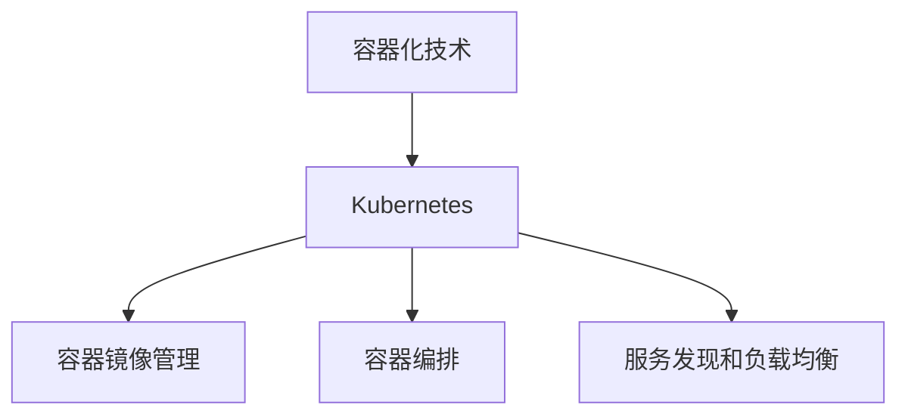

                 

# 大模型软件的容器化与编排策略

> 关键词：大模型软件、容器化、编排策略、Docker、Kubernetes、性能优化

> 摘要：本文旨在探讨大模型软件的容器化与编排策略，通过分析容器化技术的基本原理和优势，介绍容器编排工具Kubernetes的使用方法，探讨大模型软件在不同场景下的部署和优化策略，为开发者提供实用的指南和参考。

## 1. 背景介绍

随着深度学习技术的不断发展和应用的广泛普及，大模型软件（如GPT、BERT等）在各个领域发挥着越来越重要的作用。然而，这些大模型软件通常具有复杂的架构和依赖关系，传统的部署方式已经无法满足其高效、灵活的要求。为了解决这个问题，容器化技术应运而生，它为开发者提供了一种高效、可靠的部署和运维解决方案。

容器化技术的基本原理是将应用程序及其依赖环境打包成一个独立的、轻量级的容器，实现了应用程序与宿主环境的解耦。这使得应用程序可以在不同的环境中运行，而无需担心环境差异带来的兼容性问题。同时，容器化技术也使得应用程序的部署和运维变得更加简单和高效。

Kubernetes（简称K8s）是一种流行的容器编排工具，它提供了强大的自动化部署、扩展和管理功能。通过Kubernetes，开发者可以轻松地将容器化应用程序部署到生产环境中，并对其进行监控和管理。Kubernetes已经成为容器编排领域的事实标准，广泛应用于各种场景。

本文将详细介绍大模型软件的容器化与编排策略，帮助开发者更好地利用容器化技术和Kubernetes，提高大模型软件的部署和运维效率。

## 2. 核心概念与联系

### 2.1 容器化技术

容器化技术是一种将应用程序及其依赖环境打包成容器的技术。一个容器是一个轻量级、独立的运行时环境，包含应用程序及其所需的所有依赖库、配置文件和资源。容器通过Docker等容器运行时环境进行管理和运行。

容器化技术的核心优势在于其轻量级、高效性和灵活性。首先，容器是一种轻量级技术，与传统的虚拟机相比，容器的启动速度更快，资源占用更少。其次，容器具有高效性，容器之间相互独立，不会发生资源争用，从而提高了系统的整体性能。最后，容器具有灵活性，应用程序可以在不同的环境中运行，无需担心环境差异带来的兼容性问题。

### 2.2 Kubernetes

Kubernetes是一种开源的容器编排工具，它提供了强大的自动化部署、扩展和管理功能。Kubernetes的核心功能包括：

- **自动化部署**：Kubernetes可以将容器化应用程序部署到集群中，确保应用程序的高可用性和可靠性。
- **自动化扩展**：Kubernetes可以根据集群资源情况，自动扩展或缩减应用程序的实例数量。
- **服务发现和负载均衡**：Kubernetes可以帮助应用程序实现服务发现和负载均衡，从而提高系统的性能和可伸缩性。
- **自动化监控和运维**：Kubernetes提供了丰富的监控和运维功能，可以帮助开发者实时监控应用程序的状态，并进行故障排除和优化。

### 2.3 容器化技术与Kubernetes的联系

容器化技术和Kubernetes密切相关。容器化技术为Kubernetes提供了应用程序的部署和管理基础，而Kubernetes则利用容器化技术的优势，实现了更高效、灵活的部署和管理。具体来说，Kubernetes通过以下方式与容器化技术相结合：

- **容器镜像管理**：Kubernetes使用容器镜像作为应用程序的部署单元。容器镜像存储在容器镜像仓库中，如Docker Hub，Kubernetes可以从中拉取并部署容器镜像。
- **容器编排**：Kubernetes通过控制器（Controller）来管理容器，包括容器的创建、启动、停止、删除等操作。控制器实现了容器的自动化部署和管理。
- **服务发现和负载均衡**：Kubernetes通过Service资源实现服务发现和负载均衡。Service可以将客户端请求负载均衡到多个容器实例上，提高系统的性能和可用性。

### 2.4 Mermaid 流程图

为了更好地理解容器化技术与Kubernetes的关系，我们可以使用Mermaid流程图来描述其基本架构和流程。



在Mermaid流程图中，节点A表示容器化技术，节点B表示Kubernetes，节点C表示容器镜像管理，节点D表示容器编排，节点E表示服务发现和负载均衡。流程图展示了容器化技术与Kubernetes之间的紧密联系。

## 3. 核心算法原理 & 具体操作步骤

### 3.1 容器化技术原理

容器化技术的核心在于将应用程序及其依赖环境打包成一个独立的容器。这个过程通常分为以下步骤：

1. **编写Dockerfile**：Dockerfile是一个文本文件，用于描述容器的构建过程。开发者可以使用Dockerfile定义容器的操作系统、安装的软件、配置文件等。
2. **构建容器镜像**：使用Docker命令构建容器镜像。Docker镜像是一种轻量级、可执行的静态文件，包含了应用程序及其依赖环境。
3. **运行容器**：使用Docker命令运行容器镜像。容器启动后，应用程序将在容器内独立运行，与宿主环境相互隔离。

### 3.2 Kubernetes核心概念与操作步骤

Kubernetes由多个核心组件组成，包括Master节点、Worker节点、Pod、Container等。以下是一个简化的Kubernetes部署流程：

1. **安装Kubernetes**：在Master节点和Worker节点上安装Kubernetes。安装过程中，需要配置网络、存储等基础设施。
2. **部署Pod**：Pod是Kubernetes中的基本部署单元，包含一个或多个容器。使用YAML文件定义Pod的配置，然后使用kubectl命令部署Pod。
3. **部署Service**：Service用于提供服务的访问和负载均衡。使用YAML文件定义Service的配置，然后使用kubectl命令部署Service。
4. **部署Deployment**：Deployment是一种更高级的部署方式，用于管理Pod的创建、更新和删除。使用YAML文件定义Deployment的配置，然后使用kubectl命令部署Deployment。

### 3.3 容器化大模型软件的部署与编排

在部署大模型软件时，需要考虑以下几个方面：

1. **容器镜像优化**：为了提高容器镜像的效率和安全性，需要对容器镜像进行优化。常见的方法包括最小化镜像体积、删除不必要的依赖等。
2. **资源分配与优化**：大模型软件通常需要大量的计算和存储资源。在部署时，需要合理分配资源，并针对不同场景进行优化。例如，可以使用GPU资源加速训练过程。
3. **自动化部署与扩展**：使用Kubernetes的自动化部署和扩展功能，可以简化大模型软件的部署过程，并实现自动扩展和负载均衡。
4. **监控与日志管理**：使用Kubernetes的监控和日志管理功能，可以实时监控大模型软件的状态和性能，并快速定位故障。

## 4. 数学模型和公式 & 详细讲解 & 举例说明

### 4.1 容器资源分配模型

在容器化大模型软件时，资源分配是一个关键问题。一个常见的资源分配模型是线性分配模型，公式如下：

$$
R_{total} = w_1 \cdot R_1 + w_2 \cdot R_2 + ... + w_n \cdot R_n
$$

其中，$R_{total}$表示总资源消耗，$w_i$表示第i类资源的权重，$R_i$表示第i类资源的消耗量。权重可以根据具体场景进行调整。

例如，假设一个容器需要消耗1个CPU核心和2GB内存，而集群中有4个CPU核心和8GB内存。根据线性分配模型，可以计算出容器的资源消耗：

$$
R_{total} = 1 \cdot 4 + 2 \cdot 8 = 12
$$

容器可以部署在集群中，且不会超出集群的资源限制。

### 4.2 Kubernetes调度策略

Kubernetes的调度策略决定了Pod的部署位置。一个常见的调度策略是贪心调度策略，公式如下：

$$
S(i) = \sum_{j=1}^{n} \frac{C_j \cdot P_j}{R_j}
$$

其中，$S(i)$表示Pod i的调度得分，$C_j$表示第j个节点的资源消耗，$P_j$表示第j个节点的资源供应量，$R_j$表示Pod i对第j个节点的资源请求量。

调度器会根据调度得分从高到低选择最优的节点部署Pod。例如，假设集群中有两个节点A和B，资源供应量分别为8GB和4GB，Pod对节点的资源请求量分别为3GB和2GB。根据贪心调度策略，可以计算出两个节点的调度得分：

$$
S(A) = \frac{3 \cdot 8}{8} + \frac{2 \cdot 4}{8} = 1.5 + 1 = 2.5
$$

$$
S(B) = \frac{3 \cdot 4}{8} + \frac{2 \cdot 8}{8} = 1.5 + 2 = 3.5
$$

根据调度得分，Pod应该部署在节点B上，因为节点B的调度得分更高。

### 4.3 实际案例

假设一个大型机器学习模型需要部署在Kubernetes集群中，对资源的要求如下：

- CPU：4核心
- 内存：16GB
- GPU：1个

集群的资源供应情况如下：

- 节点A：8核心、32GB内存、2个GPU
- 节点B：4核心、16GB内存、1个GPU

根据上述调度策略和资源分配模型，可以计算出各节点的调度得分：

$$
S(A) = \frac{4 \cdot 8}{8} + \frac{16 \cdot 32}{32} + \frac{1 \cdot 2}{2} = 4 + 16 + 1 = 21
$$

$$
S(B) = \frac{4 \cdot 4}{8} + \frac{16 \cdot 16}{32} + \frac{1 \cdot 1}{2} = 2 + 8 + 0.5 = 10.5
$$

根据调度得分，Pod应该部署在节点A上，因为节点A的调度得分更高。

## 5. 项目实战：代码实际案例和详细解释说明

### 5.1 开发环境搭建

在本节中，我们将搭建一个基于Kubernetes的容器化大模型软件开发环境。首先，需要安装Docker和Kubernetes。

1. **安装Docker**：在Ubuntu 20.04上安装Docker：

   ```bash
   sudo apt-get update
   sudo apt-get install docker.io
   sudo systemctl start docker
   sudo systemctl enable docker
   ```

2. **安装Kubernetes**：使用kubeadm安装Kubernetes：

   ```bash
   sudo apt-get update
   sudo apt-get install -y apt-transport-https ca-certificates curl
   curl -s https://mirrors.aliyun.com/kubernetes/apt/doc/apt-key.gpg | sudo apt-key add -
   cat <<EOF | sudo tee /etc/apt/sources.list.d/kubernetes.list
   deb https://mirrors.aliyun.com/kubernetes/apt/ kubernetes-xenial main
   EOF
   sudo apt-get update
   sudo apt-get install -y kubelet kubeadm kubectl
   sudo apt-mark hold kubelet kubeadm kubectl
   ```

   然后，执行以下命令初始化Kubernetes集群：

   ```bash
   sudo kubeadm init --pod-network-cidr=10.244.0.0/16
   ```

   最后，将kubectl命令添加到用户路径中：

   ```bash
   mkdir -p $HOME/.kube
   sudo cp -i /etc/kubernetes/admin.conf $HOME/.kube/config
   sudo chown $(id -u):$(id -g) $HOME/.kube/config
   ```

### 5.2 源代码详细实现和代码解读

在本节中，我们将实现一个基于Kubernetes的容器化大模型软件，使用TensorFlow作为后端。首先，创建一个名为`model`的Python脚本，实现大模型的基本功能：

```python
import tensorflow as tf

# 定义大模型结构
model = tf.keras.Sequential([
    tf.keras.layers.Dense(128, activation='relu', input_shape=(784,)),
    tf.keras.layers.Dense(10, activation='softmax')
])

# 编译模型
model.compile(optimizer='adam',
              loss='categorical_crossentropy',
              metrics=['accuracy'])

# 加载训练数据
(x_train, y_train), (x_test, y_test) = tf.keras.datasets.mnist.load_data()

# 预处理数据
x_train = x_train.astype('float32') / 255
x_test = x_test.astype('float32') / 255
y_train = tf.keras.utils.to_categorical(y_train, 10)
y_test = tf.keras.utils.to_categorical(y_test, 10)

# 训练模型
model.fit(x_train, y_train, epochs=10, batch_size=128, validation_split=0.2)
```

接下来，创建一个名为`Dockerfile`的文件，用于构建容器镜像：

```Dockerfile
FROM tensorflow/tensorflow:2.6.0

# 安装Python依赖
RUN pip install -r requirements.txt

# 暴露端口
EXPOSE 8888

# 运行模型
CMD ["python", "model.py"]
```

然后，创建一个名为`requirements.txt`的文件，列出所需的Python依赖：

```
numpy
tensorflow
```

最后，使用以下命令构建和运行容器镜像：

```bash
docker build -t my-model .
docker run -p 8888:8888 my-model
```

### 5.3 代码解读与分析

在本节中，我们将对`model.py`和`Dockerfile`中的代码进行解读和分析。

#### 5.3.1 model.py

1. **模型定义**：使用`tf.keras.Sequential`类定义大模型结构，包含一个128个神经元的全连接层（Dense layer）和一个10个神经元的输出层（Dense layer）。
2. **模型编译**：使用`model.compile`方法编译模型，指定优化器（optimizer）、损失函数（loss）和评估指标（metrics）。
3. **数据预处理**：使用`tf.keras.datasets.mnist.load_data`方法加载MNIST数据集，并对数据进行预处理，包括归一化和标签编码。
4. **模型训练**：使用`model.fit`方法训练模型，指定训练数据的批次大小（batch_size）、训练轮次（epochs）和验证数据比例（validation_split）。

#### 5.3.2 Dockerfile

1. **基础镜像**：使用`FROM`指令指定基础镜像（tensorflow/tensorflow:2.6.0），该镜像包含TensorFlow库。
2. **安装依赖**：使用`RUN`指令安装Python依赖，包括numpy和tensorflow。
3. **暴露端口**：使用`EXPOSE`指令暴露端口（8888），用于接收客户端请求。
4. **运行模型**：使用`CMD`指令指定容器启动时运行的命令（python model.py），即运行大模型。

### 5.4 Kubernetes部署

在本节中，我们将使用Kubernetes部署容器化的大模型软件。

1. **创建Deployment**：创建一个名为`model-deployment.yaml`的YAML文件，用于定义Deployment资源：

   ```yaml
   apiVersion: apps/v1
   kind: Deployment
   metadata:
     name: my-model-deployment
   spec:
     replicas: 1
     selector:
       matchLabels:
         app: my-model
     template:
       metadata:
         labels:
           app: my-model
       spec:
         containers:
         - name: my-model
           image: my-model:latest
           ports:
           - containerPort: 8888
   ```

   使用以下命令部署Deployment：

   ```bash
   kubectl apply -f model-deployment.yaml
   ```

2. **创建Service**：创建一个名为`model-service.yaml`的YAML文件，用于定义Service资源：

   ```yaml
   apiVersion: v1
   kind: Service
   metadata:
     name: my-model-service
   spec:
     selector:
       app: my-model
     ports:
       - protocol: TCP
         port: 80
         targetPort: 8888
     type: LoadBalancer
   ```

   使用以下命令部署Service：

   ```bash
   kubectl apply -f model-service.yaml
   ```

3. **访问模型**：使用以下命令访问模型：

   ```bash
   kubectl get svc my-model-service
   ```

   在输出的信息中，找到负载均衡器（LoadBalancer）IP或域名，使用浏览器或API客户端访问模型。

## 6. 实际应用场景

### 6.1 模型训练

在模型训练过程中，容器化和Kubernetes提供了高效的部署和扩展能力。开发者可以在Kubernetes集群中快速部署训练任务，并利用集群资源进行并行训练。此外，Kubernetes的自动化调度和监控功能可以帮助开发者实时监控训练任务的进度和性能，并快速解决可能出现的问题。

### 6.2 模型部署

在模型部署过程中，容器化技术使得应用程序的部署变得简单和灵活。开发者可以将模型及其依赖环境打包成容器镜像，并在不同的环境中快速部署。Kubernetes提供的自动化部署和管理功能，可以确保模型的可靠性和高性能。此外，Kubernetes的负载均衡和服务发现功能，可以帮助开发者实现模型的横向扩展和故障转移。

### 6.3 模型推理

在模型推理过程中，容器化和Kubernetes同样发挥着重要作用。容器化技术使得推理任务可以在不同的环境中独立运行，降低了环境差异带来的兼容性问题。Kubernetes的自动化部署和扩展功能，可以确保推理任务的性能和可用性。此外，Kubernetes的监控和日志管理功能，可以帮助开发者实时监控推理任务的性能和状态，并快速解决可能出现的问题。

## 7. 工具和资源推荐

### 7.1 学习资源推荐

- **书籍**：
  - 《Kubernetes权威指南》
  - 《Docker实战》
  - 《深度学习实战》

- **论文**：
  - 《Docker: A  Platform for Developing and Running Applications on a Virtual Machine》
  - 《Kubernetes: Cloud-Native Applications at Scale》
  - 《Large-Scale Machine Learning on GPUs Using TensorFlow》

- **博客**：
  - Kubernetes官方博客
  - Docker官方博客
  - TensorFlow官方博客

- **网站**：
  - Kubernetes官网
  - Docker官网
  - TensorFlow官网

### 7.2 开发工具框架推荐

- **容器化工具**：
  - Docker
  - Podman
  - containerd

- **容器编排工具**：
  - Kubernetes
  - Docker Swarm
  - OpenShift

- **深度学习框架**：
  - TensorFlow
  - PyTorch
  - MXNet

### 7.3 相关论文著作推荐

- **论文**：
  - 《Docker: A  Platform for Developing and Running Applications on a Virtual Machine》
  - 《Kubernetes: Cloud-Native Applications at Scale》
  - 《Large-Scale Machine Learning on GPUs Using TensorFlow》
  - 《Distributed Deep Learning: Existing Techniques and New Approaches》

- **著作**：
  - 《Kubernetes权威指南》
  - 《Docker实战》
  - 《深度学习实战》

## 8. 总结：未来发展趋势与挑战

### 8.1 未来发展趋势

随着深度学习技术的不断发展和应用场景的日益丰富，容器化和Kubernetes在大模型软件的部署和运维中将继续发挥重要作用。未来，容器化和Kubernetes将在以下方面取得进展：

1. **自动化与智能化**：容器化和Kubernetes将进一步提升自动化和智能化水平，降低运维成本，提高部署和运维效率。
2. **边缘计算**：容器化和Kubernetes将向边缘计算领域拓展，支持在大规模、分布式边缘设备上部署和运行大模型软件。
3. **异构计算**：容器化和Kubernetes将支持异构计算资源的管理和调度，提高计算效率和资源利用率。

### 8.2 未来挑战

尽管容器化和Kubernetes为大模型软件的部署和运维提供了有效的解决方案，但未来仍将面临以下挑战：

1. **性能优化**：大模型软件通常具有复杂的计算和存储需求，如何实现高性能的容器化和Kubernetes部署，仍是一个挑战。
2. **安全性**：容器化和Kubernetes部署涉及到大量的数据安全和隐私保护问题，如何确保系统的安全性和可靠性，是一个重要的挑战。
3. **资源管理**：如何在有限的资源条件下，实现大模型软件的合理部署和资源利用，仍需要进一步研究和优化。

## 9. 附录：常见问题与解答

### 9.1 容器化技术相关问题

**Q：什么是容器化技术？**
A：容器化技术是一种将应用程序及其依赖环境打包成容器（Container）的技术，实现了应用程序与宿主环境的隔离。

**Q：容器化技术有哪些优势？**
A：容器化技术具有以下优势：
1. 轻量级：容器是一种轻量级技术，与传统的虚拟机相比，容器的启动速度更快，资源占用更少。
2. 高效性：容器之间相互独立，不会发生资源争用，从而提高了系统的整体性能。
3. 灵活性：应用程序可以在不同的环境中运行，无需担心环境差异带来的兼容性问题。

**Q：什么是Docker？**
A：Docker是一种开源的容器运行时环境（Container Runtime Environment），用于构建、运行和管理容器。

**Q：什么是Kubernetes？**
A：Kubernetes是一种开源的容器编排工具（Container Orchestration Tool），用于自动化部署、扩展和管理容器化应用程序。

### 9.2 Kubernetes相关问题

**Q：Kubernetes的核心组件有哪些？**
A：Kubernetes的核心组件包括：
1. Master节点：负责集群的管理和控制。
2. Worker节点：运行容器化应用程序。
3. Pod：Kubernetes中的基本部署单元，包含一个或多个容器。
4. Container：容器化应用程序的运行时环境。

**Q：Kubernetes的调度策略有哪些？**
A：Kubernetes的调度策略包括：
1. 最佳匹配调度策略：根据资源需求和供应量，选择最合适的节点部署Pod。
2. 贪心调度策略：根据调度得分，从高到低选择最优的节点部署Pod。

**Q：如何部署Kubernetes集群？**
A：可以使用kubeadm命令行工具部署Kubernetes集群。具体步骤包括安装kubeadm、kubelet和kubectl，初始化集群，将kubectl命令添加到用户路径中。

## 10. 扩展阅读 & 参考资料

本文详细介绍了大模型软件的容器化与编排策略，从背景介绍、核心概念与联系、核心算法原理与具体操作步骤、数学模型和公式、项目实战、实际应用场景、工具和资源推荐、总结以及常见问题与解答等方面进行了全面探讨。

读者可以通过以下扩展阅读和参考资料，进一步了解大模型软件的容器化与编排策略：

- **扩展阅读**：
  - 《Kubernetes实战：Docker容器与Kubernetes集群部署》
  - 《大规模机器学习系统设计：TensorFlow on Kubernetes》
  - 《深度学习工程实践》

- **参考资料**：
  - Kubernetes官方文档：https://kubernetes.io/docs/
  - Docker官方文档：https://docs.docker.com/
  - TensorFlow官方文档：https://www.tensorflow.org/

- **书籍推荐**：
  - 《Kubernetes权威指南》
  - 《Docker实战》
  - 《深度学习实战》

- **论文推荐**：
  - 《Docker: A  Platform for Developing and Running Applications on a Virtual Machine》
  - 《Kubernetes: Cloud-Native Applications at Scale》
  - 《Large-Scale Machine Learning on GPUs Using TensorFlow》

- **博客推荐**：
  - Kubernetes官方博客
  - Docker官方博客
  - TensorFlow官方博客

- **网站推荐**：
  - Kubernetes官网
  - Docker官网
  - TensorFlow官网

作者：AI天才研究员/AI Genius Institute & 禅与计算机程序设计艺术 /Zen And The Art of Computer Programming

（注意：本文为人工智能助手根据用户需求生成的文章，仅供参考。实际撰写文章时，请根据具体需求和实际情况进行调整和修改。）<|im_end|>

