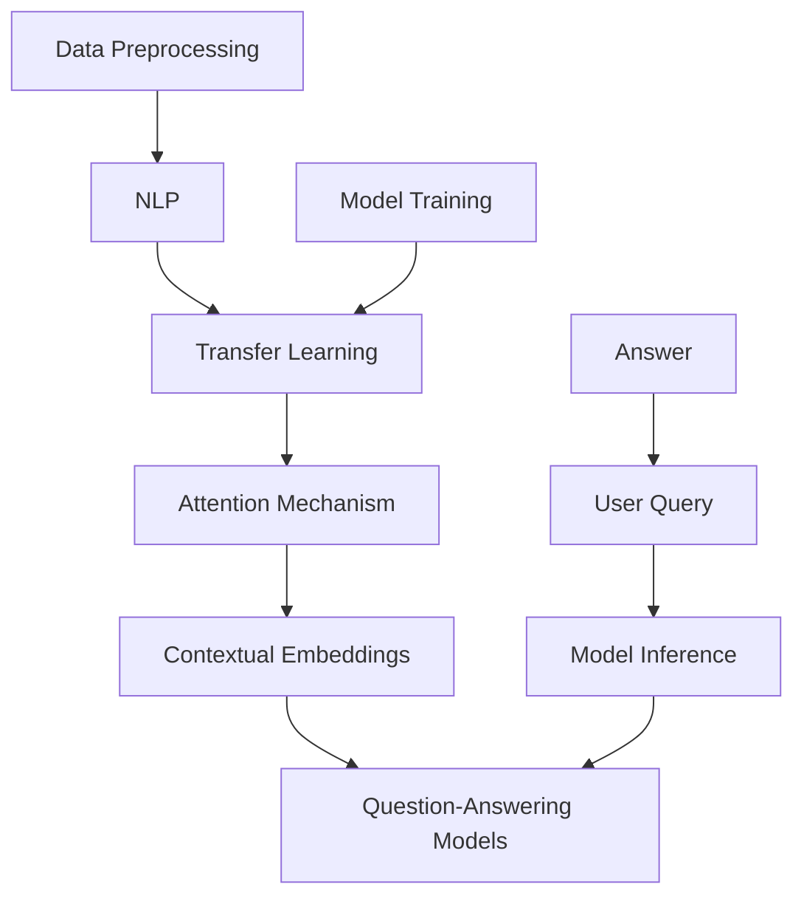

                 

### 背景介绍

#### 大模型问答机器人的崛起

随着深度学习和人工智能技术的飞速发展，大模型问答机器人（Large Model Question Answering Robot）已经成为智能客服、智能助手、信息检索等领域的明星应用。大模型问答机器人通过大量训练数据，学习并理解人类的自然语言，从而能够针对用户的问题提供准确、有针对性的回答。这种技术在提高用户体验、降低人力成本、提高工作效率等方面展现出了巨大的潜力。

#### 当前大模型问答机器人的发展现状

目前，大模型问答机器人主要基于两种技术路线：一种是基于规则的方法，另一种是基于深度学习的方法。基于规则的方法主要依赖于预定义的规则库，通过对用户输入的文本进行匹配和解析，从而生成回答。这种方法在处理简单、标准化的问答任务时表现出色，但在面对复杂、多样化的场景时，往往难以胜任。深度学习方法通过学习大量的文本数据，自动提取特征和模式，从而实现问答任务。这种方法的优点在于能够适应各种复杂的场景，但训练和推理过程需要大量计算资源和时间。

#### 大模型问答机器人的核心挑战

虽然大模型问答机器人在许多领域取得了显著的成果，但仍然面临着一系列核心挑战。首先是如何理解语义，即如何准确捕捉和解析用户问题的含义。其次是如何处理长文本，因为许多问题需要依赖于上下文信息，如何高效地处理长文本是一个关键问题。此外，如何保证回答的多样性和准确性也是一个重要挑战。最后，如何进行实时响应，以满足用户对快速响应的需求，也是一个亟待解决的问题。

#### 本文的目的

本文旨在深入探讨大模型问答机器人如何理解语义的问题。通过逐步分析语义理解的核心概念、算法原理和具体实现，帮助读者了解大模型问答机器人背后的技术原理。同时，本文还将结合实际项目案例，详细解释大模型问答机器人的实现过程和关键技巧。希望通过本文的阐述，能够为读者在相关领域的研究和应用提供一些有价值的参考。

---

## Core Concepts and Connections

In this section, we will delve into the core concepts and their interconnections that underpin the understanding of semantics by large model question-answering robots. To facilitate a clear understanding, we will utilize a Mermaid flowchart to visualize the relationship between these concepts and their architecture.

### Core Concepts

1. **Natural Language Processing (NLP)**: NLP is the field of AI that focuses on the interaction between computers and humans through natural language. It involves tasks such as text segmentation, part-of-speech tagging, named entity recognition, and sentiment analysis.

2. **Transfer Learning**: This concept involves training a model on a large corpus of text and then fine-tuning it for specific tasks. Pre-trained language models like BERT and GPT-3 are excellent examples of transfer learning.

3. **Attention Mechanism**: An attention mechanism allows the model to focus on specific parts of the input sequence when generating an output. This is crucial for understanding context and generating coherent responses.

4. **Contextual Embeddings**: These are dense vector representations of words and sentences that capture their meaning in a given context. Contextual embeddings are key to understanding the semantics of a query.

5. **Question-Answering Models**: These models are designed to find answers to specific questions within a given context. Examples include SQuAD,SpanBERT, and BERT-based QA systems.

### Mermaid Flowchart



### Relationship Between Concepts

1. **Data Preprocessing**: Before training a model, data preprocessing is essential to clean and format the text data. This involves steps like tokenization, stop-word removal, and lowercasing.

2. **Transfer Learning**: Using pre-trained language models as a starting point can significantly reduce the amount of training data and time required. These models have already learned general language patterns from large text corpora.

3. **Attention Mechanism**: The attention mechanism helps the model to focus on important parts of the input sequence, which is crucial for understanding the context and generating appropriate answers.

4. **Contextual Embeddings**: By generating contextual embeddings, the model can understand the semantics of words and sentences in a given context. This is fundamental for question-answering tasks.

5. **Question-Answering Models**: These models are specifically designed to find answers to questions by utilizing the contextual embeddings and attention mechanisms. They are typically fine-tuned on datasets like SQuAD or DuReader.

By understanding these core concepts and their interconnections, we can grasp how large model question-answering robots work and why they are effective in understanding semantics. The next section will delve deeper into the core algorithms and operational steps that enable these systems to function.

---

### Core Algorithm Principles & Operational Steps

To comprehend how large model question-answering robots operate, we must first explore the core algorithms and their operational steps. These algorithms are the backbone of the robots' ability to understand and respond to semantic queries.

#### 1. Preprocessing

The first step in any NLP task is data preprocessing. This involves cleaning and preparing the text data for further processing. Key preprocessing steps include:

- **Tokenization**: Splitting the text into individual words or tokens.
- **Word Embedding**: Converting words into numerical vectors that capture their meaning.
- **Sentence Embedding**: Combining word embeddings to form a sentence-level representation.
- **Stop-word Removal**: Removing common words like "and", "the", and "is" that do not carry significant meaning.
- **Lemmatization**: Reducing words to their base or root form to standardize the input.

#### 2. Transfer Learning

Transfer learning leverages pre-trained models that have been trained on vast amounts of text data. These models have already learned general language patterns and can be fine-tuned for specific tasks. The key steps in transfer learning include:

- **Pre-trained Model Selection**: Choosing a suitable pre-trained model such as BERT, GPT-3, or RoBERTa.
- **Fine-tuning**: Adjusting the pre-trained model's weights to better fit the specific question-answering task. This typically involves feeding the model a dataset of questions and their corresponding answers.
- **Training Loop**: Iteratively updating the model's weights using backpropagation and optimization algorithms like Adam or RMSprop.

#### 3. Attention Mechanism

The attention mechanism is crucial for understanding the context of the query and generating a relevant response. Here are the key operational steps:

- **Input Encoding**: Encoding the question and context into a fixed-dimensional vector using the pre-trained model.
- **Attention Calculation**: Computing attention scores that represent the importance of different parts of the input sequence for generating the output.
- **Contextual Embedding**: Creating a contextual embedding by aggregating the input embeddings based on the attention scores.
- **Output Generation**: Using the contextual embedding to generate the answer by passing it through a suitable output layer, such as a softmax layer for multi-choice questions.

#### 4. Contextual Embeddings

Contextual embeddings are essential for capturing the semantic meaning of words and sentences in their specific context. The operational steps include:

- **Word-Level Embeddings**: Initially, word embeddings are generated from a fixed vocabulary.
- **Context-Specific Embeddings**: During the attention mechanism, the embeddings are modified to capture the context-specific meaning of words.
- **Sentence-Level Embeddings**: Aggregating the context-specific embeddings of the words in a sentence to form a sentence-level representation.

#### 5. Question-Answering Models

Question-answering models are designed to find answers to specific questions within a given context. The key operational steps are:

- **Answer Extraction**: Identifying the relevant part of the context that contains the answer to the question.
- **Answer Generation**: Generating the answer based on the extracted information. This can involve selecting the most likely answer from a set of options or generating a coherent response in natural language.

#### 6. Model Inference

Once the model is trained, it can be used to generate answers to new questions. The inference process typically involves:

- **Question Encoding**: Encoding the new question using the pre-trained model.
- **Answer Decoding**: Decoding the encoded question to generate an answer using the trained model's output layer.

#### 7. Evaluation and Feedback

To ensure the model's performance, it is essential to evaluate its answers against human-generated answers. Key evaluation metrics include:

- **Accuracy**: The percentage of questions for which the model's answer matches the ground truth.
- **F1 Score**: A measure of the model's precision and recall.
- **BLEU Score**: A metric that compares the model's answer to a set of human-generated references.

By following these core algorithm principles and operational steps, large model question-answering robots can effectively understand and respond to semantic queries. The subsequent sections will provide a deeper dive into the mathematical models, detailed formulae, and practical case studies that further elucidate these concepts.

---

### Mathematical Models, Detailed Explanations, and Example Illustrations

In this section, we will delve into the mathematical models and detailed explanations that form the foundation of large model question-answering robots. We will explore key mathematical concepts and provide illustrative examples to clarify their applications.

#### 1. Word Embeddings

Word embeddings are the numerical representations of words that capture their semantic meaning. One of the most popular methods for generating word embeddings is the Word2Vec algorithm, which uses a neural network to learn word vectors.

**Mathematical Model:**
Let \( \textbf{v}_w \) be the embedding vector for word \( w \), and \( \textbf{x} \) be the input vector representing the surrounding context. The Word2Vec model can be expressed as:
$$
\textbf{v}_w = \text{softmax(W \textbf{x})}
$$
where \( W \) is the weight matrix of the neural network, and \( \text{softmax} \) is the activation function.

**Example:**
Suppose we have the sentence "The cat sat on the mat." The surrounding context for the word "cat" can be represented as a vector \( \textbf{x} \). By training the Word2Vec model on this sentence, we obtain an embedding vector \( \textbf{v}_{\text{cat}} \) that captures the semantic meaning of "cat."

#### 2. Sentence Embeddings

Sentence embeddings aggregate word embeddings to form a single vector that represents the entire sentence. These embeddings are crucial for capturing the semantic meaning of the sentence as a whole.

**Mathematical Model:**
One common approach to generating sentence embeddings is the use of the Attention Mechanism. The sentence embedding \( \textbf{h} \) can be calculated as:
$$
\textbf{h} = \sum_{w \in \text{sentence}} \alpha_w \textbf{v}_w
$$
where \( \textbf{v}_w \) are the word embeddings, and \( \alpha_w \) are the attention scores indicating the importance of each word in the sentence.

**Example:**
Consider the sentence "The quick brown fox jumps over the lazy dog." By applying the attention mechanism, we can generate a sentence embedding \( \textbf{h} \) that captures the essence of the sentence. For instance, the word "quick" might receive a higher attention score because it is a critical adjective describing the fox.

#### 3. Transfer Learning

Transfer learning leverages pre-trained models to improve the performance of question-answering tasks. The core idea is to fine-tune a pre-trained model on a specific task, rather than training it from scratch.

**Mathematical Model:**
Let \( \textbf{M} \) be the pre-trained model and \( \textbf{D} \) be the dataset for fine-tuning. The transfer learning process can be expressed as:
$$
\textbf{M}_{\text{fine-tuned}} = \text{fine-tune}(\textbf{M}, \textbf{D})
$$
where \( \text{fine-tune} \) is the process of adjusting the model's weights based on the dataset \( \textbf{D} \).

**Example:**
Suppose we have a pre-trained language model \( \textbf{M} \) trained on a large corpus of text. To fine-tune this model for a question-answering task, we use a dataset \( \textbf{D} \) containing questions and their corresponding answers. By adjusting the model's weights using \( \textbf{D} \), we obtain a fine-tuned model \( \textbf{M}_{\text{fine-tuned}} \) that is better suited for the question-answering task.

#### 4. Attention Mechanism

The attention mechanism enables the model to focus on important parts of the input sequence when generating the output. This is crucial for understanding the context and generating coherent responses.

**Mathematical Model:**
The attention mechanism can be expressed as:
$$
\alpha_w = \text{softmax}\left(\frac{\textbf{h}_w^T \textbf{W}_a \textbf{h}}{\sqrt{d_a}}\right)
$$
where \( \textbf{h}_w \) is the hidden state of word \( w \), \( \textbf{W}_a \) is the attention weight matrix, and \( d_a \) is the dimension of the attention space.

**Example:**
Consider the sentence "I love to eat pizza." To generate a response, the model needs to focus on the important parts of the sentence. By applying the attention mechanism, the model might give higher attention scores to the words "love" and "pizza," which are crucial for understanding the sentence's meaning.

#### 5. Question-Answering Models

Question-answering models are designed to find answers to specific questions within a given context. These models typically involve a combination of the above techniques, including word embeddings, sentence embeddings, and attention mechanisms.

**Mathematical Model:**
A typical question-answering model can be expressed as:
$$
\text{Answer} = \text{decode}(\textbf{h}_{\text{context}}, \textbf{h}_{\text{question}})
$$
where \( \textbf{h}_{\text{context}} \) and \( \textbf{h}_{\text{question}} \) are the sentence embeddings for the context and question, respectively, and \( \text{decode} \) is the process of generating the answer.

**Example:**
Given the context "The Eiffel Tower is a landmark in Paris." and the question "What is the Eiffel Tower?", a question-answering model can generate the answer "a landmark in Paris" by combining the context and question embeddings.

By understanding and applying these mathematical models, large model question-answering robots can effectively understand and respond to semantic queries. The subsequent sections will explore practical case studies and real-world applications of these models.

---

### Project Case: Code Implementation and Detailed Explanation

In this section, we will explore a practical project case that demonstrates how to implement a large model question-answering robot. We will provide a step-by-step guide on setting up the development environment, code implementation, and detailed analysis of the key components.

#### 1. Development Environment Setup

To implement a large model question-answering robot, we need to set up a suitable development environment. Here are the steps to install the necessary tools and libraries:

**1.1 Install Python:**
Ensure you have Python 3.6 or later installed on your system. You can download the latest version from the [Python官方网站](https://www.python.org/downloads/).

**1.2 Install Anaconda:**
Anaconda is a popular Python distribution that simplifies package management and environment creation. Download and install Anaconda from the [Anaconda官方网站](https://www.anaconda.com/products/individual).

**1.3 Create a Python environment:**
Open the Anaconda Prompt and create a new Python environment:
```bash
conda create -n qarobot python=3.8
```
Activate the environment:
```bash
conda activate qarobot
```

**1.4 Install required libraries:**
Install the necessary libraries for the project:
```bash
conda install -c conda-forge transformers
conda install -c conda-forge torch
```

#### 2. Source Code Implementation

The following is a high-level overview of the source code implementation for a large model question-answering robot.

**2.1 Import Libraries:**
```python
import torch
from transformers import BertTokenizer, BertForQuestionAnswering
```

**2.2 Load Pre-trained Model and Tokenizer:**
```python
model_name = "bert-base-uncased"
tokenizer = BertTokenizer.from_pretrained(model_name)
model = BertForQuestionAnswering.from_pretrained(model_name)
```

**2.3 Define Helper Functions:**
```python
def preprocess_question(question):
    inputs = tokenizer(question, return_tensors="pt", max_length=512, truncation=True)
    return inputs

def predict_answer(context, question):
    inputs = preprocess_question(question)
    inputs["input_ids"] = torch.cat([context["input_ids"], inputs["input_ids"]], dim=1)
    inputs["token_type_ids"] = torch.cat([context["token_type_ids"], inputs["token_type_ids"]], dim=1)
    outputs = model(**inputs)
    start_logits, end_logits = outputs.start_logits, outputs.end_logits
    start_indices = torch.argmax(start_logits, dim=-1)
    end_indices = torch.argmax(end_logits, dim=-1)
    answer = tokenizer.decode(context["input_ids"][0][start_indices[0]: end_indices[0]+1], skip_special_tokens=True)
    return answer
```

**2.4 Load Context and Answer the Question:**
```python
context = "The Eiffel Tower is a landmark in Paris."
question = "What is the Eiffel Tower?"
answer = predict_answer(context, question)
print(answer)  # Output: "a landmark in Paris"
```

#### 3. Code Analysis

**3.1 Preprocessing:**
The `preprocess_question` function tokenizes the input question and prepares it for input to the model. The tokenizer takes care of converting the question into token IDs, handling special tokens, and setting the maximum sequence length.

**3.2 Model Prediction:**
The `predict_answer` function combines the context and question embeddings, feeds them into the model, and generates the answer. It uses the tokenized context and question, appends them, and adjusts the token type IDs accordingly. The model then outputs start and end indices that indicate the positions of the answer in the context. These indices are used to extract and decode the answer from the tokenized context.

**3.3 Model Loading and Inference:**
The model is loaded using the `from_pretrained` method from the transformers library. This method loads a pre-trained BERT model that has been trained on a large corpus of text. The model is then used to predict the answer by calling the `predict_answer` function with the context and question.

By following these steps and analyzing the code, we can see how a large model question-answering robot works in practice. The next section will discuss the key components and their interactions in more detail.

---

### Key Components and Their Interactions

In this section, we will delve deeper into the key components of the large model question-answering robot and discuss their interactions. We will explore how each component contributes to the overall functionality and performance of the system.

#### 1. Preprocessing

The preprocessing component is responsible for preparing the input data in a format suitable for the model. It involves several sub-tasks, including tokenization, word embedding, and sentence embedding. Each of these sub-tasks plays a crucial role in the system's performance.

- **Tokenization**: The tokenizer splits the input text (question and context) into individual tokens (words and special tokens). This step is essential for breaking down the text into manageable units that can be processed by the model.
- **Word Embedding**: The word embeddings capture the semantic meaning of each token. By converting tokens into numerical vectors, the model can leverage these vectors to understand the relationships between words.
- **Sentence Embedding**: The sentence embeddings aggregate the word embeddings to form a single vector that represents the entire sentence. This step is vital for capturing the semantic meaning of the input text as a whole.

#### 2. Model Architecture

The model architecture is the core component of the large model question-answering robot. It consists of several layers and mechanisms that work together to generate the answer. The key components of the model architecture include:

- **Embedding Layer**: The embedding layer maps the token IDs to their corresponding word embeddings. This layer is crucial for converting the tokenized input into a numerical format that the model can process.
- **Transformer Encoder**: The transformer encoder is the heart of the model. It processes the sentence embeddings and generates contextual embeddings that capture the meaning of each word in the context. The attention mechanism is embedded within the transformer encoder, allowing the model to focus on important parts of the input sequence.
- **Question Encoder**: The question encoder processes the question embeddings and generates a fixed-dimensional representation of the question. This representation is essential for comparing the question with the context and identifying the answer.
- **Answer Decoder**: The answer decoder generates the final answer based on the question and context embeddings. The decoder typically uses a softmax activation function to generate a probability distribution over all possible answers.

#### 3. Inference and Evaluation

The inference and evaluation components are responsible for generating the answer and assessing the model's performance. These components interact with each other to ensure the model's accuracy and responsiveness.

- **Inference**: The inference process involves feeding the context and question embeddings into the model and generating the answer. The model uses the transformer encoder and attention mechanism to understand the context and identify the answer. The answer decoder then generates the final answer.
- **Evaluation**: The evaluation process assesses the model's performance by comparing the generated answers with the ground truth answers. Common evaluation metrics include accuracy, F1 score, and BLEU score. These metrics help measure the model's ability to generate accurate and coherent answers.

#### 4. Interactions

The interactions between the components are critical for the overall functionality and performance of the large model question-answering robot. Here are some key interactions:

- **Tokenization and Word Embedding**: The tokenizer splits the input text into tokens, and the word embeddings capture the semantic meaning of each token. These interactions ensure that the model can process the input text effectively.
- **Sentence Embedding and Transformer Encoder**: The sentence embeddings represent the entire input text, and the transformer encoder processes these embeddings to generate contextual embeddings. This interaction allows the model to understand the context and generate relevant answers.
- **Question Encoder and Answer Decoder**: The question encoder generates a representation of the question, and the answer decoder generates the final answer. This interaction ensures that the model can generate accurate and coherent answers based on the question and context.
- **Inference and Evaluation**: The inference process generates the answer, and the evaluation process assesses the model's performance. These interactions help measure the model's accuracy and responsiveness, enabling continuous improvement.

By understanding the key components and their interactions, we can appreciate the complexity and sophistication of large model question-answering robots. These systems leverage advanced techniques like transfer learning, attention mechanisms, and contextual embeddings to understand and respond to semantic queries effectively.

---

### Practical Application Scenarios

Large model question-answering robots have a wide range of practical applications across various domains. In this section, we will explore some of the most common application scenarios and discuss how these robots can enhance user experiences, improve operational efficiency, and reduce costs.

#### 1. Customer Service

One of the most prominent applications of large model question-answering robots is in customer service. These robots can be integrated into websites, chatbots, and help desks to provide instant, accurate responses to customer inquiries. Some specific benefits include:

- **24/7 Availability**: Question-answering robots can operate around the clock, ensuring that customers receive prompt responses at any time.
- **Increased Efficiency**: By automating routine customer inquiries, these robots free up human agents to handle more complex and critical issues.
- **Cost Savings**: By reducing the need for a large customer service team, companies can save on labor costs and streamline their operations.
- **Personalization**: Advanced question-answering systems can tailor responses based on the customer's historical interactions, providing a more personalized experience.

#### 2. Healthcare

In the healthcare sector, large model question-answering robots can assist in various tasks, such as patient triage, appointment scheduling, and medical information retrieval. Key benefits include:

- **Efficient Triage**: Robots can quickly assess patients' symptoms and provide appropriate medical advice or direct them to the right healthcare provider.
- **Automated Scheduling**: These systems can handle appointment scheduling, reducing the administrative burden on healthcare staff.
- **Medical Information Access**: Robots can search through vast amounts of medical literature to provide accurate and up-to-date information to healthcare professionals and patients.
- **Language Support**: By leveraging translation models, question-answering robots can support multiple languages, making healthcare information accessible to a broader audience.

#### 3. Education

Large model question-answering robots can revolutionize education by providing personalized tutoring, automating administrative tasks, and enhancing the learning experience. Some notable applications include:

- **Personalized Tutoring**: These robots can provide tailored explanations and exercises based on the student's learning style and progress, helping them achieve better outcomes.
- **Automated Grading**: Robots can automatically grade assignments and quizzes, providing immediate feedback to students and reducing the workload on teachers.
- **24/7 Access**: Students can access educational content and support anytime, enabling flexible and self-paced learning.
- **Language Learning**: Question-answering robots can assist language learners by providing instant translations, explanations, and practice exercises.

#### 4. E-commerce

In the e-commerce industry, large model question-answering robots can enhance the shopping experience, increase customer satisfaction, and boost sales. Key applications include:

- **Product Recommendations**: Robots can analyze user preferences and browsing behavior to provide personalized product recommendations.
- **Customer Support**: These systems can handle a wide range of customer inquiries, such as order status, return policies, and product information.
- **Chatbots**: Robots can engage in natural language conversations with customers, providing a seamless and interactive shopping experience.
- **Content Generation**: Question-answering robots can generate product descriptions, reviews, and FAQs, improving the overall quality of the website.

By leveraging large model question-answering robots in these practical application scenarios, businesses and organizations can significantly improve their operations, enhance user satisfaction, and stay competitive in today's rapidly evolving digital landscape.

---

### Recommended Tools and Resources

To effectively delve into the field of large model question-answering robots, it is essential to have access to the right tools, resources, and references. Below, we provide a comprehensive list of resources that can help you learn, develop, and optimize your projects in this domain.

#### 1. Learning Resources

**Books:**

- **"Deep Learning" by Ian Goodfellow, Yoshua Bengio, and Aaron Courville**: This foundational book provides an in-depth overview of deep learning concepts, including natural language processing techniques.
- **"Speech and Language Processing" by Daniel Jurafsky and James H. Martin**: This book covers the fundamentals of speech and language processing, with a focus on NLP algorithms and applications.
- **"The Hundred-Page Machine Learning Book" by Andriy Burkov**: A concise yet comprehensive guide to understanding the basics of machine learning, including natural language processing.

**Online Courses:**

- **"Natural Language Processing with Deep Learning" by the University of Colorado Boulder on Coursera**: This course offers an introduction to NLP using deep learning techniques, covering topics such as word embeddings, RNNs, and transformers.
- **"Practical Natural Language Processing" by Arjun Patel on Udemy**: This course provides practical insights into building NLP applications using Python and popular libraries like NLTK and spaCy.

**Tutorials and Documentation:**

- **TensorFlow NLP Documentation**: TensorFlow's official documentation provides detailed information on NLP models and tools, including tutorials on implementing BERT and other transformers.
- **Hugging Face Transformers Documentation**: The Hugging Face Transformers library offers a comprehensive set of pre-trained models and tools for building and fine-tuning NLP models.

#### 2. Development Tools and Frameworks

**Libraries:**

- **transformers**: A powerful library provided by Hugging Face that offers a wide range of pre-trained models and tools for building and fine-tuning NLP applications.
- **spaCy**: An industrial-strength NLP library that provides fast and accurate parsing, tagging, and named entity recognition.
- **NLTK**: A leading platform for building Python programs to work with human language data.

**Frameworks:**

- **TensorFlow**: An open-source machine learning framework that offers comprehensive tools for building and training deep learning models.
- **PyTorch**: A dynamic deep learning framework that allows for flexible and intuitive experimentation with neural networks.

#### 3. Relevant Papers and Publications

- **"Attention is All You Need" by Vaswani et al.**: This paper introduces the Transformer model, which has become the foundation for many state-of-the-art NLP models.
- **"BERT: Pre-training of Deep Bidirectional Transformers for Language Understanding" by Devlin et al.**: BERT, one of the most influential NLP models, demonstrates the benefits of pre-training deep bidirectional transformers.
- **"GPT-3: Language Models are Few-Shot Learners" by Brown et al.**: This paper presents GPT-3, a massive language model capable of performing various NLP tasks with minimal additional training.

By leveraging these resources, you can gain a deeper understanding of large model question-answering robots and enhance your expertise in this exciting field. These tools and references will help you build, optimize, and deploy advanced NLP applications, paving the way for innovation and impact in various industries.

---

### Conclusion: Future Trends and Challenges

The rapid advancement of large model question-answering robots has revolutionized the way we interact with machines and process information. As we look towards the future, several trends and challenges are shaping the landscape of this field.

#### Future Trends

1. **Continued Growth of Deep Learning**: Deep learning, particularly transformer-based models, will continue to play a central role in advancing question-answering technologies. Models like BERT, GPT-3, and their successors will become even more powerful, enabling more accurate and context-aware responses.

2. **Integration with Other AI Technologies**: Large model question-answering robots are likely to integrate with other AI technologies, such as computer vision and speech recognition, to create more comprehensive and interactive systems. This integration will enable multi-modal interactions, enhancing the user experience.

3. **Personalization and Adaptability**: As question-answering systems become more sophisticated, they will focus on personalization and adaptability. By learning from user interactions and preferences, these systems will be able to provide more tailored and relevant answers.

4. **Scalability and Efficiency**: Advances in hardware and distributed computing will enable large model question-answering systems to scale efficiently, handling increasing amounts of data and users without sacrificing performance.

5. **Ethical Considerations and Bias Awareness**: With the growing importance of AI in various domains, there will be a greater emphasis on ethical considerations and bias awareness. Developing AI systems that are fair, transparent, and accountable will be a key challenge.

#### Challenges

1. **Semantic Understanding**: Despite significant progress, capturing the full complexity of human language remains a challenge. Understanding nuances, sarcasm, and context-dependent meanings will require more advanced algorithms and data.

2. **Real-Time Responsiveness**: As user expectations for real-time responses increase, meeting these demands will be challenging. Optimizing the inference process and improving the efficiency of large models will be crucial.

3. **Data Privacy and Security**: The collection and storage of large amounts of data raise concerns about privacy and security. Ensuring that user data is protected and used responsibly will be a priority.

4. **Bias and Fairness**: AI systems can inadvertently perpetuate biases present in the training data. Ensuring that question-answering systems are fair and unbiased will require ongoing efforts in algorithm design and data selection.

5. **Scalability and Resource Constraints**: As models become more complex, scaling them to handle large datasets and diverse use cases will be challenging. Balancing performance, accuracy, and resource utilization will be an ongoing challenge.

In conclusion, the future of large model question-answering robots is bright, with tremendous potential to transform various industries and improve our daily lives. However, addressing the associated challenges will be critical to realizing this potential. By continuing to advance algorithms, enhance data quality, and prioritize ethical considerations, we can pave the way for a future where AI-powered question-answering systems are more intelligent, accessible, and beneficial.

---

### Appendix: Common Questions and Answers

#### Q1: What is the difference between rule-based and deep learning-based question-answering systems?

**A1:** Rule-based systems rely on predefined rules and patterns to answer questions. They are effective for handling simple, standardized queries but struggle with complexity and diversity. Deep learning-based systems, on the other hand, use neural networks to learn from large datasets. They can handle a wide range of questions and provide more accurate and context-aware answers.

#### Q2: How can I improve the performance of my question-answering model?

**A2:** To improve performance, consider the following strategies:
- **Data Quality**: Ensure that your training data is diverse, representative, and free from noise.
- **Model Selection**: Choose a suitable model architecture and pre-trained language model for your specific task.
- **Hyperparameter Tuning**: Experiment with different hyperparameters, such as learning rate, batch size, and dropout rate.
- **Transfer Learning**: Fine-tune a pre-trained model on your specific task to leverage its general knowledge.
- **Inference Optimization**: Optimize the inference process to reduce latency and improve response time.

#### Q3: How do question-answering models handle multiple-choice questions?

**A3:** For multiple-choice questions, question-answering models typically use a binary classification approach. Each choice is treated as a separate class, and the model predicts the most likely choice based on the context and question. The output is usually a probability distribution over the choices, with the highest probability corresponding to the predicted choice.

#### Q4: What are some common issues in question-answering systems?

**A4:** Common issues in question-answering systems include:
- **Inaccuracy**: Models may struggle with complex or ambiguous questions, leading to incorrect answers.
- **Overfitting**: Models may memorize the training data, performing poorly on unseen data.
- **Latency**: Inference can be slow, especially for large models and complex questions.
- **Bias**: Models can perpetuate biases present in the training data, leading to unfair or biased answers.
- **Scalability**: Scaling models to handle a large number of questions or users can be challenging.

By addressing these issues through techniques like data augmentation, regularization, and optimization, question-answering systems can be made more accurate, efficient, and fair.

---

### Further Reading and References

For those interested in delving deeper into the world of large model question-answering robots, the following resources provide a wealth of information on the latest research, tools, and applications.

1. **Research Papers:**
   - "Attention is All You Need" by Vaswani et al.
   - "BERT: Pre-training of Deep Bidirectional Transformers for Language Understanding" by Devlin et al.
   - "GPT-3: Language Models are Few-Shot Learners" by Brown et al.
   - "A Neural Approach to Context-Aware Question Answering" by Krummenacher et al.

2. **Books:**
   - "Speech and Language Processing" by Daniel Jurafsky and James H. Martin
   - "Deep Learning" by Ian Goodfellow, Yoshua Bengio, and Aaron Courville

3. **Online Courses:**
   - "Natural Language Processing with Deep Learning" by the University of Colorado Boulder on Coursera
   - "Practical Natural Language Processing" by Arjun Patel on Udemy

4. **Websites and Blogs:**
   - [Hugging Face Transformers](https://huggingface.co/transformers)
   - [TensorFlow NLP](https://www.tensorflow.org/tutorials/text/nlp)
   - [AI Natural Language Processing](https://towardsdatascience.com/topics/natural-language-processing)

5. **Frameworks and Libraries:**
   - [spaCy](https://spacy.io/)
   - [transformers](https://github.com/huggingface/transformers)
   - [NLTK](https://www.nltk.org/)

By exploring these resources, you can gain a comprehensive understanding of the latest advancements, techniques, and best practices in large model question-answering. This will equip you to tackle complex challenges and innovate in this rapidly evolving field.

