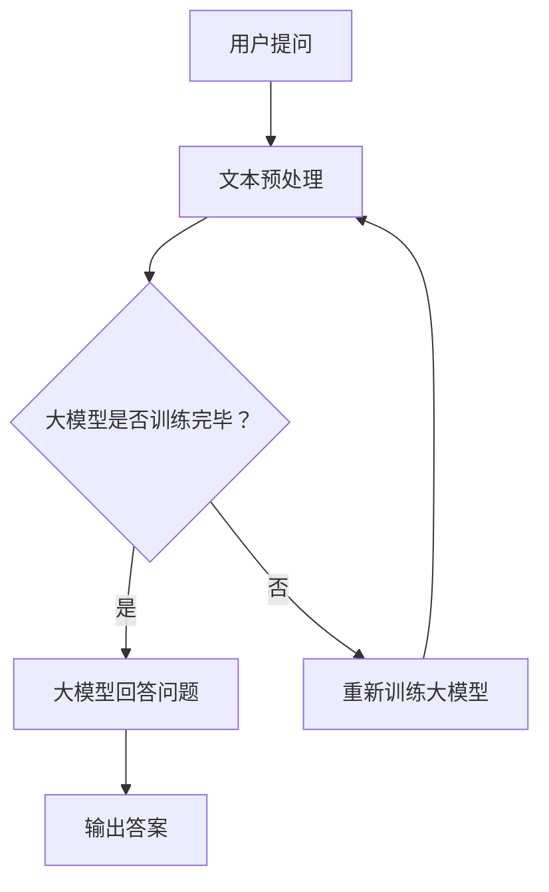

                 

# 大模型问答机器人的智能化水平

> **关键词**：大模型，问答机器人，智能化水平，机器学习，自然语言处理

> **摘要**：本文将深入探讨大模型问答机器人的智能化水平，从背景介绍、核心概念与联系、核心算法原理与操作步骤、数学模型与公式、项目实战、实际应用场景、工具和资源推荐、未来发展趋势与挑战等方面，全面解析大模型问答机器人的技术原理和实际应用。

## 1. 背景介绍

随着信息技术的飞速发展，人工智能（AI）已经成为当今世界的一大热点。机器学习（Machine Learning）和深度学习（Deep Learning）作为AI的核心技术，已经在众多领域取得了显著的成果。特别是自然语言处理（Natural Language Processing，NLP）领域，近年来更是取得了巨大的突破。大模型（Large Model）问答机器人作为自然语言处理的一个重要应用方向，逐渐成为人们关注的焦点。

大模型问答机器人通过大规模数据训练，可以理解并回答用户提出的各种问题。这种技术不仅可以应用于搜索引擎、智能客服等领域，还可以在医疗、金融、教育等多个行业发挥重要作用。然而，大模型问答机器人的智能化水平仍然存在一定的局限性，需要进一步研究和优化。

## 2. 核心概念与联系

为了深入理解大模型问答机器人的智能化水平，我们首先需要了解相关核心概念和它们之间的联系。以下是几个关键概念及其相互关系：

### 2.1 机器学习与深度学习

- **机器学习（Machine Learning）**：机器学习是利用算法从数据中学习规律，并能够对未知数据进行预测或决策的技术。它包括监督学习、无监督学习和半监督学习等不同类型。
- **深度学习（Deep Learning）**：深度学习是机器学习的一个子领域，它通过构建多层神经网络（Neural Networks）来模拟人脑的学习过程，实现自动特征提取和模式识别。

### 2.2 自然语言处理（NLP）

- **自然语言处理（Natural Language Processing，NLP）**：自然语言处理是人工智能的一个重要分支，旨在使计算机能够理解、生成和处理自然语言文本。

### 2.3 大模型（Large Model）

- **大模型（Large Model）**：大模型是指参数数量巨大、训练数据量庞大的深度学习模型。大模型通常通过大量数据训练，以获得更好的泛化能力和性能。

### 2.4 问答系统（Question Answering System）

- **问答系统（Question Answering System）**：问答系统是一种人工智能系统，它能够接收用户的问题，并从大量文本中检索出相关答案。问答系统是自然语言处理的一个重要应用方向。

### 2.5 智能化水平

- **智能化水平（Intelligence Level）**：智能化水平是指人工智能系统在自然语言理解、知识推理、决策能力等方面的表现。智能化水平越高，系统越能够模拟人类的思维和行为。

## 3. Mermaid 流程图

为了更直观地展示大模型问答机器人的工作流程，我们使用Mermaid语言绘制了一个流程图，如下所示：



在这个流程图中，用户提问首先经过文本预处理，然后由大模型进行回答。如果大模型未经过训练，则需要重新训练。最终，系统输出答案。

## 4. 核心算法原理 & 具体操作步骤

### 4.1 文本预处理

在问答机器人中，文本预处理是非常重要的一步。它包括分词、词性标注、去除停用词等操作。通过这些操作，可以有效地减少噪声，提高模型的性能。

- **分词（Tokenization）**：将文本分割成单词或短语的序列。
- **词性标注（Part-of-Speech Tagging）**：为每个单词分配词性（如名词、动词等）。
- **去除停用词（Stopword Removal）**：去除对语义贡献较小的常见单词。

### 4.2 大模型训练

大模型问答机器人的核心是大规模的预训练模型。目前，常用的预训练模型包括BERT、GPT和T5等。以下是一个简单的训练过程：

1. **数据准备**：收集大量的问题和答案对，并进行预处理。
2. **模型初始化**：选择一个预训练模型，如BERT。
3. **训练过程**：通过优化模型的参数，使得模型能够更好地理解问题和答案之间的关系。

### 4.3 回答问题

当用户提问时，问答系统首先进行文本预处理，然后将预处理后的文本输入到大模型中。大模型会自动生成回答，并经过后处理得到最终答案。

- **文本预处理**：分词、词性标注、去除停用词等。
- **大模型生成回答**：输入预处理后的文本，大模型自动生成回答。
- **后处理**：对生成的回答进行清洗、格式化等操作。

## 5. 数学模型和公式

在问答机器人中，数学模型和公式用于描述问题和答案之间的关系。以下是几个常用的数学模型和公式：

### 5.1 语义相似度计算

- **余弦相似度（Cosine Similarity）**：

$$
\text{Cosine Similarity} = \frac{\text{Query} \cdot \text{Document}}{\|\text{Query}\| \|\text{Document}\|}
$$

其中，Query和Document分别表示查询和文档的向量表示，$ \cdot $表示向量的内积，$ \|\text{Query}\| $和$ \|\text{Document}\| $表示向量的模长。

### 5.2 语言模型概率

- **语言模型概率（Language Model Probability）**：

$$
P(\text{Answer}|\text{Question}) = \frac{P(\text{Question} \cap \text{Answer})}{P(\text{Question})}
$$

其中，Answer和Question分别表示答案和问题，$ P(\text{Answer}|\text{Question}) $表示给定问题后答案的概率，$ P(\text{Question} \cap \text{Answer}) $表示问题和答案同时发生的概率，$ P(\text{Question}) $表示问题的概率。

### 5.3 问答匹配分数

- **问答匹配分数（Question-Answer Matching Score）**：

$$
\text{Score} = \text{Cosine Similarity} + \text{Language Model Probability}
$$

其中，Cosine Similarity表示语义相似度，Language Model Probability表示语言模型概率。分数越高，表示答案与问题的匹配度越高。

## 6. 项目实战：代码实际案例和详细解释说明

在本节中，我们将通过一个实际项目来展示大模型问答机器人的开发过程。这个项目使用了Hugging Face的Transformers库，这是一个流行的自然语言处理工具，用于构建和微调预训练模型。

### 6.1 开发环境搭建

在开始项目之前，我们需要搭建开发环境。以下是安装步骤：

1. **安装Python**：确保Python版本为3.6或更高。
2. **安装Hugging Face的Transformers库**：

```bash
pip install transformers
```

### 6.2 源代码详细实现和代码解读

以下是项目的源代码，我们将逐一解释每个部分的功能：

```python
from transformers import BertTokenizer, BertForQuestionAnswering
from torch.utils.data import DataLoader
import torch

# 6.2.1 初始化模型和分词器
tokenizer = BertTokenizer.from_pretrained('bert-base-uncased')
model = BertForQuestionAnswering.from_pretrained('bert-base-uncased')

# 6.2.2 文本预处理
def preprocess_text(question, context):
    question = tokenizer.encode(question, add_special_tokens=True, return_tensors='pt')
    context = tokenizer.encode(context, add_special_tokens=True, return_tensors='pt')
    return question, context

# 6.2.3 回答问题
def answer_question(question, context):
    question, context = preprocess_text(question, context)
    with torch.no_grad():
        outputs = model(question, context)
    start_logits = outputs.start_logits
    end_logits = outputs.end_logits
    start_idx = torch.argmax(start_logits).item()
    end_idx = torch.argmax(end_logits).item()
    answer = tokenizer.decode(context[int(start_idx):int(end_idx) + 1], skip_special_tokens=True)
    return answer

# 6.2.4 测试问答系统
question = "什么是人工智能？"
context = "人工智能是计算机科学的一个分支，旨在使计算机能够模拟人类智能，实现感知、理解、推理、学习和决策等功能。"
answer = answer_question(question, context)
print(answer)
```

### 6.3 代码解读与分析

1. **初始化模型和分词器**：

   ```python
   tokenizer = BertTokenizer.from_pretrained('bert-base-uncased')
   model = BertForQuestionAnswering.from_pretrained('bert-base-uncased')
   ```

   这里我们使用BERT模型和对应的分词器。BERT是一个预训练的深度学习模型，专门用于问答任务。

2. **文本预处理**：

   ```python
   def preprocess_text(question, context):
       question = tokenizer.encode(question, add_special_tokens=True, return_tensors='pt')
       context = tokenizer.encode(context, add_special_tokens=True, return_tensors='pt')
       return question, context
   ```

   文本预处理包括编码问题和上下文，并将其转换为Tensor格式。这里使用了BERT的分词器，将文本分割成单词，并为每个单词分配索引。

3. **回答问题**：

   ```python
   def answer_question(question, context):
       question, context = preprocess_text(question, context)
       with torch.no_grad():
           outputs = model(question, context)
       start_logits = outputs.start_logits
       end_logits = outputs.end_logits
       start_idx = torch.argmax(start_logits).item()
       end_idx = torch.argmax(end_logits).item()
       answer = tokenizer.decode(context[int(start_idx):int(end_idx) + 1], skip_special_tokens=True)
       return answer
   ```

   回答问题函数首先预处理问题和上下文，然后使用模型进行预测。模型输出两个标

