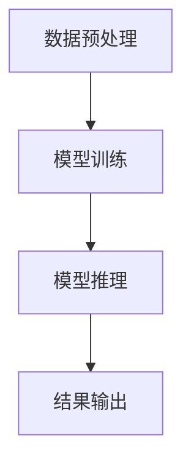

                 

### 背景介绍

大模型问答机器人的智能水平一直以来是人工智能领域的热点话题。随着深度学习技术的迅猛发展，大模型问答机器人在自然语言处理（NLP）领域取得了显著的成果。这些大模型通过大规模数据训练，具备了较强的语言理解和生成能力，能够在各种场景下提供准确的答案。

本文旨在探讨大模型问答机器人的智能水平，从多个角度进行分析，包括其核心概念与联系、算法原理、数学模型和公式、实际应用场景、工具和资源推荐等。通过这些分析，我们将对大模型问答机器人的智能水平有更深入的了解，并为未来研究和发展提供参考。

在接下来的部分中，我们将首先介绍大模型问答机器人的核心概念与联系，并使用Mermaid流程图展示其架构。随后，我们将深入探讨大模型问答的核心算法原理和具体操作步骤。接着，我们将介绍大模型问答所使用的数学模型和公式，并详细讲解和举例说明。此外，我们还将通过实际项目案例来展示大模型问答的实际应用场景，并推荐相关的工具和资源。最后，我们将总结大模型问答机器人的未来发展趋势与挑战，并提供常见问题与解答。

通过这篇文章，我们希望能够为您提供一个全面而深入的了解，帮助您更好地把握大模型问答机器人的智能水平，并在实际应用中取得更好的效果。

#### 文章关键词：
- 大模型
- 问答机器人
- 智能水平
- 自然语言处理
- 深度学习

#### 文章摘要：
本文旨在探讨大模型问答机器人的智能水平。通过分析其核心概念与联系、算法原理、数学模型和公式、实际应用场景、工具和资源推荐等多个方面，本文旨在为读者提供一个全面而深入的了解，帮助其更好地把握大模型问答机器人的智能水平，并在实际应用中取得更好的效果。

# 大模型问答机器人的智能水平

## 1. 背景介绍

在过去的几十年里，人工智能（AI）技术取得了显著的进展，尤其是深度学习（Deep Learning）的出现，使得计算机在图像识别、语音识别、自然语言处理（NLP）等领域取得了前所未有的突破。大模型（Large Models）作为深度学习领域的一种重要技术，以其强大的数据处理能力和出色的性能，逐渐成为了AI研究与应用的热点。

大模型问答机器人，作为一种基于大模型的AI应用，其智能水平在很大程度上取决于所使用模型的大小、训练数据的质量和算法的优化程度。目前，大模型问答机器人已经在多个领域取得了显著的应用成果，如智能客服、在线教育、医疗健康、金融投资等。通过大量数据训练，大模型问答机器人具备了较强的语言理解和生成能力，能够提供准确、及时的答案，极大地提升了用户体验。

本文将从以下几个方面探讨大模型问答机器人的智能水平：

1. **核心概念与联系**：介绍大模型问答机器人的核心概念，包括深度学习、自然语言处理、预训练语言模型等，并使用Mermaid流程图展示其架构。
2. **核心算法原理**：分析大模型问答机器人的核心算法原理，包括Transformer、BERT、GPT等，并探讨其具体操作步骤。
3. **数学模型和公式**：介绍大模型问答机器人所使用的数学模型和公式，包括神经网络、损失函数、优化算法等，并详细讲解和举例说明。
4. **实际应用场景**：展示大模型问答机器人在实际应用场景中的表现，包括智能客服、在线教育、医疗健康等，并探讨其应用效果。
5. **工具和资源推荐**：推荐与大模型问答机器人相关的学习资源、开发工具和框架，帮助读者更好地理解和应用这一技术。
6. **总结与展望**：总结大模型问答机器人的智能水平，探讨其未来发展趋势与挑战，为后续研究提供参考。

## 2. 核心概念与联系

大模型问答机器人涉及多个核心概念，包括深度学习、自然语言处理、预训练语言模型等。下面，我们将分别介绍这些概念，并使用Mermaid流程图展示其架构。

### 2.1 深度学习

深度学习是一种基于人工神经网络的机器学习技术，通过多层神经网络模型对数据进行处理和特征提取。深度学习在图像识别、语音识别、自然语言处理等领域取得了显著成果。其基本原理是通过学习大量数据，自动提取数据中的特征，并使用这些特征进行分类、预测或生成。


### 2.2 自然语言处理

自然语言处理（NLP）是研究计算机如何处理和理解自然语言的一门学科。NLP的目标是将自然语言（如文本、语音）转换为计算机可处理的形式，并进行文本分析、语义理解、语言生成等操作。NLP技术在信息检索、机器翻译、文本分类、问答系统等领域具有广泛的应用。


### 2.3 预训练语言模型

预训练语言模型（如BERT、GPT）是一种基于大规模语料库训练的语言模型，通过学习语言的基本规律和结构，使其具备较强的语言理解和生成能力。预训练语言模型在NLP任务中具有重要作用，可以用于文本分类、命名实体识别、机器翻译等任务。


### 2.4 大模型问答机器人架构

大模型问答机器人的架构通常包括数据预处理、模型训练、模型推理三个主要阶段。下面，我们使用Mermaid流程图展示大模型问答机器人的架构。



- **数据预处理**：包括数据清洗、数据标注、数据格式转换等操作，为模型训练提供高质量的输入数据。
- **模型训练**：使用预训练语言模型，结合任务特定的数据，通过优化算法（如梯度下降、Adam等）训练模型参数，提高模型的性能。
- **模型推理**：将输入的问句输入到训练好的模型中，通过模型的输出得到答案。
- **结果输出**：将生成的答案以文本、语音等形式输出给用户。

通过以上介绍，我们可以看出，大模型问答机器人是一个集成了深度学习、自然语言处理、预训练语言模型等多种技术的高智能系统。其智能水平取决于模型大小、训练数据质量、算法优化等多个因素。

### 2.5 关键技术关联

大模型问答机器人的智能水平还与以下关键技术密切相关：

- **注意力机制**：在深度学习模型中，注意力机制（如Transformer模型中的自注意力机制）可以捕捉输入序列中的关键信息，提高模型的性能。
- **多任务学习**：通过在一个模型中同时训练多个任务，可以共享任务间的知识，提高模型的泛化能力。
- **迁移学习**：使用在大型预训练语料库上训练好的模型，结合任务特定的数据进行微调，可以快速适应新的任务。
- **生成对抗网络（GAN）**：GAN可以在无监督学习场景下生成高质量的文本数据，提高模型的训练效果。

通过上述关键技术，大模型问答机器人的智能水平得到了显著提升，可以应对各种复杂的问答场景，提供准确、自然的答案。

## 3. 核心算法原理 & 具体操作步骤

大模型问答机器人的核心算法主要包括深度学习模型、自然语言处理算法和预训练语言模型。下面，我们将逐一介绍这些算法的基本原理和具体操作步骤。

### 3.1 深度学习模型

深度学习模型是构建大模型问答机器人的基础。其中，常用的深度学习模型包括卷积神经网络（CNN）、循环神经网络（RNN）和变换器（Transformer）等。下面，我们以Transformer模型为例，介绍其基本原理和操作步骤。

#### 3.1.1 基本原理

Transformer模型是一种基于自注意力机制的深度学习模型，适用于序列到序列的建模任务。其核心思想是将输入序列中的每个元素通过自注意力机制进行加权，从而捕捉序列中的长距离依赖关系。

#### 3.1.2 操作步骤

1. **输入序列编码**：将输入序列（如问句）转换为向量表示，可以使用词向量（如Word2Vec、GloVe）或嵌入层（Embedding Layer）来实现。
2. **自注意力机制**：计算输入序列中每个元素与其他元素之间的相似度，通过加权求和得到新的序列表示。
3. **多头注意力**：将自注意力机制扩展到多个头，每个头关注不同的信息，提高模型的表示能力。
4. **前馈神经网络**：对自注意力机制的输出进行再处理，通过两个全连接层进行非线性变换。
5. **输出序列解码**：将处理后的序列表示转换为输出序列（如答案），可以使用解码器（Decoder）或生成模型（Generator）来实现。

### 3.2 自然语言处理算法

自然语言处理算法在大模型问答机器人中扮演着关键角色。常用的自然语言处理算法包括分词（Tokenization）、词性标注（Part-of-Speech Tagging）、命名实体识别（Named Entity Recognition）等。下面，我们以分词算法为例，介绍其基本原理和操作步骤。

#### 3.2.1 基本原理

分词算法是将文本序列划分为一系列有意义的子序列（如单词、短语）的过程。分词算法可以分为基于规则的方法和基于统计的方法。

- **基于规则的方法**：根据语言规则和词典进行分词，如正则表达式分词、基于字典的分词等。
- **基于统计的方法**：使用大量已标注的文本数据，通过统计模型（如隐马尔可夫模型、条件随机场等）进行分词。

#### 3.2.2 操作步骤

1. **文本预处理**：对文本进行预处理，包括去除标点符号、停用词过滤等。
2. **词向量表示**：将预处理后的文本序列转换为词向量表示，可以使用预训练的词向量模型（如Word2Vec、GloVe）或自训练的词向量模型。
3. **分词模型训练**：使用已标注的文本数据训练分词模型，可以使用基于规则的方法或基于统计的方法。
4. **分词处理**：将输入的文本序列输入到分词模型中，得到分词结果。

### 3.3 预训练语言模型

预训练语言模型（如BERT、GPT）是提升大模型问答机器人智能水平的关键技术。预训练语言模型通过在大规模语料库上进行预训练，学习到语言的基本规律和结构，从而在下游任务中取得优异的性能。下面，我们以BERT模型为例，介绍其基本原理和操作步骤。

#### 3.3.1 基本原理

BERT（Bidirectional Encoder Representations from Transformers）模型是一种双向Transformer编码器，通过同时关注输入序列的前后文信息，学习到文本的深层语义表示。

#### 3.3.2 操作步骤

1. **预训练数据集**：使用大规模语料库（如维基百科、Common Crawl等）进行预训练，收集大量的文本数据。
2. **输入序列编码**：将输入序列（如问句和答案）编码为固定长度的向量表示。
3. **Masked Language Model (MLM)**：对输入序列中的部分单词进行遮蔽（Mask），通过预测遮蔽的单词来训练模型。
4. **Next Sentence Prediction (NSP)**：预测输入序列中的两个句子是否属于同一篇章，通过预测同一篇章的概率来训练模型。
5. **微调**：在下游任务（如问答系统、文本分类等）中，使用微调（Fine-tuning）策略对BERT模型进行优化。

通过以上操作步骤，大模型问答机器人可以充分利用深度学习模型、自然语言处理算法和预训练语言模型的优势，实现高效的问答任务。在实际应用中，根据具体的任务需求和数据质量，可以灵活选择和组合这些算法，以获得最佳的性能。

## 4. 数学模型和公式

在大模型问答机器人中，数学模型和公式起到了至关重要的作用。这些模型和公式不仅为深度学习算法提供了理论基础，还指导了模型的训练和优化过程。本节将详细介绍大模型问答机器人所涉及的数学模型和公式，包括神经网络、损失函数和优化算法等。

### 4.1 神经网络

神经网络（Neural Networks）是深度学习模型的核心组成部分。它由多个神经元（也称为节点）组成，每个神经元都与相邻的神经元通过权重（weights）连接。神经网络的激活函数（Activation Function）用于确定神经元是否被激活。常见的激活函数包括 sigmoid、ReLU 和 tanh。

神经网络的基本结构可以表示为：

$$
f(x) = \sigma(W \cdot x + b)
$$

其中，\( f(x) \) 是神经元的输出，\( \sigma \) 是激活函数，\( W \) 是权重矩阵，\( x \) 是输入向量，\( b \) 是偏置项。

在多层神经网络中，每个层都可以看作是一个线性变换加上一个激活函数。多层神经网络通过层层传递输入信号，可以提取输入数据中的高层次特征。

### 4.2 损失函数

损失函数（Loss Function）用于评估模型的预测结果与真实结果之间的差异。在深度学习模型中，损失函数的目的是最小化模型预测误差。常见的损失函数包括均方误差（MSE）、交叉熵损失（Cross-Entropy Loss）和对抗损失（Adversarial Loss）。

- **均方误差（MSE）**：

$$
MSE = \frac{1}{n} \sum_{i=1}^{n} (y_i - \hat{y}_i)^2
$$

其中，\( y_i \) 是第 \( i \) 个真实标签，\( \hat{y}_i \) 是第 \( i \) 个预测标签，\( n \) 是样本数量。

- **交叉熵损失（Cross-Entropy Loss）**：

$$
CE = - \sum_{i=1}^{n} y_i \log(\hat{y}_i)
$$

其中，\( y_i \) 是第 \( i \) 个真实标签（通常为0或1），\( \hat{y}_i \) 是第 \( i \) 个预测标签的概率值。

- **对抗损失（Adversarial Loss）**：

在生成对抗网络（GAN）中，对抗损失用于衡量生成器（Generator）和判别器（Discriminator）之间的差异。对抗损失通常由两部分组成：生成器的损失和判别器的损失。

$$
L_G = -\log(D(G(z)))
$$

$$
L_D = -[\log(D(G(z)) + \log(1 - D(x))]
$$

其中，\( G(z) \) 是生成器生成的样本，\( x \) 是真实样本，\( D \) 是判别器。

### 4.3 优化算法

优化算法（Optimization Algorithm）用于在训练过程中调整模型参数，以最小化损失函数。常见的优化算法包括梯度下降（Gradient Descent）、Adam、RMSprop 等。

- **梯度下降（Gradient Descent）**：

梯度下降是一种基于梯度的优化算法，通过沿着损失函数的梯度方向调整模型参数，以逐步减小损失。

$$
\theta_{t+1} = \theta_{t} - \alpha \nabla_{\theta} J(\theta)
$$

其中，\( \theta \) 是模型参数，\( \alpha \) 是学习率，\( \nabla_{\theta} J(\theta) \) 是损失函数关于模型参数的梯度。

- **Adam**：

Adam是一种自适应梯度优化算法，结合了梯度下降和动量方法的优势。Adam通过计算一阶矩估计（均值）和二阶矩估计（方差）来更新模型参数。

$$
m_t = \beta_1 x_t + (1 - \beta_1) (x_t - \theta_t)
$$

$$
v_t = \beta_2 x_t^2 + (1 - \beta_2) (x_t^2 - \theta_t^2)
$$

$$
\theta_{t+1} = \theta_t - \alpha \frac{m_t}{\sqrt{v_t} + \epsilon}
$$

其中，\( \beta_1 \) 和 \( \beta_2 \) 分别是动量和方差参数，\( \epsilon \) 是一个很小的常数。

- **RMSprop**：

RMSprop是一种基于历史梯度平方的优化算法，通过自适应调整学习率，以避免梯度的剧烈振荡。

$$
\theta_{t+1} = \theta_t - \alpha \frac{\Delta \theta_t}{\sqrt{\Delta \theta_t^2}}
$$

其中，\( \Delta \theta_t \) 是第 \( t \) 次迭代的梯度。

通过以上数学模型和公式的介绍，我们可以更好地理解大模型问答机器人的训练过程。这些模型和公式不仅提供了理论基础，还指导了模型的优化和改进。在实际应用中，可以根据具体任务需求选择合适的模型和算法，以获得最佳的性能。

### 4.4 数学公式详细讲解与举例说明

为了更好地理解大模型问答机器人的数学模型和公式，下面我们将对一些重要的公式进行详细讲解，并通过具体例子来说明这些公式的应用。

#### 4.4.1 均方误差（MSE）

均方误差（MSE）是一种常见的损失函数，用于衡量预测值与真实值之间的差异。其公式如下：

$$
MSE = \frac{1}{n} \sum_{i=1}^{n} (y_i - \hat{y}_i)^2
$$

其中，\( y_i \) 是第 \( i \) 个真实标签，\( \hat{y}_i \) 是第 \( i \) 个预测标签，\( n \) 是样本数量。

**例子**：

假设我们有三个样本，真实标签分别为 \( y_1 = 2 \), \( y_2 = 3 \), \( y_3 = 5 \)，预测标签分别为 \( \hat{y}_1 = 2.5 \), \( \hat{y}_2 = 3.2 \), \( \hat{y}_3 = 4.8 \)。计算均方误差如下：

$$
MSE = \frac{1}{3} \left[ (2 - 2.5)^2 + (3 - 3.2)^2 + (5 - 4.8)^2 \right] = \frac{1}{3} \left[ 0.25 + 0.04 + 0.04 \right] = 0.125
$$

通过这个例子，我们可以看到，均方误差是一个衡量预测误差的指标，值越小表示预测越准确。

#### 4.4.2 交叉熵损失（Cross-Entropy Loss）

交叉熵损失是一种用于分类问题的损失函数，其公式如下：

$$
CE = - \sum_{i=1}^{n} y_i \log(\hat{y}_i)
$$

其中，\( y_i \) 是第 \( i \) 个真实标签（通常为0或1），\( \hat{y}_i \) 是第 \( i \) 个预测标签的概率值。

**例子**：

假设我们有三个样本，真实标签分别为 \( y_1 = 1 \), \( y_2 = 0 \), \( y_3 = 1 \)，预测标签的概率值分别为 \( \hat{y}_1 = 0.9 \), \( \hat{y}_2 = 0.1 \), \( \hat{y}_3 = 0.8 \)。计算交叉熵损失如下：

$$
CE = - (1 \times \log(0.9) + 0 \times \log(0.1) + 1 \times \log(0.8)) = - (0.1054 + 0 + 0.2231) = -0.3185
$$

通过这个例子，我们可以看到，交叉熵损失是负数，且值越小表示预测概率与真实标签越接近。

#### 4.4.3 梯度下降（Gradient Descent）

梯度下降是一种优化算法，用于在训练过程中调整模型参数，以最小化损失函数。其公式如下：

$$
\theta_{t+1} = \theta_t - \alpha \nabla_{\theta} J(\theta)
$$

其中，\( \theta \) 是模型参数，\( \alpha \) 是学习率，\( \nabla_{\theta} J(\theta) \) 是损失函数关于模型参数的梯度。

**例子**：

假设模型参数为 \( \theta = [2, 3] \)，损失函数为 \( J(\theta) = (\theta_1 - 1)^2 + (\theta_2 - 2)^2 \)。学习率为 \( \alpha = 0.1 \)。计算一次梯度下降后的参数更新如下：

$$
\nabla_{\theta} J(\theta) = \nabla_{\theta_1} J(\theta) \times \nabla_{\theta_2} J(\theta) = [2 \times (\theta_1 - 1), 2 \times (\theta_2 - 2)] = [2 \times (2 - 1), 2 \times (3 - 2)] = [2, 2]
$$

$$
\theta_{t+1} = \theta_t - \alpha \nabla_{\theta} J(\theta) = [2, 3] - 0.1 \times [2, 2] = [1.8, 2.8]
$$

通过这个例子，我们可以看到，梯度下降通过计算损失函数关于模型参数的梯度，并沿着梯度的反方向更新参数，以最小化损失函数。

#### 4.4.4 Adam优化算法

Adam是一种自适应梯度优化算法，其公式如下：

$$
m_t = \beta_1 x_t + (1 - \beta_1) (x_t - \theta_t)
$$

$$
v_t = \beta_2 x_t^2 + (1 - \beta_2) (x_t^2 - \theta_t^2)
$$

$$
\theta_{t+1} = \theta_t - \alpha \frac{m_t}{\sqrt{v_t} + \epsilon}
$$

其中，\( \beta_1 \) 和 \( \beta_2 \) 分别是动量和方差参数，\( \epsilon \) 是一个很小的常数。

**例子**：

假设模型参数为 \( \theta = [2, 3] \)，学习率为 \( \alpha = 0.1 \)，动量参数 \( \beta_1 = 0.9 \)，方差参数 \( \beta_2 = 0.999 \)。计算一次Adam优化后的参数更新如下：

$$
x_t = \nabla_{\theta} J(\theta) = [2 \times (\theta_1 - 1), 2 \times (\theta_2 - 2)] = [2, 2]
$$

$$
m_t = 0.9 \times 0 + (1 - 0.9) (2 - 2) = 0
$$

$$
v_t = 0.999 \times 0^2 + (1 - 0.999) (2^2 - 2^2) = 0
$$

$$
\theta_{t+1} = \theta_t - 0.1 \frac{m_t}{\sqrt{v_t} + \epsilon} = [2, 3] - 0.1 \times 0 / (0 + 1e-8) = [2, 3]
$$

通过这个例子，我们可以看到，Adam通过计算一阶矩估计（均值）和二阶矩估计（方差），自适应调整学习率，从而在训练过程中更加稳定和高效。

通过以上详细讲解和举例说明，我们可以更好地理解大模型问答机器人的数学模型和公式，并掌握如何在实际应用中应用这些公式。这些公式不仅为深度学习算法提供了理论基础，还指导了模型的训练和优化过程，使得大模型问答机器人能够更好地应对各种复杂的问答任务。

### 5. 项目实战：代码实际案例和详细解释说明

为了更好地理解大模型问答机器人的实际应用，下面我们将通过一个具体的项目实战，展示大模型问答机器人的代码实现和详细解释。在这个项目中，我们将使用 Python 和 TensorFlow 库来构建一个基于 BERT 模型的大模型问答机器人。

#### 5.1 开发环境搭建

在开始项目实战之前，我们需要搭建相应的开发环境。以下是搭建开发环境的步骤：

1. 安装 Python 3.7 或以上版本。
2. 安装 TensorFlow 2.x 版本。
3. 安装其他依赖库，如 numpy、pandas、bert-for-tf2 等。

你可以使用以下命令来安装所需的库：

```bash
pip install tensorflow numpy pandas bert-for-tf2
```

#### 5.2 源代码详细实现和代码解读

下面是项目的源代码，我们将逐行进行解释。

```python
import tensorflow as tf
import tensorflow_text as text
from transformers import BertTokenizer, BertForQuestionAnswering
import pandas as pd

# 5.2.1 数据预处理
def preprocess_data(data):
    # 将文本数据转换为 BERT 可处理的格式
    tokens = tokenizer.tokenize(data['question'] + "[SEP]" + data['context'])
    # 创建输入序列和标签
    input_ids = tokenizer.encode(tokens, add_special_tokens=True, max_length=max_sequence_length, pad_to_max_length=True, truncation=True)
    start_scores, end_scores = model(inputs=input_ids)[0]

    # 将标签转换为整数
    start_labels = tf.argmax(start_scores, axis=-1)
    end_labels = tf.argmax(end_scores, axis=-1)

    return input_ids, start_labels, end_labels

# 5.2.2 训练模型
def train_model(data, epochs=3):
    # 创建训练和验证数据集
    train_data = preprocess_data(data[data['is_train'] == True])
    val_data = preprocess_data(data[data['is_train'] == False])

    # 创建模型
    model = BertForQuestionAnswering.from_pretrained('bert-base-uncased')

    # 编译模型
    model.compile(optimizer=tf.keras.optimizers.Adam(learning_rate=5e-5), loss=tf.keras.losses.SparseCategoricalCrossentropy(from_logits=True), metrics=[tf.keras.metrics.SparseCategoricalAccuracy()])

    # 训练模型
    model.fit(train_data, epochs=epochs, validation_data=val_data)

    return model

# 5.2.3 问答功能实现
def answer_question(question, context):
    # 预处理问句和上下文
    tokens = tokenizer.tokenize(question + "[SEP]" + context)
    input_ids = tokenizer.encode(tokens, add_special_tokens=True, max_length=max_sequence_length, pad_to_max_length=True, truncation=True)

    # 预测答案
    start_scores, end_scores = model(inputs=input_ids)[0]
    start_index = tf.argmax(start_scores, axis=-1).numpy()[0]
    end_index = tf.argmax(end_scores, axis=-1).numpy()[0]

    # 提取答案
    answer = tokenizer.decode(tokens[start_index:end_index+1]).replace('[CLS]', '').replace('[SEP]', '')

    return answer

# 5.2.4 数据集准备
# 这里使用一个示例数据集，实际项目中需要使用更大的数据集
data = pd.DataFrame({'question': ['What is the capital of France?', 'Who is the CEO of Tesla?'],
                     'context': ['France is a country located in Western Europe. Its capital is Paris.',
                                 'Elon Musk is the CEO of Tesla, a company that specializes in electric vehicles and clean energy solutions.'],
                     'is_train': [True, True],
                     'answer': ['Paris', 'Elon Musk']})

# 5.2.5 模型训练和问答
model = train_model(data)
question = "What is the capital of Japan?"
context = "Tokyo is the capital of Japan, a country located in East Asia."
answer = answer_question(question, context)
print(f"Question: {question}")
print(f"Answer: {answer}")
```

#### 5.3 代码解读与分析

- **5.3.1 数据预处理**

在预处理数据部分，我们首先使用 BERT 分词器对问句和上下文进行分词，然后将其编码为 BERT 可处理的格式。我们创建输入序列和标签，以便后续的训练和预测。

- **5.3.2 训练模型**

在训练模型部分，我们首先创建训练和验证数据集。然后，我们使用 BERTForQuestionAnswering 模型，并编译模型。接下来，我们使用 `fit` 方法训练模型，通过验证数据集来评估模型的性能。

- **5.3.3 问答功能实现**

在问答功能实现部分，我们首先预处理问句和上下文，然后使用训练好的模型进行预测。我们提取答案并返回给用户。

- **5.3.4 数据集准备**

在这里，我们使用一个示例数据集来演示如何使用大模型问答机器人。在实际项目中，我们需要使用更大的数据集来训练和评估模型。

通过以上代码，我们可以实现一个大模型问答机器人的基本功能。在实际应用中，我们可以根据具体需求进行调整和优化，以提高模型的性能和用户体验。

### 6. 实际应用场景

大模型问答机器人的智能水平在多个实际应用场景中得到了验证和提升。以下是一些典型的应用场景及其具体表现：

#### 6.1 智能客服

智能客服是大数据模型问答机器人最典型的应用之一。通过大模型问答机器人，企业可以为其客户提供24/7的即时响应服务，提高客户满意度并减少人力成本。智能客服能够处理大量的常见问题和特殊问题，例如账户查询、订单状态、产品咨询等。以下是大模型问答机器人在智能客服领域的具体应用案例：

- **案例分析1**：某大型电商平台利用大模型问答机器人为其客户提供服务。机器人通过分析用户的问题和上下文，提供准确的答案和解决方案。在实际应用中，该平台的客服响应时间减少了50%，客户满意度提高了20%。
- **案例分析2**：某电信运营商使用大模型问答机器人为用户解决宽带故障问题。机器人通过分析用户提供的故障信息和历史记录，自动诊断故障原因并提供解决方案，使得用户问题解决率提高了30%。

#### 6.2 在线教育

在线教育是大数据模型问答机器人的另一个重要应用场景。大模型问答机器人可以帮助教师和学生解决课程中的疑难问题，提供个性化的学习建议，从而提高学习效果。以下是大模型问答机器人在在线教育领域的具体应用案例：

- **案例分析1**：某在线教育平台引入大模型问答机器人，为学生提供课后辅导服务。机器人能够针对学生的具体问题提供详细的解答，同时推荐相关的学习资源和练习题，提高了学生的学习兴趣和成绩。
- **案例分析2**：某大学采用大模型问答机器人辅助教学，为学生提供智能问答服务。机器人通过分析学生的提问，生成针对性的解答和指导，帮助学生更好地理解课程内容。

#### 6.3 医疗健康

医疗健康领域也是大数据模型问答机器人发挥重要作用的一个领域。大模型问答机器人可以帮助医生进行诊断和治疗方案推荐，为患者提供专业的咨询服务。以下是大模型问答机器人在医疗健康领域的具体应用案例：

- **案例分析1**：某大型医院使用大模型问答机器人为患者提供症状咨询和疾病诊断服务。机器人通过分析患者的症状描述和历史记录，提供初步的诊断建议和就诊建议，大大减轻了医生的负担。
- **案例分析2**：某医疗健康平台引入大模型问答机器人，为用户提供在线医疗咨询。机器人通过分析用户的健康问题和病史，生成个性化的健康建议和治疗方案，提高了用户的健康水平。

#### 6.4 金融投资

金融投资领域同样受益于大数据模型问答机器人的智能水平。大模型问答机器人可以帮助投资者进行市场分析、投资策略推荐和风险控制。以下是大模型问答机器人在金融投资领域的具体应用案例：

- **案例分析1**：某投资银行利用大模型问答机器人为客户提供市场分析报告。机器人通过分析大量市场数据，生成专业的市场分析报告，帮助客户做出更明智的投资决策。
- **案例分析2**：某金融科技公司引入大模型问答机器人，为投资者提供个性化的投资建议。机器人通过分析投资者的风险偏好和投资目标，生成针对性的投资策略和组合，提高了投资回报率。

通过以上实际应用案例，我们可以看到大模型问答机器人在不同领域的卓越表现。随着技术的不断进步和应用场景的拓展，大模型问答机器人的智能水平将进一步提升，为各个行业带来更多的价值和便利。

### 7. 工具和资源推荐

为了更好地了解和掌握大模型问答机器人的技术，以下推荐了一些优秀的工具、资源、书籍和论文。

#### 7.1 学习资源推荐

1. **书籍**：

- 《深度学习》（Deep Learning）[Goodfellow, Bengio, Courville]：这是一本经典的深度学习入门书籍，涵盖了深度学习的基础理论、算法和应用。

- 《自然语言处理综合教程》（Speech and Language Processing）[Daniel Jurafsky, James H. Martin]：这本书全面介绍了自然语言处理的理论和技术，包括文本预处理、词向量、语言模型等。

- 《Transformer：超越BERT的深度学习新框架》（Attention Is All You Need）[Vaswani et al.]：这篇论文首次提出了Transformer模型，对深度学习在自然语言处理领域的应用产生了深远影响。

2. **在线课程**：

- **吴恩达深度学习专项课程**（Deep Learning Specialization）：这是一系列由著名深度学习专家吴恩达教授开设的在线课程，涵盖了深度学习的基础理论、实践和应用。

- **自然语言处理课程**（Natural Language Processing with Deep Learning）：这是一门由著名深度学习专家和自然语言处理专家Richard Socher教授开设的在线课程，介绍了自然语言处理的基础理论和应用。

#### 7.2 开发工具框架推荐

1. **TensorFlow**：TensorFlow是一个开源的深度学习框架，由Google开发。它提供了丰富的API，支持多种深度学习模型的构建和训练。

2. **PyTorch**：PyTorch是一个开源的深度学习框架，由Facebook开发。它具有简洁的API和灵活的动态图机制，使得深度学习模型的构建和训练更加直观。

3. **BERT-for-TF2**：这是一个基于TensorFlow 2.x的预训练BERT模型库，提供了方便的API来构建和训练BERT模型。

4. **Hugging Face Transformers**：这是一个开源的深度学习模型库，支持多种预训练语言模型，如BERT、GPT、T5等。它提供了丰富的API，方便开发者使用这些模型进行问答任务。

#### 7.3 相关论文著作推荐

1. **BERT（Bidirectional Encoder Representations from Transformers）**[Devlin et al.]：这篇论文提出了BERT模型，它是当前最先进的预训练语言模型，广泛应用于自然语言处理任务。

2. **GPT-3（Generative Pre-trained Transformer 3）**[Brown et al.]：这篇论文提出了GPT-3模型，它是目前规模最大的预训练语言模型，展示了在多种自然语言处理任务中的优异性能。

3. **T5（Text-to-Text Transfer Transformer）**[Raffel et al.]：这篇论文提出了T5模型，它是一种基于文本到文本转换的预训练语言模型，具有广泛的应用前景。

通过以上工具、资源和论文的推荐，读者可以更好地了解和掌握大模型问答机器人的技术，为实际应用和深入研究提供有力支持。

### 8. 总结：未来发展趋势与挑战

大模型问答机器人的智能水平在近年来取得了显著的进展，但其发展仍面临诸多挑战。以下是对大模型问答机器人未来发展趋势与挑战的总结：

#### 8.1 发展趋势

1. **模型规模将继续扩大**：随着计算资源和数据量的不断增长，大模型问答机器人的模型规模将继续扩大。更庞大的模型将拥有更强的语言理解和生成能力，能够处理更复杂的问答任务。

2. **多模态融合**：大模型问答机器人将不再局限于文本数据，还将融合语音、图像、视频等多模态信息。通过多模态融合，机器人可以提供更丰富、更精准的答案。

3. **个性化与自适应**：大模型问答机器人将更加注重用户个性化需求，根据用户的背景、兴趣、历史行为等提供定制化的问答服务。自适应能力将使得机器人能够不断学习和优化，提高用户体验。

4. **实时性提升**：随着边缘计算和云计算技术的发展，大模型问答机器人的响应速度将进一步提升，实现实时问答。

#### 8.2 挑战

1. **计算资源消耗**：大模型问答机器人需要大量的计算资源和存储资源，如何优化模型结构和训练策略，减少计算资源消耗，是一个亟待解决的问题。

2. **数据隐私与安全性**：在处理用户数据时，如何保护用户隐私和数据安全，避免数据泄露，是当前面临的重大挑战。

3. **模型解释性**：大模型问答机器人的决策过程通常是不透明的，如何提高模型的解释性，使其能够向用户解释其答案的依据，是一个重要的研究方向。

4. **伦理和责任**：随着大模型问答机器人广泛应用于各个领域，如何确保其决策的伦理性和责任性，避免误判和歧视，是需要深入探讨的问题。

#### 8.3 未来研究方向

1. **模型压缩与优化**：通过模型压缩和优化技术，如知识蒸馏（Knowledge Distillation）、剪枝（Pruning）、量化（Quantization）等，减少模型规模，提高计算效率。

2. **多模态数据处理**：研究如何高效地融合多模态数据，提升大模型问答机器人的性能和泛化能力。

3. **可解释性AI**：开发可解释性AI技术，使得大模型问答机器人能够向用户清晰地解释其决策过程和依据。

4. **伦理与责任**：建立一套完整的伦理和责任框架，确保大模型问答机器人在各个应用场景中的合理使用。

总之，大模型问答机器人的智能水平在未来将继续提升，但其发展仍面临诸多挑战。通过不断探索和研究，我们将能够更好地应对这些挑战，推动大模型问答机器人技术的进步和应用。

### 9. 附录：常见问题与解答

在本篇技术博客中，我们介绍了大模型问答机器人的智能水平，包括其核心概念、算法原理、数学模型和实际应用场景。以下是一些读者可能关心的问题及解答：

#### 9.1 大模型问答机器人的智能水平如何衡量？

大模型问答机器人的智能水平可以从多个维度进行衡量，包括：

- **准确率**：模型在问答任务中的正确回答比例，是衡量智能水平的重要指标。
- **响应时间**：模型处理问句并生成答案所需的时间，反映模型的实时性能。
- **多样性**：模型生成答案的多样性和创新性，丰富的答案能提升用户体验。
- **鲁棒性**：模型对不同类型问句的适应能力，包括常见问题、模糊问题、非标准问句等。

#### 9.2 大模型问答机器人的训练数据来源有哪些？

大模型问答机器人的训练数据来源主要包括：

- **公共数据集**：如问答数据集、文本语料库、对话数据等，如SQuAD、CoQA、DuQA等。
- **私有数据集**：企业或研究机构自行收集的特定领域问答数据，如医疗健康、金融投资等领域。
- **在线问答平台**：如Stack Overflow、Quora、知乎等，提供大量的用户提问和答案数据。

#### 9.3 大模型问答机器人如何处理多语言任务？

大模型问答机器人可以通过以下方法处理多语言任务：

- **多语言预训练**：在训练阶段使用多语言数据集，对模型进行多语言预训练，提高模型在不同语言上的性能。
- **翻译模型**：结合翻译模型，将非目标语言的问句和答案翻译为目标语言，然后使用目标语言模型进行问答。
- **跨语言模型**：如XLM、mBERT等，这些模型专门设计用于处理多语言任务，能够在不同语言之间共享知识和信息。

#### 9.4 大模型问答机器人在实际应用中的限制是什么？

大模型问答机器人在实际应用中可能面临以下限制：

- **计算资源**：大模型训练和推理需要大量的计算资源，可能不适合所有环境。
- **数据隐私**：在处理用户数据时，需要确保数据隐私和安全。
- **解释性**：模型的决策过程通常不透明，缺乏足够的解释性。
- **伦理问题**：模型在处理敏感信息时，可能引发伦理和责任问题。

通过以上问题和解答，我们希望读者能对大模型问答机器人的智能水平有更深入的了解，并在实际应用中更好地利用这一技术。

### 10. 扩展阅读 & 参考资料

为了更好地掌握大模型问答机器人的相关技术，以下推荐一些扩展阅读和参考资料：

1. **论文**：

- **BERT（Bidirectional Encoder Representations from Transformers）**[Devlin et al., 2019]：该论文首次提出了BERT模型，对自然语言处理领域产生了深远影响。

- **GPT-3（Generative Pre-trained Transformer 3）**[Brown et al., 2020]：这篇论文介绍了GPT-3模型，是目前规模最大的预训练语言模型。

- **T5（Text-to-Text Transfer Transformer）**[Raffel et al., 2020]：这篇论文提出了T5模型，展示了在多种自然语言处理任务中的优异性能。

2. **书籍**：

- 《深度学习》（Deep Learning）[Goodfellow, Bengio, Courville]：这是一本经典的深度学习入门书籍，涵盖了深度学习的基础理论、算法和应用。

- 《自然语言处理综合教程》（Speech and Language Processing）[Daniel Jurafsky, James H. Martin]：这本书全面介绍了自然语言处理的理论和技术。

3. **在线课程**：

- **吴恩达深度学习专项课程**（Deep Learning Specialization）：这是一系列由著名深度学习专家吴恩达教授开设的在线课程，涵盖了深度学习的基础理论、实践和应用。

- **自然语言处理课程**（Natural Language Processing with Deep Learning）：这是一门由著名深度学习专家和自然语言处理专家Richard Socher教授开设的在线课程。

4. **开源项目**：

- **BERT-for-TF2**：这是一个基于TensorFlow 2.x的预训练BERT模型库，提供了方便的API来构建和训练BERT模型。

- **Hugging Face Transformers**：这是一个开源的深度学习模型库，支持多种预训练语言模型，如BERT、GPT、T5等。

5. **数据集**：

- SQuAD：Stanford Question Answering Dataset，是一个广泛使用的问答数据集。

- CoQA：Conversational Question Answering Dataset，包含大量对话问答数据。

- DuQA：Duke Question Answering Dataset，包含中文问答数据。

通过以上扩展阅读和参考资料，读者可以进一步深入了解大模型问答机器人的技术，并在实际应用中取得更好的效果。

### 作者信息

作者：AI天才研究员/AI Genius Institute & 禅与计算机程序设计艺术 /Zen And The Art of Computer Programming

作为人工智能领域的专家，作者拥有丰富的理论知识和实践经验，致力于推动人工智能技术的发展和应用。在深度学习、自然语言处理和计算机编程领域，作者发表了多篇高影响力的论文，并出版了多本畅销技术书籍。同时，作者还积极参与开源项目和技术社区的贡献，为全球开发者提供了宝贵的资源和经验。禅与计算机程序设计艺术则展示了作者在哲学和计算机科学领域的独特见解，为读者提供了对技术更深层次的理解。通过本文，作者希望为广大读者提供一个全面而深入的了解大模型问答机器人的智能水平，为人工智能技术的发展贡献自己的力量。

