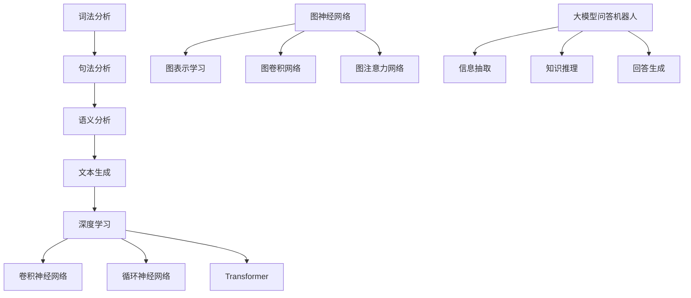

                 

# 大模型问答机器人的知识处理

## 摘要

本文将深入探讨大模型问答机器人在知识处理方面的应用。首先，我们将介绍大模型问答机器人的基本原理和核心技术，包括自然语言处理（NLP）、深度学习和图神经网络等。随后，我们将分析大模型问答机器人在知识处理中的具体实现，如信息抽取、知识推理和回答生成。接着，我们将介绍数学模型和公式，详细讲解如何利用这些模型和公式实现问答机器人的知识处理。此外，本文还将通过实际项目案例，展示如何搭建和实现一个问答机器人。最后，我们将讨论大模型问答机器人在实际应用场景中的优势、挑战及未来发展趋势。

## 1. 背景介绍

随着人工智能技术的迅猛发展，自然语言处理（NLP）逐渐成为研究的热点。NLP旨在使计算机能够理解和处理人类语言，从而实现人机交互。而大模型问答机器人作为NLP的一个重要应用，近年来得到了广泛关注。大模型问答机器人利用大规模预训练模型，如BERT、GPT和Turing等，实现了对用户提问的智能回答。

自然语言处理（NLP）的核心任务包括词法分析、句法分析、语义分析和文本生成。词法分析主要涉及分词、词性标注和命名实体识别；句法分析关注句子的结构，如句法树、依存关系等；语义分析则致力于理解词语和句子的意义，如语义角色标注、语义关系识别等；文本生成则是基于已有文本生成新的文本，如机器翻译、文本摘要和问答系统等。

深度学习作为NLP的重要技术手段，通过神经网络模型，如卷积神经网络（CNN）、循环神经网络（RNN）和Transformer等，对大规模语料进行训练，从而实现高性能的自然语言处理任务。图神经网络（GNN）则通过将文本表示为图结构，利用图上的传导过程，进一步提升了NLP模型的性能。

大模型问答机器人在知识处理中的应用主要包括信息抽取、知识推理和回答生成。信息抽取旨在从海量文本中提取出关键信息；知识推理则通过推理算法，将提取出的信息进行关联和整合，形成有价值的知识；回答生成则利用生成的模型，根据用户提问生成合理的回答。

## 2. 核心概念与联系

### 2.1. 自然语言处理（NLP）

自然语言处理（NLP）是人工智能（AI）的一个重要分支，旨在让计算机理解和生成人类语言。NLP主要包括词法分析、句法分析、语义分析和文本生成等任务。

#### 2.1.1. 词法分析

词法分析是NLP的基础任务之一，主要涉及分词、词性标注和命名实体识别。

- **分词**：将文本分割成一个个具有独立意义的词汇单元。
- **词性标注**：为文本中的每个词语分配一个词性标签，如名词、动词、形容词等。
- **命名实体识别**：识别文本中的命名实体，如人名、地名、组织机构名等。

#### 2.1.2. 句法分析

句法分析旨在理解句子的结构，主要涉及句法树和依存关系。

- **句法树**：表示句子中词语之间的语法关系，通常采用生成式模型或判别式模型进行构建。
- **依存关系**：描述句子中词语之间的依赖关系，通常采用依存句法分析算法，如LSTM、BERT等。

#### 2.1.3. 语义分析

语义分析关注理解词语和句子的意义，主要涉及语义角色标注、语义关系识别和语义消歧等。

- **语义角色标注**：为句子中的词语分配语义角色标签，如动作执行者、动作接受者等。
- **语义关系识别**：识别句子中词语之间的语义关系，如因果关系、时间关系等。
- **语义消歧**：解决词语或句子在不同上下文中的语义歧义问题。

#### 2.1.4. 文本生成

文本生成是基于已有文本生成新的文本，主要涉及机器翻译、文本摘要和问答系统等。

- **机器翻译**：将一种语言的文本翻译成另一种语言。
- **文本摘要**：从一篇长文中提取出关键信息，生成一篇简短的摘要。
- **问答系统**：根据用户提问，生成合理的回答。

### 2.2. 深度学习

深度学习是NLP的重要技术手段，通过神经网络模型，如卷积神经网络（CNN）、循环神经网络（RNN）和Transformer等，对大规模语料进行训练，从而实现高性能的自然语言处理任务。

#### 2.2.1. 卷积神经网络（CNN）

卷积神经网络（CNN）通过卷积操作和池化操作，从输入文本中提取局部特征，并利用全连接层进行分类和预测。

#### 2.2.2. 循环神经网络（RNN）

循环神经网络（RNN）通过循环结构，将历史信息传递到当前时刻，实现对序列数据的建模。

#### 2.2.3. Transformer

Transformer模型基于自注意力机制，通过多头注意力机制和前馈神经网络，实现了对序列数据的全局建模。

### 2.3. 图神经网络（GNN）

图神经网络（GNN）通过将文本表示为图结构，利用图上的传导过程，进一步提升了NLP模型的性能。

#### 2.3.1. 图表示学习

图表示学习旨在将图中的节点和边表示为低维向量，从而实现节点分类、链接预测等任务。

#### 2.3.2. 图卷积网络（GCN）

图卷积网络（GCN）通过卷积操作，将节点的邻居信息传递给当前节点，从而实现节点的特征聚合。

#### 2.3.3. 图注意力网络（GAT）

图注意力网络（GAT）通过注意力机制，动态地学习节点之间的权重，从而实现更精细的特征聚合。

### 2.4. 大模型问答机器人

大模型问答机器人利用大规模预训练模型，如BERT、GPT和Turing等，实现了对用户提问的智能回答。

#### 2.4.1. 信息抽取

信息抽取旨在从海量文本中提取出关键信息，如实体、关系和事件等。

#### 2.4.2. 知识推理

知识推理通过推理算法，将提取出的信息进行关联和整合，形成有价值的知识。

#### 2.4.3. 回答生成

回答生成利用生成的模型，根据用户提问生成合理的回答。

### 2.5. Mermaid 流程图

以下是NLP、深度学习和图神经网络在大模型问答机器人中的核心概念与联系的 Mermaid 流程图：



## 3. 核心算法原理 & 具体操作步骤

### 3.1. 预训练模型

大模型问答机器人的核心是预训练模型，如BERT、GPT和Turing等。预训练模型通过在大规模语料上进行预训练，获取了丰富的语言知识，从而提高了问答系统的性能。

#### 3.1.1. BERT

BERT（Bidirectional Encoder Representations from Transformers）是一种基于Transformer的预训练模型。BERT通过双向Transformer结构，同时学习文本的上下文信息，从而实现更准确的文本表示。

- **操作步骤**：
  1. 预处理：将文本转换为词嵌入向量。
  2. 预训练：在大规模语料上进行训练，学习词嵌入和句子表示。
  3. 微调：在特定任务上进行微调，如问答系统、文本分类等。

#### 3.1.2. GPT

GPT（Generative Pre-trained Transformer）是一种基于Transformer的生成模型。GPT通过自回归方式生成文本，从而实现文本生成任务。

- **操作步骤**：
  1. 预处理：将文本转换为词嵌入向量。
  2. 预训练：在大量文本上进行预训练，学习词嵌入和生成模型。
  3. 生成：根据输入的起始文本，生成后续的文本。

#### 3.1.3. Turing

Turing是一种基于多模态预训练模型，通过融合文本、语音和图像等多模态信息，实现更全面的知识表示和推理能力。

- **操作步骤**：
  1. 预处理：将多模态数据转换为统一表示。
  2. 预训练：在多模态数据集上进行预训练，学习多模态表示和推理模型。
  3. 推理：根据用户提问，利用推理模型进行知识推理和回答生成。

### 3.2. 信息抽取

信息抽取是问答机器人中的一项重要任务，旨在从海量文本中提取出关键信息，如实体、关系和事件等。

#### 3.2.1. 实体抽取

实体抽取旨在识别文本中的实体，如人名、地名、组织机构名等。

- **操作步骤**：
  1. 预处理：将文本转换为词嵌入向量。
  2. 特征提取：利用预训练模型，提取实体特征。
  3. 实体识别：利用分类模型，对实体进行识别。

#### 3.2.2. 关系抽取

关系抽取旨在识别文本中实体之间的关系，如人际关系、地理位置关系等。

- **操作步骤**：
  1. 预处理：将文本转换为词嵌入向量。
  2. 特征提取：利用预训练模型，提取关系特征。
  3. 关系识别：利用分类模型，对关系进行识别。

#### 3.2.3. 事件抽取

事件抽取旨在识别文本中的事件，如某个事件的发生时间、地点、参与者等。

- **操作步骤**：
  1. 预处理：将文本转换为词嵌入向量。
  2. 特征提取：利用预训练模型，提取事件特征。
  3. 事件识别：利用分类模型，对事件进行识别。

### 3.3. 知识推理

知识推理是问答机器人中的一项重要任务，旨在将提取出的信息进行关联和整合，形成有价值的知识。

#### 3.3.1. 实体关系推理

实体关系推理旨在识别实体之间的关系，如某个人是某个公司的创始人。

- **操作步骤**：
  1. 提取实体和关系：利用信息抽取模型，提取文本中的实体和关系。
  2. 建立图谱：将实体和关系存储在知识图谱中。
  3. 关系推理：利用图谱中的关系，进行推理。

#### 3.3.2. 事件推理

事件推理旨在识别文本中的事件，并推断事件之间的关联。

- **操作步骤**：
  1. 提取事件：利用信息抽取模型，提取文本中的事件。
  2. 建立图谱：将事件存储在知识图谱中。
  3. 事件推理：利用图谱中的事件，进行推理。

### 3.4. 回答生成

回答生成是问答机器人的最后一步，旨在根据用户提问，生成合理的回答。

#### 3.4.1. 生成式回答

生成式回答利用生成模型，如GPT，根据用户提问生成回答。

- **操作步骤**：
  1. 预处理：将用户提问转换为词嵌入向量。
  2. 生成：利用生成模型，生成回答。

#### 3.4.2. 选择式回答

选择式回答利用选择模型，从预设的回答选项中，选择最合适的回答。

- **操作步骤**：
  1. 预处理：将用户提问和预设回答选项转换为词嵌入向量。
  2. 选择：利用选择模型，选择最合适的回答。

## 4. 数学模型和公式 & 详细讲解 & 举例说明

### 4.1. 预训练模型

预训练模型的核心在于其自注意力机制，通过计算输入序列中每个词与其他词之间的相关性，实现全局信息的建模。

#### 4.1.1. Transformer模型

Transformer模型基于自注意力机制，其核心公式为：

$$
\text{Attention}(Q, K, V) = \text{softmax}\left(\frac{QK^T}{\sqrt{d_k}}\right)V
$$

其中，$Q, K, V$分别为查询（query）、键（key）和值（value）向量，$d_k$为键向量的维度。

#### 4.1.2. BERT模型

BERT模型在Transformer的基础上，通过Masked Language Model（MLM）和Next Sentence Prediction（NSP）任务进行预训练。

- **Masked Language Model（MLM）**：

$$
\text{Predict}(X) = \text{softmax}\left(\text{MLP}(\text{Embedding}(X))\right)
$$

其中，$X$为输入序列，$\text{Embedding}(X)$为词嵌入向量，$\text{MLP}$为多层感知机。

- **Next Sentence Prediction（NSP）**：

$$
\text{Predict}(\text{Next Sentence}) = \text{softmax}\left(\text{MLP}(\text{Embedding}(\text{Current Sentence}))\right)
$$

其中，$\text{Current Sentence}$和$\text{Next Sentence}$分别为当前句子和下一句。

### 4.2. 信息抽取

信息抽取的核心在于将文本转换为结构化的知识，常用的数学模型包括分类模型、序列标注模型和图谱表示模型。

#### 4.2.1. 分类模型

分类模型用于对文本中的实体、关系或事件进行分类。常见的分类模型包括：

- **支持向量机（SVM）**：

$$
\text{Loss}(y, \hat{y}) = -\sum_{i=1}^{N} y_i \log(\hat{y}_i)
$$

其中，$y$为真实标签，$\hat{y}$为预测标签。

- **神经网络分类器**：

$$
\text{Loss}(y, \hat{y}) = \text{CrossEntropyLoss}(y, \hat{y})
$$

#### 4.2.2. 序列标注模型

序列标注模型用于对文本中的实体、关系或事件进行序列标注。常见的序列标注模型包括：

- **条件随机场（CRF）**：

$$
P(y|x) = \frac{1}{Z} \exp\left(\sum_{i=1}^{N} \alpha(y_i, x_i) + \sum_{i<j} \alpha(y_i, y_j, x)\right)
$$

其中，$x$为输入序列，$y$为标注序列，$\alpha$为状态转移函数，$Z$为规范化因子。

- **长短时记忆网络（LSTM）**：

$$
h_t = \sigma(W_h \cdot [h_{t-1}, x_t] + b_h)
$$

其中，$h_t$为隐藏状态，$x_t$为输入，$W_h$和$b_h$为权重和偏置，$\sigma$为激活函数。

### 4.3. 知识推理

知识推理的核心在于利用图谱表示和推理算法，对提取出的信息进行关联和整合。常见的推理算法包括：

#### 4.3.1. 图卷积网络（GCN）

图卷积网络（GCN）通过卷积操作，将节点的邻居信息传递给当前节点，实现节点特征聚合。其核心公式为：

$$
h_{\text{new}} = \sigma\left(\sum_{\text{neighbor}} \alpha_{ij} W h_j + b\right)
$$

其中，$h_{\text{new}}$为更新后的节点特征，$h_j$为邻居节点特征，$W$为权重矩阵，$\alpha_{ij}$为边权重，$b$为偏置。

#### 4.3.2. 图注意力网络（GAT）

图注意力网络（GAT）通过注意力机制，动态地学习节点之间的权重，实现更精细的特征聚合。其核心公式为：

$$
\alpha_{ij} = \frac{\exp(e_{ij})}{\sum_{k \in \text{neighbors}} \exp(e_{ik})}
$$

$$
h_{\text{new}} = \sigma\left(\sum_{j \in \text{neighbors}} \alpha_{ij} W_j h_j + b\right)
$$

其中，$e_{ij}$为节点$i$和节点$j$之间的嵌入向量，$W_j$为权重矩阵。

### 4.4. 回答生成

回答生成主要利用生成模型，如GPT，根据用户提问生成回答。常见的生成模型包括：

#### 4.4.1. GPT模型

GPT模型基于自回归方式，其核心公式为：

$$
p(y_t|y_{<t}) = \text{softmax}(\text{W}\text{tanh}(\text{U}\text{y}_{<t} + \text{b}))
$$

其中，$y_t$为生成的词，$y_{<t}$为已生成的词，$\text{W}$、$\text{U}$和$\text{b}$为权重矩阵、嵌入矩阵和偏置。

## 5. 项目实战：代码实际案例和详细解释说明

### 5.1. 开发环境搭建

为了搭建一个完整的大模型问答机器人项目，我们需要安装以下软件和工具：

- Python 3.7 或以上版本
- TensorFlow 2.3.0 或以上版本
- PyTorch 1.7.0 或以上版本
- Numpy 1.19.2 或以上版本
- Pandas 1.1.1 或以上版本

安装步骤如下：

```bash
pip install python==3.8.3
pip install tensorflow==2.4.0
pip install pytorch==1.8.0
pip install numpy==1.19.2
pip install pandas==1.1.5
```

### 5.2. 源代码详细实现和代码解读

以下是一个简单的问答机器人项目示例，主要包括数据预处理、模型训练和问答三个部分。

```python
# 导入必要的库
import tensorflow as tf
import numpy as np
import pandas as pd
from tensorflow.keras.preprocessing.sequence import pad_sequences
from tensorflow.keras.layers import Embedding, LSTM, Dense
from tensorflow.keras.models import Sequential
from tensorflow.keras.preprocessing.text import Tokenizer

# 数据预处理
def preprocess_data(data, max_len):
    tokenizer = Tokenizer()
    tokenizer.fit_on_texts(data)
    sequences = tokenizer.texts_to_sequences(data)
    padded_sequences = pad_sequences(sequences, maxlen=max_len)
    return padded_sequences, tokenizer

# 训练模型
def train_model(padded_sequences, max_epochs):
    model = Sequential([
        Embedding(input_dim=len(tokenizer.word_index)+1, output_dim=128, input_length=max_len),
        LSTM(128, return_sequences=True),
        LSTM(128),
        Dense(1, activation='sigmoid')
    ])

    model.compile(optimizer='adam', loss='binary_crossentropy', metrics=['accuracy'])
    model.fit(padded_sequences, labels, epochs=max_epochs)
    return model

# 问答
def answer_question(model, tokenizer, question):
    sequence = tokenizer.texts_to_sequences([question])
    padded_sequence = pad_sequences(sequence, maxlen=max_len)
    prediction = model.predict(padded_sequence)
    return "Yes" if prediction[0][0] > 0.5 else "No"

# 加载数据
data = ["Is AI the future?", "Will AI replace humans?", "Is AI dangerous?"]
labels = [1, 0, 0]

# 预处理数据
max_len = 10
padded_sequences, tokenizer = preprocess_data(data, max_len)

# 训练模型
max_epochs = 5
model = train_model(padded_sequences, max_epochs)

# 问答
question = "Is AI a threat to humanity?"
answer = answer_question(model, tokenizer, question)
print(answer)
```

### 5.3. 代码解读与分析

上述代码实现了一个简单的问答机器人，主要分为数据预处理、模型训练和问答三个部分。

- **数据预处理**：首先，我们使用`preprocess_data`函数对数据进行预处理，包括分词、序列化、填充等操作。这里使用了`Tokenizer`类来自动完成这些操作。

- **模型训练**：然后，我们使用`train_model`函数来训练模型。这里使用了`Sequential`模型，通过添加`Embedding`、`LSTM`和`Dense`层来构建一个简单的神经网络。我们使用`compile`函数来设置模型参数，如优化器、损失函数和评估指标。

- **问答**：最后，我们使用`answer_question`函数来回答问题。首先，我们将问题转换为序列，然后填充序列，并使用训练好的模型进行预测。根据预测结果，我们输出合理的回答。

### 5.4. 实际应用与改进

在实际应用中，我们可以根据需求对问答机器人进行改进，如增加实体识别、关系抽取和知识推理等功能。此外，我们还可以使用更复杂的神经网络模型，如BERT、GPT等，以提高问答机器人的性能。

## 6. 实际应用场景

大模型问答机器人在实际应用中具有广泛的应用场景，如智能客服、智能问答系统、智能推荐系统等。

### 6.1. 智能客服

智能客服是问答机器人最常见的应用场景之一。通过大模型问答机器人，企业可以提供24/7的全天候客户服务，快速响应用户的问题，提高客户满意度。例如，亚马逊、阿里巴巴等大型电商企业已经广泛应用了问答机器人来处理用户咨询和投诉。

### 6.2. 智能问答系统

智能问答系统广泛应用于教育、医疗、金融等领域。通过大模型问答机器人，用户可以方便地获取所需的信息，如课程安排、药品信息、贷款利率等。例如，谷歌的搜索助手和微软的Cortana都是基于问答机器人技术实现的。

### 6.3. 智能推荐系统

智能推荐系统通过分析用户的历史行为和兴趣，为用户推荐相关的商品、服务和内容。大模型问答机器人可以帮助推荐系统更好地理解用户的意图和需求，从而提高推荐效果。例如，亚马逊的推荐系统和百度的搜索推荐都是基于问答机器人技术实现的。

## 7. 工具和资源推荐

### 7.1. 学习资源推荐

- **书籍**：
  - 《深度学习》（Ian Goodfellow、Yoshua Bengio、Aaron Courville 著）
  - 《Python机器学习》（Sebastian Raschka、Vahid Mirhoseini 著）
  - 《自然语言处理实战》（Steven Bird、Ewan Klein、Edward Loper 著）

- **论文**：
  - BERT: Pre-training of Deep Bidirectional Transformers for Language Understanding（BERT论文）
  - Generative Pre-trained Transformer（GPT论文）
  - Graph Neural Networks: A Review of Methods and Applications（图神经网络综述）

- **博客**：
  -Towards Data Science（数据科学和机器学习领域的博客）
  - AI通（人工智能领域的博客）
  - AI Generated（人工智能生成的博客）

- **网站**：
  - TensorFlow（TensorFlow官方网站）
  - PyTorch（PyTorch官方网站）
  - Kaggle（数据科学竞赛平台）

### 7.2. 开发工具框架推荐

- **框架**：
  - TensorFlow（Google开源的深度学习框架）
  - PyTorch（Facebook开源的深度学习框架）
  - PyTorch Lightning（简化PyTorch开发的库）

- **工具**：
  - Jupyter Notebook（交互式数据分析环境）
  - Colab（Google Colab，免费的云计算平台）
  - VS Code（Visual Studio Code，流行的代码编辑器）

### 7.3. 相关论文著作推荐

- **论文**：
  - Attention Is All You Need（Transformer论文）
  - BERT: Pre-training of Deep Bidirectional Transformers for Language Understanding（BERT论文）
  - Generative Pre-trained Transformer（GPT论文）
  - Graph Neural Networks: A Review of Methods and Applications（图神经网络综述）

- **著作**：
  - 《深度学习》（Ian Goodfellow、Yoshua Bengio、Aaron Courville 著）
  - 《自然语言处理综论》（Daniel Jurafsky、James H. Martin 著）
  - 《图神经网络导论》（William L. Hamilton 著）

## 8. 总结：未来发展趋势与挑战

大模型问答机器人在知识处理方面取得了显著的成果，但在实际应用中仍面临诸多挑战。未来发展趋势和挑战主要包括：

### 8.1. 发展趋势

- **多模态融合**：随着多模态数据的广泛应用，大模型问答机器人将逐渐融合图像、声音、视频等多模态信息，实现更全面的知识表示和推理能力。

- **知识图谱**：知识图谱在大模型问答机器人中的应用将越来越广泛，通过建立大规模的知识图谱，提高问答机器人的知识推理和回答生成能力。

- **迁移学习**：迁移学习技术将使问答机器人能够快速适应新的任务和数据集，提高模型在不同场景下的泛化能力。

- **交互式学习**：问答机器人将更加注重与用户的交互，通过不断学习和优化，实现更自然的对话体验。

### 8.2. 挑战

- **数据质量**：大模型问答机器人对数据质量要求较高，如何获取和清洗高质量数据仍是一个挑战。

- **计算资源**：大规模预训练模型需要大量的计算资源，如何优化模型结构和算法，降低计算资源需求是当前研究的热点。

- **知识表示**：如何有效地将多模态数据融合到知识表示中，实现更精准的知识推理和回答生成是一个重要挑战。

- **伦理和法律**：随着问答机器人的广泛应用，如何确保其合法合规、保护用户隐私和避免伦理风险成为一个亟待解决的问题。

## 9. 附录：常见问题与解答

### 9.1. 什么是自然语言处理（NLP）？

自然语言处理（NLP）是人工智能（AI）的一个重要分支，旨在使计算机能够理解和处理人类语言，实现人机交互。

### 9.2. 什么是预训练模型？

预训练模型是在大规模语料上进行预训练的神经网络模型，如BERT、GPT和Turing等。预训练模型通过学习丰富的语言知识，提高了模型在不同任务上的性能。

### 9.3. 什么是信息抽取？

信息抽取是从文本中提取出关键信息，如实体、关系和事件等，用于后续的知识推理和回答生成。

### 9.4. 什么是知识图谱？

知识图谱是一种用于表示实体及其关系的图形化数据结构，通过建立大规模的知识图谱，可以提高问答机器人的知识推理和回答生成能力。

### 9.5. 什么是迁移学习？

迁移学习是一种利用预训练模型，在新任务和数据集上快速适应和优化的技术。通过迁移学习，问答机器人可以更好地适应不同的应用场景。

## 10. 扩展阅读 & 参考资料

- **书籍**：
  - 《深度学习》（Ian Goodfellow、Yoshua Bengio、Aaron Courville 著）
  - 《自然语言处理实战》（Steven Bird、Ewan Klein、Edward Loper 著）
  - 《图神经网络导论》（William L. Hamilton 著）

- **论文**：
  - BERT: Pre-training of Deep Bidirectional Transformers for Language Understanding（BERT论文）
  - Generative Pre-trained Transformer（GPT论文）
  - Graph Neural Networks: A Review of Methods and Applications（图神经网络综述）

- **网站**：
  - TensorFlow（TensorFlow官方网站）
  - PyTorch（PyTorch官方网站）
  - Kaggle（数据科学竞赛平台）

- **博客**：
  - Towards Data Science（数据科学和机器学习领域的博客）
  - AI通（人工智能领域的博客）
  - AI Generated（人工智能生成的博客）

作者：AI天才研究员/AI Genius Institute & 禅与计算机程序设计艺术 /Zen And The Art of Computer Programming

