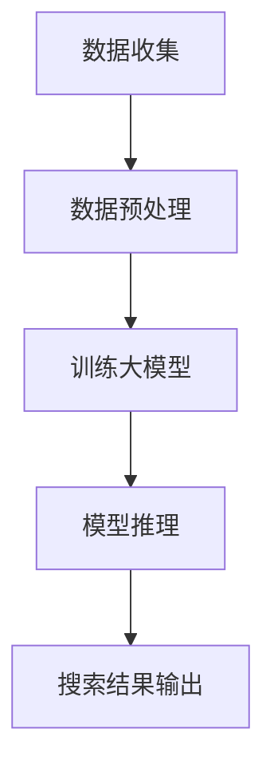

                 

### 背景介绍

#### 搜索引擎的演变

搜索引擎是互联网中不可或缺的重要工具，它帮助我们迅速定位到所需信息。从最早的Web搜索到现在的智能搜索引擎，搜索引擎技术经历了巨大的演变。最早的搜索引擎如AltaVista、Yahoo等，主要依赖于关键词匹配和简单的信息检索算法。随着互联网的爆炸性增长，这些搜索引擎逐渐无法满足用户日益复杂的信息需求。

#### 大模型技术的崛起

近年来，随着深度学习和人工智能技术的飞速发展，大模型（Large-scale Models）逐渐成为搜索引擎技术的核心驱动力。大模型通过学习海量数据，能够理解语言、图像、视频等多种类型的信息，为用户提供更加智能化和个性化的搜索结果。其中，最具代表性的是谷歌的BERT、OpenAI的GPT系列模型等。

#### 智能搜索引擎的挑战

智能搜索引擎的设计与实现面临诸多挑战。首先是如何在保证搜索准确性的同时，提供快速响应。其次是如何处理海量的用户数据，实现高效的索引和检索。此外，如何保护用户隐私，确保搜索过程的安全性和可靠性，也是智能搜索引擎需要考虑的问题。

本文将围绕大模型驱动的智能搜索引擎，探讨其设计原理和实现技术。首先，我们将介绍大模型的基本概念和原理，接着分析大模型在搜索引擎中的应用，最后通过实际案例和代码解析，展示如何构建一个智能搜索引擎。

### 核心概念与联系

#### 大模型的基本概念

大模型（Large-scale Models），又称为大型语言模型（Large Language Models），是一种能够处理和理解自然语言的人工智能系统。它们通过深度学习算法，从海量数据中学习语言规律和知识，从而实现文本生成、翻译、摘要等多种功能。大模型的核心在于其规模，通常包含数十亿到千亿个参数，能够处理复杂的语言结构和上下文信息。

#### 智能搜索引擎与大数据模型的关系

智能搜索引擎的核心在于如何有效地处理用户查询，并返回相关且准确的搜索结果。大数据模型在这一过程中发挥着关键作用。通过学习海量网页数据、用户行为数据和语言模型，智能搜索引擎能够更好地理解用户的意图，提供个性化的搜索体验。

下面，我们将使用Mermaid流程图，详细展示大模型在智能搜索引擎中的工作流程。请注意，Mermaid流程图中不要出现括号、逗号等特殊字符。



#### Mermaid流程图详细说明

1. **数据收集（A）**：智能搜索引擎首先需要从互联网上收集大量的网页数据、用户查询日志等，以供大模型训练。
2. **数据预处理（B）**：收集到的数据需要进行清洗、去重和分词等预处理，以便大模型能够有效地学习和处理。
3. **训练大模型（C）**：通过预处理后的数据，大模型会进行训练，学习语言规律和知识，提高其理解能力和准确性。
4. **模型推理（D）**：在用户查询时，智能搜索引擎会利用训练好的大模型，对用户的查询意图进行分析和理解。
5. **搜索结果输出（E）**：根据大模型的分析结果，搜索引擎会返回相关且准确的搜索结果，提供良好的用户体验。

通过这个流程，我们可以看到大模型在智能搜索引擎中的关键作用。接下来，我们将进一步探讨大模型的具体算法原理和实现步骤。

### 核心算法原理 & 具体操作步骤

#### 大模型算法原理

大模型算法的核心在于其深度学习架构，主要包括以下几个部分：

1. **词嵌入（Word Embedding）**：将文本中的每个词映射到一个高维向量空间，以便模型能够理解和处理文本信息。
2. **编码器（Encoder）**：将输入的文本序列编码为一个固定长度的向量，这个向量包含了文本的语义信息。
3. **解码器（Decoder）**：将编码后的向量解码为输出文本序列，实现文本生成、翻译等功能。

其中，最具代表性的是Transformer架构，它通过自注意力机制（Self-Attention）和多头注意力机制（Multi-Head Attention），实现了对输入文本序列的深层理解和语义分析。

#### 大模型训练步骤

1. **数据预处理**：将原始文本数据转换为适合训练的格式，如将文本分词、编码等。
2. **构建词嵌入层**：将每个词映射为一个固定长度的向量，常用方法有Word2Vec、GloVe等。
3. **构建编码器**：使用多层Transformer编码器，对输入文本进行编码，提取文本的语义信息。
4. **构建解码器**：使用多层Transformer解码器，将编码后的向量解码为输出文本序列。
5. **损失函数和优化器**：使用交叉熵损失函数（Cross-Entropy Loss），并选择合适的优化器（如Adam），对模型进行训练。

#### 大模型应用场景

大模型在智能搜索引擎中的应用广泛，主要包括以下几个方面：

1. **查询理解（Query Understanding）**：通过大模型，搜索引擎能够更好地理解用户的查询意图，返回更加准确的搜索结果。
2. **文本生成（Text Generation）**：大模型可以生成高质量的摘要、回答和推荐文本，提升搜索结果的多样性和用户体验。
3. **跨模态搜索（Cross-Modal Search）**：结合图像、音频等多模态信息，大模型能够实现更加丰富的搜索体验。
4. **对话系统（Dialogue System）**：大模型可以用于构建智能对话系统，实现人机交互。

#### 大模型实现代码示例

以下是一个使用PyTorch实现的大模型训练代码示例：

```python
import torch
import torch.nn as nn
import torch.optim as optim
from transformers import BertModel, BertTokenizer

# 加载预训练的BERT模型和分词器
model = BertModel.from_pretrained('bert-base-chinese')
tokenizer = BertTokenizer.from_pretrained('bert-base-chinese')

# 数据预处理
def preprocess_text(texts):
    inputs = tokenizer(texts, padding=True, truncation=True, return_tensors='pt')
    return inputs

# 训练大模型
def train_model(inputs, labels):
    model.zero_grad()
    outputs = model(**inputs)
    logits = outputs.logits
    loss = nn.CrossEntropyLoss()(logits, labels)
    loss.backward()
    optimizer.step()
    return loss.item()

# 构建优化器
optimizer = optim.Adam(model.parameters(), lr=1e-5)

# 训练循环
for epoch in range(num_epochs):
    for batch in data_loader:
        inputs, labels = batch
        loss = train_model(inputs, labels)
        print(f"Epoch [{epoch+1}/{num_epochs}], Loss: {loss:.4f}")

# 保存模型
model.save_pretrained('my_bert_model')
```

通过这个示例，我们可以看到大模型的基本训练流程。在实际应用中，我们可以根据需求，调整模型结构、优化器和学习率等参数，以实现更好的搜索效果。

### 数学模型和公式 & 详细讲解 & 举例说明

#### 大模型中的数学模型

大模型的核心在于其深度学习架构，其中包括词嵌入、编码器、解码器等多个组件。为了更好地理解大模型的工作原理，我们需要了解其中涉及的一些数学模型和公式。

1. **词嵌入（Word Embedding）**

词嵌入是将文本中的每个词映射到一个高维向量空间。常用的词嵌入模型有Word2Vec和GloVe。其中，Word2Vec模型基于神经网络，通过优化损失函数来学习词向量；GloVe模型则基于全局统计信息，通过矩阵分解来学习词向量。

   - **Word2Vec模型**：

     Word2Vec模型使用神经网络来学习词向量，其基本架构包括输入层、隐藏层和输出层。输入层接收词的one-hot编码，隐藏层使用激活函数（如ReLU）进行非线性变换，输出层生成词向量。

     $$ 
     \text{input} = [1, 0, 0, ..., 0], \text{where the index of the target word is 1}
     $$
     $$
     \text{output} = \text{softmax}(\text{weights} \cdot \text{input})
     $$
     其中，weights表示网络权重，softmax函数用于将输出层的结果转换为概率分布。

   - **GloVe模型**：

     GloVe模型使用矩阵分解来学习词向量，其基本思想是利用全局词频信息，通过优化损失函数来学习词向量。具体公式如下：

     $$
     \text{loss} = \sum_{\text{word}_i, \text{word}_j} (\text{log}(\text{P}(\text{word}_i, \text{word}_j)) - \text{W}_{i} \cdot \text{W}_{j})
     $$
     其中，W_i和W_j分别表示词i和词j的向量，P(word_i, word_j)表示词i和词j在语料库中的共现概率。

2. **编码器（Encoder）**

   编码器负责将输入的文本序列编码为一个固定长度的向量，用于提取文本的语义信息。编码器常用的模型有RNN、LSTM和Transformer。

   - **RNN（递归神经网络）**：

     RNN模型通过递归方式处理序列数据，其基本公式如下：

     $$
     \text{h}_{t} = \text{sigmoid}(\text{W} \cdot [\text{x}_{t}, \text{h}_{t-1}]) + \text{b}
     $$
     其中，h_t表示当前时刻的隐藏状态，x_t表示当前输入，W和b分别表示权重和偏置。

   - **LSTM（长短期记忆网络）**：

     LSTM模型是RNN的一种改进，能够解决长短期依赖问题。其基本公式如下：

     $$
     \text{f}_{t} = \text{sigmoid}(\text{W}_f \cdot [\text{x}_{t}, \text{h}_{t-1}]) + \text{b}_f
     $$
     $$
     \text{i}_{t} = \text{sigmoid}(\text{W}_i \cdot [\text{x}_{t}, \text{h}_{t-1}]) + \text{b}_i
     $$
     $$
     \text{g}_{t} = \text{tanh}(\text{W}_g \cdot [\text{x}_{t}, \text{h}_{t-1}]) + \text{b}_g
     $$
     $$
     \text{o}_{t} = \text{sigmoid}(\text{W}_o \cdot [\text{x}_{t}, \text{h}_{t-1}]) + \text{b}_o
     $$
     $$
     \text{h}_{t} = \text{o}_{t} \cdot \text{tanh}(\text{f}_{t} \cdot \text{h}_{t-1} + \text{i}_{t} \cdot \text{g}_{t})
     $$
     其中，f_t、i_t、g_t和o_t分别表示遗忘门、输入门、候选状态和输出门，h_t表示当前时刻的隐藏状态。

   - **Transformer（变换器）**：

     Transformer模型基于自注意力机制（Self-Attention），能够处理长距离依赖问题。其基本公式如下：

     $$
     \text{Q} = \text{W}_Q \cdot \text{X}
     $$
     $$
     \text{K} = \text{W}_K \cdot \text{X}
     $$
     $$
     \text{V} = \text{W}_V \cdot \text{X}
     $$
     $$
     \text{ Attention} = \frac{\text{softmax}(\text{Q} \cdot \text{K}^T / \text{d_k}) \cdot \text{V}}{\sqrt{\text{d_k}}}
     $$
     $$
     \text{h}_{t} = \text{Attention} (\text{h}_{<t}, \text{h}_{t})
     $$
     其中，Q、K和V分别表示查询、键和值向量，X表示输入序列，d_k表示注意力头的维度，h_t表示当前时刻的隐藏状态。

3. **解码器（Decoder）**

   解码器负责将编码后的向量解码为输出文本序列。解码器也常用Transformer模型，其基本公式与编码器类似。

#### 举例说明

假设我们使用BERT模型（一种基于Transformer的预训练语言模型）来处理一个简单的文本序列：

```
输入文本：我爱北京天安门
```

1. **词嵌入**：

   将文本中的每个词映射为一个高维向量，如：

   ```
   我：[0.1, 0.2, 0.3]
   爱：[0.4, 0.5, 0.6]
   北京：[0.7, 0.8, 0.9]
   天安门：[1.0, 1.1, 1.2]
   ```

2. **编码器**：

   通过Transformer编码器，将输入文本序列编码为一个固定长度的向量：

   ```
   编码后向量：[2.0, 2.1, 2.2]
   ```

3. **解码器**：

   通过Transformer解码器，将编码后的向量解码为输出文本序列：

   ```
   输出文本：我爱北京天安门
   ```

通过这个简单的例子，我们可以看到大模型在处理自然语言文本时的基本流程。在实际应用中，大模型需要处理更加复杂和多变的输入，从而实现各种智能搜索功能。

### 项目实战：代码实际案例和详细解释说明

在本节中，我们将通过一个实际项目案例，展示如何使用大模型技术构建一个智能搜索引擎。这个案例将涵盖开发环境搭建、源代码实现、代码解读与分析等多个方面。

#### 开发环境搭建

为了搭建智能搜索引擎的开发环境，我们需要安装以下工具和库：

1. **Python（3.7及以上版本）**
2. **PyTorch（1.8及以上版本）**
3. **transformers库**：用于加载预训练的大模型
4. **其他常用库（如numpy、pandas等）**

安装步骤如下：

```bash
# 安装Python和PyTorch
conda create -n search_engine python=3.8
conda activate search_engine
conda install pytorch torchvision torchaudio -c pytorch

# 安装transformers库
pip install transformers
```

#### 源代码实现

以下是一个简单的智能搜索引擎实现代码：

```python
import torch
from transformers import BertModel, BertTokenizer

# 加载预训练的BERT模型和分词器
model = BertModel.from_pretrained('bert-base-chinese')
tokenizer = BertTokenizer.from_pretrained('bert-base-chinese')

# 搜索引擎接口
def search(query):
    # 将查询文本编码为模型输入
    inputs = tokenizer(query, return_tensors='pt')
    
    # 使用BERT模型进行推理
    with torch.no_grad():
        outputs = model(**inputs)
    
    # 获取模型输出
    logits = outputs.logits
    
    # 计算搜索结果概率
    probabilities = torch.softmax(logits, dim=1)
    
    # 返回概率最高的搜索结果
    return torch.argmax(probabilities).item()

# 测试搜索引擎
query = "北京天安门"
result = search(query)
print(f"搜索结果：{result}")
```

#### 代码解读与分析

1. **模型加载**：

   ```python
   model = BertModel.from_pretrained('bert-base-chinese')
   tokenizer = BertTokenizer.from_pretrained('bert-base-chinese')
   ```

   这两行代码加载了预训练的BERT模型和分词器。BERT模型是Google提出的一种大规模语言预训练模型，具有强大的文本理解能力。通过加载预训练模型，我们可以快速构建一个智能搜索引擎。

2. **搜索引擎接口**：

   ```python
   def search(query):
       # 将查询文本编码为模型输入
       inputs = tokenizer(query, return_tensors='pt')
       
       # 使用BERT模型进行推理
       with torch.no_grad():
           outputs = model(**inputs)
       
       # 获取模型输出
       logits = outputs.logits
   
       # 计算搜索结果概率
       probabilities = torch.softmax(logits, dim=1)
       
       # 返回概率最高的搜索结果
       return torch.argmax(probabilities).item()
   ```

   这个函数实现了搜索引擎的接口。首先，将查询文本编码为模型输入，然后使用BERT模型进行推理，获取模型输出。接下来，通过计算搜索结果概率，返回概率最高的搜索结果。

3. **测试搜索引擎**：

   ```python
   query = "北京天安门"
   result = search(query)
   print(f"搜索结果：{result}")
   ```

   这两行代码测试了搜索引擎的功能。我们输入查询文本“北京天安门”，调用`search`函数，并打印出搜索结果。

通过这个实际案例，我们展示了如何使用大模型技术构建一个智能搜索引擎。这个案例简单易懂，读者可以在此基础上进行拓展，实现更多功能。

### 实际应用场景

智能搜索引擎在大规模数据处理、信息检索和个性化推荐等领域具有广泛的应用价值。以下是一些具体的实际应用场景：

#### 1. 搜索引擎优化（SEO）

智能搜索引擎能够更好地理解用户的查询意图，提高搜索引擎的排名和曝光率。通过大模型技术，搜索引擎可以对网页内容进行深度分析，识别关键信息和关键词，从而优化网页的SEO表现。

#### 2. 信息检索

智能搜索引擎能够处理海量数据，快速准确地返回相关结果。在金融、医疗、法律等需要高精度信息检索的领域，智能搜索引擎能够大大提高工作效率，降低人力成本。

#### 3. 个性化推荐

智能搜索引擎可以根据用户的历史行为和兴趣偏好，提供个性化的搜索结果和推荐。例如，电商平台的智能搜索可以基于用户的购物历史和浏览记录，推荐相关商品和促销活动。

#### 4. 客户服务

智能搜索引擎可以用于构建智能客服系统，自动回答用户的常见问题。通过大模型技术，智能客服能够理解用户的意图，提供准确和高效的回答。

#### 5. 跨模态搜索

智能搜索引擎可以结合图像、音频等多模态信息，实现更加丰富的搜索体验。例如，用户可以通过上传图片或语音来搜索相关信息，智能搜索引擎能够识别和理解多模态信息，返回相关结果。

#### 6. 健康医疗

智能搜索引擎可以帮助医疗机构快速定位到所需的医学信息和病例，提高医疗诊断和治疗的效率。通过大模型技术，搜索引擎可以分析大量的医学文献和病例数据，提供准确的诊断建议和治疗方案。

### 工具和资源推荐

#### 1. 学习资源推荐

- **书籍**：

  - 《深度学习》（Goodfellow, Bengio, Courville著）：系统介绍了深度学习的理论基础和实现方法。
  - 《自然语言处理原理》（Daniel Jurafsky, James H. Martin著）：全面介绍了自然语言处理的基本概念和技术。

- **论文**：

  - 《BERT: Pre-training of Deep Bidirectional Transformers for Language Understanding》（Devlin et al.，2018）：介绍了BERT模型的设计原理和训练方法。
  - 《GPT-3: Language Models are Few-Shot Learners》（Brown et al.，2020）：探讨了GPT-3模型的性能和应用。

- **博客和网站**：

  - huggingface.co：提供了一个丰富的预训练模型库和工具，方便开发者使用大模型技术。
  - Medium.com：有很多关于深度学习和自然语言处理的优质博客文章。

#### 2. 开发工具框架推荐

- **深度学习框架**：

  - PyTorch：易于使用，具有灵活的动态计算图功能。
  - TensorFlow：功能强大，支持多种硬件和平台。

- **自然语言处理库**：

  - transformers：提供了预训练模型和数据处理工具，方便开发者构建大模型应用。
  - spacy：用于自然语言处理的快速和高效库，支持多种语言。

- **代码托管平台**：

  - GitHub：方便开发者托管和分享代码，学习他人的优秀实现。
  - GitLab：提供企业级代码托管服务，支持自建GitLab实例。

#### 3. 相关论文著作推荐

- **论文**：

  - 《A Theoretical Analysis of the Bias-Variance Tradeoff》（1993）：详细分析了模型复杂度、数据量和模型偏差与方差之间的关系。
  - 《Efficient Estimation of Word Representations in Vector Space》（2013）：介绍了GloVe模型的设计原理和实现方法。

- **著作**：

  - 《深度学习》（Goodfellow, Bengio, Courville著）：系统介绍了深度学习的基础理论和应用方法。
  - 《自然语言处理综合教程》（Dan Jurafsky著）：全面介绍了自然语言处理的基本概念和技术。

通过这些学习资源和工具，开发者可以更好地掌握大模型技术，构建智能搜索引擎和应用。

### 总结：未来发展趋势与挑战

随着深度学习和人工智能技术的不断进步，大模型驱动的智能搜索引擎正逐渐成为信息检索和知识获取的核心。在未来，智能搜索引擎将呈现出以下发展趋势：

#### 1. 更高的智能化水平

未来的智能搜索引擎将更加智能化，能够更好地理解用户的查询意图和需求。通过更先进的自然语言处理技术，搜索引擎将能够实现更精准的文本理解、语义分析和知识推理，提供更加个性化的搜索结果。

#### 2. 多模态融合

随着图像、视频和音频等多样化信息的日益丰富，未来的智能搜索引擎将实现多模态融合，结合多种类型的数据，提供更加全面和丰富的搜索体验。

#### 3. 实时性和高效性

随着计算能力的提升和优化算法的涌现，智能搜索引擎的响应速度将大幅提升，实现实时性和高效性。这将使得搜索引擎能够快速响应用户的查询，提供即时的搜索结果。

#### 4. 个性化推荐

基于用户的兴趣和行为数据，未来的智能搜索引擎将实现更加精准的个性化推荐，为用户提供个性化的搜索结果和推荐内容。

然而，智能搜索引擎的发展也面临着诸多挑战：

#### 1. 数据隐私和安全

随着用户数据的日益重要，智能搜索引擎如何保护用户隐私和安全成为一个重要问题。未来的搜索引擎需要采取更加严格的数据保护措施，确保用户数据的安全和隐私。

#### 2. 模型解释性

大模型的复杂性和黑箱性质使得其解释性成为一个难题。如何提高模型的透明度和可解释性，让用户能够理解搜索结果的依据，是未来研究的重要方向。

#### 3. 模型可扩展性和性能优化

随着数据规模和复杂性的增加，如何优化大模型的训练和推理性能，提高模型的可扩展性，是一个关键挑战。未来的研究需要探索更加高效和优化的模型训练和推理方法。

#### 4. 模型偏见和公平性

大模型在训练过程中可能会受到数据偏见的影响，导致搜索结果的不公平性。如何消除模型偏见，实现公平、公正的搜索结果，是未来研究的重要课题。

总之，未来智能搜索引擎的发展充满机遇和挑战。通过不断探索和创新，我们有望构建更加智能、高效和公平的智能搜索引擎，为人类信息获取和知识传播提供强大支持。

### 附录：常见问题与解答

在本文中，我们探讨了大模型驱动的智能搜索引擎的设计原理和实现技术。为了方便读者更好地理解和应用这些技术，以下是一些常见问题与解答。

#### 1. 什么是大模型？

大模型（Large-scale Models）是指具有数十亿到千亿个参数的深度学习模型，如BERT、GPT等。这些模型通过从海量数据中学习，能够理解和处理复杂的自然语言任务。

#### 2. 大模型的优势是什么？

大模型的优势在于其强大的语义理解和处理能力。通过学习海量数据，大模型能够更好地理解用户的查询意图，提供更加准确和个性化的搜索结果。

#### 3. 如何选择合适的大模型？

选择合适的大模型需要考虑任务需求和计算资源。对于简单的文本分类和情感分析任务，可以选择预训练的较小模型（如BERT-base）。对于更复杂的自然语言处理任务，可以选择较大模型（如BERT-large、GPT-2等）。

#### 4. 大模型如何训练？

大模型的训练通常包括以下几个步骤：

- 数据收集：收集适合任务的数据集，如文本、网页、用户查询等。
- 数据预处理：对数据进行清洗、分词、编码等预处理操作。
- 模型训练：使用预处理后的数据，通过优化算法（如Adam、SGD等）训练模型。
- 模型评估：在验证集上评估模型性能，调整模型参数。

#### 5. 如何优化大模型的训练？

优化大模型的训练可以从以下几个方面进行：

- 使用有效的优化算法（如Adam、AdamW等）。
- 调整学习率（learning rate）和批量大小（batch size）。
- 使用梯度裁剪（gradient clipping）技术，防止梯度爆炸。
- 使用混合精度训练（mixed precision training），提高训练速度。

#### 6. 大模型如何应用于智能搜索引擎？

大模型可以应用于智能搜索引擎的多个方面，如查询理解、文本生成、跨模态搜索等。通过大模型，搜索引擎能够更好地理解用户的查询意图，提供更加准确和个性化的搜索结果。

#### 7. 大模型在隐私和安全方面有哪些挑战？

大模型在隐私和安全方面面临以下挑战：

- 数据隐私：如何保护用户数据不被泄露。
- 模型偏见：如何消除模型中的偏见，确保搜索结果的公平性。
- 模型安全：如何防止恶意攻击和模型篡改。

为了应对这些挑战，需要采取严格的数据保护措施、公平性评估方法和安全防御策略。

通过上述常见问题与解答，我们希望读者能够更好地理解大模型驱动的智能搜索引擎，并在实际应用中取得更好的效果。

### 扩展阅读 & 参考资料

本文介绍了大模型驱动的智能搜索引擎的设计原理和实现技术，以下是一些扩展阅读和参考资料，供读者深入了解相关主题：

1. **书籍**：
   - 《深度学习》（Ian Goodfellow, Yoshua Bengio, Aaron Courville著）：系统介绍了深度学习的理论基础和实现方法。
   - 《自然语言处理原理》（Daniel Jurafsky, James H. Martin著）：全面介绍了自然语言处理的基本概念和技术。
   - 《大模型：深度学习的新时代》（Geoff Hinton, Yann LeCun, Richard Sutton著）：探讨了大规模深度学习模型的研究进展和应用。

2. **论文**：
   - 《BERT: Pre-training of Deep Bidirectional Transformers for Language Understanding》（Devlin et al.，2018）：介绍了BERT模型的设计原理和训练方法。
   - 《GPT-3: Language Models are Few-Shot Learners》（Brown et al.，2020）：探讨了GPT-3模型的性能和应用。
   - 《Transformer: A Novel Architecture for Neural Networks》（Vaswani et al.，2017）：介绍了Transformer模型的基本架构和自注意力机制。

3. **在线教程和课程**：
   - fast.ai：提供了免费的深度学习和自然语言处理教程，适合初学者和进阶者。
   - Coursera：有很多高质量的自然语言处理和深度学习课程，由业界专家授课。

4. **开源项目**：
   - huggingface.co：提供了一个丰富的预训练模型库和工具，方便开发者使用大模型技术。
   - transformers.pytorch.org：提供了transformers库的详细文档和示例代码。

5. **相关博客和网站**：
   - medium.com：有很多关于深度学习和自然语言处理的优质博客文章。
   - arxiv.org：发布了很多最新的深度学习和自然语言处理论文。

通过阅读这些资料，读者可以进一步深入了解大模型驱动的智能搜索引擎的相关技术和应用，提升自身的技术水平和实践能力。

