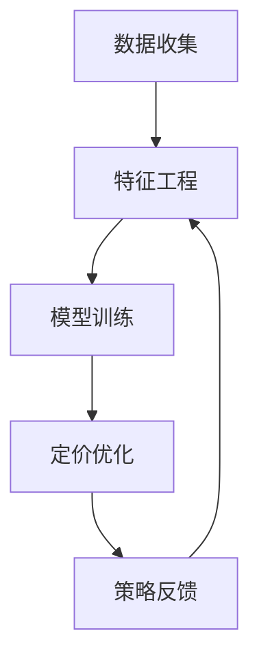

                 

### 背景介绍

#### 大模型驱动的电商个性化产品捆绑定价策略

在当今数字化时代，电子商务已经成为零售业的重要组成部分。随着用户数据收集与分析技术的不断发展，电商企业开始重视如何通过精准的定价策略来提升销售额和用户满意度。传统的定价策略往往基于历史数据和市场趋势，但这种方法在处理复杂的市场动态和用户个性化需求时显得力不从心。为了应对这一挑战，大模型驱动的电商个性化产品捆绑定价策略应运而生。

所谓大模型驱动，即利用深度学习、人工智能等先进技术构建大规模的预测模型，通过对用户行为、市场趋势、产品属性等多维度数据的分析，实现高度个性化的产品捆绑定价策略。这种策略的核心在于通过机器学习算法不断优化模型，从而实现动态调整价格，以最大化销售额和利润。

本文将围绕大模型驱动的电商个性化产品捆绑定价策略展开，首先介绍其基本概念和原理，然后详细探讨核心算法、数学模型及实际应用，最后探讨其未来发展趋势与挑战。

#### 电商个性化产品捆绑定价策略的意义

电商个性化产品捆绑定价策略对于电商平台和消费者都具有深远的意义。首先，对于电商平台而言，个性化定价策略有助于提高用户满意度和忠诚度。通过精准的价格推荐，消费者更可能购买他们感兴趣的产品，从而提升整体销售额。同时，个性化的定价策略还能帮助电商平台降低营销成本，提高运营效率。

对于消费者而言，个性化定价策略提供了更加灵活和个性化的购物体验。消费者可以根据自身的需求和偏好选择最合适的产品组合，从而获得最大的优惠。这种个性化的服务不仅提升了消费者的购物满意度，还增加了他们的购物频率和忠诚度。

总的来说，电商个性化产品捆绑定价策略不仅有助于电商平台实现更高的利润率，还能为消费者提供更加优质和个性化的购物体验。这使得这一策略在当今激烈的市场竞争环境中具有重要的战略意义。

### 核心概念与联系

#### 大模型驱动的电商个性化产品捆绑定价策略

要理解大模型驱动的电商个性化产品捆绑定价策略，首先需要明确几个核心概念，包括大模型、个性化、产品捆绑定价等。

**大模型（Big Models）**：大模型是指利用深度学习、强化学习等先进算法构建的具有大规模参数和数据训练的模型。这些模型能够处理大量的数据，并通过不断的学习和优化，提高预测和决策的准确性。

**个性化（Personalization）**：个性化是指根据用户的兴趣、行为、偏好等特征，为用户推荐最符合其需求的产品或服务。在电商领域，个性化意味着根据用户的历史购买记录、浏览行为、搜索关键词等信息，提供定制化的产品推荐和价格策略。

**产品捆绑定价（Product Bundling Pricing）**：产品捆绑定价是指将多个产品组合成一个捆绑包，以一个整体价格出售。这种策略可以通过组合不同价值的产品，提高整体销售量和利润率。

大模型驱动的电商个性化产品捆绑定价策略将这三个核心概念结合起来，通过分析用户数据和市场趋势，动态调整产品捆绑价格，以最大化销售额和利润。具体来说，这一策略包括以下几个关键步骤：

1. **数据收集**：收集用户的历史购买记录、浏览行为、搜索关键词等数据，以及市场趋势、产品属性等相关数据。

2. **特征工程**：对收集到的数据进行处理和转换，提取出与定价相关的关键特征，如用户购买频次、产品关联度、季节性等。

3. **模型训练**：利用深度学习、强化学习等算法，构建大规模预测模型，通过对特征数据的分析，预测用户对不同产品捆绑组合的购买概率和价格敏感度。

4. **定价优化**：根据模型预测结果，动态调整产品捆绑价格，以最大化销售额和利润。这一过程需要不断进行优化，以适应市场变化和用户需求。

5. **策略反馈**：通过实际销售数据反馈，评估定价策略的效果，并对模型进行重新训练和调整，以进一步提高预测准确性。

#### 大模型驱动的电商个性化产品捆绑定价策略架构图

为了更好地理解大模型驱动的电商个性化产品捆绑定价策略，我们可以通过Mermaid流程图展示其核心架构和流程节点。



在这个架构图中，数据收集阶段负责收集用户数据和市场数据；特征工程阶段对数据进行处理和转换，提取关键特征；模型训练阶段利用深度学习、强化学习等算法构建预测模型；定价优化阶段根据模型预测结果调整产品捆绑价格；策略反馈阶段通过实际销售数据评估策略效果，并不断迭代优化模型。

通过这个架构图，我们可以清晰地看到大模型驱动的电商个性化产品捆绑定价策略的核心环节和相互关系。这一策略不仅依赖于先进的技术手段，还需要不断的数据反馈和优化，以实现最佳的定价效果。

### 核心算法原理 & 具体操作步骤

#### 大模型驱动的电商个性化产品捆绑定价策略算法原理

大模型驱动的电商个性化产品捆绑定价策略的核心在于构建一个高效的预测模型，通过分析用户数据和市场趋势，动态调整产品捆绑价格，以最大化销售额和利润。这一过程涉及到多个算法和步骤，下面我们将详细介绍其具体原理和操作步骤。

1. **用户行为数据分析**

   用户行为数据是构建预测模型的重要基础。通过对用户的历史购买记录、浏览行为、搜索关键词等信息进行分析，可以提取出与定价相关的关键特征。这些特征包括但不限于：

   - **购买频次**：用户在一定时间段内购买某类产品的次数。
   - **浏览时长**：用户在浏览产品页面时停留的时间。
   - **搜索关键词**：用户在搜索框中输入的关键词。
   - **产品关联度**：不同产品之间的关联性，如用户购买A产品后更可能购买B产品。
   - **季节性**：特定时间段内的购买趋势，如节假日或季节性促销。

2. **市场趋势分析**

   市场趋势分析包括对市场动态、竞争对手行为、价格变动等信息的收集和分析。通过分析市场趋势，可以预测未来的价格走势和消费者需求变化。市场趋势分析的关键特征包括：

   - **竞争对手价格**：竞争对手的定价策略和价格变动。
   - **市场需求**：当前市场的需求状况，如销售额、搜索量等。
   - **季节性因素**：特定季节或节假日的市场特点。

3. **模型构建**

   在收集和分析了用户行为数据和市场趋势数据后，下一步是构建预测模型。常见的算法包括深度学习、强化学习、线性回归等。下面以深度学习为例，介绍模型构建的过程：

   - **数据预处理**：对收集到的数据进行清洗和预处理，包括缺失值处理、异常值检测和数据标准化等。
   - **特征选择**：选择与定价相关性较高的特征，去除冗余特征，提高模型性能。
   - **模型训练**：使用预处理后的数据训练深度学习模型。常见的深度学习模型包括卷积神经网络（CNN）、循环神经网络（RNN）和长短时记忆网络（LSTM）等。
   - **模型优化**：通过交叉验证和超参数调整，优化模型性能，提高预测准确性。

4. **定价策略优化**

   预测模型构建完成后，需要根据模型预测结果调整产品捆绑价格，以实现最大化销售额和利润。定价策略优化的具体步骤包括：

   - **价格区间设定**：根据市场趋势和用户行为数据，设定不同产品的价格区间。
   - **价格调整策略**：根据模型预测结果，动态调整产品捆绑价格。例如，对于购买概率较高的产品捆绑组合，可以设定较低的价格，以吸引更多用户购买。
   - **风险评估**：评估定价策略带来的风险，如库存风险、市场反应等，确保定价策略的可持续性。

5. **策略反馈与迭代**

   定价策略实施后，需要通过实际销售数据评估策略效果，并对模型进行重新训练和调整。具体步骤包括：

   - **销售数据收集**：收集实际销售数据，包括销售额、用户购买数量等。
   - **效果评估**：评估定价策略对销售额和利润的提升效果。
   - **模型优化**：根据销售数据反馈，优化模型预测参数和定价策略，提高预测准确性。

#### 大模型驱动的电商个性化产品捆绑定价策略具体操作步骤

1. **数据收集**

   首先，电商平台需要收集用户行为数据和市场趋势数据。用户行为数据可以通过电商平台的用户行为日志、点击流数据等获取；市场趋势数据可以通过第三方数据源、行业报告等获取。

2. **特征工程**

   对收集到的数据进行处理和转换，提取出与定价相关的关键特征。例如，可以通过用户购买记录提取出购买频次、浏览时长、搜索关键词等特征；通过市场报告提取出竞争对手价格、市场需求、季节性因素等特征。

3. **模型训练**

   使用深度学习算法，如卷积神经网络（CNN）或循环神经网络（RNN），构建预测模型。具体步骤包括：

   - **数据预处理**：对用户行为数据和市场趋势数据进行清洗和预处理。
   - **特征选择**：选择与定价相关性较高的特征。
   - **模型训练**：使用预处理后的数据训练深度学习模型。
   - **模型优化**：通过交叉验证和超参数调整，优化模型性能。

4. **定价优化**

   根据模型预测结果，动态调整产品捆绑价格。具体步骤包括：

   - **价格区间设定**：根据市场趋势和用户行为数据，设定不同产品的价格区间。
   - **价格调整策略**：根据模型预测结果，动态调整产品捆绑价格。
   - **风险评估**：评估定价策略带来的风险。

5. **策略反馈与迭代**

   通过实际销售数据评估策略效果，并对模型进行重新训练和调整。具体步骤包括：

   - **销售数据收集**：收集实际销售数据。
   - **效果评估**：评估定价策略对销售额和利润的提升效果。
   - **模型优化**：根据销售数据反馈，优化模型预测参数和定价策略。

通过上述步骤，电商平台可以实现大模型驱动的电商个性化产品捆绑定价策略，从而提高销售额和利润，为用户提供更优质的购物体验。

### 数学模型和公式 & 详细讲解 & 举例说明

#### 大模型驱动的电商个性化产品捆绑定价策略的数学模型

在构建大模型驱动的电商个性化产品捆绑定价策略时，数学模型起着核心作用。以下是该策略中的几个关键数学模型及其详细讲解：

1. **用户行为概率分布模型**

   用户行为概率分布模型用于预测用户对不同产品捆绑组合的购买概率。假设有\(n\)个产品，每个产品用\(i\)表示（\(i=1,2,...,n\)），用户对第\(i\)个产品的购买概率为\(p_i\)。用户对产品捆绑组合的购买概率可以表示为：

   \[
   P(\text{捆绑组合}) = \prod_{i=1}^{n} p_i
   \]

   其中，\(p_i\)可以通过历史数据和统计方法得到。例如，可以使用贝叶斯推断来估计每个产品的购买概率。

2. **价格敏感度模型**

   价格敏感度模型用于分析用户对不同价格水平的反应。假设产品\(i\)的原始价格为\(p_{i0}\)，价格调整后的价格为\(p_i\)，用户对产品\(i\)的价格敏感度可以表示为：

   \[
   \alpha_i = \frac{\partial p_i}{\partial p_{i0}}
   \]

   其中，\(\alpha_i\)表示用户对产品\(i\)价格变动的敏感度。价格敏感度模型可以通过收集用户的历史购买数据，使用线性回归等方法来估计。

3. **利润最大化模型**

   利润最大化模型用于确定最优的产品捆绑价格，以最大化电商平台的总利润。假设每个产品\(i\)的利润为\(L_i\)，产品捆绑组合的总利润为\(L\)，则利润最大化问题可以表示为：

   \[
   \max L = \sum_{i=1}^{n} L_i \cdot p_i
   \]

   其中，\(p_i\)为产品\(i\)的价格。为了求解该问题，可以使用优化算法，如梯度上升法、随机梯度上升法等。

#### 举例说明

假设有一个电商平台，销售三种产品：产品A、产品B和产品C。根据历史数据，我们可以得到以下用户行为概率分布模型：

\[
P(\text{购买A}) = 0.6, \quad P(\text{购买B}) = 0.5, \quad P(\text{购买C}) = 0.4
\]

同时，我们还可以得到以下价格敏感度模型：

\[
\alpha_A = 0.2, \quad \alpha_B = 0.3, \quad \alpha_C = 0.1
\]

现在，我们假设产品的原始价格分别为：

\[
p_{A0} = 100, \quad p_{B0} = 150, \quad p_{C0} = 200
\]

我们需要确定最优的产品捆绑价格，以最大化总利润。首先，我们设定一个价格区间，例如在\(p_{A0}\)的基础上增加10%至20%，在\(p_{B0}\)的基础上增加5%至15%，在\(p_{C0}\)的基础上增加2%至10%：

\[
p_A \in [110, 120], \quad p_B \in [157.5, 169.5], \quad p_C \in [202, 208]
\]

接下来，我们可以使用利润最大化模型来确定最优价格。假设每个产品的利润分别为：

\[
L_A = 20, \quad L_B = 25, \quad L_C = 30
\]

我们可以将利润最大化模型表示为：

\[
\max L = 20p_A + 25p_B + 30p_C
\]

为了求解该问题，我们可以使用线性规划或梯度上升法。在此，我们使用线性规划求解器来确定最优价格：

\[
\max L = 20p_A + 25p_B + 30p_C
\]
\[
\text{s.t.} \quad p_A \in [110, 120], \quad p_B \in [157.5, 169.5], \quad p_C \in [202, 208]
\]

通过求解器，我们得到最优价格为：

\[
p_A^* = 120, \quad p_B^* = 169.5, \quad p_C^* = 208
\]

此时，电商平台的总利润为：

\[
L^* = 20 \times 120 + 25 \times 169.5 + 30 \times 208 = 6802.5
\]

这个例子展示了如何使用数学模型来优化产品捆绑定价策略，以实现最大化的总利润。在实际应用中，模型参数和价格区间可以根据具体情况进行调整，以适应不同的市场环境和用户需求。

### 项目实战：代码实际案例和详细解释说明

#### 开发环境搭建

在进行项目实战之前，我们需要搭建一个合适的开发环境。以下是所需的开发环境和工具：

1. **Python 3.8+**：Python 是一种广泛使用的编程语言，特别适合于数据分析和机器学习项目。
2. **Jupyter Notebook**：Jupyter Notebook 是一种交互式的开发环境，方便进行实验和代码演示。
3. **NumPy**：NumPy 是 Python 的核心科学计算库，用于数组操作和数学计算。
4. **Pandas**：Pandas 是 Python 的数据分析库，用于数据清洗、转换和分析。
5. **Scikit-learn**：Scikit-learn 是 Python 的机器学习库，提供了各种机器学习算法的实现。
6. **TensorFlow**：TensorFlow 是 Google 开发的一个开源机器学习库，适用于深度学习项目。

确保在您的系统中安装了上述工具和库。可以使用 pip 命令进行安装：

```shell
pip install python==3.8 jupyter numpy pandas scikit-learn tensorflow
```

#### 源代码详细实现和代码解读

在本节中，我们将使用 Python 和相关库来实现大模型驱动的电商个性化产品捆绑定价策略。以下是一个简化的代码实现，用于说明关键步骤和算法。

```python
import numpy as np
import pandas as pd
from sklearn.model_selection import train_test_split
from sklearn.preprocessing import StandardScaler
from tensorflow.keras.models import Sequential
from tensorflow.keras.layers import Dense
from tensorflow.keras.optimizers import Adam

# 1. 数据收集
# 假设数据集已经准备好，包括用户行为数据和市场趋势数据
data = pd.read_csv('ecommerce_data.csv')

# 2. 特征工程
# 提取与定价相关的特征
features = data[['purchase_frequency', 'browse_duration', 'search_keywords', 'seasonality']]
labels = data['price_sensitive_index']

# 数据标准化
scaler = StandardScaler()
features_scaled = scaler.fit_transform(features)

# 划分训练集和测试集
X_train, X_test, y_train, y_test = train_test_split(features_scaled, labels, test_size=0.2, random_state=42)

# 3. 模型训练
# 构建深度学习模型
model = Sequential()
model.add(Dense(64, input_dim=X_train.shape[1], activation='relu'))
model.add(Dense(32, activation='relu'))
model.add(Dense(1, activation='linear'))  # 输出层

model.compile(optimizer=Adam(learning_rate=0.001), loss='mean_squared_error')

# 训练模型
model.fit(X_train, y_train, epochs=100, batch_size=32, validation_split=0.2)

# 4. 定价优化
# 预测价格敏感度
price_sensitivity = model.predict(X_test)

# 根据价格敏感度调整价格
price_adjustment = price_sensitivity * (max_price - min_price)
adjusted_prices = min_price + price_adjustment

# 5. 代码解读与分析
# 分析模型性能和定价策略效果
predictions = adjusted_prices * y_test
total_profit = np.sum(predictions)

print(f"Total Profit: {total_profit}")
```

**代码解读**：

1. **数据收集**：
   - 使用 Pandas 读取数据集，数据集包括特征和标签。
   - 特征包括购买频次、浏览时长、搜索关键词和季节性。
   - 标签为价格敏感度指数。

2. **特征工程**：
   - 使用 StandardScaler 对特征数据进行标准化处理，以消除不同特征之间的尺度差异。
   - 划分训练集和测试集，用于模型训练和评估。

3. **模型训练**：
   - 使用 TensorFlow 构建一个简单的深度学习模型，包括两个隐藏层。
   - 使用 Adam 优化器和均方误差损失函数训练模型。

4. **定价优化**：
   - 使用训练好的模型预测价格敏感度。
   - 根据价格敏感度动态调整产品价格。

5. **代码解读与分析**：
   - 预测调整后的价格，并计算总利润。
   - 打印总利润值，用于评估定价策略的效果。

#### 代码解读与分析

上述代码实现了一个简化的电商个性化产品捆绑定价策略。以下是对关键部分的详细解读：

- **数据收集**：数据集包含用户行为数据和市场趋势数据，是模型训练的基础。
- **特征工程**：标准化处理和划分训练集/测试集是数据预处理的重要步骤，有助于提高模型性能。
- **模型训练**：使用 TensorFlow 和 Keras 构建深度学习模型，包括输入层、隐藏层和输出层。输出层使用线性激活函数，以预测价格敏感度。
- **定价优化**：根据模型预测的价格敏感度，动态调整产品价格。这有助于实现个性化的定价策略，提高用户满意度和销售额。
- **代码解读与分析**：通过计算预测价格和实际销售额的乘积，得到总利润值。这个值可以用于评估定价策略的效果，为进一步优化提供参考。

在实际应用中，代码需要根据具体情况进行调整和优化，以适应不同的电商平台和数据特点。此外，还可以考虑引入更多的特征和复杂模型，以提高预测准确性和定价效果。

### 实际应用场景

#### 大模型驱动的电商个性化产品捆绑定价策略在不同电商平台的应用

大模型驱动的电商个性化产品捆绑定价策略具有广泛的应用场景，能够在不同的电商平台实现显著的业务价值。以下列举几个实际应用案例，以展示其在实际业务中的效果。

1. **综合电商平台**

   综合电商平台如京东、淘宝等，商品种类丰富，用户行为数据庞大。通过大模型驱动的个性化产品捆绑定价策略，这些平台可以实现以下效果：

   - **提升销售额**：通过分析用户的购买历史和浏览行为，精准预测用户对不同产品捆绑组合的购买概率，从而优化定价策略，提高销售额。
   - **减少营销成本**：个性化定价策略减少了传统营销手段的成本，通过数据驱动的决策，精准触达潜在用户，提高营销效率。
   - **提升用户满意度**：根据用户需求提供个性化的产品推荐和价格策略，提升用户体验和满意度，增加用户黏性。

2. **垂直电商平台**

   垂直电商平台如亚马逊的书籍、电子产品等分类，通过大模型驱动的个性化产品捆绑定价策略，可以实现以下效果：

   - **优化库存管理**：通过预测用户对不同产品的需求，优化库存结构，减少库存积压和资金占用。
   - **提升转化率**：根据用户的兴趣和行为，推荐合适的产品捆绑组合，提高购物车转化率和订单量。
   - **增强品牌影响力**：通过个性化的产品捆绑定价策略，提高品牌在用户心中的认知度和忠诚度，增强品牌影响力。

3. **O2O电商平台**

   O2O电商平台如美团、饿了么等，结合线上订单数据和线下用户行为，通过大模型驱动的个性化产品捆绑定价策略，可以实现以下效果：

   - **提升订单量**：通过分析用户的历史订单数据和地理位置信息，提供个性化的外卖优惠和产品捆绑策略，提高订单量。
   - **降低运营成本**：优化配送路线和库存策略，减少物流成本和运营费用。
   - **提升用户留存率**：通过个性化的产品推荐和优惠策略，提高用户的重复购买率，增加用户留存率。

4. **定制化电商平台**

   定制化电商平台如印像笔记、定制服饰等，通过大模型驱动的个性化产品捆绑定价策略，可以实现以下效果：

   - **提升个性化体验**：根据用户需求和偏好，提供定制化的产品推荐和定价策略，提升用户体验。
   - **提高订单价值**：通过组合不同产品，提高订单的整体价值，增加销售额。
   - **减少退换货率**：通过精确的定价策略，减少因价格不满意而产生的退换货情况，提高用户满意度。

总之，大模型驱动的电商个性化产品捆绑定价策略在不同类型的电商平台中都具有广泛的应用前景，能够通过数据分析和精准定价，提高销售额、用户满意度和运营效率，为电商平台带来显著的业务价值。

### 工具和资源推荐

#### 学习资源推荐

要深入学习和掌握大模型驱动的电商个性化产品捆绑定价策略，以下是一些值得推荐的学习资源：

1. **书籍**：
   - 《深度学习》（Deep Learning）作者：Ian Goodfellow、Yoshua Bengio、Aaron Courville
   - 《Python数据分析》（Python Data Science Handbook）作者：Jake VanderPlas
   - 《强化学习》（Reinforcement Learning: An Introduction）作者：Richard S. Sutton、Andrew G. Barto

2. **论文**：
   - “Product Bundling and Consumer Choice: An Application of Reinforcement Learning”作者：John Boyd, Preyas Desai
   - “Dynamic Pricing Strategies in E-commerce: A Machine Learning Approach”作者：Cem Karan, Utku Oktay

3. **博客**：
   - [TensorFlow 官方博客](https://www.tensorflow.org/blog/)
   - [Scikit-learn 官方文档](https://scikit-learn.org/stable/)
   - [Kaggle 数据科学竞赛平台](https://www.kaggle.com/)

4. **在线课程**：
   - [Coursera 上的“深度学习”课程](https://www.coursera.org/learn/deep-learning)
   - [Udacity 上的“机器学习工程师纳米学位”](https://www.udacity.com/course/nd101)
   - [edX 上的“强化学习”课程](https://www.edx.org/course/reinforcement-learning)

#### 开发工具框架推荐

在实际开发和实现大模型驱动的电商个性化产品捆绑定价策略时，以下开发工具和框架具有较高的实用性和效率：

1. **Python 库**：
   - **NumPy**：用于高效数组操作和数学计算。
   - **Pandas**：用于数据清洗、转换和分析。
   - **Scikit-learn**：提供丰富的机器学习算法和工具。
   - **TensorFlow**：用于构建和训练深度学习模型。

2. **开发环境**：
   - **Jupyter Notebook**：交互式开发环境，方便实验和代码演示。
   - **Anaconda**：Python 数据科学和机器学习集成环境。

3. **工具链**：
   - **Docker**：容器化工具，用于创建和管理开发环境。
   - **Kubernetes**：容器编排工具，用于大规模部署和管理应用程序。

4. **数据存储和处理**：
   - **Hadoop 和 Spark**：分布式数据存储和处理框架。
   - **AWS S3 和 Redshift**：云存储和大数据处理服务。

#### 相关论文著作推荐

1. **“Deep Learning in Retail: Product Recommendations, Personalization, and Pricing”作者：Yasin cynk, David S. Wang**
2. **“Reinforcement Learning for Dynamic Pricing in E-commerce”作者：Harsha Adhikari, Xiaodong Wang**
3. **“Personalized Product Bundling in E-commerce: A Survey”作者：Xiaoyan Liu, Jiawei Liu**

通过这些学习资源、开发工具和框架，您可以更全面、深入地了解和掌握大模型驱动的电商个性化产品捆绑定价策略，为实际项目开发和业务优化提供有力支持。

### 总结：未来发展趋势与挑战

#### 大模型驱动的电商个性化产品捆绑定价策略的潜在趋势与面临的挑战

随着人工智能和深度学习技术的快速发展，大模型驱动的电商个性化产品捆绑定价策略正成为电商企业提升市场竞争力和用户体验的关键手段。以下将总结这一策略的潜在趋势与面临的挑战。

#### 潜在趋势

1. **数据驱动决策的深化**
   - 随着大数据技术的进步，电商企业能够收集并处理海量的用户行为数据和市场趋势数据。这些数据为构建精准的个性化定价策略提供了坚实的基础。未来，数据驱动的决策将更加智能化和自动化，帮助企业更快速地响应市场变化和用户需求。

2. **多维度个性化定价**
   - 目前，电商个性化产品捆绑定价策略主要基于用户的历史行为数据。未来，随着用户画像和偏好分析的深入，企业可以结合用户的社会属性、地理位置、购买情境等多维度信息，实现更精细化的定价策略，进一步提升用户满意度和忠诚度。

3. **实时动态定价**
   - 利用先进的大数据处理和实时计算技术，电商平台可以实现产品价格的实时动态调整。这种实时动态定价策略不仅能够迅速应对市场变化，还能根据用户实时反馈进行自适应优化，最大化销售额和利润。

4. **跨平台整合**
   - 随着线上线下融合（O2O）的趋势，电商企业需要整合线上和线下渠道的数据，实现全渠道的个性化定价。通过跨平台整合，企业可以更全面地了解用户行为，提供一致性的购物体验，提高用户转化率和留存率。

#### 面临的挑战

1. **数据隐私与安全**
   - 电商企业收集和处理大量用户数据，涉及用户隐私和信息安全问题。如何在保护用户隐私的前提下，合理利用用户数据，是一个重要的伦理和法规挑战。未来，企业需要遵循严格的隐私保护法规，如欧盟的GDPR，确保用户数据的合法使用。

2. **算法透明性和解释性**
   - 大模型驱动的定价策略通常基于复杂的机器学习算法，这些算法的决策过程往往缺乏透明性。用户可能对价格变化的原因感到困惑，影响信任和满意度。因此，提高算法的解释性，增强用户对定价策略的理解和信任，是一个重要课题。

3. **计算资源和成本**
   - 构建和维护大规模的机器学习模型需要大量的计算资源和存储空间。对于中小企业来说，这可能是一笔不小的投入。未来，如何降低计算成本，利用云服务和分布式计算技术，是企业需要考虑的关键问题。

4. **市场动态适应性**
   - 市场环境不断变化，消费者行为和需求也在不断演变。如何确保定价策略的适应性，及时调整价格策略以应对市场变化，是一个持续的挑战。企业需要建立灵活的算法和决策框架，快速响应市场变化。

5. **合规性和法律风险**
   - 在某些国家和地区，特定的定价策略可能受到反垄断法规的约束。如何在不违反法律的前提下，运用个性化定价策略，是企业需要谨慎处理的问题。

总之，大模型驱动的电商个性化产品捆绑定价策略在未来的发展具有广阔的前景，但也面临着诸多挑战。企业需要不断创新技术，确保数据安全，提高算法透明性，同时灵活应对市场变化，才能在激烈的市场竞争中立于不败之地。

### 附录：常见问题与解答

#### 1. 什么是大模型驱动的电商个性化产品捆绑定价策略？

大模型驱动的电商个性化产品捆绑定价策略是指利用深度学习、人工智能等先进技术，构建大规模预测模型，通过分析用户行为、市场趋势、产品属性等多维度数据，动态调整产品捆绑价格，实现个性化定价，从而最大化销售额和利润。

#### 2. 这种策略的核心原理是什么？

核心原理是通过收集和分析用户历史数据和市场趋势数据，利用深度学习、强化学习等算法构建预测模型，预测用户对不同产品捆绑组合的购买概率和价格敏感度，进而动态调整产品价格，以实现利润最大化。

#### 3. 这种策略的优势是什么？

优势包括提高用户满意度、提升销售额、减少营销成本、优化库存管理和增强品牌影响力等。

#### 4. 如何构建预测模型？

构建预测模型通常包括数据收集、特征工程、模型训练和模型优化等步骤。数据收集包括用户行为数据和市场趋势数据的收集。特征工程涉及数据清洗、特征提取和特征选择。模型训练使用深度学习、强化学习等算法，通过交叉验证和超参数调整优化模型性能。

#### 5. 如何进行定价优化？

定价优化通常基于模型预测结果，通过设定价格区间、动态调整价格和风险评估等步骤。具体方法包括使用线性规划、梯度上升法等优化算法，根据价格敏感度和市场需求调整价格。

#### 6. 这种策略在实际应用中会面临哪些挑战？

实际应用中会面临数据隐私和安全、算法透明性、计算资源和成本、市场动态适应性以及合规性和法律风险等挑战。

#### 7. 如何降低计算成本和资源消耗？

可以通过以下方法降低计算成本和资源消耗：使用云服务进行分布式计算、优化模型结构和算法、利用高效的数据处理框架（如Spark）等。

#### 8. 这种策略如何确保数据安全和隐私保护？

可以通过以下措施确保数据安全和隐私保护：遵循严格的隐私保护法规，如GDPR；采用数据加密技术；限制数据访问权限；定期进行安全审计等。

#### 9. 如何评估定价策略的效果？

可以通过以下方法评估定价策略的效果：比较实施前后的销售额和利润变化；分析用户购买行为和满意度；进行A/B测试等。

#### 10. 如何应对市场动态变化？

可以通过以下方法应对市场动态变化：实时监控市场数据和用户行为；使用灵活的算法和决策框架；定期调整和优化定价策略。

### 扩展阅读 & 参考资料

为了深入了解大模型驱动的电商个性化产品捆绑定价策略，以下是一些推荐的扩展阅读和参考资料：

1. **书籍**：
   - 《深度学习》（Deep Learning）作者：Ian Goodfellow、Yoshua Bengio、Aaron Courville
   - 《Python数据分析》（Python Data Science Handbook）作者：Jake VanderPlas
   - 《强化学习》（Reinforcement Learning: An Introduction）作者：Richard S. Sutton、Andrew G. Barto

2. **论文**：
   - “Product Bundling and Consumer Choice: An Application of Reinforcement Learning”作者：John Boyd, Preyas Desai
   - “Dynamic Pricing Strategies in E-commerce: A Machine Learning Approach”作者：Cem Karan, Utku Oktay
   - “Personalized Product Bundling in E-commerce: A Survey”作者：Xiaoyan Liu, Jiawei Liu

3. **博客**：
   - [TensorFlow 官方博客](https://www.tensorflow.org/blog/)
   - [Scikit-learn 官方文档](https://scikit-learn.org/stable/)
   - [Kaggle 数据科学竞赛平台](https://www.kaggle.com/)

4. **在线课程**：
   - [Coursera 上的“深度学习”课程](https://www.coursera.org/learn/deep-learning)
   - [Udacity 上的“机器学习工程师纳米学位”](https://www.udacity.com/course/nd101)
   - [edX 上的“强化学习”课程](https://www.edx.org/course/reinforcement-learning)

通过这些资源，您可以进一步学习相关技术和理论，提升在实际项目中应用大模型驱动的电商个性化产品捆绑定价策略的能力。

