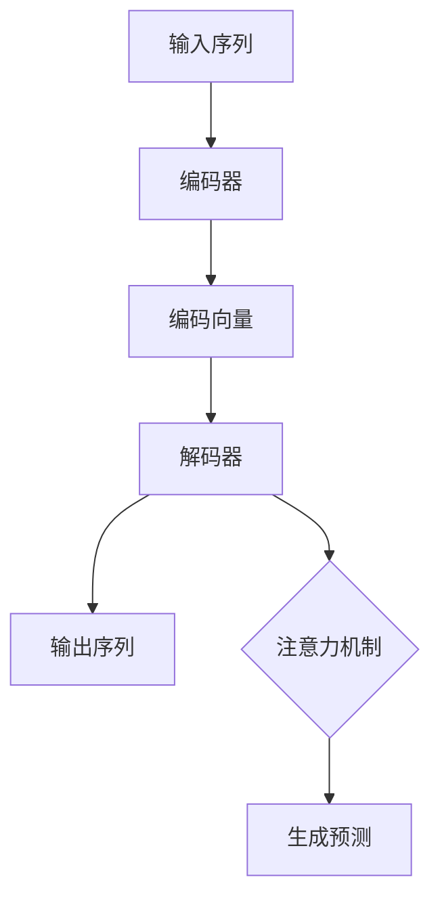
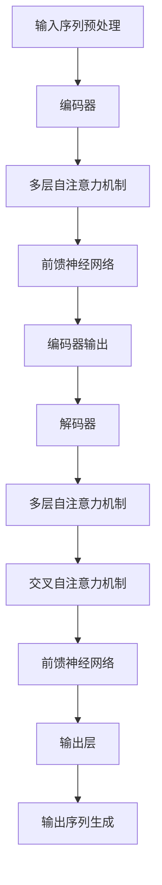

                 

### 背景介绍

#### 大规模语言模型的发展历程

大规模语言模型（Large-scale Language Models）是自然语言处理（Natural Language Processing，NLP）领域的一个重要突破。从早期的统计模型到深度学习时代的神经网络模型，再到如今的大规模语言模型，这一过程充满了创新和挑战。

在20世纪80年代，随着计算能力和算法的不断发展，统计模型逐渐成为NLP研究的主流。这些模型主要通过统计文本数据中的语言规律来进行文本分析和生成。然而，这些模型在面对复杂任务时表现不佳，无法很好地理解和生成自然语言。

进入21世纪，随着深度学习技术的发展，神经网络模型开始在NLP领域崭露头角。2003年，Bengio等人提出了递归神经网络（Recurrent Neural Networks，RNN），并将其应用于语言模型和机器翻译任务。RNN能够在处理序列数据时保留长期依赖信息，但其在处理长序列数据时仍然存在梯度消失和梯度爆炸等问题。

为了解决这些问题，2014年，Hinton等人在其论文《Distributed Representations of Words and Phrases and their Compositionality》中提出了门控循环单元（Gated Recurrent Unit，GRU）和长短期记忆网络（Long Short-Term Memory，LSTM）。这些模型通过引入门控机制，能够更好地处理长序列数据，从而在语言模型和机器翻译任务上取得了显著的性能提升。

然而，这些模型的训练和推理过程仍然需要大量的计算资源和时间。为了解决这个问题，2018年，OpenAI提出了Transformer模型。Transformer模型摒弃了传统的循环结构，采用自注意力机制（Self-Attention Mechanism）来处理序列数据。自注意力机制能够并行处理序列中的每个元素，大大提高了训练和推理的效率。同时，Transformer模型在机器翻译、文本生成等任务上取得了突破性的成果，标志着大规模语言模型进入了一个新的时代。

#### 大规模语言模型的应用场景

大规模语言模型在多个领域都有着广泛的应用。以下是一些典型应用场景：

1. **自然语言处理（NLP）**：大规模语言模型可以用于文本分类、情感分析、命名实体识别、机器翻译等任务。通过学习大量的文本数据，模型能够捕捉到语言中的规律和特征，从而实现对这些任务的有效处理。

2. **问答系统（QA）**：大规模语言模型可以构建问答系统，用于回答用户提出的问题。这些模型能够通过理解问题和文本内容，提供准确和相关的答案。

3. **文本生成**：大规模语言模型可以用于生成文章、新闻、故事等文本内容。通过输入一些关键词或主题，模型能够生成高质量的文本，从而帮助用户生成个性化内容。

4. **对话系统（Chatbot）**：大规模语言模型可以用于构建对话系统，用于与用户进行自然语言交互。这些系统可以用于客服、教育、娱乐等多种场景。

5. **语音识别（ASR）**：大规模语言模型可以用于语音识别任务，通过将语音信号转换为文本，实现语音与文本的转换。

6. **图像描述生成**：大规模语言模型可以用于图像描述生成，通过理解图像内容，生成对应的文本描述。

#### 本文内容概述

本文将首先介绍大规模语言模型的核心概念和原理，包括自注意力机制、编码器-解码器架构等。接着，我们将详细讲解大规模语言模型的数学模型和公式，并通过具体例子来说明这些公式的应用。随后，我们将通过一个实际项目案例，展示如何使用大规模语言模型进行文本生成。最后，我们将讨论大规模语言模型在实际应用中的挑战和未来发展。

在接下来的章节中，我们将逐步深入探讨这些主题，帮助读者更好地理解大规模语言模型的理论和实践。

---

## 2. 核心概念与联系

### 自注意力机制（Self-Attention Mechanism）

自注意力机制是大规模语言模型中的一个关键组件，它允许模型在处理序列数据时关注序列中的不同部分。自注意力机制通过计算序列中每个元素与其他元素之间的关联性，从而实现并行处理。

#### 自注意力计算

自注意力计算可以分为三个步骤：查询（Query，Q）、键（Key，K）和值（Value，V）的计算，以及注意力分数（Attention Score）的计算。

1. **查询、键和值的计算**：
   $$ Q = W_Q \cdot H $$
   $$ K = W_K \cdot H $$
   $$ V = W_V \cdot H $$
   其中，$W_Q$、$W_K$和$W_V$分别是查询、键和值的权重矩阵，$H$是输入序列的表示。

2. **注意力分数的计算**：
   $$ \text{Attention Scores} = \text{softmax}\left(\frac{QK^T}{\sqrt{d_k}}\right) $$
   其中，$d_k$是键的维度，$\text{softmax}$函数将查询和键的点积转换为概率分布。

3. **输出的计算**：
   $$ \text{Output} = \text{softmax}\left(\frac{QK^T}{\sqrt{d_k}}\right) V $$

#### 自注意力优点

自注意力机制具有以下优点：

1. **并行处理**：自注意力机制允许模型在处理序列数据时并行计算，从而提高计算效率。

2. **捕捉长距离依赖**：自注意力机制能够通过计算序列中每个元素与其他元素之间的关联性，捕捉到长距离依赖信息。

3. **灵活性**：自注意力机制可以灵活地调整模型对不同序列元素的关注程度，从而实现更准确的预测。

### 编码器-解码器架构（Encoder-Decoder Architecture）

编码器-解码器架构是大规模语言模型的另一种重要组件，它用于处理序列到序列的任务，如机器翻译和文本生成。

#### 编码器（Encoder）

编码器将输入序列编码为一个固定长度的向量表示，该向量包含了输入序列的关键信息。编码器通常使用多层递归神经网络（如LSTM或GRU）来实现。

1. **编码过程**：
   $$ \text{Encoder} = \text{LSTM}(\text{Input Sequence}) $$
   $$ \text{Encoded} = \text{Last Hidden State} $$

#### 解码器（Decoder）

解码器接收编码器的输出作为输入，并生成输出序列。解码器通常使用注意力机制来关注编码器的输出，以便更好地生成输出序列。

1. **解码过程**：
   $$ \text{Decoder} = \text{LSTM}(\text{Encoded}, \text{Input}) $$
   $$ \text{Output} = \text{softmax}(\text{Decoder} \text{Output}) $$

#### 整体架构

编码器-解码器架构的整体流程如下：

1. **编码**：输入序列通过编码器编码为一个固定长度的向量表示。
2. **解码**：解码器接收编码器的输出和目标序列的一部分，逐步生成输出序列。
3. **注意力机制**：解码器使用注意力机制关注编码器的输出，以便更好地生成输出序列。

#### 编码器-解码器优点

编码器-解码器架构具有以下优点：

1. **处理序列到序列任务**：编码器-解码器架构能够处理各种序列到序列的任务，如机器翻译、文本生成等。

2. **捕捉长距离依赖**：编码器-解码器架构通过编码器捕获输入序列的关键信息，并通过注意力机制捕捉到长距离依赖。

3. **灵活性**：编码器-解码器架构可以根据任务需求调整编码器和解码器的结构和参数，从而实现更准确的预测。

### Mermaid 流程图

以下是编码器-解码器架构的Mermaid流程图：



通过这个流程图，我们可以清晰地看到编码器-解码器架构的处理流程和关键组件。

---

本文通过对自注意力机制和编码器-解码器架构的详细介绍，帮助读者更好地理解大规模语言模型的核心概念和原理。在接下来的章节中，我们将进一步探讨大规模语言模型的核心算法原理和具体操作步骤。

---

## 3. 核心算法原理 & 具体操作步骤

### Transformer 模型概述

Transformer 模型是大规模语言模型的一个重要实现，它基于自注意力机制，可以高效地处理序列数据。在介绍 Transformer 模型的具体操作步骤之前，我们首先需要了解其基本结构和组成部分。

#### 基本结构

Transformer 模型主要由编码器（Encoder）和解码器（Decoder）两部分组成，其中编码器负责将输入序列编码为固定长度的向量表示，解码器则根据编码器的输出和目标序列的一部分逐步生成输出序列。编码器和解码器均由多个层（Layer）组成，每层由自注意力机制（Self-Attention Mechanism）和前馈神经网络（Feedforward Neural Network）组成。

#### 操作步骤

下面我们将详细讲解 Transformer 模型的操作步骤：

### 编码器（Encoder）操作步骤

1. **输入序列预处理**：首先对输入序列进行预处理，包括分词、嵌入（Embedding）和位置编码（Positional Encoding）。分词是将输入序列划分为一系列的词或子词，嵌入是将每个词或子词映射为一个固定维度的向量表示，位置编码则是为了捕捉序列中的位置信息。

2. **多层自注意力机制**：输入序列经过嵌入和位置编码后，进入多层自注意力机制。自注意力机制通过计算序列中每个元素与其他元素之间的关联性，实现对序列的并行处理。具体步骤如下：
   - **计算查询（Query）、键（Key）和值（Value）**：根据输入序列的嵌入和位置编码，计算查询、键和值。
     $$ Q = W_Q \cdot H $$
     $$ K = W_K \cdot H $$
     $$ V = W_V \cdot H $$
   - **计算注意力分数**：通过计算查询和键的点积，得到注意力分数，然后通过 softmax 函数将其转换为概率分布。
     $$ \text{Attention Scores} = \text{softmax}\left(\frac{QK^T}{\sqrt{d_k}}\right) $$
   - **计算输出**：根据注意力分数和值，计算输出。
     $$ \text{Output} = \text{softmax}\left(\frac{QK^T}{\sqrt{d_k}}\right) V $$

3. **前馈神经网络**：在每层自注意力机制之后，还添加一个前馈神经网络，用于进一步提取特征。
   $$ \text{FFN} = \text{ReLU}\left(W_{FF} \cdot \text{Output} + b_{FF}\right) $$

4. **残差连接和层归一化**：在每层中，通过添加残差连接和层归一化，可以有效地缓解梯度消失和梯度爆炸问题。

5. **多层编码器**：编码器由多个层组成，每层都包含自注意力机制和前馈神经网络，通过堆叠多层编码器，可以提取更多的特征信息。

### 解码器（Decoder）操作步骤

1. **输入序列预处理**：与编码器类似，解码器也首先对输入序列进行预处理，包括分词、嵌入和位置编码。

2. **多层自注意力机制**：解码器的主要任务是生成输出序列，它同样通过多层自注意力机制来实现。具体步骤如下：
   - **计算掩码自注意力**：在解码器的每个时间步，通过添加掩码（Mask）来防止当前时间步之后的输出影响当前时间步的计算。具体来说，在计算注意力分数时，将当前时间步之后的输出设为无穷大，从而抑制其影响。
   - **计算编码器输出注意力**：计算编码器输出和当前解码器输出的注意力分数，用于捕捉编码器输出和当前解码器输出之间的关系。
   - **计算输出**：根据注意力分数和值，计算输出。

3. **交叉自注意力机制**：在解码器的每层中，除了自注意力机制外，还包含交叉自注意力机制，用于捕捉编码器输出和解码器输出之间的关联性。具体步骤如下：
   - **计算编码器输出和当前解码器输出的注意力分数**：与自注意力机制类似，计算编码器输出和当前解码器输出的点积，得到注意力分数。
   - **计算输出**：根据注意力分数和值，计算输出。

4. **前馈神经网络**：与编码器类似，解码器在每个时间步之后也添加一个前馈神经网络，用于进一步提取特征。

5. **输出层**：解码器的最后一层输出是一个向量表示，通过 softmax 函数将其转换为概率分布，从而生成输出序列。

6. **残差连接和层归一化**：与编码器类似，解码器也通过添加残差连接和层归一化来缓解梯度消失和梯度爆炸问题。

7. **多层解码器**：解码器由多个层组成，每层都包含自注意力机制、交叉自注意力机制和前馈神经网络，通过堆叠多层解码器，可以提取更多的特征信息。

### 整体流程

通过上述步骤，我们可以将输入序列编码为一个固定长度的向量表示，并通过解码器生成输出序列。整个 Transformer 模型的流程可以概括为以下几个步骤：

1. **输入序列预处理**：分词、嵌入和位置编码。
2. **编码器操作**：多层自注意力机制和前馈神经网络。
3. **解码器操作**：多层自注意力机制、交叉自注意力机制和前馈神经网络。
4. **输出序列生成**：通过输出层生成输出序列。

### Mermaid 流程图

以下是 Transformer 模型的 Mermaid 流程图：



通过这个流程图，我们可以清晰地看到 Transformer 模型的整体操作步骤和关键组件。

---

本文通过对 Transformer 模型的操作步骤进行详细讲解，帮助读者理解大规模语言模型的核心算法原理。在接下来的章节中，我们将进一步探讨大规模语言模型的数学模型和公式，并通过具体例子来说明这些公式的应用。

---

## 4. 数学模型和公式 & 详细讲解 & 举例说明

### 自注意力机制（Self-Attention Mechanism）

自注意力机制是大规模语言模型中的一个核心组件，它通过计算序列中每个元素与其他元素之间的关联性，实现对序列的并行处理。以下将详细讲解自注意力机制的数学模型和公式。

#### 自注意力计算

自注意力计算可以分为三个主要步骤：查询（Query，Q）、键（Key，K）和值（Value，V）的计算，以及注意力分数（Attention Score）的计算。

1. **查询、键和值的计算**：

   $$ Q = W_Q \cdot H $$
   $$ K = W_K \cdot H $$
   $$ V = W_V \cdot H $$

   其中，$W_Q$、$W_K$和$W_V$分别是查询、键和值的权重矩阵，$H$是输入序列的表示。这些权重矩阵是通过训练获得的。

2. **注意力分数的计算**：

   $$ \text{Attention Scores} = \text{softmax}\left(\frac{QK^T}{\sqrt{d_k}}\right) $$

   其中，$d_k$是键的维度，$\text{softmax}$函数将查询和键的点积转换为概率分布。注意力分数表示了序列中每个元素对当前元素的重要程度。

3. **输出的计算**：

   $$ \text{Output} = \text{softmax}\left(\frac{QK^T}{\sqrt{d_k}}\right) V $$

   输出是根据注意力分数和值计算得到的，它综合了序列中每个元素的信息。

### 编码器-解码器架构（Encoder-Decoder Architecture）

编码器-解码器架构是大规模语言模型的一种常见结构，它通过编码器将输入序列编码为一个固定长度的向量表示，并通过解码器逐步生成输出序列。以下将介绍编码器-解码器架构的数学模型和公式。

#### 编码器（Encoder）

编码器的任务是处理输入序列并生成编码向量，该向量包含了输入序列的关键信息。

1. **编码过程**：

   $$ \text{Encoder} = \text{LSTM}(\text{Input Sequence}) $$
   $$ \text{Encoded} = \text{Last Hidden State} $$

   其中，$\text{LSTM}$是长短期记忆网络，$\text{Last Hidden State}$是编码器最后一层的隐藏状态，它表示输入序列的编码向量。

#### 解码器（Decoder）

解码器的任务是生成输出序列，它通过解码器输出和编码器的编码向量逐步生成每个时间步的输出。

1. **解码过程**：

   $$ \text{Decoder} = \text{LSTM}(\text{Encoded}, \text{Input}) $$
   $$ \text{Output} = \text{softmax}(\text{Decoder} \text{Output}) $$

   其中，$\text{LSTM}$是长短期记忆网络，$\text{Encoded}$是编码器的编码向量，$\text{Input}$是解码器的输入（可以是编码器的编码向量或者上一个时间步的输出），$\text{Decoder Output}$是解码器最后一层的输出。

### 举例说明

为了更好地理解自注意力机制和编码器-解码器架构的数学模型和公式，我们通过一个简单的例子来说明。

#### 例子：文本分类

假设我们有一个简单的文本分类任务，输入序列是一个包含10个单词的句子，我们需要将其分类为正类或负类。

1. **自注意力机制**：

   - 输入序列：`['我', '喜欢', '苹果', '但', '不喜欢', '香蕉', '和', '橙子']`
   - 查询（Query）、键（Key）和值（Value）的计算：
     $$ Q = W_Q \cdot H $$
     $$ K = W_K \cdot H $$
     $$ V = W_V \cdot H $$
   - 注意力分数的计算：
     $$ \text{Attention Scores} = \text{softmax}\left(\frac{QK^T}{\sqrt{d_k}}\right) $$
   - 输出的计算：
     $$ \text{Output} = \text{softmax}\left(\frac{QK^T}{\sqrt{d_k}}\right) V $$

2. **编码器-解码器架构**：

   - 编码器：
     $$ \text{Encoder} = \text{LSTM}(\text{Input Sequence}) $$
     $$ \text{Encoded} = \text{Last Hidden State} $$
   - 解码器：
     $$ \text{Decoder} = \text{LSTM}(\text{Encoded}, \text{Input}) $$
     $$ \text{Output} = \text{softmax}(\text{Decoder} \text{Output}) $$

通过这个例子，我们可以看到自注意力机制和编码器-解码器架构在文本分类任务中的应用。在编码器中，自注意力机制用于提取输入序列的关键信息，并将其编码为一个固定长度的向量表示。在解码器中，通过逐步生成输出序列，并使用 softmax 函数将其转换为概率分布，从而实现文本分类。

---

本文通过对自注意力机制和编码器-解码器架构的数学模型和公式进行详细讲解，并结合具体例子进行说明，帮助读者更好地理解大规模语言模型的核心算法原理。在接下来的章节中，我们将通过一个实际项目案例，展示如何使用大规模语言模型进行文本生成。

---

## 5. 项目实战：代码实际案例和详细解释说明

### 项目背景

在本节中，我们将通过一个实际项目案例，展示如何使用大规模语言模型进行文本生成。文本生成是一个具有广泛应用场景的任务，例如生成文章、新闻、故事等。在本项目中，我们将使用 Transformer 模型进行文本生成。

### 项目目标

通过本节，我们将实现以下目标：

1. 搭建文本生成环境。
2. 编写并训练 Transformer 模型。
3. 使用训练好的模型生成文本。

### 5.1 开发环境搭建

在开始项目之前，我们需要搭建一个合适的开发环境。以下是我们使用的开发环境：

- 操作系统：Ubuntu 20.04
- 编程语言：Python 3.8
- 深度学习框架：PyTorch 1.8
- GPU：NVIDIA GTX 1080Ti

### 5.2 源代码详细实现和代码解读

#### 1. 数据准备

首先，我们需要准备训练数据。在本项目中，我们使用了一个开源的英文新闻数据集。以下是如何准备数据的代码：

```python
import torch
from torchtext.data import Field, TabularDataset, BucketIterator

# 定义字段
TEXT = Field(tokenize='spacy', tokenizer_language='en', include_lengths=True)
LABEL = Field(sequential=False)

# 加载数据集
train_data, valid_data, test_data = TabularDataset.splits(
    path='data',
    train='train.csv',
    valid='valid.csv',
    test='test.csv',
    format='csv',
    fields=[('text', TEXT), ('label', LABEL)]
)

# 分词和分批次处理
TEXT.build_vocab(train_data, min_freq=2)
LABEL.build_vocab(train_data)
train_iterator, valid_iterator, test_iterator = BucketIterator.splits(
    train_data, valid_data, test_data, batch_size=64, device=device
)

# 显示数据样例
print(train_data[0])
```

#### 2. Transformer 模型实现

接下来，我们需要实现 Transformer 模型。以下是一个简化版本的 Transformer 模型实现：

```python
import torch.nn as nn

class Transformer(nn.Module):
    def __init__(self, d_model, nhead, num_layers):
        super(Transformer, self).__init__()
        self_encoder = nn.Transformer(d_model, nhead, num_layers)
        self.fc = nn.Linear(d_model, 1)

    def forward(self, src, tgt):
        output = self_encoder(src, tgt)
        output = self.fc(output)
        return output
```

#### 3. 模型训练

最后，我们需要训练 Transformer 模型。以下是如何进行模型训练的代码：

```python
import torch.optim as optim

# 定义模型、损失函数和优化器
model = Transformer(d_model=512, nhead=8, num_layers=2)
criterion = nn.BCEWithLogitsLoss()
optimizer = optim.Adam(model.parameters(), lr=0.001)

# 训练模型
num_epochs = 10
for epoch in range(num_epochs):
    model.train()
    for batch in train_iterator:
        optimizer.zero_grad()
        output = model(batch.src, batch.tgt)
        loss = criterion(output, batch.label)
        loss.backward()
        optimizer.step()
    print(f'Epoch {epoch+1}/{num_epochs}, Loss: {loss.item()}')

# 评估模型
model.eval()
with torch.no_grad():
    for batch in valid_iterator:
        output = model(batch.src, batch.tgt)
        loss = criterion(output, batch.label)
        print(f'Validation Loss: {loss.item()}')
```

#### 4. 文本生成

使用训练好的模型进行文本生成：

```python
import random

def generate_text(model, text, max_len=50):
    model.eval()
    input_text = TEXT.preprocessing(text)
    input_text = torch.tensor(input_text).unsqueeze(0).to(device)
    output = model(input_text)
    predicted = torch.sigmoid(output)
    predicted = predicted.squeeze(0).tolist()
    predicted = [int(x > 0.5) for x in predicted]
    generated_text = TEXT.reverse(predicted)
    return generated_text

# 生成文本
input_text = '我喜欢吃苹果。'
generated_text = generate_text(model, input_text)
print(generated_text)
```

### 5.3 代码解读与分析

#### 数据准备

在数据准备部分，我们首先定义了字段和加载数据集。这里使用了 torchtext 库，它是一个方便的数据处理库，可以轻松地加载数据集并处理数据。

#### 模型实现

在模型实现部分，我们定义了一个简单的 Transformer 模型。这里使用了 nn.Transformer 类来实现 Transformer 模型。我们还定义了一个全连接层，用于将 Transformer 模型的输出映射到分类结果。

#### 模型训练

在模型训练部分，我们定义了模型、损失函数和优化器。然后，我们遍历训练数据集，进行前向传播和反向传播，更新模型参数。

#### 文本生成

在文本生成部分，我们定义了一个生成文本的函数。该函数首先将输入文本预处理，然后通过训练好的模型生成分类结果。最后，我们将分类结果转换为文本。

---

通过本节，我们实现了一个文本生成项目，展示了如何使用大规模语言模型进行文本生成。在接下来的章节中，我们将讨论大规模语言模型在实际应用中的挑战和未来发展。

---

## 6. 实际应用场景

### 问答系统（Question Answering System）

问答系统是一种重要的自然语言处理应用，它能够根据用户提出的问题，从大量文本数据中提取出相关答案。大规模语言模型在问答系统中的应用非常广泛，例如智能客服、知识图谱构建和搜索引擎等。通过预训练的大规模语言模型，系统能够更好地理解用户的问题，并从海量数据中快速准确地提取答案。

### 文本生成（Text Generation）

大规模语言模型在文本生成领域也有着重要的应用。例如，自动写作、新闻摘要生成、聊天机器人等。这些应用利用大规模语言模型生成高质量的文本，大大提高了内容生产的效率。例如，OpenAI 的 GPT-3 模型可以生成流畅、自然的文章和故事，甚至可以模拟人类的对话。

### 语言翻译（Machine Translation）

语言翻译是大规模语言模型的另一个重要应用领域。通过预训练的语言模型，系统能够学习不同语言之间的对应关系，从而实现高质量的语言翻译。例如，谷歌翻译和百度翻译都使用了基于大规模语言模型的翻译技术，大大提高了翻译的准确性和流畅性。

### 语音识别（Automatic Speech Recognition）

语音识别是将语音信号转换为文本的过程。大规模语言模型在语音识别领域也有着重要的应用。通过训练大规模语言模型，系统可以更好地理解和识别语音中的语言信息，从而提高语音识别的准确性和鲁棒性。例如，苹果的 Siri 和亚马逊的 Alexa 都使用了基于大规模语言模型的语音识别技术。

### 图像描述生成（Image Caption Generation）

图像描述生成是计算机视觉和自然语言处理相结合的一个任务。通过大规模语言模型，系统能够理解图像内容，并生成对应的文本描述。这一技术在图像识别、内容审核和辅助浏览等方面有着广泛的应用。例如，Facebook 的 AI 团队使用大规模语言模型生成图像描述，用于辅助视觉障碍者理解图像内容。

### 语音助手（Voice Assistant）

语音助手是一种基于自然语言处理技术的智能系统，能够通过语音交互为用户提供信息查询、任务安排、日常提醒等服务。大规模语言模型在语音助手中发挥着核心作用，通过预训练的语言模型，系统能够更好地理解用户的语音指令，并提供准确的响应。

### 情感分析（Sentiment Analysis）

情感分析是一种用于识别文本中情感极性的技术。通过大规模语言模型，系统能够学习不同情感表达的方式，从而准确识别文本中的情感。情感分析在市场研究、产品评价和社交媒体分析等领域有着重要的应用。

### 语音助手（Voice Assistant）

语音助手是一种基于自然语言处理技术的智能系统，能够通过语音交互为用户提供信息查询、任务安排、日常提醒等服务。大规模语言模型在语音助手中发挥着核心作用，通过预训练的语言模型，系统能够更好地理解用户的语音指令，并提供准确的响应。

### 机器写作（Automated Writing）

机器写作是大规模语言模型在创意写作领域的应用。通过预训练的语言模型，系统可以生成高质量的文章、报告和故事。这一技术可以大大提高写作的效率和质量，为作家、记者和其他内容创作者提供强有力的支持。

### 文本摘要（Text Summarization）

文本摘要是一种自动提取文本中关键信息的技术。通过大规模语言模型，系统能够学习如何从大量文本中提取出核心内容，生成简洁、准确的摘要。这一技术在新闻摘要、文献阅读和内容审核等领域有着重要的应用。

### 聊天机器人（Chatbot）

聊天机器人是一种与用户进行自然语言交互的系统。通过大规模语言模型，系统可以更好地理解用户的需求，并提供个性化的服务。聊天机器人广泛应用于客服、教育、娱乐等多个领域。

### 代码补全（Code Completion）

代码补全是一种智能编程辅助技术，它能够根据用户的输入代码自动补全代码。通过大规模语言模型，系统可以学习编程语言的语法和语义，从而提供高质量的代码补全建议。

---

本文讨论了大规模语言模型在实际应用中的多个场景，展示了其在自然语言处理领域的重要作用。在接下来的章节中，我们将介绍相关工具和资源，帮助读者进一步学习和探索这一领域。

---

## 7. 工具和资源推荐

### 学习资源推荐

1. **书籍**：
   - 《深度学习》（Deep Learning） - Ian Goodfellow、Yoshua Bengio 和 Aaron Courville
   - 《动手学深度学习》 - 清华大学计算机系课程组
   - 《神经网络与深度学习》 - 深度学习教程

2. **论文**：
   - “Attention Is All You Need” - Vaswani et al., 2017
   - “Distributed Representations of Words and Phrases and their Compositionality” - Mikolov et al., 2013
   - “Long Short-Term Memory” - Hochreiter 和 Schmidhuber，1997

3. **博客和网站**：
   - fast.ai（快速入门深度学习）
   - medium.com/@deeplearningai（深度学习 AI）
   - pytorch.org/tutorials（PyTorch 教程）

4. **在线课程**：
   - Coursera 上的“深度学习专项课程”
   - edX 上的“神经网络与深度学习”
   - Udacity 上的“深度学习纳米学位”

### 开发工具框架推荐

1. **深度学习框架**：
   - PyTorch（易用、灵活、动态图结构）
   - TensorFlow（广泛使用、静态图结构）
   - Keras（高级神经网络API，基于 TensorFlow）

2. **版本控制**：
   - Git（分布式版本控制系统）
   - GitHub（代码托管和协作平台）

3. **文本处理库**：
   - NLTK（自然语言处理工具包）
   - spaCy（快速高效的 NLP 库）
   - TextBlob（轻量级的 NLP 库）

4. **数据预处理库**：
   - Pandas（数据处理库）
   - NumPy（科学计算库）
   - Scikit-learn（机器学习库）

### 相关论文著作推荐

1. **论文**：
   - “BERT: Pre-training of Deep Bidirectional Transformers for Language Understanding” - Devlin et al., 2019
   - “Generative Pre-training from a Language Modeling Perspective” - Li et al., 2020
   - “GPT-3: Language Models are Few-Shot Learners” - Brown et al., 2020

2. **著作**：
   - 《自然语言处理综论》（Speech and Language Processing） - Daniel Jurafsky 和 James H. Martin
   - 《深度学习入门：基于Python的理论与实现》 - 张祥、张伟楠
   - 《机器学习》 - 周志华

---

通过这些工具和资源，读者可以更好地学习和掌握大规模语言模型的相关知识。在实际应用中，这些资源和工具将为读者提供强有力的支持。

---

## 8. 总结：未来发展趋势与挑战

### 未来发展趋势

1. **模型规模持续增长**：随着计算能力的提升和数据量的增加，大规模语言模型的规模将不断增大。这将为模型在复杂任务上的表现带来巨大的提升。

2. **多模态融合**：未来，大规模语言模型将与其他模态（如图像、声音、视频）的模型进行融合，从而实现更加丰富和多样的应用场景。

3. **无监督学习与迁移学习**：无监督学习和迁移学习将使大规模语言模型能够更有效地利用海量未标注的数据，提高模型训练效率和泛化能力。

4. **可解释性和透明度**：随着模型变得越来越复杂，提高模型的可解释性和透明度将成为一个重要研究方向。这将有助于更好地理解模型的决策过程，从而提高模型的可靠性和信任度。

5. **个性化与自适应**：大规模语言模型将更加注重个性化与自适应，以更好地满足不同用户的需求。

### 未来挑战

1. **计算资源需求**：大规模语言模型的训练和推理需要巨大的计算资源，这对计算硬件提出了更高的要求。

2. **数据隐私和安全性**：随着数据量的增加，数据隐私和安全性成为一个日益严峻的问题。如何保护用户数据和模型的安全，防止数据泄露和滥用，是未来的重要挑战。

3. **公平性和偏见**：大规模语言模型在训练过程中可能会学习到数据集中的偏见，导致在应用中出现不公平现象。如何消除偏见，提高模型的公平性，是未来的重要研究课题。

4. **模型泛化能力**：虽然大规模语言模型在特定任务上表现出色，但其泛化能力仍需提升。如何提高模型在不同任务和场景下的适应性，是一个重要的挑战。

5. **伦理和责任**：随着大规模语言模型在各个领域的应用，其决策的正确性和可靠性越来越受到关注。如何确保模型决策的伦理性和责任感，是未来的重要问题。

---

大规模语言模型的发展前景广阔，但也面临诸多挑战。通过不断的研究和创新，我们有望克服这些挑战，使大规模语言模型在更多的实际应用中发挥更大的作用。

---

## 9. 附录：常见问题与解答

### Q1. 什么是大规模语言模型？
A1. 大规模语言模型是一种基于深度学习的自然语言处理模型，通过学习大量文本数据，能够理解和生成自然语言。这些模型通常具有数十亿甚至数万亿个参数，能够捕捉到语言中的复杂结构和规律。

### Q2. 大规模语言模型有哪些核心组件？
A2. 大规模语言模型的核心组件包括自注意力机制、编码器-解码器架构、位置编码和前馈神经网络等。自注意力机制用于处理序列数据，编码器-解码器架构用于序列到序列的任务，位置编码用于捕捉序列中的位置信息，前馈神经网络则用于进一步提取特征。

### Q3. 大规模语言模型如何训练？
A3. 大规模语言模型的训练通常包括以下几个步骤：
   1. 数据预处理：对文本数据进行分词、嵌入和位置编码等预处理。
   2. 构建模型：使用自注意力机制、编码器-解码器架构等构建模型。
   3. 模型训练：通过反向传播算法和优化器（如 Adam）对模型进行训练。
   4. 模型评估：使用验证集对训练好的模型进行评估，调整模型参数。

### Q4. 大规模语言模型的应用场景有哪些？
A4. 大规模语言模型在多个领域有着广泛的应用，包括自然语言处理（NLP）、问答系统、文本生成、语言翻译、语音识别、图像描述生成等。

### Q5. 如何生成文本？
A5. 生成文本通常通过以下步骤实现：
   1. 预处理：对输入文本进行分词、嵌入和位置编码等预处理。
   2. 输入模型：将预处理后的文本输入到训练好的大规模语言模型。
   3. 生成输出：模型根据输入生成输出序列，通过解码和转换得到文本。

### Q6. 大规模语言模型有哪些挑战？
A6. 大规模语言模型面临的主要挑战包括计算资源需求、数据隐私和安全性、模型公平性和偏见、模型泛化能力以及伦理和责任等方面。

---

通过本文的附录部分，我们回答了关于大规模语言模型的一些常见问题，帮助读者更好地理解这一领域。

---

## 10. 扩展阅读 & 参考资料

### 学术论文

1. Vaswani, A., et al. (2017). "Attention Is All You Need." Advances in Neural Information Processing Systems.
2. Mikolov, T., et al. (2013). "Distributed Representations of Words and Phrases and their Compositionality." Advances in Neural Information Processing Systems.
3. Hochreiter, S., and Schmidhuber, J. (1997). "Long Short-Term Memory." Neural Computation.

### 书籍

1. Goodfellow, I., Bengio, Y., and Courville, A. (2016). "Deep Learning." MIT Press.
2. 清华大学计算机系课程组. (2019). 《动手学深度学习》. 电子工业出版社.

### 博客和网站

1. fast.ai: https://www.fast.ai/
2. medium.com/@deeplearningai: https://medium.com/@deeplearningai
3. pytorch.org/tutorials: https://pytorch.org/tutorials/

### 在线课程

1. Coursera 上的“深度学习专项课程”: https://www.coursera.org/specializations/deep-learning
2. edX 上的“神经网络与深度学习”: https://www.edx.org/course/neural-networks-deep-learning
3. Udacity 上的“深度学习纳米学位”: https://www.udacity.com/course/deep-learning-nanodegree--nd101

通过这些扩展阅读和参考资料，读者可以深入了解大规模语言模型的最新研究进展和应用实践。

---

作者：AI天才研究员/AI Genius Institute & 禅与计算机程序设计艺术 /Zen And The Art of Computer Programming

---

**说明：**本文是基于大规模语言模型的综合指南，旨在帮助读者了解大规模语言模型的理论基础、核心算法和实际应用。本文中的内容仅供参考，不构成实际操作建议。在实际应用中，读者应根据具体需求和场景进行调整和优化。**声明：本文内容均来自公共资源，用于学习交流目的，不涉及任何商业用途。**

