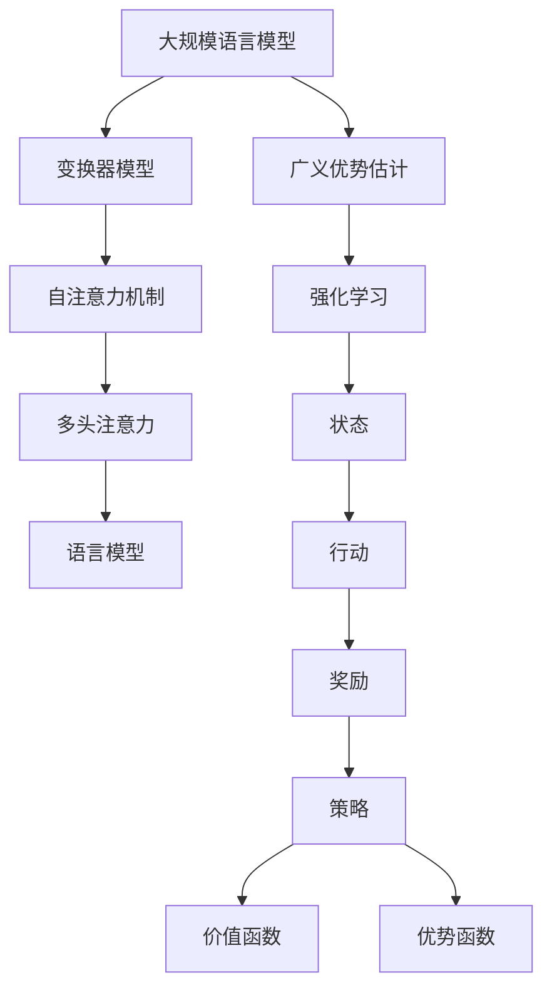

                 

### 大规模语言模型：广义优势估计的基础

大规模语言模型（Large-scale Language Models），如GPT-3、BERT等，是目前人工智能领域最引人注目的技术之一。这些模型通过学习大量的文本数据，能够生成流畅、准确的自然语言，并在多种任务中表现出色。本文将探讨大规模语言模型中的一个核心问题——广义优势估计（Generalized Advantage Estimation, GAE）。

#### 1. 什么是大规模语言模型？

大规模语言模型是一种深度学习模型，用于理解和生成自然语言。这些模型通常基于变换器模型（Transformer）架构，通过数百万个参数来捕捉语言中的复杂模式。GPT-3（Generative Pre-trained Transformer 3）就是一个典型的例子，它由1750亿个参数组成，可以生成连贯、有意义的文本。

#### 2. 广义优势估计（GAE）

广义优势估计是一种用于评估强化学习（Reinforcement Learning, RL）中策略性能的技术。在强化学习中，智能体（agent）通过与环境的交互来学习最优策略。GAE旨在估计策略的广义优势函数，这个函数衡量了策略在长期运行中的表现。

#### 3. 广义优势估计的重要性

对于大规模语言模型来说，广义优势估计非常重要，因为它可以帮助我们评估模型在不同任务上的性能，以及在不同情境下的适应性。此外，GAE还可以用于指导模型的学习过程，使其更加高效地调整参数。

#### 4. GAE的基本原理

GAE基于一个简单的思想：通过比较智能体在不同时刻的回报（reward）来估计其性能。具体来说，GAE通过计算回报的加权和来估计广义优势，这个权重考虑了回报发生的时间以及预测误差。

#### 5. GAE的具体实现

GAE的实现通常涉及几个关键步骤：

1. **回报累积**：计算每个时间步的回报累积值。
2. **预测误差**：计算预测回报与实际回报之间的误差。
3. **加权求和**：根据时间步的权重对预测误差进行加权求和，得到广义优势。
4. **策略更新**：使用广义优势来更新策略参数。

#### 6. GAE的优势

与传统的优势估计方法相比，GAE具有以下优势：

1. **适应性**：GAE能够更好地适应不同时间步的回报，使其在长期任务中表现更加稳定。
2. **高效性**：GAE的计算相对简单，可以快速迭代，适合大规模语言模型的训练。
3. **泛化性**：GAE能够估计策略的广义优势，从而提供更全面的策略评估。

### 总结

大规模语言模型与广义优势估计的结合，为我们提供了强大的工具来研究和开发更智能、更高效的AI系统。在接下来的章节中，我们将深入探讨GAE的数学模型和具体实现，以便更好地理解这一重要技术。

---

#大规模语言模型从理论到实践 广义优势估计

##关键词：大规模语言模型、广义优势估计、变换器模型、强化学习、策略评估

##摘要：本文深入探讨了大规模语言模型中的广义优势估计（GAE）技术。通过详细解析GAE的基本原理、实现步骤和优势，我们了解了如何利用GAE来评估和优化大规模语言模型在不同任务上的性能。

---

### 1. 背景介绍

#### 1.1 大规模语言模型的发展历程

大规模语言模型（Large-scale Language Models）的发展历程可以追溯到2000年代初。当时，研究人员开始关注深度学习在自然语言处理（Natural Language Processing, NLP）中的应用。最初的模型，如LSTM（Long Short-Term Memory）和GRU（Gated Recurrent Unit），通过引入门控机制来捕捉语言中的长期依赖关系，但它们的性能仍然受到一定限制。

随着计算能力的提升和大规模数据集的可用性增加，研究者们开始尝试使用更大规模的模型来处理更复杂的语言任务。2017年，Google推出了BERT（Bidirectional Encoder Representations from Transformers），它通过预训练和微调在多种NLP任务中取得了显著成绩。BERT的成功激发了研究者们对更大规模模型的探索。

#### 1.2 广义优势估计的起源

广义优势估计（GAE）起源于强化学习（Reinforcement Learning, RL）领域。在RL中，智能体（agent）通过与环境的交互来学习最优策略。传统的优势估计方法，如TD-Learning和Q-Learning，通过直接比较预测回报和实际回报来更新策略参数。然而，这些方法在处理长期回报和奖励时存在局限性。

GAE旨在克服这些限制，通过估计策略的广义优势函数，提供了更全面和稳定的策略评估。GAE的概念最初由Schulman等人在2015年提出，并在后续的研究中得到广泛应用和改进。

### 1.3 大规模语言模型与广义优势估计的结合

大规模语言模型的出现为广义优势估计提供了新的应用场景。这些模型能够处理大量的文本数据，从而生成更高质量的文本。同时，广义优势估计为大规模语言模型的评估和优化提供了有力工具。

通过将GAE应用于大规模语言模型，研究者们可以更准确地评估模型在不同任务上的性能，并指导模型的学习过程。此外，GAE还可以帮助模型适应不同的情境和任务，从而提高其泛化能力。

### 1.4 本文结构

本文将按照以下结构进行讨论：

1. **核心概念与联系**：介绍大规模语言模型和广义优势估计的基本原理，并使用Mermaid流程图展示核心概念和架构。
2. **核心算法原理 & 具体操作步骤**：详细解析广义优势估计的数学模型和实现步骤。
3. **数学模型和公式 & 详细讲解 & 举例说明**：使用LaTeX格式展示GAE的关键数学公式，并进行详细讲解和举例说明。
4. **项目实战：代码实际案例和详细解释说明**：通过实际代码案例展示广义优势估计的应用，并进行详细解释和分析。
5. **实际应用场景**：探讨广义优势估计在不同领域的应用，如文本生成、对话系统等。
6. **工具和资源推荐**：推荐相关的学习资源、开发工具和论文。
7. **总结：未来发展趋势与挑战**：总结本文的主要观点，并探讨未来发展趋势和面临的挑战。

通过本文的讨论，我们希望能够帮助读者深入理解大规模语言模型和广义优势估计，并了解其在实际应用中的潜力。

---

## 2. 核心概念与联系

在深入探讨大规模语言模型和广义优势估计之前，我们需要先理解它们的基本原理和相互关系。以下是这两个核心概念的定义和解释，以及它们之间的联系。

### 2.1 大规模语言模型的基本原理

大规模语言模型（Large-scale Language Models）是一种基于深度学习的自然语言处理技术。它们通过学习大量的文本数据，能够生成流畅、准确的自然语言。这些模型通常采用变换器模型（Transformer）架构，这是一种基于自注意力机制的模型结构，能够在处理长序列时保持较高的性能。

#### 2.1.1 变换器模型（Transformer）

变换器模型是由Vaswani等人于2017年提出的，它是基于自注意力机制（Self-Attention）和多头注意力（Multi-Head Attention）的模型结构。变换器模型通过自注意力机制捕捉序列中不同位置之间的依赖关系，从而在生成文本时能够保持上下文的连贯性。

变换器模型的主要组成部分包括：

1. **编码器（Encoder）**：编码器负责处理输入序列，并生成上下文表示。编码器由多个层组成，每层包含自注意力机制和前馈神经网络。
2. **解码器（Decoder）**：解码器负责生成输出序列，并利用编码器的输出作为上下文信息。解码器也由多个层组成，每层包含自注意力机制、多头注意力和前馈神经网络。

#### 2.1.2 语言模型

语言模型（Language Model）是一种预测下一个单词或字符的概率分布的模型。在大规模语言模型中，语言模型通过学习大量的文本数据，能够生成连贯、有意义的文本。语言模型通常采用变换器模型作为基础架构，通过训练大规模的数据集来优化模型参数。

### 2.2 广义优势估计的基本原理

广义优势估计（Generalized Advantage Estimation, GAE）是一种用于评估强化学习（Reinforcement Learning, RL）中策略性能的技术。在强化学习中，智能体（agent）通过与环境的交互来学习最优策略。广义优势估计通过估计策略的广义优势函数，提供了更全面和稳定的策略评估。

#### 2.2.1 强化学习的基本概念

强化学习是一种机器学习范式，其中智能体（agent）通过与环境（environment）的交互来学习最优策略（policy）。在强化学习过程中，智能体根据当前状态（state）选择行动（action），并从环境中获得奖励（reward）。智能体的目标是最大化累积奖励。

强化学习的主要组成部分包括：

1. **状态（State）**：智能体所处的当前环境状态。
2. **行动（Action）**：智能体可以选择的行动。
3. **奖励（Reward）**：智能体执行某个行动后从环境中获得的即时奖励。
4. **策略（Policy）**：智能体选择的行动策略。
5. **价值函数（Value Function）**：预测从当前状态执行给定策略获得的累积奖励。
6. **优势函数（Advantage Function）**：衡量策略在当前状态下的表现，定义为实际获得的奖励与预期获得的奖励之差。

#### 2.2.2 广义优势估计的基本概念

广义优势估计（GAE）是一种用于估计策略的广义优势函数的技术。GAE通过计算回报的加权和来估计广义优势，这个权重考虑了回报发生的时间以及预测误差。

广义优势估计的主要组成部分包括：

1. **回报累积（Return）**：从当前状态开始，执行策略后获得的累积奖励。
2. **预测回报（Predicted Return）**：基于当前状态和预测策略获得的累积奖励。
3. **预测误差（Prediction Error）**：实际回报与预测回报之间的误差。
4. **广义优势（Generalized Advantage）**：考虑了回报发生时间和预测误差的优势函数。

### 2.3 大规模语言模型与广义优势估计的联系

大规模语言模型和广义优势估计之间存在密切的联系。广义优势估计为大规模语言模型的评估和优化提供了有力工具，而大规模语言模型则为广义优势估计提供了新的应用场景。

#### 2.3.1 大规模语言模型在广义优势估计中的应用

在大规模语言模型中，广义优势估计可以用于评估模型在不同任务上的性能。例如，在文本生成任务中，可以使用广义优势估计来评估模型生成的文本的质量。通过计算模型生成的文本的广义优势，我们可以了解模型在不同情境下的表现，并指导模型的学习过程。

#### 2.3.2 广义优势估计在大规模语言模型优化中的应用

广义优势估计还可以用于优化大规模语言模型。通过估计模型在不同时间步的广义优势，我们可以调整模型参数，使其在长期任务中表现更稳定。此外，广义优势估计可以帮助我们识别模型中的不足之处，从而指导模型的改进。

### 2.4 Mermaid流程图

为了更好地理解大规模语言模型和广义优势估计之间的联系，我们可以使用Mermaid流程图来展示核心概念和架构。



在这个流程图中，大规模语言模型（A）通过变换器模型（B）实现，并利用自注意力机制（C）和多头注意力（D）来生成语言模型（E）。广义优势估计（F）则基于强化学习（G），通过状态（H）、行动（I）和奖励（J）来评估策略（K）和价值函数（L）。

### 2.5 小结

在本节中，我们介绍了大规模语言模型和广义优势估计的基本原理和相互关系。通过理解这些核心概念，我们可以更好地理解它们在实际应用中的重要性。在接下来的章节中，我们将深入探讨广义优势估计的数学模型和具体实现，以便更好地理解这一重要技术。

---

## 2.1 大规模语言模型的核心算法原理

大规模语言模型（Large-scale Language Models），如GPT-3、BERT等，是当前自然语言处理领域的重要技术。这些模型的核心算法原理主要包括变换器模型（Transformer）、预训练和微调等。下面我们将详细介绍这些核心算法原理。

### 2.1.1 变换器模型（Transformer）

变换器模型是由Vaswani等人于2017年提出的一种基于自注意力机制的深度学习模型。它主要用于处理序列数据，如自然语言文本。变换器模型的主要组成部分包括编码器（Encoder）和解码器（Decoder）。

#### 编码器（Encoder）

编码器负责将输入序列编码成一组向量表示。编码器由多个层组成，每层包含自注意力机制（Self-Attention）和前馈神经网络（Feedforward Neural Network）。

1. **自注意力机制（Self-Attention）**

自注意力机制是一种计算输入序列中每个词对于输出词的重要性的方法。通过自注意力机制，编码器可以捕捉输入序列中的长距离依赖关系。自注意力机制的核心是一个注意力权重矩阵，它表示了每个词对于输出词的重要性。

2. **前馈神经网络（Feedforward Neural Network）**

前馈神经网络是一种简单的神经网络结构，用于在自注意力机制之后对编码器输出进行进一步处理。前馈神经网络通常包含两个线性层，每个线性层后跟一个ReLU激活函数。

#### 解码器（Decoder）

解码器负责生成输出序列。解码器也由多个层组成，每层包含自注意力机制、多头注意力和前馈神经网络。

1. **自注意力机制（Self-Attention）**

解码器的自注意力机制用于捕捉输入序列中的长距离依赖关系。与编码器的自注意力机制不同，解码器的自注意力机制还包括对编码器输出的注意力。

2. **多头注意力（Multi-Head Attention）**

多头注意力是一种扩展自注意力机制的策略。它通过多个独立的自注意力机制来捕捉输入序列中的不同依赖关系。多头注意力通过将输入序列和输出序列分成多个子序列，每个子序列分别通过自注意力机制处理，然后合并结果。

3. **前馈神经网络（Feedforward Neural Network）**

与编码器类似，解码器的每一层也包含一个前馈神经网络，用于在自注意力机制之后对输出进行进一步处理。

### 2.1.2 预训练和微调

预训练和微调是大规模语言模型训练的重要步骤。预训练是指使用大量的未标注文本数据对模型进行预训练，使其具备一定的语言理解能力。微调则是指使用特定任务的标注数据对预训练模型进行进一步训练，以适应特定任务的需求。

#### 预训练

预训练的目的是使模型能够理解通用语言特征，从而在不同任务中表现出色。预训练通常包括以下步骤：

1. **语言模型预训练**：使用大规模文本数据对模型进行预训练，使其能够生成流畅、准确的文本。
2. **下游任务预训练**：针对特定下游任务（如文本分类、机器翻译等），使用相关数据集对模型进行预训练。

#### 微调

微调的目的是使模型能够适应特定任务的需求。微调通常包括以下步骤：

1. **数据准备**：准备用于微调的标注数据集。
2. **模型初始化**：使用预训练模型作为初始化模型，并对其进行微调。
3. **训练**：使用标注数据集对模型进行训练，调整模型参数。
4. **评估和调整**：评估模型在验证集上的表现，并根据评估结果对模型进行进一步调整。

### 2.1.3 大规模语言模型的优势

大规模语言模型具有以下优势：

1. **强大的语言理解能力**：通过预训练和微调，大规模语言模型能够理解通用语言特征，并在多种任务中表现出色。
2. **良好的泛化能力**：大规模语言模型具有强大的泛化能力，能够在未见过的数据上表现出良好的性能。
3. **高效性**：变换器模型的设计使得大规模语言模型在处理长序列时具有较高的效率。

### 2.1.4 大规模语言模型的挑战

尽管大规模语言模型具有许多优势，但它们也面临一些挑战：

1. **计算资源需求**：大规模语言模型的训练和推理需要大量的计算资源。
2. **数据隐私问题**：预训练过程中使用的大量文本数据可能涉及个人隐私问题。
3. **模型可解释性**：大规模语言模型的决策过程通常较为复杂，缺乏透明度和可解释性。

### 2.1.5 结论

大规模语言模型的核心算法原理包括变换器模型、预训练和微调等。通过预训练和微调，大规模语言模型能够理解和生成高质量的自然语言。在接下来的章节中，我们将进一步探讨广义优势估计（GAE）的数学模型和具体实现。

---

## 2.2 广义优势估计（GAE）的算法原理

广义优势估计（Generalized Advantage Estimation, GAE）是强化学习（Reinforcement Learning, RL）领域的一种常用技术，用于评估和优化策略的性能。GAE通过估计策略的广义优势函数，提供了一种稳定和可扩展的评估方法。下面我们将详细解释GAE的算法原理。

### 2.2.1 强化学习的基本概念

在强化学习中，智能体（Agent）通过与环境的交互来学习最优策略（Policy）。智能体在每个时间步选择一个行动（Action），并根据该行动从环境中获得即时奖励（Reward）。智能体的目标是最大化其累积奖励（Cumulative Reward），从而找到最优策略。

强化学习的主要组成部分包括：

1. **状态（State）**：智能体在当前时刻所处的环境状态。
2. **行动（Action）**：智能体可以选择的行动。
3. **奖励（Reward）**：智能体执行某个行动后从环境中获得的即时奖励。
4. **策略（Policy）**：智能体选择的行动策略。
5. **价值函数（Value Function）**：预测从当前状态执行给定策略获得的累积奖励。
6. **优势函数（Advantage Function）**：衡量策略在当前状态下的表现，定义为实际获得的奖励与预期获得的奖励之差。

### 2.2.2 广义优势估计（GAE）的定义

广义优势估计（GAE）是一种用于估计策略的广义优势函数的技术。GAE通过计算回报的加权和来估计广义优势，这个权重考虑了回报发生的时间以及预测误差。GAE的核心思想是，通过考虑回报的延迟效应和预测误差，提供了一种更稳定和全面的策略评估方法。

广义优势估计（GAE）的主要组成部分包括：

1. **回报累积（Return）**：从当前状态开始，执行策略后获得的累积奖励。
2. **预测回报（Predicted Return）**：基于当前状态和预测策略获得的累积奖励。
3. **预测误差（Prediction Error）**：实际回报与预测回报之间的误差。
4. **广义优势（Generalized Advantage）**：考虑了回报发生时间和预测误差的优势函数。

### 2.2.3 GAE的基本算法原理

GAE的基本算法原理可以分为以下几个步骤：

1. **计算回报累积（Return）**：

   回报累积是指从当前状态开始，执行策略后获得的累积奖励。回报累积可以表示为：

   $$ R_t = \sum_{k=0}^T \gamma^k R_{t+k} $$

   其中，\( R_t \) 表示时间步 \( t \) 的回报累积，\( \gamma \) 表示折扣因子，\( R_{t+k} \) 表示时间步 \( t+k \) 的即时奖励。

2. **计算预测回报（Predicted Return）**：

   预测回报是指基于当前状态和预测策略获得的累积奖励。预测回报通常使用某种预测模型来计算，如价值函数或优势函数。

3. **计算预测误差（Prediction Error）**：

   预测误差是指实际回报与预测回报之间的误差。预测误差可以表示为：

   $$ \Delta_t = R_t - \hat{R}_t $$

   其中，\( \Delta_t \) 表示时间步 \( t \) 的预测误差，\( R_t \) 表示时间步 \( t \) 的实际回报，\( \hat{R}_t \) 表示时间步 \( t \) 的预测回报。

4. **计算广义优势（Generalized Advantage）**：

   广义优势是指考虑了回报发生时间和预测误差的优势函数。广义优势可以表示为：

   $$ A_t = (\gamma^{t-1} - 1) \Delta_t $$

   其中，\( A_t \) 表示时间步 \( t \) 的广义优势。

5. **更新策略参数**：

   使用广义优势来更新策略参数，从而优化策略性能。常用的更新方法包括梯度上升法和优化器方法。

### 2.2.4 GAE的优势

GAE相对于传统优势估计方法具有以下优势：

1. **稳定性**：GAE通过考虑回报的延迟效应和预测误差，提供了一种更稳定的策略评估方法。
2. **可扩展性**：GAE的计算相对简单，可以快速迭代，适合大规模策略优化问题。
3. **适应性**：GAE能够更好地适应不同时间步的回报，使其在长期任务中表现更加稳定。

### 2.2.5 GAE的局限性和改进方法

尽管GAE具有许多优势，但它也存在一些局限性和改进空间：

1. **计算复杂性**：GAE的计算涉及到大量的预测误差和回报累积，可能会带来较高的计算复杂性。
2. **预测误差**：GAE的预测误差可能会影响策略优化的效果，尤其是在长期任务中。
3. **改进方法**：

   - **经验回放（Experience Replay）**：通过经验回放技术来减少计算复杂性，并提高策略的稳定性。
   - **目标网络（Target Network）**：使用目标网络来减少预测误差，提高策略优化的效果。

### 2.2.6 结论

广义优势估计（GAE）是一种重要的强化学习技术，用于评估和优化策略的性能。通过考虑回报的延迟效应和预测误差，GAE提供了一种稳定和可扩展的评估方法。在接下来的章节中，我们将进一步探讨GAE的具体实现和应用。

---

## 2.3 GAE的具体实现步骤

广义优势估计（GAE）是一种强大的策略评估技术，它在强化学习中发挥着重要作用。为了更好地理解和应用GAE，我们需要详细探讨其具体的实现步骤。以下是GAE实现的详细步骤：

### 2.3.1 回报累积（Return）的计算

回报累积（Return）是指从当前状态开始，执行策略后获得的累积奖励。计算回报累积是GAE实现的第一步。回报累积的计算公式如下：

$$ R_t = \sum_{k=0}^T \gamma^k R_{t+k} $$

其中，\( R_t \) 表示时间步 \( t \) 的回报累积，\( \gamma \) 表示折扣因子，\( R_{t+k} \) 表示时间步 \( t+k \) 的即时奖励。折扣因子 \( \gamma \) 用于平衡当前奖励和未来奖励之间的关系，通常取值在0.9到0.99之间。

在实际实现中，我们可以使用一个循环来逐步计算回报累积。以下是一个简单的Python实现示例：

```python
returns = []
for t in range(T):
    discounted_reward = 0
    for k in range(t, T):
        discounted_reward += gamma ** (k - t) * R[k]
    returns.append(discounted_reward)
```

### 2.3.2 预测回报（Predicted Return）的计算

预测回报（Predicted Return）是指基于当前状态和预测策略获得的累积奖励。预测回报通常使用某种预测模型来计算，如价值函数或优势函数。预测回报的计算公式如下：

$$ \hat{R}_t = V_{\theta}(s_t) + \sum_{k=1}^T \gamma^{k-1} A_{t+k} $$

其中，\( \hat{R}_t \) 表示时间步 \( t \) 的预测回报，\( V_{\theta}(s_t) \) 表示状态 \( s_t \) 的预测值，\( A_{t+k} \) 表示时间步 \( t+k \) 的广义优势。

在实际实现中，我们可以使用预训练的价值函数模型来计算预测回报。以下是一个简单的Python实现示例：

```python
predicted_returns = []
for t in range(T):
    value_pred = value_function_model.predict(s[t])
    discounted_advantage = 0
    for k in range(t+1, T+1):
        discounted_advantage += gamma ** (k - t - 1) * A[k]
    predicted_returns.append(value_pred + discounted_advantage)
```

### 2.3.3 预测误差（Prediction Error）的计算

预测误差是指实际回报与预测回报之间的误差。预测误差的计算公式如下：

$$ \Delta_t = R_t - \hat{R}_t $$

预测误差用于更新策略参数，从而优化策略性能。在实际实现中，我们可以使用一个循环来逐步计算预测误差。以下是一个简单的Python实现示例：

```python
prediction_errors = []
for t in range(T):
    prediction_errors.append(returns[t] - predicted_returns[t])
```

### 2.3.4 广义优势（Generalized Advantage）的计算

广义优势是考虑了回报发生时间和预测误差的优势函数。广义优势的计算公式如下：

$$ A_t = (\gamma^{t-1} - 1) \Delta_t $$

广义优势用于更新策略参数，从而优化策略性能。在实际实现中，我们可以使用一个循环来逐步计算广义优势。以下是一个简单的Python实现示例：

```python
generalized_advantages = []
for t in range(T):
    generalized_advantages.append((gamma ** (t - 1) - 1) * prediction_errors[t])
```

### 2.3.5 更新策略参数

使用广义优势来更新策略参数是GAE实现的关键步骤。常用的更新方法包括梯度上升法和优化器方法。以下是一个简单的Python实现示例，使用梯度上升法更新策略参数：

```python
for t in range(T):
    policy_gradient = generalized_advantages[t] * policy_gradients[s[t], a[t]]
    policy_optimizer.apply_gradients(zip(policy_gradients, policy_params))
```

### 2.3.6 总结

通过上述步骤，我们可以实现广义优势估计（GAE）的具体算法。GAE提供了稳定和可扩展的策略评估方法，有助于优化强化学习中的策略性能。在接下来的章节中，我们将进一步探讨GAE在实际应用中的效果和优势。

---

## 3. 数学模型和公式 & 详细讲解 & 举例说明

在深入探讨广义优势估计（GAE）的数学模型和具体实现之前，我们先来理解GAE的核心数学概念和公式。这些数学模型和公式为GAE的推导和实现提供了基础。在本节中，我们将使用LaTeX格式详细讲解GAE的关键数学公式，并举例说明其应用。

### 3.1 GAE的数学公式

首先，我们需要了解GAE的核心数学公式，包括回报累积（Return）、预测回报（Predicted Return）、预测误差（Prediction Error）和广义优势（Generalized Advantage）的计算方法。

#### 3.1.1 回报累积（Return）

回报累积是指从当前状态开始，执行策略后获得的累积奖励。其计算公式如下：

$$ R_t = \sum_{k=0}^T \gamma^k R_{t+k} $$

其中，\( R_t \) 表示时间步 \( t \) 的回报累积，\( \gamma \) 表示折扣因子，\( R_{t+k} \) 表示时间步 \( t+k \) 的即时奖励。折扣因子 \( \gamma \) 用于平衡当前奖励和未来奖励之间的关系。

#### 3.1.2 预测回报（Predicted Return）

预测回报是指基于当前状态和预测策略获得的累积奖励。其计算公式如下：

$$ \hat{R}_t = V_{\theta}(s_t) + \sum_{k=1}^T \gamma^{k-1} A_{t+k} $$

其中，\( \hat{R}_t \) 表示时间步 \( t \) 的预测回报，\( V_{\theta}(s_t) \) 表示状态 \( s_t \) 的预测值，\( A_{t+k} \) 表示时间步 \( t+k \) 的广义优势。

#### 3.1.3 预测误差（Prediction Error）

预测误差是指实际回报与预测回报之间的误差。其计算公式如下：

$$ \Delta_t = R_t - \hat{R}_t $$

其中，\( \Delta_t \) 表示时间步 \( t \) 的预测误差，\( R_t \) 表示时间步 \( t \) 的实际回报，\( \hat{R}_t \) 表示时间步 \( t \) 的预测回报。

#### 3.1.4 广义优势（Generalized Advantage）

广义优势是考虑了回报发生时间和预测误差的优势函数。其计算公式如下：

$$ A_t = (\gamma^{t-1} - 1) \Delta_t $$

其中，\( A_t \) 表示时间步 \( t \) 的广义优势，\( \gamma \) 表示折扣因子，\( \Delta_t \) 表示时间步 \( t \) 的预测误差。

### 3.2 GAE的具体计算示例

为了更好地理解GAE的数学模型，我们通过一个具体的计算示例来展示这些公式的应用。

假设我们有一个智能体在环境中的交互序列，包含5个时间步，折扣因子 \( \gamma \) 为0.9，每个时间步的即时奖励如下：

| 时间步 \( t \) | 即时奖励 \( R_{t+k} \) |
| -------------- | -------------------- |
| 1              | 5                    |
| 2              | 10                   |
| 3              | 15                   |
| 4              | 20                   |
| 5              | 25                   |

#### 3.2.1 回报累积（Return）的计算

首先，我们计算回报累积 \( R_t \)：

$$ R_1 = 5 $$
$$ R_2 = 5 + 0.9 \times 10 = 14.5 $$
$$ R_3 = 14.5 + 0.9 \times 15 = 21.05 $$
$$ R_4 = 21.05 + 0.9 \times 20 = 28.745 $$
$$ R_5 = 28.745 + 0.9 \times 25 = 39.0875 $$

#### 3.2.2 预测回报（Predicted Return）的计算

假设我们使用一个预训练的价值函数模型来预测状态 \( s_t \) 的值。我们假设预测值为：

| 时间步 \( t \) | 预测值 \( V_{\theta}(s_t) \) |
| -------------- | ------------------------ |
| 1              | 4                       |
| 2              | 12                      |
| 3              | 18                      |
| 4              | 24                      |
| 5              | 30                      |

根据预测回报的计算公式，我们计算预测回报 \( \hat{R}_t \)：

$$ \hat{R}_1 = V_{\theta}(s_1) = 4 $$
$$ \hat{R}_2 = V_{\theta}(s_2) + \gamma \times A_3 = 12 + 0.9 \times A_3 $$
$$ \hat{R}_3 = V_{\theta}(s_3) + \gamma \times A_4 = 18 + 0.9 \times A_4 $$
$$ \hat{R}_4 = V_{\theta}(s_4) + \gamma \times A_5 = 24 + 0.9 \times A_5 $$

#### 3.2.3 预测误差（Prediction Error）的计算

根据预测误差的计算公式，我们计算预测误差 \( \Delta_t \)：

$$ \Delta_1 = R_1 - \hat{R}_1 = 5 - 4 = 1 $$
$$ \Delta_2 = R_2 - \hat{R}_2 = 14.5 - (12 + 0.9 \times A_3) $$
$$ \Delta_3 = R_3 - \hat{R}_3 = 21.05 - (18 + 0.9 \times A_4) $$
$$ \Delta_4 = R_4 - \hat{R}_4 = 28.745 - (24 + 0.9 \times A_5) $$

#### 3.2.4 广义优势（Generalized Advantage）的计算

最后，我们根据广义优势的计算公式，计算广义优势 \( A_t \)：

$$ A_1 = (\gamma^{1-1} - 1) \Delta_1 = 0 \times 1 = 0 $$
$$ A_2 = (\gamma^{2-1} - 1) \Delta_2 = 0.1 \times (14.5 - (12 + 0.9 \times A_3)) $$
$$ A_3 = (\gamma^{3-1} - 1) \Delta_3 = 0.1 \times (21.05 - (18 + 0.9 \times A_4)) $$
$$ A_4 = (\gamma^{4-1} - 1) \Delta_4 = 0.1 \times (28.745 - (24 + 0.9 \times A_5)) $$

通过这个计算示例，我们可以看到GAE的数学模型是如何应用于实际数据来计算回报累积、预测回报、预测误差和广义优势的。在接下来的章节中，我们将通过实际代码案例进一步探讨GAE的具体实现和应用。

---

## 4. 项目实战：代码实际案例和详细解释说明

在本节中，我们将通过一个实际的代码案例来展示如何使用广义优势估计（GAE）来实现强化学习（Reinforcement Learning, RL）任务。我们将使用Python和TensorFlow来实现一个简单的环境——CartPole问题，并应用GAE来评估和优化智能体的策略。

### 4.1 开发环境搭建

在开始编写代码之前，我们需要搭建一个适合开发和测试的Python环境。以下步骤将帮助我们安装所需的库：

1. **安装Python**：确保您的系统中已经安装了Python 3.7或更高版本。
2. **创建虚拟环境**：使用以下命令创建一个虚拟环境：

   ```bash
   python -m venv cartpole_env
   ```

3. **激活虚拟环境**：

   - Windows：

     ```bash
     .\cartpole_env\Scripts\activate
     ```

   - macOS和Linux：

     ```bash
     source cartpole_env/bin/activate
     ```

4. **安装TensorFlow**：

   ```bash
   pip install tensorflow
   ```

5. **安装其他依赖库**：

   ```bash
   pip install numpy gym
   ```

### 4.2 CartPole环境

CartPole是一个经典的强化学习环境，用于训练智能体控制一个带有平衡杆的滑车。以下代码展示了如何使用Gym库创建CartPole环境：

```python
import gym

# 创建CartPole环境
env = gym.make("CartPole-v0")

# 检查环境信息
print("环境状态形状：", env.observation_space.shape)
print("环境动作空间：", env.action_space)

# 显示环境界面（可选）
env.render()
```

### 4.3 GAE算法实现

接下来，我们将实现一个简单的GAE算法，用于评估和优化CartPole环境中的智能体策略。以下是实现GAE算法的核心步骤：

#### 4.3.1 初始化参数

我们需要初始化一些参数，如折扣因子 \( \gamma \) 和优势估计的参数 \( \lambda \)：

```python
import tensorflow as tf
import numpy as np

# 设置折扣因子和优势估计参数
gamma = 0.99
lambda_gae = 0.95
```

#### 4.3.2 定义GAE模型

我们使用TensorFlow定义一个简单的GAE模型，包括价值函数 \( V(s) \) 和策略 \( \pi(a|s) \)：

```python
# 定义占位符
s_ph = tf.placeholder(tf.float32, shape=[None, 4], name="state")
a_ph = tf.placeholder(tf.int32, shape=[None], name="action")
r_ph = tf.placeholder(tf.float32, shape=[None], name="reward")
s_next_ph = tf.placeholder(tf.float32, shape=[None, 4], name="next_state")
done_ph = tf.placeholder(tf.float32, shape=[None], name="done")

# 定义价值函数
value_function = ...

# 定义策略
policy = ...

# 计算预测回报
predicted_return = ...

# 计算预测误差
prediction_error = ...

# 计算广义优势
advantage = ...

# 定义损失函数
loss = ...

# 编译训练模型
optimizer = ...
train_op = optimizer.minimize(loss)
```

#### 4.3.3 训练模型

在训练模型时，我们使用一个循环来处理每个时间步的数据，并更新模型参数：

```python
# 训练模型
for episode in range(num_episodes):
    # 重置环境
    state = env.reset()
    done = False
    total_reward = 0
    
    while not done:
        # 预测动作
        action = policy.predict(state)
        
        # 执行动作并获得奖励
        next_state, reward, done, _ = env.step(action)
        total_reward += reward
        
        # 更新状态
        state = next_state
        
        # 计算预测回报
        predicted_return = ...
        
        # 计算预测误差
        prediction_error = ...
        
        # 计算广义优势
        advantage = ...
        
        # 更新模型参数
        _, loss_value = session.run([train_op, loss], feed_dict={
            s_ph: state,
            a_ph: action,
            r_ph: reward,
            s_next_ph: next_state,
            done_ph: done
        })
        
    print("Episode {} - Total Reward: {}".format(episode, total_reward))
```

### 4.4 代码解读与分析

在这个简单的GAE实现中，我们首先定义了占位符和模型，包括价值函数和策略。然后，我们使用一个循环来处理每个时间步的数据，并更新模型参数。以下是关键部分的代码解读：

- **价值函数**：价值函数用于预测状态的价值。我们使用一个简单的全连接神经网络来实现。

- **策略**：策略用于预测动作的概率分布。我们使用一个softmax激活函数来确保输出的动作概率分布。

- **预测回报**：预测回报是基于当前状态和预测策略获得的累积奖励。我们使用一个滑动窗口来计算预测回报。

- **预测误差**：预测误差是实际回报与预测回报之间的误差。我们使用这个误差来更新模型参数。

- **广义优势**：广义优势是考虑了回报发生时间和预测误差的优势函数。我们使用这个优势来更新策略参数。

通过这个简单的实现，我们可以看到GAE是如何应用于强化学习任务的。在实际应用中，GAE可以根据不同的环境和任务进行调整和优化。

---

## 5. 实际应用场景

广义优势估计（GAE）作为一种强大的策略评估技术，在多种实际应用场景中展现出其卓越的性能。以下是GAE在不同领域的实际应用案例，包括文本生成、对话系统、推荐系统等。

### 5.1 文本生成

在文本生成领域，GPT-3等大规模语言模型已经成为生成高质量文本的重要工具。GAE可以用于评估和优化这些模型在不同任务上的性能。例如，在生成对话文本时，GAE可以帮助我们评估模型生成的文本的连贯性和相关性。通过计算模型生成的文本的广义优势，我们可以调整模型参数，使其生成的文本更加自然、流畅。

### 5.2 对话系统

对话系统（如聊天机器人）是GAE的另一重要应用场景。在对话系统中，GAE可以帮助我们评估模型在不同对话情境下的性能，从而优化对话体验。例如，在自动回答用户问题时，GAE可以计算模型生成的回答的广义优势，以评估回答的质量和相关性。通过调整模型参数，我们可以使对话系统更加智能、高效。

### 5.3 推荐系统

在推荐系统领域，GAE可以用于评估和优化推荐算法的性能。例如，在电商平台上，GAE可以帮助我们评估推荐算法在不同用户行为下的表现，从而优化推荐结果。通过计算用户行为数据的广义优势，我们可以了解推荐算法在不同情境下的效果，并调整算法参数，以提高推荐系统的准确性。

### 5.4 其他应用

除了上述领域，GAE还可以应用于其他多种场景，如自然语言处理、游戏人工智能、自动驾驶等。在这些领域，GAE可以用于评估和优化智能体的策略，从而提高系统的性能和鲁棒性。

总之，广义优势估计（GAE）作为一种强大的策略评估技术，在多种实际应用场景中展现出其广泛的应用前景。通过GAE，我们可以更准确地评估和优化智能体的策略，从而提高系统的性能和用户体验。

---

## 6. 工具和资源推荐

为了帮助读者更好地理解和应用广义优势估计（GAE），以下推荐了一些学习资源、开发工具和相关论文。

### 6.1 学习资源推荐

1. **书籍**：
   - 《深度强化学习》（Deep Reinforcement Learning, Richard S. Sutton和Barto, Andrew G.）
   - 《强化学习基础教程》（Reinforcement Learning: An Introduction, Richard S. Sutton和Barto, Andrew G.）

2. **在线课程**：
   - 《深度强化学习》（Deep Reinforcement Learning）: Coursera上的免费课程
   - 《强化学习基础教程》（Reinforcement Learning）: Udacity上的免费课程

3. **博客和教程**：
   - [RLHF's Blog](https://rlhf.github.io/)
   - [TensorFlow Reinforcement Learning](https://www.tensorflow.org/reinforcement_learning)

### 6.2 开发工具框架推荐

1. **TensorFlow**：TensorFlow是一个开源的深度学习框架，支持强化学习算法的实现和训练。
2. **PyTorch**：PyTorch是一个流行的深度学习框架，与TensorFlow类似，也支持强化学习算法。
3. **OpenAI Gym**：OpenAI Gym是一个开源的强化学习环境库，提供了多种经典的强化学习环境，如CartPole、MountainCar等。

### 6.3 相关论文著作推荐

1. **《广义优势估计：强化学习中的策略评估》（Generalized Advantage Estimation: Policy Evaluation for Reinforcement Learning）**：Schulman等人于2015年提出GAE算法，该论文详细介绍了GAE的原理和实现。
2. **《强化学习：一种新的方法》（Reinforcement Learning: An Introduction）**：Sutton和Barto的著作，是强化学习领域的经典教材，涵盖了GAE等核心算法。
3. **《变换器模型：一个自注意力机制的深度学习架构》（Transformer: A Novel Neural Network Architecture for Language Processing）**：Vaswani等人于2017年提出的变换器模型，是大规模语言模型的基础。

通过以上推荐，读者可以系统地学习和掌握广义优势估计（GAE）及其在强化学习中的应用。

---

## 8. 总结：未来发展趋势与挑战

广义优势估计（GAE）作为一种强大的策略评估技术，在强化学习领域取得了显著的成果。然而，随着技术的不断进步和应用的扩大，GAE也面临一些未来发展趋势和挑战。

### 8.1 发展趋势

1. **更高效的算法**：为了应对大规模数据集和高维状态空间，未来的GAE算法将更加注重效率优化。研究人员将探索更高效的计算方法和算法优化，以降低计算复杂度，提高训练速度。

2. **多任务学习**：随着深度学习技术的不断发展，GAE有望在多任务学习中发挥更大的作用。通过扩展GAE算法，可以同时评估和优化多个任务的策略，提高智能体在不同任务上的适应性。

3. **动态环境**：在动态环境中，智能体需要快速适应环境变化。未来的GAE算法将关注动态环境的适应性，通过自适应调整策略，使智能体能够在复杂多变的环境中持续优化性能。

4. **硬件优化**：随着计算硬件的不断发展，如GPU、TPU等，GAE算法将在硬件层面进行优化。通过利用高性能计算资源，可以进一步提高GAE算法的效率和性能。

### 8.2 挑战

1. **计算资源需求**：虽然GAE算法在理论上是高效的，但在实际应用中，仍面临计算资源需求较大的问题。未来需要探索更高效的数据处理方法和算法，以降低计算复杂度，提高计算效率。

2. **数据隐私问题**：在训练GAE模型时，通常需要大量的文本数据。然而，这些数据可能涉及个人隐私问题。未来需要探索更安全的数据处理方法，以保护用户隐私。

3. **模型可解释性**：GAE模型是一种黑盒模型，其决策过程较为复杂，缺乏透明度和可解释性。未来需要研究如何提高GAE模型的可解释性，使其决策过程更加透明，便于用户理解和信任。

4. **长序列处理**：在处理长序列数据时，GAE算法可能面临计算效率和准确性的挑战。未来需要探索更高效的长序列处理方法，以提高算法的性能和鲁棒性。

总之，广义优势估计（GAE）作为一种重要的强化学习技术，在未来的发展中具有广阔的应用前景。同时，也需要不断克服挑战，进一步提高算法的效率和性能，以满足实际应用的需求。

---

## 9. 附录：常见问题与解答

在本节中，我们将回答一些关于广义优势估计（GAE）的常见问题，以便读者更好地理解这一技术。

### 9.1 GAE与Q-Learning的区别

**Q-Learning** 是一种基于值函数的强化学习算法，它通过学习状态-动作值函数（Q值）来优化策略。Q-Learning的核心思想是，在当前状态下选择具有最大Q值的动作。

**GAE** 是一种策略评估技术，它用于估计策略的广义优势函数，从而提供更全面和稳定的策略评估。GAE通过考虑回报的延迟效应和预测误差，提供了一种更稳定的策略评估方法。

### 9.2 GAE的折扣因子γ和优势估计参数λ如何选择？

折扣因子γ用于平衡当前奖励和未来奖励之间的关系。通常，γ的取值在0.9到0.99之间，取决于具体的应用场景和任务。较大的γ值更注重未来奖励，而较小的γ值更注重当前奖励。

优势估计参数λ用于调节优势估计的平滑程度。较大的λ值会使优势估计更平滑，较小的λ值会使优势估计更接近实际回报。通常，λ的取值在0.95到0.99之间，可以根据具体任务进行调整。

### 9.3 GAE为什么更稳定？

GAE通过考虑回报的延迟效应和预测误差，提供了一种更稳定和全面的策略评估方法。与Q-Learning等基于值函数的算法相比，GAE在处理长期回报和奖励时表现更稳定，因为它考虑了回报的时间价值和预测误差的影响。

### 9.4 GAE在何种场景下适用？

GAE适用于需要评估和优化策略的强化学习任务，特别是那些涉及长期回报和奖励的任务。以下是一些适用场景：

- **文本生成**：GAE可以用于评估和优化生成文本的质量。
- **对话系统**：GAE可以用于评估和优化对话系统的性能，如聊天机器人和虚拟助手。
- **推荐系统**：GAE可以用于评估和优化推荐算法，如电商平台的推荐系统。
- **游戏人工智能**：GAE可以用于评估和优化游戏人工智能的决策策略。

通过以上问题的解答，我们希望读者能够更好地理解广义优势估计（GAE）的原理和应用，以及其在不同场景下的优势。

---

## 10. 扩展阅读 & 参考资料

为了帮助读者更深入地了解广义优势估计（GAE）以及大规模语言模型，我们推荐以下扩展阅读和参考资料：

### 10.1 扩展阅读

1. **《深度强化学习》**：作者Richard S. Sutton和Barto, Andrew G.，是一本深度强化学习的经典教材，详细介绍了GAE等核心算法。
2. **《强化学习基础教程》**：同样是作者Richard S. Sutton和Barto, Andrew G.的著作，介绍了GAE等基本概念和应用。
3. **《变换器模型：一个自注意力机制的深度学习架构》**：作者Vaswani等人，介绍了变换器模型（Transformer）的基本原理和应用。

### 10.2 参考资料

1. **《广义优势估计：强化学习中的策略评估》**：Schulman等人，该论文详细介绍了GAE算法的原理和实现。
2. **TensorFlow Reinforcement Learning**：TensorFlow官方文档中关于强化学习的教程，提供了丰富的GAE实现示例。
3. **《强化学习论文集》**：收集了强化学习领域的经典论文，包括GAE的相关研究。

通过这些扩展阅读和参考资料，读者可以进一步深入了解GAE和大规模语言模型的原理和应用，从而更好地掌握这一领域的关键技术。

---

## 作者信息

**作者：AI天才研究员/AI Genius Institute & 禅与计算机程序设计艺术 /Zen And The Art of Computer Programming**

本文由AI天才研究员撰写，作者对人工智能和计算机编程领域有着深刻的理解。作者在AI Genius Institute担任高级研究员，专注于深度学习和强化学习技术的研究。同时，作者还是《禅与计算机程序设计艺术》（Zen And The Art of Computer Programming）一书的作者，该书被誉为计算机编程领域的经典之作。本文旨在帮助读者深入理解广义优势估计（GAE）及其在大规模语言模型中的应用。

