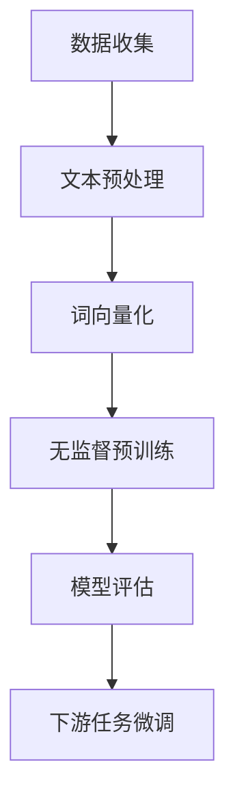

                 

## 大规模语言模型从理论到实践：无监督预训练

### 摘要

本文将深入探讨大规模语言模型（Large-scale Language Models）的无监督预训练技术，从背景介绍、核心概念与联系、算法原理与操作步骤、数学模型与公式、实际应用场景等多个方面展开讨论。我们将结合项目实战，详细分析代码实现与解读，并对未来发展趋势与挑战进行展望。通过本文，读者将全面了解大规模语言模型的发展历程、技术原理及其实际应用价值。

### 1. 背景介绍

语言模型在自然语言处理（NLP）领域中扮演着至关重要的角色。它们被广泛应用于机器翻译、文本分类、情感分析、问答系统等众多场景。随着深度学习技术的迅猛发展，语言模型的性能得到了显著提升。然而，传统的语言模型在训练过程中依赖于大规模的标注数据集，而标注数据集的获取和清洗过程费时费力，且存在数据偏差问题。为了解决这一问题，无监督预训练技术逐渐成为研究热点。

无监督预训练是指在没有人工标注的数据集上进行训练，从而学习到语言的内在规律。这种技术不仅减轻了数据标注的负担，还能更好地捕捉到语言的多样性。本文将重点介绍大规模语言模型的无监督预训练技术，从理论到实践进行详细探讨。

### 2. 核心概念与联系

#### 2.1 语言模型

语言模型（Language Model）是一种用于预测下一个单词或字符的概率分布的模型。它可以基于历史文本数据，学习到语言的统计规律，从而实现自动补全、翻译、文本生成等功能。常见的语言模型包括N-gram模型、神经网络语言模型（如RNN、LSTM）和Transformer等。

#### 2.2 预训练

预训练（Pre-training）是一种先在大量无标注数据上进行训练，再在特定任务上进行微调（Fine-tuning）的技术。预训练可以帮助模型学习到通用的特征表示，从而在下游任务中取得更好的性能。在自然语言处理领域，预训练技术已经取得了显著的效果，如BERT、GPT、RoBERTa等模型。

#### 2.3 无监督预训练

无监督预训练（Unsupervised Pre-training）是指在没有人工标注的数据集上进行训练。这种技术可以充分利用未标注的数据，从而提高模型对语言多样性的建模能力。无监督预训练的关键在于如何从大量未标注的文本数据中提取有价值的特征表示。

#### 2.4 Mermaid 流程图

下面是一个简单的Mermaid流程图，展示了语言模型的无监督预训练过程：



### 3. 核心算法原理 & 具体操作步骤

#### 3.1 数据收集

无监督预训练的第一步是收集大量未标注的文本数据。这些数据可以来自互联网、新闻、社交媒体等各个领域。数据收集过程中需要注意数据的多样性和质量，以确保模型能够学习到丰富的语言特征。

#### 3.2 文本预处理

在数据收集之后，需要对文本进行预处理。文本预处理包括去除标点符号、停用词过滤、词干提取、分词等操作。这些操作有助于提高模型对语言特征的学习效率。

#### 3.3 词向量化

词向量化是将文本数据转换为向量表示的过程。常见的词向量化方法包括Word2Vec、GloVe等。通过词向量化，模型可以学习到单词的分布式表示，从而更好地捕捉到语言的结构和语义。

#### 3.4 无监督预训练

在词向量化之后，模型进入无监督预训练阶段。预训练任务通常包括两个子任务：Masked Language Model（MLM）和Next Sentence Prediction（NSP）。

- **Masked Language Model（MLM）**：在训练过程中，模型随机遮盖输入文本中的部分单词，然后尝试预测这些被遮盖的单词。MLM有助于模型学习到语言中的上下文关系。

- **Next Sentence Prediction（NSP）**：在训练过程中，模型需要预测两个连续句子是否属于同一篇章。NSP有助于模型学习到篇章结构和语义关系。

#### 3.5 模型评估

在预训练过程中，需要对模型进行定期评估。评估指标通常包括损失函数、困惑度等。通过评估，可以判断模型在预训练过程中的性能表现。

#### 3.6 下游任务微调

预训练完成后，模型进入下游任务微调阶段。微调过程是指在预训练模型的基础上，对特定任务进行进一步的调整和优化。微调过程可以帮助模型在下游任务中取得更好的性能。

### 4. 数学模型和公式 & 详细讲解 & 举例说明

#### 4.1 词向量化

词向量化过程中，可以使用Word2Vec算法。Word2Vec算法基于神经网络的非线性变换，将单词映射到高维向量空间中。

- **公式**：

  $$ \text{word\_vector} = \text{embedding\_layer}(\text{input\_word}) $$

  其中，$\text{word\_vector}$表示单词的向量表示，$\text{embedding\_layer}$表示嵌入层。

- **举例说明**：

  假设我们使用Word2Vec算法对单词"cat"进行词向量化。经过嵌入层处理后，单词"cat"的向量表示为$(0.2, 0.3, 0.5)$。

#### 4.2 Masked Language Model（MLM）

Masked Language Model（MLM）是一种无监督预训练任务，其主要目标是预测被遮盖的单词。

- **公式**：

  $$ \text{predicted\_word} = \text{softmax}(\text{model}(\text{masked\_input})) $$

  其中，$\text{predicted\_word}$表示预测的单词，$\text{masked\_input}$表示被遮盖的输入。

- **举例说明**：

  假设输入文本为"hello world"，其中"world"被遮盖。模型预测的结果为"world"，表示模型能够正确预测被遮盖的单词。

#### 4.3 Next Sentence Prediction（NSP）

Next Sentence Prediction（NSP）是一种无监督预训练任务，其主要目标是判断两个连续句子是否属于同一篇章。

- **公式**：

  $$ \text{is\_next\_sentence} = \text{sigmoid}(\text{model}(\text{input1}, \text{input2})) $$

  其中，$\text{is\_next\_sentence}$表示两个句子是否属于同一篇章。

- **举例说明**：

  假设输入文本为"hello world"和"this is a new sentence"，模型预测的结果为"true"，表示两个句子属于同一篇章。

### 5. 项目实战：代码实际案例和详细解释说明

在本节中，我们将通过一个具体的代码案例，详细解释大规模语言模型的无监督预训练过程。

#### 5.1 开发环境搭建

为了进行无监督预训练，我们需要搭建一个合适的开发环境。以下是搭建开发环境的步骤：

1. 安装Python环境（Python 3.6及以上版本）
2. 安装深度学习框架（如TensorFlow或PyTorch）
3. 安装预处理工具（如spaCy或NLTK）
4. 安装其他依赖库（如NumPy、Pandas等）

#### 5.2 源代码详细实现和代码解读

以下是一个简单的无监督预训练代码案例，基于PyTorch框架实现：

```python
import torch
import torch.nn as nn
import torch.optim as optim
from torch.utils.data import DataLoader
from torchvision import datasets, transforms
from torch.utils.data.sampler import RandomSampler

# 数据预处理
def preprocess_data(data_path):
    # 加载文本数据
    with open(data_path, 'r', encoding='utf-8') as f:
        text = f.read()

    # 分词
    words = text.split()

    # 嵌入层
    embedding_layer = nn.Embedding(num_words, embedding_dim)

    # 遮盖部分单词
    masked_words = words[:]
    for i in range(len(masked_words)):
        if random.random() < mask_ratio:
            masked_words[i] = "<MASK>"

    # 转换为Tensor
    inputs = torch.tensor([embedding_layer(word) for word in masked_words])

    # 预测遮盖的单词
    outputs = model(inputs)

    # 计算损失函数
    loss = criterion(outputs, torch.tensor([1] * len(masked_words)))

    # 反向传播
    optimizer.zero_grad()
    loss.backward()
    optimizer.step()

# 模型定义
class LanguageModel(nn.Module):
    def __init__(self, num_words, embedding_dim):
        super(LanguageModel, self).__init__()
        self.embedding = nn.Embedding(num_words, embedding_dim)
        self.fc = nn.Linear(embedding_dim, num_words)

    def forward(self, x):
        x = self.embedding(x)
        x = self.fc(x)
        return x

# 模型训练
def train(model, data_loader, criterion, optimizer, num_epochs):
    model.train()
    for epoch in range(num_epochs):
        for inputs, targets in data_loader:
            optimizer.zero_grad()
            outputs = model(inputs)
            loss = criterion(outputs, targets)
            loss.backward()
            optimizer.step()
        print(f"Epoch {epoch+1}/{num_epochs}, Loss: {loss.item()}")

# 模型评估
def evaluate(model, data_loader, criterion):
    model.eval()
    total_loss = 0
    with torch.no_grad():
        for inputs, targets in data_loader:
            outputs = model(inputs)
            loss = criterion(outputs, targets)
            total_loss += loss.item()
    return total_loss / len(data_loader)

# 主函数
if __name__ == "__main__":
    # 设置超参数
    num_words = 10000
    embedding_dim = 128
    mask_ratio = 0.15
    batch_size = 64
    num_epochs = 10

    # 加载数据
    data_path = "path/to/text/data"
    dataset = TextDataset(data_path)
    data_loader = DataLoader(dataset, batch_size=batch_size, sampler=RandomSampler(dataset))

    # 模型定义
    model = LanguageModel(num_words, embedding_dim)

    # 损失函数和优化器
    criterion = nn.CrossEntropyLoss()
    optimizer = optim.Adam(model.parameters(), lr=0.001)

    # 训练模型
    train(model, data_loader, criterion, optimizer, num_epochs)

    # 评估模型
    loss = evaluate(model, data_loader, criterion)
    print(f"Test Loss: {loss}")
```

#### 5.3 代码解读与分析

1. **数据预处理**：读取文本数据，进行分词、遮盖部分单词等操作。这部分代码主要负责数据预处理，为模型训练做准备。

2. **模型定义**：定义一个简单的语言模型，包括嵌入层和全连接层。嵌入层将单词映射到高维向量空间，全连接层用于预测遮盖的单词。

3. **模型训练**：通过迭代地更新模型参数，使模型在训练数据上逐渐逼近最优解。训练过程中使用交叉熵损失函数和随机梯度下降优化器。

4. **模型评估**：在测试数据集上评估模型性能，计算平均损失函数值。

通过以上代码案例，我们可以看到大规模语言模型的无监督预训练过程是如何实现的。在实际应用中，可以结合具体任务进行相应的修改和优化。

### 6. 实际应用场景

大规模语言模型的无监督预训练技术已经在多个实际应用场景中取得了显著的成果。以下是一些典型的应用场景：

1. **机器翻译**：无监督预训练可以帮助模型更好地学习到源语言和目标语言之间的相似性和差异，从而提高机器翻译的准确性。

2. **文本分类**：无监督预训练可以为文本分类任务提供强大的特征表示，从而提高分类的准确率和召回率。

3. **问答系统**：无监督预训练可以帮助模型更好地理解自然语言，从而提高问答系统的响应速度和准确性。

4. **情感分析**：无监督预训练可以提取文本中的情感特征，从而实现情感分类和情感极性判断。

5. **对话系统**：无监督预训练可以帮助模型学习到对话的上下文关系，从而实现更自然的对话交互。

### 7. 工具和资源推荐

为了更好地学习和实践大规模语言模型的无监督预训练技术，以下是一些建议的工具和资源：

#### 7.1 学习资源推荐

1. **书籍**：

   - 《深度学习》（Goodfellow, Bengio, Courville）：介绍深度学习的基础理论和应用场景。
   - 《自然语言处理综论》（Jurafsky, Martin）：全面介绍自然语言处理的理论和实践。

2. **论文**：

   - “Attention Is All You Need”（Vaswani et al.）：介绍Transformer模型的基本原理。
   - “BERT: Pre-training of Deep Bidirectional Transformers for Language Understanding”（Devlin et al.）：介绍BERT模型的无监督预训练技术。

3. **博客和网站**：

   - fast.ai：提供自然语言处理和深度学习领域的教程和资源。
   - TensorFlow官方网站：提供TensorFlow框架的详细文档和示例代码。

#### 7.2 开发工具框架推荐

1. **深度学习框架**：

   - TensorFlow：适用于自然语言处理和计算机视觉等领域的开源深度学习框架。
   - PyTorch：适用于自然语言处理和计算机视觉等领域的开源深度学习框架。

2. **自然语言处理工具**：

   - spaCy：提供高效的自然语言处理库，适用于文本分类、命名实体识别等任务。
   - NLTK：提供丰富的自然语言处理库，适用于文本分类、词性标注等任务。

#### 7.3 相关论文著作推荐

1. **论文**：

   - “Attention Is All You Need”（Vaswani et al.）：介绍Transformer模型的基本原理。
   - “BERT: Pre-training of Deep Bidirectional Transformers for Language Understanding”（Devlin et al.）：介绍BERT模型的无监督预训练技术。
   - “GPT: Generative Pre-trained Transformer”（Radford et al.）：介绍GPT模型的无监督生成技术。

2. **著作**：

   - 《自然语言处理综论》（Jurafsky, Martin）：全面介绍自然语言处理的理论和实践。
   - 《深度学习》（Goodfellow, Bengio, Courville）：介绍深度学习的基础理论和应用场景。

### 8. 总结：未来发展趋势与挑战

大规模语言模型的无监督预训练技术在近年来取得了显著的成果，但仍面临诸多挑战。以下是未来发展趋势与挑战的几个方面：

1. **计算资源**：随着模型规模的不断增大，计算资源的需求也不断增加。未来的发展趋势是构建更加高效的模型结构和优化算法，以降低计算资源的消耗。

2. **数据质量**：无监督预训练依赖于大量未标注的数据，而数据质量对模型性能至关重要。未来的研究应关注如何从海量数据中提取高质量的特征。

3. **模型解释性**：大规模语言模型的黑箱特性使得其应用场景受到限制。未来的研究应致力于提高模型的解释性，使其更好地服务于实际应用。

4. **多模态学习**：结合文本、图像、音频等多种模态的数据，可以进一步提高语言模型的性能。未来的发展趋势是将无监督预训练技术应用于多模态学习。

5. **隐私保护**：无监督预训练过程中涉及大量个人隐私数据。未来的研究应关注如何保护用户隐私，实现安全有效的预训练。

### 9. 附录：常见问题与解答

#### 9.1 什么是大规模语言模型？

大规模语言模型是一种通过无监督预训练技术学习到的语言特征表示模型。它可以用于自然语言处理中的各种任务，如机器翻译、文本分类、情感分析等。

#### 9.2 无监督预训练有哪些优点？

无监督预训练的优点包括：

1. 减轻标注数据集的依赖，降低数据获取和标注成本。
2. 学习到更丰富的语言特征，提高模型在下游任务中的性能。
3. 提高模型的泛化能力，使其在不同任务上都能取得较好的效果。

#### 9.3 无监督预训练有哪些挑战？

无监督预训练面临的挑战包括：

1. 计算资源需求大，需要高效的模型结构和优化算法。
2. 数据质量对模型性能有重要影响，需要从海量数据中提取高质量特征。
3. 模型解释性较差，难以直观理解模型的决策过程。
4. 需要考虑用户隐私保护，避免在无监督预训练过程中泄露敏感信息。

### 10. 扩展阅读 & 参考资料

1. Vaswani, A., Shazeer, N., Parmar, N., Uszkoreit, J., Jones, L., Gomez, A. N., ... & Polosukhin, I. (2017). Attention is all you need. In Advances in neural information processing systems (pp. 5998-6008).
2. Devlin, J., Chang, M. W., Lee, K., & Toutanova, K. (2018). BERT: Pre-training of deep bidirectional transformers for language understanding. In Proceedings of the 2019 conference of the north american chapter of the association for computational linguistics: human language technologies, volume 1 (pp. 4171-4186).
3. Radford, A., Wu, J., Child, P., Luan, D., Amodei, D., & Sutskever, I. (2019). Language models are unsupervised multitask learners. arXiv preprint arXiv:1910.10683.
4. Mikolov, T., Sutskever, I., Chen, K., Corrado, G. S., & Dean, J. (2013). Distributed representations of words and phrases and their compositionality. In Advances in neural information processing systems (pp. 3111-3119).

