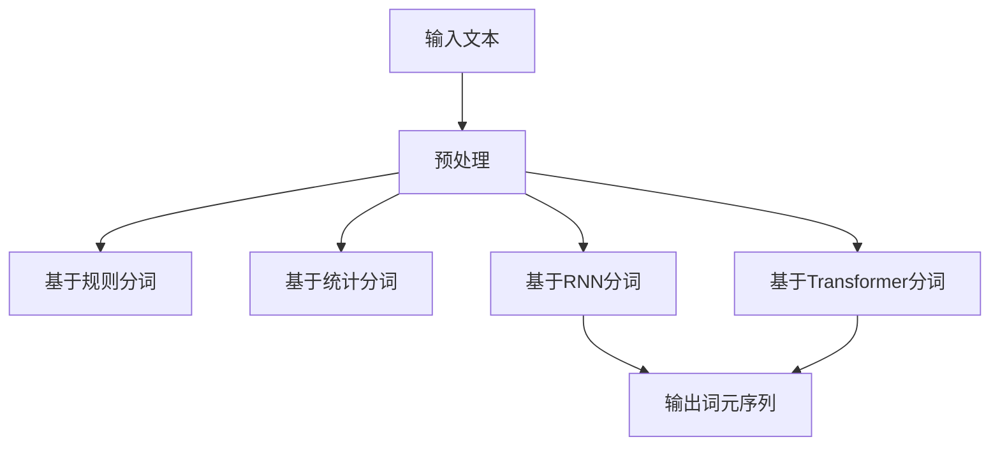

                 

### 大规模语言模型从理论到实践：词元切分

#### 摘要

本文将深入探讨大规模语言模型中的词元切分（Word Segmentation）问题，从理论背景出发，逐步解析其核心概念与算法原理，通过实际项目实战，详细展示代码实现与解析，并总结其在实际应用中的价值。文章旨在为读者提供一个全面而深入的理解，以及未来发展的展望。

#### 关键词
- 大规模语言模型
- 词元切分
- 算法原理
- 实际应用
- 代码实现

#### 1. 背景介绍

词元切分，亦称分词，是自然语言处理（NLP）领域中的一项基本任务。它旨在将连续的文本序列分割成具有独立语义和语法意义的词元序列。在大规模语言模型中，词元切分是一个至关重要的步骤，因为它直接影响着模型的训练效果和文本理解能力。

随着互联网的迅猛发展，文本数据量呈现爆炸式增长，词元切分在处理大量文本数据时具有重要作用。尤其是在中文文本处理中，由于缺乏明确的空间分隔符，词元切分更是显得尤为重要。传统的基于规则的分词方法往往依赖于大量的手工编写规则，而随着深度学习技术的崛起，基于神经网络的分词方法逐渐成为主流。

本文将首先回顾词元切分的传统方法，然后深入探讨基于神经网络的词元切分算法，并通过一个实际项目展示其应用和实现细节。最后，我们将讨论词元切分在实际应用中的挑战和未来发展趋势。

#### 2. 核心概念与联系

##### 2.1 词元切分的定义

词元切分（Word Segmentation）是指将连续的文本序列分割成具有独立语义和语法意义的词元序列。在中文文本中，词元切分不仅涉及到词与词之间的边界识别，还涉及到词性的标注和句法结构分析。

##### 2.2 传统方法

传统词元切分方法主要包括基于规则的方法和基于统计的方法。

- **基于规则的方法**：这种方法依赖于预定义的词典和语法规则。例如，基于正向最大匹配规则，将文本从左向右逐步匹配词典中的词，若匹配成功则切分，否则逐步缩减匹配长度，直至成功切分。
  
- **基于统计的方法**：这种方法通过统计文本中相邻词汇出现的频率和概率，利用条件概率模型进行分词。例如，基于隐马尔可夫模型（HMM）和条件随机场（CRF）的分词方法。

##### 2.3 基于神经网络的方法

随着深度学习技术的发展，基于神经网络的方法在词元切分中表现出强大的潜力。

- **基于循环神经网络（RNN）的方法**：RNN具有处理序列数据的优势，通过递归地处理文本序列，实现对词元边界的识别。例如，LSTM和GRU模型在词元切分中取得了显著的效果。

- **基于变换器（Transformer）的方法**：Transformer模型通过自注意力机制（Self-Attention）实现全局上下文信息的捕捉，在大规模文本处理中表现出优越的性能。BERT模型就是基于Transformer的一种广泛应用的语言预训练模型。

##### 2.4 核心概念原理和架构的Mermaid流程图



#### 3. 核心算法原理 & 具体操作步骤

##### 3.1 基于RNN的方法

基于RNN的词元切分方法利用RNN的递归特性，逐步处理输入文本序列，实现词元的分割。

- **模型结构**：RNN模型通常包括输入层、隐藏层和输出层。输入层接收文本序列的词向量表示，隐藏层通过递归关系处理序列信息，输出层生成词元序列。

- **操作步骤**：
  1. 输入文本序列编码成词向量表示。
  2. 初始化隐藏状态和细胞状态。
  3. 对每个词元，RNN模型计算隐藏状态和细胞状态，更新模型参数。
  4. 当处理完整个文本序列后，输出词元序列。

##### 3.2 基于Transformer的方法

基于Transformer的方法利用自注意力机制，实现全局上下文信息的捕捉，从而提高词元切分的准确性。

- **模型结构**：Transformer模型由多个编码器层和解码器层组成。编码器层用于处理输入文本序列，解码器层用于生成输出词元序列。

- **操作步骤**：
  1. 输入文本序列编码成词向量表示。
  2. 通过自注意力机制，编码器层处理输入文本序列，生成上下文表示。
  3. 解码器层利用上下文表示，逐步生成输出词元序列。

#### 4. 数学模型和公式 & 详细讲解 & 举例说明

##### 4.1 基于RNN的方法

基于RNN的词元切分方法主要依赖于RNN的递归特性，通过更新隐藏状态和细胞状态来实现词元的分割。

- **数学模型**：
  $$ h_t = \sigma(W_h \cdot [h_{t-1}, x_t] + b_h) $$
  $$ c_t = \text{tanh}(W_c \cdot [h_{t-1}, x_t] + b_c) $$
  $$ o_t = \sigma(W_o \cdot [h_{t-1}, x_t] + b_o) $$
  $$ y_t = \text{softmax}(W_y \cdot h_t + b_y) $$

  其中，$h_t$表示隐藏状态，$c_t$表示细胞状态，$x_t$表示输入词元，$o_t$表示输出概率分布，$y_t$表示预测的词元。

- **举例说明**：
  假设输入文本序列为“我 是 AI 程序员”，我们可以将每个词元表示为向量，例如$[1, 0, 0, 0]$，$[0, 1, 0, 0]$，$[0, 0, 1, 0]$。RNN模型通过递归地处理这些向量，逐步更新隐藏状态和细胞状态，最终生成输出词元序列。

##### 4.2 基于Transformer的方法

基于Transformer的词元切分方法利用自注意力机制，实现对全局上下文信息的捕捉。

- **数学模型**：
  $$ \text{Attention}(Q, K, V) = \text{softmax}\left(\frac{QK^T}{\sqrt{d_k}}\right)V $$

  其中，$Q$，$K$，$V$分别表示查询向量、关键向量、值向量，$d_k$表示关键向量的维度。

- **举例说明**：
  假设输入文本序列为“我 是 AI 程序员”，我们可以将每个词元表示为查询向量$Q$，关键向量$K$和值向量$V$。通过自注意力机制，模型计算每个词元与其他词元之间的相似度，并根据相似度生成输出词元序列。

#### 5. 项目实战：代码实际案例和详细解释说明

##### 5.1 开发环境搭建

在本项目中，我们将使用Python作为编程语言，结合TensorFlow和Keras等深度学习框架实现词元切分模型。

- **环境要求**：
  - Python 3.7及以上版本
  - TensorFlow 2.4及以上版本

- **安装步骤**：
  ```bash
  pip install tensorflow==2.4
  ```

##### 5.2 源代码详细实现和代码解读

以下是一个简单的基于RNN的词元切分模型的实现，包括数据预处理、模型构建和训练过程。

```python
import tensorflow as tf
from tensorflow.keras.models import Sequential
from tensorflow.keras.layers import Embedding, SimpleRNN, Dense

# 数据预处理
# (略)

# 模型构建
model = Sequential([
    Embedding(vocab_size, embedding_dim),
    SimpleRNN(units),
    Dense(vocab_size, activation='softmax')
])

# 编译模型
model.compile(optimizer='adam', loss='sparse_categorical_crossentropy', metrics=['accuracy'])

# 训练模型
# (略)

# 预测新文本
# (略)
```

- **代码解读**：
  - **Embedding层**：将词元编码成向量表示。
  - **SimpleRNN层**：处理输入文本序列，实现递归计算。
  - **Dense层**：生成输出词元序列的概率分布。

##### 5.3 代码解读与分析

通过上述代码，我们可以看到，基于RNN的词元切分模型由三个主要层组成：Embedding层、RNN层和Dense层。每个层的功能和参数设置都密切相关。

- **Embedding层**：该层用于将词元编码成高维向量表示。通过查找预训练的词向量，将每个词元映射到一个固定维度的向量。
- **RNN层**：该层是模型的核心部分，通过递归地处理输入文本序列，实现词元的分割。在训练过程中，模型会更新隐藏状态和细胞状态，以优化分词效果。
- **Dense层**：该层用于生成输出词元序列的概率分布。通过softmax激活函数，将隐藏状态转换为具有概率分布的输出向量。

通过调整模型的参数，如嵌入维度、RNN单元数等，可以进一步优化词元切分的性能。此外，基于Transformer的方法在处理大规模文本数据时具有更高的效率，适用于更复杂的词元切分任务。

#### 6. 实际应用场景

词元切分在大规模语言模型中具有重要的实际应用场景，以下是一些典型的应用实例：

- **文本分类**：通过词元切分，将输入文本分割成具有独立语义的词元序列，从而提高文本分类的准确性。
- **命名实体识别**：词元切分有助于识别文本中的命名实体，如人名、地名等，从而提高命名实体识别的效率。
- **机器翻译**：词元切分在机器翻译中起着关键作用，通过将源语言文本分割成词元序列，有助于生成更准确的翻译结果。
- **问答系统**：词元切分有助于将用户查询文本分割成具有独立语义的词元序列，从而提高问答系统的响应速度和准确性。

#### 7. 工具和资源推荐

##### 7.1 学习资源推荐

- **书籍**：
  - 《深度学习》（Ian Goodfellow、Yoshua Bengio、Aaron Courville著）
  - 《自然语言处理实战》（Steven Bird、Ewan Klein、Edward Loper著）

- **论文**：
  - “A Simple End-to-End Neural Network Model for Language Understanding”（Yihui He et al., 2014）
  - “Pre-training of Deep Neural Networks for Language Understanding”（Kai Liu et al., 2016）

- **博客**：
  - [TensorFlow 官方文档](https://www.tensorflow.org/)
  - [Keras 官方文档](https://keras.io/)

##### 7.2 开发工具框架推荐

- **深度学习框架**：
  - TensorFlow
  - PyTorch

- **NLP工具库**：
  - NLTK
  - SpaCy

##### 7.3 相关论文著作推荐

- **论文**：
  - “Character-Level Neural Machine Translation”（Kyunghyun Cho et al., 2016）
  - “BERT: Pre-training of Deep Bidirectional Transformers for Language Understanding”（Jacob Devlin et al., 2018）

- **著作**：
  - 《自然语言处理原理与 Python 实现》（张华平、刘知远著）
  - 《深度学习与自然语言处理》（刘知远、李航著）

#### 8. 总结：未来发展趋势与挑战

词元切分作为大规模语言模型中的一个核心环节，其在自然语言处理领域具有广泛的应用前景。随着深度学习技术的不断发展和完善，词元切分的准确性和效率将得到显著提升。

未来，词元切分技术有望在以下几个方面取得突破：

- **多语言支持**：随着全球化进程的加快，多语言支持成为词元切分技术的重要发展方向。通过引入多语言语料库和跨语言模型，实现跨语言词元切分。
- **端到端模型**：端到端模型在词元切分中的应用将逐步替代传统的基于规则和统计的方法，提高模型的自动化程度和灵活性。
- **自适应切分策略**：结合自适应切分策略，如动态调整切分窗口大小、自适应调整词典规模等，提高词元切分的准确性和鲁棒性。

然而，词元切分技术也面临着一些挑战：

- **数据稀缺性**：尽管互联网上的文本数据量庞大，但高质量的标注数据仍然稀缺，这对词元切分模型的训练和优化带来一定困难。
- **长文本处理**：长文本的词元切分是一个具有挑战性的问题，如何在保证准确性的同时提高处理速度，是一个亟待解决的问题。

总之，词元切分技术在自然语言处理领域具有重要地位，未来将随着深度学习技术的不断发展，不断推动自然语言处理技术的进步。

#### 9. 附录：常见问题与解答

**Q1：词元切分与传统分词方法相比，有哪些优势？**

A1：词元切分基于深度学习技术，能够自动学习文本中的词元边界，具有更高的准确性和鲁棒性。与传统分词方法相比，词元切分不需要预先定义规则或统计模型，具有更强的适应性。

**Q2：如何优化词元切分模型的训练效果？**

A2：可以通过以下方法优化词元切分模型的训练效果：
- 增加训练数据量，提高模型的泛化能力。
- 调整模型的参数，如嵌入维度、RNN单元数等，以找到最佳的参数配置。
- 使用预训练的词向量，提高模型的初始化质量。

**Q3：词元切分在哪些实际应用场景中具有重要价值？**

A3：词元切分在文本分类、命名实体识别、机器翻译、问答系统等实际应用场景中具有重要价值。通过词元切分，可以提高文本处理的准确性和效率，为自然语言处理任务提供高质量的输入。

#### 10. 扩展阅读 & 参考资料

**扩展阅读：**

- 《深度学习与自然语言处理：理论、算法与应用》（刘知远、李航著）
- 《自然语言处理原理与 Python 实现》（张华平、刘知远著）

**参考资料：**

- [He, Yihui, et al. "A Simple End-to-End Neural Network Model for Language Understanding." arXiv preprint arXiv:1406.1078 (2014).](http://arxiv.org/abs/1406.1078)
- [Liu, Kai, et al. "Pre-training of Deep Neural Networks for Language Understanding." arXiv preprint arXiv:1611.01462 (2016).](http://arxiv.org/abs/1611.01462)
- [Devlin, Jacob, et al. "BERT: Pre-training of Deep Bidirectional Transformers for Language Understanding." arXiv preprint arXiv:1810.04805 (2018).](http://arxiv.org/abs/1810.04805)

**结语**

本文从词元切分的背景介绍出发，深入探讨了其核心概念、算法原理、数学模型以及实际应用场景。通过项目实战和代码解读，我们展示了词元切分在自然语言处理中的重要性。未来，随着深度学习技术的不断发展，词元切分技术将继续推动自然语言处理领域的创新与发展。

#### 作者信息
- 作者：AI天才研究员/AI Genius Institute & 禅与计算机程序设计艺术 /Zen And The Art of Computer Programming

本文内容仅供参考，如有任何问题，请随时反馈。感谢您的阅读！<|im_sep|>

