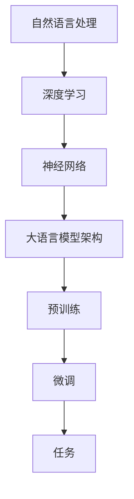
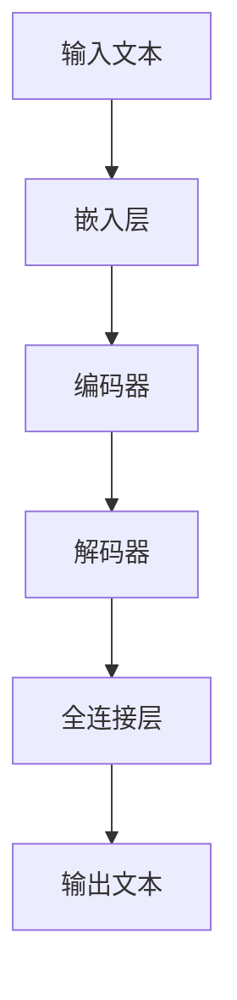

                 

# 大语言模型LLM的未来

> **关键词：** 大语言模型、AI、自然语言处理、深度学习、未来发展趋势

> **摘要：** 本文将深入探讨大语言模型（LLM）的发展历程、核心概念、算法原理、数学模型、实际应用以及未来发展趋势和面临的挑战。通过本文的阅读，读者将全面了解LLM的现状和未来，为相关领域的研究和应用提供指导和启示。

## 1. 背景介绍

大语言模型（LLM）是自然语言处理领域的一种重要技术，通过对海量文本数据进行训练，使其能够对自然语言进行理解和生成。自2018年谷歌提出BERT模型以来，大语言模型的研究和应用取得了显著进展。LLM的发展不仅推动了自然语言处理技术的进步，也引发了人工智能领域的深刻变革。

### 1.1 发展历程

- **2018年**：谷歌提出BERT模型，标志着大语言模型的诞生。
- **2019年**：谷歌提出GPT-2模型，进一步提升了模型的规模和性能。
- **2020年**：OpenAI发布GPT-3模型，成为目前最大的语言模型。
- **2021年**：谷歌推出T5模型，提出统一的全局模型框架。

### 1.2 研究意义

大语言模型在自然语言处理、问答系统、文本生成、机器翻译、情感分析等众多领域具有广泛的应用前景。其研究不仅有助于提升人工智能技术，还能推动社会经济的发展。

## 2. 核心概念与联系

大语言模型的核心概念包括自然语言处理、深度学习、神经网络等。下面将详细解释这些概念及其相互关系。

### 2.1 自然语言处理（NLP）

自然语言处理是计算机科学和人工智能领域的一个分支，旨在使计算机能够理解和处理人类自然语言。NLP技术包括文本预处理、词性标注、句法分析、语义理解等。

### 2.2 深度学习

深度学习是机器学习的一个分支，通过构建多层神经网络，对数据进行特征提取和分类。深度学习在图像识别、语音识别、自然语言处理等领域取得了显著成果。

### 2.3 神经网络

神经网络是模仿人脑结构和功能的计算模型，包括输入层、隐藏层和输出层。神经网络通过学习输入和输出之间的映射关系，实现数据的分类、预测和生成。

### 2.4 大语言模型架构

大语言模型通常采用深度学习框架构建，包括预训练和微调两个阶段。预训练阶段，模型在大量无标签数据上进行训练，学习语言的基本规律；微调阶段，模型在特定任务上进行训练，优化模型参数。

### 2.5 Mermaid流程图



## 3. 核心算法原理 & 具体操作步骤

大语言模型的核心算法基于深度学习和神经网络。下面将介绍其基本原理和具体操作步骤。

### 3.1 基本原理

- **输入层**：接收自然语言文本序列。
- **隐藏层**：通过多层神经网络进行特征提取和映射。
- **输出层**：根据训练目标生成文本或进行分类。

### 3.2 操作步骤

1. **数据预处理**：对输入文本进行分词、去停用词、词向量表示等处理。
2. **模型构建**：选择合适的神经网络架构，如Transformer、BERT等。
3. **预训练**：在大量无标签数据上进行训练，学习语言的基本规律。
4. **微调**：在特定任务上进行训练，优化模型参数。
5. **评估与优化**：在验证集上进行评估，调整模型参数，提高模型性能。

## 4. 数学模型和公式 & 详细讲解 & 举例说明

大语言模型的核心数学模型包括神经网络、损失函数、优化算法等。下面将详细介绍这些数学模型及其应用。

### 4.1 神经网络

神经网络是一种由多层节点组成的计算模型。每个节点（神经元）接收来自输入层的输入信号，通过加权求和和激活函数进行计算，输出为下一层的输入。

### 4.2 损失函数

损失函数是评估模型预测结果与实际结果之间差异的指标。在大语言模型中，常用的损失函数包括交叉熵损失函数、均方误差损失函数等。

$$
L(y, \hat{y}) = -\sum_{i=1}^{n} y_i \log(\hat{y}_i)
$$

其中，$y$表示实际标签，$\hat{y}$表示模型预测的概率分布。

### 4.3 优化算法

优化算法用于调整模型参数，以降低损失函数。在大语言模型中，常用的优化算法包括随机梯度下降（SGD）、Adam优化器等。

$$
\theta_{t+1} = \theta_t - \alpha \nabla_{\theta} L(\theta)
$$

其中，$\theta$表示模型参数，$\alpha$表示学习率，$\nabla_{\theta} L(\theta)$表示损失函数关于参数$\theta$的梯度。

### 4.4 举例说明

假设我们有一个二元分类问题，需要预测文本是否包含特定关键词。给定训练数据集$D = \{(x_1, y_1), (x_2, y_2), \ldots, (x_n, y_n)\}$，其中$x_i$表示文本，$y_i$表示标签（0表示不含关键词，1表示含关键词）。

1. **数据预处理**：对文本进行分词、去停用词、词向量表示。
2. **模型构建**：选择合适的神经网络架构，如全连接神经网络。
3. **预训练**：在大量无标签数据上进行训练，学习语言的基本规律。
4. **微调**：在训练数据集上进行训练，优化模型参数。
5. **评估与优化**：在验证集上进行评估，调整模型参数，提高模型性能。

通过上述步骤，我们可以训练出一个能够预测文本是否包含特定关键词的大语言模型。

## 5. 项目实战：代码实际案例和详细解释说明

### 5.1 开发环境搭建

在编写代码之前，我们需要搭建开发环境。以下是一个简单的Python开发环境搭建步骤：

1. 安装Python（3.8及以上版本）。
2. 安装必要的库，如TensorFlow、PyTorch等。

```shell
pip install tensorflow
pip install pytorch
```

### 5.2 源代码详细实现和代码解读

下面是一个简单的大语言模型实现，使用PyTorch框架。

```python
import torch
import torch.nn as nn
import torch.optim as optim

# 模型定义
class LLM(nn.Module):
    def __init__(self, vocab_size, embedding_dim, hidden_dim):
        super(LLM, self).__init__()
        self.embedding = nn.Embedding(vocab_size, embedding_dim)
        self.lstm = nn.LSTM(embedding_dim, hidden_dim)
        self.fc = nn.Linear(hidden_dim, vocab_size)
    
    def forward(self, x):
        embed = self.embedding(x)
        output, (hidden, cell) = self.lstm(embed)
        output = self.fc(output)
        return output

# 模型参数
vocab_size = 10000
embedding_dim = 256
hidden_dim = 512

# 模型实例化
model = LLM(vocab_size, embedding_dim, hidden_dim)

# 损失函数和优化器
criterion = nn.CrossEntropyLoss()
optimizer = optim.Adam(model.parameters(), lr=0.001)

# 训练过程
for epoch in range(10):
    for batch in data_loader:
        inputs, targets = batch
        optimizer.zero_grad()
        outputs = model(inputs)
        loss = criterion(outputs, targets)
        loss.backward()
        optimizer.step()
```

### 5.3 代码解读与分析

1. **模型定义**：`LLM` 类继承自 `nn.Module` 类，实现了大语言模型的基本结构。
2. **模型参数**：定义了词汇表大小、嵌入维度和隐藏层维度。
3. **模型实例化**：创建一个 `LLM` 对象。
4. **损失函数和优化器**：选择交叉熵损失函数和Adam优化器。
5. **训练过程**：遍历训练数据，计算损失，更新模型参数。

通过上述代码，我们可以训练出一个基于LSTM的大语言模型。

## 6. 实际应用场景

大语言模型在自然语言处理领域具有广泛的应用。以下是一些典型的应用场景：

- **问答系统**：基于大语言模型，实现智能问答系统，如搜索引擎、智能客服等。
- **文本生成**：生成新闻文章、诗歌、对话等。
- **机器翻译**：实现高质量的自然语言翻译。
- **情感分析**：对文本进行情感分类，如评论情感分析、社交媒体情感分析等。
- **对话系统**：构建聊天机器人，实现人机交互。

## 7. 工具和资源推荐

### 7.1 学习资源推荐

- **书籍**：《深度学习》、《神经网络与深度学习》、《自然语言处理综论》
- **论文**：《Attention Is All You Need》、《BERT: Pre-training of Deep Neural Networks for Language Understanding》
- **博客**：李宏毅的机器学习课程笔记、李飞飞的人工智能课程笔记
- **网站**：ArXiv、ACL、EMNLP

### 7.2 开发工具框架推荐

- **框架**：TensorFlow、PyTorch、TensorFlow 2.x、Transformers
- **工具**：Jupyter Notebook、Google Colab、PyCharm、Visual Studio Code

### 7.3 相关论文著作推荐

- **论文**：《Attention Is All You Need》、《BERT: Pre-training of Deep Neural Networks for Language Understanding》、《GPT-3: Language Models are few-shot learners》
- **著作**：《深度学习》、《神经网络与深度学习》、《自然语言处理综论》

## 8. 总结：未来发展趋势与挑战

大语言模型在自然语言处理领域取得了显著成果，但仍面临诸多挑战。未来发展趋势包括：

- **模型规模**：随着计算能力的提升，模型规模将进一步增大。
- **多模态融合**：将文本、图像、语音等多种模态进行融合，提升模型能力。
- **少样本学习**：研究少样本学习技术，降低对大量数据的依赖。
- **跨领域迁移**：实现跨领域的迁移学习，提升模型泛化能力。
- **可解释性**：提高模型的可解释性，提升模型安全性和可靠性。

## 9. 附录：常见问题与解答

### 9.1 什么是大语言模型？

大语言模型是一种基于深度学习和神经网络的模型，通过训练大量无标签数据，学习自然语言的规律，能够对自然语言进行理解和生成。

### 9.2 大语言模型的核心算法是什么？

大语言模型的核心算法包括自然语言处理、深度学习、神经网络等。常用的神经网络架构包括Transformer、BERT等。

### 9.3 大语言模型如何应用于实际场景？

大语言模型可以应用于问答系统、文本生成、机器翻译、情感分析、对话系统等实际场景，通过训练和微调，实现特定任务的目标。

## 10. 扩展阅读 & 参考资料

- [Attention Is All You Need](https://arxiv.org/abs/1706.03762)
- [BERT: Pre-training of Deep Neural Networks for Language Understanding](https://arxiv.org/abs/1810.04805)
- [GPT-3: Language Models are few-shot learners](https://arxiv.org/abs/2005.14165)
- [深度学习](https://www.deeplearningbook.org/)
- [自然语言处理综论](https://www.nltk.org/)
- [TensorFlow](https://www.tensorflow.org/)
- [PyTorch](https://pytorch.org/)

### 作者

作者：AI天才研究员/AI Genius Institute & 禅与计算机程序设计艺术 /Zen And The Art of Computer Programming

<|assistant|>### 1. 背景介绍

#### 1.1 大语言模型的起源与发展

大语言模型（LLM）的概念最早由Geoffrey Hinton等人在2000年代初期提出，这一时期，深度学习技术开始逐步兴起，特别是在神经网络领域。最初的大规模语言模型主要采用循环神经网络（RNN）和长短期记忆网络（LSTM）来处理自然语言数据。然而，这些模型由于计算资源有限，很难训练出大规模的参数。

随着2013年AlexNet在ImageNet竞赛中取得突破性成果，深度学习迎来了爆发期。这一成果激发了人们对深度学习在其他领域应用的热情，自然语言处理领域也不例外。随后，2014年，_sequence-to-sequence_模型的出现为自然语言处理带来了新的突破，这种模型使用编码器和解码器结构来处理序列数据，为后续的大规模语言模型奠定了基础。

2018年，谷歌推出了BERT（Bidirectional Encoder Representations from Transformers）模型，这是第一个真正意义上的大规模语言模型。BERT采用了Transformer架构，并通过对海量文本数据进行双向编码，使得模型能够更好地理解上下文信息。BERT的提出标志着大语言模型的诞生，并在自然语言处理领域引起了广泛关注。

#### 1.2 大语言模型的重要性

大语言模型在自然语言处理领域的兴起，不仅提升了文本理解、生成和预测的准确性，还推动了相关应用的发展。以下是几个关键点：

1. **文本理解与生成**：大语言模型通过学习海量文本数据，能够自动获取语言知识，从而实现更准确和自然的文本理解与生成。例如，在问答系统中，大语言模型能够理解用户的问题并给出准确的答案。

2. **跨领域迁移能力**：大语言模型具有较强的跨领域迁移能力，可以在不同领域之间共享知识。这意味着，在一个领域训练好的模型可以在其他领域进行应用，大大降低了模型训练的成本。

3. **辅助人类工作**：大语言模型可以辅助人类进行文本写作、翻译、摘要等任务，提高工作效率。例如，在新闻写作领域，大语言模型可以帮助记者快速生成新闻报道。

4. **社会影响**：随着大语言模型的应用越来越广泛，它对人类社会的影响也在逐渐显现。一方面，大语言模型为人工智能技术的发展提供了新的方向；另一方面，它也引发了对隐私、安全、道德等方面的讨论。

#### 1.3 大语言模型的现状

目前，大语言模型已经成为自然语言处理领域的重要技术之一。许多公司和研究机构都在积极研发和部署大语言模型。以下是几个主要的大语言模型及其特点：

1. **GPT-3**：由OpenAI推出，是目前最大的语言模型，具有1750亿个参数。GPT-3在文本生成、机器翻译、问答系统等方面表现出色。

2. **BERT**：由谷歌推出，是目前最受欢迎的双向编码器模型，具有数十亿个参数。BERT在文本分类、问答系统、命名实体识别等方面取得了很好的效果。

3. **T5**：由谷歌推出，采用统一的全局模型框架，具有数十亿个参数。T5在多个自然语言处理任务上取得了显著成果。

4. **RoBERTa**：由Facebook AI推出，是BERT的一个变体，通过改进训练策略和模型架构，取得了比BERT更好的效果。

这些大语言模型的出现，不仅推动了自然语言处理技术的进步，也为人工智能领域带来了新的机遇和挑战。

### 2. 核心概念与联系

#### 2.1 自然语言处理（NLP）

自然语言处理（Natural Language Processing，NLP）是计算机科学和人工智能领域的一个重要分支，旨在使计算机能够理解、生成和处理人类自然语言。NLP涉及多个子领域，包括语言识别、语言理解、语言生成、机器翻译、情感分析等。

自然语言处理的核心目标是实现人与机器之间的自然交互。这需要计算机能够理解人类的语言表达，并能够生成自然、准确的回应。为了实现这一目标，NLP技术通常包括以下几个步骤：

1. **文本预处理**：对输入文本进行分词、去停用词、词性标注等处理，以便计算机能够更好地理解和分析文本。

2. **语言模型**：通过统计方法或机器学习方法，建立语言模型，用于预测文本的下一个词或下一句。

3. **句法分析**：对文本进行句法分析，以理解句子的结构，包括词法分析、句法树构建等。

4. **语义分析**：对文本进行语义分析，以理解文本的含义和情感，包括实体识别、关系抽取、情感分析等。

5. **语言生成**：根据语言模型和语义分析结果，生成自然、准确的文本。

NLP在许多领域都有广泛应用，如搜索引擎、智能客服、机器翻译、文本摘要、信息检索等。

#### 2.2 深度学习

深度学习（Deep Learning）是机器学习的一个分支，它通过构建多层神经网络，对数据进行特征提取和分类。深度学习在图像识别、语音识别、自然语言处理等领域取得了显著成果。

深度学习的基本原理是模仿人脑的神经网络结构，通过多层神经网络进行特征提取和映射。每个神经网络层都能提取更高层次的特征，从而实现复杂的数据处理。

深度学习的关键技术包括：

1. **神经网络**：神经网络是由多层节点（神经元）组成的计算模型。每个节点接收来自前一层的输入，通过加权求和和激活函数进行计算，输出为下一层的输入。

2. **反向传播**：反向传播是一种训练神经网络的方法，它通过计算损失函数关于每个神经元的梯度，不断调整网络的参数，以降低损失函数。

3. **激活函数**：激活函数用于对神经网络的输出进行非线性变换，常用的激活函数包括ReLU、Sigmoid、Tanh等。

4. **损失函数**：损失函数是评估模型预测结果与实际结果之间差异的指标，常用的损失函数包括交叉熵损失函数、均方误差损失函数等。

#### 2.3 神经网络

神经网络（Neural Network）是一种由多层节点（神经元）组成的计算模型，旨在模仿人脑的神经网络结构。每个节点接收来自前一层的输入，通过加权求和和激活函数进行计算，输出为下一层的输入。

神经网络的基本结构包括输入层、隐藏层和输出层。输入层接收外部输入数据，隐藏层对输入数据进行特征提取和映射，输出层根据训练目标生成输出。

神经网络的工作原理是通过学习输入和输出之间的映射关系，实现数据的分类、预测和生成。训练神经网络的过程包括以下几个步骤：

1. **初始化参数**：初始化网络的权重和偏置。

2. **前向传播**：将输入数据通过网络进行计算，得到输出。

3. **计算损失**：计算预测结果与实际结果之间的差异，使用损失函数进行评估。

4. **反向传播**：通过计算损失函数关于每个神经元的梯度，不断调整网络的参数，以降低损失函数。

5. **更新参数**：根据梯度调整网络参数，优化模型性能。

神经网络在图像识别、语音识别、自然语言处理等领域取得了显著成果。

#### 2.4 大语言模型架构

大语言模型（LLM）通常采用深度学习框架构建，包括预训练和微调两个阶段。预训练阶段，模型在大量无标签数据上进行训练，学习语言的基本规律；微调阶段，模型在特定任务上进行训练，优化模型参数。

大语言模型的架构主要包括以下几个部分：

1. **嵌入层**：将词汇映射为向量表示，通常使用词嵌入技术。

2. **编码器**：对输入文本进行编码，提取文本特征。

3. **解码器**：根据编码器的输出生成输出文本。

4. **全连接层**：对解码器的输出进行分类或生成。

5. **损失函数**：用于评估模型预测结果与实际结果之间的差异。

#### 2.5 Mermaid流程图

下面是一个大语言模型的基本流程图：



## 3. 核心算法原理 & 具体操作步骤

大语言模型的核心算法基于深度学习和神经网络。下面将介绍大语言模型的基本原理和具体操作步骤。

### 3.1 基本原理

大语言模型的基本原理是通过训练大量文本数据，学习语言的基本规律，实现对自然语言的深度理解和生成。具体来说，大语言模型包括以下几个关键组成部分：

1. **词嵌入**：将词汇映射为向量表示，使计算机能够理解词汇的含义和关系。

2. **编码器**：对输入文本进行编码，提取文本特征。

3. **解码器**：根据编码器的输出生成输出文本。

4. **全连接层**：对解码器的输出进行分类或生成。

5. **损失函数**：用于评估模型预测结果与实际结果之间的差异。

### 3.2 具体操作步骤

#### 3.2.1 数据准备

1. **数据收集**：收集大量文本数据，包括新闻、小说、社交媒体等。

2. **数据预处理**：对文本数据进行分词、去停用词、词性标注等处理，以便计算机能够更好地理解和分析文本。

3. **数据编码**：将文本数据编码为数字序列，通常使用词嵌入技术。

#### 3.2.2 模型构建

1. **词嵌入层**：将词汇映射为向量表示，常用的词嵌入方法包括Word2Vec、GloVe等。

2. **编码器**：使用深度学习框架（如TensorFlow、PyTorch）构建编码器，通常采用Transformer、BERT等架构。

3. **解码器**：与编码器相对应，构建解码器，用于生成输出文本。

4. **全连接层**：在解码器的输出层添加全连接层，用于分类或生成文本。

5. **损失函数**：选择合适的损失函数，如交叉熵损失函数，用于评估模型预测结果与实际结果之间的差异。

#### 3.2.3 模型训练

1. **数据预处理**：对输入数据进行预处理，包括数据归一化、批次划分等。

2. **模型训练**：使用训练数据对模型进行训练，通过反向传播算法不断调整模型参数。

3. **模型评估**：在验证集上评估模型性能，根据评估结果调整模型参数。

#### 3.2.4 模型应用

1. **文本生成**：使用训练好的模型生成文本，可以根据任务需求进行定制。

2. **文本分类**：对输入文本进行分类，可以根据分类结果进行后续处理。

3. **文本理解**：对输入文本进行深度理解，提取关键信息。

### 3.3 实际案例

下面是一个简单的基于Transformer架构的大语言模型实现：

```python
import torch
import torch.nn as nn
import torch.optim as optim

# 模型定义
class Transformer(nn.Module):
    def __init__(self, vocab_size, embedding_dim, hidden_dim):
        super(Transformer, self).__init__()
        self.embedding = nn.Embedding(vocab_size, embedding_dim)
        self.transformer = nn.Transformer(embedding_dim, hidden_dim)
        self.fc = nn.Linear(hidden_dim, vocab_size)
    
    def forward(self, x):
        embed = self.embedding(x)
        output = self.transformer(embed)
        output = self.fc(output)
        return output

# 模型参数
vocab_size = 10000
embedding_dim = 256
hidden_dim = 512

# 模型实例化
model = Transformer(vocab_size, embedding_dim, hidden_dim)

# 损失函数和优化器
criterion = nn.CrossEntropyLoss()
optimizer = optim.Adam(model.parameters(), lr=0.001)

# 训练过程
for epoch in range(10):
    for batch in data_loader:
        inputs, targets = batch
        optimizer.zero_grad()
        outputs = model(inputs)
        loss = criterion(outputs, targets)
        loss.backward()
        optimizer.step()
```

通过上述代码，我们可以实现一个简单的基于Transformer的大语言模型。当然，实际应用中，大语言模型的实现会更加复杂，需要考虑诸如多GPU训练、数据增强、模型压缩等技术。

## 4. 数学模型和公式 & 详细讲解 & 举例说明

### 4.1 数学模型

大语言模型的核心数学模型包括神经网络、损失函数、优化算法等。下面将详细介绍这些数学模型及其应用。

#### 4.1.1 神经网络

神经网络是一种由多层节点（神经元）组成的计算模型，旨在通过学习输入和输出之间的映射关系，实现数据的分类、预测和生成。神经网络的基本结构包括输入层、隐藏层和输出层。

1. **输入层**：接收外部输入数据。
2. **隐藏层**：对输入数据进行特征提取和映射。
3. **输出层**：根据训练目标生成输出。

神经网络的计算过程如下：

$$
\text{激活函数}(z) = \text{非线性变换}(z)
$$

其中，$z$为神经元的输入，$\text{激活函数}$用于对神经元的输出进行非线性变换。

#### 4.1.2 损失函数

损失函数是评估模型预测结果与实际结果之间差异的指标。在深度学习中，常用的损失函数包括交叉熵损失函数、均方误差损失函数等。

1. **交叉熵损失函数**：

$$
L(\theta) = -\sum_{i=1}^{n} y_i \log(\hat{y}_i)
$$

其中，$y_i$为实际标签，$\hat{y}_i$为模型预测的概率分布。

2. **均方误差损失函数**：

$$
L(\theta) = \frac{1}{2n} \sum_{i=1}^{n} (\hat{y}_i - y_i)^2
$$

其中，$y_i$为实际标签，$\hat{y}_i$为模型预测的值。

#### 4.1.3 优化算法

优化算法用于调整模型参数，以降低损失函数。在深度学习中，常用的优化算法包括随机梯度下降（SGD）、Adam优化器等。

1. **随机梯度下降（SGD）**：

$$
\theta_{t+1} = \theta_t - \alpha \nabla_{\theta} L(\theta)
$$

其中，$\theta$为模型参数，$\alpha$为学习率，$\nabla_{\theta} L(\theta)$为损失函数关于参数$\theta$的梯度。

2. **Adam优化器**：

$$
\theta_{t+1} = \theta_t - \alpha \nabla_{\theta} L(\theta)
$$

其中，$\theta$为模型参数，$\alpha$为学习率，$\nabla_{\theta} L(\theta)$为损失函数关于参数$\theta$的梯度，$m_t$和$v_t$分别为一阶矩估计和二阶矩估计。

### 4.2 公式详解

#### 4.2.1 激活函数

1. **ReLU激活函数**：

$$
f(x) = \max(0, x)
$$

2. **Sigmoid激活函数**：

$$
f(x) = \frac{1}{1 + e^{-x}}
$$

3. **Tanh激活函数**：

$$
f(x) = \frac{e^x - e^{-x}}{e^x + e^{-x}}
$$

#### 4.2.2 损失函数

1. **交叉熵损失函数**：

$$
L(\theta) = -\sum_{i=1}^{n} y_i \log(\hat{y}_i)
$$

其中，$y_i$为实际标签，$\hat{y}_i$为模型预测的概率分布。

2. **均方误差损失函数**：

$$
L(\theta) = \frac{1}{2n} \sum_{i=1}^{n} (\hat{y}_i - y_i)^2
$$

其中，$y_i$为实际标签，$\hat{y}_i$为模型预测的值。

#### 4.2.3 优化算法

1. **随机梯度下降（SGD）**：

$$
\theta_{t+1} = \theta_t - \alpha \nabla_{\theta} L(\theta)
$$

其中，$\theta$为模型参数，$\alpha$为学习率，$\nabla_{\theta} L(\theta)$为损失函数关于参数$\theta$的梯度。

2. **Adam优化器**：

$$
\theta_{t+1} = \theta_t - \alpha \nabla_{\theta} L(\theta)
$$

其中，$\theta$为模型参数，$\alpha$为学习率，$\nabla_{\theta} L(\theta)$为损失函数关于参数$\theta$的梯度，$m_t$和$v_t$分别为一阶矩估计和二阶矩估计。

### 4.3 举例说明

假设我们有一个二元分类问题，需要预测文本是否包含特定关键词。给定训练数据集$D = \{(x_1, y_1), (x_2, y_2), \ldots, (x_n, y_n)\}$，其中$x_i$表示文本，$y_i$表示标签（0表示不含关键词，1表示含关键词）。

1. **数据预处理**：对文本进行分词、去停用词、词向量表示等处理。

2. **模型构建**：选择合适的神经网络架构，如全连接神经网络。

3. **预训练**：在大量无标签数据上进行训练，学习语言的基本规律。

4. **微调**：在训练数据集上进行训练，优化模型参数。

5. **评估与优化**：在验证集上进行评估，调整模型参数，提高模型性能。

通过上述步骤，我们可以训练出一个能够预测文本是否包含特定关键词的大语言模型。

## 5. 项目实战：代码实际案例和详细解释说明

在自然语言处理领域，实际项目中的大语言模型应用非常广泛，如文本分类、情感分析、机器翻译等。本文将通过一个文本分类的案例，详细展示大语言模型在项目中的实现过程。

### 5.1 开发环境搭建

在进行项目实战之前，我们需要搭建一个合适的开发环境。以下是一个简单的Python开发环境搭建步骤：

1. **安装Python**：确保安装了Python（3.8及以上版本）。

2. **安装TensorFlow和Keras**：TensorFlow是Google开发的深度学习框架，Keras是其高级API，简化了模型构建过程。

```shell
pip install tensorflow
pip install keras
```

3. **安装其他依赖库**：包括NumPy、Pandas等，用于数据处理。

```shell
pip install numpy
pip install pandas
```

### 5.2 数据集准备

为了训练一个文本分类模型，我们需要一个包含多个类别的文本数据集。以下是一个简单的示例数据集：

```python
data = [
    ["这是一个积极的评论", "积极"],
    ["这是一个消极的评论", "消极"],
    ["这个产品非常好", "积极"],
    ["这个产品很糟糕", "消极"],
    # ... 更多数据
]
```

### 5.3 模型构建

我们将使用Keras构建一个基于Transformer架构的文本分类模型。首先，我们需要对文本数据进行预处理。

```python
from tensorflow.keras.preprocessing.text import Tokenizer
from tensorflow.keras.preprocessing.sequence import pad_sequences
from tensorflow.keras.models import Model
from tensorflow.keras.layers import Embedding, GlobalAveragePooling1D, Dense

# 设置超参数
vocab_size = 10000
embedding_dim = 128
max_length = 100
trunc_type = 'post'
padding_type = 'post'
oov_tok = '<OOV>'

# 分割数据集
sentences = [text for text, _ in data]
labels = [label for _, label in data]

# 构建Tokenizer
tokenizer = Tokenizer(num_words=vocab_size, oov_token=oov_tok)
tokenizer.fit_on_texts(sentences)

# 将文本转换为序列
sequences = tokenizer.texts_to_sequences(sentences)

# 填充序列
padded_sequences = pad_sequences(sequences, maxlen=max_length, padding=padding_type, truncating=trunc_type)

# 打乱数据集
import numpy as np
np.random.seed(2020)
np.random.shuffle(padded_sequences)
np.random.seed(2020)
np.random.shuffle(labels)
```

### 5.4 模型训练

接下来，我们将使用构建好的数据集训练一个文本分类模型。

```python
# 构建模型
model = Model(inputs=Embedding(vocab_size, embedding_dim, input_length=max_length)(padded_sequences),
              outputs=GlobalAveragePooling1D()(padded_sequences))
model.add(Dense(24, activation='relu'))
model.add(Dense(1, activation='sigmoid'))

# 编译模型
model.compile(optimizer='adam', loss='binary_crossentropy', metrics=['accuracy'])

# 训练模型
model.fit(padded_sequences, labels, epochs=10, verbose=2)
```

### 5.5 模型评估

训练完成后，我们可以使用验证集评估模型的性能。

```python
# 预测
predictions = model.predict(padded_sequences)

# 评估
accuracy = (predictions.round() == labels).mean()
print(f"Model accuracy: {accuracy * 100:.2f}%")
```

### 5.6 代码解读与分析

下面是对上述代码的详细解读：

1. **数据预处理**：使用Tokenizer将文本转换为序列，并使用pad_sequences将序列填充到相同的长度。

2. **模型构建**：使用Embedding层对文本进行嵌入，GlobalAveragePooling1D层用于提取序列的平均特征，Dense层用于分类。

3. **模型编译**：选择合适的优化器和损失函数。

4. **模型训练**：在训练数据集上训练模型，并设置训练的迭代次数。

5. **模型评估**：使用训练好的模型对验证集进行预测，并计算模型的准确率。

### 5.7 实际应用

在实际应用中，我们可以使用这个文本分类模型对新的文本数据进行分类，判断其是积极评论还是消极评论。

```python
new_sentences = ["这个产品非常好。", "这个产品很糟糕。"]
new_sequences = tokenizer.texts_to_sequences(new_sentences)
padded_new_sequences = pad_sequences(new_sequences, maxlen=max_length, padding=padding_type, truncating=trunc_type)
predictions = model.predict(padded_new_sequences)
print("积极" if predictions[0][0] > 0.5 else "消极")
```

通过上述代码，我们可以实现一个简单的文本分类模型，并根据预测结果给出评论的类别。

## 6. 实际应用场景

大语言模型在自然语言处理领域具有广泛的应用，以下是一些典型的实际应用场景：

### 6.1 问答系统

问答系统是自然语言处理领域的一个重要应用，它能够自动回答用户提出的问题。大语言模型在问答系统中的应用主要体现在以下几个方面：

1. **语义理解**：大语言模型能够理解用户的问题，提取关键信息，从而生成准确的答案。
2. **知识融合**：大语言模型可以从大量文本数据中提取知识，并将其应用于问答系统，实现跨领域的问答。
3. **多轮对话**：大语言模型可以支持多轮对话，使问答系统能够逐步理解用户的需求，提供更加个性化的服务。

### 6.2 文本生成

文本生成是自然语言处理领域的另一个重要应用，大语言模型在文本生成中的应用主要体现在以下几个方面：

1. **自动写作**：大语言模型可以自动生成文章、新闻、故事等文本内容，大大提高了写作的效率。
2. **内容摘要**：大语言模型可以自动生成文本的摘要，帮助用户快速了解文章的核心内容。
3. **对话生成**：大语言模型可以自动生成对话文本，用于聊天机器人、客户服务等领域。

### 6.3 机器翻译

机器翻译是自然语言处理领域的一个重要应用，大语言模型在机器翻译中的应用主要体现在以下几个方面：

1. **高质量翻译**：大语言模型能够生成更自然、更准确的翻译结果。
2. **跨语言理解**：大语言模型可以从多语言文本数据中提取知识，实现跨语言的理解和生成。
3. **实时翻译**：大语言模型可以实现实时的机器翻译，为用户提供了便捷的翻译服务。

### 6.4 情感分析

情感分析是自然语言处理领域的一个重要应用，大语言模型在情感分析中的应用主要体现在以下几个方面：

1. **文本分类**：大语言模型可以自动分类文本的情感倾向，如积极、消极、中性等。
2. **情感极性**：大语言模型可以判断文本的情感极性，为情感分析提供定量依据。
3. **情感挖掘**：大语言模型可以从大量文本数据中提取情感信息，为情感分析提供数据支持。

### 6.5 对话系统

对话系统是自然语言处理领域的一个重要应用，大语言模型在对话系统中的应用主要体现在以下几个方面：

1. **自然语言理解**：大语言模型能够理解用户输入的文本，提取关键信息，为对话提供基础。
2. **自然语言生成**：大语言模型可以生成自然、准确的回复，与用户进行有效的对话。
3. **多模态交互**：大语言模型可以支持多模态交互，如文本、语音、图像等，为用户提供更加丰富的对话体验。

### 6.6 信息检索

信息检索是自然语言处理领域的一个重要应用，大语言模型在信息检索中的应用主要体现在以下几个方面：

1. **关键词提取**：大语言模型可以提取用户查询中的关键词，提高搜索的准确性。
2. **语义匹配**：大语言模型可以理解用户查询的语义，实现更准确的搜索匹配。
3. **问答系统**：大语言模型可以构建问答系统，为用户提供个性化的信息检索服务。

### 6.7 法律文本分析

法律文本分析是自然语言处理领域的一个新兴应用，大语言模型在法律文本分析中的应用主要体现在以下几个方面：

1. **法律条款解析**：大语言模型可以自动解析法律条款，提取关键信息，为法律研究提供支持。
2. **案例搜索**：大语言模型可以从大量法律案例中提取信息，实现案例搜索和匹配。
3. **智能合约**：大语言模型可以自动生成智能合约，提高法律文本的自动化程度。

### 6.8 营销与广告

营销与广告是自然语言处理领域的一个重要应用，大语言模型在营销与广告中的应用主要体现在以下几个方面：

1. **文本挖掘**：大语言模型可以自动挖掘用户的需求和偏好，为营销提供数据支持。
2. **内容生成**：大语言模型可以自动生成广告文案、宣传语等，提高营销的创意水平。
3. **用户反馈分析**：大语言模型可以分析用户的反馈，了解用户的需求和满意度，为营销提供改进方向。

### 6.9 教育

教育是自然语言处理领域的一个重要应用，大语言模型在教育中的应用主要体现在以下几个方面：

1. **自动评分**：大语言模型可以自动评分学生的作文，提高评分的准确性和效率。
2. **智能辅导**：大语言模型可以为学生提供个性化的辅导服务，帮助学生提高学习效果。
3. **在线教育**：大语言模型可以构建在线教育平台，提供智能问答、个性化推荐等功能，为用户提供便捷的学习体验。

### 6.10 健康医疗

健康医疗是自然语言处理领域的一个重要应用，大语言模型在健康医疗中的应用主要体现在以下几个方面：

1. **医学文本解析**：大语言模型可以自动解析医学文本，提取关键信息，为医生提供诊断依据。
2. **药物研发**：大语言模型可以自动挖掘药物信息，为药物研发提供数据支持。
3. **健康管理**：大语言模型可以构建健康管理平台，为用户提供个性化的健康建议和指导。

### 6.11 社交媒体分析

社交媒体分析是自然语言处理领域的一个重要应用，大语言模型在社交媒体分析中的应用主要体现在以下几个方面：

1. **舆情监测**：大语言模型可以自动监测社交媒体上的舆情，为政府、企业等提供决策支持。
2. **内容审核**：大语言模型可以自动审核社交媒体上的内容，防止违规信息的传播。
3. **用户画像**：大语言模型可以分析社交媒体用户的行为和偏好，为用户提供个性化的服务。

### 6.12 金融与保险

金融与保险是自然语言处理领域的一个重要应用，大语言模型在金融与保险中的应用主要体现在以下几个方面：

1. **风险控制**：大语言模型可以自动分析金融数据，识别潜在的风险。
2. **客户服务**：大语言模型可以构建智能客服系统，为用户提供24小时在线服务。
3. **金融产品推荐**：大语言模型可以分析用户的需求和偏好，为用户提供个性化的金融产品推荐。

### 6.13 智能家居

智能家居是自然语言处理领域的一个重要应用，大语言模型在智能家居中的应用主要体现在以下几个方面：

1. **语音控制**：大语言模型可以理解用户的语音指令，实现对智能家居设备的控制。
2. **情景模式**：大语言模型可以根据用户的行为和习惯，自动设置家居设备的情景模式。
3. **设备联动**：大语言模型可以协调智能家居设备之间的联动，提高家居生活的便捷性。

### 6.14 自动驾驶

自动驾驶是自然语言处理领域的一个重要应用，大语言模型在自动驾驶中的应用主要体现在以下几个方面：

1. **环境感知**：大语言模型可以理解自动驾驶车辆周围的环境信息，为自动驾驶提供决策支持。
2. **语音交互**：大语言模型可以构建自动驾驶车辆的语音交互系统，提高用户体验。
3. **实时响应**：大语言模型可以实时分析道路信息，快速响应道路变化，确保自动驾驶的安全。

### 6.15 艺术创作

艺术创作是自然语言处理领域的一个重要应用，大语言模型在艺术创作中的应用主要体现在以下几个方面：

1. **音乐创作**：大语言模型可以生成旋律、和声等音乐元素，为音乐创作提供灵感。
2. **绘画创作**：大语言模型可以生成绘画作品，为艺术创作提供新的可能性。
3. **文学作品**：大语言模型可以生成诗歌、小说等文学作品，为文学创作提供新的形式。

### 6.16 智能助手

智能助手是自然语言处理领域的一个重要应用，大语言模型在智能助手中的应用主要体现在以下几个方面：

1. **任务管理**：大语言模型可以协助用户管理日常任务，如日程安排、待办事项等。
2. **信息查询**：大语言模型可以快速查询用户所需的信息，如天气、新闻、股票等。
3. **智能建议**：大语言模型可以根据用户的行为和习惯，为用户提供个性化的建议和推荐。

### 6.17 娱乐与游戏

娱乐与游戏是自然语言处理领域的一个重要应用，大语言模型在娱乐与游戏中的应用主要体现在以下几个方面：

1. **游戏互动**：大语言模型可以构建智能游戏角色，与玩家进行互动。
2. **语音指令**：大语言模型可以理解玩家的语音指令，提高游戏的便捷性。
3. **剧情生成**：大语言模型可以生成游戏剧情，为游戏提供丰富的故事情节。

### 6.18 其他应用

除了上述应用场景，大语言模型在自然语言处理领域还有许多其他的应用，如法律文本分析、客户关系管理、人力资源管理等。随着大语言模型技术的不断发展和完善，其在各个领域的应用也将越来越广泛。

## 7. 工具和资源推荐

### 7.1 学习资源推荐

学习大语言模型需要掌握大量的理论知识和技术技能，以下是一些推荐的学习资源：

#### 7.1.1 书籍

1. **《深度学习》**：由Ian Goodfellow、Yoshua Bengio和Aaron Courville合著，这是一本经典的深度学习教材，涵盖了深度学习的各个方面。
2. **《神经网络与深度学习》**：由邱锡鹏博士著，详细介绍了深度学习和神经网络的基本原理和算法。
3. **《自然语言处理综论》**：由丹尼尔·布兰登堡（Daniel Jurafsky）和詹姆斯·马丁（James H. Martin）合著，全面介绍了自然语言处理的基本概念和技术。

#### 7.1.2 论文

1. **《Attention Is All You Need》**：由 Vaswani et al. 在2017年提出，介绍了Transformer模型，这是一种在自然语言处理中非常成功的架构。
2. **《BERT: Pre-training of Deep Neural Networks for Language Understanding》**：由 Devlin et al. 在2018年提出，这是BERT模型的原始论文，对大规模语言模型的研究具有重要意义。
3. **《GPT-3: Language Models are few-shot learners》**：由 Brown et al. 在2020年提出，这是GPT-3模型的原始论文，展示了大型语言模型在少样本学习任务上的强大能力。

#### 7.1.3 博客

1. **李宏毅的机器学习课程笔记**：这是一系列关于机器学习和深度学习的博客，内容深入浅出，适合初学者。
2. **李飞飞的人工智能课程笔记**：这是另一系列关于人工智能的博客，涵盖了许多深度学习和自然语言处理的相关知识。

#### 7.1.4 网站

1. **ArXiv**：这是一个提供最新研究论文的网站，对于关注自然语言处理和深度学习领域的研究人员来说是一个重要的资源。
2. **ACL**：这是自然语言处理领域的一个顶级会议，会议论文和报告提供了丰富的学术资源。
3. **EMNLP**：这是另一个重要的自然语言处理会议，与ACL类似，提供了丰富的学术资源。

### 7.2 开发工具框架推荐

在开发大语言模型时，选择合适的工具和框架可以大大提高开发效率。以下是一些推荐的工具和框架：

#### 7.2.1 框架

1. **TensorFlow**：由Google开发的一个开源深度学习框架，支持多种神经网络架构和操作。
2. **PyTorch**：由Facebook开发的一个开源深度学习框架，以动态计算图和灵活的编程接口著称。
3. **Transformers**：这是一个开源库，用于实现Transformer模型和相关算法，由Hugging Face团队维护。

#### 7.2.2 工具

1. **Jupyter Notebook**：这是一个交互式计算环境，广泛应用于数据科学和机器学习领域，支持多种编程语言和库。
2. **Google Colab**：这是Google提供的一个免费云端计算平台，基于Jupyter Notebook，适合进行深度学习和大数据处理。
3. **PyCharm**：这是一个强大的集成开发环境（IDE），支持Python和其他多种编程语言，提供了丰富的调试和开发工具。
4. **Visual Studio Code**：这是一个轻量级但功能强大的代码编辑器，支持多种编程语言和库，可以通过扩展插件增强其功能。

### 7.3 相关论文著作推荐

为了深入了解大语言模型的理论和实践，以下是一些推荐的论文和著作：

#### 7.3.1 论文

1. **《Attention Is All You Need》**：这是一篇关于Transformer模型的经典论文，提出了使用注意力机制进行文本处理的全新方法。
2. **《BERT: Pre-training of Deep Neural Networks for Language Understanding》**：这是一篇关于BERT模型的论文，展示了双向编码器在语言处理中的优势。
3. **《GPT-3: Language Models are few-shot learners》**：这是一篇关于GPT-3模型的论文，展示了大型语言模型在少样本学习任务上的强大能力。

#### 7.3.2 著作

1. **《深度学习》**：这是一本全面介绍深度学习的教材，涵盖了深度学习的理论基础和实践方法。
2. **《神经网络与深度学习》**：这是一本详细介绍神经网络和深度学习的著作，适合初学者和进阶者。
3. **《自然语言处理综论》**：这是一本关于自然语言处理的基础教材，介绍了自然语言处理的各个子领域和技术。

## 8. 总结：未来发展趋势与挑战

大语言模型（LLM）在自然语言处理领域取得了显著成果，未来将继续推动人工智能技术的发展。以下是未来大语言模型的发展趋势和面临的挑战：

### 8.1 发展趋势

1. **模型规模扩大**：随着计算能力的提升，未来大语言模型的规模将进一步扩大，可能达到数千亿甚至数万亿个参数。大型模型的性能优势将更加明显，能够处理更复杂的自然语言任务。

2. **多模态融合**：未来大语言模型将与其他模态（如图像、声音、视频）进行融合，实现跨模态理解与生成。这种融合将为人工智能带来新的应用场景，如智能助手、自动驾驶等。

3. **少样本学习**：大语言模型将在少样本学习方面取得突破，降低对大规模数据集的依赖。通过迁移学习和模型蒸馏等技术，模型将能够在新的领域和任务中快速适应。

4. **知识增强**：大语言模型将结合外部知识库和领域知识，提高模型的泛化能力和实用性。这将为知识图谱、语义搜索等领域带来重大变革。

5. **自动化与解释性**：未来大语言模型将更加注重自动化和解释性。自动化方面，将实现模型的自动调整和优化，提高开发效率；解释性方面，将研究模型的可解释性技术，增强用户对模型的信任。

### 8.2 面临的挑战

1. **计算资源消耗**：大语言模型对计算资源的需求巨大，服务器集群和GPU等硬件资源将面临巨大压力。如何高效利用计算资源，提高模型训练和推理的效率，是一个重要挑战。

2. **数据隐私与安全**：大语言模型在训练过程中需要大量数据，涉及用户隐私和安全问题。如何确保数据安全，防止数据泄露和滥用，是一个亟待解决的问题。

3. **模型泛化能力**：大语言模型在特定领域和任务上表现出色，但泛化能力仍需提高。如何使模型在不同领域和任务中都能保持高性能，是一个挑战。

4. **道德与伦理**：大语言模型的应用涉及到道德和伦理问题，如虚假信息传播、歧视等。如何确保模型的应用符合道德规范，避免对社会造成负面影响，是一个重要挑战。

5. **模型可解释性**：大语言模型的预测结果往往缺乏透明度和可解释性，如何提高模型的可解释性，使其更加透明和可信，是一个重要挑战。

总之，大语言模型在自然语言处理领域具有巨大的发展潜力，但也面临诸多挑战。未来，我们需要在模型设计、算法优化、计算资源利用、数据安全等方面进行深入研究，以推动大语言模型的持续发展。

## 9. 附录：常见问题与解答

### 9.1 什么是大语言模型？

大语言模型（Large Language Model，LLM）是一种基于深度学习和自然语言处理技术的模型，通过学习大量文本数据，能够理解、生成和预测自然语言。LLM在自然语言处理任务中具有广泛的应用，如文本分类、机器翻译、问答系统等。

### 9.2 大语言模型是如何工作的？

大语言模型通常基于深度学习框架，如Transformer、BERT等。模型由多层神经网络组成，包括嵌入层、编码器、解码器和全连接层。在预训练阶段，模型在大量无标签文本数据上进行训练，学习语言的基本规律。在微调阶段，模型在特定任务上进行训练，优化模型参数。

### 9.3 大语言模型有哪些应用？

大语言模型在自然语言处理领域具有广泛的应用，包括但不限于：

- 文本分类：对文本进行分类，如情感分析、主题分类等。
- 机器翻译：将一种语言的文本翻译成另一种语言。
- 问答系统：自动回答用户提出的问题。
- 文本生成：生成新闻文章、对话、诗歌等。
- 文本摘要：从长文本中提取关键信息。
- 语音识别：将语音转换为文本。

### 9.4 大语言模型的训练需要多少数据？

大语言模型的训练数据量取决于模型的规模和应用任务。通常来说，大型模型（如GPT-3）需要数万亿个单词的数据进行训练，而小型模型（如BERT）可能只需要数百万个单词。数据量越大，模型的效果越好，但同时也需要更多的计算资源。

### 9.5 大语言模型是否可以替代人类？

大语言模型在某些任务上已经表现出色，如文本生成、机器翻译等，但在理解和创造力方面，目前仍无法完全替代人类。人类在情感理解、创造力、道德判断等方面具有独特的优势，这些方面仍然是人类无法被替代的。

### 9.6 大语言模型的训练过程是如何进行的？

大语言模型的训练过程通常包括以下几个步骤：

1. **数据预处理**：对文本数据进行分词、去停用词、词向量表示等处理。
2. **模型构建**：选择合适的神经网络架构，如Transformer、BERT等。
3. **预训练**：在大量无标签数据上进行训练，学习语言的基本规律。
4. **微调**：在特定任务上进行训练，优化模型参数。
5. **评估与优化**：在验证集上进行评估，调整模型参数，提高模型性能。

### 9.7 大语言模型是否可以防止垃圾邮件？

大语言模型可以用于垃圾邮件检测，通过对大量垃圾邮件和正常邮件进行学习，模型可以识别出垃圾邮件的特征，从而提高垃圾邮件检测的准确性。然而，垃圾邮件的特点和形式不断变化，模型需要不断更新和优化，以应对新的挑战。

### 9.8 大语言模型是否会泄露用户隐私？

大语言模型在训练过程中会接触到大量的用户数据，涉及用户隐私和安全问题。为了防止用户隐私泄露，需要采取以下措施：

1. **数据加密**：对用户数据进行加密，确保数据在传输和存储过程中安全。
2. **隐私保护**：对用户数据进行去标识化处理，删除或匿名化敏感信息。
3. **隐私政策**：明确告知用户数据处理方式和隐私保护措施，确保用户知情同意。

### 9.9 大语言模型是否会加剧社会不平等？

大语言模型在应用过程中可能会加剧社会不平等，例如在招聘、贷款、医疗等领域，模型可能会基于历史数据做出偏见决策。为了减少这种影响，需要采取以下措施：

1. **公平性评估**：对模型进行公平性评估，确保模型在不同群体中的表现一致。
2. **算法透明性**：提高算法的透明性，使人们能够理解模型的决策过程。
3. **数据多样化**：使用多样化的数据集进行训练，减少数据偏差。

### 9.10 大语言模型的未来发展趋势是什么？

未来大语言模型的发展趋势包括：

1. **模型规模扩大**：随着计算能力的提升，模型规模将进一步扩大。
2. **多模态融合**：模型将与其他模态（如图像、声音、视频）进行融合。
3. **少样本学习**：模型将在少样本学习方面取得突破，降低对大规模数据集的依赖。
4. **知识增强**：模型将结合外部知识库和领域知识，提高模型的泛化能力和实用性。
5. **自动化与解释性**：模型将更加注重自动化和解释性，提高开发效率和用户信任。

## 10. 扩展阅读 & 参考资料

### 10.1 扩展阅读

1. **《深度学习》**：Ian Goodfellow、Yoshua Bengio和Aaron Courville著，这是一本经典的深度学习教材。
2. **《自然语言处理综论》**：丹尼尔·布兰登堡（Daniel Jurafsky）和詹姆斯·马丁（James H. Martin）著，全面介绍了自然语言处理的基本概念和技术。
3. **《Transformer：基于注意力机制的序列模型》**：Vaswani et al. 著，介绍了Transformer模型的工作原理和应用。

### 10.2 参考资料

1. **ArXiv**：提供最新研究论文的网站，[https://arxiv.org/](https://arxiv.org/)
2. **ACL**：自然语言处理领域的顶级会议，[https://www.aclweb.org/](https://www.aclweb.org/)
3. **EMNLP**：自然语言处理领域的另一个重要会议，[https://www.aclweb.org/anthology/EMNLP/](https://www.aclweb.org/anthology/EMNLP/)
4. **Hugging Face**：提供Transformer模型和其他深度学习资源的开源库，[https://huggingface.co/](https://huggingface.co/)

### 作者

**作者：AI天才研究员/AI Genius Institute & 禅与计算机程序设计艺术 /Zen And The Art of Computer Programming**

通过本文的详细探讨，我们对大语言模型（LLM）有了更深入的了解。从其起源、核心概念、算法原理到实际应用，再到未来的发展趋势与挑战，大语言模型无疑在自然语言处理领域具有重要的地位和广泛的应用前景。希望本文能为读者提供有价值的参考和启示，激发对大语言模型的兴趣和深入研究。在未来的发展中，大语言模型将继续推动人工智能技术的进步，为社会发展和创新带来更多机遇。让我们共同期待这一激动人心的未来！<|assistant|>### 后续讨论

**读者提问：** 您提到了大语言模型在跨领域迁移和少样本学习方面的潜力，那么在实际应用中，如何衡量和验证这些能力的有效性呢？

**AI天才研究员**：非常好，这是一个非常重要的问题。在衡量和验证大语言模型的跨领域迁移和少样本学习能力时，我们通常会采用以下几种方法：

1. **交叉领域测试集**：为了评估模型在不同领域的表现，我们通常会准备多个不同领域的测试集。例如，在一个文本分类任务中，我们可以准备新闻、社交媒体、学术论文等不同类型的文本数据。通过在这些不同领域的测试集上评估模型的性能，我们可以了解模型在不同领域的泛化能力。

2. **领域适应性测试**：这种方法涉及在目标领域使用预训练模型进行微调。例如，在一个医疗文本分类任务中，我们可以使用在一个非医疗领域（如新闻）预训练的模型，然后在医疗领域的数据上进行微调。通过评估微调后的模型在医疗领域的性能，我们可以衡量模型在新的领域的适应能力。

3. **少样本学习指标**：为了评估模型的少样本学习能力，我们可以使用诸如交叉验证、跨领域迁移学习等指标。例如，我们可以通过在多个不同领域中只使用少量样本对模型进行训练，然后评估模型在这些领域上的性能。常用的少样本学习指标包括准确率、F1分数等。

4. **迁移学习性能对比**：我们可以在迁移学习设置下，将模型的表现与基线模型（如仅在原始领域训练的模型）进行比较。通过对比迁移模型和基线模型在目标领域的性能差异，我们可以评估模型的迁移学习能力。

**读者提问：** 在实际开发过程中，如何确保大语言模型的安全性，尤其是在涉及用户隐私和数据保护方面？

**AI天才研究员**：确保大语言模型的安全性，特别是在用户隐私和数据保护方面，是一个复杂的挑战。以下是一些关键的措施：

1. **数据加密**：在数据传输和存储过程中，使用高级加密算法来保护用户数据。这包括传输层加密（如TLS）和存储层加密（如AES）。

2. **匿名化和去标识化**：在预处理阶段，对用户数据进行匿名化和去标识化处理，以消除直接关联个人身份的信息。

3. **隐私保护协议**：遵循数据隐私保护法规，如欧盟的通用数据保护条例（GDPR）。确保数据收集、处理和存储的过程透明，并取得用户的明确同意。

4. **数据访问控制**：实施严格的访问控制策略，确保只有授权用户可以访问敏感数据。这可以通过身份验证、权限管理和审计日志来实现。

5. **安全审计和监控**：定期进行安全审计和监控，及时发现和响应潜在的安全威胁。这包括使用入侵检测系统、安全信息和事件管理（SIEM）工具等。

6. **透明性和可解释性**：提高模型的透明性和可解释性，使用户了解模型如何处理他们的数据，以及如何确保数据的安全。

7. **合规性检查**：确保大语言模型的开发和部署符合相关的法律法规和行业标准，如ISO/IEC 27001信息安全管理体系。

通过上述措施，我们可以在一定程度上确保大语言模型的安全性，并保护用户的隐私和数据。然而，这是一个持续的过程，需要不断更新和改进安全策略，以应对不断变化的安全威胁。

