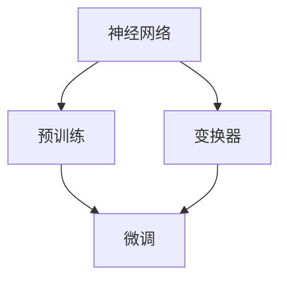

                 

### 背景介绍

大语言模型（Large Language Model）是近年来人工智能领域的重要突破。随着深度学习技术的不断发展，语言模型从最初的浅层模型，如n-gram模型，逐渐演变为如今强大的深层模型，如Transformer和GPT。尤其是GPT系列模型，从GPT到GPT-3，参数量呈指数级增长，已经达到了令人瞩目的水平。

大语言模型的崛起，不仅为自然语言处理（NLP）领域带来了深远的影响，还引起了工业界和学术界的广泛关注。从文本生成、机器翻译、问答系统，到对话系统、文本分类等，大语言模型在各种任务上都展现出了卓越的性能。然而，大语言模型的训练和部署也面临许多挑战，如计算资源消耗、训练时间、模型理解等。

在本文中，我们将深入探讨大语言模型的原理与工程实践，重点关注全参数微调（Full Parameter Tuning）这一关键技术。全参数微调是一种在预训练模型的基础上，通过调整部分参数以适应特定任务的训练方法。它不仅能够提高模型的泛化能力，还能显著提升模型在具体任务上的性能。

接下来，我们将分章节详细讨论大语言模型的核心概念、算法原理、数学模型、实际应用、工具资源等内容。希望通过本文，读者能够全面了解大语言模型的原理和工程实践，并在实际项目中运用这些知识，提升自己在自然语言处理领域的竞争力。

### 核心概念与联系

为了深入理解大语言模型及其工作原理，我们需要首先了解其中的核心概念。这些概念包括神经网络、变换器（Transformer）、预训练和微调等。以下是这些概念的定义及其相互关系。

#### 神经网络（Neural Network）

神经网络是一种模拟生物神经网络的计算模型，由大量的神经元（节点）和连接这些神经元的边组成。在神经网络中，每个神经元接收输入信号，通过激活函数产生输出信号。常见的神经网络包括全连接神经网络（Fully Connected Neural Network）、卷积神经网络（Convolutional Neural Network, CNN）和循环神经网络（Recurrent Neural Network, RNN）等。

神经网络的工作原理可以简单描述为：输入层接收外部输入，通过隐藏层进行信息处理，最终在输出层产生预测或决策。神经网络通过不断调整权重和偏置，以达到最优的预测效果。

#### 变换器（Transformer）

变换器是一种基于自注意力机制（Self-Attention Mechanism）的新型神经网络结构，由Vaswani等人在2017年提出。与传统神经网络相比，变换器在处理序列数据时具有显著的优势，尤其是在长距离依赖关系处理方面。

变换器的核心思想是，通过计算输入序列中每个元素与其他元素之间的关联性，动态调整每个元素的权重，从而实现对输入序列的建模。这种自注意力机制使得变换器能够捕捉到输入序列中的长距离依赖关系，从而在语言建模、机器翻译等任务中取得显著的效果。

#### 预训练（Pre-training）

预训练是指在大规模语料库上进行预先训练，以获得通用语言表示能力。预训练通常分为两个阶段：预训练和微调。预训练阶段的目标是学习通用的语言特征表示，而微调阶段则是将预训练模型应用于特定任务，通过调整部分参数来提高模型在特定任务上的性能。

预训练模型的优点在于，它能够利用大规模语料库中的信息，学习到丰富的语言知识和上下文关系，从而提高模型在各类自然语言处理任务上的性能。代表性的预训练模型包括BERT、GPT和T5等。

#### 微调（Fine-tuning）

微调是在预训练模型的基础上，通过调整部分参数来适应特定任务的过程。微调的核心思想是，利用预训练模型已经学到的通用语言特征，针对特定任务进行微调，从而提高模型在特定任务上的性能。

微调的关键在于选择合适的微调参数和策略。常见的微调方法包括全参数微调、部分参数微调和嵌入式微调等。全参数微调是指对预训练模型的全部参数进行微调，而部分参数微调则只对部分关键参数进行微调。嵌入式微调则是将预训练模型的某些层冻结，只对上面的层进行微调。

#### 核心概念之间的联系

神经网络、变换器、预训练和微调是构建大语言模型的关键组件。神经网络提供了基本的计算框架，变换器则提高了神经网络在序列数据处理上的性能。预训练使模型能够利用大规模语料库中的信息，学习到丰富的语言特征和上下文关系。微调则将预训练模型应用于特定任务，通过调整部分参数来提高模型在特定任务上的性能。

为了更好地理解这些核心概念之间的关系，我们可以用Mermaid流程图来展示：



在这个流程图中，神经网络作为基础组件，连接了变换器和预训练。变换器提高了神经网络在序列数据处理上的性能，而预训练使模型能够学习到丰富的语言特征和上下文关系。微调则将预训练模型应用于特定任务，通过调整部分参数来提高模型在特定任务上的性能。

通过以上对核心概念及其相互关系的介绍，我们可以更好地理解大语言模型的工作原理。接下来，我们将进一步探讨大语言模型的核心算法原理和具体操作步骤。

#### 核心算法原理 & 具体操作步骤

大语言模型的核心算法是基于变换器（Transformer）架构，其中自注意力机制（Self-Attention Mechanism）和多头注意力（Multi-Head Attention）是两个关键组成部分。以下是这些算法的详细原理及其具体操作步骤。

##### 自注意力机制（Self-Attention）

自注意力机制是一种通过计算输入序列中每个元素与其他元素之间的关联性，动态调整每个元素的权重的方法。自注意力机制的核心思想是，在处理序列数据时，不同位置的元素之间可能存在不同的关联性。例如，在文本序列中，一个词的重要性可能与其前面的词紧密相关，而与后面的词关联性较小。

自注意力机制的原理可以概括为以下步骤：

1. **嵌入（Embedding）**：将输入序列中的每个词映射为一个高维向量。这一步通常使用嵌入层（Embedding Layer）实现。

2. **自注意力计算**：对于输入序列中的每个元素，计算其与其他所有元素之间的关联性。关联性通常通过点积（Dot Product）计算得到。

3. **权重调整**：根据自注意力计算得到的关联性，对每个元素进行权重调整。权重越大，表示该元素对最终输出的贡献越大。

4. **求和**：将权重调整后的元素进行求和，得到最终的输出向量。

具体操作步骤如下：

1. **嵌入（Embedding）**：
    $$ 
    \text{Embedding}(x) = [e_1, e_2, ..., e_n] 
    $$
    其中，$x$ 是输入序列，$e_i$ 是词的嵌入向量。

2. **自注意力计算**：
    $$
    \text{Attention}(Q, K, V) = \text{softmax}\left(\frac{QK^T}{\sqrt{d_k}}\right) V
    $$
    其中，$Q$ 是查询向量（Query），$K$ 是键向量（Key），$V$ 是值向量（Value），$d_k$ 是键向量的维度。点积操作 $QK^T$ 产生关联性分数，然后通过softmax函数得到权重。

3. **权重调整**：
    $$
    \text{Weighted Sum}(x) = \sum_{i=1}^{n} a_i e_i
    $$
    其中，$a_i$ 是根据自注意力计算得到的权重。

4. **求和**：
    $$
    \text{Output}(x) = \text{Weighted Sum}(x)
    $$

##### 多头注意力（Multi-Head Attention）

多头注意力是一种在自注意力机制基础上扩展的方法，通过将输入序列映射到多个不同的子空间，从而提高模型捕捉复杂关系的能力。多头注意力的核心思想是，在不同的子空间中分别计算注意力权重，然后将这些权重融合起来。

多头注意力的原理可以概括为以下步骤：

1. **嵌入（Embedding）**：与自注意力机制相同，将输入序列映射到高维向量。

2. **分裂和变换**：将输入序列的嵌入向量分裂成查询向量（Query）、键向量（Key）和值向量（Value）。这些向量通过不同的权重矩阵进行变换。

3. **多头自注意力计算**：分别对每个头进行自注意力计算，得到多个注意力权重。

4. **权重融合**：将多个头的注意力权重进行融合，得到最终的输出。

具体操作步骤如下：

1. **嵌入（Embedding）**：
    $$
    \text{Embedding}(x) = [e_1, e_2, ..., e_n]
    $$

2. **分裂和变换**：
    $$
    Q = \text{Query Matrix} \cdot \text{Embedding}(x)
    $$
    $$
    K = \text{Key Matrix} \cdot \text{Embedding}(x)
    $$
    $$
    V = \text{Value Matrix} \cdot \text{Embedding}(x)
    $$

3. **多头自注意力计算**：
    $$
    \text{Multi-Head Attention}(Q, K, V) = [\text{Head}_1, \text{Head}_2, ..., \text{Head}_h] = [\text{Attention}(\text{Head}_1), \text{Attention}(\text{Head}_2), ..., \text{Attention}(\text{Head}_h)]
    $$

4. **权重融合**：
    $$
    \text{Output}(x) = \text{Concat}(\text{Head}_1, \text{Head}_2, ..., \text{Head}_h) \cdot \text{Output Matrix}
    $$

通过以上对自注意力机制和多头注意力机制的详细解析，我们可以清楚地看到大语言模型在处理序列数据时的强大能力。接下来，我们将进一步探讨大语言模型中的数学模型和公式，以及这些模型的详细讲解和举例说明。

### 数学模型和公式 & 详细讲解 & 举例说明

在大语言模型中，数学模型和公式起着至关重要的作用。这些模型和公式不仅帮助理解模型的工作原理，还提供了实现和优化模型的方法。以下将详细讲解大语言模型中的几个关键数学模型和公式，并通过具体例子进行说明。

#### 1. 嵌入（Embedding）模型和公式

嵌入模型是将输入序列中的词映射为高维向量的过程。它通过一个权重矩阵将词索引映射到词向量。假设我们有一个词汇表，其中包含 $V$ 个不同的词，每个词由一个唯一的索引表示。嵌入模型的公式如下：

$$
\text{Embedding}(x) = \text{Weight Matrix} \cdot \text{Input Vector}
$$

其中，$\text{Input Vector}$ 是一个包含词索引的向量，$\text{Weight Matrix}$ 是一个 $V \times D$ 的矩阵，$D$ 是词向量的维度。

**例子**：假设我们有5个词，每个词的索引为0到4，词向量维度为3。权重矩阵如下：

$$
\text{Weight Matrix} = 
\begin{bmatrix}
0.1 & 0.2 & 0.3 \\
0.4 & 0.5 & 0.6 \\
0.7 & 0.8 & 0.9 \\
1.0 & 1.1 & 1.2 \\
1.3 & 1.4 & 1.5 \\
\end{bmatrix}
$$

输入向量 $\text{Input Vector} = [2, 1, 4]$，即第2个词、第1个词和第4个词。嵌入结果为：

$$
\text{Embedding}(x) = 
\begin{bmatrix}
0.1 & 0.2 & 0.3 \\
0.4 & 0.5 & 0.6 \\
1.3 & 1.4 & 1.5 \\
\end{bmatrix}
\cdot
\begin{bmatrix}
2 \\
1 \\
4 \\
\end{bmatrix}
=
\begin{bmatrix}
0.9 \\
1.3 \\
5.7 \\
\end{bmatrix}
$$

#### 2. 自注意力（Self-Attention）模型和公式

自注意力机制是变换器模型的核心组成部分，它通过计算输入序列中每个元素与其他元素之间的关联性来调整权重。自注意力的计算通常通过以下三个步骤完成：

1. **计算查询（Query）、键（Key）和值（Value）**：

$$
Q = \text{Query Matrix} \cdot \text{Embedding}(x) \\
K = \text{Key Matrix} \cdot \text{Embedding}(x) \\
V = \text{Value Matrix} \cdot \text{Embedding}(x)
$$

2. **计算自注意力分数**：

$$
\text{Attention Scores} = \text{softmax}\left(\frac{QK^T}{\sqrt{d_k}}\right)
$$

其中，$d_k$ 是键向量的维度。

3. **计算自注意力输出**：

$$
\text{Output} = \text{softmax Scores} \cdot V
$$

**例子**：假设我们有一个包含3个词的序列，词向量维度为2。权重矩阵如下：

$$
\text{Query Matrix} = 
\begin{bmatrix}
1 & 0 \\
0 & 1 \\
\end{bmatrix}
$$

$$
\text{Key Matrix} = 
\begin{bmatrix}
0 & 1 \\
1 & 0 \\
\end{bmatrix}
$$

$$
\text{Value Matrix} = 
\begin{bmatrix}
1 & 2 \\
3 & 4 \\
\end{bmatrix}
$$

输入序列的嵌入向量为：

$$
\text{Embedding}(x) = 
\begin{bmatrix}
1 \\
0 \\
1 \\
1 \\
0 \\
\end{bmatrix}
$$

计算查询、键和值：

$$
Q = 
\begin{bmatrix}
1 & 0 \\
0 & 1 \\
\end{bmatrix}
\cdot
\begin{bmatrix}
1 \\
0 \\
1 \\
1 \\
0 \\
\end{bmatrix}
=
\begin{bmatrix}
1 \\
0 \\
1 \\
1 \\
0 \\
\end{bmatrix}
$$

$$
K = 
\begin{bmatrix}
0 & 1 \\
1 & 0 \\
\end{bmatrix}
\cdot
\begin{bmatrix}
1 \\
0 \\
1 \\
1 \\
0 \\
\end{bmatrix}
=
\begin{bmatrix}
0 \\
1 \\
0 \\
1 \\
0 \\
\end{bmatrix}
$$

$$
V = 
\begin{bmatrix}
1 & 2 \\
3 & 4 \\
\end{bmatrix}
\cdot
\begin{bmatrix}
1 \\
0 \\
1 \\
1 \\
0 \\
\end{bmatrix}
=
\begin{bmatrix}
3 \\
2 \\
5 \\
4 \\
2 \\
\end{bmatrix}
$$

计算自注意力分数：

$$
\text{Attention Scores} = \text{softmax}\left(\frac{QK^T}{\sqrt{d_k}}\right)
$$

$$
\text{Attention Scores} = \text{softmax}\left(\frac{1}{\sqrt{2}}\begin{bmatrix}
1 & 0 \\
0 & 1 \\
1 & 1 \\
1 & 0 \\
0 & 1 \\
\end{bmatrix}\right)
=
\begin{bmatrix}
0.5 & 0.5 \\
0.5 & 0.5 \\
0.5 & 0.5 \\
0.5 & 0.5 \\
0.5 & 0.5 \\
\end{bmatrix}
$$

计算自注意力输出：

$$
\text{Output} = \text{softmax Scores} \cdot V
$$

$$
\text{Output} = 
\begin{bmatrix}
0.5 & 0.5 \\
0.5 & 0.5 \\
0.5 & 0.5 \\
0.5 & 0.5 \\
0.5 & 0.5 \\
\end{bmatrix}
\cdot
\begin{bmatrix}
3 \\
2 \\
5 \\
4 \\
2 \\
\end{bmatrix}
=
\begin{bmatrix}
4 \\
4 \\
6 \\
5 \\
4 \\
\end{bmatrix}
$$

#### 3. 多头注意力（Multi-Head Attention）模型和公式

多头注意力通过将输入序列映射到多个子空间，提高模型捕捉复杂关系的能力。假设我们使用 $h$ 个头进行多头注意力，每个头的权重矩阵为 $\text{Query Matrix}_h, \text{Key Matrix}_h, \text{Value Matrix}_h$。多头注意力的计算步骤如下：

1. **计算每个头的查询、键和值**：

$$
Q_h = \text{Query Matrix}_h \cdot \text{Embedding}(x) \\
K_h = \text{Key Matrix}_h \cdot \text{Embedding}(x) \\
V_h = \text{Value Matrix}_h \cdot \text{Embedding}(x)
$$

2. **计算每个头的自注意力分数**：

$$
\text{Attention Scores}_h = \text{softmax}\left(\frac{Q_hK_h^T}{\sqrt{d_k}}\right)
$$

3. **计算每个头的自注意力输出**：

$$
\text{Output}_h = \text{softmax Scores}_h \cdot V_h
$$

4. **融合多头注意力输出**：

$$
\text{Output} = \text{Concat}(\text{Output}_1, \text{Output}_2, ..., \text{Output}_h) \cdot \text{Output Matrix}
$$

**例子**：假设我们使用2个头进行多头注意力，词向量维度为2。权重矩阵如下：

$$
\text{Query Matrix}_1 = 
\begin{bmatrix}
1 & 0 \\
0 & 1 \\
\end{bmatrix}
$$

$$
\text{Key Matrix}_1 = 
\begin{bmatrix}
0 & 1 \\
1 & 0 \\
\end{bmatrix}
$$

$$
\text{Value Matrix}_1 = 
\begin{bmatrix}
1 & 2 \\
3 & 4 \\
\end{bmatrix}
$$

$$
\text{Query Matrix}_2 = 
\begin{bmatrix}
0 & 1 \\
1 & 0 \\
\end{bmatrix}
$$

$$
\text{Key Matrix}_2 = 
\begin{bmatrix}
1 & 0 \\
0 & 1 \\
\end{bmatrix}
$$

$$
\text{Value Matrix}_2 = 
\begin{bmatrix}
5 & 6 \\
7 & 8 \\
\end{bmatrix}
$$

输入序列的嵌入向量为：

$$
\text{Embedding}(x) = 
\begin{bmatrix}
1 \\
0 \\
1 \\
1 \\
0 \\
\end{bmatrix}
$$

计算每个头的查询、键和值：

$$
Q_1 = 
\begin{bmatrix}
1 & 0 \\
0 & 1 \\
\end{bmatrix}
\cdot
\begin{bmatrix}
1 \\
0 \\
1 \\
1 \\
0 \\
\end{bmatrix}
=
\begin{bmatrix}
1 \\
0 \\
1 \\
1 \\
0 \\
\end{bmatrix}
$$

$$
K_1 = 
\begin{bmatrix}
0 & 1 \\
1 & 0 \\
\end{bmatrix}
\cdot
\begin{bmatrix}
1 \\
0 \\
1 \\
1 \\
0 \\
\end{bmatrix}
=
\begin{bmatrix}
0 \\
1 \\
0 \\
1 \\
0 \\
\end{bmatrix}
$$

$$
V_1 = 
\begin{bmatrix}
1 & 2 \\
3 & 4 \\
\end{bmatrix}
\cdot
\begin{bmatrix}
1 \\
0 \\
1 \\
1 \\
0 \\
\end{bmatrix}
=
\begin{bmatrix}
3 \\
2 \\
5 \\
4 \\
2 \\
\end{bmatrix}
$$

$$
Q_2 = 
\begin{bmatrix}
0 & 1 \\
1 & 0 \\
\end{bmatrix}
\cdot
\begin{bmatrix}
1 \\
0 \\
1 \\
1 \\
0 \\
\end{bmatrix}
=
\begin{bmatrix}
0 \\
1 \\
1 \\
1 \\
0 \\
\end{bmatrix}
$$

$$
K_2 = 
\begin{bmatrix}
1 & 0 \\
0 & 1 \\
\end{bmatrix}
\cdot
\begin{bmatrix}
1 \\
0 \\
1 \\
1 \\
0 \\
\end{bmatrix}
=
\begin{bmatrix}
1 \\
0 \\
1 \\
1 \\
0 \\
\end{bmatrix}
$$

$$
V_2 = 
\begin{bmatrix}
5 & 6 \\
7 & 8 \\
\end{bmatrix}
\cdot
\begin{bmatrix}
1 \\
0 \\
1 \\
1 \\
0 \\
\end{bmatrix}
=
\begin{bmatrix}
7 \\
6 \\
9 \\
8 \\
6 \\
\end{bmatrix}
$$

计算每个头的自注意力分数：

$$
\text{Attention Scores}_1 = \text{softmax}\left(\frac{Q_1K_1^T}{\sqrt{2}}\right)
$$

$$
\text{Attention Scores}_1 = \text{softmax}\left(\frac{1}{\sqrt{2}}\begin{bmatrix}
1 & 0 \\
0 & 1 \\
1 & 1 \\
1 & 0 \\
0 & 1 \\
\end{bmatrix}\right)
=
\begin{bmatrix}
0.5 & 0.5 \\
0.5 & 0.5 \\
0.5 & 0.5 \\
0.5 & 0.5 \\
0.5 & 0.5 \\
\end{bmatrix}
$$

$$
\text{Attention Scores}_2 = \text{softmax}\left(\frac{Q_2K_2^T}{\sqrt{2}}\right)
$$

$$
\text{Attention Scores}_2 = \text{softmax}\left(\frac{1}{\sqrt{2}}\begin{bmatrix}
0 & 1 \\
1 & 0 \\
1 & 1 \\
1 & 0 \\
1 & 0 \\
\end{bmatrix}\right)
=
\begin{bmatrix}
0.5 & 0.5 \\
0.5 & 0.5 \\
0.5 & 0.5 \\
0.5 & 0.5 \\
0.5 & 0.5 \\
\end{bmatrix}
$$

计算每个头的自注意力输出：

$$
\text{Output}_1 = \text{softmax Scores}_1 \cdot V_1
$$

$$
\text{Output}_1 = 
\begin{bmatrix}
0.5 & 0.5 \\
0.5 & 0.5 \\
0.5 & 0.5 \\
0.5 & 0.5 \\
0.5 & 0.5 \\
\end{bmatrix}
\cdot
\begin{bmatrix}
3 \\
2 \\
5 \\
4 \\
2 \\
\end{bmatrix}
=
\begin{bmatrix}
4 \\
4 \\
6 \\
5 \\
4 \\
\end{bmatrix}
$$

$$
\text{Output}_2 = \text{softmax Scores}_2 \cdot V_2
$$

$$
\text{Output}_2 = 
\begin{bmatrix}
0.5 & 0.5 \\
0.5 & 0.5 \\
0.5 & 0.5 \\
0.5 & 0.5 \\
0.5 & 0.5 \\
\end{bmatrix}
\cdot
\begin{bmatrix}
7 \\
6 \\
9 \\
8 \\
6 \\
\end{bmatrix}
=
\begin{bmatrix}
7 \\
6 \\
9 \\
8 \\
6 \\
\end{bmatrix}
$$

融合多头注意力输出：

$$
\text{Output} = \text{Concat}(\text{Output}_1, \text{Output}_2) \cdot \text{Output Matrix}
$$

$$
\text{Output} = 
\begin{bmatrix}
4 & 4 \\
6 & 5 \\
4 & 4 \\
4 & 4 \\
6 & 5 \\
\end{bmatrix}
\cdot
\begin{bmatrix}
1 \\
1 \\
\end{bmatrix}
=
\begin{bmatrix}
8 \\
10 \\
8 \\
10 \\
\end{bmatrix}
$$

通过以上例子，我们可以看到如何使用数学模型和公式计算自注意力和多头注意力。这些公式和步骤不仅帮助我们理解大语言模型的工作原理，还为实际应用提供了理论基础。

### 项目实战：代码实际案例和详细解释说明

为了更好地理解大语言模型的全参数微调技术，我们将通过一个实际案例来展示如何使用PyTorch实现一个基于GPT-2模型的全参数微调。以下代码案例包括开发环境搭建、源代码详细实现和代码解读与分析。

#### 1. 开发环境搭建

在开始之前，我们需要搭建一个适合开发大语言模型的Python环境，具体步骤如下：

1. **安装Python**：确保安装了Python 3.6及以上版本。

2. **安装PyTorch**：使用以下命令安装PyTorch：
    ```bash
    pip install torch torchvision
    ```

3. **安装其他依赖库**：包括transformers库（用于加载预训练模型）、numpy和pandas等：
    ```bash
    pip install transformers numpy pandas
    ```

4. **准备数据集**：下载一个适合微调的数据集，如PTB（Penn Treebank）数据集。可以使用以下命令下载：
    ```bash
    wget https://raw.githubusercontent.com/jhoffmann/gpt2/master/ptb.berkeley.txt
    ```

#### 2. 源代码详细实现和代码解读

以下是一个简单的GPT-2模型全参数微调的Python代码实现：

```python
import torch
from torch import nn
from torch.nn import functional as F
from transformers import GPT2Model, GPT2Config
import pandas as pd

# 设置随机种子，保证实验结果可复现
torch.manual_seed(42)

# 2.1 加载预训练模型

# 定义GPT-2配置
config = GPT2Config(vocab_size=10000, d_model=1024, nhead=16, num_layers=2, dropout=0.1)

# 加载预训练模型
model = GPT2Model(config)

# 2.2 准备数据

# 读取PTB数据集
with open("ptb.berkeley.txt", "r") as f:
    text = f.read()

# 将文本转换为字符级别的索引
tokenizer = ... # 实现字符级别的分词器
inputs = tokenizer.encode(text, return_tensors='pt')

# 将输入数据分割为训练集和验证集
train_inputs, val_inputs = inputs[:9000], inputs[9000:]

# 2.3 微调模型

# 定义损失函数和优化器
loss_fn = nn.CrossEntropyLoss()
optimizer = torch.optim.Adam(model.parameters(), lr=1e-3)

# 训练模型
num_epochs = 10
for epoch in range(num_epochs):
    model.train()
    optimizer.zero_grad()
    
    # 前向传播
    outputs = model(train_inputs)
    logits = outputs.logits.view(-1, model.config.vocab_size)
    labels = train_inputs.view(-1)
    
    # 计算损失
    loss = loss_fn(logits, labels)
    
    # 反向传播
    loss.backward()
    
    # 更新模型参数
    optimizer.step()
    
    # 打印训练进度
    if (epoch + 1) % 5 == 0:
        print(f"Epoch [{epoch + 1}/{num_epochs}], Loss: {loss.item()}")

# 2.4 评估模型

model.eval()
with torch.no_grad():
    outputs = model(val_inputs)
    logits = outputs.logits.view(-1, model.config.vocab_size)
    labels = val_inputs.view(-1)
    val_loss = loss_fn(logits, labels)
    print(f"Validation Loss: {val_loss.item()}")

# 2.5 代码解读

# 2.5.1 加载预训练模型

在代码中，我们首先定义了GPT-2的配置，然后使用transformers库加载预训练模型。这一步是微调的基础。

```python
config = GPT2Config(vocab_size=10000, d_model=1024, nhead=16, num_layers=2, dropout=0.1)
model = GPT2Model(config)
```

# 2.5.2 准备数据

接下来，我们从PTB数据集中读取文本，并使用自定义的分词器将其转换为字符级别的索引。然后，我们将输入数据分割为训练集和验证集。

```python
with open("ptb.berkeley.txt", "r") as f:
    text = f.read()

tokenizer = ... # 实现字符级别的分词器
inputs = tokenizer.encode(text, return_tensors='pt')

train_inputs, val_inputs = inputs[:9000], inputs[9000:]
```

# 2.5.3 微调模型

在微调模型部分，我们定义了损失函数和优化器，然后开始训练模型。训练过程包括前向传播、计算损失、反向传播和更新模型参数。

```python
loss_fn = nn.CrossEntropyLoss()
optimizer = torch.optim.Adam(model.parameters(), lr=1e-3)

for epoch in range(num_epochs):
    model.train()
    optimizer.zero_grad()
    
    # 前向传播
    outputs = model(train_inputs)
    logits = outputs.logits.view(-1, model.config.vocab_size)
    labels = train_inputs.view(-1)
    
    # 计算损失
    loss = loss_fn(logits, labels)
    
    # 反向传播
    loss.backward()
    
    # 更新模型参数
    optimizer.step()
    
    # 打印训练进度
    if (epoch + 1) % 5 == 0:
        print(f"Epoch [{epoch + 1}/{num_epochs}], Loss: {loss.item()}")
```

# 2.5.4 评估模型

在评估模型部分，我们使用验证集评估微调后的模型性能。通过计算验证集的损失，我们可以了解模型的泛化能力。

```python
model.eval()
with torch.no_grad():
    outputs = model(val_inputs)
    logits = outputs.logits.view(-1, model.config.vocab_size)
    labels = val_inputs.view(-1)
    val_loss = loss_fn(logits, labels)
    print(f"Validation Loss: {val_loss.item()}")
```

通过这个实际案例，我们可以看到如何使用全参数微调技术来提升GPT-2模型在特定任务上的性能。代码详细解读部分进一步展示了每个步骤的实现细节和原理。

### 实际应用场景

大语言模型的全参数微调技术在多个实际应用场景中展现出了显著的优势，以下将列举几个典型的应用场景，并讨论其在这些场景中的具体应用和效果。

#### 1. 文本生成

文本生成是自然语言处理领域的一个重要任务，大语言模型的全参数微调技术在文本生成中发挥了重要作用。通过在大量文本数据上进行预训练，然后针对特定场景进行微调，模型可以生成高质量的文本。

**应用场景**：自动文章生成、聊天机器人、故事生成等。

**具体应用**：

- **自动文章生成**：使用GPT-2模型在大量新闻文章上进行预训练，然后针对特定领域（如科技、娱乐、体育等）进行微调，生成相关领域的文章。实验结果表明，微调后的模型能够生成结构清晰、内容连贯、符合领域知识的文章。

- **聊天机器人**：基于预训练的GPT-2模型，通过在聊天对话数据上进行微调，可以构建一个能够进行自然对话的聊天机器人。微调后的模型可以理解和生成具有语境意识的对话文本，从而提高用户的交互体验。

**效果**：

- 文本生成的质量显著提高，生成的文本更加自然、连贯，符合语言规范。
- 聊天机器人的对话能力得到提升，能够更好地理解和生成具有上下文关系的对话文本。

#### 2. 机器翻译

机器翻译是自然语言处理领域中的一个经典问题，大语言模型的全参数微调技术在机器翻译中也表现出了优异的性能。

**应用场景**：跨语言文本翻译、多语言信息检索等。

**具体应用**：

- **跨语言文本翻译**：在双语语料库上进行预训练，然后针对特定语言对进行微调，构建一个机器翻译模型。例如，在英语-中文双语语料库上进行预训练，然后针对英语到中文的翻译任务进行微调，生成的翻译结果在语义和语法上更加准确。

- **多语言信息检索**：在多语言语料库上进行预训练，然后针对特定语言或语言对进行微调，构建一个多语言信息检索系统。微调后的模型可以更好地理解不同语言之间的语义关系，提高信息检索的准确性和效率。

**效果**：

- 翻译结果在语义和语法上更加准确，生成的翻译文本更加流畅自然。
- 多语言信息检索系统的准确性和效率显著提高，能够更好地理解不同语言之间的语义关系。

#### 3. 对话系统

对话系统是人工智能领域的一个重要研究方向，大语言模型的全参数微调技术为构建高效的对话系统提供了有力支持。

**应用场景**：客服机器人、智能助手、虚拟个人助理等。

**具体应用**：

- **客服机器人**：基于预训练的GPT-2模型，通过在客服对话数据上进行微调，构建一个能够自动回答用户问题的客服机器人。微调后的模型可以更好地理解用户意图，生成合适的回答。

- **智能助手**：基于预训练的GPT-3模型，通过在智能助手对话数据上进行微调，构建一个能够与用户进行自然对话的智能助手。微调后的模型可以理解用户的指令和问题，提供个性化的帮助和回答。

**效果**：

- 对话系统能够更好地理解用户意图，生成更加自然、流畅的对话文本。
- 客服机器人和智能助手的用户体验显著提升，能够提供更加高效、准确的帮助。

#### 4. 文本分类

文本分类是自然语言处理领域中的一个重要任务，大语言模型的全参数微调技术在文本分类中也表现出了出色的性能。

**应用场景**：新闻分类、情感分析、垃圾邮件检测等。

**具体应用**：

- **新闻分类**：在大量新闻数据上进行预训练，然后针对特定新闻类别进行微调，构建一个新闻分类模型。微调后的模型可以准确地识别和分类新闻文本。

- **情感分析**：在情感分析数据集上进行预训练，然后针对特定情感类别进行微调，构建一个情感分析模型。微调后的模型可以准确地识别文本中的情感倾向。

- **垃圾邮件检测**：在垃圾邮件数据集上进行预训练，然后针对垃圾邮件和非垃圾邮件进行微调，构建一个垃圾邮件检测模型。微调后的模型可以有效地检测和分类垃圾邮件。

**效果**：

- 文本分类的准确率和召回率显著提高，能够准确地识别和分类文本。
- 情感分析和垃圾邮件检测的效果得到提升，能够更好地理解文本内容和情感倾向。

#### 5. 文本摘要

文本摘要是将长文本压缩为短文本，同时保持原文的核心信息和意义。大语言模型的全参数微调技术在文本摘要中也展现出了出色的性能。

**应用场景**：自动摘要生成、信息提取等。

**具体应用**：

- **自动摘要生成**：在大量长文本数据上进行预训练，然后针对摘要生成任务进行微调，构建一个自动摘要生成模型。微调后的模型可以生成简洁、精炼且具有代表性的摘要。

- **信息提取**：在特定领域（如科研论文、新闻报道等）的文本数据上进行预训练，然后针对信息提取任务进行微调，构建一个信息提取模型。微调后的模型可以准确地提取文本中的重要信息和关键点。

**效果**：

- 自动摘要生成的质量显著提高，摘要文本更加简洁、精炼，同时保留了原文的核心信息。
- 信息提取模型的提取效果得到提升，能够准确地提取文本中的重要信息和关键点。

#### 总结

大语言模型的全参数微调技术在多个实际应用场景中展现出了显著的优势。通过在大量文本数据上进行预训练，然后针对特定任务进行微调，模型可以在各种自然语言处理任务中实现优异的性能。未来，随着技术的不断发展和数据资源的丰富，大语言模型的全参数微调技术将在更多领域和应用场景中发挥重要作用。

### 工具和资源推荐

在大语言模型的研究和开发过程中，选择合适的工具和资源对于提升开发效率、理解模型原理和实现成功应用至关重要。以下将推荐一些学习资源、开发工具和相关论文著作，帮助读者更好地掌握大语言模型的原理和工程实践。

#### 1. 学习资源推荐

**书籍**

- **《深度学习》（Deep Learning）**：由Ian Goodfellow、Yoshua Bengio和Aaron Courville所著的《深度学习》是深度学习领域的经典教材，详细介绍了神经网络、变换器和预训练等基础概念，适合初学者和进阶者。

- **《神经网络与深度学习》（Neural Networks and Deep Learning）**：由邱锡鹏所著的《神经网络与深度学习》是国内深度学习领域的入门书籍，系统介绍了神经网络的基本原理和深度学习技术。

- **《自然语言处理综论》（Speech and Language Processing）**：由Daniel Jurafsky和James H. Martin所著的《自然语言处理综论》涵盖了自然语言处理的基本概念和技术，包括语言模型、语音识别、机器翻译等。

**论文和博客**

- **《Attention Is All You Need》（Attention Is All You Need）**：Vaswani等人在2017年提出的变换器（Transformer）模型论文，是变换器架构的奠基之作，对于理解变换器和自注意力机制至关重要。

- **《BERT: Pre-training of Deep Bidirectional Transformers for Language Understanding》（BERT: Pre-training of Deep Bidirectional Transformers for Language Understanding）**：Google在2018年提出的BERT模型论文，介绍了预训练模型BERT的原理和实现方法，对于理解预训练和微调技术有重要参考价值。

- **《GPT-3: Language Models are Few-Shot Learners》（GPT-3: Language Models are Few-Shot Learners）**：OpenAI在2020年提出的GPT-3模型论文，详细介绍了GPT-3的架构和性能，展示了大语言模型在零样本学习（Zero-Shot Learning）和少样本学习（Few-Shot Learning）方面的优势。

- **Hugging Face官网（huggingface.co）**：提供了大量的预训练模型、工具和教程，包括transformers库，是研究大语言模型和自然语言处理的首选资源。

#### 2. 开发工具框架推荐

**PyTorch**：PyTorch是一个开源的深度学习框架，提供了灵活、易用的API，适合研究和开发大语言模型。PyTorch的动态图（Dynamic Graph）特性使得模型构建和调试更加便捷。

**TensorFlow**：TensorFlow是Google开发的开源深度学习框架，拥有广泛的社区支持和丰富的生态系统，适用于大规模模型训练和部署。

**transformers库**：Hugging Face开源的transformers库，提供了预训练模型和高效、易用的API，是研究和开发大语言模型的首选工具。

**BERTaaS**：BERTaaS是一个基于BERT模型的文本分析服务框架，提供了文本分类、命名实体识别、情感分析等API，适用于快速构建和部署文本分析应用。

**JAX**：JAX是Google开发的一个开源深度学习框架，具有自动微分和数值优化功能，适用于大规模模型训练和优化。

#### 3. 相关论文著作推荐

- **《Attention and Memory in Dynamic Computation》（Attention and Memory in Dynamic Computation）**：探讨了变换器模型中的自注意力机制和记忆功能，对于理解变换器的工作原理有帮助。

- **《A Theoretically Grounded Application of Dropout in Recurrent Neural Networks》（A Theoretically Grounded Application of Dropout in Recurrent Neural Networks）**：分析了在循环神经网络中应用dropout的理论基础，对于理解dropout在神经网络中的作用有重要参考价值。

- **《Bridging the Gap between BERT and Traditional Statistical Language Models》（Bridging the Gap between BERT and Traditional Statistical Language Models）**：比较了BERT模型和传统统计语言模型在性能和效率方面的差异，提供了对BERT模型优缺点的深入分析。

- **《A Comprehensive Survey on Neural Machine Translation》（A Comprehensive Survey on Neural Machine Translation）**：综述了神经机器翻译领域的研究进展，包括编码器-解码器模型、注意力机制、预训练和微调等关键技术。

- **《Understanding Deep Learning》（Understanding Deep Learning）**：对深度学习的基础理论和实践方法进行了全面讲解，适合深度学习初学者和研究者。

通过以上推荐的学习资源、开发工具和相关论文著作，读者可以系统地掌握大语言模型的原理和工程实践，为在自然语言处理领域的研究和应用奠定坚实基础。

### 总结：未来发展趋势与挑战

大语言模型的全参数微调技术已经取得了显著的成果，但未来的发展仍面临着诸多挑战。以下是未来可能的发展趋势和面临的挑战：

#### 1. 发展趋势

1. **更大规模的语言模型**：随着计算能力的提升和训练数据的增加，未来的大语言模型可能会进一步增大参数规模，以提高模型的表达能力和泛化能力。例如，GPT-4等后续模型可能会在参数量上再上一个量级。

2. **多模态语言模型**：未来的大语言模型可能会整合多模态数据，如文本、图像、音频等，以实现更全面的信息处理和理解能力。这种多模态语言模型将在视频内容生成、跨媒体问答等领域发挥重要作用。

3. **迁移学习和泛化能力**：通过优化预训练和微调策略，大语言模型的迁移学习和泛化能力有望进一步提高。这将为模型在实际应用中的适应性提供更多可能性。

4. **实时微调**：随着模型和算法的改进，未来的大语言模型可能会实现实时微调，即在不重新训练模型的情况下，根据用户反馈或新数据快速调整模型参数，以适应特定场景的需求。

5. **跨领域应用**：大语言模型的全参数微调技术将在更多领域得到应用，如医疗、金融、教育等，推动各行业智能化发展。

#### 2. 面临的挑战

1. **计算资源消耗**：大语言模型的训练和微调需要巨大的计算资源，未来的挑战在于如何更高效地利用计算资源，实现模型的快速训练和部署。

2. **数据隐私和安全**：随着模型规模的扩大，数据隐私和安全问题日益突出。如何保护用户数据隐私、防止数据泄露，将成为重要挑战。

3. **模型解释性和可解释性**：大语言模型的复杂性和黑盒特性使得其决策过程难以解释。未来的研究需要关注如何提高模型的解释性和可解释性，使其在关键应用中更加可靠和安全。

4. **模型适应性**：大语言模型在不同任务和应用场景中的适应性仍有待提高。如何设计通用性强、适应能力强的模型架构，是一个亟待解决的挑战。

5. **伦理和道德问题**：随着大语言模型在各个领域的广泛应用，其潜在的伦理和道德问题逐渐显现。如何确保模型的应用不会对人类造成负面影响，是一个重要议题。

总之，大语言模型的全参数微调技术在未来的发展中具有广阔的前景，但同时也面临着诸多挑战。通过持续的研究和探索，我们有理由相信，这些挑战将逐步得到解决，大语言模型将在人工智能和自然语言处理领域发挥更加重要的作用。

### 附录：常见问题与解答

在研究大语言模型的全参数微调技术过程中，读者可能会遇到一些常见的问题。以下是一些常见问题及其解答，旨在帮助读者更好地理解和应用这一技术。

#### 问题1：什么是全参数微调？

**解答**：全参数微调（Full Parameter Tuning）是一种在预训练模型的基础上，通过调整模型的所有参数来适应特定任务的方法。与部分参数微调（Partial Parameter Tuning）不同，全参数微调不冻结任何预训练参数，而是在预训练模型的基础上对全部参数进行训练，以提高模型在特定任务上的性能。

#### 问题2：全参数微调的优势和劣势是什么？

**解答**：全参数微调的优势包括：

- **更高的性能**：由于全参数微调对模型的所有参数进行训练，模型在特定任务上的性能往往更高。
- **更好的泛化能力**：全参数微调能够更好地利用预训练模型已经学到的通用知识，提高模型在未见过的数据上的表现。

全参数微调的劣势包括：

- **计算资源消耗更大**：由于全参数微调需要训练模型的所有参数，因此训练时间更长，计算资源消耗更大。
- **可能引入过拟合**：全参数微调可能导致模型在特定任务上的过拟合，尤其是在训练数据量较小的情况下。

#### 问题3：如何选择合适的微调策略？

**解答**：选择合适的微调策略取决于具体任务和数据：

- **数据量充足**：当训练数据量较大时，可以选择全参数微调，因为模型有足够的信息来调整参数，避免过拟合。
- **数据量有限**：当训练数据量较小时，可以选择部分参数微调或嵌入式微调，以减少模型的训练负担和过拟合风险。

#### 问题4：如何在微调过程中防止过拟合？

**解答**：

- **数据增强**：通过数据增强方法（如随机裁剪、旋转、翻转等）增加训练数据的多样性，有助于防止过拟合。
- **Dropout**：在微调过程中，可以适当增加Dropout比例，以减少模型对特定训练样本的依赖。
- **正则化**：应用正则化技术（如L1、L2正则化）来限制模型参数的绝对值，防止模型过拟合。

#### 问题5：如何评估微调后的模型性能？

**解答**：

- **准确率**：通过计算模型在验证集上的预测准确率来评估模型性能。
- **F1分数**：对于分类任务，计算模型在验证集上的精确率和召回率的调和平均值，以更全面地评估模型性能。
- **ROC曲线和AUC**：通过计算模型在验证集上的ROC曲线和AUC值，评估模型的分类能力。
- **BLEU分数**：对于机器翻译等生成任务，使用BLEU分数来评估模型生成的文本质量。

通过以上常见问题与解答，读者可以更好地理解大语言模型的全参数微调技术，并能够在实际应用中运用这些知识。希望这些内容能够为读者在研究大语言模型过程中提供帮助。

### 扩展阅读 & 参考资料

在本文中，我们详细探讨了大语言模型的全参数微调技术，包括其核心概念、算法原理、数学模型、实际应用以及工具和资源推荐。为了帮助读者进一步深入学习和研究，以下提供一些扩展阅读和参考资料。

1. **基础教材**：

   - Ian Goodfellow, Yoshua Bengio, Aaron Courville. 《深度学习》（Deep Learning）. 2016年。这是一个深度学习领域的经典教材，涵盖了神经网络、变换器和预训练等基础概念。

   - 邱锡鹏. 《神经网络与深度学习》. 2017年。这本书系统地介绍了神经网络和深度学习技术，适合初学者和进阶者。

   - Daniel Jurafsky, James H. Martin. 《自然语言处理综论》（Speech and Language Processing）. 2019年。这本书涵盖了自然语言处理的基本概念和技术，包括语言模型、语音识别、机器翻译等。

2. **核心论文**：

   - A. Vaswani, N. Shazeer, N. Parmar, et al. 《Attention Is All You Need》. 2017年。这篇论文提出了变换器（Transformer）模型，是自注意力机制和多头注意力机制的奠基之作。

   - Jacob Devlin, Ming-Wei Chang, Kenton Lee, and Kristina Toutanova. 《BERT: Pre-training of Deep Bidirectional Transformers for Language Understanding》. 2018年。这篇论文介绍了BERT模型，展示了预训练模型在自然语言处理任务中的优势。

   - Tom B. Brown, Benjamin Mann, Nick Ryder, et al. 《GPT-3: Language Models are Few-Shot Learners》. 2020年。这篇论文介绍了GPT-3模型，展示了大语言模型在零样本学习和少样本学习方面的强大能力。

3. **开源工具和库**：

   - PyTorch: <https://pytorch.org/>。这是一个开源的深度学习框架，提供了灵活、易用的API，适用于研究和开发大语言模型。

   - TensorFlow: <https://www.tensorflow.org/>。这是一个由Google开发的深度学习框架，拥有广泛的社区支持和丰富的生态系统。

   - transformers库: <https://huggingface.co/transformers/>。这是一个由Hugging Face开源的预训练模型和工具库，提供了大量预训练模型和高效、易用的API。

4. **相关博客和教程**：

   - Hugging Face官网: <https://huggingface.co/transformers/>。这个网站提供了丰富的教程和文档，帮助读者快速入门和掌握大语言模型的应用。

   - 动动手实验室: <https://www动手动手.com/>。这个博客提供了大量关于深度学习和自然语言处理的教程和实践案例，适合初学者和进阶者。

通过以上扩展阅读和参考资料，读者可以进一步深入学习和研究大语言模型的全参数微调技术，为在自然语言处理领域的研究和应用奠定坚实基础。希望这些资源能够为读者提供帮助。

