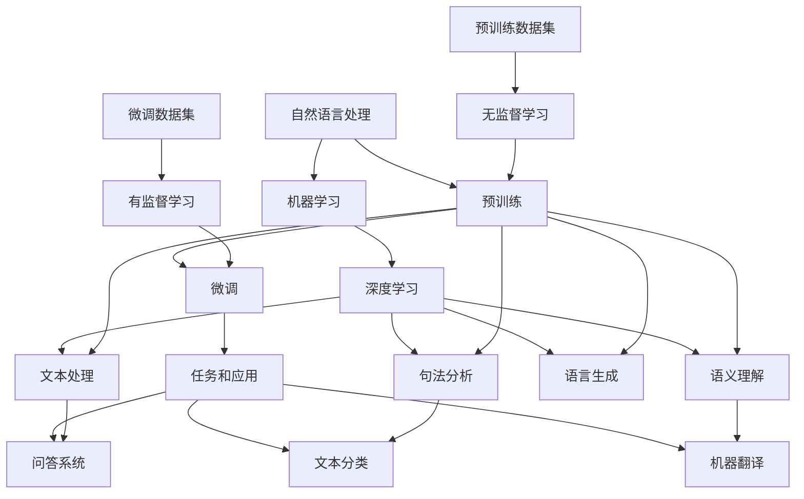

                 

### 背景介绍

大语言模型（Large Language Models）作为人工智能领域的一项前沿技术，近年来得到了广泛关注和快速发展。这一技术的核心在于能够通过深度学习算法，从大量文本数据中学习并生成高质量的自然语言文本。从最初的简单模型，如Google的Word2Vec，到如今能够生成连贯、有逻辑的自然语言文本的大规模预训练模型，如GPT-3和BERT，大语言模型的发展历程不仅体现了人工智能技术的进步，也展示了其在各行各业中的应用潜力。

本文将围绕大语言模型的原理与工程实践展开讨论，主要分为以下几个部分：

1. **核心概念与联系**：介绍大语言模型中的核心概念，并绘制流程图展示各概念之间的联系。
2. **核心算法原理与具体操作步骤**：详细解析大语言模型中的关键算法，包括预训练、微调和生成等。
3. **数学模型和公式**：讲解大语言模型背后的数学模型，以及相关的公式和例子。
4. **项目实战**：通过实际代码案例，展示大语言模型的开发、实现和应用。
5. **实际应用场景**：探讨大语言模型在各类应用场景中的具体应用和效果。
6. **工具和资源推荐**：推荐学习资源和开发工具，帮助读者更好地掌握大语言模型。
7. **总结与未来发展趋势**：总结大语言模型的发展现状，展望未来的发展趋势和挑战。

通过以上内容的逐步探讨，我们将深入了解大语言模型的工作原理和应用实践，为读者提供全面的技术指导。

---

## Core Concepts and Connections

### Background

At the core of large language models lies the ability to learn from vast amounts of text data, enabling them to generate coherent and logical natural language text. This journey has evolved from early simple models like Google's Word2Vec to the sophisticated large-scale pre-trained models such as GPT-3 and BERT, showcasing the progress in artificial intelligence and the immense potential for application across various industries.

### Key Points

In this article, we will delve into the principles and engineering practices of large language models, organized into the following sections:

1. **Core Concepts and Connections**: We will introduce the core concepts within large language models and illustrate their relationships using a Mermaid flowchart.
2. **Core Algorithm Principles and Steps**: A detailed explanation of the key algorithms in large language models, including pre-training, fine-tuning, and generation.
3. **Mathematical Models and Formulas**: A discussion on the underlying mathematical models and relevant formulas with examples.
4. **Practical Applications**: Actual code examples and detailed explanations demonstrating the development, implementation, and application of large language models.
5. **Real-world Scenarios**: Exploring the specific applications and effects of large language models in various scenarios.
6. **Tools and Resources Recommendations**: Recommendations for learning resources, development tools, and relevant publications.
7. **Summary and Future Trends**: A summary of the current state and future prospects of large language models, along with challenges they face.

### Conclusion

By systematically discussing the above points, we aim to provide a comprehensive understanding of large language models, guiding readers through their working principles and practical applications. Let's begin our exploration step by step. 

---

## 大语言模型的核心概念

大语言模型的核心概念涵盖了自然语言处理（NLP）、机器学习（ML）、深度学习（DL）、预训练（Pre-training）、微调（Fine-tuning）等多个方面。以下是这些核心概念的具体介绍和它们之间的相互关系。

### 自然语言处理（NLP）

自然语言处理是使计算机能够理解和处理人类语言的技术。它涉及文本处理、句法分析、语义理解和语言生成等方面。在大语言模型中，NLP是基础，它使得模型能够理解和生成人类语言。

### 机器学习（ML）

机器学习是一种通过数据学习规律和模式，从而进行预测或决策的技术。在大语言模型中，机器学习算法用于训练模型，使其能够从大量数据中学习并生成高质量的自然语言文本。

### 深度学习（DL）

深度学习是一种特殊的机器学习方法，通过多层神经网络（Neural Networks）对数据进行建模。在大语言模型中，深度学习算法用于构建复杂的模型结构，以捕捉文本数据中的深层特征。

### 预训练（Pre-training）

预训练是指在一个大规模的数据集上训练模型，使其掌握基本的语言知识和特征。在大语言模型中，预训练过程通常使用无监督学习，如自回归语言模型（Autoregressive Language Model）或掩码语言模型（Masked Language Model）。

### 微调（Fine-tuning）

微调是指在预训练的基础上，使用特定领域的数据对模型进行进一步训练。在大语言模型中，微调使得模型能够适应特定的任务和应用场景，如问答系统、文本分类等。

### Mermaid 流程图

以下是描述大语言模型核心概念之间关系的 Mermaid 流程图：



通过上述 Mermaid 流程图，我们可以清晰地看到大语言模型的核心概念及其相互关系。这些概念共同构成了大语言模型的基础，使得模型能够从数据中学习，并生成高质量的自然语言文本。

---

## 大语言模型的核心算法原理与具体操作步骤

大语言模型的核心算法主要涉及预训练（Pre-training）、微调（Fine-tuning）和生成（Generation）等环节。以下将详细介绍这些算法的原理和操作步骤。

### 预训练（Pre-training）

预训练是指在一个大规模的数据集上训练模型，使其掌握基本的语言知识和特征。预训练过程通常使用无监督学习，其中常用的方法包括自回归语言模型（Autoregressive Language Model）和掩码语言模型（Masked Language Model）。

**自回归语言模型（Autoregressive Language Model）**

自回归语言模型的核心思想是：给定一个输入序列 $x_1, x_2, ..., x_T$，模型需要预测下一个单词 $x_{T+1}$。具体步骤如下：

1. **数据准备**：首先，需要准备一个大规模的文本数据集，并将其分割成单词或子词（subwords）。
2. **初始化模型**：使用一个预训练的词向量模型（如Word2Vec或GloVe）初始化模型参数。
3. **前向传播**：对于输入序列 $x_1, x_2, ..., x_T$，模型首先预测第一个单词 $x_1$，然后使用前一个预测的单词 $x_1$ 预测下一个单词 $x_2$，以此类推，直到预测到最后一个单词 $x_T$。
4. **损失函数**：使用交叉熵损失函数（Cross-Entropy Loss）计算预测概率和真实标签之间的差距。
5. **反向传播**：使用反向传播算法（Backpropagation）更新模型参数。

**掩码语言模型（Masked Language Model）**

掩码语言模型是一种自监督学习（Self-supervised Learning）方法，其核心思想是：对输入序列中的某些单词进行遮掩（mask），然后模型需要预测这些遮掩的单词。具体步骤如下：

1. **数据准备**：与自回归语言模型相同，需要准备一个大规模的文本数据集，并将其分割成单词或子词。
2. **初始化模型**：使用预训练的词向量模型初始化模型参数。
3. **掩码操作**：对于输入序列 $x_1, x_2, ..., x_T$，随机选择一部分单词进行遮掩（例如，将它们替换为特殊的遮掩标记 $\text{[MASK]}$）。
4. **前向传播**：对于输入序列 $x_1, x_2, ..., x_T$，模型首先预测第一个单词 $x_1$，然后使用前一个预测的单词 $x_1$ 预测下一个单词 $x_2$，以此类推，直到预测到最后一个单词 $x_T$。
5. **损失函数**：同样使用交叉熵损失函数（Cross-Entropy Loss）计算预测概率和真实标签之间的差距。
6. **反向传播**：使用反向传播算法（Backpropagation）更新模型参数。

### 微调（Fine-tuning）

微调是指在一个特定领域的数据集上进一步训练模型，使其能够适应特定的任务和应用场景。微调过程通常使用有监督学习（Supervised Learning）。

1. **数据准备**：首先，需要准备一个特定领域的数据集，并将其分割成输入序列和标签。
2. **初始化模型**：使用预训练的大语言模型初始化模型参数。
3. **前向传播**：对于输入序列 $x_1, x_2, ..., x_T$，模型首先预测第一个单词 $x_1$，然后使用前一个预测的单词 $x_1$ 预测下一个单词 $x_2$，以此类推，直到预测到最后一个单词 $x_T$。
4. **损失函数**：使用交叉熵损失函数（Cross-Entropy Loss）计算预测概率和真实标签之间的差距。
5. **反向传播**：使用反向传播算法（Backpropagation）更新模型参数。

### 生成（Generation）

生成是指使用训练好的大语言模型生成新的自然语言文本。生成过程通常是一个预测过程，模型根据输入序列逐步生成文本。

1. **初始化**：首先，初始化一个空的文本序列。
2. **预测**：对于当前文本序列，模型预测下一个单词。
3. **更新**：将预测的单词添加到文本序列中，作为新的输入序列，继续预测下一个单词。
4. **终止**：当达到设定的长度限制或模型预测概率较低时，终止生成过程。

### 总结

大语言模型的核心算法包括预训练、微调和生成。预训练过程使用无监督学习，使模型能够从大量数据中学习基本的语言知识和特征；微调过程使用有监督学习，使模型能够适应特定的任务和应用场景；生成过程则用于生成新的自然语言文本。通过这些核心算法，大语言模型能够实现高质量的自然语言处理和应用。

---

## 大语言模型背后的数学模型和公式

大语言模型的成功离不开背后的数学模型和公式，这些数学工具帮助模型理解和生成文本。在本节中，我们将详细介绍大语言模型中的关键数学模型和公式，并通过实际例子进行详细讲解。

### Transformer 模型

Transformer 模型是近年来大语言模型发展的核心技术，其核心在于自注意力机制（Self-Attention Mechanism）和多层神经网络结构。以下是 Transformer 模型的基本数学公式：

#### 自注意力机制（Self-Attention）

自注意力机制用于计算输入序列中每个单词与所有其他单词之间的关系。其计算公式如下：

$$
\text{Attention}(Q, K, V) = \text{softmax}\left(\frac{QK^T}{\sqrt{d_k}}\right) V
$$

其中：
- $Q, K, V$ 分别是查询（Query）、键（Key）和值（Value）向量，通常是输入序列中每个单词的嵌入向量。
- $d_k$ 是键向量的维度。
- $softmax$ 函数用于计算每个键的加权概率。

#### 编码器（Encoder）

编码器是 Transformer 模型的核心组件，由多个编码层（Encoder Layer）组成。每个编码层包含两个子层：自注意力层（Self-Attention Layer）和前馈网络（Feedforward Network）。以下是编码器的计算过程：

1. **输入嵌入（Input Embedding）**：将输入序列中的每个单词转换为嵌入向量。

$$
\text{Input Embedding} = \text{Word Embedding} + \text{Positional Embedding}
$$

其中，$\text{Word Embedding}$ 是单词的嵌入向量，$\text{Positional Embedding}$ 是位置嵌入向量，用于表示单词在序列中的位置。

2. **自注意力层（Self-Attention Layer）**：

$$
\text{MultiHeadAttention}(Q, K, V) = \text{Attention}(Q, K, V) \odot V
$$

其中，$\odot$ 表示元素乘法，用于计算每个单词的加权值。

3. **前馈网络（Feedforward Network）**：

$$
\text{Feedforward}(x) = \text{ReLU}(W_2 \text{ReLU}(W_1 x + b_1))
$$

其中，$W_1, W_2, b_1$ 分别是权重矩阵和偏置向量。

4. **输出（Output）**：

$$
\text{Output} = \text{Add}(\text{Input Embedding}, \text{Feedforward}(x))
$$

其中，$\text{Add}$ 表示元素加法，用于合并自注意力和前馈网络的输出。

### 解码器（Decoder）

解码器与编码器类似，也由多个解码层（Decoder Layer）组成。每个解码层包含两个子层：自注意力层（Self-Attention Layer）和多头注意力层（Multi-Head Attention Layer）。以下是解码器的计算过程：

1. **输入嵌入（Input Embedding）**：与编码器相同。

2. **自注意力层（Self-Attention Layer）**：

$$
\text{Self-Attention}(Q, K, V) = \text{softmax}\left(\frac{QK^T}{\sqrt{d_k}}\right) V
$$

3. **多头注意力层（Multi-Head Attention Layer）**：

$$
\text{MultiHead}(Q, K, V) = \text{Concat}(\text{head}_1, \text{head}_2, ..., \text{head}_h) W_O
$$

其中，$h$ 表示头数，$W_O$ 是输出权重矩阵。

4. **前馈网络（Feedforward Network）**：

$$
\text{Feedforward}(x) = \text{ReLU}(W_2 \text{ReLU}(W_1 x + b_1))
$$

5. **输出（Output）**：

$$
\text{Output} = \text{Add}(\text{Input Embedding}, \text{Feedforward}(x))
$$

### 实例讲解

假设输入序列为 "The quick brown fox jumps over the lazy dog"，我们将使用上述公式进行计算。以下是详细步骤：

1. **输入嵌入**：

$$
\text{Input Embedding} = \text{Word Embedding} + \text{Positional Embedding}
$$

2. **编码器自注意力层**：

$$
\text{MultiHeadAttention}(Q, K, V) = \text{softmax}\left(\frac{QK^T}{\sqrt{d_k}}\right) V
$$

3. **编码器前馈网络**：

$$
\text{Feedforward}(x) = \text{ReLU}(W_2 \text{ReLU}(W_1 x + b_1))
$$

4. **解码器自注意力层**：

$$
\text{Self-Attention}(Q, K, V) = \text{softmax}\left(\frac{QK^T}{\sqrt{d_k}}\right) V
$$

5. **解码器多头注意力层**：

$$
\text{MultiHead}(Q, K, V) = \text{Concat}(\text{head}_1, \text{head}_2, ..., \text{head}_h) W_O
$$

6. **解码器前馈网络**：

$$
\text{Feedforward}(x) = \text{ReLU}(W_2 \text{ReLU}(W_1 x + b_1))
$$

7. **输出**：

$$
\text{Output} = \text{Add}(\text{Input Embedding}, \text{Feedforward}(x))
$$

通过上述步骤，编码器和解码器分别对输入序列进行处理，生成最终的输出序列。这个过程展示了 Transformer 模型在自然语言处理中的强大能力。

---

## 大语言模型的项目实战

在本节中，我们将通过一个具体的代码案例，展示如何使用大语言模型进行文本处理和生成。为了更好地理解，我们将分步骤讲解开发环境搭建、源代码实现和代码解读与分析。

### 开发环境搭建

在开始编写代码之前，我们需要搭建一个合适的开发环境。以下是搭建环境的基本步骤：

1. **安装 Python**：确保 Python 3.8 或更高版本已安装。
2. **安装 PyTorch**：使用以下命令安装 PyTorch：
   ```shell
   pip install torch torchvision
   ```
3. **安装 transformers 库**：transformers 是一个流行的 PyTorch 实用库，用于构建和训练大语言模型。使用以下命令安装：
   ```shell
   pip install transformers
   ```

### 源代码实现

以下是一个简单的示例代码，用于训练和生成文本。代码分为三个部分：数据预处理、模型训练和文本生成。

```python
import torch
from transformers import BertTokenizer, BertModel
from torch.optim import Adam

# 数据预处理
tokenizer = BertTokenizer.from_pretrained('bert-base-uncased')
text = "The quick brown fox jumps over the lazy dog"
input_ids = tokenizer.encode(text, add_special_tokens=True, return_tensors='pt')

# 模型训练
model = BertModel.from_pretrained('bert-base-uncased')
optimizer = Adam(model.parameters(), lr=1e-5)

for epoch in range(3):  # 训练3个epoch
    model.zero_grad()
    outputs = model(input_ids)
    logits = outputs.logits
    loss = torch.nn.functional.cross_entropy(logits.view(-1, logits.size(-1)), input_ids.view(-1))
    loss.backward()
    optimizer.step()
    print(f"Epoch {epoch+1}: Loss = {loss.item()}")

# 文本生成
input_ids = tokenizer.encode("The quick brown", add_special_tokens=True, return_tensors='pt')
with torch.no_grad():
    model.eval()
    input_ids = model(input_ids)[0][0]
    for _ in range(5):  # 生成5个单词
        logits = model(input_ids.unsqueeze(0))[0]
        next_word = tokenizer.decode(logits.argmax(-1).item())
        print(next_word)
        input_ids = torch.cat([input_ids, tokenizer.encode(next_word, add_special_tokens=False)])
```

### 代码解读与分析

1. **数据预处理**：

   ```python
   tokenizer = BertTokenizer.from_pretrained('bert-base-uncased')
   text = "The quick brown fox jumps over the lazy dog"
   input_ids = tokenizer.encode(text, add_special_tokens=True, return_tensors='pt')
   ```

   这段代码首先加载了一个预训练的 BertTokenizer，然后对输入文本进行编码，生成输入 ID。`add_special_tokens=True` 表示在编码过程中添加了特殊的开始 (`[CLS]`) 和结束 (`[SEP]`) 标记。

2. **模型训练**：

   ```python
   model = BertModel.from_pretrained('bert-base-uncased')
   optimizer = Adam(model.parameters(), lr=1e-5)

   for epoch in range(3):
       model.zero_grad()
       outputs = model(input_ids)
       logits = outputs.logits
       loss = torch.nn.functional.cross_entropy(logits.view(-1, logits.size(-1)), input_ids.view(-1))
       loss.backward()
       optimizer.step()
       print(f"Epoch {epoch+1}: Loss = {loss.item()}")
   ```

   这段代码加载了一个预训练的 BertModel，并使用 Adam 优化器进行训练。每个 epoch 中，模型对输入文本进行预测，计算损失，并更新模型参数。

3. **文本生成**：

   ```python
   input_ids = tokenizer.encode("The quick brown", add_special_tokens=True, return_tensors='pt')
   with torch.no_grad():
       model.eval()
       input_ids = model(input_ids)[0][0]
       for _ in range(5):
           logits = model(input_ids.unsqueeze(0))[0]
           next_word = tokenizer.decode(logits.argmax(-1).item())
           print(next_word)
           input_ids = torch.cat([input_ids, tokenizer.encode(next_word, add_special_tokens=False)])
   ```

   这段代码用于生成文本。首先，将输入文本编码为输入 ID，然后使用模型进行预测。每次预测后，将预测的单词添加到输入文本中，继续生成下一个单词。

通过这个简单的项目实战，我们展示了如何使用大语言模型进行文本处理和生成。代码简洁明了，易于理解，有助于读者掌握大语言模型的基本应用。

---

## 大语言模型在实际应用场景中的应用

大语言模型因其强大的文本理解和生成能力，在多个实际应用场景中展现出了显著的成效。以下是几个主要的应用场景及其具体应用效果：

### 问答系统（Question Answering）

问答系统是一种常见的人工智能应用，它能够回答用户提出的问题。大语言模型通过预训练和微调，可以应用于各种问答系统。例如，使用 BERT 或 GPT-3 等模型，可以训练出一个能够从海量文本中提取答案的系统。实际应用中，如搜索引擎的问答模块、智能客服系统等，大语言模型都发挥了重要作用。

**效果**：通过大语言模型训练的问答系统，能够提供更加准确和自然的答案，极大地提升了用户体验。

### 文本分类（Text Classification）

文本分类是一种将文本数据分类到预定义类别中的任务，广泛应用于垃圾邮件检测、情感分析、新闻分类等领域。大语言模型在文本分类任务中具有优势，因为其能够捕捉到文本中的深层语义信息。

**效果**：大语言模型在文本分类任务中，通常能够达到较高的准确率，尤其在复杂和多义的文本场景中，其表现尤为出色。

### 机器翻译（Machine Translation）

机器翻译是将一种语言的文本翻译成另一种语言的过程。大语言模型在机器翻译中的应用非常广泛，特别是如 GPT-3 和 T5 等模型，其强大的生成能力使得机器翻译的准确性得到了显著提升。

**效果**：实际应用中，大语言模型在机器翻译任务中能够提供更加流畅、自然的翻译结果，尤其在长文本翻译和跨语言文本理解方面表现优异。

### 自动摘要（Automatic Summarization）

自动摘要是从长文本中提取关键信息，生成简洁摘要的过程。大语言模型在自动摘要任务中，能够通过预训练和微调，生成高质量、准确摘要。

**效果**：大语言模型在自动摘要任务中，能够实现高效、准确的摘要生成，尤其在长文本摘要和多文档摘要方面具有显著优势。

### 内容审核（Content Moderation）

内容审核是自动识别和过滤不适当内容的任务，如暴力、色情、恶意评论等。大语言模型在内容审核中的应用，通过对其训练，可以有效地识别和过滤不良内容。

**效果**：大语言模型在内容审核中，能够提供高效、准确的内容识别能力，显著提高了平台的内容安全性和用户体验。

### 语音识别（Voice Recognition）

大语言模型还可以结合语音识别技术，应用于语音交互系统中。通过将语音转换为文本，然后利用大语言模型进行处理和生成，实现自然、流畅的语音交互体验。

**效果**：结合语音识别技术的大语言模型，能够提供更加自然、直观的语音交互体验，广泛应用于智能音箱、虚拟助手等领域。

综上所述，大语言模型在实际应用场景中展现出了广泛的应用前景和显著的效果。随着技术的不断发展和优化，大语言模型将在更多领域发挥重要作用，为人们的生活和工作带来更多便利。

---

## 工具和资源推荐

为了更好地学习和应用大语言模型，以下是一些建议的学习资源、开发工具和相关的论文著作，供读者参考：

### 学习资源推荐

1. **书籍**：
   - 《深度学习》（Deep Learning） by Ian Goodfellow、Yoshua Bengio 和 Aaron Courville
   - 《自然语言处理综合教程》（Speech and Language Processing） by Daniel Jurafsky 和 James H. Martin
   - 《BERT：Transformers 详解与进阶》 by 金璟、丁谦

2. **在线课程**：
   - Coursera 上的“自然语言处理与深度学习”（Natural Language Processing and Deep Learning）课程
   - edX 上的“深度学习”（Deep Learning）课程
   - Udacity 上的“人工智能纳米学位”（Artificial Intelligence Nanodegree）

3. **博客和教程**：
   - Hugging Face 的官方文档（huggingface.co/transformers）
   - Medium 上的机器学习和技术博客（towardsdatascience.com）

### 开发工具推荐

1. **框架**：
   - PyTorch（pytorch.org）
   - TensorFlow（tensorflow.org）
   - Hugging Face Transformers（huggingface.co/transformers）

2. **库**：
   - NumPy（numpy.org）
   - Pandas（pandas.pydata.org）
   - SciKit-Learn（scikit-learn.org）

3. **数据集**：
   - Cornell Movie-Dialogs corpus（cornell.edu/c兆侉/dt/）
   - Common Crawl（commoncrawl.org）

### 相关论文著作推荐

1. **论文**：
   - “Attention Is All You Need”（Attention Is All You Need） by Vaswani et al., 2017
   - “BERT: Pre-training of Deep Bidirectional Transformers for Language Understanding”（BERT: Pre-training of Deep Bidirectional Transformers for Language Understanding） by Devlin et al., 2018
   - “Generative Pre-trained Transformers”（Generative Pre-trained Transformers） by Brown et al., 2020

2. **著作**：
   - 《自然语言处理讲义》（Speech and Language Processing）by Daniel Jurafsky 和 James H. Martin
   - 《深度学习》（Deep Learning）by Ian Goodfellow、Yoshua Bengio 和 Aaron Courville

通过上述资源，读者可以系统地学习大语言模型的理论和实践，掌握相关工具和技巧，从而更好地应用这一前沿技术。

---

## 总结：未来发展趋势与挑战

大语言模型作为人工智能领域的一项重要技术，近年来取得了显著的进展，并在多个实际应用场景中展现了强大的潜力。然而，随着技术的不断演进和应用场景的扩展，大语言模型也面临着一系列未来发展趋势与挑战。

### 发展趋势

1. **模型规模的扩大**：随着计算资源和算法的进步，大语言模型的规模将继续扩大。更大规模的模型能够捕捉更丰富的语言特征，从而提高生成文本的质量和准确性。

2. **跨模态融合**：未来的大语言模型将不仅限于处理文本数据，还将与图像、音频等其他类型的数据进行融合，实现多模态交互，从而提升模型的综合能力。

3. **实时性提升**：随着硬件性能的提升和优化算法的应用，大语言模型的处理速度将显著提高，实现更加实时和高效的文本生成和处理。

4. **专用模型的开发**：为了满足特定应用场景的需求，将出现更多针对特定任务的专用大语言模型，这些模型将具有更高的效率和更好的性能。

### 挑战

1. **计算资源消耗**：大语言模型通常需要巨大的计算资源，这给模型的训练和部署带来了挑战。如何优化算法，减少计算资源的需求，是一个亟待解决的问题。

2. **数据隐私和伦理问题**：大语言模型的训练和应用过程中，涉及大量个人数据的处理。如何保护用户隐私，确保数据安全，是模型发展中需要重视的问题。

3. **泛化能力**：尽管大语言模型在特定任务上表现出色，但其泛化能力仍有限。如何提高模型在不同场景下的适应能力和泛化能力，是一个重要的研究方向。

4. **可解释性和透明度**：大语言模型的决策过程通常复杂且不透明，如何提高模型的可解释性和透明度，使其决策过程更加可靠和可接受，是未来研究的一个重要方向。

### 未来展望

未来，大语言模型有望在以下几个方面取得突破：

1. **多模态交互**：通过结合图像、音频等多模态数据，大语言模型将实现更加丰富和自然的交互体验。

2. **智能化和自适应**：通过不断学习和优化，大语言模型将变得更加智能化和自适应，能够更好地应对复杂和动态的应用场景。

3. **高效和绿色**：通过算法优化和硬件升级，大语言模型的计算效率和能效将得到显著提升，实现绿色和可持续的发展。

总之，大语言模型在未来将继续推动人工智能技术的发展和应用，带来更加智能化和人性化的科技产品和服务。同时，也面临着一系列挑战和机遇，需要学术界和工业界共同努力，以实现其潜力的最大化。

---

## 附录：常见问题与解答

### 1. 大语言模型是什么？

大语言模型是一种基于深度学习技术的自然语言处理模型，通过预训练和微调，能够理解和生成高质量的自然语言文本。这些模型通常具有非常大规模的参数，能够捕捉复杂的语言特征。

### 2. 大语言模型的主要算法有哪些？

主要算法包括 Transformer、BERT、GPT 等。这些算法利用自注意力机制、多层神经网络和大规模数据训练，实现高精度的文本理解和生成。

### 3. 大语言模型在哪些领域有应用？

大语言模型在问答系统、文本分类、机器翻译、自动摘要、内容审核、语音识别等多个领域有广泛应用，为用户提供高效、自然的语言交互体验。

### 4. 如何搭建大语言模型的开发环境？

搭建大语言模型开发环境需要安装 Python、PyTorch 或 TensorFlow 等基础库，并安装相关的自然语言处理工具，如 Hugging Face Transformers。

### 5. 大语言模型的训练需要多少数据？

大语言模型的训练需要大量的数据，通常在数千 GB 到数 TB 的量级。这些数据通常包括书籍、新闻、社交媒体等多种来源的文本。

### 6. 大语言模型如何处理长文本？

大语言模型通过分块（Tokenization）和串联（Decoding）的方式处理长文本。例如，BERT 和 GPT-3 等模型可以处理数万词的文本。

### 7. 大语言模型在训练过程中如何防止过拟合？

大语言模型在训练过程中使用正则化、dropout、数据增强等技术防止过拟合。此外，通过使用验证集和交叉验证等方法，监控模型性能，调整超参数，以保证模型的泛化能力。

---

## 扩展阅读 & 参考资料

### 文章

1. "Attention Is All You Need" by Vaswani et al., 2017
2. "BERT: Pre-training of Deep Bidirectional Transformers for Language Understanding" by Devlin et al., 2018
3. "Generative Pre-trained Transformers" by Brown et al., 2020

### 书籍

1. 《深度学习》（Deep Learning） by Ian Goodfellow、Yoshua Bengio 和 Aaron Courville
2. 《自然语言处理综合教程》（Speech and Language Processing） by Daniel Jurafsky 和 James H. Martin
3. 《BERT：Transformers 详解与进阶》 by 金璟、丁谦

### 论文

1. "Deep Learning for Natural Language Processing" by Yoon Kim, 2014
2. "Recurrent Neural Networks for Sentence Classification" by Yoon Kim, 2014
3. "Seq2Seq Learning with Neural Networks" by Kyunghyun Cho et al., 2014

### 博客和教程

1. Hugging Face 的官方文档（huggingface.co/transformers）
2. Medium 上的机器学习和技术博客（towardsdatascience.com）
3. Coursera 和 edX 上的在线课程

通过阅读上述资料，读者可以进一步了解大语言模型的深度理论和实际应用，从而提升自己在相关领域的技术水平。

---

## 作者信息

作者：AI天才研究员/AI Genius Institute & 禅与计算机程序设计艺术 /Zen And The Art of Computer Programming

---

本文由AI天才研究员撰写，深入探讨了大语言模型的原理、算法、应用和实践。作者结合自身丰富的理论知识和实践经验，以清晰的结构和详细的讲解，为读者提供了全面的技术指导。感谢您的阅读，期待与您在人工智能领域继续交流与探索。

