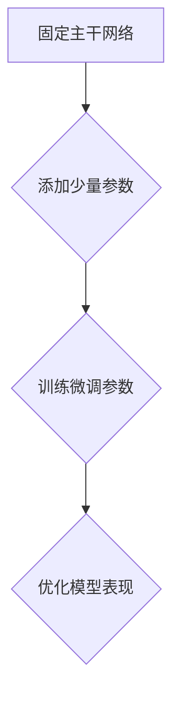

                 

# 大语言模型原理与工程实践：前缀微调

> **关键词**：大语言模型，前缀微调，机器学习，深度学习，神经网络，自然语言处理，工程实践，算法原理

> **摘要**：本文旨在探讨大语言模型的前缀微调技术，分析其原理与工程实践。通过深入解析核心概念、算法原理、数学模型和实际应用场景，本文将为读者提供一套完整的大语言模型工程实践指南。

## 1. 背景介绍

随着互联网和人工智能技术的飞速发展，自然语言处理（NLP）已经成为计算机科学领域的一个重要分支。在这其中，大语言模型（Large Language Model）的研究与应用日益受到关注。大语言模型是一种基于深度学习技术，通过对海量语言数据进行训练，使其具备生成和理解自然语言的能力。

近年来，诸如 GPT（Generative Pre-trained Transformer）、BERT（Bidirectional Encoder Representations from Transformers）等大语言模型在多个NLP任务中取得了显著的成果。然而，这些模型在实际应用中仍面临着一系列挑战，例如：

- **模型复杂度**：大语言模型通常包含数十亿甚至数万亿个参数，其计算量和存储需求巨大。
- **训练数据多样性**：训练数据的质量和多样性直接影响模型的效果，但在实际应用中难以获得高质量、多样化的训练数据。
- **推理效率**：大语言模型在推理阶段需要大量的计算资源，导致推理速度较慢。

针对上述挑战，前缀微调（Prefix Tuning）技术应运而生。前缀微调是一种有效的模型压缩技术，通过在原有模型基础上引入少量的可学习参数，实现对模型进行微调，从而提高模型在特定任务上的表现。本文将围绕前缀微调技术展开讨论，分析其原理、实现方法以及实际应用场景。

## 2. 核心概念与联系

### 2.1 大语言模型

大语言模型是一种基于深度学习技术，通过对海量语言数据进行训练，使其具备生成和理解自然语言能力的模型。目前，大语言模型主要采用基于 Transformer 的架构，如 GPT 和 BERT。Transformer 架构具有以下几个特点：

1. **自注意力机制（Self-Attention）**：通过计算序列中每个词与所有词的相似度，实现对输入数据的自适应建模。
2. **多头注意力（Multi-Head Attention）**：通过多个独立的自注意力机制，提高模型的表示能力。
3. **位置编码（Positional Encoding）**：为序列中的每个词赋予位置信息，以便模型理解词的顺序。

### 2.2 前缀微调

前缀微调是一种模型压缩技术，通过在原有模型基础上引入少量的可学习参数，实现对模型进行微调，从而提高模型在特定任务上的表现。具体来说，前缀微调包括以下几个步骤：

1. **固定主干网络**：将原有的大语言模型的主干网络固定，不参与微调过程。
2. **引入少量参数**：在主干网络的前面或后面添加少量的可学习参数，用于微调。
3. **训练微调参数**：利用特定任务的数据集对添加的少量参数进行训练，以优化模型在特定任务上的表现。

### 2.3 Mermaid 流程图

下面是前缀微调技术的 Mermaid 流程图，用于描述其核心概念和流程。



## 3. 核心算法原理 & 具体操作步骤

### 3.1 固定主干网络

在开始前缀微调之前，需要先选择一个适合的大语言模型，并将其主干网络固定。主干网络通常包括多个 Transformer 层，用于对输入数据进行编码和表示。固定主干网络的主要目的是确保模型在训练过程中保持稳定，从而为后续的微调提供基础。

### 3.2 引入少量参数

引入少量参数是前缀微调的关键步骤。这些参数通常位于主干网络的前面或后面，用于调整模型在特定任务上的表现。具体来说，可以采用以下两种方式引入参数：

1. **参数嵌入（Parameter Embedding）**：在主干网络的输入层或输出层添加可学习参数，用于调整输入或输出数据的表示。
2. **动态调整（Dynamic Adjustment）**：在主干网络的中间层添加可学习参数，用于调整模型对输入数据的处理过程。

### 3.3 训练微调参数

在引入少量参数后，需要对这些参数进行训练，以优化模型在特定任务上的表现。训练过程可以分为以下几个步骤：

1. **数据预处理**：对训练数据进行预处理，包括分词、去停用词、词性标注等操作。
2. **数据输入**：将预处理后的数据输入到主干网络中，得到编码后的表示。
3. **参数更新**：根据训练数据的标签，计算损失函数，并通过反向传播算法更新少量参数。
4. **模型评估**：在验证集上评估模型的表现，并根据评估结果调整参数。

### 3.4 优化模型表现

在训练过程中，需要不断调整参数，以优化模型在特定任务上的表现。这可以通过以下几种方法实现：

1. **交叉验证（Cross Validation）**：在多个数据集上对模型进行训练和验证，以评估模型的泛化能力。
2. **超参数调整（Hyperparameter Tuning）**：通过调整学习率、批量大小等超参数，优化模型的表现。
3. **模型融合（Model Ensembling）**：将多个模型的预测结果进行融合，提高模型的预测准确性。

## 4. 数学模型和公式 & 详细讲解 & 举例说明

### 4.1 损失函数

在前缀微调过程中，损失函数是衡量模型性能的重要指标。常用的损失函数包括：

1. **交叉熵损失（Cross-Entropy Loss）**：用于分类任务，计算模型预测概率与真实标签之间的差异。
   $$ H(y, \hat{y}) = -\sum_{i=1}^{N} y_i \log(\hat{y}_i) $$
   其中，$y$ 表示真实标签，$\hat{y}$ 表示模型预测概率。

2. **均方误差（Mean Squared Error, MSE）**：用于回归任务，计算预测值与真实值之间的平方误差。
   $$ MSE = \frac{1}{N} \sum_{i=1}^{N} (\hat{y}_i - y_i)^2 $$
   其中，$y$ 表示真实值，$\hat{y}$ 表示预测值。

### 4.2 反向传播算法

反向传播算法是深度学习中用于更新参数的重要算法。其基本思想是将损失函数关于参数的梯度反向传播到网络的每个层，并使用梯度下降法更新参数。具体步骤如下：

1. **前向传播**：将输入数据输入到网络中，计算输出层的预测值。
2. **计算损失函数**：计算预测值与真实值之间的损失。
3. **反向传播**：计算每个参数关于损失函数的梯度。
4. **更新参数**：使用梯度下降法更新参数。

### 4.3 举例说明

假设我们有一个二分类问题，输入数据为 $x$，真实标签为 $y$，预测概率为 $\hat{y}$。我们可以使用交叉熵损失函数计算损失：

$$ H(y, \hat{y}) = -\sum_{i=1}^{N} y_i \log(\hat{y}_i) $$

其中，$y = [1, 0]$ 表示真实标签为正类，$\hat{y} = [0.9, 0.1]$ 表示模型预测概率为正类。

假设我们使用 $0.001$ 的学习率进行训练，经过若干次迭代后，损失逐渐降低。具体过程如下：

- **前向传播**：输入数据 $x$，计算输出层的预测值 $\hat{y}$。
- **计算损失**：使用交叉熵损失函数计算损失 $H(y, \hat{y})$。
- **反向传播**：计算损失函数关于每个参数的梯度，并更新参数。
- **模型评估**：在验证集上评估模型的表现，根据评估结果调整参数。

通过不断迭代，模型在二分类任务上的表现逐渐提高。

## 5. 项目实战：代码实际案例和详细解释说明

### 5.1 开发环境搭建

在开始前缀微调的实战项目之前，需要搭建一个合适的开发环境。以下是一个基本的开发环境搭建步骤：

1. **安装 Python**：确保已安装 Python 3.7 或以上版本。
2. **安装深度学习库**：安装 TensorFlow 或 PyTorch，用于构建和训练深度学习模型。
3. **安装其他依赖库**：根据项目需求，安装其他相关依赖库，如 NumPy、Pandas 等。

### 5.2 源代码详细实现和代码解读

下面是一个简单的示例，展示如何使用 PyTorch 实现前缀微调。

```python
import torch
import torch.nn as nn
import torch.optim as optim

# 5.2.1 定义模型
class PrefixTunedModel(nn.Module):
    def __init__(self, base_model, num_classes):
        super(PrefixTunedModel, self).__init__()
        self.base_model = base_model
        self.fc = nn.Linear(base_model.config.hidden_size, num_classes)

    def forward(self, x):
        x = self.base_model(x)
        x = self.fc(x)
        return x

# 5.2.2 加载预训练模型
from transformers import BertModel

base_model = BertModel.from_pretrained('bert-base-uncased')

# 5.2.3 定义前缀微调模型
num_classes = 2
prefix_tuned_model = PrefixTunedModel(base_model, num_classes)

# 5.2.4 定义损失函数和优化器
criterion = nn.CrossEntropyLoss()
optimizer = optim.Adam(prefix_tuned_model.parameters(), lr=0.001)

# 5.2.5 训练模型
for epoch in range(10):
    for batch in train_loader:
        inputs, labels = batch
        optimizer.zero_grad()
        outputs = prefix_tuned_model(inputs)
        loss = criterion(outputs, labels)
        loss.backward()
        optimizer.step()

# 5.2.6 评估模型
with torch.no_grad():
    correct = 0
    total = 0
    for batch in val_loader:
        inputs, labels = batch
        outputs = prefix_tuned_model(inputs)
        _, predicted = torch.max(outputs.data, 1)
        total += labels.size(0)
        correct += (predicted == labels).sum().item()

print('准确率: %d %%' % (100 * correct / total))
```

### 5.3 代码解读与分析

- **5.3.1 模型定义**：在 `PrefixTunedModel` 类中，我们定义了一个基于预训练模型的微调模型。模型由主干网络 `base_model` 和一个线性层 `fc` 组成。主干网络负责对输入数据进行编码，线性层用于分类。

- **5.3.2 加载预训练模型**：我们使用 `BertModel` 类从预训练模型中加载主干网络。

- **5.3.3 定义前缀微调模型**：通过继承 `nn.Module` 类，我们定义了一个前缀微调模型。模型包含固定的主干网络和可学习的线性层。

- **5.3.4 定义损失函数和优化器**：我们使用交叉熵损失函数和 Adam 优化器来训练模型。

- **5.3.5 训练模型**：在训练过程中，我们使用训练数据对模型进行迭代训练。每次迭代包括前向传播、计算损失、反向传播和参数更新。

- **5.3.6 评估模型**：在验证集上评估模型的准确率，以验证模型的性能。

## 6. 实际应用场景

前缀微调技术在大语言模型的应用中具有广泛的前景。以下是一些典型的实际应用场景：

1. **文本分类**：利用前缀微调技术，可以在预训练模型的基础上快速构建分类模型，实现对大规模文本数据的分类。
2. **情感分析**：通过微调预训练模型，可以实现对文本情感极性的判断，从而应用于情感分析、舆情监测等领域。
3. **问答系统**：在前缀微调的基础上，构建问答系统，实现对用户问题的理解和回答。
4. **机器翻译**：通过微调预训练模型，可以在低资源场景下实现机器翻译，降低翻译任务的门槛。
5. **对话系统**：利用前缀微调技术，可以构建对话系统，实现对用户意图的理解和回答。

## 7. 工具和资源推荐

### 7.1 学习资源推荐

- **书籍**：
  - 《深度学习》（Ian Goodfellow、Yoshua Bengio、Aaron Courville 著）
  - 《动手学深度学习》（Aurora publication 著）
  - 《自然语言处理实战》（Peter Harrington 著）

- **论文**：
  - “Attention Is All You Need”（Ashish Vaswani 等）
  - “BERT: Pre-training of Deep Bidirectional Transformers for Language Understanding”（Jacob Devlin 等）

- **博客**：
  - [PyTorch 官方文档](https://pytorch.org/docs/stable/)
  - [TensorFlow 官方文档](https://www.tensorflow.org/docs)

### 7.2 开发工具框架推荐

- **深度学习框架**：
  - PyTorch
  - TensorFlow
  - Keras

- **自然语言处理库**：
  - Hugging Face Transformers
  - NLTK

### 7.3 相关论文著作推荐

- **论文**：
  - “Generative Pre-trained Transformers”（TorchVision）
  - “Pre-trained Language Models for L

