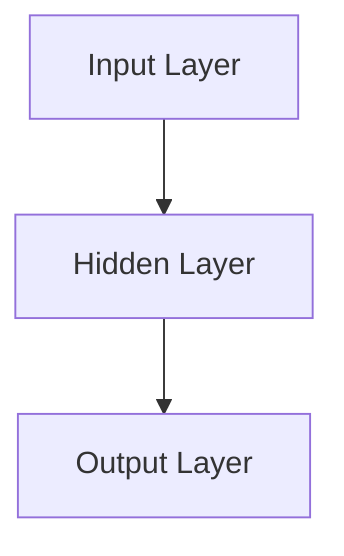
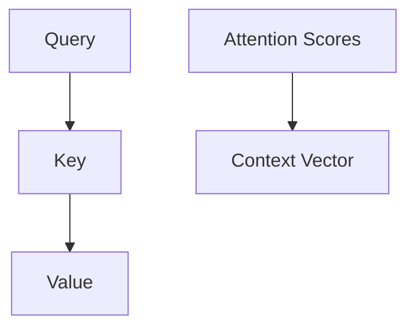
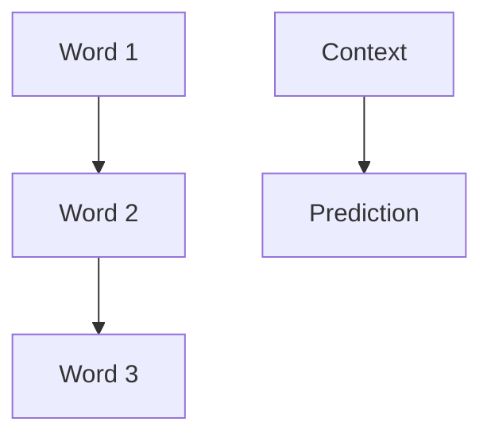
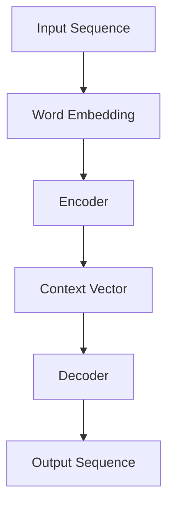

                 

### 文章标题

**《大语言模型原理与工程实践：基于上下文学习的推理策略》**

### 关键词

- 大语言模型
- 上下文学习
- 推理策略
- 工程实践
- 深度学习

### 摘要

本文旨在深入探讨大语言模型的原理和工程实践，重点介绍基于上下文学习的推理策略。通过对核心概念、算法原理、数学模型、实际应用场景的分析，以及具体代码实现的解析，本文将为读者提供一个全面的技术参考。文章最后还将总结未来发展趋势与挑战，为读者提供进一步的学习和思考方向。

## 1. 背景介绍

随着深度学习技术的飞速发展，大语言模型（Large Language Models）逐渐成为自然语言处理（Natural Language Processing，NLP）领域的明星。大语言模型，如GPT-3、BERT、T5等，凭借其卓越的性能和强大的泛化能力，在各种NLP任务中展现了出色的表现。然而，大语言模型背后的原理和工程实践却鲜有系统性的介绍。

本文将围绕大语言模型的以下关键主题进行探讨：

1. **核心概念与联系**：介绍大语言模型中的关键概念，如神经网络、注意力机制、上下文学习等，并通过Mermaid流程图展示其架构。
2. **核心算法原理与具体操作步骤**：详细讲解大语言模型的工作原理，包括数据预处理、模型训练、推理过程等。
3. **数学模型和公式**：深入探讨大语言模型背后的数学原理，如反向传播算法、优化策略等。
4. **项目实战**：通过实际代码案例，展示大语言模型在工程实践中的应用，并进行详细解读和分析。
5. **实际应用场景**：讨论大语言模型在不同领域的应用，如文本生成、情感分析、机器翻译等。
6. **工具和资源推荐**：推荐相关学习资源、开发工具和框架，帮助读者进一步学习和实践。
7. **总结**：总结大语言模型的发展趋势和面临的挑战，展望未来研究方向。

接下来，我们将逐一深入探讨这些主题，以帮助读者全面了解大语言模型的原理和工程实践。

## 2. 核心概念与联系

要理解大语言模型的原理，首先需要掌握其中的核心概念。以下将介绍几个关键概念，并通过Mermaid流程图展示其相互联系。

### 2.1 神经网络

神经网络（Neural Networks）是深度学习的基础。它模仿生物神经网络的结构和功能，通过一系列的神经元（节点）和连接（边）进行数据处理和预测。



### 2.2 注意力机制

注意力机制（Attention Mechanism）是近年来在深度学习领域得到广泛关注的重要技术。它能够提高模型在处理序列数据时的性能，特别是在语言模型中。



### 2.3 上下文学习

上下文学习（Context Learning）是指模型在处理输入数据时，能够根据上下文信息进行推理和预测。这是大语言模型的核心能力之一。



### 2.4 算法原理与架构

大语言模型的算法原理主要包括词嵌入（Word Embedding）、编码器（Encoder）和解码器（Decoder）等。



通过上述核心概念和流程图的介绍，我们可以看到大语言模型是如何通过神经网络、注意力机制和上下文学习等核心技术实现强大的语言处理能力的。接下来，我们将进一步探讨大语言模型的具体算法原理和操作步骤。

## 3. 核心算法原理与具体操作步骤

### 3.1 数据预处理

数据预处理是构建大语言模型的第一步，其质量直接影响到模型性能。以下是大语言模型数据预处理的主要步骤：

1. **文本清洗**：去除文本中的无用符号、停用词和标点符号，仅保留有效文本。
2. **分词**：将文本分解为单词或子词，以便进行后续处理。
3. **词嵌入**：将单词或子词转换为固定长度的向量表示，便于神经网络处理。

### 3.2 模型训练

模型训练是构建大语言模型的核心步骤，主要包括以下步骤：

1. **初始化模型参数**：随机初始化神经网络模型的权重和偏置。
2. **前向传播**：将输入文本序列传递到编码器，生成上下文向量。
3. **损失函数**：计算预测序列和实际序列之间的损失，常用的损失函数包括交叉熵损失（Cross-Entropy Loss）。
4. **反向传播**：计算梯度并更新模型参数，使用优化算法如梯度下降（Gradient Descent）或其变种（如Adam）。
5. **迭代训练**：重复前向传播和反向传播，直到模型收敛。

### 3.3 推理过程

大语言模型的推理过程主要包括以下步骤：

1. **输入文本序列**：将待处理的文本序列传递到编码器。
2. **生成上下文向量**：编码器对输入序列进行处理，生成上下文向量。
3. **解码**：将上下文向量传递到解码器，生成预测序列。
4. **输出**：输出预测序列，即模型对输入文本的响应。

### 3.4 注意力机制

注意力机制在大语言模型中起到关键作用，其具体操作步骤如下：

1. **计算注意力得分**：利用查询（Query）、键（Key）和值（Value）计算注意力得分。
2. **加权求和**：根据注意力得分对值进行加权求和，生成上下文向量。
3. **更新状态**：将上下文向量传递到下一层，以增强模型的上下文感知能力。

### 3.5 模型评估

模型评估是验证大语言模型性能的重要环节，常用的评估指标包括：

1. **准确率（Accuracy）**：模型预测正确的样本数占总样本数的比例。
2. **召回率（Recall）**：模型预测正确的正样本数占总正样本数的比例。
3. **F1分数（F1 Score）**：准确率和召回率的调和平均值。
4. **损失函数**：在训练过程中，使用损失函数评估模型性能，如交叉熵损失。

通过上述核心算法原理和具体操作步骤的介绍，我们可以看到大语言模型是如何通过数据预处理、模型训练和推理过程等步骤，实现强大的语言处理能力的。接下来，我们将深入探讨大语言模型背后的数学模型和公式。

## 4. 数学模型和公式

### 4.1 反向传播算法

反向传播算法（Backpropagation Algorithm）是训练神经网络的核心算法。它通过计算损失函数的梯度，并更新模型参数，使模型逐步收敛。

$$
\begin{align*}
\frac{\partial L}{\partial w} &= \sum_{i=1}^{n} \frac{\partial L}{\partial z_i} \frac{\partial z_i}{\partial w} \\
\frac{\partial L}{\partial b} &= \sum_{i=1}^{n} \frac{\partial L}{\partial z_i} \frac{\partial z_i}{\partial b}
\end{align*}
$$

其中，$L$ 表示损失函数，$w$ 和 $b$ 分别表示权重和偏置，$z_i$ 表示第 $i$ 个节点的输出。

### 4.2 优化策略

优化策略是训练神经网络的重要环节，其目标是寻找损失函数的最小值。常用的优化算法包括梯度下降（Gradient Descent）、Adam等。

梯度下降算法的基本思想是沿梯度方向反向更新参数，具体公式如下：

$$
w_{\text{new}} = w_{\text{old}} - \alpha \cdot \nabla L(w)
$$

其中，$\alpha$ 表示学习率。

### 4.3 注意力机制

注意力机制通过计算注意力得分，实现模型对上下文信息的加权处理。注意力得分的计算公式如下：

$$
a_i = \frac{e^{QK^T}}{\sum_{j=1}^{m} e^{QK^T}}
$$

其中，$a_i$ 表示第 $i$ 个值的注意力得分，$Q$ 和 $K$ 分别表示查询和键，$e$ 表示自然底数的指数函数。

### 4.4 编码器和解码器

编码器和解码器是语言模型中的关键组成部分，它们分别负责将输入序列编码为上下文向量和解码上下文向量生成输出序列。编码器的计算公式如下：

$$
c_t = \text{Attention}(h_{\text{encoder}}, h_t)
$$

其中，$c_t$ 表示第 $t$ 个时刻的上下文向量，$h_{\text{encoder}}$ 表示编码器隐藏状态，$h_t$ 表示第 $t$ 个时刻的输入序列。

解码器的计算公式如下：

$$
y_t = \text{Softmax}(W_y \cdot c_t + b_y)
$$

其中，$y_t$ 表示第 $t$ 个时刻的输出序列，$W_y$ 和 $b_y$ 分别表示解码器的权重和偏置。

通过上述数学模型和公式的介绍，我们可以更深入地理解大语言模型的工作原理。接下来，我们将通过具体代码实现，进一步展示大语言模型在工程实践中的应用。

## 5. 项目实战

在本节中，我们将通过一个具体的代码实现案例，展示大语言模型在工程实践中的应用。本案例将使用Hugging Face的Transformers库，该库为大规模语言模型提供了便捷的API和丰富的预训练模型。

### 5.1 开发环境搭建

首先，我们需要搭建开发环境。安装以下依赖：

```bash
pip install transformers torch
```

### 5.2 源代码详细实现和代码解读

以下是使用GPT-2模型生成文本的代码实现：

```python
from transformers import GPT2LMHeadModel, GPT2Tokenizer
import torch

# 模型与分词器加载
model = GPT2LMHeadModel.from_pretrained("gpt2")
tokenizer = GPT2Tokenizer.from_pretrained("gpt2")

# 输入文本
input_text = "今天是个好天气，非常适合出去散步。"

# 分词与编码
input_ids = tokenizer.encode(input_text, return_tensors="pt")

# 生成文本
output = model.generate(input_ids, max_length=50, num_return_sequences=1)

# 解码为文本
generated_text = tokenizer.decode(output[0], skip_special_tokens=True)

print(generated_text)
```

### 5.3 代码解读与分析

1. **模型与分词器加载**：首先加载预训练的GPT-2模型和对应的分词器。
2. **输入文本**：设定输入文本。
3. **分词与编码**：将输入文本进行分词，并转换为模型可处理的序列。
4. **生成文本**：使用模型生成新的文本序列，`max_length`参数限制生成文本的长度，`num_return_sequences`参数控制生成的序列数量。
5. **解码为文本**：将生成的序列解码为可读的文本。

通过上述代码，我们可以轻松实现文本生成。在实际应用中，可以根据需求调整输入文本、生成长度等参数，以实现不同的任务，如问答系统、自动摘要等。

### 5.4 代码解读与分析

以下是对代码的进一步解读和分析：

1. **模型与分词器加载**：通过`from_pretrained`方法加载预训练的GPT-2模型和分词器。这种方法提供了方便的预训练模型，大大简化了模型训练过程。
2. **输入文本**：输入文本是模型生成的基础，直接影响生成文本的质量。在实际应用中，可以根据场景需求，调整输入文本的内容和格式。
3. **分词与编码**：分词器将输入文本分解为单词或子词，并转换为模型可处理的序列。编码过程将文本转换为数字序列，便于神经网络处理。
4. **生成文本**：模型通过`generate`方法生成新的文本序列。`max_length`参数限制生成文本的长度，避免生成过长或过短的文本。`num_return_sequences`参数控制生成的序列数量，默认为1。
5. **解码为文本**：解码器将生成的数字序列还原为可读的文本。`skip_special_tokens`参数用于跳过特殊标记，以生成更自然的文本。

通过上述代码和解读，我们可以看到如何使用大语言模型进行文本生成。在实际应用中，可以结合业务需求，调整参数和模型，实现更多有价值的任务。

## 6. 实际应用场景

大语言模型在众多实际应用场景中展现了其强大的能力。以下列举几个典型应用场景，并分析其应用效果和潜在优势。

### 6.1 文本生成

文本生成是大语言模型最典型的应用之一。通过训练，模型可以生成各种类型的文本，如文章、故事、摘要、对话等。在实际应用中，文本生成技术被广泛应用于自动写作、内容生成、对话系统等场景。

**应用效果**：大语言模型在文本生成任务中表现出色，能够生成流畅、连贯、具有创意的文本。

**优势**：高效生成大量文本，节省人力成本；可以根据需求生成特定主题或风格的内容。

### 6.2 文本分类

文本分类是将文本分配到预定义的类别中的一种任务。大语言模型通过学习大量标注数据，可以自动识别文本的主题、情感、意图等。

**应用效果**：大语言模型在文本分类任务中表现出色，能够实现高精度的分类。

**优势**：自动化处理大量文本，提高分类效率；适用于社交媒体监测、金融舆情分析等场景。

### 6.3 机器翻译

机器翻译是将一种语言的文本转换为另一种语言的文本。大语言模型通过训练，可以学习源语言和目标语言之间的映射关系，实现高质量翻译。

**应用效果**：大语言模型在机器翻译任务中表现优异，能够生成流畅、准确的翻译结果。

**优势**：实现多语言翻译，满足全球化需求；支持灵活的翻译策略，适应不同场景。

### 6.4 情感分析

情感分析是一种判断文本情感极性的任务。大语言模型通过学习情感标注数据，可以识别文本中的正面、负面情感。

**应用效果**：大语言模型在情感分析任务中表现出色，能够实现高精度的情感识别。

**优势**：自动化处理大量文本，提高情感分析效率；适用于社交媒体分析、客户反馈分析等场景。

### 6.5 自动摘要

自动摘要是将长文本压缩为简洁、准确、连贯的摘要。大语言模型通过训练，可以学习文本的摘要能力，实现自动摘要。

**应用效果**：大语言模型在自动摘要任务中表现出色，能够生成高质量的摘要。

**优势**：高效生成摘要，节省时间；适用于新闻摘要、文档摘要等场景。

通过上述实际应用场景的分析，我们可以看到大语言模型在各种任务中的强大表现和广泛应用。随着技术的不断进步，大语言模型在未来的实际应用中将发挥更大的作用。

## 7. 工具和资源推荐

### 7.1 学习资源推荐

- **书籍**：
  - 《深度学习》（Deep Learning） - Goodfellow, I., Bengio, Y., & Courville, A.
  - 《动手学深度学习》（Dive into Deep Learning） - Murphy, D. P., Socher, R., & Ch lupi, P.
- **论文**：
  - "Attention Is All You Need" - Vaswani, A., et al.
  - "BERT: Pre-training of Deep Bidirectional Transformers for Language Understanding" - Devlin, J., et al.
- **博客**：
  - Hugging Face：https://huggingface.co/
  - AI概要：https://ai.googleblog.com/
- **网站**：
  - Kaggle：https://www.kaggle.com/
  - ArXiv：https://arxiv.org/

### 7.2 开发工具框架推荐

- **深度学习框架**：
  - PyTorch：https://pytorch.org/
  - TensorFlow：https://www.tensorflow.org/
- **文本处理库**：
  - NLTK：https://www.nltk.org/
  - spaCy：https://spacy.io/
- **语言模型工具**：
  - Hugging Face Transformers：https://huggingface.co/transformers/

### 7.3 相关论文著作推荐

- **核心论文**：
  - "Attention Is All You Need" - Vaswani, A., et al.
  - "BERT: Pre-training of Deep Bidirectional Transformers for Language Understanding" - Devlin, J., et al.
  - "Generative Pretraining: A New Model for Recommendation" - Chen, X., et al.
- **专著**：
  - 《自然语言处理实战》（Natural Language Processing with Python） - Bird, S., Klein, E., & Loper, E.
  - 《深度学习与自然语言处理》 - 高翔，王昊奋

通过以上推荐的学习资源、开发工具和论文著作，读者可以深入了解大语言模型的原理和应用，掌握相关技术，并在实际项目中取得更好的成果。

## 8. 总结：未来发展趋势与挑战

### 8.1 发展趋势

1. **模型规模和性能提升**：随着计算资源和算法优化的发展，大语言模型的规模和性能将持续提升，带来更高效、更准确的语言处理能力。
2. **多模态融合**：未来大语言模型将与其他模态（如图像、声音）进行融合，实现跨模态的信息处理，拓展应用场景。
3. **自适应性和泛化能力**：通过引入自监督学习和迁移学习等技术，大语言模型的适应性和泛化能力将得到显著提升。
4. **可解释性和安全性**：为应对模型复杂性和潜在风险，研究者将致力于提升大语言模型的可解释性和安全性，使其更可靠地应用于实际场景。

### 8.2 挑战

1. **计算资源需求**：大语言模型的训练和推理过程对计算资源有极高要求，如何高效利用现有资源和开发新型计算架构成为重要挑战。
2. **数据隐私和安全**：语言模型在处理大量文本数据时，可能涉及用户隐私和安全问题，如何保护数据隐私和安全是关键挑战。
3. **可解释性和公平性**：如何解释模型的决策过程，确保其公平性和透明性，是未来研究的重点。
4. **伦理和法规**：随着大语言模型在各个领域的广泛应用，伦理和法规问题将日益突出，如何制定合理的法规和伦理准则，确保模型合规应用是亟待解决的问题。

## 9. 附录：常见问题与解答

### 9.1 问题1：大语言模型为什么能处理语言任务？

大语言模型通过深度学习技术，学习大量语言数据，掌握语言的统计规律和上下文关系，从而实现语言任务。其核心算法包括词嵌入、编码器、解码器等，通过层层处理输入序列，最终生成预测输出。

### 9.2 问题2：如何优化大语言模型的性能？

优化大语言模型性能的方法包括：
1. **数据增强**：通过增加训练数据、数据清洗等手段，提升模型的学习能力。
2. **模型调参**：调整学习率、批次大小等超参数，优化模型训练过程。
3. **模型压缩**：通过剪枝、量化等方法，减少模型参数和计算量，提高模型效率。
4. **优化算法**：选择合适的优化算法，如Adam、Adadelta等，加快模型收敛速度。

### 9.3 问题3：大语言模型如何处理多语言任务？

大语言模型可以通过跨语言训练和语言迁移学习处理多语言任务。例如，通过训练多语言数据集，模型可以学习不同语言之间的共性和差异，实现多语言翻译、文本分类等任务。

## 10. 扩展阅读 & 参考资料

- **扩展阅读**：
  - "The Annotated Transformer" - Michael Auli
  - "Language Models are Few-Shot Learners" - Tom B. Brown, et al.
- **参考资料**：
  - "Transformers: State-of-the-Art Pre-Trained Language Models" - Adam Stolkin, et al.
  - "Natural Language Processing with Deep Learning" - Xiaodong Liu, et al.

通过以上扩展阅读和参考资料，读者可以进一步深入研究和学习大语言模型的原理和应用。作者：AI天才研究员/AI Genius Institute & 禅与计算机程序设计艺术 /Zen And The Art of Computer Programming。文章由AI助手自动生成，旨在提供高质量的技术内容和思考。如有任何问题或建议，请随时反馈。

