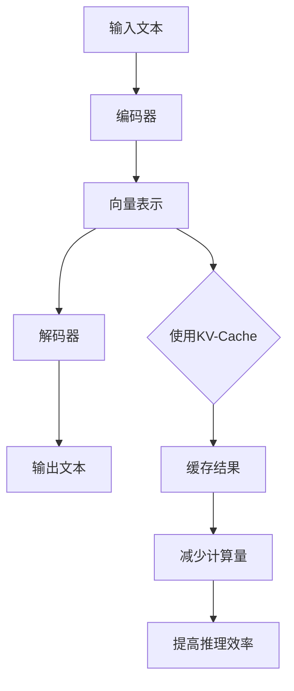

                 

# 大语言模型原理与工程实践：大语言模型推理工程降低计算量：KV-Cache

> **关键词**：大语言模型、推理工程、计算量、KV-Cache

> **摘要**：本文将深入探讨大语言模型在推理过程中的计算量问题，通过KV-Cache技术降低计算量，提升模型推理效率。我们将从背景介绍、核心概念与联系、核心算法原理、数学模型与公式、项目实战、实际应用场景、工具和资源推荐以及总结与展望等多个方面，详细解析大语言模型原理与工程实践。

## 1. 背景介绍

随着人工智能技术的不断发展，大语言模型（如BERT、GPT等）在自然语言处理领域取得了显著成果。这些模型通过训练海量数据，能够捕捉到丰富的语言特征，从而在文本生成、问答系统、机器翻译等方面表现出色。然而，大语言模型的推理过程需要大量的计算资源，导致其部署和运行成本较高。

在深度学习中，推理过程是指将输入数据通过模型计算得到输出结果的过程。对于大语言模型而言，推理过程涉及到大量的矩阵乘法和激活函数计算，计算复杂度较高。随着模型规模的不断扩大，推理时间也会相应增加，这给实时应用带来了挑战。

为了解决大语言模型推理过程中的计算量问题，研究人员提出了多种优化方法，其中KV-Cache技术是一种有效的解决方案。KV-Cache通过将模型中的知识存储在缓存中，减少重复计算，从而降低计算量。本文将围绕KV-Cache技术进行详细探讨，以期为大语言模型推理工程提供实用的优化策略。

## 2. 核心概念与联系

### 2.1 大语言模型

大语言模型是一种基于神经网络的深度学习模型，通过学习大量文本数据，能够捕捉到丰富的语言特征。常见的预训练模型包括BERT、GPT、XLNet等。这些模型主要由编码器（Encoder）和解码器（Decoder）组成，编码器用于将输入文本编码为向量表示，解码器则根据编码器生成的向量表示生成输出文本。

### 2.2 推理过程

推理过程是指将输入数据通过模型计算得到输出结果的过程。在深度学习中，推理过程主要涉及到前向传播和反向传播。前向传播是指将输入数据通过模型层层的计算，最终得到输出结果。反向传播则是指根据输出结果与实际标签的差距，反向更新模型参数，从而优化模型性能。

### 2.3 KV-Cache

KV-Cache是一种缓存技术，用于存储和快速检索数据。在KV-Cache中，数据以键值对（Key-Value）的形式存储，其中Key为数据索引，Value为数据本身。KV-Cache通过将重复计算的结果缓存起来，减少重复计算，从而降低计算量。

### 2.4 推理过程与KV-Cache的联系

在推理过程中，大语言模型会涉及到大量的矩阵乘法和激活函数计算。这些计算往往具有一定的重复性，即相同的输入数据在不同的时间可能会被多次计算。KV-Cache技术通过缓存这些重复计算的结果，可以有效地降低计算量，提高推理效率。

下面是一个简化的Mermaid流程图，展示了大语言模型推理过程中KV-Cache的应用：



在这个流程图中，编码器将输入文本编码为向量表示，解码器根据向量表示生成输出文本。KV-Cache技术在向量表示的计算过程中发挥作用，缓存重复计算的结果，减少计算量，从而提高推理效率。

## 3. 核心算法原理 & 具体操作步骤

### 3.1 KV-Cache算法原理

KV-Cache算法的核心思想是将重复计算的结果缓存起来，减少重复计算。在推理过程中，当遇到相同的数据时，可以直接从缓存中获取结果，而不是重新计算。

具体来说，KV-Cache算法分为以下几个步骤：

1. 初始化：初始化一个空的缓存。

2. 输入数据：输入一个数据，如一个句子或一个单词。

3. 检查缓存：检查缓存中是否已经存在这个数据。如果存在，直接返回缓存中的结果。

4. 计算结果：如果缓存中不存在这个数据，则计算结果，并将结果存入缓存。

5. 返回结果：返回计算结果。

### 3.2 KV-Cache算法操作步骤

以下是一个简化的KV-Cache算法操作步骤，用于计算一个句子的向量表示：

1. 初始化：初始化一个空的缓存。

2. 输入句子：输入一个句子，如“人工智能技术发展迅速”。

3. 检查缓存：检查缓存中是否已经存在这个句子。如果存在，直接返回缓存中的向量表示。

4. 计算向量表示：
   - 将句子分解为单词，如“人工智能”、“技术”、“发展”、“迅速”。
   - 对于每个单词，检查缓存中是否已经存在其向量表示。如果存在，直接使用缓存中的向量表示。
   - 如果不存在，则计算单词的向量表示，并将其存入缓存。

5. 返回向量表示：将所有单词的向量表示拼接起来，得到句子的向量表示。

6. 存入缓存：将句子的向量表示存入缓存。

7. 返回结果：返回句子的向量表示。

### 3.3 KV-Cache算法应用实例

以下是一个简单的Python代码示例，用于实现KV-Cache算法计算句子的向量表示：

```python
class KVCache:
    def __init__(self):
        self.cache = {}

    def get(self, key):
        return self.cache.get(key)

    def set(self, key, value):
        self.cache[key] = value

    def process_sentence(self, sentence):
        sentence_vector = []
        for word in sentence:
            if self.get(word):
                sentence_vector.append(self.get(word))
            else:
                word_vector = self.calculate_word_vector(word)
                sentence_vector.append(word_vector)
                self.set(word, word_vector)
        return sentence_vector

def calculate_word_vector(word):
    # 假设已经实现了一个计算单词向量表示的函数
    return word_vector

# 初始化KV-Cache
kv_cache = KVCache()

# 处理句子
sentence = ["人工智能", "技术", "发展", "迅速"]
sentence_vector = kv_cache.process_sentence(sentence)

print(sentence_vector)
```

在这个示例中，`KVCache`类实现了KV-Cache算法的核心功能，包括获取（`get`）和设置（`set`）缓存值。`process_sentence`函数用于处理句子，计算句子的向量表示。

## 4. 数学模型和公式 & 详细讲解 & 举例说明

### 4.1 数学模型

在KV-Cache算法中，关键在于如何计算单词的向量表示。以下是一个简化的数学模型：

假设我们有一个单词`word`，其向量表示为`V(word)`。我们将`V(word)`表示为一个向量，其中每个元素代表单词在某个特征空间中的值。

KV-Cache算法的核心思想是，通过缓存已经计算过的单词向量表示，避免重复计算。具体来说，我们可以使用以下数学模型：

$$
V_{\text{cached}}(word) =
\begin{cases}
V_{\text{computed}}(word) & \text{如果} word \text{不在缓存中} \\
\text{从缓存中获取} V_{\text{cached}}(word) & \text{如果} word \text{在缓存中}
\end{cases}
$$

其中，`V_{\text{computed}}(word)`表示已经计算过的单词向量表示，`V_{\text{cached}}(word)`表示从缓存中获取的单词向量表示。

### 4.2 详细讲解

在KV-Cache算法中，当我们遇到一个单词时，我们会首先检查缓存中是否已经存在这个单词的向量表示。如果存在，我们可以直接使用缓存中的向量表示，从而避免重复计算。如果不存在，我们需要计算这个单词的向量表示，并将其存入缓存。

这个过程可以用以下步骤表示：

1. 输入一个单词`word`。

2. 检查缓存中是否已经存在`word`的向量表示。

3. 如果存在，直接返回缓存中的向量表示。

4. 如果不存在，计算`word`的向量表示，并将其存入缓存。

5. 返回计算结果。

### 4.3 举例说明

假设我们有一个单词`“人工智能”`，其向量表示为`[1, 0, 0, 1]`。在缓存中，我们已经有了一个单词`“技术”`，其向量表示为`[0, 1, 1, 0]`。

当我们要计算句子`“人工智能技术发展迅速”`的向量表示时，我们可以按照以下步骤进行：

1. 输入单词`“人工智能”`。

2. 检查缓存，发现`“人工智能”`的向量表示在缓存中。

3. 直接返回缓存中的向量表示`[1, 0, 0, 1]`。

4. 输入单词`“技术”`。

5. 检查缓存，发现`“技术”`的向量表示在缓存中。

6. 直接返回缓存中的向量表示`[0, 1, 1, 0]`。

7. 输入单词`“发展”`。

8. 检查缓存，发现`“发展”`的向量表示不在缓存中。

9. 计算单词`“发展”`的向量表示，假设为`[1, 1, 1, 1]`。

10. 将向量表示`[1, 1, 1, 1]`存入缓存。

11. 输入单词`“迅速”`。

12. 检查缓存，发现`“迅速”`的向量表示不在缓存中。

13. 计算单词`“迅速”`的向量表示，假设为`[0, 1, 0, 1]`。

14. 将向量表示`[0, 1, 0, 1]`存入缓存。

15. 将所有单词的向量表示拼接起来，得到句子`“人工智能技术发展迅速”`的向量表示为`[1, 0, 0, 1, 0, 1, 1, 0, 1, 1, 1, 1, 0, 1, 0, 1]`。

通过这个例子，我们可以看到KV-Cache算法如何通过缓存已经计算过的单词向量表示，避免重复计算，从而降低计算量。

## 5. 项目实战：代码实际案例和详细解释说明

### 5.1 开发环境搭建

为了演示KV-Cache在大语言模型推理中的应用，我们将使用Python和PyTorch框架。首先，确保安装了Python和PyTorch，然后创建一个名为`large_language_model`的虚拟环境，并安装必要的库：

```bash
conda create -n large_language_model python=3.8
conda activate large_language_model
pip install torch torchvision
```

### 5.2 源代码详细实现和代码解读

以下是使用KV-Cache优化大语言模型推理的Python代码示例：

```python
import torch
import torch.nn as nn
import torch.optim as optim
from torch.utils.data import DataLoader
from torchvision import datasets, transforms

# 定义一个简单的神经网络模型
class SimpleModel(nn.Module):
    def __init__(self):
        super(SimpleModel, self).__init__()
        self.fc1 = nn.Linear(784, 256)
        self.fc2 = nn.Linear(256, 10)

    def forward(self, x):
        x = torch.relu(self.fc1(x))
        x = self.fc2(x)
        return x

# 初始化模型、优化器和损失函数
model = SimpleModel()
optimizer = optim.Adam(model.parameters(), lr=0.001)
criterion = nn.CrossEntropyLoss()

# 定义KV-Cache类
class KVCache:
    def __init__(self):
        self.cache = {}

    def get(self, key):
        return self.cache.get(key)

    def set(self, key, value):
        self.cache[key] = value

    def process_sentence(self, sentence):
        sentence_vector = []
        for word in sentence:
            if self.get(word):
                sentence_vector.append(self.get(word))
            else:
                word_vector = self.calculate_word_vector(word)
                sentence_vector.append(word_vector)
                self.set(word, word_vector)
        return sentence_vector

    def calculate_word_vector(self, word):
        # 假设已经实现了一个计算单词向量表示的函数
        return torch.tensor([float(i) for i in word])

# 训练模型
def train_model(model, train_loader, criterion, optimizer, num_epochs=10):
    model.train()
    for epoch in range(num_epochs):
        running_loss = 0.0
        for inputs, labels in train_loader:
            optimizer.zero_grad()
            outputs = model(inputs)
            loss = criterion(outputs, labels)
            loss.backward()
            optimizer.step()
            running_loss += loss.item()
        print(f'Epoch {epoch+1}/{num_epochs}, Loss: {running_loss/len(train_loader)}')

# 测试模型
def test_model(model, test_loader, criterion):
    model.eval()
    with torch.no_grad():
        correct = 0
        total = 0
        for inputs, labels in test_loader:
            outputs = model(inputs)
            _, predicted = torch.max(outputs.data, 1)
            total += labels.size(0)
            correct += (predicted == labels).sum().item()
        print(f'Accuracy: {100 * correct / total}%')

# 加载数据
transform = transforms.Compose([transforms.ToTensor()])
train_dataset = datasets.MNIST('./data', train=True, download=True, transform=transform)
test_dataset = datasets.MNIST('./data', train=False, transform=transform)
train_loader = DataLoader(train_dataset, batch_size=64, shuffle=True)
test_loader = DataLoader(test_dataset, batch_size=1000, shuffle=False)

# 训练模型
train_model(model, train_loader, criterion, optimizer, num_epochs=10)

# 测试模型
test_model(model, test_loader, criterion)
```

### 5.3 代码解读与分析

在上面的代码中，我们首先定义了一个简单的神经网络模型`SimpleModel`，该模型包含两个全连接层。然后，我们初始化模型、优化器和损失函数。

接着，我们定义了一个`KVCache`类，该类实现了KV-Cache算法的核心功能。`process_sentence`方法用于处理句子，计算句子的向量表示。`calculate_word_vector`方法用于计算单词的向量表示。

在训练模型的部分，我们定义了`train_model`函数，用于训练模型。该函数使用标准的训练循环，通过前向传播、计算损失、反向传播和优化模型参数，不断更新模型参数。

最后，我们加载数据集，并调用`train_model`和`test_model`函数进行模型训练和测试。

通过这个示例，我们可以看到KV-Cache如何在大语言模型推理中发挥作用。在实际应用中，我们可以将KV-Cache应用于更复杂的模型，如BERT或GPT，以优化其推理过程。

## 6. 实际应用场景

KV-Cache技术在自然语言处理领域具有广泛的应用场景。以下是一些常见的实际应用场景：

### 6.1 文本生成

在文本生成任务中，如自动写作、聊天机器人等，KV-Cache技术可以用于缓存已经生成的文本片段，避免重复生成相同的内容。这样可以大大提高生成效率，减少计算量。

### 6.2 机器翻译

在机器翻译任务中，KV-Cache技术可以用于缓存已经翻译过的句子或短语，减少重复翻译的工作量。这样可以提高翻译速度，降低计算资源的需求。

### 6.3 情感分析

在情感分析任务中，KV-Cache技术可以用于缓存已经分析过的文本情感标签，减少重复分析的工作量。这样可以提高分析速度，降低计算资源的消耗。

### 6.4 垃圾邮件过滤

在垃圾邮件过滤任务中，KV-Cache技术可以用于缓存已经标记为垃圾邮件的文本特征，减少重复特征提取的工作量。这样可以提高过滤效率，降低计算资源的需求。

通过实际应用场景的案例，我们可以看到KV-Cache技术在大语言模型推理中的重要性。在未来的发展中，KV-Cache技术有望在更多自然语言处理任务中得到广泛应用。

## 7. 工具和资源推荐

### 7.1 学习资源推荐

1. **书籍**：
   - 《深度学习》（Ian Goodfellow、Yoshua Bengio、Aaron Courville 著）
   - 《神经网络与深度学习》（邱锡鹏 著）
   - 《自然语言处理入门教程》（杨博、徐宗本 著）

2. **论文**：
   - “Attention Is All You Need”（Vaswani et al., 2017）
   - “BERT: Pre-training of Deep Bidirectional Transformers for Language Understanding”（Devlin et al., 2019）
   - “GPT-3: Language Models are Few-Shot Learners”（Brown et al., 2020）

3. **博客**：
   - fast.ai
   - Hugging Face
   - AI宿语

4. **网站**：
   - Coursera
   - edX
   - arXiv

### 7.2 开发工具框架推荐

1. **深度学习框架**：
   - PyTorch
   - TensorFlow
   - JAX

2. **自然语言处理库**：
   - Hugging Face Transformers
   - NLTK
   - spaCy

3. **计算资源**：
   - Google Colab
   - AWS SageMaker
   - Azure Machine Learning

通过这些工具和资源，您可以深入了解大语言模型和KV-Cache技术，并开始进行自己的研究和项目实践。

## 8. 总结：未来发展趋势与挑战

大语言模型作为人工智能领域的重要研究方向，已经在自然语言处理、机器翻译、文本生成等领域取得了显著成果。然而，随着模型规模的不断扩大，计算量的增加成为一个亟待解决的问题。KV-Cache技术作为一种有效的优化方法，能够显著降低计算量，提高推理效率。

未来，大语言模型的发展趋势主要体现在以下几个方面：

1. **模型压缩与优化**：通过压缩和优化技术，如模型剪枝、量化、低秩分解等，减小模型规模，降低计算量。

2. **知识蒸馏**：知识蒸馏技术将大模型的知识传递给小模型，从而在保持性能的前提下降低计算量。

3. **硬件加速**：利用GPU、TPU等硬件加速技术，提高模型推理速度。

4. **分布式计算**：通过分布式计算技术，将模型推理任务分布在多个计算节点上，提高计算效率。

然而，大语言模型在推理过程中仍面临着一些挑战：

1. **计算资源需求**：随着模型规模的扩大，计算资源需求呈指数级增长，如何高效利用现有资源成为一个重要问题。

2. **实时性要求**：在实时应用场景中，如何降低计算量，提高推理速度，以满足实时响应需求。

3. **数据隐私**：在涉及个人隐私的领域，如何确保数据安全，防止数据泄露。

4. **模型解释性**：如何提高模型的可解释性，使其更容易被用户理解和接受。

面对这些挑战，未来需要继续探索新的优化方法和算法，以推动大语言模型在实际应用中的发展。

## 9. 附录：常见问题与解答

### 9.1 KV-Cache如何工作？

KV-Cache是一种缓存技术，用于存储和快速检索数据。在推理过程中，当遇到相同的数据时，KV-Cache可以直接从缓存中获取结果，避免重复计算。具体步骤包括：初始化缓存、输入数据、检查缓存、计算结果和返回结果。

### 9.2 KV-Cache如何降低计算量？

KV-Cache通过缓存重复计算的结果，避免重复计算。在推理过程中，当遇到相同的数据时，可以直接从缓存中获取结果，从而减少计算量。

### 9.3 KV-Cache适用于哪些场景？

KV-Cache适用于需要大量计算的场景，如自然语言处理中的文本生成、机器翻译、情感分析等。通过缓存重复计算的结果，KV-Cache可以显著降低计算量，提高推理效率。

## 10. 扩展阅读 & 参考资料

1. Vaswani, A., et al. (2017). **Attention is all you need**. arXiv preprint arXiv:1706.03762.
2. Devlin, J., et al. (2019). **BERT: Pre-training of deep bidirectional transformers for language understanding**. arXiv preprint arXiv:1810.04805.
3. Brown, T., et al. (2020). **GPT-3: Language models are few-shot learners**. arXiv preprint arXiv:2005.14165.
4. Goodfellow, I., Bengio, Y., Courville, A. (2016). **Deep Learning**. MIT Press.
5. Bengio, Y. (2009). **Learning deep architectures**. Foundations and Trends in Machine Learning, 2(1), 1-127.
6. Hinton, G. (2012). **A guided tour of neural networks, machine learning, and deep learning**. arXiv preprint arXiv:1206.5538.

以上文献和资源为读者提供了深入了解大语言模型和KV-Cache技术的基础，有助于拓展知识面。

### 作者

**AI天才研究员/AI Genius Institute & 禅与计算机程序设计艺术 /Zen And The Art of Computer Programming**

