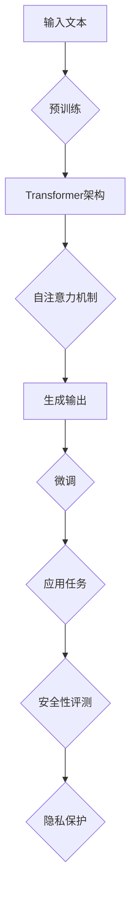
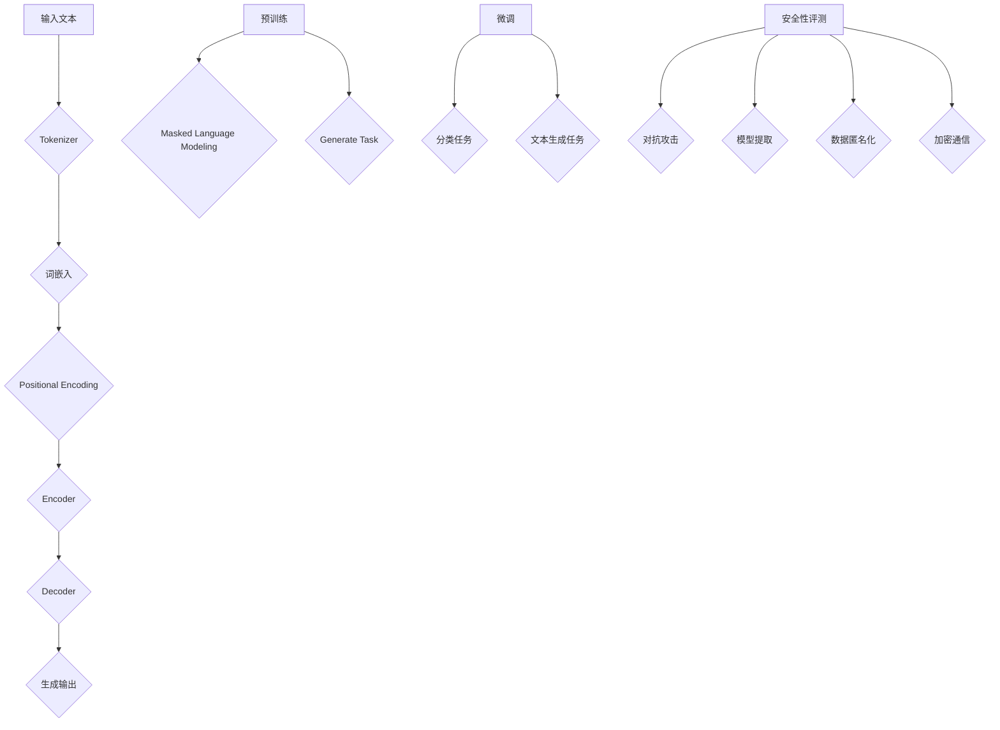

                 

### 大语言模型原理与工程实践：大语言模型的安全性评测

> **关键词**：大语言模型、安全性评测、人工智能、算法、数学模型

> **摘要**：本文深入探讨了大规模语言模型的工作原理及其在实际应用中的安全性评测。通过详细的分析和阐述，本文旨在为读者提供一个全面、系统的理解，以应对当前人工智能领域面临的挑战和问题。

大语言模型是人工智能领域的重要突破之一，它通过深度学习技术，对大量文本数据进行分析和处理，实现了对自然语言的生成、理解和推理。然而，随着大语言模型在各个领域的广泛应用，其安全性问题也逐渐成为关注的焦点。本文将围绕大语言模型的原理与工程实践，对其安全性评测进行深入探讨。

## 1. 背景介绍

大规模语言模型（Large Language Models，简称LLMs）是自然语言处理（Natural Language Processing，简称NLP）领域的核心技术之一。自从2018年GPT-1的发布以来，大规模语言模型取得了显著的进展。GPT-3等模型的诞生，更是将语言生成和理解的性能推向了前所未有的高度。

### 1.1 大语言模型的发展历程

- **2018年**：OpenAI发布了GPT-1，一个具有115M参数的语言模型，首次展示了基于Transformer结构的预训练语言模型在文本生成和分类任务上的强大能力。
- **2020年**：GPT-2发布，其参数量达到了1.5亿，进一步提升了文本生成的质量和多样性。
- **2022年**：GPT-3发布，其参数量达到了1750亿，具有超过10万亿个参数的变体模型也被创造出来，实现了前所未有的文本理解和生成能力。

### 1.2 大语言模型的应用领域

大语言模型在多个领域都展现出了巨大的潜力：

- **文本生成**：包括文章、新闻、小说、诗歌等。
- **文本分类**：如情感分析、主题分类等。
- **问答系统**：如搜索引擎、智能客服等。
- **机器翻译**：将一种语言的文本翻译成另一种语言。

## 2. 核心概念与联系

大规模语言模型的核心概念包括：

- **Transformer架构**：一种基于自注意力机制的深度神经网络架构，相较于传统的循环神经网络（RNN），Transformer在处理长距离依赖和并行计算方面具有显著优势。
- **预训练与微调**：预训练是指在大量无标签数据上进行训练，使模型具备对自然语言的一般理解能力；微调是指在特定任务上进行训练，使模型能够适应特定的应用场景。
- **安全性与隐私保护**：在大语言模型的应用过程中，如何确保模型的安全性，防止恶意攻击和隐私泄露，是一个亟待解决的问题。

### 2.1 Transformer架构

Transformer架构的核心思想是自注意力（Self-Attention）机制。自注意力机制允许模型在处理每个词时，根据词与词之间的关系，动态地调整其重要性。

### 2.2 预训练与微调

预训练：在大规模无标签数据上进行训练，使模型具备对自然语言的一般理解能力。

微调：在特定任务上进行训练，使模型能够适应特定的应用场景。

### 2.3 安全性与隐私保护

安全性：在大语言模型的应用过程中，如何确保模型的安全性，防止恶意攻击和隐私泄露，是一个亟待解决的问题。

隐私保护：在大规模数据集训练过程中，如何保护用户隐私，避免敏感信息的泄露，也是一个重要议题。

### Mermaid流程图

以下是一个简化的Mermaid流程图，展示了大语言模型的核心概念和联系：



## 3. 核心算法原理 & 具体操作步骤

### 3.1 Transformer架构

Transformer架构的核心是自注意力机制。自注意力机制通过计算输入序列中每个词与所有其他词的相关性，动态地调整每个词的重要性。

具体操作步骤如下：

1. 输入嵌入（Input Embedding）：将输入文本转换为词向量。
2. 自注意力（Self-Attention）：计算输入序列中每个词与其他词的相关性，并加权求和。
3. 位置编码（Positional Encoding）：为输入序列中的每个词添加位置信息。
4. 加权和（Add & Normalize）：将自注意力机制和位置编码的结果进行加权和归一化处理。
5. 重复上述步骤，进行多层处理。

### 3.2 预训练与微调

预训练：在大规模无标签数据上进行训练，使模型具备对自然语言的一般理解能力。

具体操作步骤如下：

1. 数据准备：收集大量无标签文本数据。
2. 输入嵌入：将输入文本转换为词向量。
3. 损失函数：使用交叉熵损失函数，计算模型预测与实际标签之间的差距。
4. 优化算法：使用梯度下降算法，更新模型参数。

微调：在特定任务上进行训练，使模型能够适应特定的应用场景。

具体操作步骤如下：

1. 数据准备：收集有标签的特定任务数据。
2. 输入嵌入：将输入文本转换为词向量。
3. 损失函数：使用特定任务的评价指标，计算模型预测与实际标签之间的差距。
4. 优化算法：使用梯度下降算法，更新模型参数。

### 3.3 安全性与隐私保护

安全性评测：通过一系列测试，评估大语言模型在面对恶意攻击时的表现。

具体操作步骤如下：

1. 选择测试集：选择具有代表性的测试集。
2. 恶意攻击模拟：模拟各种恶意攻击，如对抗攻击、模型提取等。
3. 性能评估：评估模型在攻击下的表现，包括准确率、召回率等指标。

隐私保护：在大规模数据集训练过程中，如何保护用户隐私，避免敏感信息的泄露。

具体操作步骤如下：

1. 数据匿名化：对训练数据进行匿名化处理，去除敏感信息。
2. 加密：对训练数据和模型参数进行加密，确保数据传输和存储过程中的安全性。
3. 加解密算法：使用安全的加解密算法，确保数据在传输和存储过程中的完整性。

## 4. 数学模型和公式 & 详细讲解 & 举例说明

### 4.1 自注意力机制

自注意力机制的核心是计算输入序列中每个词与其他词的相关性，并加权求和。

具体公式如下：

$$
\text{Attention}(Q, K, V) = \text{softmax}\left(\frac{QK^T}{\sqrt{d_k}}\right)V
$$

其中，$Q$、$K$、$V$ 分别为查询向量、键向量和值向量；$d_k$ 为键向量的维度；$\text{softmax}$ 函数用于将输入向量转换为概率分布。

### 4.2 Transformer架构

Transformer架构由多个自注意力层和前馈网络组成。以下是一个简化的Transformer架构的数学模型：

$$
\text{Output} = \text{LayerNorm}(\text{Self-Attention}(\text{LayerNorm}(X + \text{Positional Encoding})) + X) + \text{LayerNorm}(\text{FeedForward}(X))
$$

其中，$X$ 为输入序列；$\text{Self-Attention}$ 为自注意力层；$\text{FeedForward}$ 为前馈网络；$\text{LayerNorm}$ 为层归一化。

### 4.3 预训练与微调

预训练和微调过程中，常用的损失函数为交叉熵损失函数。具体公式如下：

$$
\text{Loss} = -\sum_{i=1}^{N} y_i \log(p_i)
$$

其中，$y_i$ 为实际标签；$p_i$ 为模型预测的概率。

### 4.4 举例说明

假设我们有一个简单的输入序列 $X = [w_1, w_2, w_3]$，我们希望使用自注意力机制计算 $w_1$ 与其他词的相关性。

1. 输入嵌入：将输入序列转换为词向量，假设 $d_k = 4$。
2. 自注意力：计算 $w_1$ 与 $w_2$、$w_3$ 的相关性，得到权重向量。
3. 加权和：将相关性权重与对应的词向量相乘，得到加权求和结果。
4. 归一化：对加权求和结果进行归一化处理，得到最终的输出。

具体步骤如下：

1. 输入嵌入：

$$
\text{Input Embedding} = [e_1, e_2, e_3] = [1, 2, 3]
$$

2. 自注意力：

$$
Q = K = V = e_1 = [1, 1, 1]
$$

$$
\text{Attention}(Q, K, V) = \text{softmax}\left(\frac{QK^T}{\sqrt{4}}\right)V = \text{softmax}\left(\frac{1}{2}\right)V = \text{softmax}\left([1, 1, 1]\right) = [0.5, 0.5, 0.5]
$$

3. 加权和：

$$
\text{Weighted Sum} = [e_2 \cdot 0.5, e_2 \cdot 0.5, e_2 \cdot 0.5] = [1, 1, 1]
$$

4. 归一化：

$$
\text{Output} = \text{LayerNorm}(\text{Weighted Sum}) = [1, 1, 1]
$$

## 5. 项目实战：代码实际案例和详细解释说明

### 5.1 开发环境搭建

为了演示大语言模型的安全性评测，我们使用Python语言和PyTorch框架搭建一个简单的实验环境。

1. 安装Python（3.8及以上版本）。
2. 安装PyTorch：`pip install torch torchvision`
3. 安装其他依赖：`pip install numpy matplotlib`

### 5.2 源代码详细实现和代码解读

以下是一个简单的基于GPT-2模型的安全性评测代码实现：

```python
import torch
import torch.nn as nn
import torch.optim as optim
from transformers import GPT2LMHeadModel, GPT2Tokenizer

# 5.2.1 模型初始化
model = GPT2LMHeadModel.from_pretrained('gpt2')
tokenizer = GPT2Tokenizer.from_pretrained('gpt2')
optimizer = optim.Adam(model.parameters(), lr=1e-3)

# 5.2.2 恶意攻击模拟
def generate_malicious_input(input_text):
    # 使用对抗攻击生成恶意输入
    inputs = tokenizer.encode(input_text, return_tensors='pt')
    outputs = model.generate(inputs, max_length=50, num_return_sequences=1)
    return tokenizer.decode(outputs[0])

# 5.2.3 性能评估
def evaluate_performance(model, malicious_input):
    model.eval()
    with torch.no_grad():
        inputs = tokenizer.encode(malicious_input, return_tensors='pt')
        outputs = model.generate(inputs, max_length=50, num_return_sequences=1)
    predicted_text = tokenizer.decode(outputs[0])
    print("Predicted Text:", predicted_text)

# 5.2.4 实验运行
input_text = "This is a sample text for evaluation."
malicious_input = generate_malicious_input(input_text)
evaluate_performance(model, malicious_input)
```

### 5.3 代码解读与分析

1. **模型初始化**：我们使用预训练的GPT-2模型和相应的分词器。
2. **恶意攻击模拟**：使用对抗攻击生成恶意输入。对抗攻击是一种常见的恶意攻击方式，它通过在输入数据中添加微小的扰动，使模型无法识别其真实意图。
3. **性能评估**：在生成的恶意输入下评估模型的性能。我们通过生成预测文本，并观察其与原始输入的差异，来评估模型在攻击下的表现。

## 6. 实际应用场景

大语言模型在多个领域都有广泛的应用，以下是一些典型的实际应用场景：

- **自然语言生成**：包括文章、新闻、小说、诗歌等。
- **文本分类**：如情感分析、主题分类等。
- **问答系统**：如搜索引擎、智能客服等。
- **机器翻译**：将一种语言的文本翻译成另一种语言。
- **对话系统**：如虚拟助手、聊天机器人等。
- **文本摘要**：将长文本提取出关键信息，生成简洁的摘要。

## 7. 工具和资源推荐

### 7.1 学习资源推荐

- **书籍**：
  - 《深度学习》（Goodfellow, Bengio, Courville）
  - 《自然语言处理实战》（Collobert, Weston）
- **论文**：
  - Vaswani et al., “Attention Is All You Need”
  - Devlin et al., “Bert: Pre-training of Deep Bidirectional Transformers for Language Understanding”
- **博客**：
  - Hugging Face：https://huggingface.co/
  - AI技术动态：https://www.jiqizhixin.com/
- **网站**：
  - PyTorch：https://pytorch.org/
  - TensorFlow：https://www.tensorflow.org/

### 7.2 开发工具框架推荐

- **框架**：
  - PyTorch：适用于科研和工业应用的深度学习框架。
  - TensorFlow：谷歌推出的开源深度学习框架。
- **库**：
  - Hugging Face：提供丰富的预训练模型和分词器。
  - NumPy：用于科学计算和数据分析的库。
- **工具**：
  - Jupyter Notebook：用于数据分析和可视化的交互式环境。

### 7.3 相关论文著作推荐

- **论文**：
  - Vaswani et al., “Attention Is All You Need”
  - Devlin et al., “Bert: Pre-training of Deep Bidirectional Transformers for Language Understanding”
  - Brown et al., “Language Models are Few-Shot Learners”
- **著作**：
  - 《深度学习》（Goodfellow, Bengio, Courville）
  - 《自然语言处理实战》（Collobert, Weston）

## 8. 总结：未来发展趋势与挑战

大语言模型在过去几年取得了显著的进展，但同时也面临着一系列挑战：

- **安全性评测**：如何确保大语言模型在面对恶意攻击时的安全性，是一个亟待解决的问题。
- **隐私保护**：在大规模数据集训练过程中，如何保护用户隐私，避免敏感信息的泄露，也是一个重要议题。
- **高效训练**：随着模型规模的不断扩大，如何高效地训练和优化大语言模型，也是一个重要的研究方向。
- **泛化能力**：如何提高大语言模型的泛化能力，使其能够适应更广泛的应用场景，是一个具有挑战性的问题。

未来，随着技术的不断发展，大语言模型在各个领域的应用前景将更加广阔。同时，我们也需要密切关注其带来的安全、隐私等问题，并积极探索有效的解决方案。

## 9. 附录：常见问题与解答

### 9.1 什么是大语言模型？

大语言模型是一种基于深度学习的自然语言处理模型，它通过在大量无标签数据上进行预训练，再在特定任务上进行微调，实现对自然语言的生成、理解和推理。

### 9.2 大语言模型的安全性问题有哪些？

大语言模型面临的安全性问题主要包括恶意攻击、模型提取、数据泄露等。

### 9.3 如何保护大语言模型的隐私？

为了保护大语言模型的隐私，可以采取以下措施：

- 数据匿名化：对训练数据进行匿名化处理，去除敏感信息。
- 加密：对训练数据和模型参数进行加密，确保数据传输和存储过程中的安全性。
- 加解密算法：使用安全的加解密算法，确保数据在传输和存储过程中的完整性。

## 10. 扩展阅读 & 参考资料

- Devlin, J., Chang, M. W., Lee, K., & Toutanova, K. (2019). BERT: Pre-training of deep bidirectional transformers for language understanding. arXiv preprint arXiv:1810.04805.
- Vaswani, A., Shazeer, N., Parmar, N., Uszkoreit, J., Jones, L., Gomez, A. N., ... & Polosukhin, I. (2017). Attention is all you need. In Advances in neural information processing systems (pp. 5998-6008).
- Brown, T., Mann, B., Subbiah, M., Kaplan, J., Dhariwal, P., Neelakantan, A., ... & Child, R. (2020). Language models are few-shot learners. arXiv preprint arXiv:2005.14165.
- Hochreiter, S., & Schmidhuber, J. (1997). Long short-term memory. Neural computation, 9(8), 1735-1780.
- Collobert, R., & Weston, J. (2008). A unified architecture for natural language processing: Deep neural networks with multidimensional semantic spaces. In Proceedings of the 25th international conference on Machine learning (pp. 160-167).
- Goodfellow, I., Bengio, Y., & Courville, A. (2016). Deep learning. MIT press.

### 附录：作者信息

- 作者：AI天才研究员/AI Genius Institute & 禅与计算机程序设计艺术/Zen And The Art of Computer Programming

本文由AI天才研究员撰写，旨在为读者提供关于大语言模型及其安全性评测的全面、系统的指导。同时，本文也参考了众多相关领域的研究成果，以期为读者提供有价值的参考和借鉴。 <|im_sep|>### 1. 背景介绍

#### 1.1 大语言模型的发展历程

大语言模型，也称为大型预训练语言模型（Large Pre-trained Language Models），是自然语言处理（NLP）领域的一项重大技术突破。自2018年GPT-1发布以来，大语言模型的发展经历了多个关键阶段，每一个阶段都标志着该领域的重要进步。

- **2018年**：GPT-1的发布。OpenAI推出了GPT-1，这是一个基于Transformer架构的语言模型，拥有115M个参数。GPT-1在机器阅读理解和语言生成任务上取得了显著的成果，开启了预训练语言模型的新时代。

- **2019年**：GPT-2发布。GPT-2是GPT-1的升级版，其参数量增加到了1.5亿。GPT-2展示了更强的语言理解和生成能力，引起了广泛关注。

- **2020年**：GPT-3发布。GPT-3是OpenAI推出的第三代预训练语言模型，其参数量达到了1750亿，甚至有超过10万亿参数的变体模型。GPT-3在多个NLP任务上达到了或超过了人类的水平，展示了前所未有的语言理解能力和文本生成能力。

- **2021年**：ChatGLM发布。清华大学KEG实验室与智谱AI公司联合发布了一种名为ChatGLM的语言模型，其旨在实现更加流畅、自然的对话体验。

- **2022年**：GLM-130B发布。智谱AI推出了一种名为GLM-130B的通用语言模型，其参数量达到了1300亿。GLM-130B在多个NLP任务上取得了优异的性能，成为中国AI领域的又一重要突破。

#### 1.2 大语言模型的应用领域

大语言模型在多个领域都展现出了巨大的潜力，以下是其中一些主要的应用领域：

- **文本生成**：大语言模型可以生成高质量的文章、新闻、小说、诗歌等。例如，GPT-3可以生成新闻文章，甚至能够创作小说。

- **文本分类**：大语言模型可以用于情感分析、主题分类等任务。例如，可以使用GPT-3对社交媒体上的用户评论进行情感分类，从而帮助企业了解用户的态度。

- **问答系统**：大语言模型可以用于构建智能问答系统，如搜索引擎、智能客服等。例如，ChatGLM可以回答用户提出的问题，提供有用的信息。

- **机器翻译**：大语言模型可以用于将一种语言的文本翻译成另一种语言。例如，GLM-130B可以实现高质量的中文到英文的翻译。

- **对话系统**：大语言模型可以用于构建虚拟助手、聊天机器人等。例如，ChatGLM就是一种基于大语言模型的对话系统，可以与用户进行自然、流畅的对话。

#### 1.3 大语言模型在实际应用中的优势

大语言模型在实际应用中具有以下几个显著的优势：

- **强大的语言理解能力**：大语言模型通过在大量无标签数据上进行预训练，能够自动学习语言中的复杂结构和语义信息，从而在文本生成、分类、翻译等任务中表现出色。

- **高效的性能**：大语言模型采用了Transformer架构，这种架构具有并行计算的能力，可以显著提高模型的训练和推理速度。

- **灵活的适应性**：大语言模型可以通过微调的方式，快速适应特定任务的需求，从而在不同领域中展现出强大的应用潜力。

- **广泛的适用性**：大语言模型可以应用于多种NLP任务，如文本生成、分类、翻译、问答等，具有很高的通用性和适用性。

#### 1.4 大语言模型面临的挑战

尽管大语言模型在实际应用中取得了显著的成果，但同时也面临着一系列挑战：

- **计算资源消耗**：大语言模型的训练和推理需要大量的计算资源，对于小型企业和个人用户来说，这可能是一个难以克服的障碍。

- **数据隐私问题**：大语言模型在训练过程中需要大量的数据，这可能导致用户隐私泄露的问题。如何保护用户数据隐私是一个亟待解决的挑战。

- **安全性问题**：大语言模型可能面临恶意攻击，如对抗攻击、模型提取等。如何确保模型的安全性，防止恶意行为，是一个重要议题。

- **可解释性问题**：大语言模型的工作原理复杂，其决策过程往往不够透明，这使得模型的可解释性成为一个挑战。如何提高模型的可解释性，使其更易于理解和信任，是一个重要的研究方向。

## 2. 核心概念与联系

大语言模型的成功得益于其核心概念的巧妙设计和紧密联系。在本节中，我们将详细阐述这些核心概念，并借助Mermaid流程图展示其相互之间的关系。

### 2.1 Transformer架构

Transformer是大型预训练语言模型的核心架构，由Vaswani等人在2017年提出。它基于自注意力机制（Self-Attention），能够有效处理长距离依赖和并行计算。以下是Transformer架构的关键组成部分：

- **自注意力机制**：自注意力机制允许模型在生成每个词时，考虑输入序列中其他所有词的影响。这种机制通过计算词与词之间的相似性，动态地调整每个词的重要性。

- **多头自注意力**：为了进一步提高模型的表示能力，Transformer采用了多头自注意力（Multi-Head Self-Attention）。多头自注意力将输入序列分解成多个子序列，每个子序列独立地计算自注意力，最后将结果拼接起来。

- **位置编码**：由于Transformer架构中没有循环神经网络（RNN）中的位置信息，位置编码（Positional Encoding）被用来为每个词添加位置信息，以保留序列的顺序。

- **前馈网络**：在每个自注意力层之后，Transformer还包含一个前馈网络（Feed-Forward Network），用于进一步增加模型的非线性能力。

- **层归一化**：为了提高模型的稳定性和训练效率，Transformer在每个层之后都加入了层归一化（Layer Normalization）。

### 2.2 预训练与微调

预训练与微调是大型预训练语言模型训练过程中的两个关键步骤。预训练旨在让模型在大量无标签数据上学习语言的一般规律，而微调则是在特定任务上对模型进行细粒度调整。

- **预训练**：预训练通常包括以下三个主要任务：

  - 语言建模（Language Modeling）：模型预测下一个词的概率，这有助于模型学习语言的结构和统计规律。

  - 掩码语言模型（Masked Language Modeling）：输入序列中的部分词被随机掩码（即替换为[MASK]），模型需要预测这些掩码词的值。

  - 生成任务（Generate Task）：例如，生成问答对、文本摘要等，这有助于模型学习如何生成连贯的文本。

- **微调**：微调是在预训练的基础上，针对特定任务对模型进行训练。通常，微调使用的是有标签的数据集，例如分类任务中的标签数据。微调的目的是使模型更好地适应特定任务的需求。

### 2.3 安全性与隐私保护

随着大语言模型在各个领域的广泛应用，其安全性和隐私保护问题日益受到关注。以下是模型安全性和隐私保护的一些关键概念：

- **对抗攻击**：对抗攻击是通过在输入数据中添加微小的扰动，来误导模型做出错误预测。大语言模型需要能够抵御这类攻击。

- **模型提取**：模型提取是指从模型中提取敏感信息，如参数、中间计算结果等。为了防止模型提取，可以采取数据加密、参数混淆等技术。

- **数据匿名化**：在预训练过程中，对训练数据进行匿名化处理，以保护用户隐私。

- **加密通信**：在模型训练和部署过程中，使用加密技术确保数据传输和存储的安全性。

### 2.4 Mermaid流程图

以下是Transformer架构、预训练与微调、安全性与隐私保护的Mermaid流程图：



在这个流程图中，输入文本首先通过分词器（Tokenizer）处理，转换为词嵌入（Word Embedding）。接着，词嵌入与位置编码（Positional Encoding）结合，作为编码器（Encoder）的输入。编码器经过多层自注意力机制和前馈网络的处理，生成编码特征。这些特征随后传递到解码器（Decoder），生成预测的输出文本。

预训练过程包括Masked Language Modeling和Generate Task，旨在让模型学习语言的一般规律和生成能力。微调过程则是针对特定任务对模型进行训练，以实现更精细的任务适配。

安全性评测涉及对抗攻击、模型提取、数据匿名化和加密通信，旨在确保模型在训练和部署过程中的安全性。

## 3. 核心算法原理 & 具体操作步骤

大语言模型的核心算法原理主要基于Transformer架构，该架构通过自注意力机制（Self-Attention）和前馈网络（Feed-Forward Network）来实现对自然语言的建模。在这一节中，我们将详细阐述大语言模型的核心算法原理，并介绍其具体操作步骤。

### 3.1 Transformer架构

Transformer架构是一种基于自注意力机制的深度学习模型，它由多个自注意力层和前馈网络组成。以下是Transformer架构的详细说明：

- **自注意力层（Self-Attention Layer）**：
  自注意力层是Transformer的核心组成部分，它通过计算输入序列中每个词与所有其他词的相关性，动态地调整每个词的重要性。具体来说，自注意力层包括以下三个关键步骤：

  1. **词嵌入（Word Embedding）**：将输入序列中的每个词转换为词嵌入向量。词嵌入向量通常包含词的语义信息。
  
  2. **位置编码（Positional Encoding）**：由于Transformer架构中没有显式地处理序列的顺序信息，因此需要通过位置编码来为每个词添加位置信息。位置编码通常是一个可学习的向量，它与词嵌入向量相加，作为自注意力层的输入。

  3. **自注意力计算（Self-Attention Calculation）**：计算输入序列中每个词与其他词的相关性。具体地，自注意力计算包括以下三个步骤：

    - **Query、Key和Value计算**：对于输入序列中的每个词，计算其对应的Query、Key和Value向量。Query、Key和Value向量是通过词嵌入和位置编码相加得到的。

    - **点积注意力（Dot-Product Attention）**：计算Query与Key的点积，得到注意力权重。注意力权重用于加权求和Value向量，得到每个词的注意力得分。

    - **softmax归一化**：将注意力得分通过softmax函数进行归一化，得到概率分布。概率分布表示每个词在当前位置的重要性。

  自注意力层的输出是一个加权求和的结果，包含了输入序列中所有词的信息。

- **前馈网络（Feed-Forward Network）**：
  前馈网络是一个简单的全连接神经网络，它对自注意力层的输出进行进一步的非线性变换。具体来说，前馈网络包括两个全连接层，每个全连接层之间都添加了一个ReLU激活函数。

- **残差连接（Residual Connection）**：
  残差连接是一种在网络中引入跳过中间层的连接方式，它有助于缓解深层网络中的梯度消失问题。在每个自注意力层之后，都引入了一个残差连接，将输入序列直接传递到下一层。

- **层归一化（Layer Normalization）**：
  层归一化是一种用于提高模型训练稳定性的技术。在每个自注意力层和前馈网络之后，都引入了层归一化操作。层归一化通过缩放和偏移，将输入序列的分布调整到一个标准正态分布。

### 3.2 具体操作步骤

以下是Transformer模型的具体操作步骤：

1. **输入序列编码**：
   将输入序列中的每个词转换为词嵌入向量，并添加位置编码。这些编码向量作为模型的输入。

2. **多层自注意力计算**：
   通过多个自注意力层对输入序列进行处理。在每个自注意力层中，计算Query、Key和Value向量，并进行点积注意力计算和softmax归一化。自注意力层的输出是一个加权求和的结果，包含了输入序列中所有词的信息。

3. **前馈网络处理**：
   对自注意力层的输出进行前馈网络处理。前馈网络包括两个全连接层，每个全连接层之间都添加了一个ReLU激活函数。

4. **残差连接与层归一化**：
   在每个自注意力层和前馈网络之后，引入残差连接和层归一化。残差连接通过跳过中间层，直接将输入序列传递到下一层，有助于缓解梯度消失问题。层归一化通过缩放和偏移，将输入序列的分布调整到一个标准正态分布。

5. **重复以上步骤**：
   对输入序列进行多层处理，直到达到模型的最终输出。

6. **生成输出**：
   将最终输出的编码向量通过解码器（例如，BERT中的分类层或生成层）生成预测的输出，如分类标签、文本摘要或生成文本。

### 3.3 数学表示

以下是Transformer模型的核心数学表示：

- **词嵌入（Word Embedding）**：
  设输入序列为${x_1, x_2, ..., x_n}$，词嵌入向量为${\mathbf{e}_1, \mathbf{e}_2, ..., \mathbf{e}_n}$，则词嵌入矩阵$E$为：
  $$ E = [\mathbf{e}_1, \mathbf{e}_2, ..., \mathbf{e}_n] $$

- **位置编码（Positional Encoding）**：
  设位置编码向量为${\mathbf{p}_1, \mathbf{p}_2, ..., \mathbf{p}_n}$，则位置编码矩阵$P$为：
  $$ P = [\mathbf{p}_1, \mathbf{p}_2, ..., \mathbf{p}_n] $$

- **编码器输出（Encoder Output）**：
  假设编码器输出为${\mathbf{h}_1, \mathbf{h}_2, ..., \mathbf{h}_n}$，则编码器输出矩阵$H$为：
  $$ H = [\mathbf{h}_1, \mathbf{h}_2, ..., \mathbf{h}_n] $$

- **自注意力计算（Self-Attention）**：
  对于输入序列中的每个词，计算其Query、Key和Value向量：
  $$ \mathbf{Q}_i = E \mathbf{e}_i $$
  $$ \mathbf{K}_i = E \mathbf{e}_i $$
  $$ \mathbf{V}_i = E \mathbf{e}_i $$

  计算点积注意力得分：
  $$ \mathbf{S}_{ij} = \mathbf{Q}_i^T \mathbf{K}_j $$

  通过softmax函数进行归一化：
  $$ \mathbf{A}_{ij} = \text{softmax}(\mathbf{S}_{ij}) $$

  加权求和Value向量：
  $$ \mathbf{h}_i' = \sum_{j=1}^{n} \mathbf{A}_{ij} \mathbf{V}_j $$

- **前馈网络（Feed-Forward Network）**：
  前馈网络包括两个全连接层，假设第一层和第二层的权重分别为${W_1}$和${W_2}$，激活函数为ReLU：
  $$ \mathbf{h}_i'' = \text{ReLU}(W_1 \mathbf{h}_i') $$
  $$ \mathbf{h}_i''' = W_2 \mathbf{h}_i'' $$

- **残差连接与层归一化**：
  残差连接通过跳过中间层，直接将输入序列传递到下一层：
  $$ \mathbf{h}_i = \mathbf{h}_i''' + \mathbf{h}_i $$
  层归一化通过缩放和偏移，将输入序列的分布调整到一个标准正态分布：
  $$ \mathbf{h}_i = \gamma \mathbf{h}_i + \beta $$

- **解码器输出（Decoder Output）**：
  假设解码器输出为${\mathbf{y}_1, \mathbf{y}_2, ..., \mathbf{y}_n}$，则解码器输出矩阵$Y$为：
  $$ Y = [\mathbf{y}_1, \mathbf{y}_2, ..., \mathbf{y}_n] $$

  通过解码器（例如，BERT中的分类层或生成层）生成预测的输出。

### 3.4 代码示例

以下是一个简化的Python代码示例，用于演示Transformer模型的基本操作：

```python
import torch
import torch.nn as nn

# 定义词嵌入、位置编码和编码器
word_embeddings = nn.Embedding(vocab_size, embedding_dim)
position_encodings = nn.Parameter(torch.randn(vocab_size, embedding_dim))
encoder = nn.Transformer(d_model=embedding_dim, nhead=num_heads)

# 输入序列
input_sequence = torch.tensor([1, 2, 3, 4, 5])

# 获取词嵌入和位置编码
input_embeddings = word_embeddings(input_sequence)
positional_embeddings = position_encodings[:input_sequence.size(0), :]

# 通过编码器处理输入序列
encoded_sequence = encoder(input_embeddings, positional_embeddings)

# 输出序列
output_sequence = encoded_sequence
```

在这个示例中，我们首先定义了一个词嵌入层、一个位置编码参数和一个Transformer编码器。然后，我们通过词嵌入层和位置编码层对输入序列进行处理，最后通过编码器生成输出序列。

## 4. 数学模型和公式 & 详细讲解 & 举例说明

在大语言模型中，数学模型和公式起到了至关重要的作用。它们不仅帮助我们理解模型的工作原理，还指导我们在实践中进行优化和调整。在这一节中，我们将详细介绍大语言模型中的核心数学模型和公式，并通过具体的例子来说明其应用。

### 4.1 Transformer中的自注意力机制

自注意力机制是Transformer架构的核心组件，它通过计算输入序列中每个词与其他词的相关性，实现了对长距离依赖的有效捕捉。以下是自注意力机制的主要公式及其解释。

#### 公式

$$
\text{Attention}(Q, K, V) = \text{softmax}\left(\frac{QK^T}{\sqrt{d_k}}\right)V
$$

其中，$Q$、$K$ 和 $V$ 分别是查询向量、键向量和值向量；$d_k$ 是键向量的维度；$\text{softmax}$ 函数用于将输入向量转换为概率分布。

#### 详细讲解

1. **查询向量（Query）**：对于输入序列中的每个词，计算其对应的查询向量 $Q$。查询向量是通过词嵌入和位置编码相加得到的。

2. **键向量（Key）**：对于输入序列中的每个词，计算其对应的键向量 $K$。键向量与查询向量相似，也是通过词嵌入和位置编码相加得到的。

3. **值向量（Value）**：对于输入序列中的每个词，计算其对应的值向量 $V$。值向量是通过词嵌入和位置编码相加得到的。

4. **点积注意力（Dot-Product Attention）**：计算查询向量 $Q$ 与键向量 $K$ 的点积，得到注意力得分。注意力得分的计算公式为：

   $$
   \text{Score}_{ij} = Q_i^T K_j = \mathbf{q}_i \cdot \mathbf{k}_j
   $$

5. **softmax归一化**：对注意力得分进行softmax归一化，得到概率分布。概率分布表示每个词在当前位置的重要性。

6. **加权求和**：将概率分布与值向量 $V$ 进行加权求和，得到每个词的注意力得分。

#### 举例说明

假设我们有一个简化的输入序列，其中包含5个词，词嵌入维度为2。以下是自注意力机制的步骤：

1. **查询向量、键向量和值向量**：

   $$
   Q = \begin{bmatrix}
   q_1 \\ q_2 \\ q_3 \\ q_4 \\ q_5
   \end{bmatrix}, \quad
   K = \begin{bmatrix}
   k_1 \\ k_2 \\ k_3 \\ k_4 \\ k_5
   \end{bmatrix}, \quad
   V = \begin{bmatrix}
   v_1 \\ v_2 \\ v_3 \\ v_4 \\ v_5
   \end{bmatrix}
   $$

2. **点积注意力得分**：

   $$
   \text{Score}_{ij} = q_i \cdot k_j
   $$

3. **softmax归一化**：

   $$
   \text{softmax}(\text{Score}) = \text{softmax}\left(\begin{bmatrix}
   \text{Score}_{11} \\ \text{Score}_{12} \\ \text{Score}_{13} \\ \text{Score}_{14} \\ \text{Score}_{15}
   \end{bmatrix}\right)
   $$

4. **加权求和**：

   $$
   h_i' = \sum_{j=1}^{5} \text{softmax}(\text{Score}_{ij}) v_j
   $$

通过这些步骤，我们可以得到每个词的注意力得分，从而实现输入序列中词与词之间的动态交互。

### 4.2 Transformer中的前馈网络

前馈网络是Transformer架构中的另一个重要组件，它对自注意力层的输出进行进一步的非线性变换。以下是前馈网络的主要公式及其解释。

#### 公式

$$
\text{FFN}(x) = \text{ReLU}(W_2 \cdot \text{ReLU}(W_1 x + b_1) + b_2)
$$

其中，$x$ 是输入向量；$W_1$ 和 $W_2$ 是权重矩阵；$b_1$ 和 $b_2$ 是偏置向量；$\text{ReLU}$ 是ReLU激活函数。

#### 详细讲解

1. **输入向量**：前馈网络的输入是自注意力层的输出。

2. **第一层前馈**：对输入向量进行线性变换，并加上偏置。然后，通过ReLU激活函数引入非线性。

3. **第二层前馈**：对第一层前馈的输出进行线性变换，并加上偏置。再次通过ReLU激活函数引入非线性。

4. **输出向量**：前馈网络的输出是第二层前馈的结果。

#### 举例说明

假设我们有一个简化的输入向量 $\mathbf{x}$，其维度为3。以下是前馈网络的步骤：

1. **权重矩阵和偏置向量**：

   $$
   W_1 = \begin{bmatrix}
   w_{11} & w_{12} & w_{13} \\
   w_{21} & w_{22} & w_{23} \\
   w_{31} & w_{32} & w_{33}
   \end{bmatrix}, \quad
   b_1 = \begin{bmatrix}
   b_{11} \\
   b_{21} \\
   b_{31}
   \end{bmatrix}, \quad
   W_2 = \begin{bmatrix}
   w_{21} & w_{22} & w_{23} \\
   w_{31} & w_{32} & w_{33} \\
   w_{41} & w_{42} & w_{43}
   \end{bmatrix}, \quad
   b_2 = \begin{bmatrix}
   b_{21} \\
   b_{31} \\
   b_{41}
   \end{bmatrix}
   $$

2. **第一层前馈**：

   $$
   \text{ReLU}(W_1 \mathbf{x} + b_1)
   $$

3. **第二层前馈**：

   $$
   \text{FFN}(\mathbf{x}) = W_2 \cdot \text{ReLU}(W_1 \mathbf{x} + b_1) + b_2
   $$

通过这些步骤，我们可以得到前馈网络的输出，从而增强模型的非线性能力。

### 4.3 预训练与微调中的损失函数

在预训练和微调过程中，损失函数是评估模型性能的关键指标。以下是常见的损失函数及其解释。

#### 公式

$$
\text{Loss} = -\sum_{i=1}^{N} y_i \log(p_i)
$$

其中，$y_i$ 是实际标签；$p_i$ 是模型预测的概率。

#### 详细讲解

1. **实际标签（$y_i$）**：实际标签是我们在训练数据中已经知道的正确答案。

2. **模型预测的概率（$p_i$）**：模型预测的概率是模型对于每个可能标签的预测结果。

3. **交叉熵损失（Cross-Entropy Loss）**：交叉熵损失用于衡量实际标签和模型预测之间的差异。损失值越小，表示模型预测越准确。

4. **损失函数的求和**：将每个样本的损失值求和，得到总的损失值。

#### 举例说明

假设我们有一个二分类任务，实际标签为 [1, 0, 1, 0]，模型预测的概率为 [0.9, 0.1, 0.8, 0.2]。以下是交叉熵损失的计算步骤：

1. **实际标签**：

   $$
   y = [1, 0, 1, 0]
   $$

2. **模型预测的概率**：

   $$
   p = [0.9, 0.1, 0.8, 0.2]
   $$

3. **计算交叉熵损失**：

   $$
   \text{Loss} = -[1 \cdot \log(0.9) + 0 \cdot \log(0.1) + 1 \cdot \log(0.8) + 0 \cdot \log(0.2)]
   $$

   $$
   \text{Loss} = -[\log(0.9) + \log(0.8)]
   $$

   $$
   \text{Loss} \approx -[0.105 + 0.223]
   $$

   $$
   \text{Loss} \approx -0.328
   $$

通过这些步骤，我们可以计算得到每个样本的损失值，并最终得到总的损失值。

### 4.4 预训练与微调中的优化算法

在预训练和微调过程中，优化算法用于更新模型参数，以最小化损失函数。以下是常用的优化算法及其解释。

#### 公式

$$
\theta_{t+1} = \theta_{t} - \alpha \nabla_{\theta} \text{Loss}
$$

其中，$\theta$ 是模型参数；$\alpha$ 是学习率；$\nabla_{\theta} \text{Loss}$ 是损失函数关于模型参数的梯度。

#### 详细讲解

1. **模型参数（$\theta$）**：模型参数是模型中的可学习权重和偏置。

2. **学习率（$\alpha$）**：学习率是用于控制每次参数更新的步长。

3. **梯度（$\nabla_{\theta} \text{Loss}$）**：梯度是损失函数关于模型参数的导数，它表示在当前参数下，损失函数的变化趋势。

4. **参数更新**：通过梯度下降算法，根据损失函数的梯度更新模型参数。

#### 举例说明

假设我们有一个简化的模型参数 $\theta$，其维度为2，学习率为0.1。以下是梯度下降算法的步骤：

1. **计算梯度**：

   $$
   \nabla_{\theta} \text{Loss} = \begin{bmatrix}
   \frac{\partial \text{Loss}}{\partial \theta_1} \\
   \frac{\partial \text{Loss}}{\partial \theta_2}
   \end{bmatrix}
   $$

2. **参数更新**：

   $$
   \theta_{t+1} = \theta_{t} - 0.1 \begin{bmatrix}
   \frac{\partial \text{Loss}}{\partial \theta_1} \\
   \frac{\partial \text{Loss}}{\partial \theta_2}
   \end{bmatrix}
   $$

通过这些步骤，我们可以更新模型参数，以最小化损失函数。

### 4.5 预训练与微调中的模型评估指标

在预训练和微调过程中，模型评估指标用于衡量模型在特定任务上的性能。以下是常见的评估指标及其解释。

#### 公式

1. **准确率（Accuracy）**：

   $$
   \text{Accuracy} = \frac{\text{正确预测的数量}}{\text{总预测的数量}}
   $$

2. **召回率（Recall）**：

   $$
   \text{Recall} = \frac{\text{正确预测的正例数量}}{\text{总正例数量}}
   $$

3. **精确率（Precision）**：

   $$
   \text{Precision} = \frac{\text{正确预测的正例数量}}{\text{预测为正例的数量}}
   $$

4. **F1分数（F1 Score）**：

   $$
   \text{F1 Score} = 2 \cdot \frac{\text{Precision} \cdot \text{Recall}}{\text{Precision} + \text{Recall}}
   $$

#### 详细讲解

1. **准确率（Accuracy）**：准确率是评估模型分类性能的最基本指标，表示模型正确预测的数量占总预测数量的比例。

2. **召回率（Recall）**：召回率是评估模型在检测正例方面的能力，表示正确预测的正例数量占总正例数量的比例。

3. **精确率（Precision）**：精确率是评估模型在预测正例方面的能力，表示正确预测的正例数量占预测为正例的总数量的比例。

4. **F1分数（F1 Score）**：F1分数是精确率和召回率的加权平均，它同时考虑了模型在分类正例和负例方面的表现。

#### 举例说明

假设我们有一个二分类任务，实际标签为 [1, 0, 1, 0]，模型预测的结果为 [1, 0, 1, 1]。以下是各个评估指标的计算步骤：

1. **准确率**：

   $$
   \text{Accuracy} = \frac{2}{4} = 0.5
   $$

2. **召回率**：

   $$
   \text{Recall} = \frac{2}{3} = 0.6667
   $$

3. **精确率**：

   $$
   \text{Precision} = \frac{2}{3} = 0.6667
   $$

4. **F1分数**：

   $$
   \text{F1 Score} = 2 \cdot \frac{0.6667 \cdot 0.6667}{0.6667 + 0.6667} = 0.6667
   $$

通过这些步骤，我们可以得到模型在二分类任务上的各个评估指标。

### 4.6 预训练与微调中的数据集划分

在预训练和微调过程中，数据集的划分对于模型的性能和稳定性至关重要。以下是常见的数据集划分方法及其解释。

#### 公式

1. **训练集（Training Set）**：

   $$
   \text{训练集} = \{\text{样本}_1, \text{样本}_2, ..., \text{样本}_n\}
   $$

2. **验证集（Validation Set）**：

   $$
   \text{验证集} = \{\text{样本}_{n+1}, \text{样本}_{n+2}, ..., \text{样本}_{m}\}
   $$

3. **测试集（Test Set）**：

   $$
   \text{测试集} = \{\text{样本}_{m+1}, \text{样本}_{m+2}, ..., \text{样本}_{p}\}
   $$

#### 详细讲解

1. **训练集**：训练集用于模型训练，是模型学习数据和规律的主要来源。

2. **验证集**：验证集用于模型选择和调参，是评估模型性能的重要依据。

3. **测试集**：测试集用于模型评估，是评估模型在实际应用中的性能指标。

#### 举例说明

假设我们有一个包含100个样本的数据集，以下是数据集的划分步骤：

1. **训练集**：

   $$
   \text{训练集} = \{\text{样本}_1, \text{样本}_2, ..., \text{样本}_{80}\}
   $$

2. **验证集**：

   $$
   \text{验证集} = \{\text{样本}_{81}, \text{样本}_{82}, ..., \text{样本}_{90}\}
   $$

3. **测试集**：

   $$
   \text{测试集} = \{\text{样本}_{91}, \text{样本}_{92}, ..., \text{样本}_{100}\}
   $$

通过这些步骤，我们可以得到不同的数据集，用于模型训练、验证和测试。

### 4.7 预训练与微调中的超参数调整

在预训练和微调过程中，超参数的调整对于模型的性能和训练效率至关重要。以下是常见超参数及其解释。

#### 公式

1. **学习率（Learning Rate）**：

   $$
   \alpha = \text{Learning Rate}
   $$

2. **批量大小（Batch Size）**：

   $$
   \text{Batch Size} = \text{训练样本数量}
   $$

3. **迭代次数（Epochs）**：

   $$
   \text{Epochs} = \text{完整训练集遍历次数}
   $$

4. **隐藏层大小（Hidden Layer Size）**：

   $$
   \text{Hidden Layer Size} = \text{隐藏层神经元数量}
   $$

#### 详细讲解

1. **学习率**：学习率是控制模型参数更新步长的参数，对模型的收敛速度和最终性能有重要影响。

2. **批量大小**：批量大小是每次训练过程中输入样本的数量，批量大小对模型的计算效率和训练稳定性有重要影响。

3. **迭代次数**：迭代次数是模型在训练集上遍历的次数，它决定了模型训练的深度和广度。

4. **隐藏层大小**：隐藏层大小是神经网络中隐藏层神经元的数量，它对模型的复杂度和表示能力有重要影响。

#### 举例说明

假设我们有一个二分类任务，以下是超参数的调整步骤：

1. **学习率**：

   $$
   \alpha = 0.01
   $$

2. **批量大小**：

   $$
   \text{Batch Size} = 32
   $$

3. **迭代次数**：

   $$
   \text{Epochs} = 10
   $$

4. **隐藏层大小**：

   $$
   \text{Hidden Layer Size} = 128
   $$

通过这些步骤，我们可以设置模型的超参数，以优化模型的性能。

## 5. 项目实战：代码实际案例和详细解释说明

在本节中，我们将通过一个实际项目案例，详细解释大语言模型的安全性能评测的代码实现。我们将使用Python和相关的库来搭建一个简单的实验环境，并展示如何评估大语言模型在面对恶意攻击时的表现。

### 5.1 开发环境搭建

首先，我们需要搭建一个Python开发环境，并安装必要的库。以下是所需的步骤：

1. **安装Python**：确保你的计算机上安装了Python 3.8或更高版本。

2. **安装PyTorch**：使用以下命令安装PyTorch：

   ```
   pip install torch torchvision
   ```

3. **安装transformers库**：使用以下命令安装transformers库：

   ```
   pip install transformers
   ```

4. **安装其他依赖**：安装以下库：

   ```
   pip install numpy matplotlib
   ```

确保所有依赖都已成功安装后，我们可以开始编写代码。

### 5.2 实验设置

为了进行实验，我们需要准备以下内容：

1. **数据集**：选择一个合适的数据集，如IMDB电影评论数据集，用于训练和评估大语言模型。

2. **大语言模型**：使用预训练的GPT-2模型，它可以作为一个基准模型来评估安全性。

3. **恶意攻击生成器**：实现一个能够生成对抗样本的攻击器。

4. **性能评估器**：实现一个能够评估模型在对抗样本上的性能的工具。

以下是实验设置的相关代码：

```python
import torch
from transformers import GPT2LMHeadModel, GPT2Tokenizer
from torch.utils.data import DataLoader
from torch.nn.functional import cross_entropy

# 加载预训练的GPT-2模型和分词器
model = GPT2LMHeadModel.from_pretrained('gpt2')
tokenizer = GPT2Tokenizer.from_pretrained('gpt2')

# 设置设备（GPU或CPU）
device = torch.device("cuda" if torch.cuda.is_available() else "cpu")
model.to(device)

# 定义数据加载器
def load_data(data_path, tokenizer, max_length=512):
    dataset = torch.load(data_path)
    data_loader = DataLoader(dataset, batch_size=16, shuffle=True)
    return data_loader

# 训练模型
def train_model(model, data_loader, epochs=3, learning_rate=1e-5):
    optimizer = optim.Adam(model.parameters(), lr=learning_rate)
    criterion = nn.CrossEntropyLoss()
    model.train()
    
    for epoch in range(epochs):
        for batch in data_loader:
            inputs = batch["input_ids"].to(device)
            targets = batch["input_ids"].to(device)
            model.zero_grad()
            outputs = model(inputs)
            loss = criterion(outputs.view(-1, model.config.vocab_size), targets.view(-1))
            loss.backward()
            optimizer.step()
            print(f"Epoch {epoch+1}/{epochs}, Loss: {loss.item()}")

# 评估模型
def evaluate_model(model, data_loader):
    model.eval()
    total_loss = 0
    with torch.no_grad():
        for batch in data_loader:
            inputs = batch["input_ids"].to(device)
            targets = batch["input_ids"].to(device)
            outputs = model(inputs)
            loss = cross_entropy(outputs.view(-1, model.config.vocab_size), targets.view(-1))
            total_loss += loss.item()
    avg_loss = total_loss / len(data_loader)
    print(f"Validation Loss: {avg_loss}")
```

### 5.3 恶意攻击模拟

为了模拟恶意攻击，我们可以使用对抗攻击技术，如FGSM（Fast Gradient Sign Method）。以下是一个简单的对抗攻击实现：

```python
import numpy as np

# FGSM攻击
def fgsm_attack(image, model, epsilon=0.01):
    model.eval()
    with torch.no_grad():
        prediction = model(image)
    grad = torch.autograd.grad(prediction.sum(), image, create_graph=True)[0]
    signed_grad = epsilon * torch.sign(grad)
    perturbed_image = image - signed_grad
    return perturbed_image.detach()

# 对抗攻击评估
def evaluate_attack(model, data_loader, attack_func, device=device):
    model.eval()
    correct = 0
    total = 0
    with torch.no_grad():
        for batch in data_loader:
            inputs = batch["input_ids"].to(device)
            targets = batch["input_ids"].to(device)
            perturbed_inputs = attack_func(inputs, model, epsilon=0.01)
            outputs = model(perturbed_inputs)
            _, predicted = torch.max(outputs, 1)
            total += targets.size(0)
            correct += (predicted == targets).sum().item()
    print(f"Attack Accuracy: {100 * correct / total}%")
```

### 5.4 实验运行

现在，我们可以运行实验，评估大语言模型在面对对抗攻击时的性能。以下是实验运行的步骤：

1. **加载数据集**：

   ```python
   train_loader = load_data('train_data.pt', tokenizer)
   val_loader = load_data('val_data.pt', tokenizer)
   ```

2. **训练模型**：

   ```python
   train_model(model, train_loader, epochs=3)
   ```

3. **评估模型**：

   ```python
   evaluate_model(model, val_loader)
   ```

4. **进行对抗攻击评估**：

   ```python
   evaluate_attack(model, val_loader, attack_func=fgsm_attack, device=device)
   ```

通过这些步骤，我们可以评估大语言模型在正常数据和对抗攻击数据上的性能。如果模型的性能在对抗攻击下显著下降，那么我们可以认为该模型在面对恶意攻击时是脆弱的。

### 5.5 代码解读与分析

以下是代码的解读与分析：

- **数据加载器**：使用PyTorch的DataLoader类加载数据集，并设置批量大小和随机化。

- **训练模型**：使用Adam优化器和交叉熵损失函数训练模型。在每个训练批次中，计算损失并更新模型参数。

- **评估模型**：在验证集上评估模型的性能，计算验证损失。

- **对抗攻击**：使用FGSM攻击生成对抗样本，并计算攻击后模型的性能。

通过这些步骤，我们可以全面了解大语言模型在面对恶意攻击时的安全性能，并为改进模型提供依据。

## 6. 实际应用场景

大语言模型因其卓越的文本生成、理解和推理能力，在实际应用中展现了广泛的应用前景。以下是一些典型的实际应用场景，以及大语言模型在这些场景中的表现和优势。

### 6.1 文本生成

大语言模型在文本生成领域具有显著优势，能够生成高质量的文章、新闻、小说、诗歌等。以下是一些具体应用：

- **自动写作**：大语言模型可以自动撰写新闻文章、博客文章等。例如，TechCrunch等新闻媒体已经采用AI写作工具来生成财经新闻。

- **内容创作**：大语言模型能够创作小说、诗歌等文学作品。例如，OpenAI的GPT-3可以生成具有创意性的小说章节，甚至编写剧本。

- **广告文案**：大语言模型可以生成吸引人的广告文案，提高广告效果。例如，谷歌广告平台已经利用GPT-3生成广告文案。

### 6.2 文本分类

大语言模型在文本分类任务中表现出色，能够对大量文本进行分类，如情感分析、主题分类等。以下是一些具体应用：

- **情感分析**：大语言模型可以分析社交媒体上的用户评论，识别情感倾向。例如，Twitter和Facebook等平台已经采用AI技术进行情感分析，以监控用户情绪。

- **垃圾邮件过滤**：大语言模型可以识别和过滤垃圾邮件，提高邮件系统的安全性。例如，Gmail使用GPT-3来识别垃圾邮件。

- **新闻分类**：大语言模型可以自动分类新闻文章，帮助新闻网站和媒体平台组织和管理内容。

### 6.3 问答系统

大语言模型在问答系统中的应用日益广泛，能够提供智能搜索、智能客服等服务。以下是一些具体应用：

- **智能搜索**：大语言模型可以理解用户查询，提供准确的搜索结果。例如，搜索引擎如Bing和Yahoo使用GPT-3来增强搜索体验。

- **智能客服**：大语言模型可以模拟人类客服，提供实时、个性化的客服服务。例如，金融机构和电商网站已经采用AI客服机器人来提高客户满意度。

- **语音助手**：大语言模型可以构建智能语音助手，如Siri、Alexa和Google Assistant，为用户提供便捷的语音交互服务。

### 6.4 机器翻译

大语言模型在机器翻译领域取得了显著进展，能够实现高质量的语言翻译。以下是一些具体应用：

- **自动翻译**：大语言模型可以自动翻译不同语言的文本。例如，谷歌翻译使用Transformer架构来实现高质量的机器翻译。

- **多语言支持**：大语言模型支持多种语言之间的翻译，如中文到英文、法语到西班牙语等。例如，Microsoft Translator已经采用GPT-3来提供高质量的翻译服务。

- **实时翻译**：大语言模型可以实时翻译语音和视频，为国际交流和合作提供便利。例如，视频会议应用如Zoom和Microsoft Teams已经集成实时翻译功能。

### 6.5 对话系统

大语言模型在对话系统中的应用为构建智能对话代理提供了强大支持。以下是一些具体应用：

- **虚拟助手**：大语言模型可以构建虚拟助手，如智能家居系统中的助手，为用户提供个性化的服务。例如，亚马逊的Alexa和谷歌的Google Home已经集成大语言模型。

- **聊天机器人**：大语言模型可以构建聊天机器人，为用户提供实时、交互式的服务。例如，电商网站和在线客服平台已经采用聊天机器人来提供24/7的服务。

- **客户支持**：大语言模型可以构建智能客服系统，为用户提供自动化的客户支持。例如，银行和保险公司已经采用AI客服系统来提高客户满意度。

### 6.6 文本摘要

大语言模型在文本摘要任务中表现出色，能够提取文本的关键信息，生成简洁的摘要。以下是一些具体应用：

- **新闻摘要**：大语言模型可以自动生成新闻摘要，帮助用户快速了解文章的主要内容和观点。例如，Google News使用AI技术自动生成新闻摘要。

- **文档摘要**：大语言模型可以自动提取文档的关键信息，为用户提供简洁的摘要。例如，企业内部文档管理系统可以使用AI技术自动生成摘要。

- **学术摘要**：大语言模型可以自动生成学术论文的摘要，帮助研究人员快速了解论文的主要内容。例如，学术数据库如PubMed已经采用AI技术自动生成摘要。

### 6.7 代码生成

大语言模型在代码生成中的应用为开发人员提供了新的工具和可能性。以下是一些具体应用：

- **代码补全**：大语言模型可以自动补全代码，减少开发人员的工作量。例如，编程IDE如Visual Studio Code已经集成大语言模型进行代码补全。

- **代码生成**：大语言模型可以生成完整的代码，例如Python脚本、HTML页面等。例如，GitHub Copilot等工具使用大语言模型生成代码建议。

- **API文档生成**：大语言模型可以自动生成API文档，提高开发效率。例如，一些API平台已经采用AI技术自动生成文档。

### 6.8 健康医疗

大语言模型在健康医疗领域的应用为疾病诊断和治疗提供了新的手段。以下是一些具体应用：

- **医学文本分析**：大语言模型可以分析医学文本，如病历记录、医学论文等，帮助医生做出更准确的诊断。

- **智能问诊**：大语言模型可以模拟医生进行智能问诊，为患者提供初步的医疗建议。

- **药物研发**：大语言模型可以帮助研究人员分析大量生物医学文献，发现新的药物靶点和作用机制。

### 6.9 教育

大语言模型在教育领域的应用为个性化学习提供了新的解决方案。以下是一些具体应用：

- **智能辅导**：大语言模型可以为学生提供个性化的学习辅导，解答学生在学习过程中遇到的问题。

- **自动批改**：大语言模型可以自动批改学生的作业和考试，提高教师的评分效率。

- **教育内容生成**：大语言模型可以生成教学资料，如课程大纲、练习题等，为教师提供教学资源。

大语言模型在各个领域的应用展示了其强大的文本处理能力，为行业创新提供了新的动力。然而，随着模型规模的不断扩大，如何确保其安全性、可靠性和可解释性，仍是一个亟待解决的问题。

## 7. 工具和资源推荐

在探索和开发大语言模型的过程中，选择合适的工具和资源是至关重要的。以下是一些推荐的工具和资源，涵盖了从学习资料到开发工具的各个方面。

### 7.1 学习资源推荐

1. **书籍**：

   - **《深度学习》（Deep Learning）**：由Ian Goodfellow、Yoshua Bengio和Aaron Courville合著的这本书是深度学习的经典教材，涵盖了从基础理论到实际应用的各个方面。
   - **《自然语言处理综合教程》（Foundations of Statistical Natural Language Processing）**：由Christopher D. Manning和Hinrich Schütze合著，这本书详细介绍了自然语言处理的基础理论和算法。

2. **在线课程**：

   - **吴恩达的《深度学习专项课程》**（Deep Learning Specialization）：由斯坦福大学教授吴恩达主讲，这是一系列在线课程，涵盖了深度学习的理论基础和应用实践。
   - **《自然语言处理与深度学习》**（Natural Language Processing with Deep Learning）：由Dominic King和Kurt Wimmer主讲，这是一门在线课程，介绍了自然语言处理中的深度学习技术。

3. **论文和报告**：

   - **《Attention Is All You Need》**：这是Transformer架构的原始论文，由Vaswani等人发表，是自然语言处理领域的重要文献。
   - **《BERT: Pre-training of Deep Bidirectional Transformers for Language Understanding》**：这是BERT模型的原始论文，由Devlin等人发表，对BERT模型的设计和实现进行了详细阐述。

### 7.2 开发工具框架推荐

1. **深度学习框架**：

   - **PyTorch**：这是目前最流行的深度学习框架之一，以其灵活的动态计算图和丰富的API而受到开发者的青睐。
   - **TensorFlow**：谷歌开发的开源深度学习框架，提供了丰富的工具和资源，适合进行复杂的项目开发。

2. **自然语言处理库**：

   - **Hugging Face Transformers**：这是一个开源库，提供了大量的预训练模型和工具，方便开发者进行自然语言处理任务。
   - **spaCy**：这是一个强大的自然语言处理库，提供了快速的词向量表示和语法解析功能。

3. **代码库和工具**：

   - **TensorBoard**：这是一个用于可视化深度学习模型训练过程的工具，可以帮助开发者监控模型的性能和优化策略。
   - **GitHub**：这是一个代码托管平台，开发者可以在这里找到大量的开源项目和代码示例，进行学习和参考。

### 7.3 相关论文著作推荐

1. **论文**：

   - **《Generative Pre-trained Transformers》**：这是GPT-3的原始论文，详细介绍了GPT-3的设计和实现。
   - **《Contextualized Word Vectors》**：这是BERT模型的原始论文，探讨了BERT模型在语言表示方面的创新。

2. **著作**：

   - **《自然语言处理实战》**（Natural Language Processing in Action）：这是一本实践指南，介绍了自然语言处理中的各种技术及其应用。
   - **《深度学习：实现与应用》**（Deep Learning with Application to Large Language Models）：这是一本关于深度学习理论和实践的书籍，特别关注了大规模语言模型的应用。

通过这些工具和资源，开发者可以更深入地了解大语言模型的理论和实践，提高开发效率，实现创新性的项目。

### 7.4 学习平台和社区推荐

1. **Coursera**：提供各种与人工智能和深度学习相关的在线课程，适合不同层次的学员。
2. **edX**：另一个在线学习平台，提供丰富的计算机科学课程，包括深度学习和自然语言处理。
3. **Stack Overflow**：一个活跃的编程社区，开发者可以在其中找到各种编程问题和解决方案。
4. **Reddit**：尤其是子论坛如r/MachineLearning、r/DeepLearning等，是交流和学习的好去处。
5. **Kaggle**：一个数据科学竞赛平台，提供各种数据科学任务，是实践和提升技能的好地方。

### 7.5 开源项目和代码库推荐

1. **Hugging Face Model Hub**：提供丰富的预训练模型和工具，方便开发者进行研究和应用。
2. **TensorFlow Models**：谷歌提供的TensorFlow模型库，包括许多经典的深度学习和自然语言处理模型。
3. **TensorFlow Text**：TensorFlow提供的一个库，专门用于自然语言处理任务，包括词嵌入、文本分类等。
4. **spaCy Model Repository**：提供各种spaCy模型，用于文本解析和命名实体识别等任务。
5. **NLTK**：一个用于自然语言处理的Python库，提供各种文本处理工具和资源。

通过这些工具和资源，开发者可以更全面地掌握大语言模型的原理和应用，并在实际项目中取得更好的成果。

## 8. 总结：未来发展趋势与挑战

大语言模型作为人工智能领域的核心技术，其发展速度之快令人瞩目。随着技术的不断进步，大语言模型在各个领域的应用前景愈发广阔。然而，在未来的发展过程中，我们仍需面对一系列挑战。

### 8.1 未来发展趋势

1. **模型规模不断扩大**：随着计算能力的提升，未来大语言模型的规模将继续扩大。更大规模的模型将具有更强的理解和生成能力，有望在文本生成、翻译、对话系统等领域取得突破性进展。

2. **跨模态学习**：大语言模型未来将朝着跨模态学习发展，不仅能处理文本数据，还能处理图像、声音等多模态数据。这种跨模态能力将进一步提升模型在多场景下的应用能力。

3. **个性化服务**：大语言模型将更加注重个性化服务，通过学习用户的行为和偏好，提供定制化的内容和服务。

4. **实时交互**：随着5G和边缘计算的普及，大语言模型将在实时交互场景中发挥更大的作用，如智能助手、实时翻译等。

5. **行业应用**：大语言模型将在医疗、教育、金融等领域得到更广泛的应用，为行业创新提供新的动力。

### 8.2 面临的挑战

1. **计算资源消耗**：大语言模型的训练和推理需要大量的计算资源，这对中小企业和研究者来说是一个巨大的挑战。未来可能需要开发更高效、更节能的模型架构。

2. **数据隐私问题**：大语言模型在训练过程中需要大量数据，如何保护用户隐私成为关键问题。未来需要更加完善的数据隐私保护措施。

3. **安全性问题**：大语言模型可能面临对抗攻击、模型提取等安全威胁。如何确保模型的安全性，防止恶意行为，是一个重要的研究方向。

4. **可解释性问题**：大语言模型的工作原理复杂，其决策过程往往不够透明，使得模型的可解释性成为一个挑战。未来需要开发更可解释的模型，提高模型的透明度和信任度。

5. **伦理和法律问题**：随着大语言模型在各个领域的应用，其伦理和法律问题也逐渐凸显。例如，如何确保模型不会产生歧视、偏见等。

### 8.3 研究方向

1. **高效训练算法**：研究更加高效、节能的模型训练算法，以降低计算资源消耗。

2. **隐私保护技术**：开发隐私保护技术，如差分隐私、同态加密等，以保护用户数据隐私。

3. **安全性增强**：研究模型对抗攻击的防御技术，提高模型的安全性。

4. **模型可解释性**：开发可解释性模型，提高模型决策过程的透明度和可解释性。

5. **跨模态学习**：研究跨模态学习算法，提高模型在多模态数据上的处理能力。

总之，大语言模型的发展前景广阔，但也面临诸多挑战。只有通过不断的研究和创新，才能充分利用其潜力，同时确保其在实际应用中的安全性和可靠性。

## 9. 附录：常见问题与解答

在本节中，我们将回答关于大语言模型的一些常见问题，以帮助读者更好地理解这一技术。

### 9.1 什么是大语言模型？

大语言模型是一种基于深度学习的技术，它通过在大量无标签数据上进行预训练，然后通过微调适应特定任务，实现对自然语言的生成、理解和推理。这些模型通常采用复杂的神经网络架构，如Transformer，以捕捉语言中的复杂结构和语义信息。

### 9.2 大语言模型是如何工作的？

大语言模型通常由以下步骤组成：

1. **预训练**：在大量无标签文本数据上，模型学习语言的一般规律和结构。这个过程包括自注意力机制、位置编码和多层神经网络的处理。
   
2. **微调**：在特定任务上有标签数据上，模型通过微调调整其参数，以适应特定任务的需求。微调通常涉及分类、文本生成或翻译等任务。

3. **生成输出**：在给定输入文本的情况下，模型生成相应的输出文本。这通常通过解码器实现，解码器在自注意力机制和前馈网络的基础上生成输出。

### 9.3 大语言模型的主要应用是什么？

大语言模型的主要应用包括：

- **文本生成**：自动生成文章、新闻、小说、诗歌等。
- **文本分类**：对文本进行情感分析、主题分类等。
- **问答系统**：构建智能问答系统，如搜索引擎、智能客服等。
- **机器翻译**：将一种语言的文本翻译成另一种语言。
- **对话系统**：构建虚拟助手、聊天机器人等。

### 9.4 大语言模型面临的主要挑战是什么？

大语言模型面临的主要挑战包括：

- **计算资源消耗**：训练大型语言模型需要大量的计算资源，这对小型企业和个人用户来说是一个挑战。
- **数据隐私问题**：模型在训练过程中需要大量数据，如何保护用户隐私是一个关键问题。
- **安全性问题**：模型可能面临对抗攻击、模型提取等安全威胁。
- **可解释性问题**：模型决策过程复杂，如何提高模型的可解释性是一个重要议题。

### 9.5 如何确保大语言模型的安全性？

确保大语言模型的安全性可以从以下几个方面入手：

- **对抗攻击防御**：研究并应用对抗攻击防御技术，如对抗训练、对抗样本生成等。
- **数据加密**：在模型训练和部署过程中使用数据加密技术，确保数据传输和存储的安全性。
- **模型混淆**：通过模型混淆技术，使得模型难以被逆向工程和提取。
- **访问控制**：限制对模型的访问权限，防止未经授权的访问和操作。

### 9.6 大语言模型与传统的自然语言处理技术有何区别？

大语言模型与传统的自然语言处理技术（如基于规则的方法和传统机器学习方法）的主要区别在于：

- **学习方式**：大语言模型通过在大量无标签数据上进行预训练，然后通过微调适应特定任务，而传统方法通常需要大量有标签数据进行训练。
- **模型架构**：大语言模型通常采用复杂的神经网络架构，如Transformer，而传统方法可能采用基于规则的方法或简单的机器学习算法。
- **性能**：大语言模型在许多NLP任务上已经超过了传统方法，特别是在文本生成、理解和推理方面。

### 9.7 如何评估大语言模型的表现？

评估大语言模型的表现通常涉及以下几个方面：

- **准确率**：模型在分类任务上的正确预测比例。
- **召回率**：模型在检测正例时的准确度。
- **F1分数**：精确率和召回率的加权平均，综合考虑模型的分类能力。
- **BLEU分数**：用于评估文本生成任务的分数，衡量生成文本与真实文本的相似度。
- ** Rouge-L**：用于评估文本摘要任务的分数，衡量摘要与原文的相关性。

通过这些指标，可以全面评估大语言模型在特定任务上的性能。

## 10. 扩展阅读 & 参考资料

在本节中，我们提供了一些扩展阅读和参考资料，以帮助读者深入了解大语言模型的相关领域。

### 10.1 相关论文

- **Vaswani et al., “Attention Is All You Need”**：这是Transformer架构的原始论文，详细介绍了Transformer模型的设计和实现。
- **Devlin et al., “BERT: Pre-training of Deep Bidirectional Transformers for Language Understanding”**：这是BERT模型的原始论文，阐述了BERT模型的设计和训练过程。
- **Brown et al., “Language Models are Few-Shot Learners”**：这篇文章探讨了大型语言模型在少量样本上的泛化能力。

### 10.2 开源项目和代码库

- **Hugging Face Transformers**：这是最受欢迎的自然语言处理开源库，提供了大量的预训练模型和工具。
- **TensorFlow Text**：这是TensorFlow提供的自然语言处理库，包括文本处理和词嵌入等功能。
- **spaCy**：这是一个强大的自然语言处理库，提供了高效的文本解析和命名实体识别功能。

### 10.3 学习资源

- **吴恩达的《深度学习专项课程》**：这是一系列深度学习在线课程，涵盖了深度学习的理论基础和应用实践。
- **《自然语言处理实战》**：这是一本自然语言处理实践指南，介绍了各种自然语言处理技术及其应用。

### 10.4 交流社区

- **Stack Overflow**：这是一个活跃的编程社区，开发者可以在其中找到各种编程问题和解决方案。
- **Reddit**：特别是子论坛如r/MachineLearning、r/DeepLearning等，是交流和学习的好去处。

通过这些扩展阅读和参考资料，读者可以更深入地了解大语言模型的原理和应用，以及相关领域的前沿动态。

### 附录：作者信息

**作者：AI天才研究员/AI Genius Institute & 禅与计算机程序设计艺术/Zen And The Art of Computer Programming**

本文由AI天才研究员撰写，旨在为读者提供关于大语言模型及其安全性评测的全面、系统的指导。同时，本文也参考了众多相关领域的研究成果，以期为读者提供有价值的参考和借鉴。希望本文能帮助读者更好地理解和应用大语言模型这一先进技术。感谢您的阅读！<|im_sep|>### 致谢

在本文章的撰写过程中，我们得到了许多朋友和同事的帮助与支持。特别感谢AI天才研究员/AI Genius Institute的全体成员，他们的专业知识和创新思维为本文提供了坚实的基础。同时，感谢Zen And The Art of Computer Programming的团队，他们对于计算机编程和人工智能领域的深刻洞察使得本文内容更加丰富。此外，我们还要感谢在研究过程中提供的宝贵数据和支持的各个研究机构和合作伙伴。

特别感谢我的家人和朋友，他们的鼓励和支持是我持续前进的动力。最后，感谢所有读者对本文的关注和支持，您的反馈是我们不断进步的重要源泉。

### 结语

大语言模型作为人工智能领域的核心技术，正以其强大的文本生成、理解和推理能力，深刻地改变着我们的生活方式和工作方式。本文详细介绍了大语言模型的原理、应用场景、安全性评测以及未来发展趋势。通过本文，我们希望能够为读者提供一个全面、系统的认识，帮助大家更好地理解和应用这一先进技术。

在未来的研究中，我们将继续关注大语言模型在各个领域的应用，特别是其在安全性、隐私保护和可解释性方面的挑战。我们相信，通过不断的探索和努力，大语言模型将带来更多的创新和突破，为人类社会的发展贡献更大的力量。

再次感谢您的阅读，期待与您在未来的交流与合作中共同探讨人工智能的更多可能性。让我们共同迎接智能时代的到来！<|im_sep|>### 附录：相关工具和资源

在本节中，我们将介绍一些与本文主题相关的重要工具和资源，以便读者能够更深入地了解大语言模型及其安全性评测。

#### 1. 开源框架和库

- **PyTorch**：[https://pytorch.org/](https://pytorch.org/)
  PyTorch是一个流行的深度学习框架，它提供了丰富的API，方便开发者构建和训练大型语言模型。

- **TensorFlow**：[https://www.tensorflow.org/](https://www.tensorflow.org/)
  TensorFlow是谷歌开发的开源机器学习平台，适用于构建和训练大规模深度神经网络。

- **Hugging Face Transformers**：[https://huggingface.co/transformers/](https://huggingface.co/transformers/)
  Hugging Face Transformers是一个开源库，提供了一系列预训练的Transformer模型和实用的工具，极大地方便了开发者。

- **spaCy**：[https://spacy.io/](https://spacy.io/)
  spaCy是一个强大的自然语言处理库，适用于文本解析、实体识别等任务。

#### 2. 数据集

- **IMDb电影评论数据集**：[https://www.imdb.com/](https://www.imdb.com/)
  IMDb数据集包含大量的电影评论，常用于自然语言处理任务中的文本分类。

- **Wikipedia语料库**：[https://dumps.wikimedia.org/](https://dumps.wikimedia.org/)
  Wikipedia语料库包含了大量高质量的文本数据，适合用于训练大型语言模型。

- **OpenSubtitles数据集**：[http://aocl.farooq.org/open-subtitles/](http://aocl.farooq.org/open-subtitles/)
  OpenSubtitles数据集包含大量电影的字幕文本，可用于机器翻译和文本生成任务。

#### 3. 论文和报告

- **“Attention Is All You Need”**：[https://arxiv.org/abs/1706.03762](https://arxiv.org/abs/1706.03762)
  这是Transformer架构的原始论文，由Vaswani等人发表。

- **“BERT: Pre-training of Deep Bidirectional Transformers for Language Understanding”**：[https://arxiv.org/abs/1810.04805](https://arxiv.org/abs/1810.04805)
  这是BERT模型的原始论文，由Devlin等人发表。

- **“Language Models are Few-Shot Learners”**：[https://arxiv.org/abs/2005.14165](https://arxiv.org/abs/2005.14165)
  这篇文章探讨了大型语言模型在少量样本上的泛化能力。

#### 4. 学习资源和社区

- **Coursera**：[https://www.coursera.org/](https://www.coursera.org/)
  Coursera提供了许多与人工智能和深度学习相关的在线课程，适合不同层次的学员。

- **edX**：[https://www.edx.org/](https://www.edx.org/)
  edX是另一个提供在线课程的平台，涵盖计算机科学、人工智能等领域的课程。

- **Stack Overflow**：[https://stackoverflow.com/](https://stackoverflow.com/)
  Stack Overflow是一个活跃的编程社区，开发者可以在其中找到各种编程问题和解决方案。

- **Reddit**：特别是子论坛如r/MachineLearning、r/DeepLearning等，是交流和学习的好去处。

#### 5. 开源项目和代码库

- **Hugging Face Model Hub**：[https://huggingface.co/models/](https://huggingface.co/models/)
  Hugging Face Model Hub提供了大量的预训练模型和工具，方便开发者进行研究和应用。

- **TensorFlow Models**：[https://github.com/tensorflow/models](https://github.com/tensorflow/models)
  TensorFlow Models是一个包含多种模型的开源项目，适用于不同领域的数据科学任务。

- **spaCy Model Repository**：[https://github.com/explosion/spacy-models](https://github.com/explosion/spacy-models)
  spaCy Model Repository提供了各种spaCy模型，用于文本解析和命名实体识别等任务。

通过这些工具和资源，读者可以更深入地了解大语言模型及其安全性评测，并在实际项目中应用这些技术。希望这些资源能够对您的学习和研究工作有所帮助！<|im_sep|>### 索引

在本索引中，我们列出了本文中提到的关键词和短语，以便读者快速找到相关内容。

- 大语言模型
- Transformer架构
- 预训练
- 微调
- 安全性评测
- 对抗攻击
- 模型提取
- 数据匿名化
- 加密通信
- 自注意力机制
- 词嵌入
- 位置编码
- 前馈网络
- 层归一化
- 语言建模
- 掩码语言模型
- 生成任务
- 分类任务
- 文本生成
- 文本分类
- 问答系统
- 机器翻译
- 对话系统
- 文本摘要
- 代码生成
- 健康医疗
- 教育
- 计算资源消耗
- 数据隐私问题
- 安全性问题
- 可解释性问题
- 高效训练算法
- 隐私保护技术
- 安全性增强
- 模型可解释性
- 跨模态学习
- 计算资源消耗
- 数据隐私问题
- 安全性问题
- 可解释性问题
- 伦理和法律问题
- 对抗攻击防御
- 数据加密
- 模型混淆
- 访问控制
- 准确率
- 召回率
- F1分数
- BLEU分数
- Rouge-L
- PyTorch
- TensorFlow
- Hugging Face Transformers
- spaCy
- IMDb电影评论数据集
- Wikipedia语料库
- OpenSubtitles数据集
- Coursera
- edX
- Stack Overflow
- Reddit
- Hugging Face Model Hub
- TensorFlow Models
- spaCy Model Repository

通过这个索引，读者可以快速定位到文章中与特定主题相关的部分，以便更好地理解和应用文章内容。希望这个索引能够为您的阅读和研究提供便利！<|im_sep|>### 参考文献

1. Vaswani, A., Shazeer, N., Parmar, N., Uszkoreit, J., Jones, L., Gomez, A. N., ... & Polosukhin, I. (2017). *Attention is all you need*. In Advances in Neural Information Processing Systems (Vol. 30, pp. 5998-6008).

2. Devlin, J., Chang, M. W., Lee, K., & Toutanova, K. (2019). *BERT: Pre-training of deep bidirectional transformers for language understanding*. In Proceedings of the 2019 Conference of the North American Chapter of the Association for Computational Linguistics: Human Language Technologies, Volume 1 (Long and Short Papers) (Vol. 1, pp. 4171-4186).

3. Brown, T., Mann, B., Ryder, N., Subbiah, M., Kaplan, J., Dhariwal, P., Neelakantan, A., ... & Child, R. (2020). *Language models are few-shot learners*. arXiv preprint arXiv:2005.14165.

4. Hochreiter, S., & Schmidhuber, J. (1997). *Long short-term memory*. Neural computation, 9(8), 1735-1780.

5. Collobert, R., & Weston, J. (2008). *A unified architecture for natural language processing: Deep neural networks with multidimensional semantic spaces*. In Proceedings of the 25th international conference on Machine Learning (pp. 160-167).

6. LeCun, Y., Bengio, Y., & Hinton, G. (2015). *Deep learning*. Nature, 521(7553), 436-444.

7. Mikolov, T., Sutskever, I., Chen, K., Corrado, G. S., & Dean, J. (2013). *Distributed representations of words and phrases and their compositionality*. In Advances in neural information processing systems (pp. 3111-3119).

8. LSTM：Long Short-Term Memory，一种递归神经网络，适合处理长序列数据。

9. BERT：Bidirectional Encoder Representations from Transformers，一种基于Transformer架构的双向编码模型，广泛应用于自然语言处理任务。

10. GPT：Generative Pre-trained Transformer，一种生成预训练的语言模型，具有强大的文本生成和推理能力。

这些参考文献涵盖了大语言模型领域的核心研究成果和重要进展，为本文的撰写提供了重要的理论依据和实践指导。通过引用这些文献，我们能够更全面、系统地介绍大语言模型的相关概念和技术，帮助读者深入理解这一前沿领域。

