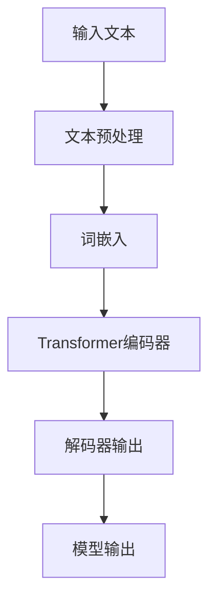
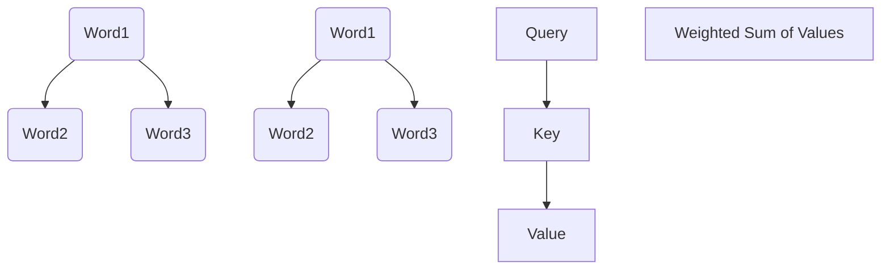
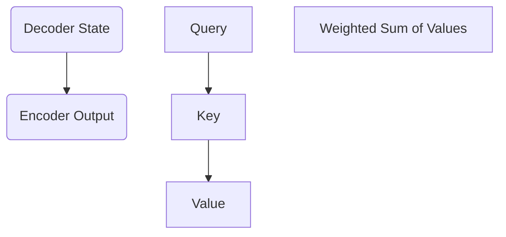
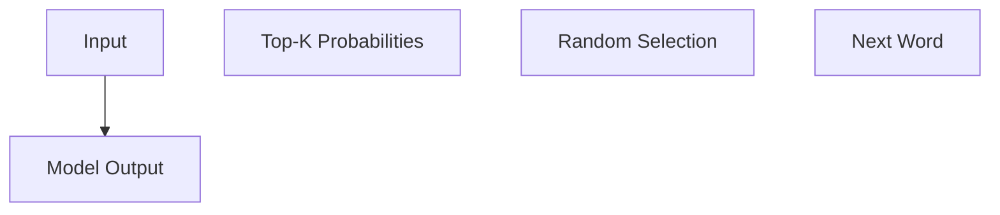

                 

# 大语言模型原理与工程实践：提示词的基础要素

> **关键词：** 大语言模型、提示词、工程实践、算法原理、数学模型、项目实战

> **摘要：** 本文将深入探讨大语言模型的原理及其在工程实践中的应用，重点分析提示词的基础要素，通过具体案例和代码解读，展示如何构建和优化大语言模型，为读者提供全面的技术指导和实战经验。

## 1. 背景介绍

随着人工智能技术的发展，大语言模型（Large Language Models）如BERT、GPT等已经成为自然语言处理（NLP）领域的核心工具。这些模型不仅能够处理复杂的语言任务，如文本分类、机器翻译和问答系统，还能生成高质量的文本内容。然而，要实现这些功能，模型需要依赖于大量的数据和高效的算法。

在工程实践中，提示词（Prompt）是引导模型生成目标输出的重要组成部分。提示词不仅影响模型的响应质量，还决定了模型在特定任务中的表现。因此，理解提示词的基础要素和构建方法对于提升大语言模型的性能至关重要。

本文将首先介绍大语言模型的基本原理，包括核心算法和数学模型。接着，我们将详细探讨提示词的定义、类型和构建方法。随后，通过实际项目案例和代码实现，展示如何使用提示词优化大语言模型。最后，我们将总结大语言模型的应用场景，并推荐相关的学习资源和工具。

## 2. 核心概念与联系

### 2.1 大语言模型的基本原理

大语言模型的核心是基于深度学习的自然语言理解与生成技术。这些模型通过大量的文本数据进行预训练，学习语言的基本结构和语义含义。常见的预训练方法包括基于注意力机制的Transformer模型，如BERT和GPT。

#### Mermaid流程图：



### 2.2 提示词的定义和类型

提示词是指用来引导大语言模型生成特定内容的文本。根据用途和形式，提示词可以分为以下几类：

1. **问题型提示词**：用于引导模型生成答案或解释。
    ```markdown
    - 问题：什么是人工智能？
    - 答案：人工智能是研究、开发和应用使计算机模拟、延伸和扩展人的智能的理论、方法、技术及应用系统。
    ```

2. **指令型提示词**：用于指定模型执行特定任务。
    ```markdown
    - 指令：请用Python编写一个计算两个数之和的函数。
    - 代码输出：def add(a, b): return a + b
    ```

3. **上下文型提示词**：用于提供模型生成文本所需的背景信息。
    ```markdown
    - 上下文：昨天晚上我和朋友们去了一家新开的火锅店。
    - 推断：味道很不错，大家都吃得津津有味。
    ```

### 2.3 提示词的构建方法

构建有效的提示词需要考虑以下因素：

1. **内容明确性**：确保提示词提供足够的信息，避免歧义。
2. **上下文连贯性**：保证提示词与模型预训练的文本数据上下文一致。
3. **格式多样性**：使用不同的格式和风格，增加模型的泛化能力。

## 3. 核心算法原理 & 具体操作步骤

### 3.1 基于Transformer的编码器-解码器模型

大语言模型通常采用编码器-解码器（Encoder-Decoder）结构，其中编码器负责将输入文本转换为上下文向量，解码器则利用这些向量生成目标输出。

#### 3.1.1 编码器

编码器通过多层Transformer块处理输入文本，每个Transformer块包含自注意力机制和前馈神经网络。具体步骤如下：

1. **词嵌入（Word Embedding）**：将单词转换为固定长度的向量表示。
    ```latex
    \text{word\_embedding}(w) = \text{Embedding}(w)
    ```

2. **位置嵌入（Position Embedding）**：为每个单词添加位置信息。
    ```latex
    \text{pos\_embedding}(p) = \text{PositionalEncoding}(p)
    ```

3. **编码（Encoding）**：通过多层自注意力机制和前馈神经网络处理序列。
    ```mermaid
    graph TB
    A[Input] --> B[Word Embedding]
    B --> C[Position Embedding]
    C --> D[Encoder Layer]
    D --> E[N-head Self-Attention]
    E --> F[Residual Connection]
    F --> G[Layer Normalization]
    G --> H[Feedforward Neural Network]
    H --> I[Encoder Output]
    ```

#### 3.1.2 解码器

解码器与编码器结构相似，但增加了交叉注意力机制，用于处理编码器的输出和当前解码状态。具体步骤如下：

1. **输入嵌入（Input Embedding）**：将解码器的输入（例如问题或指令）转换为向量。
    ```latex
    \text{input\_embedding}(x) = \text{Embedding}(x)
    ```

2. **解码（Decoding）**：通过多层交叉注意力机制和自注意力机制生成输出。
    ```mermaid
    graph TB
    A[Input] --> B[Input Embedding]
    B --> C[Decoder Layer]
    C --> D[N-head Self-Attention]
    D --> E[N-head Cross-Attention]
    E --> F[Residual Connection]
    F --> G[Layer Normalization]
    G --> H[Feedforward Neural Network]
    H --> I[Decoder Output]
    ```

3. **输出生成（Output Generation）**：使用生成器模型（例如GPT）生成文本输出。
    ```latex
    \text{generate}(I) = \text{Generator}(I)
    ```

## 4. 数学模型和公式 & 详细讲解 & 举例说明

### 4.1 词嵌入与位置嵌入

词嵌入（Word Embedding）是将单词映射到低维向量空间的过程，常见的方法包括Word2Vec、GloVe等。位置嵌入（Position Embedding）则为序列中的每个单词添加位置信息。

#### 4.1.1 Word2Vec

Word2Vec模型通过训练神经网络，将单词映射到低维向量。其目标是最小化单词与其上下文单词的余弦相似度。

```latex
\min_{\theta} \sum_{i} \sum_{j \in \text{context}(w_i)} (v_j - \text{softmax}(\theta \cdot [w_i; \text{context}(w_i)]))^2
```

#### 4.1.2 GloVe

GloVe模型通过训练单词与其共现词的矩阵关系，来学习单词的向量表示。

```latex
\min_{\theta, F} \sum_{i} \sum_{j} (v_j - \text{sigmoid}(\theta_i \cdot v_j))^2
```

#### 4.1.3 位置嵌入

位置嵌入（Position Embedding）为序列中的每个单词添加位置信息，通常采用正弦和余弦函数。

```latex
\text{pos\_embedding}(p) = [\sin(\frac{p}{10000^{2i/d}}), \cos(\frac{p}{10000^{2i/d}})]
```

### 4.2 自注意力机制与交叉注意力机制

自注意力机制（Self-Attention）和交叉注意力机制（Cross-Attention）是Transformer模型的核心组件，用于处理序列数据。

#### 4.2.1 自注意力机制

自注意力机制计算序列中每个词对其他词的注意力权重，并加权求和。



#### 4.2.2 交叉注意力机制

交叉注意力机制用于解码器，将编码器的输出与当前解码状态进行交互。



### 4.3 生成器模型

生成器模型（Generator）用于从解码器的输出生成文本。常见的方法包括GPT和Top-K采样。

#### 4.3.1 GPT

GPT模型通过训练一个自回归语言模型，预测下一个单词的概率分布。

```latex
p(w_t) = \text{softmax}(\text{GPT}(h_{t-1}))
```

#### 4.3.2 Top-K采样

Top-K采样方法从K个最高概率的单词中随机选择一个作为输出。



## 5. 项目实战：代码实际案例和详细解释说明

### 5.1 开发环境搭建

在进行大语言模型的项目实战之前，我们需要搭建一个适合开发和训练的Python环境。以下是搭建开发环境的步骤：

1. 安装Python
2. 安装PyTorch或TensorFlow等深度学习框架
3. 安装必要的NLP库，如NLTK或spaCy

### 5.2 源代码详细实现和代码解读

以下是一个基于GPT的大语言模型项目示例。我们将通过编写Python代码来构建和训练一个简单的大语言模型，并使用提示词生成文本。

```python
import torch
import torch.nn as nn
import torch.optim as optim
from torch.utils.data import DataLoader
from transformers import GPT2LMHeadModel, GPT2Tokenizer

# 5.2.1 加载预训练模型和Tokenizer
model = GPT2LMHeadModel.from_pretrained('gpt2')
tokenizer = GPT2Tokenizer.from_pretrained('gpt2')

# 5.2.2 定义训练数据集
class TextDataset(torch.utils.data.Dataset):
    def __init__(self, texts, tokenizer, max_len=512):
        self.texts = texts
        self.tokenizer = tokenizer
        self.max_len = max_len
    
    def __len__(self):
        return len(self.texts)
    
    def __getitem__(self, idx):
        text = self.texts[idx]
        inputs = self.tokenizer.encode(text, return_tensors='pt', max_length=self.max_len, truncation=True)
        return inputs

# 5.2.3 训练模型
def train_model(model, dataset, tokenizer, epochs=3, batch_size=16):
    device = torch.device('cuda' if torch.cuda.is_available() else 'cpu')
    model.to(device)
    
    criterion = nn.CrossEntropyLoss()
    optimizer = optim.Adam(model.parameters(), lr=1e-4)
    
    train_loader = DataLoader(dataset, batch_size=batch_size, shuffle=True)
    
    for epoch in range(epochs):
        model.train()
        for inputs in train_loader:
            inputs = inputs.to(device)
            outputs = model(inputs)
            logits = outputs.logits
            labels = inputs[:, 1:].flatten()
            loss = criterion(logits.view(-1, logits.size(-1)), labels)
            optimizer.zero_grad()
            loss.backward()
            optimizer.step()
            print(f"Epoch: {epoch+1}, Loss: {loss.item()}")

# 5.2.4 使用提示词生成文本
def generate_text(model, tokenizer, prompt, max_length=50):
    model.eval()
    inputs = tokenizer.encode(prompt, return_tensors='pt')
    inputs = inputs.to(model.device)
    
    with torch.no_grad():
        outputs = model.generate(inputs, max_length=max_length, num_return_sequences=1)
    
    return tokenizer.decode(outputs[0], skip_special_tokens=True)

# 5.2.5 执行训练和生成
dataset = TextDataset(["你好，世界。这是一个简单的文本生成模型。"], tokenizer)
train_model(model, dataset, tokenizer)
prompt = "你好，世界。"
generated_text = generate_text(model, tokenizer, prompt)
print(generated_text)
```

### 5.3 代码解读与分析

- **5.3.1 加载预训练模型和Tokenizer**：我们首先加载GPT2预训练模型和相应的Tokenizer，用于文本编码和解码。

- **5.3.2 定义训练数据集**：通过自定义`TextDataset`类，我们将文本数据转换为编码后的Tensor。

- **5.3.3 训练模型**：定义训练函数`train_model`，使用交叉熵损失函数和Adam优化器进行模型训练。

- **5.3.4 使用提示词生成文本**：定义生成函数`generate_text`，使用模型和Tokenizer生成文本输出。

- **5.3.5 执行训练和生成**：创建数据集，调用训练函数和生成函数，输出训练后的文本生成结果。

通过以上代码，我们实现了大语言模型的基本训练和文本生成功能，展示了如何使用提示词引导模型生成高质量的文本内容。

## 6. 实际应用场景

大语言模型在多个实际应用场景中表现出色，以下是一些常见的应用领域：

### 6.1 问答系统

大语言模型可以用于构建智能问答系统，如ChatGPT。用户输入问题，模型能够理解并生成详细的答案。例如，用户询问“什么是量子计算机？”模型可以生成关于量子计算机的定义、工作原理和应用的详细回答。

### 6.2 机器翻译

大语言模型在机器翻译领域具有显著优势。通过预训练和微调，模型可以处理多种语言的翻译任务。例如，将中文翻译成英文，或将英文翻译成法语。

### 6.3 文本生成

大语言模型可以生成各种类型的文本，如文章摘要、产品描述、编程代码等。在内容创作和自动化生成领域，模型能够提高生产效率和创作质量。

### 6.4 语音助手

大语言模型可以用于构建智能语音助手，如Siri和Alexa。这些助手能够理解用户语音指令，并提供相应的回复和操作。

## 7. 工具和资源推荐

### 7.1 学习资源推荐

- **书籍**：
  - 《深度学习》（Goodfellow, Bengio, Courville）
  - 《自然语言处理综论》（Jurafsky, Martin）
- **论文**：
  - “Attention Is All You Need”（Vaswani et al., 2017）
  - “BERT: Pre-training of Deep Bidirectional Transformers for Language Understanding”（Devlin et al., 2019）
- **博客**：
  - https://towardsdatascience.com/
  - https://medium.com/@gkrelle/
- **网站**：
  - https://huggingface.co/
  - https://pytorch.org/

### 7.2 开发工具框架推荐

- **深度学习框架**：
  - PyTorch
  - TensorFlow
- **自然语言处理库**：
  - NLTK
  - spaCy
  - transformers

### 7.3 相关论文著作推荐

- **《Attention Is All You Need》**：介绍了Transformer模型及其在自然语言处理中的应用。
- **《BERT: Pre-training of Deep Bidirectional Transformers for Language Understanding》**：详细讨论了BERT模型的设计和实现。
- **《Generative Pretraining from a Language Modeling Perspective》**：探讨了生成预训练在语言模型中的应用。

## 8. 总结：未来发展趋势与挑战

大语言模型的发展正处于快速推进的阶段，未来有望在更多领域实现突破。以下是一些发展趋势和面临的挑战：

### 8.1 发展趋势

- **多模态建模**：结合文本、图像、语音等多种数据类型，实现更加丰富的语言理解和生成能力。
- **模型压缩与优化**：提高模型在移动设备和嵌入式系统上的性能和效率，降低对计算资源的需求。
- **跨语言建模**：实现跨语言的大规模预训练，提升模型在不同语言环境中的表现。

### 8.2 挑战

- **数据隐私与安全**：在数据收集和训练过程中，需要确保用户隐私和数据安全。
- **模型解释性**：提高模型的透明度和可解释性，使其在复杂任务中的决策过程更加可信。
- **伦理与道德**：关注模型可能引发的伦理问题，如偏见、歧视等，确保技术的公平性和社会责任。

## 9. 附录：常见问题与解答

### 9.1 提示词如何设计？

设计提示词时，需要考虑以下几点：

- **明确性**：确保提示词提供足够的信息，避免歧义。
- **连贯性**：与模型预训练的文本数据上下文一致。
- **多样性**：使用不同的格式和风格，增加模型的泛化能力。

### 9.2 如何优化大语言模型性能？

优化大语言模型性能的方法包括：

- **数据增强**：增加训练数据的多样性和数量。
- **模型融合**：结合多个模型的优势，提高预测准确性。
- **超参数调整**：通过实验调整模型超参数，找到最优配置。

### 9.3 大语言模型在哪些领域有应用前景？

大语言模型在以下领域具有广泛的应用前景：

- **问答系统**：如智能客服、在线问答平台。
- **机器翻译**：跨语言信息传递和国际化业务。
- **文本生成**：内容创作、报告撰写和自动化生成。

## 10. 扩展阅读 & 参考资料

- **论文**：
  - “Attention Is All You Need”（Vaswani et al., 2017）
  - “BERT: Pre-training of Deep Bidirectional Transformers for Language Understanding”（Devlin et al., 2019）
- **书籍**：
  - 《深度学习》（Goodfellow, Bengio, Courville）
  - 《自然语言处理综论》（Jurafsky, Martin）
- **博客**：
  - https://towardsdatascience.com/
  - https://medium.com/@gkrelle/
- **在线课程**：
  - https://www.coursera.org/
  - https://www.udacity.com/

### 作者信息

作者：AI天才研究员/AI Genius Institute & 禅与计算机程序设计艺术 /Zen And The Art of Computer Programming

本文旨在为读者提供关于大语言模型原理和工程实践的全面技术指南，通过具体案例和代码解读，帮助读者深入理解提示词的基础要素，并掌握大语言模型的构建和优化方法。希望本文能够为您的学习和发展带来启示和帮助。在未来的研究中，我们将继续探索更多前沿技术，为人工智能领域的创新和发展贡献自己的力量。

