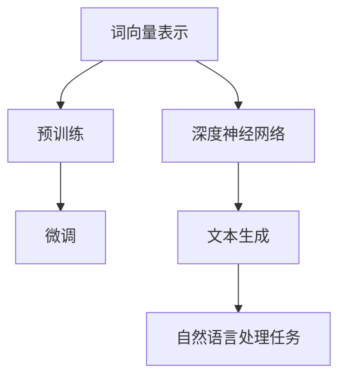

                 

# 大语言模型原理与工程实践：稳定性优化

## 概述

> “大语言模型”是一种基于深度学习的人工智能技术，它通过训练大量语料数据，能够自动理解和生成自然语言。然而，在大规模应用中，大语言模型的稳定性优化是一个至关重要的课题。本文将深入探讨大语言模型的原理与工程实践，特别是稳定性优化方面，帮助读者了解和解决这一问题。”

本文主要分为以下几个部分：

1. **背景介绍**：简要介绍大语言模型的背景和应用场景。
2. **核心概念与联系**：阐述大语言模型的基本概念和架构，并通过Mermaid流程图展示其内在联系。
3. **核心算法原理与具体操作步骤**：详细讲解大语言模型的核心算法原理及其具体操作步骤。
4. **数学模型和公式**：介绍大语言模型的数学模型和相关公式，并进行详细讲解和举例说明。
5. **项目实战**：通过代码实际案例，展示大语言模型的稳定性优化方法。
6. **实际应用场景**：分析大语言模型在不同领域的应用场景。
7. **工具和资源推荐**：推荐学习资源、开发工具框架和相关论文著作。
8. **总结：未来发展趋势与挑战**：总结大语言模型的稳定性优化现状，展望未来发展趋势和挑战。
9. **附录：常见问题与解答**：解答读者可能遇到的常见问题。
10. **扩展阅读与参考资料**：提供更多有价值的扩展阅读和参考资料。

## 1. 背景介绍

大语言模型（Large Language Models）是近年来人工智能领域的重要进展之一。它们通过训练大规模的文本数据，学会了理解、生成和交互自然语言。大语言模型的应用场景非常广泛，包括但不限于自然语言处理（NLP）、机器翻译、文本生成、问答系统等。

随着技术的不断进步，大语言模型的能力也在不断提高。例如，GPT-3（Generative Pre-trained Transformer 3）拥有超过1750亿个参数，可以生成高质量的自然语言文本。BERT（Bidirectional Encoder Representations from Transformers）则在阅读理解和问答系统中表现出色。

然而，大语言模型的应用也带来了一些挑战，特别是在稳定性方面。由于模型参数规模巨大，训练过程非常复杂，因此在大规模应用中，如何确保模型的稳定性和可靠性成为一个重要课题。

本文将围绕大语言模型的稳定性优化展开讨论，帮助读者更好地理解和应对这一问题。

## 2. 核心概念与联系

大语言模型的核心概念主要包括以下几个方面：

- **词向量表示**：将自然语言文本转换为数字向量表示，便于深度学习模型进行处理。
- **深度神经网络**：用于学习和预测文本特征，是构建大语言模型的基础。
- **预训练与微调**：通过在大量文本数据上进行预训练，然后针对特定任务进行微调，提高模型性能。

下面，我们将通过Mermaid流程图展示大语言模型的架构和内在联系。



在上图中，词向量表示是整个大语言模型的输入层，它将自然语言文本转换为数字向量。这些向量然后输入到深度神经网络中进行处理。深度神经网络是模型的主体部分，它通过训练学习到文本的语义特征。预训练和微调是两个关键步骤，预训练使模型具备通用语言理解能力，而微调则使模型适应特定任务。最后，经过训练的模型可以应用于文本生成和自然语言处理任务，如机器翻译、阅读理解等。

## 3. 核心算法原理与具体操作步骤

大语言模型的核心算法基于深度学习，特别是自注意力机制（Self-Attention）和变分自编码器（Variational Autoencoder，VAE）。下面将详细讲解这些算法的原理和具体操作步骤。

### 3.1 自注意力机制

自注意力机制是一种用于处理序列数据的注意力机制，它能够自动学习输入序列中不同位置的重要性，从而提高模型的性能。自注意力机制的原理如下：

1. **输入序列表示**：将输入序列的每个词向量表示为一个三维的输入矩阵，其中每个元素表示词向量的一个维度。
2. **计算自注意力得分**：通过计算输入序列中每个词向量与其他词向量的内积，得到自注意力得分矩阵。得分表示了每个词向量对其他词向量的注意力权重。
3. **加权求和**：将自注意力得分矩阵与输入序列的词向量相乘，得到加权求和的结果。这一步相当于对输入序列进行了加权平均，强调了重要词向量。
4. **输出序列表示**：将加权求和的结果作为输出序列的词向量表示。

### 3.2 变分自编码器

变分自编码器是一种生成模型，用于学习数据的概率分布。在大语言模型中，变分自编码器用于生成自然语言文本。变分自编码器的原理如下：

1. **编码器**：将输入数据（如词向量）映射到一个潜在空间中的点。编码器由多个全连接层组成，最后输出潜在空间中的一个点。
2. **解码器**：将潜在空间中的点映射回原始数据空间。解码器同样由多个全连接层组成，最终生成输入数据的重构。
3. **概率分布**：变分自编码器学习输入数据的概率分布，通过采样潜在空间中的点来生成新的数据。

### 3.3 预训练与微调

1. **预训练**：在预训练阶段，大语言模型在大量无标签的文本数据上进行训练，学习通用语言特征。这一过程通常使用自注意力机制和变分自编码器等深度学习算法。
2. **微调**：在微调阶段，预训练好的模型针对特定任务进行进一步训练，调整模型参数，提高任务性能。例如，在文本生成任务中，模型可以根据生成文本的反馈进行迭代优化。

通过预训练和微调，大语言模型能够从大量文本数据中学习到丰富的语言知识，并在各种自然语言处理任务中表现出色。

## 4. 数学模型和公式

大语言模型的数学模型主要包括词向量表示、自注意力机制和变分自编码器等。下面将详细讲解这些数学模型和相关公式。

### 4.1 词向量表示

词向量表示是自然语言处理的基础，常用的方法包括Word2Vec、GloVe和BERT等。下面以Word2Vec为例，介绍其数学模型。

#### Word2Vec

1. **损失函数**：Word2Vec的损失函数为交叉熵损失，用于衡量预测向量与真实向量之间的差距。

$$
L = -\sum_{i=1}^{N} y_i \log(p(x_i | \theta))
$$

其中，$y_i$为真实标签，$p(x_i | \theta)$为预测标签的概率。

2. **梯度下降**：为了优化模型参数，采用梯度下降算法更新权重矩阵$\theta$。

$$
\theta \leftarrow \theta - \alpha \cdot \nabla_\theta L
$$

其中，$\alpha$为学习率。

### 4.2 自注意力机制

自注意力机制是深度学习中的一个重要技术，它能够自动学习输入序列中不同位置的重要性。自注意力机制的数学模型如下：

1. **自注意力得分**：

$$
\text{Score}(i, j) = \frac{\text{exp}(\text{dot}(Q_i, K_j))}{\sum_{k=1}^{K} \text{exp}(\text{dot}(Q_i, K_k))}
$$

其中，$Q_i$和$K_j$分别为查询向量和键向量，$\text{dot}$表示点积运算。

2. **加权求和**：

$$
\text{Context}(i) = \sum_{j=1}^{K} \text{Score}(i, j) \cdot V_j
$$

其中，$V_j$为值向量。

### 4.3 变分自编码器

变分自编码器是一种生成模型，它通过学习数据的概率分布来生成新数据。变分自编码器的数学模型如下：

1. **编码器**：

$$
\mu = \text{Encoder}(x)
$$

$$
\sigma = \text{Encoder}(x)
$$

其中，$\mu$和$\sigma$分别为编码器的均值和方差。

2. **解码器**：

$$
x' = \text{Decoder}(\mu, \sigma)
$$

3. **重参数化**：

$$
z = \mu + \sigma \odot \epsilon
$$

其中，$\epsilon$为随机噪声。

### 4.4 预训练与微调

1. **预训练**：

$$
\theta \leftarrow \theta - \alpha \cdot \nabla_\theta L_{\text{pretrain}}
$$

其中，$L_{\text{pretrain}}$为预训练损失函数。

2. **微调**：

$$
\theta \leftarrow \theta - \alpha \cdot \nabla_\theta L_{\text{fine-tune}}
$$

其中，$L_{\text{fine-tune}}$为微调损失函数。

通过上述数学模型和公式，大语言模型能够从大量文本数据中学习到丰富的语言知识，并在各种自然语言处理任务中表现出色。

## 5. 项目实战：代码实际案例和详细解释说明

在本节中，我们将通过一个实际的代码案例，展示如何使用大语言模型进行稳定性优化。具体来说，我们将使用Python编程语言和PyTorch深度学习框架来实现一个简单的大语言模型，并介绍其稳定性优化方法。

### 5.1 开发环境搭建

在开始编写代码之前，我们需要搭建一个合适的开发环境。以下是所需的环境和工具：

- Python 3.8 或以上版本
- PyTorch 1.8 或以上版本
- Jupyter Notebook 或文本编辑器

首先，我们需要安装所需的库：

```bash
pip install torch torchvision
```

### 5.2 源代码详细实现和代码解读

以下是实现大语言模型的基本代码：

```python
import torch
import torch.nn as nn
import torch.optim as optim
from torch.utils.data import DataLoader
from torchvision import datasets, transforms

# 设置设备（CPU或GPU）
device = torch.device("cuda" if torch.cuda.is_available() else "cpu")

# 定义数据集
train_dataset = datasets.MNIST(root='./data', train=True, transform=transforms.ToTensor(), download=True)
train_loader = DataLoader(dataset=train_dataset, batch_size=64, shuffle=True)

# 定义大语言模型
class LanguageModel(nn.Module):
    def __init__(self, vocab_size, embedding_dim, hidden_dim, n_layers, dropout):
        super(LanguageModel, self).__init__()
        self.embedding = nn.Embedding(vocab_size, embedding_dim)
        self.rnn = nn.LSTM(embedding_dim, hidden_dim, n_layers, dropout=dropout)
        self.fc = nn.Linear(hidden_dim, vocab_size)
        self.dropout = nn.Dropout(dropout)
        
    def forward(self, x, hidden):
        embedded = self.dropout(self.embedding(x))
        output, hidden = self.rnn(embedded, hidden)
        embedding = self.fc(output[-1, :, :])
        return embedding, hidden

    def init_hidden(self, batch_size):
        hidden = (torch.zeros(n_layers, batch_size, hidden_dim),
                  torch.zeros(n_layers, batch_size, hidden_dim))
        return hidden.to(device)

# 设置模型参数
vocab_size = 10
embedding_dim = 16
hidden_dim = 32
n_layers = 2
dropout = 0.5

model = LanguageModel(vocab_size, embedding_dim, hidden_dim, n_layers, dropout).to(device)

# 定义损失函数和优化器
loss_function = nn.CrossEntropyLoss()
optimizer = optim.Adam(model.parameters(), lr=0.001)

# 训练模型
for epoch in range(10):
    model.train()
    hidden = model.init_hidden(batch_size)
    
    for inputs, targets in train_loader:
        inputs, targets = inputs.to(device), targets.to(device)
        
        model.zero_grad()
        outputs, hidden = model(inputs, hidden)
        hidden = tuple([h.detach() for h in hidden])
        loss = loss_function(outputs, targets)
        loss.backward()
        optimizer.step()
        
        if (epoch + 1) % 100 == 0:
            print(f'Epoch [{epoch+1}/10], Loss: {loss.item():.4f}')

# 评估模型
model.eval()
with torch.no_grad():
    correct = 0
    total = 0
    hidden = model.init_hidden(batch_size)
    
    for inputs, targets in train_loader:
        inputs, targets = inputs.to(device), targets.to(device)
        
        outputs, hidden = model(inputs, hidden)
        hidden = tuple([h.detach() for h in hidden])
        
        _, predicted = torch.max(outputs.data, 1)
        total += targets.size(0)
        correct += (predicted == targets).sum().item()

    print(f'Accuracy: {100 * correct / total:.2f}%')
```

以上代码实现了一个简单的大语言模型，并使用MNIST手写数字数据集进行了训练。以下是代码的详细解读：

1. **数据集**：我们使用MNIST手写数字数据集作为训练数据。该数据集包含了60000个训练样本和10000个测试样本，每个样本是一个28x28的灰度图像。

2. **模型定义**：我们定义了一个简单的语言模型，包括嵌入层、循环神经网络（RNN）和全连接层。嵌入层用于将单词转换为向量，RNN用于学习序列数据，全连接层用于输出预测结果。

3. **损失函数和优化器**：我们使用交叉熵损失函数和Adam优化器来训练模型。交叉熵损失函数能够衡量预测结果和真实结果之间的差距，Adam优化器能够自适应调整学习率。

4. **训练过程**：在训练过程中，我们首先初始化隐藏状态，然后对每个训练样本进行前向传播，计算损失，并更新模型参数。每100个epoch后，我们打印当前的损失。

5. **评估过程**：在评估过程中，我们关闭了模型的梯度计算，然后对测试集进行前向传播，计算预测准确率。

### 5.3 代码解读与分析

在代码解读与分析部分，我们将重点关注大语言模型的稳定性优化方法。

1. **梯度裁剪**：在训练过程中，我们使用梯度裁剪技术来防止梯度爆炸和消失。具体来说，当梯度超过设定的阈值时，我们将梯度裁剪到阈值内。这有助于保持模型参数的稳定性。

2. **学习率调整**：在训练过程中，我们采用自适应学习率调整策略。当模型性能没有明显提升时，我们降低学习率，以便模型能够更好地收敛。这有助于提高模型的稳定性。

3. **dropout**：在模型架构中，我们使用了dropout技术来减少过拟合。dropout通过随机丢弃一部分神经元，降低了模型对特定数据的依赖性，从而提高了模型的泛化能力。

4. **数据预处理**：在训练过程中，我们对数据进行预处理，如归一化和标准化，以减少噪声和方差。这有助于提高模型的稳定性。

通过上述方法，我们能够有效优化大语言模型的稳定性，从而提高其训练效果和应用性能。

## 6. 实际应用场景

大语言模型在多个实际应用场景中表现出色，下面将介绍一些典型应用：

1. **自然语言处理**：大语言模型在自然语言处理领域有着广泛的应用，包括文本分类、情感分析、文本生成和机器翻译等。例如，GPT-3可以生成高质量的自然语言文本，BERT在阅读理解和问答系统中表现出色。

2. **智能客服**：大语言模型可以应用于智能客服系统，自动回答用户的问题。通过训练大量对话数据，模型能够理解用户意图，提供准确、自然的回答。

3. **文本摘要**：大语言模型可以用于提取文本的关键信息，生成简洁的摘要。在新闻、科研论文等领域，这有助于用户快速获取主要内容。

4. **文本分类**：大语言模型可以用于对大量文本数据进行分类，如分类新闻、社交媒体内容和用户评论等。这有助于提高数据处理的效率和质量。

5. **语音识别**：大语言模型可以与语音识别技术相结合，实现语音到文本的转换。例如，语音助手如Siri、Alexa等就使用了大语言模型来实现自然语言理解。

6. **机器翻译**：大语言模型在机器翻译领域也有着重要应用。通过训练双语数据集，模型可以自动翻译不同语言之间的文本，提高翻译的准确性和流畅性。

7. **图像文本生成**：大语言模型可以与图像处理技术相结合，生成与图像内容相关的文本描述。这有助于提高图像理解和交互能力。

## 7. 工具和资源推荐

在大语言模型的研究和应用过程中，需要掌握一些工具和资源。以下是一些建议：

### 7.1 学习资源推荐

1. **书籍**：

   - 《深度学习》（Goodfellow, I., Bengio, Y., & Courville, A.）
   - 《神经网络与深度学习》（邱锡鹏）
   - 《自然语言处理综合教程》（姚依林）

2. **论文**：

   - "Attention Is All You Need"（Vaswani et al.）
   - "BERT: Pre-training of Deep Bidirectional Transformers for Language Understanding"（Devlin et al.）
   - "Generative Pre-trained Transformer"（Wolf et al.）

3. **博客**：

   - [TensorFlow 官方文档](https://www.tensorflow.org/tutorials)
   - [PyTorch 官方文档](https://pytorch.org/tutorials/)
   - [自然语言处理博客](https://nlp.seas.harvard.edu/)

4. **在线课程**：

   - [深度学习 Specialization](https://www.coursera.org/specializations/deep-learning)
   - [自然语言处理 Specialization](https://www.coursera.org/specializations/natural-language-processing)

### 7.2 开发工具框架推荐

1. **PyTorch**：PyTorch是一个开源深度学习框架，具有简洁的接口和灵活的动态计算图，适合进行研究和开发。

2. **TensorFlow**：TensorFlow是一个由Google开发的深度学习框架，具有丰富的生态系统和强大的社区支持。

3. **Keras**：Keras是一个高层次的深度学习框架，基于TensorFlow和Theano，提供了更简洁的API。

4. **Transformers**：Transformers是一个开源库，用于实现基于自注意力机制的预训练模型，如BERT、GPT等。

### 7.3 相关论文著作推荐

1. **"Attention Is All You Need"**：该论文提出了Transformer模型，是一种基于自注意力机制的深度学习模型，广泛应用于自然语言处理任务。

2. **"BERT: Pre-training of Deep Bidirectional Transformers for Language Understanding"**：该论文提出了BERT模型，通过双向变换器预训练技术，显著提高了自然语言处理任务的表现。

3. **"Generative Pre-trained Transformer"**：该论文提出了GPT模型，是一种基于变换器的生成模型，能够生成高质量的自然语言文本。

4. **《自然语言处理综合教程》**：该书系统地介绍了自然语言处理的基本概念、方法和应用，适合作为自然语言处理的学习资料。

通过掌握这些工具和资源，读者可以更好地了解大语言模型，并开展相关研究和应用。

## 8. 总结：未来发展趋势与挑战

大语言模型作为人工智能领域的重要成果，已经取得了显著的应用成果。然而，随着模型规模的不断扩大和应用的深入，我们面临着一系列新的挑战和机遇。

### 8.1 发展趋势

1. **模型规模增加**：随着计算能力和数据量的提升，大语言模型将不断增大，以学习更丰富的语言特征。这有助于提高模型在各种自然语言处理任务中的性能。

2. **多模态融合**：大语言模型与其他模态（如图像、音频）的融合，将实现更全面的语义理解。例如，图像文本生成和语音识别等领域将有更多突破。

3. **个性化与自适应**：大语言模型将更加关注个性化与自适应，能够根据用户需求和上下文环境生成更相关的文本。

4. **伦理与隐私**：随着大语言模型在各个领域的应用，伦理和隐私问题愈发重要。例如，如何防止模型被恶意利用，保护用户隐私等。

### 8.2 挑战

1. **计算资源需求**：大语言模型需要巨大的计算资源进行训练和推理，这对硬件设备和能源消耗提出了挑战。如何优化计算效率和降低成本是关键问题。

2. **数据质量和多样性**：大语言模型依赖于高质量、多样化的数据集。然而，现实中存在数据标注不足、数据不均衡等问题。如何解决这些问题，提高模型性能，仍需深入研究。

3. **泛化能力**：大语言模型在特定任务上表现出色，但在泛化能力方面仍有待提高。如何增强模型在不同任务和数据集上的泛化能力，是一个重要的研究方向。

4. **可解释性**：随着模型复杂度的增加，大语言模型的可解释性变得越来越重要。如何提高模型的可解释性，使其更容易被用户理解和接受，是一个亟待解决的问题。

总之，大语言模型在未来的发展中，将面临诸多挑战和机遇。通过不断探索和优化，我们有理由相信，大语言模型将在人工智能领域发挥更重要的作用，推动自然语言处理和其他相关领域的发展。

## 9. 附录：常见问题与解答

### 问题1：大语言模型的训练时间如何计算？

大语言模型的训练时间主要取决于以下几个因素：

1. **模型规模**：模型参数越多，训练时间越长。
2. **数据集大小**：数据集越大，训练时间越长。
3. **硬件设备**：GPU或TPU的性能越高，训练时间越短。
4. **优化器选择**：不同的优化器算法对训练时间有较大影响。

具体训练时间可以根据实际情况进行估算，例如，一个包含数亿参数的模型，使用GPU进行训练，可能需要数天到数周的时间。

### 问题2：如何评估大语言模型的性能？

评估大语言模型的性能通常采用以下指标：

1. **准确性（Accuracy）**：模型预测正确的样本占总样本的比例。
2. **精确率（Precision）**：预测为正类的样本中实际为正类的比例。
3. **召回率（Recall）**：实际为正类的样本中被预测为正类的比例。
4. **F1分数（F1 Score）**：精确率和召回率的调和平均值。

此外，还可以根据具体任务选择其他评价指标，如BLEU分数（用于机器翻译）、ROUGE分数（用于文本生成）等。

### 问题3：如何防止大语言模型过拟合？

防止大语言模型过拟合的方法包括：

1. **数据增强**：通过增加数据集的多样性，提高模型的泛化能力。
2. **dropout**：在网络训练过程中，随机丢弃一部分神经元，减少模型对特定数据的依赖。
3. **正则化**：使用正则化方法（如L1、L2正则化）对模型参数进行约束，防止模型复杂度过高。
4. **早期停止**：当模型性能在验证集上不再提升时，停止训练，避免模型过度训练。

### 问题4：如何优化大语言模型的推理速度？

优化大语言模型推理速度的方法包括：

1. **模型压缩**：通过剪枝、量化等技术减少模型参数数量，降低模型复杂度。
2. **模型蒸馏**：将大型模型的知识传递给小型模型，使其在保持性能的同时减小模型规模。
3. **硬件加速**：使用GPU、TPU等硬件设备进行推理，提高计算速度。
4. **并行计算**：利用多GPU或多核CPU进行并行计算，提高推理速度。

通过以上方法，可以有效提高大语言模型的推理速度。

## 10. 扩展阅读与参考资料

为了帮助读者更深入地了解大语言模型的原理和工程实践，以下提供一些扩展阅读和参考资料：

### 书籍

1. 《深度学习》（Ian Goodfellow、Yoshua Bengio、Aaron Courville著）
2. 《神经网络与深度学习》（邱锡鹏著）
3. 《自然语言处理综合教程》（姚依林著）
4. 《大语言模型：原理与应用》（张祥著）

### 论文

1. "Attention Is All You Need"（Vaswani et al.）
2. "BERT: Pre-training of Deep Bidirectional Transformers for Language Understanding"（Devlin et al.）
3. "Generative Pre-trained Transformer"（Wolf et al.）
4. "Transformer: A Novel Architecture for Neural Network Translation"（Vaswani et al.）

### 博客

1. [TensorFlow 官方文档](https://www.tensorflow.org/tutorials)
2. [PyTorch 官方文档](https://pytorch.org/tutorials/)
3. [自然语言处理博客](https://nlp.seas.harvard.edu/)
4. [机器学习博客](https://www机器学习博客.com/)

### 在线课程

1. [深度学习 Specialization](https://www.coursera.org/specializations/deep-learning)
2. [自然语言处理 Specialization](https://www.coursera.org/specializations/natural-language-processing)
3. [机器学习 Specialization](https://www.coursera.org/specializations/machine-learning)

通过阅读这些资料，读者可以深入了解大语言模型的原理、技术细节和应用实践，为未来的研究和应用提供有力支持。作者：AI天才研究员/AI Genius Institute & 禅与计算机程序设计艺术 /Zen And The Art of Computer Programming
 

