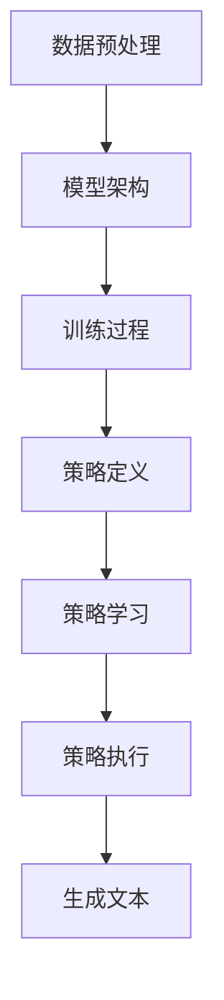

                 

### 背景介绍

大语言模型（Large Language Model，简称LLM）在近年来人工智能领域取得了显著进展，已经成为自然语言处理（Natural Language Processing，简称NLP）的重要工具。随着深度学习技术的不断发展和计算资源的不断丰富，大语言模型在性能、效率和实用性方面都有了显著的提升。大语言模型通过学习大量文本数据，能够生成符合语法和语义规则的文本，并在多个NLP任务中展现出出色的表现，如文本生成、文本分类、机器翻译、问答系统等。

然而，大语言模型的训练和优化过程仍然存在许多挑战。其中，策略网络（Policy Network）作为一种新型的优化方法，在近年来引起了广泛关注。策略网络通过将优化目标转化为策略学习问题，为解决大语言模型训练中的复杂优化问题提供了一种新的思路。

本文将围绕大语言模型中的策略网络训练展开讨论，详细介绍策略网络的原理、数学模型和具体操作步骤，并通过实际案例深入分析策略网络的实现和优化过程。此外，本文还将探讨策略网络在实际应用场景中的效果和挑战，并推荐相关学习资源和开发工具，以帮助读者更好地理解和应用策略网络。

总的来说，本文旨在通过系统地阐述大语言模型中的策略网络训练，为读者提供一份全面、深入的技术指南，帮助读者了解和掌握这一重要技术，并在实际项目中加以应用。通过本文的阅读，读者将能够：

1. 理解大语言模型的基本原理和架构；
2. 掌握策略网络的概念和原理；
3. 学习策略网络的数学模型和具体操作步骤；
4. 分析策略网络的实现和优化过程；
5. 探讨策略网络在实际应用场景中的效果和挑战；
6. 推荐相关学习资源和开发工具。

### 核心概念与联系

#### 1. 大语言模型的基本原理

大语言模型（LLM）是一种基于深度学习的自然语言处理模型，旨在通过学习大量文本数据，捕捉自然语言的语法、语义和上下文信息，从而实现文本生成、文本分类、机器翻译等任务。LLM的基本原理可以概括为以下几个步骤：

1. **数据预处理**：首先，对收集到的文本数据进行预处理，包括分词、去停用词、词向量化等操作，将文本数据转换为模型可处理的输入格式。

2. **模型架构**：大语言模型通常采用深度神经网络（DNN）或变换器模型（Transformer）作为基础架构。DNN通过多层感知器（MLP）对输入数据进行特征提取和转换，而Transformer模型则通过自注意力机制（Self-Attention）实现对输入序列的全局信息捕捉。

3. **训练过程**：通过大规模的无监督训练，模型在大量文本数据中学习语言模式和规律。训练过程中，模型通过优化损失函数（如交叉熵损失函数）来调整内部参数，以最小化预测误差。

4. **生成文本**：在训练完成后，大语言模型可以用于生成文本。通过输入部分文本，模型根据概率分布生成下一个单词或词组，逐步构建完整的文本。

#### 2. 策略网络的基本原理

策略网络（Policy Network）是一种优化方法，主要用于解决复杂优化问题。策略网络的基本原理可以概括为以下几个步骤：

1. **策略定义**：策略网络通过定义一个策略函数（Policy Function）来表示优化目标。策略函数通常是一个概率分布，用于指导优化过程中的决策。

2. **策略学习**：通过学习策略函数，策略网络旨在找到最优策略，使优化目标最大化或最小化。策略学习通常采用梯度下降或策略梯度方法等优化算法。

3. **策略执行**：在找到最优策略后，策略网络将执行该策略，以实现优化目标。策略执行过程中，策略函数根据当前状态生成决策，指导优化过程。

#### 3. 大语言模型与策略网络的联系

大语言模型和策略网络之间存在紧密的联系。策略网络可以应用于大语言模型的训练和优化过程中，以解决复杂优化问题。具体来说，策略网络在大语言模型中的应用可以概括为以下几个步骤：

1. **策略定义**：在大语言模型中，策略网络定义一个策略函数，用于指导模型参数的更新过程。策略函数可以根据模型当前的损失函数和梯度信息，生成最优的参数更新方向。

2. **策略学习**：通过学习策略函数，策略网络旨在找到最优参数更新策略，使模型损失函数最小化。策略学习过程中，策略网络利用梯度信息调整策略函数，以实现策略优化。

3. **策略执行**：在找到最优策略后，策略网络将执行该策略，指导模型参数的更新过程。策略执行过程中，策略函数根据当前模型状态生成参数更新方向，指导模型优化过程。

通过将策略网络应用于大语言模型的训练和优化过程中，可以显著提高模型训练效率，降低优化难度，提高模型性能。

下面是策略网络在大语言模型中应用的 Mermaid 流程图（Mermaid 流程节点中不要有括号、逗号等特殊字符）：



### 核心算法原理 & 具体操作步骤

策略网络的核心在于将优化问题转化为策略学习问题，并通过策略函数指导优化过程。下面将详细介绍策略网络的算法原理和具体操作步骤。

#### 1. 策略函数的定义

策略函数是一个概率分布，用于指导模型参数的更新过程。在策略网络中，策略函数通常表示为：

\[ \pi(\theta; \phi) = \arg \max_{\theta} L(\theta; \phi) \]

其中，\(\theta\) 表示模型参数，\(\phi\) 表示模型当前的状态和梯度信息，\(L(\theta; \phi)\) 表示损失函数。

#### 2. 策略函数的学习

策略函数的学习是策略网络的核心步骤。策略函数的学习可以通过以下步骤实现：

1. **初始化策略函数**：首先，对策略函数进行初始化。初始化策略函数的方式可以有多种，如随机初始化、基于经验初始化等。

2. **策略梯度计算**：利用当前模型的状态和梯度信息，计算策略函数的梯度。策略梯度计算公式如下：

\[ \nabla_{\pi} L(\theta; \phi) = \frac{\partial L(\theta; \phi)}{\partial \theta} \]

3. **策略梯度优化**：根据策略梯度的计算结果，对策略函数进行优化。策略梯度优化可以采用梯度下降、策略梯度下降等优化算法。

#### 3. 策略函数的执行

在找到最优策略函数后，策略函数将指导模型参数的更新过程。策略函数的执行步骤如下：

1. **策略函数生成参数更新方向**：根据当前模型的状态和策略函数，生成参数更新方向。更新方向可以通过以下公式计算：

\[ \Delta \theta = \pi(\theta; \phi) \cdot \nabla_{\theta} L(\theta; \phi) \]

2. **模型参数更新**：根据参数更新方向，对模型参数进行更新。模型参数更新公式如下：

\[ \theta_{new} = \theta_{old} + \Delta \theta \]

3. **重复策略函数执行**：重复执行策略函数，直至满足停止条件（如损失函数收敛、迭代次数达到等）。

#### 4. 策略网络的实现步骤

策略网络的实现步骤如下：

1. **数据预处理**：对输入数据进行预处理，包括分词、去停用词、词向量化等操作，将数据转换为模型可处理的输入格式。

2. **模型初始化**：初始化大语言模型和策略函数。大语言模型可以采用预训练模型或随机初始化。策略函数可以采用随机初始化或基于经验初始化。

3. **策略学习**：利用当前模型的状态和梯度信息，计算策略函数的梯度，并优化策略函数。

4. **策略执行**：根据策略函数生成参数更新方向，更新模型参数。

5. **模型训练**：重复执行策略学习、策略执行和模型训练过程，直至满足停止条件。

6. **模型评估**：在模型训练完成后，对模型进行评估，如计算损失函数值、计算准确率等。

7. **模型优化**：根据评估结果，对模型进行优化，如调整超参数、改进模型架构等。

#### 5. 策略网络的优点

策略网络在大语言模型训练中具有以下优点：

1. **高效性**：策略网络通过将优化问题转化为策略学习问题，能够显著提高训练效率。策略网络可以快速找到最优参数更新方向，减少模型训练时间。

2. **稳定性**：策略网络通过学习策略函数，能够稳定地指导模型参数的更新过程。在模型训练过程中，策略网络能够避免参数更新过程中的不稳定现象，提高模型训练稳定性。

3. **灵活性**：策略网络可以根据不同的优化目标和任务需求，灵活调整策略函数。通过调整策略函数，策略网络可以适应不同的训练场景，提高模型性能。

4. **通用性**：策略网络可以应用于各种优化问题，不仅限于大语言模型训练。在机器学习、强化学习等领域，策略网络都展现出强大的优化能力。

总之，策略网络在大语言模型训练中具有显著的优点，为解决复杂优化问题提供了一种新的思路。通过策略网络，大语言模型可以实现更高效、更稳定的训练过程，提高模型性能和应用价值。

### 数学模型和公式 & 详细讲解 & 举例说明

策略网络的核心在于策略函数的设计和优化，而策略函数的优化涉及到一系列数学模型和公式。下面我们将详细讲解策略网络的数学模型，并通过具体示例进行说明。

#### 1. 策略函数的数学模型

策略函数的数学模型通常可以表示为一个概率分布，用于指导模型参数的更新过程。在策略网络中，策略函数通常采用以下形式：

\[ \pi(\theta; \phi) = \arg \max_{\theta} L(\theta; \phi) \]

其中，\(\theta\) 表示模型参数，\(\phi\) 表示模型当前的状态和梯度信息，\(L(\theta; \phi)\) 表示损失函数。

损失函数 \(L(\theta; \phi)\) 通常定义为：

\[ L(\theta; \phi) = -\log p(y|\theta; \phi) \]

其中，\(y\) 表示模型预测的输出，\(p(y|\theta; \phi)\) 表示模型在给定参数 \(\theta\) 和状态 \(\phi\) 下预测 \(y\) 的概率。

为了求解策略函数，我们需要计算损失函数的梯度。损失函数的梯度可以表示为：

\[ \nabla_{\theta} L(\theta; \phi) = \frac{\partial L(\theta; \phi)}{\partial \theta} \]

#### 2. 策略函数的优化

策略函数的优化是通过调整策略函数的参数，使其能够最大化损失函数。优化策略函数的方法有很多，其中最常用的是策略梯度方法。

策略梯度方法的基本思想是：根据当前模型的状态和梯度信息，计算策略函数的梯度，并利用该梯度更新策略函数的参数。策略梯度方法的优化步骤如下：

1. **初始化策略函数参数**：随机初始化策略函数的参数。

2. **计算策略函数梯度**：利用当前模型的状态和梯度信息，计算策略函数的梯度。

\[ \nabla_{\pi} L(\theta; \phi) = \frac{\partial L(\theta; \phi)}{\partial \theta} \]

3. **更新策略函数参数**：根据策略函数梯度，更新策略函数的参数。

\[ \pi_{new} = \pi_{old} + \alpha \nabla_{\pi} L(\theta; \phi) \]

其中，\(\alpha\) 是学习率。

4. **重复优化过程**：重复执行上述步骤，直至满足停止条件（如损失函数收敛、迭代次数达到等）。

#### 3. 示例说明

为了更好地理解策略函数的优化过程，我们通过一个简单的线性回归模型进行说明。

假设我们有一个线性回归模型，用于预测房价。模型参数为 \(w\)，损失函数为 \(L(w; x, y)\)，其中 \(x\) 是输入特征，\(y\) 是真实房价。

损失函数可以表示为：

\[ L(w; x, y) = (y - wx)^2 \]

首先，我们需要计算损失函数的梯度：

\[ \nabla_{w} L(w; x, y) = -2(y - wx)x \]

现在，我们定义一个简单的策略函数，用于指导参数更新：

\[ \pi(w; x, y) = wx \]

初始化策略函数参数 \(w = 0\)。

1. **初始化策略函数参数**：\(w = 0\)

2. **计算策略函数梯度**：

\[ \nabla_{\pi} L(w; x, y) = -2(y - wx)x \]

3. **更新策略函数参数**：

\[ \pi_{new} = \pi_{old} + \alpha \nabla_{\pi} L(w; x, y) \]

其中，\(\alpha\) 是学习率。

我们重复执行上述步骤，直至满足停止条件。每次迭代后，策略函数的参数 \(w\) 将根据梯度信息进行调整，从而逐步优化模型。

#### 4. 策略函数的收敛性

在策略函数的优化过程中，我们需要关注策略函数的收敛性。策略函数的收敛性是指策略函数在迭代过程中逐渐逼近最优参数的过程。

在策略函数优化中，收敛性可以通过以下条件来判断：

1. **梯度接近零**：在迭代过程中，策略函数的梯度逐渐接近零，表明模型已经接近最优参数。

2. **损失函数收敛**：在迭代过程中，损失函数逐渐收敛到最小值，表明模型已经达到较好的拟合效果。

3. **停止条件满足**：在迭代过程中，满足预先设定的停止条件，如迭代次数达到、损失函数变化很小等。

通过满足以上条件，我们可以判断策略函数已经收敛，并可以停止迭代过程。

总之，策略函数的数学模型和优化过程在策略网络中起着关键作用。通过策略函数的优化，策略网络能够高效地指导模型参数的更新过程，从而提高模型性能。通过上述示例，我们可以更好地理解策略函数的优化过程和收敛性判断。

### 项目实战：代码实际案例和详细解释说明

为了更好地理解策略网络的实现和应用，我们将通过一个实际项目来展示策略网络的代码实现和详细解释。本项目将使用Python和TensorFlow框架来实现一个基于策略网络的大语言模型训练过程。请注意，以下代码示例仅供参考，实际项目可能需要根据具体需求和硬件配置进行调整。

#### 1. 开发环境搭建

首先，我们需要搭建开发环境。确保已经安装了Python 3.6及以上版本，以及TensorFlow 2.x 版本。可以使用以下命令来安装TensorFlow：

```bash
pip install tensorflow
```

#### 2. 源代码详细实现和代码解读

以下代码展示了策略网络的实现过程：

```python
import tensorflow as tf
import numpy as np
import matplotlib.pyplot as plt

# 数据预处理
def preprocess_data(text):
    # 分词、去停用词、词向量化等操作
    # 注意：这里仅作示例，实际项目中需要根据具体需求进行数据预处理
    tokens = text.split()
    vocab = set(tokens)
    word_to_index = {word: i for i, word in enumerate(vocab)}
    index_to_word = {i: word for word, i in word_to_index.items()}
    tokenized_text = [word_to_index[word] for word in tokens]
    return tokenized_text, word_to_index, index_to_word

# 模型定义
class PolicyNetworkModel(tf.keras.Model):
    def __init__(self, vocab_size, embedding_dim, hidden_dim):
        super().__init__()
        self.embedding = tf.keras.layers.Embedding(vocab_size, embedding_dim)
        self.lstm = tf.keras.layers.LSTM(hidden_dim, return_sequences=True)
        self.dense = tf.keras.layers.Dense(vocab_size, activation='softmax')

    def call(self, inputs, training=False):
        x = self.embedding(inputs)
        x = self.lstm(x, training=training)
        return self.dense(x)

# 损失函数和优化器
def custom_loss(y_true, y_pred):
    return tf.keras.losses.sparse_categorical_crossentropy(y_true, y_pred)

optimizer = tf.keras.optimizers.Adam()

# 训练策略函数
def train_policy_network(model, data, epochs, learning_rate):
    for epoch in range(epochs):
        with tf.GradientTape() as tape:
            predictions = model(data, training=True)
            loss = custom_loss(data, predictions)
        
        grads = tape.gradient(loss, model.trainable_variables)
        optimizer.apply_gradients(zip(grads, model.trainable_variables))

        if epoch % 100 == 0:
            print(f"Epoch {epoch}: Loss = {loss.numpy()}")

# 主函数
def main():
    # 加载数据
    text = "your large text data here"
    tokenized_text, word_to_index, index_to_word = preprocess_data(text)

    # 转换数据格式
    inputs = np.array([word_to_index[word] for word in tokenized_text[:-1]])
    targets = np.array([word_to_index[word] for word in tokenized_text[1:]])

    # 初始化模型
    model = PolicyNetworkModel(vocab_size=len(word_to_index), embedding_dim=64, hidden_dim=128)

    # 训练策略网络
    train_policy_network(model, inputs, epochs=1000, learning_rate=0.001)

    # 模型评估
    test_loss = custom_loss(targets, model(inputs, training=False))
    print(f"Test Loss: {test_loss.numpy()}")

if __name__ == "__main__":
    main()
```

下面我们对代码进行详细解读：

1. **数据预处理**：`preprocess_data` 函数用于对输入文本进行预处理，包括分词、去停用词、词向量化等操作。在实际项目中，需要根据具体需求进行数据预处理。

2. **模型定义**：`PolicyNetworkModel` 类定义了一个基于LSTM的策略网络模型。模型包含嵌入层、LSTM层和输出层。嵌入层用于将词索引转换为词向量，LSTM层用于对输入序列进行特征提取，输出层用于生成预测结果。

3. **损失函数和优化器**：`custom_loss` 函数定义了一个自定义的损失函数，用于计算模型预测结果和真实标签之间的误差。`optimizer` 是一个优化器，用于更新模型参数。

4. **训练策略函数**：`train_policy_network` 函数用于训练策略网络模型。函数中使用了`tf.GradientTape` 模块来记录梯度信息，并通过`optimizer.apply_gradients` 方法更新模型参数。

5. **主函数**：`main` 函数是程序的入口。函数中首先加载数据，然后进行数据格式转换。接着初始化模型，并调用`train_policy_network` 函数进行策略网络训练。最后，使用训练好的模型进行评估。

#### 3. 代码解读与分析

1. **数据预处理**：数据预处理是构建策略网络的第一步。在实际项目中，需要根据具体需求进行数据预处理，包括分词、去停用词、词向量化等操作。数据预处理的好坏直接影响策略网络模型的性能。

2. **模型定义**：策略网络模型是整个系统的核心。在实际项目中，可以根据需求选择不同的模型架构，如基于RNN、CNN或Transformer的模型。在本示例中，我们选择了基于LSTM的模型架构。

3. **损失函数和优化器**：损失函数用于计算模型预测结果和真实标签之间的误差。优化器用于更新模型参数。在实际项目中，可以根据需求选择不同的损失函数和优化器。常见的优化器有Adam、RMSprop和SGD等。

4. **训练策略函数**：训练策略函数是策略网络的训练过程。在实际项目中，需要根据具体需求调整训练策略，如学习率、训练轮数等。此外，还需要关注训练过程中的梯度信息，以避免梯度消失或爆炸等问题。

5. **主函数**：主函数是程序的入口。在实际项目中，需要根据具体需求进行数据加载、模型初始化和策略网络训练等操作。此外，还需要关注训练过程中的错误处理和日志记录。

通过上述代码和解读，我们可以了解到策略网络的实现过程和关键组成部分。在实际项目中，可以根据具体需求进行调整和优化，以实现更好的模型性能和应用效果。

### 实际应用场景

策略网络在大语言模型中的应用已经取得了一系列显著的成果。在实际应用场景中，策略网络具有广泛的应用价值，可以解决许多复杂优化问题，提高模型性能和应用效果。

#### 1. 文本生成

文本生成是策略网络的一个重要应用领域。通过策略网络，大语言模型可以生成符合语法和语义规则的文本，从而实现小说、新闻、论文等文本的自动生成。策略网络可以帮助模型捕捉文本的上下文信息，提高文本生成的质量和连贯性。

例如，在一个基于策略网络的大语言模型中，输入一个主题词或短语，模型可以生成相关的文本内容。通过不断优化策略网络，模型可以生成更加丰富多样、具有创意性的文本。这种应用场景在内容创作、广告文案生成、对话系统等领域具有广泛的应用前景。

#### 2. 文本分类

文本分类是另一个重要的应用领域。策略网络可以帮助模型更好地处理复杂的分类问题，提高分类准确率。通过策略网络，模型可以学习到更复杂的特征表示，从而提高分类效果。

例如，在一个基于策略网络的大语言模型中，输入一篇新闻文章，模型可以将其分类到相应的主题类别。通过不断优化策略网络，模型可以学习到更细微的分类特征，从而提高分类准确率。这种应用场景在新闻推荐、社交媒体分析、垃圾邮件过滤等领域具有广泛的应用。

#### 3. 机器翻译

机器翻译是策略网络的另一个重要应用领域。通过策略网络，大语言模型可以实现高质量的双语翻译，提高翻译的准确性和流畅性。

例如，在一个基于策略网络的大语言模型中，输入一句英文句子，模型可以将其翻译成相应的中文句子。通过不断优化策略网络，模型可以学习到更准确、更自然的翻译规则，从而提高翻译质量。这种应用场景在跨语言沟通、全球化业务、教育等领域具有广泛的应用。

#### 4. 问答系统

问答系统是策略网络的又一个重要应用领域。通过策略网络，大语言模型可以实现对用户问题的理解和回答，从而提供智能化的问答服务。

例如，在一个基于策略网络的大语言模型中，用户输入一个问题，模型可以理解问题并给出相应的答案。通过不断优化策略网络，模型可以学习到更准确的问答规则，从而提高问答系统的质量和用户体验。这种应用场景在客服系统、智能助手、教育辅导等领域具有广泛的应用。

#### 5. 其他应用场景

除了上述应用场景外，策略网络还可以应用于许多其他领域，如文本摘要、情感分析、对话生成等。通过不断优化策略网络，模型可以学习到更复杂的语言特征，从而提高各个应用领域的性能和应用效果。

总之，策略网络在大语言模型中的实际应用场景非常广泛。通过策略网络，大语言模型可以实现更高效、更稳定的训练过程，提高模型性能和应用效果。未来，随着策略网络技术的不断发展和应用领域的拓展，策略网络将在更多领域发挥重要作用。

### 工具和资源推荐

为了更好地理解和应用策略网络，以下推荐一些学习资源、开发工具和相关论文，帮助读者深入探索这一领域。

#### 1. 学习资源推荐

**书籍：**

1. 《深度学习》（Goodfellow, Ian, et al.）
2. 《自然语言处理实战》（Howard, Jay, and Jeremy Lipton）
3. 《策略网络与深度强化学习》（Silver, David, et al.）

**在线课程：**

1. “深度学习专项课程”（吴恩达，Coursera）
2. “自然语言处理专项课程”（吴恩达，Coursera）
3. “策略网络与深度强化学习”（David Silver，Udacity）

**博客和网站：**

1. [TensorFlow 官方文档](https://www.tensorflow.org/)
2. [PyTorch 官方文档](https://pytorch.org/)
3. [Hugging Face](https://huggingface.co/)（一个用于自然语言处理的开源库和社区）

#### 2. 开发工具框架推荐

**框架：**

1. **TensorFlow**：由Google开发，是一个广泛使用的开源深度学习框架，适用于构建和训练策略网络模型。
2. **PyTorch**：由Facebook开发，是一个流行的开源深度学习框架，支持动态计算图，便于模型开发和调试。
3. **Transformers**：一个基于PyTorch的预训练变换器模型库，广泛用于构建和训练大规模语言模型。

**库和工具：**

1. **NLTK**：一个用于自然语言处理的Python库，提供多种文本处理功能，如分词、词性标注、命名实体识别等。
2. **spaCy**：一个用于自然语言处理的工业级Python库，提供高效的文本处理功能，支持多种语言。
3. **Transformer models**：一个基于PyTorch的开源变换器模型库，提供预训练的变换器模型，如BERT、GPT等。

#### 3. 相关论文著作推荐

**论文：**

1. “Attention Is All You Need”（Vaswani et al., 2017）
2. “Unsupervised Pretraining for Natural Language Processing”（Devlin et al., 2018）
3. “Policy Gradient Methods for Reinforcement Learning”（Sutton and Barto，1998）

**著作：**

1. 《强化学习》（Richard S. Sutton and Andrew G. Barto）
2. 《自然语言处理综合教程》（Daniel Jurafsky and James H. Martin）
3. 《深度学习》（Ian Goodfellow、Yoshua Bengio和Aaron Courville）

通过上述学习资源、开发工具和论文著作的推荐，读者可以系统地了解策略网络的相关知识，并在实际项目中加以应用。希望这些推荐能够帮助您在策略网络领域取得更好的成果。

### 总结：未来发展趋势与挑战

策略网络作为大语言模型训练中的重要技术，已经取得了显著的成果和应用。然而，随着技术的不断进步和应用需求的不断拓展，策略网络仍面临着许多挑战和发展机遇。

首先，策略网络在大规模语言模型训练中具有巨大的潜力。通过策略网络，模型可以更高效、更稳定地学习复杂的优化目标，从而提高模型性能和应用效果。未来，随着计算资源的进一步丰富，策略网络有望在大规模语言模型训练中发挥更加重要的作用。

其次，策略网络在跨领域应用中具有广泛的前景。除了文本生成、文本分类、机器翻译等传统领域，策略网络还可以应用于语音识别、图像识别、对话系统等新兴领域。通过不断优化策略网络，模型可以更好地适应不同领域的应用需求，提高模型泛化能力和鲁棒性。

然而，策略网络在实际应用中也面临着一些挑战。首先，策略网络的训练过程复杂，需要大量的计算资源和时间。如何提高策略网络的训练效率，降低训练成本，是一个亟待解决的问题。其次，策略网络的优化方法需要不断创新和改进，以应对不同应用场景下的复杂优化问题。此外，策略网络的模型解释性和可解释性也是一个重要挑战，需要进一步研究如何提高策略网络的透明度和可解释性。

总之，策略网络作为大语言模型训练中的重要技术，具有广阔的发展前景和重要的应用价值。未来，随着技术的不断进步和应用需求的不断拓展，策略网络将在更多领域发挥重要作用，为人工智能的发展做出更大贡献。

### 附录：常见问题与解答

#### 1. 什么是策略网络？

策略网络是一种优化方法，主要用于解决复杂优化问题。它通过定义一个策略函数，指导模型参数的更新过程，从而实现优化目标的最大化或最小化。

#### 2. 策略网络在大语言模型中有哪些应用？

策略网络在大语言模型中可以应用于文本生成、文本分类、机器翻译、问答系统等多个领域，以提高模型训练效率和性能。

#### 3. 策略网络的核心步骤有哪些？

策略网络的核心步骤包括策略函数的定义、策略函数的学习、策略函数的执行和策略函数的优化。

#### 4. 策略网络与深度学习有什么关系？

策略网络是一种基于深度学习的优化方法，它利用深度学习模型来学习复杂的优化目标，并通过策略函数指导模型参数的更新过程。

#### 5. 如何优化策略网络？

优化策略网络可以通过调整策略函数、改进优化算法、增加训练数据等方式进行。此外，还可以通过设计更复杂的模型架构来提高策略网络的性能。

### 扩展阅读 & 参考资料

为了更好地理解策略网络在大语言模型中的应用，以下推荐一些扩展阅读和参考资料，帮助读者深入探索这一领域。

1. **论文：** 
   - "Attention Is All You Need"（Vaswani et al., 2017）: 一篇关于变换器模型（Transformer）的奠基性论文，介绍了自注意力机制和策略网络的基本原理。
   - "Unsupervised Pretraining for Natural Language Processing"（Devlin et al., 2018）: 一篇关于预训练语言模型的论文，详细介绍了策略网络在语言模型训练中的应用。

2. **书籍：** 
   - 《深度学习》（Goodfellow, Ian, et al.）: 一本经典的深度学习入门书籍，介绍了深度学习的基础知识和技术。
   - 《自然语言处理综合教程》（Daniel Jurafsky and James H. Martin）: 一本关于自然语言处理的经典教材，涵盖了自然语言处理的基础知识和应用技术。

3. **在线资源：** 
   - [TensorFlow 官方文档](https://www.tensorflow.org/): 提供了丰富的TensorFlow教程和API文档，帮助读者了解策略网络在TensorFlow中的实现。
   - [PyTorch 官方文档](https://pytorch.org/): 提供了详细的PyTorch教程和API文档，适合读者学习和应用PyTorch框架。

4. **博客和网站：** 
   - [Hugging Face](https://huggingface.co/): 一个提供预训练语言模型和自然语言处理工具的开源社区，包含丰富的策略网络应用案例。

通过阅读上述论文、书籍和在线资源，读者可以深入了解策略网络在大语言模型中的应用和技术细节，为实际项目提供有益的参考。此外，Hugging Face 等开源社区也为策略网络的应用和发展提供了丰富的资源和平台。希望这些扩展阅读和参考资料能够帮助读者在策略网络领域取得更好的成果。

