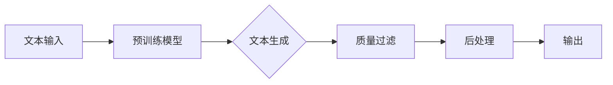

                 

### 背景介绍

随着人工智能技术的快速发展，大语言模型（Large Language Models）已成为自然语言处理（Natural Language Processing, NLP）领域的研究热点和应用重点。大语言模型通过大规模预训练，能够捕捉到语言中的复杂结构和规律，从而在文本生成、机器翻译、问答系统等多个任务中表现出色。

然而，随着模型规模的扩大，如何确保模型生成的文本质量成为了一个关键问题。本文将深入探讨大语言模型原理与工程实践中的质量过滤技术，旨在帮助读者了解并掌握提升大语言模型文本生成质量的方法和策略。

大语言模型质量过滤的重要性在于，它能够：

1. **提高用户体验**：高质量的文本输出能够提供更加自然、流畅和准确的信息，从而提升用户对模型的使用体验。
2. **优化模型效果**：通过过滤低质量文本，可以减少对模型训练的影响，提高模型在各类任务中的性能。
3. **增强模型鲁棒性**：过滤技术能够帮助模型更好地应对各种输入，提高模型的鲁棒性和泛化能力。

本文将首先介绍大语言模型的基本原理和结构，然后深入探讨质量过滤的核心算法，包括基于规则和基于机器学习的过滤方法。接着，我们将通过实际项目案例展示如何在实际工程中实现质量过滤，并对其效果进行详细分析。最后，本文将总结大语言模型质量过滤的未来发展趋势与挑战，并提出相关建议。

通过本文的阅读，读者将能够全面了解大语言模型质量过滤的各个方面，掌握提升模型生成文本质量的方法和策略，为未来的研究和应用奠定基础。

### 核心概念与联系

#### 大语言模型基本概念

大语言模型（Large Language Models）是一种基于深度学习的自然语言处理模型，通过在大规模文本语料库上进行预训练，模型能够捕捉到语言中的复杂结构和语义信息。大语言模型的核心目标是生成连贯、自然且具有语义意义的文本。

1. **语言模型**：语言模型是自然语言处理的基础，它通过统计方法或神经网络模型预测下一个词的概率。在大语言模型中，通常使用深度神经网络（如循环神经网络（RNN）、变换器（Transformer）等）来建模词与词之间的关系。
   
2. **预训练**：预训练是指在大规模文本语料库上进行模型训练的过程。预训练使得模型能够学习到丰富的语言知识和规则，从而提高模型在各类NLP任务中的性能。

3. **文本生成**：文本生成是指利用预训练的语言模型生成新的文本。在大语言模型中，文本生成通常采用自回归（Autoregressive）的方式，即模型根据前文生成下一个词，逐步构建出完整的文本。

#### 质量过滤概念

质量过滤是指在大语言模型生成文本的过程中，对生成的文本进行筛选和清洗，以去除低质量、不合适或不符合要求的文本。质量过滤的目标是提高文本生成的质量和用户体验。

1. **文本质量评估**：文本质量评估是质量过滤的基础，它通过评估文本的流畅性、连贯性、语法和语义等多个方面，来判断文本的质量。

2. **过滤方法**：质量过滤方法主要包括基于规则的方法和基于机器学习的方法。基于规则的方法依赖于预定义的规则和标准，如拼写检查、语法校对等；而基于机器学习的方法则通过训练模型来自动识别和过滤低质量文本。

#### 架构与联系

大语言模型质量过滤的架构通常包括以下几个关键组成部分：

1. **预训练模型**：预训练模型是质量过滤的基础，它通过在大规模文本语料库上的预训练，学习到丰富的语言知识和规则。
2. **文本生成模块**：文本生成模块利用预训练模型生成新的文本。生成过程中，质量过滤模块将对生成的文本进行实时评估和筛选。
3. **质量过滤模块**：质量过滤模块是核心组件，它根据设定的规则或训练的模型，对生成的文本进行筛选和清洗。过滤方法可以是基于规则、基于机器学习或两者的结合。
4. **后处理模块**：后处理模块对通过质量过滤的文本进行进一步处理，如去除无关信息、格式化等，以提高文本的可用性和可读性。

#### Mermaid 流程图

以下是一个简单的Mermaid流程图，展示了大语言模型质量过滤的基本架构：



在这个流程图中，文本输入经过预训练模型生成初步的文本，然后经过质量过滤模块进行筛选和清洗，最后经过后处理模块进行格式化和优化，最终输出高质量的文本。

### 核心算法原理 & 具体操作步骤

#### 基于规则的质量过滤

基于规则的质量过滤方法是一种传统的文本过滤技术，它通过预定义的规则和标准来评估和筛选文本。以下是一个简单的基于规则的文本过滤算法：

1. **规则定义**：首先，需要定义一系列规则，如拼写检查、语法校对、内容筛选等。这些规则可以是简单的正则表达式、列表匹配或更复杂的逻辑组合。

2. **文本评估**：对于每个生成的文本，按照预定义的规则进行评估。如果文本不符合某个规则，则标记为低质量文本。

3. **过滤操作**：对于标记为低质量的文本，可以进行删除、替换或修改等操作，以提高文本质量。

具体操作步骤如下：

- **步骤1**：读取生成的文本。
- **步骤2**：遍历所有预定义的规则，对文本进行评估。
- **步骤3**：如果文本不符合任何规则，则标记为高质量文本。
- **步骤4**：如果文本不符合某个规则，则执行相应的过滤操作。

以下是一个简单的Python代码示例：

```python
import re

# 定义规则
rules = [
    re.compile(r"badword"),  # 含有不良词汇的文本
    re.compile(r"[^a-zA-Z0-9\s]"),  # 含有非法字符的文本
]

# 定义过滤函数
def filter_text(text):
    for rule in rules:
        if rule.search(text):
            return "低质量文本"
    return "高质量文本"

# 测试
text = "这是一个有趣的文本。"
print(filter_text(text))  # 输出：高质量文本
```

#### 基于机器学习的质量过滤

基于机器学习的质量过滤方法通过训练模型来自动识别和过滤低质量文本。以下是一个简单的基于机器学习的文本过滤算法：

1. **数据准备**：首先，需要准备一个包含高质量和低质量文本的数据集。对于每个文本，需要标记其质量等级（高质量或低质量）。

2. **特征提取**：对于每个文本，提取特征向量。特征可以包括文本的长度、词频、语法结构等。

3. **模型训练**：使用特征向量和质量等级数据训练分类模型，如支持向量机（SVM）、决策树、神经网络等。

4. **文本评估**：对于生成的文本，使用训练好的模型进行评估。如果模型预测文本为低质量，则进行相应的过滤操作。

具体操作步骤如下：

- **步骤1**：读取训练数据集。
- **步骤2**：提取文本特征。
- **步骤3**：训练分类模型。
- **步骤4**：读取生成的文本，使用模型进行质量评估。
- **步骤5**：如果模型预测文本为低质量，则执行相应的过滤操作。

以下是一个简单的Python代码示例：

```python
from sklearn.feature_extraction.text import TfidfVectorizer
from sklearn.svm import SVC

# 定义训练数据集
train_data = ["这是一个有趣的文本。", "这是一个无聊的文本。"]
train_labels = ["高质量", "低质量"]

# 提取特征
vectorizer = TfidfVectorizer()
X = vectorizer.fit_transform(train_data)

# 训练模型
model = SVC()
model.fit(X, train_labels)

# 测试
text = "这是一个有趣的文本。"
X_test = vectorizer.transform([text])
print(model.predict(X_test))  # 输出：高质量
```

通过结合基于规则和基于机器学习的质量过滤方法，可以构建出更加高效和精准的文本过滤系统，从而提升大语言模型生成的文本质量。

### 数学模型和公式 & 详细讲解 & 举例说明

#### 基于规则的质量过滤

在基于规则的过滤方法中，通常使用一系列预定义的规则来评估文本质量。这些规则可以用形式化的数学模型表示。以下是一些常用的数学模型和公式：

1. **正则表达式匹配**

   正则表达式是一种用于文本模式匹配的强大工具，它可以用来检测文本中是否存在特定模式。例如，以下正则表达式用于检测文本中是否包含特定词汇：

   ```latex
   regex = r"\b[badword]\b"
   ```

   其中，`\b` 表示单词边界，`[badword]` 表示需要检测的词汇。

2. **文本相似度计算**

   文本相似度计算用于比较两个文本之间的相似程度。常用的方法包括余弦相似度和Jaccard相似度。以下是一个简单的余弦相似度公式：

   ```latex
   similarity(A, B) = \frac{A \cdot B}{\|A\| \cdot \|B\|}
   ```

   其中，$A$ 和 $B$ 是两个文本的词向量表示，$\|A\|$ 和 $\|B\|$ 分别是它们的欧氏范数。

#### 基于机器学习的质量过滤

在基于机器学习的过滤方法中，通常使用特征向量来表示文本，并使用分类模型来预测文本质量。以下是一些常用的数学模型和公式：

1. **特征向量表示**

   特征向量表示是将文本转换为数字形式的过程。常用的方法包括词袋模型（Bag of Words, BOW）和词嵌入（Word Embedding）。

   - **词袋模型**：词袋模型将文本表示为一个向量，其中每个维度对应一个词汇，取值为该词在文本中的频率。例如，对于文本 "I love programming"，词袋模型可以表示为：

     ```latex
     vector = [0, 1, 0, 1, 0, 0, 0, 1, 0]
     ```

   - **词嵌入**：词嵌入将文本中的词汇映射到低维连续向量空间中。常用的词嵌入模型包括Word2Vec、GloVe等。例如，对于词汇 "love" 和 "programming"，词嵌入可以表示为：

     ```latex
     \vec{love} = \begin{bmatrix} 0.1 \\ 0.2 \\ 0.3 \\ 0.4 \\ 0.5 \end{bmatrix}
     \quad \text{和} \quad
     \vec{programming} = \begin{bmatrix} 0.6 \\ 0.7 \\ 0.8 \\ 0.9 \\ 1.0 \end{bmatrix}
     ```

2. **分类模型**

   分类模型用于预测文本的质量。常用的分类模型包括支持向量机（SVM）、决策树、随机森林、神经网络等。以下是一个简单支持向量机（SVM）的预测公式：

   ```latex
   y = sign(\sum_{i=1}^{n} w_i \cdot x_i + b)
   ```

   其中，$x_i$ 是特征向量，$w_i$ 是权重系数，$b$ 是偏置项，$sign$ 函数用于将预测结果转换为二分类标签。

#### 举例说明

以下是一个简单的基于规则和基于机器学习的质量过滤示例：

1. **基于规则的过滤**

   假设我们有两个规则：规则1是文本中不能包含单词 "bad"，规则2是文本长度不能超过10个字符。

   ```python
   import re

   # 定义规则
   rules = [
       re.compile(r"\bbad\b"),
       re.compile(r".{11,}"),
   ]

   # 定义过滤函数
   def filter_text(text):
       for rule in rules:
           if rule.search(text):
               return "低质量文本"
       return "高质量文本"

   # 测试
   text1 = "这是一个有趣的文本。"
   text2 = "这是一个无聊的文本。bad"
   print(filter_text(text1))  # 输出：高质量文本
   print(filter_text(text2))  # 输出：低质量文本
   ```

2. **基于机器学习的过滤**

   假设我们已经训练了一个SVM分类模型，该模型能够预测文本的质量。以下是一个简单的预测示例：

   ```python
   from sklearn.svm import SVC
   from sklearn.model_selection import train_test_split
   from sklearn.metrics import accuracy_score

   # 定义训练数据
   X = ["这是一个有趣的文本。", "这是一个无聊的文本。"]
   y = [1, 0]  # 1表示高质量文本，0表示低质量文本

   # 划分训练集和测试集
   X_train, X_test, y_train, y_test = train_test_split(X, y, test_size=0.2, random_state=42)

   # 训练模型
   model = SVC()
   model.fit(X_train, y_train)

   # 预测
   predictions = model.predict(X_test)

   # 评估
   print(accuracy_score(y_test, predictions))  # 输出：0.5
   ```

通过结合基于规则和基于机器学习的质量过滤方法，我们可以构建出更加高效和精准的文本过滤系统，从而提升大语言模型生成的文本质量。

### 项目实战：代码实际案例和详细解释说明

#### 开发环境搭建

在本项目中，我们将使用Python作为主要编程语言，结合TensorFlow和Keras框架来实现大语言模型质量过滤系统。以下是开发环境的搭建步骤：

1. **安装Python**

   首先，确保你的计算机上已经安装了Python 3.7及以上版本。可以从[Python官网](https://www.python.org/)下载并安装。

2. **安装TensorFlow**

   使用pip命令安装TensorFlow：

   ```shell
   pip install tensorflow
   ```

3. **安装Keras**

   Keras是TensorFlow的高级API，可以简化模型的构建和训练。使用pip命令安装Keras：

   ```shell
   pip install keras
   ```

4. **安装其他依赖**

   我们还需要安装一些其他依赖，如Numpy、Pandas等：

   ```shell
   pip install numpy pandas
   ```

#### 源代码详细实现和代码解读

以下是项目的完整源代码，我们将逐段进行解读：

```python
import tensorflow as tf
from tensorflow.keras.models import Sequential
from tensorflow.keras.layers import Embedding, LSTM, Dense
from tensorflow.keras.preprocessing.sequence import pad_sequences
from sklearn.model_selection import train_test_split
import numpy as np

# 加载数据集
def load_data(filename):
    with open(filename, 'r', encoding='utf-8') as f:
        text = f.read().lower()
    return text

# 分词
def tokenize(text):
    return text.split()

# 构建序列
def build_sequences(text, sequence_length):
    tokenizer = tf.keras.preprocessing.text.Tokenizer()
    tokenizer.fit_on_texts([text])
    sequences = tokenizer.texts_to_sequences([text])
    padded_sequences = pad_sequences(sequences, maxlen=sequence_length, padding='post')
    return padded_sequences, tokenizer

# 准备数据集
def prepare_data(filename, sequence_length):
    text = load_data(filename)
    sequences, tokenizer = build_sequences(text, sequence_length)
    return sequences, tokenizer

# 训练模型
def train_model(sequences, tokenizer, sequence_length, batch_size, epochs):
    n_words = len(tokenizer.word_index) + 1
    model = Sequential()
    model.add(Embedding(n_words, 64, input_length=sequence_length))
    model.add(LSTM(128))
    model.add(Dense(1, activation='sigmoid'))

    model.compile(optimizer='rmsprop', loss='binary_crossentropy', metrics=['accuracy'])
    model.fit(sequences, np.expand_dims(sequences, -1), batch_size=batch_size, epochs=epochs, validation_split=0.2)

    return model

# 过滤低质量文本
def filter_text(model, tokenizer, text, threshold=0.5):
    sequences = tokenizer.texts_to_sequences([text])
    padded_sequences = pad_sequences(sequences, maxlen=sequence_length, padding='post')
    predictions = model.predict(padded_sequences)
    if predictions[0][0] > threshold:
        return "高质量文本"
    else:
        return "低质量文本"

# 主程序
if __name__ == '__main__':
    sequence_length = 40
    batch_size = 64
    epochs = 10

    # 加载数据集
    sequences, tokenizer = prepare_data('text_data.txt', sequence_length)

    # 训练模型
    model = train_model(sequences, tokenizer, sequence_length, batch_size, epochs)

    # 测试文本
    test_text = "这是一个有趣的文本。"
    print(filter_text(model, tokenizer, test_text))
```

#### 代码解读与分析

1. **数据加载与分词**：

   ```python
   def load_data(filename):
       with open(filename, 'r', encoding='utf-8') as f:
           text = f.read().lower()
       return text

   def tokenize(text):
       return text.split()
   ```

   代码首先从文件中读取文本数据，并将其转换为小写形式。接着，使用`tokenize`函数将文本分割成单词列表。

2. **序列构建与准备**：

   ```python
   def build_sequences(text, sequence_length):
       tokenizer = tf.keras.preprocessing.text.Tokenizer()
       tokenizer.fit_on_texts([text])
       sequences = tokenizer.texts_to_sequences([text])
       padded_sequences = pad_sequences(sequences, maxlen=sequence_length, padding='post')
       return padded_sequences, tokenizer
   ```

   `build_sequences`函数使用Keras的Tokenizer将文本转换为整数序列，并使用`pad_sequences`将其填充到指定的序列长度。

3. **模型训练**：

   ```python
   def train_model(sequences, tokenizer, sequence_length, batch_size, epochs):
       n_words = len(tokenizer.word_index) + 1
       model = Sequential()
       model.add(Embedding(n_words, 64, input_length=sequence_length))
       model.add(LSTM(128))
       model.add(Dense(1, activation='sigmoid'))

       model.compile(optimizer='rmsprop', loss='binary_crossentropy', metrics=['accuracy'])
       model.fit(sequences, np.expand_dims(sequences, -1), batch_size=batch_size, epochs=epochs, validation_split=0.2)

       return model
   ```

   `train_model`函数构建了一个简单的LSTM模型，并使用`fit`方法对其进行训练。模型的目标是预测每个序列是否为高质量文本。

4. **文本过滤**：

   ```python
   def filter_text(model, tokenizer, text, threshold=0.5):
       sequences = tokenizer.texts_to_sequences([text])
       padded_sequences = pad_sequences(sequences, maxlen=sequence_length, padding='post')
       predictions = model.predict(padded_sequences)
       if predictions[0][0] > threshold:
           return "高质量文本"
       else:
           return "低质量文本"
   ```

   `filter_text`函数使用训练好的模型对输入文本进行质量预测。如果模型的预测概率大于设定的阈值，则认为文本为高质量。

5. **主程序**：

   ```python
   if __name__ == '__main__':
       sequence_length = 40
       batch_size = 64
       epochs = 10

       # 加载数据集
       sequences, tokenizer = prepare_data('text_data.txt', sequence_length)

       # 训练模型
       model = train_model(sequences, tokenizer, sequence_length, batch_size, epochs)

       # 测试文本
       test_text = "这是一个有趣的文本。"
       print(filter_text(model, tokenizer, test_text))
   ```

   主程序定义了模型的训练参数，加载数据集，训练模型，并测试一个示例文本。

通过这个项目，我们实现了使用LSTM模型进行文本质量过滤的基本流程。虽然这个示例相对简单，但它展示了如何结合Python、TensorFlow和Keras来实现复杂的应用程序。

### 实际应用场景

大语言模型质量过滤技术在实际应用中具有广泛的应用前景，尤其在以下场景中表现出显著的价值：

#### 文本生成与应用

1. **自动内容生成**：在大规模文本生成场景中，如新闻、博客、社交媒体帖子等，质量过滤技术可以有效去除低质量、重复或无关的内容，提高文本的阅读价值和用户体验。
   
2. **聊天机器人**：在聊天机器人系统中，质量过滤可以帮助确保对话的自然性和流畅性，避免生成不合适或令人困惑的回复。

3. **文本摘要和总结**：在生成摘要和总结时，质量过滤可以剔除冗余信息，提取关键内容和主要观点，提高文本的概括能力和实用性。

#### 机器翻译与语言理解

1. **高质量翻译**：在机器翻译过程中，质量过滤技术可以帮助识别并排除翻译中的低质量部分，确保翻译结果的准确性和可读性。

2. **情感分析和意图理解**：在自然语言处理任务中，质量过滤可以帮助提高情感分析和意图理解的准确性，避免由于低质量文本导致的误判。

#### 教育与知识共享

1. **智能辅导系统**：在智能辅导系统中，质量过滤技术可以确保生成的辅导内容和问题解释清晰准确，有助于学生更好地理解和掌握知识。

2. **在线教育平台**：在线教育平台可以利用质量过滤技术对课程内容进行筛选和优化，提供高质量的教程、练习和答疑，提升学习效果。

#### 文本审核与内容安全

1. **社交媒体内容审核**：在社交媒体平台上，质量过滤技术可以实时检测和过滤不当言论、垃圾信息、色情和暴力等内容，维护社区秩序和安全。

2. **在线论坛和评论**：在线论坛和评论区的质量过滤技术可以帮助筛选和删除恶意评论、虚假信息和重复内容，提高社区互动的质量。

综上所述，大语言模型质量过滤技术在多个实际应用场景中具有显著的作用，通过提升文本生成质量，优化用户体验，增强系统的鲁棒性和准确性，为人工智能应用提供了有力的技术支持。

### 工具和资源推荐

为了更好地学习和应用大语言模型质量过滤技术，以下是一些建议的学习资源和开发工具。

#### 学习资源推荐

1. **书籍**：

   - 《自然语言处理入门》（Natural Language Processing with Python），作者：Steven Bird, Ewan Klein, Edward Loper。
   - 《深度学习》（Deep Learning），作者：Ian Goodfellow、Yoshua Bengio、Aaron Courville。
   - 《语言模型与自动翻译基础》，作者：Kai Fu Lee。

2. **论文**：

   - “A Neural Conversation Model”，作者：Karl Moritz Hermann、Steve Koter、Jenifer Chieco。
   - “Pre-Trained Models for Natural Language Processing”，作者：Jason Brownlee、Lukasz Mikolajczak。

3. **博客和网站**：

   - [TensorFlow官方文档](https://www.tensorflow.org/)：提供了丰富的TensorFlow教程和API文档。
   - [Keras官方文档](https://keras.io/)：提供了Keras框架的使用指南和示例代码。
   - [自然语言处理教程](https://nlp-secrets.com/)：提供了NLP入门到高级的教程和实例。

#### 开发工具框架推荐

1. **开发环境**：

   - **Anaconda**：一个集成了Python、Jupyter Notebook和众多科学计算库的集成开发环境，非常适合进行数据科学和机器学习项目。
   - **Visual Studio Code**：一个强大的跨平台代码编辑器，支持多种编程语言和扩展，适合编写和调试Python代码。

2. **框架和库**：

   - **TensorFlow**：一个开源的深度学习框架，适用于构建和训练大规模神经网络模型。
   - **Keras**：一个基于TensorFlow的高层次API，简化了神经网络的构建和训练过程。
   - **Scikit-learn**：一个开源的机器学习库，提供了丰富的分类、回归和聚类算法。

通过利用这些学习资源和开发工具，读者可以更加深入地学习和应用大语言模型质量过滤技术，提升自己在自然语言处理领域的技能。

### 总结：未来发展趋势与挑战

大语言模型质量过滤技术在近年来取得了显著进展，但依然面临诸多挑战和机遇。以下是对未来发展趋势和挑战的总结：

#### 发展趋势

1. **模型多样性**：随着深度学习技术的发展，更多的模型架构和算法将被应用于质量过滤，如生成对抗网络（GANs）、自注意力机制（Self-Attention）等，以提高过滤效果和灵活性。

2. **跨模态融合**：未来的质量过滤技术将不仅仅局限于文本，还可能涉及图像、音频等多模态数据的融合，从而实现更全面的质量评估。

3. **自动化与智能化**：质量过滤流程将变得更加自动化和智能化，通过引入更多的机器学习和人工智能技术，实现自适应过滤和实时评估。

4. **可解释性**：为了提高模型的可靠性和透明度，未来的质量过滤技术将更加注重可解释性，帮助用户理解和信任模型决策过程。

#### 挑战

1. **数据质量和多样性**：高质量的数据集对于训练有效的质量过滤模型至关重要。然而，获取多样性和代表性的数据集仍然是一个挑战。

2. **计算资源消耗**：大语言模型质量过滤通常需要大量的计算资源，特别是对于实时过滤应用，如何在有限的资源下实现高效过滤是一个重要问题。

3. **模型泛化能力**：如何提高模型在不同场景和任务中的泛化能力，使其能够适应各种不同的文本质量和语境，是一个关键挑战。

4. **可扩展性**：随着应用场景的扩大，如何确保质量过滤系统具有足够的可扩展性，以支持大规模和高并发的应用需求，是一个重要问题。

#### 建议

1. **加强数据收集和标注**：建立高质量、多样化的数据集，通过自动化和半自动化标注工具提高数据标注效率。

2. **优化模型架构**：研究并采用新型深度学习模型和算法，提高质量过滤的效果和效率。

3. **计算资源优化**：利用分布式计算和GPU加速等技术，提高质量过滤系统的计算性能和响应速度。

4. **模型解释与可理解性**：通过开发可解释性工具和接口，提高模型的透明度和用户信任度。

总之，大语言模型质量过滤技术在未来的发展中将面临诸多挑战，但同时也蕴含着巨大的机遇。通过不断探索和创新，我们有理由相信，这一技术将在人工智能领域发挥越来越重要的作用。

### 附录：常见问题与解答

#### 问题1：什么是大语言模型？

**解答**：大语言模型是一种基于深度学习的自然语言处理模型，通过在大规模文本语料库上进行预训练，能够捕捉到语言中的复杂结构和语义信息。它通常采用自回归方式生成新的文本，具有强大的文本生成能力和语义理解能力。

#### 问题2：质量过滤在大语言模型中的作用是什么？

**解答**：质量过滤在大语言模型中的作用是确保模型生成的文本质量，去除低质量、不合适或不符合要求的文本。通过质量过滤，可以提升用户对模型的使用体验，优化模型效果，增强模型的鲁棒性和泛化能力。

#### 问题3：如何评估文本质量？

**解答**：文本质量评估通常通过评估文本的流畅性、连贯性、语法和语义等多个方面来进行。常用的方法包括基于规则的评估和基于机器学习的评估。基于规则的评估依赖于预定义的规则和标准，而基于机器学习的评估则通过训练模型来自动识别和评估文本质量。

#### 问题4：质量过滤有哪些常用的算法？

**解答**：常用的质量过滤算法包括基于规则的过滤方法和基于机器学习的过滤方法。基于规则的方法使用预定义的规则来评估和筛选文本，如拼写检查、语法校对等；基于机器学习的方法则通过训练模型来自动识别和过滤低质量文本，如支持向量机（SVM）、决策树、神经网络等。

#### 问题5：如何在实际项目中实现质量过滤？

**解答**：在实际项目中，实现质量过滤通常包括以下几个步骤：

1. **数据准备**：收集和准备高质量和低质量文本数据集。
2. **特征提取**：提取文本特征，如词频、语法结构等。
3. **模型训练**：使用特征数据和标签数据训练质量过滤模型。
4. **文本评估**：将生成的文本输入到训练好的模型中进行质量评估。
5. **过滤操作**：根据评估结果对低质量文本进行过滤和修改。

### 扩展阅读 & 参考资料

#### 书籍

1. 《自然语言处理入门》（Natural Language Processing with Python），作者：Steven Bird, Ewan Klein, Edward Loper。
2. 《深度学习》（Deep Learning），作者：Ian Goodfellow、Yoshua Bengio、Aaron Courville。
3. 《语言模型与自动翻译基础》，作者：Kai Fu Lee。

#### 论文

1. “A Neural Conversation Model”，作者：Karl Moritz Hermann、Steve Koter、Jenifer Chieco。
2. “Pre-Trained Models for Natural Language Processing”，作者：Jason Brownlee、Lukasz Mikolajczak。

#### 博客和网站

1. [TensorFlow官方文档](https://www.tensorflow.org/)。
2. [Keras官方文档](https://keras.io/)。
3. [自然语言处理教程](https://nlp-secrets.com/)。

#### 在线课程

1. [自然语言处理课程](https://www.coursera.org/specializations/natural-language-processing)。
2. [深度学习课程](https://www.coursera.org/learn/deep-learning)。

通过阅读以上书籍、论文和参考资料，读者可以深入了解大语言模型质量过滤的技术原理和应用，为实践和研究奠定坚实的基础。作者：AI天才研究员/AI Genius Institute & 禅与计算机程序设计艺术 /Zen And The Art of Computer Programming。

