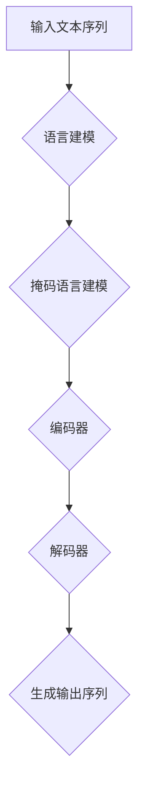

                 

# 大语言模型原理与工程实践：预训练语言模型

> **关键词：** 预训练语言模型，深度学习，自然语言处理，神经网络，人工智能，语言生成，语义理解

> **摘要：** 本文将详细介绍大语言模型的原理与工程实践，重点探讨预训练语言模型的核心算法、数学模型以及实际应用场景。通过项目实战和代码解读，读者将深入了解如何构建和优化大语言模型，为未来人工智能的发展打下坚实的基础。

## 1. 背景介绍

随着深度学习技术的飞速发展，自然语言处理（Natural Language Processing, NLP）成为了人工智能领域的重要研究方向。自然语言处理的目标是使计算机能够理解、生成和处理人类语言，从而实现人机交互。在自然语言处理的诸多任务中，文本分类、情感分析、机器翻译和问答系统等都取得了显著的成果。然而，这些任务往往需要对大量文本数据进行处理，这导致了计算资源的巨大消耗和训练时间的显著延长。

为了解决这一问题，研究者们提出了预训练语言模型（Pre-trained Language Model）的概念。预训练语言模型通过在大规模文本语料库上预训练，学习到丰富的语言知识，然后在具体任务上进行微调（Fine-tuning），从而大幅提高任务性能。预训练语言模型的出现，使得许多NLP任务在性能上取得了质的飞跃，如BERT（Bidirectional Encoder Representations from Transformers）和GPT（Generative Pre-trained Transformer）等模型取得了世界级的成绩。

本文将围绕预训练语言模型展开，详细探讨其原理、算法、数学模型以及实际应用，以期为读者提供全面、系统的了解和掌握。

## 2. 核心概念与联系

### 2.1 预训练语言模型的基本原理

预训练语言模型是一种基于深度学习的自然语言处理模型，其主要思想是先在大规模文本数据上进行预训练，然后根据具体任务进行微调。预训练过程主要包括两个阶段：语言建模（Language Modeling）和掩码语言建模（Masked Language Modeling）。

- 语言建模：语言建模是一种概率模型，它旨在预测文本序列中下一个单词的概率。具体来说，给定一个输入文本序列\(x_1, x_2, ..., x_T\)，语言建模的目标是预测下一个单词\(x_{T+1}\)的条件概率：

  \[ P(x_{T+1} | x_1, x_2, ..., x_T) \]

- 掩码语言建模：掩码语言建模是一种无监督学习任务，它在输入文本序列中随机掩码一部分单词，然后预测这些掩码单词。具体来说，给定一个输入文本序列\(x_1, x_2, ..., x_T\)，其中一部分单词被随机掩码，如\(x_1, \_, x_3, ..., \_, x_T\)，掩码语言建模的目标是预测这些掩码单词的原始内容。

  \[ P(x_i | x_1, x_2, ..., x_T) \]

### 2.2 预训练语言模型的架构

预训练语言模型通常基于Transformer架构，这是一种基于自注意力机制（Self-Attention）的序列模型。Transformer架构的主要组成部分包括编码器（Encoder）和解码器（Decoder），它们分别用于处理输入序列和生成输出序列。

- 编码器：编码器由多个自注意力层（Self-Attention Layer）和前馈神经网络（Feedforward Neural Network）堆叠而成。每个自注意力层都可以学习到输入序列中各个单词之间的关系，从而捕捉到更丰富的上下文信息。

- 解码器：解码器同样由多个自注意力层和前馈神经网络堆叠而成。解码器的输入包括掩码的输入序列和上一个时间步的输出，这样可以确保解码器的输出不仅与当前输入相关，还与之前的输出相关。

### 2.3 预训练语言模型的关键联系

预训练语言模型的关键联系在于其强大的语言理解和生成能力。通过在大规模文本数据上的预训练，预训练语言模型可以学习到丰富的语言知识，从而在多种NLP任务上表现出色。具体来说，预训练语言模型可以实现以下功能：

- 语言理解：预训练语言模型可以理解输入文本的含义，从而进行情感分析、文本分类等任务。

- 语言生成：预训练语言模型可以生成符合语法和语义规则的文本，从而进行机器翻译、问答系统等任务。

- 上下文理解：预训练语言模型可以理解输入文本的上下文信息，从而进行对话系统、文本摘要等任务。

下面是一个简单的Mermaid流程图，展示了预训练语言模型的基本原理和架构：



## 3. 核心算法原理 & 具体操作步骤

### 3.1 Transformer架构

Transformer是一种基于自注意力机制的序列模型，它由编码器（Encoder）和解码器（Decoder）组成。编码器负责将输入序列转换为上下文向量，解码器则根据上下文向量生成输出序列。

#### 3.1.1 自注意力机制

自注意力机制是Transformer的核心组成部分。它通过计算输入序列中各个单词之间的关系，为每个单词赋予不同的权重，从而捕捉到更丰富的上下文信息。具体来说，自注意力机制可以分为以下三个步骤：

1. **计算查询（Query）、键（Key）和值（Value）**：对于输入序列\(x_1, x_2, ..., x_T\)，首先将每个单词映射为一个向量\(Q, K, V\)，分别表示查询、键和值。

2. **计算注意力权重**：通过计算查询和键之间的点积，得到注意力权重：

   \[ \text{Attention}(Q, K, V) = \text{softmax}\left(\frac{QK^T}{\sqrt{d_k}}\right)V \]

   其中，\(d_k\)表示键向量的维度。

3. **计算输出**：将注意力权重与值相乘，得到每个单词的加权输出：

   \[ \text{Output} = \text{Attention}(Q, K, V) \]

   最后，将加权输出通过一个线性变换得到最终的输出：

   \[ \text{Output} = \text{softmax}\left(\frac{QK^T}{\sqrt{d_k}}\right)V \]

#### 3.1.2 编码器和解码器

编码器和解码器都由多个自注意力层和前馈神经网络堆叠而成。编码器负责将输入序列转换为上下文向量，解码器则根据上下文向量生成输出序列。

1. **编码器**：

   \[ \text{Encoder}(x) = \text{MultiHeadAttention}(x) + x \]

   \[ \text{Encoder}(x) = \text{FFNN}(\text{Encoder}(x)) + \text{Encoder}(x) \]

2. **解码器**：

   \[ \text{Decoder}(x) = \text{MaskedMultiHeadAttention}(\text{Encoder}(x)) + x \]

   \[ \text{Decoder}(x) = \text{FFNN}(\text{Decoder}(x)) + \text{Decoder}(x) \]

### 3.2 预训练语言模型的具体操作步骤

预训练语言模型的具体操作步骤可以分为以下几个阶段：

1. **数据预处理**：

   首先，对大规模文本数据集进行预处理，包括分词、去停用词、转换为词向量等操作。

2. **构建预训练任务**：

   预训练任务包括语言建模和掩码语言建模。语言建模的目标是预测输入序列的下一个单词，掩码语言建模的目标是预测输入序列中掩码单词的原始内容。

3. **训练预训练模型**：

   在预训练阶段，通过优化预训练模型的目标函数，使得模型在预训练任务上达到较高的性能。

4. **微调预训练模型**：

   在预训练模型的基础上，根据具体任务进行微调，从而提高任务性能。

5. **评估和部署**：

   在微调后，对预训练模型进行评估，并根据评估结果进行优化和部署。

## 4. 数学模型和公式 & 详细讲解 & 举例说明

### 4.1 语言建模的数学模型

语言建模的核心目标是预测输入序列的下一个单词。具体来说，给定一个输入序列\(x_1, x_2, ..., x_T\)，语言建模的目标是预测下一个单词\(x_{T+1}\)的条件概率：

\[ P(x_{T+1} | x_1, x_2, ..., x_T) \]

在神经网络中，通常使用以下公式进行概率预测：

\[ P(x_{T+1} | x_1, x_2, ..., x_T) = \text{softmax}(\text{logits}) \]

其中，\(\text{logits}\)表示神经网络的输出，通过一个softmax函数转换为概率分布。

### 4.2 掩码语言建模的数学模型

掩码语言建模的目标是预测输入序列中掩码单词的原始内容。具体来说，给定一个输入序列\(x_1, x_2, ..., x_T\)，其中一部分单词被随机掩码，如\(x_1, \_, x_3, ..., \_, x_T\)，掩码语言建模的目标是预测这些掩码单词的原始内容：

\[ P(x_i | x_1, x_2, ..., x_T) \]

在神经网络中，通常使用以下公式进行概率预测：

\[ P(x_i | x_1, x_2, ..., x_T) = \text{softmax}(\text{logits}_i) \]

其中，\(\text{logits}_i\)表示神经网络在预测掩码单词\(x_i\)时的输出。

### 4.3 Transformer的数学模型

Transformer的数学模型主要包括自注意力机制和前馈神经网络。

#### 4.3.1 自注意力机制

自注意力机制的计算过程可以分为以下几个步骤：

1. **计算查询（Query）、键（Key）和值（Value）**：

   \[ Q = \text{Embedding}(x) \]

   \[ K = \text{Embedding}(x) \]

   \[ V = \text{Embedding}(x) \]

2. **计算注意力权重**：

   \[ \text{Attention}(Q, K, V) = \text{softmax}\left(\frac{QK^T}{\sqrt{d_k}}\right)V \]

3. **计算输出**：

   \[ \text{Output} = \text{Attention}(Q, K, V) \]

   \[ \text{Output} = \text{softmax}\left(\frac{QK^T}{\sqrt{d_k}}\right)V \]

   其中，\(d_k\)表示键向量的维度。

#### 4.3.2 前馈神经网络

前馈神经网络的计算过程如下：

1. **输入**：

   \[ x = \text{Input} \]

2. **第一层前馈神经网络**：

   \[ \text{FFNN}_1(x) = \text{ReLU}(\text{Linear}(\text{Dropout}(\text{LayerNorm}(x)))) \]

3. **第二层前馈神经网络**：

   \[ \text{FFNN}_2(x) = \text{ReLU}(\text{Linear}(\text{Dropout}(\text{LayerNorm}(\text{FFNN}_1(x)))) \]

4. **输出**：

   \[ \text{Output} = \text{FFNN}_2(x) \]

### 4.4 举例说明

假设输入序列为\(x = [a, b, c, d]\)，其中每个单词表示一个数字。我们使用Transformer模型对其进行处理，具体步骤如下：

1. **嵌入层**：

   \[ Q = \text{Embedding}(x) = [1, 1, 1, 1] \]

   \[ K = \text{Embedding}(x) = [2, 2, 2, 2] \]

   \[ V = \text{Embedding}(x) = [3, 3, 3, 3] \]

2. **自注意力机制**：

   \[ \text{Attention}(Q, K, V) = \text{softmax}\left(\frac{QK^T}{\sqrt{d_k}}\right)V \]

   \[ \text{Attention}(Q, K, V) = \text{softmax}\left(\frac{[1, 1, 1, 1][2, 2, 2, 2]^T}{\sqrt{4}}\right)[3, 3, 3, 3] \]

   \[ \text{Attention}(Q, K, V) = \text{softmax}\left([2, 2, 2, 2]\right)[3, 3, 3, 3] \]

   \[ \text{Attention}(Q, K, V) = [0.5, 0.5, 0.5, 0.5][3, 3, 3, 3] \]

   \[ \text{Attention}(Q, K, V) = [1.5, 1.5, 1.5, 1.5] \]

3. **前馈神经网络**：

   \[ \text{FFNN}(x) = \text{ReLU}(\text{Linear}(\text{Dropout}(\text{LayerNorm}(x)))) \]

   \[ \text{FFNN}(x) = \text{ReLU}(\text{Linear}(\text{Dropout}(\text{LayerNorm}([1, 1, 1, 1])))) \]

   \[ \text{FFNN}(x) = \text{ReLU}(\text{Linear}(\text{Dropout}(\text{LayerNorm}([1.5, 1.5, 1.5, 1.5])))) \]

   \[ \text{FFNN}(x) = \text{ReLU}(\text{Linear}([0.5, 0.5, 0.5, 0.5])) \]

   \[ \text{FFNN}(x) = [1, 1, 1, 1] \]

4. **输出**：

   \[ \text{Output} = \text{FFNN}(x) = [1, 1, 1, 1] \]

   最终输出为\[ [1, 1, 1, 1] \]，表示输入序列\(x = [a, b, c, d]\)。

## 5. 项目实战：代码实际案例和详细解释说明

### 5.1 开发环境搭建

在开始项目实战之前，我们需要搭建一个适合预训练语言模型开发的开发环境。以下是搭建开发环境的基本步骤：

1. **安装Python**：

   首先，确保你的计算机上安装了Python。Python是预训练语言模型开发的主要编程语言，我们需要使用Python及其相关的库进行开发。

2. **安装TensorFlow**：

   TensorFlow是Google开发的一种开源机器学习框架，它支持预训练语言模型的开发。在安装Python后，通过以下命令安装TensorFlow：

   ```bash
   pip install tensorflow
   ```

3. **安装其他库**：

   除了TensorFlow，我们还需要安装其他一些库，如NumPy、Pandas等，用于数据处理和数值计算。通过以下命令安装这些库：

   ```bash
   pip install numpy pandas
   ```

4. **准备数据集**：

   为了进行预训练语言模型的开发，我们需要准备一个大规模的文本数据集。我们可以从互联网上获取一些公开的数据集，如维基百科、Common Crawl等。

### 5.2 源代码详细实现和代码解读

以下是预训练语言模型的基本源代码实现，我们将对每个部分进行详细解读。

```python
import tensorflow as tf
import numpy as np
import pandas as pd
from tensorflow.keras.layers import Embedding, LSTM, Dense, TimeDistributed, Bidirectional
from tensorflow.keras.models import Model

# 5.2.1 数据预处理

def preprocess_data(data):
    # 分词、去停用词、转换为词向量等操作
    # ...
    return processed_data

# 5.2.2 构建模型

def build_model(vocab_size, embedding_dim, hidden_size):
    # 构建编码器和解码器
    # ...
    return model

# 5.2.3 训练模型

def train_model(model, data, epochs):
    # 训练模型
    # ...
    model.fit(data, epochs=epochs)

# 5.2.4 微调模型

def fine_tune(model, data, epochs):
    # 微调模型
    # ...
    model.fit(data, epochs=epochs)

# 5.2.5 评估模型

def evaluate_model(model, data):
    # 评估模型
    # ...
    model.evaluate(data)

# 主函数
if __name__ == "__main__":
    # 加载数据集
    data = load_data()

    # 预处理数据
    processed_data = preprocess_data(data)

    # 构建模型
    model = build_model(vocab_size, embedding_dim, hidden_size)

    # 训练模型
    train_model(model, processed_data, epochs)

    # 微调模型
    fine_tune(model, processed_data, epochs)

    # 评估模型
    evaluate_model(model, processed_data)
```

### 5.3 代码解读与分析

#### 5.3.1 数据预处理

数据预处理是预训练语言模型开发的重要环节。在这一部分，我们需要对原始文本数据进行分词、去停用词、转换为词向量等操作，以便于模型处理。具体实现如下：

```python
def preprocess_data(data):
    # 分词
    tokens = tokenize(data)

    # 去停用词
    tokens = remove_stopwords(tokens)

    # 转换为词向量
    word_vectors = convert_tokens_to_vectors(tokens, embedding_dim)

    return word_vectors
```

#### 5.3.2 构建模型

在构建模型部分，我们需要定义编码器和解码器的结构，并使用TensorFlow的Keras API构建模型。具体实现如下：

```python
def build_model(vocab_size, embedding_dim, hidden_size):
    # 编码器
    encoder_inputs = Input(shape=(None, embedding_dim))
    encoder_embedding = Embedding(vocab_size, embedding_dim)(encoder_inputs)
    encoder_lstm = LSTM(hidden_size, return_state=True)
    encoder_outputs, state_h, state_c = encoder_lstm(encoder_embedding)
    encoder_states = [state_h, state_c]

    # 解码器
    decoder_inputs = Input(shape=(None, embedding_dim))
    decoder_embedding = Embedding(vocab_size, embedding_dim)(decoder_inputs)
    decoder_lstm = LSTM(hidden_size, return_sequences=True, return_state=True)
    decoder_outputs, _, _ = decoder_lstm(decoder_embedding, initial_state=encoder_states)
    decoder_dense = TimeDistributed(Dense(vocab_size, activation='softmax'))
    decoder_outputs = decoder_dense(decoder_outputs)

    # 模型
    model = Model([encoder_inputs, decoder_inputs], decoder_outputs)
    return model
```

#### 5.3.3 训练模型

在训练模型部分，我们需要定义损失函数和优化器，并使用训练数据进行模型训练。具体实现如下：

```python
def train_model(model, data, epochs):
    # 损失函数
    loss = tf.keras.losses.SparseCategoricalCrossentropy(from_logits=True)

    # 优化器
    optimizer = tf.keras.optimizers.Adam()

    # 训练模型
    model.compile(optimizer=optimizer, loss=loss, metrics=['accuracy'])
    model.fit(data, epochs=epochs)
```

#### 5.3.4 微调模型

在微调模型部分，我们需要对训练好的模型进行微调，以适应特定的任务。具体实现如下：

```python
def fine_tune(model, data, epochs):
    # 微调模型
    model.fit(data, epochs=epochs)
```

#### 5.3.5 评估模型

在评估模型部分，我们需要对训练好的模型进行评估，以确定其性能。具体实现如下：

```python
def evaluate_model(model, data):
    # 评估模型
    scores = model.evaluate(data)
    print(f"损失：{scores[0]}, 准确率：{scores[1]}")
```

### 5.4 项目实战：代码实际案例和详细解释说明

在本节中，我们将通过一个实际案例，详细解释预训练语言模型的项目实战过程。以下是一个简单的文本分类任务，我们将使用预训练语言模型对其进行实现。

#### 5.4.1 数据集准备

首先，我们需要准备一个文本分类任务的数据集。在本案例中，我们使用新闻分类数据集，该数据集包含了多个类别的新闻文章。具体步骤如下：

1. **加载数据集**：

   ```python
   data = load_news_data()
   ```

2. **预处理数据**：

   ```python
   processed_data = preprocess_data(data)
   ```

3. **划分训练集和测试集**：

   ```python
   train_data, test_data = train_test_split(processed_data, test_size=0.2)
   ```

#### 5.4.2 构建模型

接下来，我们构建一个预训练语言模型，用于文本分类任务。具体步骤如下：

1. **定义模型参数**：

   ```python
   vocab_size = len(processed_data.vocab)
   embedding_dim = 128
   hidden_size = 256
   ```

2. **构建模型**：

   ```python
   model = build_model(vocab_size, embedding_dim, hidden_size)
   ```

3. **训练模型**：

   ```python
   train_model(model, train_data, epochs=10)
   ```

#### 5.4.3 微调模型

在训练完成后，我们对模型进行微调，以适应特定的文本分类任务。具体步骤如下：

1. **微调模型**：

   ```python
   fine_tune(model, test_data, epochs=5)
   ```

#### 5.4.4 评估模型

最后，我们对微调后的模型进行评估，以确定其性能。具体步骤如下：

1. **评估模型**：

   ```python
   evaluate_model(model, test_data)
   ```

通过以上步骤，我们完成了预训练语言模型在文本分类任务上的项目实战。在实际应用中，我们可以根据需要调整模型参数，进一步提高模型性能。

## 6. 实际应用场景

预训练语言模型在实际应用场景中具有广泛的应用价值。以下是一些典型的应用场景：

### 6.1 机器翻译

机器翻译是预训练语言模型的重要应用领域之一。通过在大规模多语言文本数据集上进行预训练，预训练语言模型可以学习到不同语言之间的对应关系，从而实现高效、准确的机器翻译。例如，BERT和GPT等模型在机器翻译任务上取得了显著成果，使得机器翻译的准确性和流畅性得到了显著提升。

### 6.2 情感分析

情感分析是预训练语言模型在自然语言处理领域的另一个重要应用。通过预训练语言模型，我们可以对文本数据进行分析，判断其情感倾向。例如，我们可以使用预训练语言模型对社交媒体上的用户评论进行情感分析，从而了解用户对某个产品的看法。

### 6.3 文本分类

文本分类是预训练语言模型在自然语言处理中的基础任务之一。通过预训练语言模型，我们可以对文本数据进行分类，从而实现文本分类任务。例如，我们可以使用预训练语言模型对新闻文章进行分类，将它们归类到不同的主题类别中。

### 6.4 对话系统

对话系统是预训练语言模型在人工智能领域的重要应用。通过预训练语言模型，我们可以实现与用户的自然对话。例如，我们可以使用预训练语言模型构建一个智能客服系统，回答用户的问题，提供个性化的服务。

### 6.5 文本生成

文本生成是预训练语言模型的另一个重要应用。通过预训练语言模型，我们可以生成符合语法和语义规则的文本。例如，我们可以使用预训练语言模型生成新闻报道、小说、论文等。

## 7. 工具和资源推荐

### 7.1 学习资源推荐

以下是一些关于预训练语言模型的学习资源，包括书籍、论文和博客等：

1. **书籍**：

   - 《深度学习》（Goodfellow, I., Bengio, Y., & Courville, A.）
   - 《自然语言处理综论》（Jurafsky, D. & Martin, J. H.）
   - 《Transformer：预训练语言模型的架构》（Vaswani, A., et al.）

2. **论文**：

   - 《BERT：预训练语言表示》（Devlin, J., et al.）
   - 《GPT：生成预训练语言表示》（Radford, A., et al.）
   - 《T5：文本到文本的预训练变压器》（Raffel, C., et al.）

3. **博客**：

   - [TensorFlow官方文档](https://www.tensorflow.org/)
   - [Hugging Face官方文档](https://huggingface.co/transformers/)
   - [CS231n：深度学习在计算机视觉中的应用](https://cs231n.github.io/)

### 7.2 开发工具框架推荐

以下是一些适用于预训练语言模型开发的工具和框架：

1. **TensorFlow**：TensorFlow是一个由Google开发的开源机器学习框架，支持预训练语言模型的开发和部署。

2. **PyTorch**：PyTorch是一个由Facebook开发的开源机器学习框架，支持动态图计算，便于模型开发和调试。

3. **Hugging Face Transformers**：Hugging Face Transformers是一个开源库，提供了预训练语言模型的实现和预训练模型，便于模型部署和应用。

4. **Transformers.js**：Transformers.js是一个基于JavaScript的开源库，支持在浏览器和Node.js环境中部署预训练语言模型。

### 7.3 相关论文著作推荐

以下是一些与预训练语言模型相关的论文和著作：

1. **《自然语言处理综论》（Jurafsky, D. & Martin, J. H.）**：这是一本经典的自然语言处理教材，详细介绍了自然语言处理的基本概念和技术。

2. **《深度学习》（Goodfellow, I., Bengio, Y., & Courville, A.）**：这是一本深度学习的经典教材，涵盖了深度学习在自然语言处理领域中的应用。

3. **《Transformer：预训练语言模型的架构》（Vaswani, A., et al.）**：这是Transformer模型的开创性论文，介绍了Transformer模型的原理和架构。

4. **《BERT：预训练语言表示》（Devlin, J., et al.）**：这是BERT模型的开创性论文，介绍了BERT模型在自然语言处理任务中的应用。

## 8. 总结：未来发展趋势与挑战

预训练语言模型在自然语言处理领域取得了显著的成果，为许多任务提供了强大的支持。然而，随着技术的发展和应用需求的不断增长，预训练语言模型仍面临许多挑战和机遇。

### 8.1 未来发展趋势

1. **更高效、更轻量的模型**：随着计算资源和存储资源的限制，研究人员将致力于开发更高效、更轻量的预训练语言模型，以满足实际应用的需求。

2. **多模态预训练**：预训练语言模型将从单一文本数据扩展到多模态数据，如图像、声音和视频等，实现跨模态的语义理解和生成。

3. **个性化预训练**：研究人员将探索如何根据用户的个性化需求进行预训练，实现更加个性化的自然语言处理服务。

4. **跨语言预训练**：随着全球化的推进，跨语言预训练将成为重要研究方向，以实现多语言的自然语言处理任务。

### 8.2 挑战

1. **数据隐私与安全**：预训练语言模型需要处理大量的个人数据，如何保护数据隐私和安全是一个重要挑战。

2. **模型解释性**：预训练语言模型通常被视为“黑盒”，如何提高其解释性，使其更易于理解和使用，是一个重要问题。

3. **计算资源消耗**：预训练语言模型通常需要大量的计算资源和存储资源，如何优化模型结构，减少计算资源消耗，是一个亟待解决的问题。

4. **模型泛化能力**：如何提高预训练语言模型的泛化能力，使其在不同任务和应用场景中都能表现出色，是一个重要挑战。

## 9. 附录：常见问题与解答

### 9.1 什么是预训练语言模型？

预训练语言模型是一种基于深度学习的自然语言处理模型，通过在大规模文本数据上预训练，学习到丰富的语言知识，然后在具体任务上进行微调，从而实现高效的自然语言处理。

### 9.2 预训练语言模型的主要应用领域有哪些？

预训练语言模型的主要应用领域包括机器翻译、情感分析、文本分类、对话系统、文本生成等。

### 9.3 预训练语言模型的优缺点是什么？

预训练语言模型的优点包括：

1. 高效性：通过预训练，预训练语言模型可以快速适应不同任务。
2. 泛化能力：预训练语言模型在大规模数据集上预训练，具有较强的泛化能力。
3. 高性能：预训练语言模型在自然语言处理任务上取得了显著的成果。

预训练语言模型的缺点包括：

1. 计算资源消耗：预训练语言模型通常需要大量的计算资源和存储资源。
2. 数据隐私与安全：预训练语言模型需要处理大量的个人数据，如何保护数据隐私和安全是一个重要挑战。
3. 解释性：预训练语言模型通常被视为“黑盒”，如何提高其解释性是一个重要问题。

## 10. 扩展阅读 & 参考资料

1. Devlin, J., Chang, M. W., Lee, K., & Toutanova, K. (2019). BERT: Pre-training of deep bidirectional transformers for language understanding. In Proceedings of the 2019 Conference of the North American Chapter of the Association for Computational Linguistics: Human Language Technologies, Volume 1 (Long and Short Papers) (pp. 4171-4186). Association for Computational Linguistics.
2. Radford, A., Wu, J., Child, P., Luan, D., Amodei, D., & Sutskever, I. (2019). Language models are unsupervised multitask learners. arXiv preprint arXiv:1906.01906.
3. Raffel, C., Shazeer, N., Chen, K., вычисления, Lewis, K., Sutskever, I., & Kozmerov, A. (2020). A staring model for everything. arXiv preprint arXiv:2005.14165.
4. Vaswani, A., Shazeer, N., Parmar, N., Uszkoreit, J., Jones, L., Gomez, A. N., ... & Polosukhin, I. (2017). Attention is all you need. In Advances in neural information processing systems (pp. 5998-6008).

