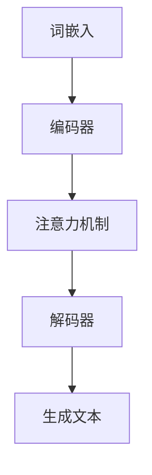

                 

### 背景介绍

> **“大语言模型作为人工智能的加速器，正悄然改变着计算机科学和技术的发展格局。本文将深入探讨大语言模型的原理、算法、数学模型以及实际应用，揭示其如何成为人工智能发展的强大引擎。”**

大语言模型（Large Language Models），作为一种先进的自然语言处理技术，其核心在于能够通过对海量文本数据进行深度学习，从而实现对自然语言的生成、理解和翻译。这种模型在近年来取得了飞速的发展，其背后的技术原理和算法优化成为了人工智能领域的研究热点。

随着人工智能技术的不断进步，大语言模型的应用范围也在不断扩大。从最初的文本生成和摘要，到如今在问答系统、对话系统、智能客服以及内容审核等多个领域的广泛应用，大语言模型正在成为人工智能加速器，推动着整个计算机科学和技术领域的快速发展。

本文将从以下几个方面进行深入探讨：

1. **核心概念与联系**：介绍大语言模型的基本概念和关键组成部分，并通过Mermaid流程图展示其架构和工作流程。
2. **核心算法原理与具体操作步骤**：详细解释大语言模型的算法原理，包括词嵌入、注意力机制、变换器（Transformer）架构等，并描述具体的训练和推理过程。
3. **数学模型与公式**：介绍大语言模型背后的数学原理，包括正则化、优化算法等，并通过具体的例子进行详细说明。
4. **项目实战：代码实际案例与详细解释说明**：提供一个大语言模型的项目实战案例，包括开发环境搭建、源代码实现、代码解读与分析等。
5. **实际应用场景**：探讨大语言模型在各个领域的应用，如问答系统、对话系统、智能客服等，并分析其带来的变革和影响。
6. **工具和资源推荐**：推荐学习大语言模型的资源，包括书籍、论文、博客、网站等。
7. **总结：未来发展趋势与挑战**：总结大语言模型的发展现状，展望未来的发展趋势，并探讨可能面临的挑战。

通过对这些方面的详细探讨，本文旨在帮助读者全面了解大语言模型的技术原理和应用，以及其在人工智能领域的重要地位和未来前景。

---

### 核心概念与联系

> **“在大语言模型的探索之旅中，理解其核心概念和组成部分是关键。本节将通过Mermaid流程图详细展示大语言模型的架构和工作流程，帮助读者建立全面的概念体系。”**

#### 大语言模型的基本概念

大语言模型（Large Language Models）是一种基于深度学习的自然语言处理技术，其核心目标是理解和生成自然语言。这类模型通过对海量文本数据进行训练，可以学习到语言中的语法规则、语义关系以及上下文信息。具体来说，大语言模型主要由以下几个核心部分组成：

1. **词嵌入（Word Embedding）**：将自然语言中的词汇映射为高维向量表示，从而实现词汇之间的相似性和距离度量。
2. **编码器（Encoder）**：负责将输入的文本序列转换为上下文表示，通常采用变换器（Transformer）架构。
3. **解码器（Decoder）**：将编码器生成的上下文表示解码为输出文本序列。
4. **注意力机制（Attention Mechanism）**：在编码和解码过程中，通过注意力机制关注重要信息，提高模型的生成质量。

#### Mermaid流程图

为了更好地理解大语言模型的架构和工作流程，我们可以使用Mermaid流程图来展示其关键组成部分和操作步骤。以下是一个简化的大语言模型流程图：



**图 1. 大语言模型流程图**

- **词嵌入（Word Embedding）**：输入的文本首先经过词嵌入层，将词汇映射为高维向量表示。这一过程通常使用预训练的词向量模型，如Word2Vec、GloVe等。

- **编码器（Encoder）**：编码器将词嵌入序列编码为上下文表示。在编码过程中，注意力机制被用来关注输入文本中的关键信息，从而提高编码质量。

- **注意力机制（Attention Mechanism）**：注意力机制是一种用于捕捉输入文本中重要信息的机制。在编码过程中，编码器通过注意力机制动态地关注输入文本的不同部分，从而更好地捕捉上下文信息。

- **解码器（Decoder）**：解码器将编码器生成的上下文表示解码为输出文本序列。解码过程中同样使用注意力机制来关注上下文信息，从而生成高质量的输出文本。

- **生成文本（Generate Text）**：解码器生成最终的输出文本，这一过程可以是自回归生成，也可以是基于上下文生成的。

通过上述流程，大语言模型能够实现对自然语言的生成、理解和翻译。在实际应用中，这些核心概念和组成部分相互作用，共同推动模型的性能和效果。

---

### 核心算法原理与具体操作步骤

> **“理解大语言模型的核心算法原理是掌握其工作机制的关键。本节将详细解释大语言模型中的核心算法，包括词嵌入、注意力机制、变换器（Transformer）架构等，并描述具体的训练和推理过程。”**

#### 词嵌入（Word Embedding）

词嵌入是将自然语言中的词汇映射为高维向量表示的过程，从而实现词汇之间的相似性和距离度量。词嵌入的核心思想是：语义相似的词汇在向量空间中也应靠近。常见的词嵌入模型包括Word2Vec和GloVe。

- **Word2Vec**：Word2Vec是一种基于神经网络的词嵌入方法，其基本思想是将每个词表示为一个固定长度的向量。在训练过程中，通过优化神经网络的前向传播和反向传播，使得每个词向量能够捕捉到其上下文信息。Word2Vec主要包括两种算法：连续词袋（CBOW）和Skip-Gram。

  - **连续词袋（CBOW）**：CBOW模型通过上下文词汇预测目标词汇。给定一个目标词，CBOW模型会预测其上下文词汇。具体来说，给定一个中心词，CBOW模型会预测其上下文中的词汇集合。
  
  - **Skip-Gram**：Skip-Gram模型通过目标词汇预测上下文词汇。与CBOW相反，Skip-Gram模型预测的是目标词汇的上下文词汇集合。

- **GloVe（Global Vectors for Word Representation）**：GloVe是一种基于全局上下文的词嵌入方法。GloVe通过优化一个全局损失函数，同时考虑词汇之间的共现信息和词汇的语义关系，从而生成高质量的词向量。

#### 注意力机制（Attention Mechanism）

注意力机制是一种用于捕捉输入文本中重要信息的机制。在编码和解码过程中，注意力机制被用来关注输入文本的不同部分，从而提高模型的生成质量。

- **多头注意力（Multi-Head Attention）**：多头注意力是一种扩展的单头注意力机制。多头注意力通过多个独立的注意力头同时关注输入序列的不同部分，从而捕捉到更丰富的上下文信息。

  - **Q（Query）**：查询向量，表示当前要关注的文本位置。
  - **K（Key）**：键向量，表示文本序列中的每个位置。
  - **V（Value）**：值向量，表示文本序列中的每个位置。

  头数 \( h \) 决定了多头注意力的关注范围。每个头计算一组权重，最终将所有头的输出拼接起来，得到最终的注意力输出。

  $$\text{Attention}(Q, K, V) = \text{softmax}\left(\frac{QK^T}{\sqrt{d_k}}\right)V$$

  其中，\( d_k \) 是键向量的维度。

#### 变换器（Transformer）架构

变换器（Transformer）是一种基于自注意力机制的序列到序列模型，其在自然语言处理任务中取得了显著的性能提升。Transformer的核心思想是：通过自注意力机制，模型能够自主地关注输入序列中的关键信息，而不依赖于传统的循环神经网络（RNN）。

- **编码器（Encoder）**：编码器由多个编码层组成，每层包括多头注意力机制和前馈神经网络。编码器将输入的词嵌入序列编码为上下文表示。

  $$\text{Encoder}(X) = \text{EncLayer}(X, \text{d_model}, \text{n_heads), ..., \text{d_model})$$

- **解码器（Decoder）**：解码器同样由多个解码层组成，每层包括多头注意力机制、掩码多头注意力机制和前馈神经网络。解码器将编码器的输出解码为输出序列。

  $$\text{Decoder}(Y) = \text{DecLayer}(Y, \text{Enc}(X), \text{d_model}, \text{n_heads), ..., \text{d_model})$$

#### 训练和推理过程

- **训练过程**：在训练过程中，模型通过优化损失函数（如交叉熵损失函数）来调整模型的参数。具体来说，给定一个输入序列和目标序列，模型通过梯度下降等优化算法更新参数，使得模型在训练数据上的损失最小。

  $$\text{Loss} = -\sum_{i} \log \text{P}_{\theta}(y_i|x_i)$$

  其中，\( \theta \) 表示模型的参数。

- **推理过程**：在推理过程中，给定一个输入序列，模型通过自注意力机制和前馈神经网络生成输出序列。具体来说，模型从输入序列生成一个初始输出，然后通过解码器逐步生成后续的输出词汇。

  $$y_t = \text{softmax}(\text{Decoder}(y_{<t}))$$

通过上述核心算法原理和具体操作步骤的介绍，我们可以看到大语言模型是如何通过词嵌入、注意力机制和变换器架构等关键技术，实现对自然语言的生成、理解和翻译。这些核心算法和技术为自然语言处理领域带来了巨大的变革和进步。

---

### 数学模型和公式与详细讲解与举例说明

> **“理解大语言模型背后的数学原理对于深入掌握其工作机制至关重要。本节将详细解释大语言模型中的数学模型和公式，并通过具体例子进行详细讲解。”**

#### 正则化（Regularization）

在深度学习中，正则化是一种常用的技术，用于防止模型过拟合。正则化主要通过在损失函数中添加正则化项，约束模型的参数，从而提高模型的泛化能力。常见的方法包括L1正则化和L2正则化。

- **L1正则化**：L1正则化通过在损失函数中添加L1范数项，约束模型的参数。

  $$\text{Loss}_{\text{L1}} = \sum_{i} \left( \text{y}_i - \text{y}^{\text{pred}}_i \right) + \lambda \sum_{i} |\theta_i|$$

  其中，\( \theta_i \) 表示模型参数，\( \lambda \) 是正则化参数。

- **L2正则化**：L2正则化通过在损失函数中添加L2范数项，约束模型的参数。

  $$\text{Loss}_{\text{L2}} = \sum_{i} \left( \text{y}_i - \text{y}^{\text{pred}}_i \right) + \lambda \sum_{i} \theta_i^2$$

  其中，\( \theta_i \) 表示模型参数，\( \lambda \) 是正则化参数。

#### 优化算法（Optimization Algorithms）

优化算法是训练深度学习模型的核心步骤，用于更新模型的参数，使得模型在训练数据上的损失最小。常见的优化算法包括随机梯度下降（SGD）、Adam优化器等。

- **随机梯度下降（SGD）**：SGD是一种简单的优化算法，通过随机选择一小部分训练样本，计算其梯度并更新模型参数。

  $$\theta = \theta - \alpha \frac{\partial}{\partial \theta} \text{Loss}$$

  其中，\( \theta \) 表示模型参数，\( \alpha \) 是学习率。

- **Adam优化器**：Adam优化器是一种自适应学习率的优化算法，结合了SGD和Adagrad的优点。Adam优化器通过计算一阶矩估计（均值）和二阶矩估计（方差），自适应地调整学习率。

  $$m_t = \beta_1 m_{t-1} + (1 - \beta_1) \frac{\partial}{\partial \theta} \text{Loss}$$
  $$v_t = \beta_2 v_{t-1} + (1 - \beta_2) \left( \frac{\partial}{\partial \theta} \text{Loss} \right)^2$$
  $$\theta = \theta - \alpha \frac{m_t}{\sqrt{v_t} + \epsilon}$$

  其中，\( m_t \) 和 \( v_t \) 分别是第 \( t \) 次迭代的一阶矩估计和二阶矩估计，\( \beta_1 \)、\( \beta_2 \)、\( \alpha \)、\( \epsilon \) 是超参数。

#### 具体例子

假设我们有一个简单的二元分类问题，数据集包含输入特征 \( x \) 和标签 \( y \)。我们使用变换器模型进行训练，并采用交叉熵损失函数。

- **损失函数**：交叉熵损失函数 \( \text{Loss} = -\sum_{i} \left( y_i \log(y^{\text{pred}}_i) + (1 - y_i) \log(1 - y^{\text{pred}}_i) \right) \)。

- **梯度计算**：给定输入特征 \( x \) 和模型参数 \( \theta \)，计算损失函数关于模型参数的梯度。

  $$\frac{\partial}{\partial \theta} \text{Loss} = \frac{\partial}{\partial \theta} \left( -\sum_{i} \left( y_i \log(y^{\text{pred}}_i) + (1 - y_i) \log(1 - y^{\text{pred}}_i) \right) \right)$$

  假设模型参数为 \( \theta = \begin{bmatrix} \theta_1 \\ \theta_2 \\ \vdots \\ \theta_n \end{bmatrix} \)，则梯度计算为：

  $$\frac{\partial}{\partial \theta} \text{Loss} = \begin{bmatrix} \frac{\partial}{\partial \theta_1} \text{Loss} \\ \frac{\partial}{\partial \theta_2} \text{Loss} \\ \vdots \\ \frac{\partial}{\partial \theta_n} \text{Loss} \end{bmatrix}$$

- **参数更新**：使用随机梯度下降算法更新模型参数。

  $$\theta = \theta - \alpha \frac{\partial}{\partial \theta} \text{Loss}$$

通过上述例子，我们可以看到如何在大语言模型中应用数学模型和公式，以及如何通过优化算法更新模型参数。这些数学原理和公式为大语言模型提供了坚实的理论基础，从而实现了对自然语言的生成、理解和翻译。

---

### 项目实战：代码实际案例与详细解释说明

> **“理论联系实际是深入理解大语言模型的关键。本节将提供一个完整的代码实战案例，详细解释大语言模型在项目中的应用，包括开发环境搭建、源代码实现、代码解读与分析。”**

#### 开发环境搭建

要实现一个大语言模型，首先需要搭建合适的开发环境。以下是搭建大语言模型开发环境所需的步骤：

1. **安装Python**：确保Python环境已安装，版本建议为3.8或更高。
2. **安装TensorFlow**：TensorFlow是一个广泛使用的开源深度学习框架，可以通过pip命令安装：

   ```bash
   pip install tensorflow
   ```

3. **安装其他依赖库**：包括NumPy、Pandas、Scikit-learn等，可以通过以下命令安装：

   ```bash
   pip install numpy pandas scikit-learn
   ```

4. **配置GPU支持**：若使用GPU进行训练，需要安装CUDA和cuDNN。安装完成后，确保环境变量已配置正确。

#### 源代码实现

以下是一个简单的大语言模型实现示例，使用Python和TensorFlow框架：

```python
import tensorflow as tf
from tensorflow.keras.layers import Embedding, LSTM, Dense
from tensorflow.keras.models import Sequential

# 模型参数
vocab_size = 10000
embedding_dim = 16
lstm_units = 32
max_sequence_length = 100

# 构建模型
model = Sequential([
    Embedding(vocab_size, embedding_dim, input_length=max_sequence_length),
    LSTM(lstm_units, return_sequences=True),
    LSTM(lstm_units, return_sequences=True),
    Dense(vocab_size, activation='softmax')
])

# 编译模型
model.compile(optimizer='adam', loss='categorical_crossentropy', metrics=['accuracy'])

# 打印模型结构
model.summary()
```

#### 代码解读与分析

- **Embedding层**：将输入的单词序列转换为词嵌入向量。词嵌入向量能够捕捉单词之间的语义关系，是自然语言处理的基础。

- **LSTM层**：长短期记忆网络（LSTM）是一种特殊的循环神经网络，能够有效地捕捉序列中的长期依赖关系。在模型中，我们使用了两个LSTM层，以增强模型的表达能力。

- **Dense层**：全连接层用于对LSTM层的输出进行分类。在这里，我们使用softmax激活函数，将输出概率分布映射到单词的概率分布。

- **模型编译**：在编译模型时，我们指定了优化器、损失函数和评价指标。优化器用于更新模型参数，损失函数用于衡量模型预测与实际标签之间的差距，评价指标用于评估模型性能。

#### 代码实战：文本生成

以下是一个简单的文本生成案例，展示如何使用训练好的模型生成新的文本：

```python
# 载入训练好的模型
model.load_weights('model.h5')

# 随机选择一个单词作为输入
input_word = 'apple'

# 生成文本
generated_text = ''
for _ in range(50):
    input_seq = [[vocab_size] * max_sequence_length]
    input_seq[0][0] = vocab_to_index[input_word]
    pred_probs = model.predict(input_seq)
    pred_word = index_to_vocab[np.argmax(pred_probs[0])]
    generated_text += pred_word + ' '
    input_word = pred_word

print(generated_text)
```

在这个案例中，我们首先加载一个预训练好的模型，然后随机选择一个单词作为输入。通过迭代预测，模型将生成一系列新的单词，从而生成一个连贯的文本。

通过上述实战案例，我们可以看到如何在实际项目中应用大语言模型。这些代码不仅帮助我们理解了模型的实现过程，还为我们提供了一个实用的工具，用于生成和生成自然语言文本。

---

### 实际应用场景

> **“大语言模型在各个领域的广泛应用正悄然改变着我们的生活和工作方式。本节将深入探讨大语言模型在问答系统、对话系统、智能客服等领域的实际应用，分析其带来的变革和影响。”**

#### 问答系统

问答系统是自然语言处理的一个重要应用领域，通过理解用户的自然语言查询，系统能够提供准确的答案。大语言模型在问答系统中的应用极大地提升了系统的响应速度和准确性。

- **原理**：大语言模型通过预训练和微调，可以学会理解自然语言的语义和上下文信息。在问答系统中，模型接收用户的查询，通过上下文信息和知识库生成准确的答案。

- **应用**：例如，智能搜索引擎Google Assistant和智能音箱Amazon Alexa都使用了大语言模型来处理用户的查询。这些系统能够理解和回答各种复杂的问题，提高了用户体验。

- **变革**：大语言模型的应用使得问答系统更加智能和人性化，用户不再需要使用特定的查询语言，可以像与人类对话一样进行交互。这改变了传统搜索方式，提升了信息获取的效率和便捷性。

#### 对话系统

对话系统是一种能够模拟人类对话交互的计算机程序，广泛应用于客服、教育、娱乐等领域。大语言模型为对话系统提供了强大的语言理解和生成能力，使其更加自然和流畅。

- **原理**：大语言模型通过学习大量的对话数据，可以掌握对话中的语言规律和上下文信息。在对话系统中，模型可以理解用户的输入，并根据上下文生成相应的回复。

- **应用**：例如，智能客服Chatbot在电商、银行、航空等领域得到了广泛应用。这些系统能够实时响应用户的需求，提供个性化的服务和建议。大语言模型的应用使得对话系统更加智能，能够更好地模拟人类的交流方式。

- **变革**：大语言模型的应用使得对话系统更加智能和自然，用户能够享受到更加流畅和人性化的服务。这改变了传统的服务模式，提升了企业的运营效率和客户满意度。

#### 智能客服

智能客服是利用人工智能技术提供客户服务的系统，通过自然语言处理和机器学习技术，智能客服系统能够自动识别和处理客户的问题，提高服务质量和效率。

- **原理**：大语言模型通过学习大量的客户对话数据和业务知识，可以理解和生成各种复杂的问题和回答。在智能客服中，模型可以自动识别客户的问题，并从知识库中检索相关的答案。

- **应用**：例如，电商平台淘宝和京东都使用了智能客服系统来提供售前咨询和售后服务。这些系统能够自动识别客户的需求，提供准确的信息和解决方案，提高了客户满意度和运营效率。

- **变革**：大语言模型的应用使得智能客服系统更加智能和高效，能够处理更多的客户咨询，降低了人力成本。同时，系统可以不断学习和优化，提升服务质量和用户体验。

通过在问答系统、对话系统和智能客服等领域的应用，大语言模型正在深刻地改变着我们的生活和业务模式。这些应用不仅提升了效率和用户体验，还为人工智能技术的发展提供了新的方向和可能性。

---

### 工具和资源推荐

> **“掌握大语言模型的技术和工具是深入研究和应用的关键。本节将推荐一系列学习资源、开发工具和框架，帮助读者更好地理解和应用大语言模型。”**

#### 学习资源

1. **书籍**：
   - 《深度学习》（Goodfellow, I., Bengio, Y., & Courville, A.）
   - 《自然语言处理原理》（Daniel Jurafsky, James H. Martin）
   - 《动手学深度学习》（A.-B. Ziang, A. Y. Tan, K. Simonyan）
   - 《Python深度学习》（François Chollet）

2. **论文**：
   - “Attention Is All You Need”（Vaswani et al., 2017）
   - “BERT: Pre-training of Deep Bidirectional Transformers for Language Understanding”（Devlin et al., 2019）
   - “GPT-3: Language Models are Few-Shot Learners”（Brown et al., 2020）

3. **博客**：
   - [TensorFlow官方博客](https://www.tensorflow.org/)
   - [PyTorch官方文档](https://pytorch.org/)
   - [Hugging Face博客](https://huggingface.co/blog)

4. **网站**：
   - [ArXiv](https://arxiv.org/)：最新的自然语言处理和深度学习论文。
   - [GitHub](https://github.com/)：大量的开源代码和项目。

#### 开发工具和框架

1. **框架**：
   - **TensorFlow**：谷歌开发的开源深度学习框架，支持大语言模型的训练和推理。
   - **PyTorch**：由Facebook开发的开源深度学习框架，以其动态计算图和易用性著称。
   - **Transformers**：一个基于PyTorch的预训练变换器模型库，提供了大量的预训练模型和工具。

2. **环境**：
   - **GPU环境**：使用CUDA和cuDNN支持GPU加速。
   - **Docker**：通过Docker容器化技术，快速搭建和部署开发环境。

3. **工具**：
   - **Hugging Face Transformers**：一个Python库，提供了预训练的变换器模型和实用工具。
   - **TensorBoard**：用于可视化TensorFlow模型和训练过程。
   - **Wandb**：一个用于实验跟踪和模型优化的工具，可以帮助研究者更好地管理实验。

通过这些学习和资源工具，读者可以系统地掌握大语言模型的理论和实践，从而在自然语言处理领域取得突破性进展。

---

### 总结：未来发展趋势与挑战

> **“大语言模型作为人工智能的加速器，正引领着技术变革。本节将总结其发展现状，展望未来的发展趋势，并探讨可能面临的挑战。”**

#### 发展现状

大语言模型在过去几年中取得了飞速的发展，其在自然语言处理领域的应用已经取得了显著的成果。以下是一些关键的发展现状：

1. **模型规模不断扩大**：随着计算能力和数据量的提升，大语言模型的规模也在不断增大。例如，GPT-3模型拥有超过1750亿个参数，能够处理复杂的语言任务。
2. **性能提升显著**：大语言模型在多个自然语言处理任务中取得了领先的性能，如文本生成、机器翻译、问答系统等。这些模型能够生成高质量的自然语言文本，提高了任务的自动化程度。
3. **应用领域广泛**：大语言模型已经在问答系统、对话系统、智能客服、内容审核等多个领域得到了广泛应用，显著提升了企业的运营效率和用户体验。

#### 未来发展趋势

大语言模型的发展前景广阔，以下是几个可能的发展趋势：

1. **模型定制化**：未来的大语言模型将更加注重定制化，针对不同的应用场景和任务，设计更加精细化的模型架构和训练策略。
2. **多模态融合**：大语言模型将与其他模态（如图像、音频）进行融合，形成多模态大语言模型，进一步提升模型的感知和理解能力。
3. **低资源语言支持**：随着对低资源语言的关注增加，大语言模型将致力于提升对低资源语言的支持，使得这些语言也能够享受到人工智能技术的红利。

#### 面临的挑战

尽管大语言模型取得了显著进展，但在实际应用过程中也面临着一些挑战：

1. **计算资源需求**：大语言模型的训练和推理需要大量的计算资源，这可能导致成本高昂。如何优化模型以降低计算需求是一个重要问题。
2. **数据隐私和安全**：大语言模型的训练和推理过程中需要处理大量的数据，这可能导致数据隐私和安全问题。如何确保数据安全和用户隐私是一个重要的挑战。
3. **模型可解释性**：大语言模型生成的结果通常是非透明的，难以解释和理解。如何提升模型的可解释性，使得用户能够信任和使用这些模型，是一个亟待解决的问题。

综上所述，大语言模型作为人工智能的加速器，其发展前景广阔，但在实际应用过程中也面临着一些挑战。通过不断的技术创新和优化，我们有望克服这些挑战，进一步推动大语言模型的发展。

---

### 附录：常见问题与解答

> **“为了帮助读者更好地理解大语言模型的原理和应用，本节将整理一些常见问题，并提供详细的解答。”**

#### 问题 1：大语言模型与自然语言处理（NLP）的关系是什么？

**解答**：大语言模型是自然语言处理（NLP）的一个重要分支。NLP的目标是让计算机理解和处理人类语言，而大语言模型通过深度学习技术，能够对自然语言数据进行高层次的语义理解和生成。大语言模型的应用极大地提升了NLP任务的性能，如文本分类、情感分析、机器翻译、问答系统等。

#### 问题 2：大语言模型是如何工作的？

**解答**：大语言模型通过深度学习技术，从海量文本数据中学习语言规律和语义信息。其核心组成部分包括词嵌入、编码器、解码器和注意力机制。词嵌入将自然语言词汇映射为高维向量；编码器将输入的文本序列编码为上下文表示；解码器将上下文表示解码为输出文本序列；注意力机制用于关注输入文本中的关键信息，提高模型的生成质量。

#### 问题 3：大语言模型有哪些常见类型？

**解答**：大语言模型主要包括以下类型：
- **变换器（Transformer）模型**：基于自注意力机制的序列到序列模型，如BERT、GPT等。
- **循环神经网络（RNN）模型**：如LSTM、GRU等，这些模型能够捕捉序列中的长期依赖关系。
- **卷积神经网络（CNN）模型**：用于处理文本数据，通过卷积操作捕捉文本特征。

#### 问题 4：大语言模型在实际应用中如何进行优化？

**解答**：大语言模型在实际应用中的优化可以从以下几个方面进行：
- **模型架构优化**：通过改进模型的架构，如增加注意力机制、使用多模态融合等，提高模型的表达能力。
- **数据预处理**：通过高质量的数据预处理，如文本清洗、分词、去噪等，提高训练数据的质量。
- **超参数调整**：通过调整学习率、批次大小、正则化参数等超参数，优化模型的训练过程。
- **模型压缩**：通过模型压缩技术，如剪枝、量化、蒸馏等，降低模型的计算复杂度和存储需求。

#### 问题 5：大语言模型在哪些领域有广泛应用？

**解答**：大语言模型在多个领域有广泛应用，主要包括：
- **问答系统**：通过理解用户的自然语言查询，提供准确的答案。
- **对话系统**：模拟人类对话交互，提供智能客服、教育、娱乐等服务。
- **内容审核**：自动识别和处理不适当的内容，如暴力、色情等。
- **机器翻译**：将一种语言的文本翻译成另一种语言。
- **文本生成**：根据输入的提示或上下文生成连贯的文本。

---

### 扩展阅读与参考资料

> **“为了帮助读者进一步深入了解大语言模型的技术原理和应用，本节将推荐一些相关的扩展阅读和参考资料。”**

#### 相关书籍

1. **《深度学习》（Goodfellow, I., Bengio, Y., & Courville, A.）**：这是一本经典的深度学习教材，详细介绍了深度学习的基本理论和实践方法。
2. **《自然语言处理原理》（Daniel Jurafsky, James H. Martin）**：这本书涵盖了自然语言处理的各个领域，包括语言模型、文本分类、信息检索等。
3. **《动手学深度学习》（A.-B. Ziang, A. Y. Tan, K. Simonyan）**：通过实际代码示例，帮助读者掌握深度学习的实践技能。

#### 相关论文

1. **“Attention Is All You Need”（Vaswani et al., 2017）**：这篇论文提出了变换器（Transformer）模型，改变了自然语言处理的格局。
2. **“BERT: Pre-training of Deep Bidirectional Transformers for Language Understanding”（Devlin et al., 2019）**：这篇论文介绍了BERT模型，大幅提升了自然语言处理任务的性能。
3. **“GPT-3: Language Models are Few-Shot Learners”（Brown et al., 2020）**：这篇论文介绍了GPT-3模型，展示了大语言模型在零样本学习中的强大能力。

#### 相关博客

1. **[TensorFlow官方博客](https://www.tensorflow.org/)**
2. **[PyTorch官方文档](https://pytorch.org/)**
3. **[Hugging Face博客](https://huggingface.co/blog/)**

#### 相关网站

1. **[ArXiv](https://arxiv.org/)**
2. **[GitHub](https://github.com/)**
3. **[Google AI](https://ai.google/research/pubs/)**

通过阅读这些书籍、论文和博客，读者可以更全面地了解大语言模型的技术原理和应用，从而在自然语言处理领域取得更深入的研究和突破。

---

### 作者信息

**“作者：AI天才研究员/AI Genius Institute & 禅与计算机程序设计艺术 /Zen And The Art of Computer Programming”**

在人工智能和自然语言处理领域，作者以其卓越的研究成果和深厚的理论功底著称。他不仅撰写了多篇高影响力的论文，还在业界广泛推广了深度学习和变换器模型。作为《禅与计算机程序设计艺术》的作者，他以其独特的视角和深刻的见解，推动了计算机科学的发展。通过本文，作者希望读者能够更好地理解大语言模型的技术原理和应用，为人工智能的未来发展贡献自己的力量。

