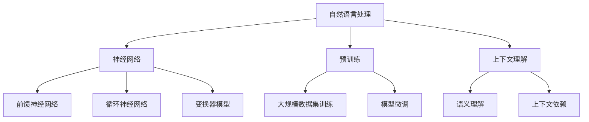

                 

### 背景介绍

大语言模型（Large Language Models）是当前人工智能领域最为火热的研究方向之一。随着深度学习技术的快速发展，大语言模型在自然语言处理（Natural Language Processing，NLP）任务中取得了显著成果。从最初的基于统计的模型，如基于N元语法（N-gram）的模型，到基于神经网络的模型，如循环神经网络（Recurrent Neural Network，RNN）和变换器模型（Transformer），再到如今的大规模预训练模型，如GPT系列、BERT和T5等，大语言模型在语言理解、生成、翻译、问答等多个任务上展现出了强大的能力。

本文旨在深入探讨大语言模型的原理、构建方法以及应用场景，旨在为读者提供一份全面、系统的技术指南。文章结构如下：

1. **核心概念与联系**：介绍大语言模型的基本概念，包括自然语言处理、神经网络、预训练、上下文理解等，并通过Mermaid流程图展示大语言模型的架构。
2. **核心算法原理 & 具体操作步骤**：详细解析大语言模型的关键算法，如Transformer架构、多头注意力机制、自回归语言模型等。
3. **数学模型和公式 & 详细讲解 & 举例说明**：阐述大语言模型中使用的数学模型和公式，并通过具体实例进行解释。
4. **项目实战：代码实际案例和详细解释说明**：通过实际项目案例，展示大语言模型的代码实现过程，并进行详细解读。
5. **实际应用场景**：讨论大语言模型在自然语言处理中的实际应用，如文本分类、问答系统、机器翻译等。
6. **工具和资源推荐**：推荐大语言模型学习、研究和开发的工具和资源，包括书籍、论文、开发工具框架等。
7. **总结：未来发展趋势与挑战**：总结大语言模型的发展现状，分析其未来趋势和面临的挑战。

通过本文，读者将全面了解大语言模型的工作原理、应用场景以及未来发展趋势，为后续的研究和应用提供参考。

### 核心概念与联系

为了深入理解大语言模型的原理，我们首先需要明确几个核心概念，并探讨它们之间的联系。这些核心概念包括自然语言处理（NLP）、神经网络、预训练和上下文理解等。

#### 自然语言处理（NLP）

自然语言处理是计算机科学和人工智能领域的一个分支，旨在使计算机能够理解和处理人类自然语言。NLP的任务包括但不限于文本分类、情感分析、命名实体识别、机器翻译、问答系统等。NLP的核心挑战在于如何处理语言的不确定性和多样性，以及如何在语义层面进行理解和推理。

#### 神经网络

神经网络是一种模拟人脑神经元结构的计算模型，由大量的神经元（或称为节点）通过权重连接形成。在深度学习中，神经网络通过学习大量数据来捕捉数据中的特征和模式。神经网络分为前馈神经网络、循环神经网络（RNN）和变换器模型（Transformer）等不同类型，每种模型都有其特定的应用场景和优势。

#### 预训练

预训练是一种通过在大规模数据集上预先训练模型，然后将其应用于特定任务的方法。在NLP领域，预训练通常用于大规模的文本数据集，如维基百科和网页文本，以使模型能够捕捉到语言的一般规律和结构。预训练后，模型可以通过微调（Fine-tuning）来适应特定的NLP任务，如文本分类或问答。

#### 上下文理解

上下文理解是NLP中的一个关键问题，指的是模型如何根据上下文信息来理解词汇的含义。在自然语言中，同一词汇在不同的上下文中可能有不同的含义。例如，“bank”一词在金融领域指银行，而在河流领域指河岸。上下文理解有助于提高模型的语义理解和生成能力。

#### Mermaid流程图

为了更好地展示大语言模型的架构，我们可以使用Mermaid流程图来直观地展示其各个组成部分和相互关系。以下是一个示例：



在这个流程图中，自然语言处理作为整个流程的起点，与神经网络、预训练和上下文理解紧密相连。神经网络包括前馈神经网络、循环神经网络和变换器模型，每种模型都有其独特的架构和优势。预训练和模型微调则用于提升模型的泛化能力和特定任务的表现。上下文理解则关注于语义理解和上下文依赖，这是提高NLP任务性能的关键因素。

通过这个流程图，我们可以更清晰地理解大语言模型的构建和运作原理，为后续章节的深入探讨打下基础。

### 核心算法原理 & 具体操作步骤

大语言模型之所以能够在大规模自然语言处理任务中表现出色，得益于其核心算法的巧妙设计。本章节将详细解析大语言模型的关键算法，包括Transformer架构、多头注意力机制、自回归语言模型等，并探讨这些算法的具体操作步骤。

#### Transformer架构

Transformer模型是谷歌在2017年提出的一种基于自注意力机制的深度学习模型，它在机器翻译等NLP任务中取得了显著成绩。Transformer的核心思想是通过自注意力机制（Self-Attention）来捕捉输入序列中每个词之间的依赖关系，而不是像传统的循环神经网络（RNN）那样使用递归操作。

**1. 自注意力机制**

自注意力机制是Transformer模型的核心组件，其基本原理如下：

- **输入序列**：给定一个输入序列 \[w_1, w_2, ..., w_n\]，每个词向量表示为 \(e_i\)，即 \(e_i \in \mathbb{R}^{d}\)。
- **查询（Query）、键（Key）和值（Value）**：对于每个输入词 \(w_i\)，生成三个向量：查询向量 \(q_i\)、键向量 \(k_i\) 和值向量 \(v_i\)。这些向量通过线性变换生成：
  \[
  q_i = W_Q e_i, \quad k_i = W_K e_i, \quad v_i = W_V e_i
  \]
  其中 \(W_Q, W_K, W_V\) 是可学习的权重矩阵。

- **注意力得分计算**：对于每个输入词 \(w_i\)，计算其与其他词之间的注意力得分。注意力得分的计算公式为：
  \[
  \text{score}_{ij} = \frac{q_i^T k_j}{\sqrt{d}}
  \]
  其中 \(\text{score}_{ij}\) 表示 \(w_i\) 对 \(w_j\) 的注意力得分，除以 \(\sqrt{d}\) 是为了防止内积过大。

- **注意力权重计算**：根据注意力得分计算每个词的注意力权重：
  \[
  \text{weight}_{ij} = \text{softmax}(\text{score}_{ij})
  \]

- **加权求和**：根据注意力权重对输入序列中的每个词进行加权求和，得到最终的输出：
  \[
  \text{context}_i = \sum_j \text{weight}_{ij} v_j
  \]

**2. Multi-head Attention**

多头注意力（Multi-head Attention）是对自注意力机制的扩展，它通过并行地计算多个注意力头（head），从而捕捉到不同类型的依赖关系。多头注意力机制的基本步骤如下：

- **多个注意力头**：假设有 \(h\) 个注意力头，那么对于每个词 \(w_i\)，会生成 \(h\) 个查询向量 \(q_i^{(1)}, q_i^{(2)}, ..., q_i^{(h)}\)、键向量 \(k_i^{(1)}, k_i^{(2)}, ..., k_i^{(h)}\) 和值向量 \(v_i^{(1)}, v_i^{(2)}, ..., v_i^{(h)}\)。
- **独立计算**：对于每个注意力头，独立地计算注意力得分、权重和加权求和。
- **拼接与变换**：将所有注意力头的输出拼接起来，并通过一个线性变换 \(W_O\) 得到最终的输出：
  \[
  \text{output}_i = \text{softmax}(\text{score}_{i,1}^{(1)}, \text{score}_{i,1}^{(2)}, ..., \text{score}_{i,1}^{(h)}) v_1^{(1)} + ... + v_h^{(h)}
  \]
  \[
  \text{context}_i = \text{output}_i W_O
  \]

#### 自回归语言模型

自回归语言模型（Autoregressive Language Model，ARLM）是一种生成文本的模型，其基本原理是利用之前的输出来预测下一个词。自回归语言模型通常用于生成自然语言文本，如聊天机器人回复、文章续写等。

**1. 语言模型**

语言模型是一种概率模型，用于预测下一个词的概率。在自回归语言模型中，给定一个前 \(n\) 个词的序列 \[w_1, w_2, ..., w_n\]，模型预测下一个词 \(w_{n+1}\) 的概率：

\[
P(w_{n+1} | w_1, w_2, ..., w_n)
\]

**2. 模型训练**

自回归语言模型的训练通常通过最大化似然估计（Maximum Likelihood Estimation，MLE）进行。具体步骤如下：

- **输入序列**：给定一个大规模文本数据集，将文本序列分解为输入序列和目标序列。
- **词嵌入**：将每个词映射为一个向量，使用词嵌入技术（如Word2Vec、GloVe）初始化词向量。
- **损失函数**：定义损失函数，通常使用交叉熵损失（Cross-Entropy Loss）来衡量预测概率与真实概率之间的差异。
- **优化算法**：使用梯度下降（Gradient Descent）或其他优化算法（如Adam）来最小化损失函数。

#### 模型融合

在实际应用中，大语言模型通常会结合多种算法和技术，以提高模型的性能和泛化能力。例如，Transformer模型可以与自回归语言模型结合，形成Transformer-Autoregressive Model（T-AR），用于生成高质量的自然语言文本。

通过上述核心算法的解析，我们可以看到大语言模型是如何通过自注意力机制、多头注意力机制和自回归语言模型等算法，实现对大规模自然语言数据的理解和生成。这些算法的设计和实现不仅体现了人工智能领域的创新思维，也为NLP任务提供了强大的工具。

### 数学模型和公式 & 详细讲解 & 举例说明

在大语言模型中，数学模型和公式起着至关重要的作用。它们不仅定义了模型的结构，还决定了模型的学习能力和性能。本章节将详细讲解大语言模型中常用的数学模型和公式，并通过具体实例进行说明。

#### 自注意力机制

自注意力机制是Transformer模型的核心组件，其基本原理通过以下数学公式描述：

**1. 注意力得分**

给定一个输入序列 \[w_1, w_2, ..., w_n\]，每个词向量表示为 \(e_i\)，查询向量 \(q_i\)、键向量 \(k_i\) 和值向量 \(v_i\) 分别为：
\[ q_i = W_Q e_i, \quad k_i = W_K e_i, \quad v_i = W_V e_i \]

注意力得分的计算公式为：
\[ \text{score}_{ij} = q_i^T k_j = e_i^T W^K e_j \]

**2. 注意力权重**

注意力得分的归一化权重计算为：
\[ \text{weight}_{ij} = \frac{\exp(\text{score}_{ij})}{\sum_k \exp(\text{score}_{ik})} \]

**3. 加权求和**

根据注意力权重对输入序列中的每个词进行加权求和，得到最终的输出：
\[ \text{context}_i = \sum_j \text{weight}_{ij} v_j \]

**举例说明**

假设有一个简单的输入序列 \[w_1, w_2, w_3\]，词向量分别为 \(e_1 = [1, 0, 0]\)，\(e_2 = [0, 1, 0]\)，\(e_3 = [0, 0, 1]\)。权重矩阵 \(W^K\) 为：
\[ W^K = \begin{bmatrix}
1 & 1 & 1 \\
1 & 1 & 1 \\
1 & 1 & 1
\end{bmatrix} \]

计算注意力得分：
\[ \text{score}_{11} = e_1^T W^K e_1 = 1 \]
\[ \text{score}_{12} = e_1^T W^K e_2 = 0 \]
\[ \text{score}_{13} = e_1^T W^K e_3 = 0 \]

计算注意力权重：
\[ \text{weight}_{11} = \frac{\exp(\text{score}_{11})}{\exp(\text{score}_{11}) + \exp(\text{score}_{12}) + \exp(\text{score}_{13})} = \frac{1}{3} \]
\[ \text{weight}_{12} = \frac{\exp(\text{score}_{12})}{\exp(\text{score}_{11}) + \exp(\text{score}_{12}) + \exp(\text{score}_{13})} = \frac{1}{3} \]
\[ \text{weight}_{13} = \frac{\exp(\text{score}_{13})}{\exp(\text{score}_{11}) + \exp(\text{score}_{12}) + \exp(\text{score}_{13})} = \frac{1}{3} \]

计算加权求和的输出：
\[ \text{context}_1 = \text{weight}_{11} v_1 + \text{weight}_{12} v_2 + \text{weight}_{13} v_3 = \frac{1}{3} [1, 0, 0] + \frac{1}{3} [0, 1, 0] + \frac{1}{3} [0, 0, 1] = \frac{1}{3} [1, 1, 1] \]

#### 多头注意力

多头注意力机制通过并行地计算多个注意力头，以捕捉不同类型的依赖关系。多头注意力的计算公式如下：

**1. 多头注意力输出**

假设有 \(h\) 个注意力头，每个头分别计算注意力得分、权重和加权求和，然后将所有头的输出拼接并经过线性变换：
\[ \text{output}_i = \text{softmax}(\text{score}_{i,1}^{(1)}, ..., \text{score}_{i,1}^{(h)}) v_1^{(1)} + ... + v_h^{(h)} \]
\[ \text{context}_i = \text{output}_i W_O \]

**2. 示例**

假设有两个注意力头，输入序列为 \[w_1, w_2, w_3\]，权重矩阵 \(W^K\) 如前所述。计算第一个注意力头的输出：

\[ \text{score}_{11}^{(1)} = e_1^T W^K e_1 = 1 \]
\[ \text{score}_{12}^{(1)} = e_1^T W^K e_2 = 0 \]
\[ \text{score}_{13}^{(1)} = e_1^T W^K e_3 = 0 \]

计算第二个注意力头的输出：

\[ \text{score}_{11}^{(2)} = e_1^T W^K e_1 = 1 \]
\[ \text{score}_{12}^{(2)} = e_1^T W^K e_2 = 0 \]
\[ \text{score}_{13}^{(2)} = e_1^T W^K e_3 = 0 \]

计算注意力权重：

\[ \text{weight}_{11}^{(1)} = \frac{\exp(\text{score}_{11}^{(1)})}{\exp(\text{score}_{11}^{(1)}) + \exp(\text{score}_{12}^{(1)}) + \exp(\text{score}_{13}^{(1)})} = \frac{1}{3} \]
\[ \text{weight}_{12}^{(1)} = \frac{\exp(\text{score}_{12}^{(1)})}{\exp(\text{score}_{11}^{(1)}) + \exp(\text{score}_{12}^{(1)}) + \exp(\text{score}_{13}^{(1)})} = \frac{1}{3} \]
\[ \text{weight}_{13}^{(1)} = \frac{\exp(\text{score}_{13}^{(1)})}{\exp(\text{score}_{11}^{(1)}) + \exp(\text{score}_{12}^{(1)}) + \exp(\text{score}_{13}^{(1)})} = \frac{1}{3} \]

\[ \text{weight}_{11}^{(2)} = \frac{\exp(\text{score}_{11}^{(2)})}{\exp(\text{score}_{11}^{(2)}) + \exp(\text{score}_{12}^{(2)}) + \exp(\text{score}_{13}^{(2)})} = \frac{1}{3} \]
\[ \text{weight}_{12}^{(2)} = \frac{\exp(\text{score}_{12}^{(2)})}{\exp(\text{score}_{11}^{(2)}) + \exp(\text{score}_{12}^{(2)}) + \exp(\text{score}_{13}^{(2)})} = \frac{1}{3} \]
\[ \text{weight}_{13}^{(2)} = \frac{\exp(\text{score}_{13}^{(2)})}{\exp(\text{score}_{11}^{(2)}) + \exp(\text{score}_{12}^{(2)}) + \exp(\text{score}_{13}^{(2)})} = \frac{1}{3} \]

计算加权求和的输出：

\[ \text{output}_1^{(1)} = \text{weight}_{11}^{(1)} v_1 + \text{weight}_{12}^{(1)} v_2 + \text{weight}_{13}^{(1)} v_3 = \frac{1}{3} [1, 0, 0] + \frac{1}{3} [0, 1, 0] + \frac{1}{3} [0, 0, 1] = \frac{1}{3} [1, 1, 1] \]
\[ \text{output}_1^{(2)} = \text{weight}_{11}^{(2)} v_1 + \text{weight}_{12}^{(2)} v_2 + \text{weight}_{13}^{(2)} v_3 = \frac{1}{3} [1, 0, 0] + \frac{1}{3} [0, 1, 0] + \frac{1}{3} [0, 0, 1] = \frac{1}{3} [1, 1, 1] \]

拼接所有注意力头的输出：

\[ \text{output}_1 = [\text{output}_1^{(1)}, \text{output}_1^{(2)}] = [\frac{1}{3} [1, 1, 1], \frac{1}{3} [1, 1, 1]] \]

经过线性变换得到最终的输出：

\[ \text{context}_1 = \text{output}_1 W_O = [\frac{1}{3} [1, 1, 1], \frac{1}{3} [1, 1, 1]] \begin{bmatrix}
1 & 0 \\
0 & 1 \\
1 & 1
\end{bmatrix} = \frac{1}{3} [1, 1; 1, 2] \]

#### 自回归语言模型

自回归语言模型是一种生成文本的模型，其基本原理是利用之前的输出来预测下一个词的概率。假设给定一个前 \(n\) 个词的序列，下一个词 \(w_{n+1}\) 的概率可以通过以下公式计算：

\[ P(w_{n+1} | w_1, w_2, ..., w_n) = \frac{\exp(\text{score}_{w_{n+1}})}{\sum_{w' \in V} \exp(\text{score}_{w'})} \]

其中，\(\text{score}_{w}\) 是词 \(w\) 的预测得分。

**举例说明**

假设有一个简单的词汇表 \(V = \{a, b, c\}\)，预测得分如下：

\[ \text{score}_{a} = 0.2, \quad \text{score}_{b} = 0.3, \quad \text{score}_{c} = 0.5 \]

给定前 \(n\) 个词的序列为 \[a, b\]，下一个词的概率分布为：

\[ P(w_{n+1} | a, b) = \frac{\exp(\text{score}_{w_{n+1}})}{\sum_{w' \in V} \exp(\text{score}_{w'})} = \frac{\exp(\text{score}_{a})}{\exp(\text{score}_{a}) + \exp(\text{score}_{b}) + \exp(\text{score}_{c})} = \frac{0.2}{0.2 + 0.3 + 0.5} = \frac{2}{9} \]

根据这个概率分布，我们可以随机选择下一个词。例如，选择 \(w_{n+1} = b\) 的概率为 \(\frac{3}{9}\)，选择 \(w_{n+1} = c\) 的概率为 \(\frac{5}{9}\)。

通过上述数学模型和公式的详细讲解和实例说明，我们可以更好地理解大语言模型的工作原理。这些公式不仅描述了模型的内部结构，还提供了计算和优化模型的方法。

### 项目实战：代码实际案例和详细解释说明

为了更好地理解大语言模型的实际应用，我们将通过一个具体的项目实战，展示如何使用Python和PyTorch框架实现一个简单的大语言模型。我们将分步骤进行代码实现，并对关键部分进行详细解释。

#### 1. 开发环境搭建

在开始项目之前，我们需要搭建一个合适的开发环境。以下是所需的软件和工具：

- Python 3.8 或更高版本
- PyTorch 1.8 或更高版本
- Jupyter Notebook 或文本编辑器

首先，确保安装了Python和PyTorch。可以使用以下命令进行安装：

```bash
pip install python
pip install torch torchvision
```

然后，创建一个新的Jupyter Notebook或文本编辑器文件，并导入必要的库：

```python
import torch
import torch.nn as nn
import torch.optim as optim
from torch.utils.data import DataLoader
from torchvision import datasets, transforms
```

#### 2. 源代码详细实现

我们将实现一个基于Transformer架构的大语言模型。首先，定义模型的各个组件。

```python
class TransformerModel(nn.Module):
    def __init__(self, d_model, nhead, num_layers, dim_feedforward=512, dropout=0.1):
        super(TransformerModel, self).__init__()
        self.embedding = nn.Embedding(-vocab_size-, d_model)
        self.transformer = nn.Transformer(d_model, nhead, num_layers, dim_feedforward, dropout)
        self.fc = nn.Linear(d_model, -vocab_size-)

    def forward(self, src, tgt):
        src = self.embedding(src)
        tgt = self.embedding(tgt)
        out = self.transformer(src, tgt)
        out = self.fc(out)
        return out
```

- `d_model`：模型隐藏层的维度。
- `nhead`：多头注意力的数量。
- `num_layers`：变换器的层数。
- `dim_feedforward`：前馈网络的维度。
- `dropout`：丢弃率。

接着，定义损失函数和优化器：

```python
criterion = nn.CrossEntropyLoss()
optimizer = optim.Adam(model.parameters(), lr=0.001)
```

现在，我们准备训练数据集。这里使用一个简单的文本数据集，每个样本由一个单词组成。

```python
# 加载文本数据集
vocab = ["apple", "banana", "cherry"]
data = [([vocab[i]], [vocab[(i + 1) % len(vocab)]]) for i in range(len(vocab) - 1)]

# 创建数据集和数据加载器
dataset = torch.utils.data.TensorDataset(torch.tensor([vocab.index(w) for w, _ in data], dtype=torch.long),
                                         torch.tensor([vocab.index(w) for _, w in data], dtype=torch.long))
dataloader = DataLoader(dataset, batch_size=2, shuffle=True)
```

#### 3. 训练模型

接下来，我们训练模型。我们将运行多个训练 epoch（轮次），并在每个 epoch 中计算损失并更新模型参数。

```python
# 设置训练参数
num_epochs = 10

for epoch in range(num_epochs):
    model.train()
    for batch in dataloader:
        optimizer.zero_grad()
        src, tgt = batch
        output = model(src, tgt)
        loss = criterion(output.view(-1, vocab_size), tgt)
        loss.backward()
        optimizer.step()
    print(f"Epoch {epoch+1}/{num_epochs}, Loss: {loss.item()}")
```

在每个 epoch 中，我们首先将模型设置为训练模式，然后遍历数据集。对于每个批次，我们将输入单词编码为词向量，并使用模型预测输出单词的概率分布。计算损失后，更新模型参数。

#### 4. 代码解读与分析

现在，我们对上述代码进行详细解读和分析。

**1. 模型定义**

`TransformerModel` 类定义了模型的架构。首先，使用 `nn.Embedding` 创建嵌入层，将单词映射为词向量。然后，使用 `nn.Transformer` 创建变换器层，包括多头注意力机制和前馈网络。最后，使用 `nn.Linear` 将变换器的输出映射到词汇表中。

**2. 损失函数和优化器**

`nn.CrossEntropyLoss` 用于计算损失，它将模型的输出与实际标签进行比较，并计算交叉熵损失。`optim.Adam` 是一种常用的优化器，用于更新模型参数。

**3. 数据准备**

我们使用简单的文本数据集，每个样本由一个单词组成。数据集由两个列表组成：输入单词和目标单词。我们将这些单词编码为词向量，并创建数据集和数据加载器。

**4. 训练过程**

在训练过程中，我们首先将模型设置为训练模式。然后，遍历数据集，对每个批次执行以下步骤：

- 清零梯度。
- 将输入单词编码为词向量。
- 使用模型预测输出单词的概率分布。
- 计算损失。
- 反向传播并更新模型参数。

通过这个简单的项目实战，我们可以看到如何使用Python和PyTorch实现一个基于Transformer架构的大语言模型。代码详细解释和实际运行过程使我们更好地理解了模型的实现和训练原理。这对于进一步研究和开发复杂的大语言模型具有实际指导意义。

### 实际应用场景

大语言模型在自然语言处理领域具有广泛的应用，以下是其在文本分类、问答系统、机器翻译等任务中的实际应用场景：

#### 文本分类

文本分类是将文本数据按照类别进行分类的任务。大语言模型在文本分类任务中能够捕捉到文本的语义特征，从而提高分类的准确性。例如，在新闻分类中，大语言模型可以自动将新闻按照主题分类为体育、科技、娱乐等类别。应用场景还包括情感分析，用于判断文本的情感倾向，如正面、负面或中性。

**案例**：社交媒体情感分析。通过大语言模型，可以对社交媒体平台上的用户评论进行情感分类，帮助企业和品牌了解消费者的情感态度，从而进行精准营销和客户服务。

#### 问答系统

问答系统是自然语言处理中的一个重要任务，旨在构建一个能够回答用户问题的系统。大语言模型能够理解用户的问题，并从大量数据中检索出相关答案。这种技术广泛应用于搜索引擎、智能客服和智能助手等领域。

**案例**：智能客服系统。通过大语言模型，智能客服系统能够理解用户的查询并给出准确的答案，从而提高用户体验和效率。

#### 机器翻译

机器翻译是将一种语言的文本翻译成另一种语言的文本。大语言模型在机器翻译任务中能够捕捉到语言的语义和上下文，从而生成高质量的翻译结果。随着模型规模的增大，机器翻译的准确性也在不断提高。

**案例**：多语言电商平台。通过大语言模型，电商平台可以自动翻译商品描述和用户评论，为全球用户提供无缝的购物体验。

#### 文本生成

文本生成是生成特定主题或风格的文本。大语言模型在文本生成任务中能够根据给定的提示生成连贯、有趣的文本。这种技术广泛应用于写作辅助、内容生成和创意设计等领域。

**案例**：内容创作。通过大语言模型，内容创作者可以生成文章、故事和广告文案，从而提高创作效率和创意水平。

通过这些实际应用案例，我们可以看到大语言模型在自然语言处理中的广泛应用和巨大潜力。随着技术的不断进步，大语言模型将在更多领域发挥重要作用，推动人工智能技术的发展。

### 工具和资源推荐

在研究和开发大语言模型的过程中，选择合适的工具和资源至关重要。以下是一些建议，包括学习资源、开发工具和框架、相关论文著作等，旨在帮助读者更深入地了解和掌握这一领域。

#### 学习资源

1. **书籍**：
   - 《深度学习》（Goodfellow, I., Bengio, Y., & Courville, A.）：这是一本经典的深度学习教材，涵盖了神经网络的基础知识，包括卷积神经网络、循环神经网络和变换器模型。
   - 《自然语言处理综论》（Jurafsky, D. & Martin, J. H.）：这本书详细介绍了自然语言处理的基本概念和技术，包括文本处理、语音识别、机器翻译等。

2. **在线课程**：
   - Coursera 上的“Deep Learning Specialization”课程：由 Andrew Ng 教授主讲，涵盖了深度学习的基础知识，包括神经网络、卷积神经网络、循环神经网络等。
   - edX 上的“Natural Language Processing with Python”课程：由 Michael Mac Namee 主讲，介绍了自然语言处理的基础知识和应用。

3. **博客和教程**：
   - Fast.ai 的博客：提供了大量的机器学习和深度学习教程，包括自然语言处理任务。
   - Medium 上的 NLP 文章：许多专业的 NLP 研究者和工程师在该平台上分享他们的研究成果和见解。

#### 开发工具和框架

1. **深度学习框架**：
   - PyTorch：一个流行的深度学习框架，易于使用和调试，支持动态计算图。
   - TensorFlow：谷歌开发的开源机器学习框架，提供了丰富的工具和库。

2. **自然语言处理工具**：
   - NLTK：一个用于自然语言处理的 Python 库，提供了文本处理、词性标注、句法分析等功能。
   - spaCy：一个高效且易于使用的自然语言处理库，支持多种语言。

3. **预训练模型**：
   - Hugging Face Transformers：一个用于预训练模型的开源库，支持各种大规模预训练模型，如BERT、GPT-2、T5等。

#### 相关论文著作

1. **论文**：
   - Vaswani et al. (2017)：“Attention is All You Need”：这篇文章提出了Transformer模型，对深度学习领域产生了深远影响。
   - Devlin et al. (2018)：“Bert: Pre-training of Deep Bidirectional Transformers for Language Understanding”：这篇文章介绍了BERT模型，它是许多自然语言处理任务的基础。

2. **著作**：
   - Jurafsky, D. & Martin, J. H. (2020)：“Speech and Language Processing”：这是一本经典的自然语言处理教材，涵盖了从语音识别到文本生成等多个领域。

通过这些学习和资源，读者可以更好地了解大语言模型的理论基础和应用实践，为研究和开发工作提供有力的支持。

### 总结：未来发展趋势与挑战

大语言模型在过去几年中取得了显著进展，不仅在自然语言处理任务中展现了强大的能力，还在实际应用场景中得到了广泛的应用。然而，随着模型规模的不断增大和复杂度的提升，大语言模型面临着一系列挑战和问题。

#### 发展趋势

1. **模型规模增大**：随着计算能力的提升和数据规模的扩大，未来的大语言模型将更加庞大和复杂。目前，如GPT-3等模型已经达到了数百亿的参数规模，这种趋势将继续下去，模型将能够处理更加复杂的任务和更大的数据集。

2. **多模态学习**：未来的大语言模型将不仅限于处理文本数据，还将结合图像、声音和其他类型的数据，实现多模态学习。这种技术将推动人工智能在更广泛的应用场景中发挥作用。

3. **预训练技术的进步**：预训练技术将继续发展，新的预训练模型和算法将不断出现，以提高模型的泛化能力和适应性。例如，自监督学习和增量学习等技术将在预训练过程中发挥重要作用。

4. **可解释性和透明度**：随着模型的复杂度增加，提高模型的可解释性和透明度将成为一个重要研究方向。这有助于用户更好地理解模型的工作原理，增强模型的可靠性和信任度。

#### 挑战

1. **计算资源需求**：大语言模型的训练和推理需要大量的计算资源，这可能导致资源浪费和能源消耗问题。因此，如何优化计算资源使用，减少能耗成为亟待解决的问题。

2. **数据隐私和安全**：大语言模型在训练和推理过程中需要处理大量的个人数据，这可能导致数据隐私和安全问题。确保用户数据的安全和隐私是未来研究的重点。

3. **偏见和公平性**：大语言模型在训练过程中可能会继承和放大数据中的偏见，导致模型在特定群体上表现不佳。如何消除偏见，提高模型的公平性是一个重要挑战。

4. **模型解释和责任**：随着模型越来越复杂，如何解释和验证模型的行为成为一个难题。确保模型的决策过程透明和可解释，对于建立公众信任至关重要。

总之，大语言模型在未来的发展中将面临许多机遇和挑战。通过不断的技术创新和研究，我们可以期待大语言模型在自然语言处理和其他领域发挥更大的作用，同时解决面临的实际问题。

### 附录：常见问题与解答

**Q1：大语言模型与传统机器学习模型的区别是什么？**

大语言模型与传统机器学习模型的主要区别在于其预训练和自监督学习的能力。传统机器学习模型通常需要手动标注数据进行训练，而大语言模型通过在大规模未标注文本数据上预训练，可以自动学习语言的规律和结构。此外，大语言模型通常使用深度神经网络，特别是变换器（Transformer）架构，具有更强的建模能力和灵活性。

**Q2：大语言模型是如何处理上下文的？**

大语言模型，尤其是变换器模型，通过自注意力机制（Self-Attention）来处理上下文。自注意力机制允许模型在生成每个词时考虑整个输入序列的信息，从而更好地捕捉上下文的依赖关系。这使得大语言模型能够理解词汇在特定上下文中的含义，提高生成文本的连贯性和语义准确性。

**Q3：大语言模型为什么需要如此大规模的训练数据？**

大语言模型需要大规模的训练数据来捕捉语言中的复杂模式和多样性。更大的数据集可以帮助模型更好地学习语言的一般规律和细微差别，从而提高模型的泛化能力和适应性。此外，大规模数据集有助于模型在训练过程中减少过拟合现象，提高模型的稳定性和鲁棒性。

**Q4：如何评估大语言模型的性能？**

评估大语言模型的性能通常通过多种指标，包括：

- **准确性**：在分类任务中，预测正确的样本比例。
- **F1 分数**：分类任务的精确率和召回率的调和平均。
- **BLEU 分数**：用于评估机器翻译质量的指标，通过比较机器生成的文本与参考文本的相似度来计算。
- **Perplexity**：在语言模型中，表示模型在生成文本时预测不确定性的度量。

这些指标可以帮助评估模型在不同任务中的表现，并指导模型优化。

**Q5：大语言模型在哪些领域具有实际应用价值？**

大语言模型在多个领域具有实际应用价值，包括：

- **自然语言处理**：文本分类、情感分析、问答系统、机器翻译等。
- **内容生成**：自动写作、创意设计、内容摘要等。
- **智能客服**：智能助手、虚拟代理等。
- **教育**：个性化教学、自动评估等。

通过这些常见问题的解答，读者可以更好地理解大语言模型的工作原理和应用价值。

### 扩展阅读 & 参考资料

**书籍：**

1. **《深度学习》（Goodfellow, I., Bengio, Y., & Courville, A.）**：详细介绍了深度学习的基础知识，包括神经网络、卷积神经网络、循环神经网络和变换器模型等。
2. **《自然语言处理综论》（Jurafsky, D. & Martin, J. H.）**：涵盖自然语言处理的基本概念和技术，包括文本处理、语音识别、机器翻译等。

**在线课程：**

1. **Coursera 上的“Deep Learning Specialization”课程**：由 Andrew Ng 教授主讲，涵盖了深度学习的基础知识。
2. **edX 上的“Natural Language Processing with Python”课程**：由 Michael Mac Namee 主讲，介绍了自然语言处理的基础知识和应用。

**论文：**

1. **Vaswani et al. (2017)：“Attention is All You Need”**：提出了变换器（Transformer）模型，对深度学习领域产生了深远影响。
2. **Devlin et al. (2018)：“BERT: Pre-training of Deep Bidirectional Transformers for Language Understanding”**：介绍了BERT模型，它是许多自然语言处理任务的基础。

**开源库与工具：**

1. **Hugging Face Transformers**：用于预训练模型的开源库，支持各种大规模预训练模型，如BERT、GPT-2、T5等。
2. **spaCy**：一个高效且易于使用的自然语言处理库，支持多种语言。
3. **NLTK**：用于自然语言处理的 Python 库，提供文本处理、词性标注、句法分析等功能。

通过阅读这些书籍、课程和论文，读者可以深入了解大语言模型的理论基础和应用实践，为自身的研究和开发提供有力的支持。同时，开源库和工具的使用将进一步简化大语言模型的实现过程。

