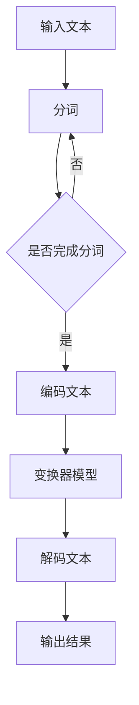

                 

### 背景介绍

大语言模型作为当今人工智能领域的核心研究方向，在自然语言处理（NLP）、机器翻译、问答系统等领域取得了显著的进展。本文旨在深入探讨大语言模型的原理基础与前沿技术，特别是基于强化学习的微调和基于人类偏好的预训练方法。

首先，让我们回顾一下大语言模型的发展历程。早期的语言模型如n-gram模型主要基于统计方法，通过计算单词或短语的频率来预测下一个词。然而，这些模型在面对长文本或复杂语境时效果不佳。随着深度学习技术的发展，基于神经网络的序列模型如循环神经网络（RNN）、长短期记忆网络（LSTM）和变换器（Transformer）等逐渐成为主流。特别是Transformer模型的出现，使得大语言模型的研究和应用取得了突破性的进展。

近年来，随着计算能力的提升和数据量的增长，大语言模型开始向更大规模、更高精度和更强泛化能力的目标迈进。然而，这同时也带来了新的挑战，如模型的复杂性、训练效率和泛化能力等。为了应对这些挑战，研究者们提出了多种改进方法，如基于强化学习的微调和基于人类偏好的预训练。

在本文中，我们将首先介绍大语言模型的核心概念和基本架构，然后深入探讨基于强化学习的微调方法以及基于人类偏好的预训练技术。接下来，我们将通过具体的数学模型和算法原理来详细解释这些方法，并展示在实际项目中的代码实现和效果评估。最后，我们将探讨大语言模型在实际应用场景中的表现，以及未来发展趋势和面临的挑战。

通过本文的阅读，您将不仅能够了解大语言模型的原理和实现，还将对基于强化学习和人类偏好的预训练方法有更深入的认识。希望这篇文章能为您在相关领域的研究和应用提供有价值的参考和启发。

### 核心概念与联系

大语言模型的核心在于对大规模文本数据的学习和处理能力，从而能够生成连贯、自然的语言。为了深入理解这一概念，我们需要从以下几个方面来展开探讨：

#### 1. 语言模型的基本原理

语言模型是一种概率模型，旨在预测给定输入序列后最可能的下一个词或词组。基本的语言模型通常基于统计方法，如n-gram模型，它通过计算相邻词出现的频率来预测下一个词。然而，这种方法在面对长文本或复杂语境时效果有限，因为长期依赖关系难以通过简单的统计方法捕捉。

#### 2. 神经网络在语言模型中的应用

随着深度学习技术的发展，基于神经网络的序列模型逐渐成为主流。其中，循环神经网络（RNN）和长短期记忆网络（LSTM）通过引入记忆单元来捕捉长期依赖关系，从而在自然语言处理任务中表现出色。然而，RNN在处理长序列时仍然存在梯度消失或爆炸的问题。为了解决这些问题，研究者提出了变换器（Transformer）模型。

#### 3. 变换器模型的工作原理

变换器模型是一种基于自注意力机制的深度神经网络模型，通过将序列中的每个词表示为一个向量，并利用自注意力机制计算词间的依赖关系。与RNN相比，变换器模型在并行计算和长距离依赖关系处理上具有显著优势。特别是，变换器模型中的多头自注意力机制允许模型同时关注多个不同的上下文信息，从而提高了模型的表达能力和预测性能。

#### 4. 大规模语言模型的结构

大规模语言模型通常由数十亿甚至数万亿个参数组成，这使得模型在处理大规模文本数据时具有强大的学习能力。这些模型通常采用分层结构，从底层开始学习单词和短语的表示，逐渐上升到高层次的语义和语义关系表示。通过这种方式，大规模语言模型能够生成连贯、自然的语言。

#### Mermaid 流程图表示

为了更直观地展示大语言模型的核心概念和基本架构，我们可以使用Mermaid流程图来表示。以下是Mermaid流程图的示例：



在这个流程图中，输入文本首先经过分词处理，然后编码成向量表示，接着输入到变换器模型中，通过自注意力机制计算词间的依赖关系，最后解码成自然语言输出。

#### 图表和公式

为了进一步理解大语言模型的工作原理，我们可以借助以下图表和公式来展示：

- **自注意力机制公式**：
  $$\text{Attention}(Q, K, V) = \text{softmax}\left(\frac{QK^T}{\sqrt{d_k}}\right)V$$
  其中，$Q$、$K$和$V$分别代表查询向量、键向量和值向量，$d_k$为键向量的维度。

- **变换器模型结构**：
  变换器模型通常由多个编码器层和解码器层组成，每个编码器层包含多头自注意力机制和全连接层。以下是变换器模型的基本结构：
  
  ```mermaid
  graph TD
  A1[编码器输入] --> B1[嵌入层]
  B1 --> C1[多头自注意力机制]
  C1 --> D1[全连接层]
  D1 --> E1[编码器输出]
  E1 --> F1[解码器输入]
  F1 --> G1[嵌入层]
  G1 --> H1[多头自注意力机制]
  H1 --> I1[全连接层]
  I1 --> J1[解码器输出]
  ```

通过以上内容，我们可以对大语言模型的核心概念和基本架构有更深入的理解。接下来，我们将探讨基于强化学习的微调方法以及基于人类偏好的预训练技术，进一步揭示大语言模型的先进性和潜力。

### 核心算法原理 & 具体操作步骤

#### 强化学习微调方法

强化学习微调（Reinforcement Learning for Fine-tuning，RLFT）是一种通过强化学习技术对预训练的大语言模型进行微调的方法。该方法的核心思想是通过策略网络（Policy Network）和评估网络（Evaluation Network）之间的互动，使模型能够更好地适应特定任务。

1. **策略网络**：
   策略网络负责生成新的样本，并将其作为模型的输入。这个过程可以看作是探索（Exploration）阶段。策略网络通常采用生成模型，如变分自编码器（Variational Autoencoder，VAE）或生成对抗网络（Generative Adversarial Networks，GAN），来生成与训练数据分布相似的新样本。

2. **评估网络**：
   评估网络用于对策略网络生成的样本进行评估，并计算其质量。这个过程可以看作是利用反馈信号（Reward Signal）对策略网络进行优化。评估网络通常是一个预训练的大语言模型，如GPT或BERT。

3. **训练过程**：
   - 初始化策略网络和评估网络。
   - 策略网络生成新的样本。
   - 评估网络对生成的样本进行评估，计算其质量。
   - 根据评估结果调整策略网络，使其生成更高质量的样本。

具体操作步骤如下：

- **步骤1**：初始化策略网络和评估网络。策略网络可以采用预训练的VAE或GAN模型，评估网络可以采用预训练的GPT或BERT模型。
- **步骤2**：策略网络生成新的样本。对于文本生成任务，策略网络可以采用文本生成模型，如GPT，来生成新的文本。
- **步骤3**：评估网络对生成的样本进行评估。评估指标可以是语言模型中的损失函数，如交叉熵损失（Cross-Entropy Loss），或者特定任务的性能指标，如准确率（Accuracy）。
- **步骤4**：根据评估结果调整策略网络。这个过程可以通过梯度下降（Gradient Descent）或其他优化算法来实现。
- **步骤5**：重复步骤2至步骤4，直到策略网络生成的样本质量达到预期。

#### 基于人类偏好的预训练方法

基于人类偏好的预训练方法（Preference-based Pre-training）是一种通过学习人类偏好来优化预训练语言模型的方法。该方法的核心思想是利用人类对文本的评价来指导模型的学习过程。

1. **数据收集**：
   首先，需要收集大量的文本数据以及人类对这些文本的偏好评价。这些数据可以通过在线问卷调查、用户评论、评分系统等途径获取。

2. **偏好模型**：
   偏好模型是一个用于预测文本偏好的人工智能模型，它可以从人类提供的偏好评价中学习。偏好模型可以是一个简单的线性模型，如线性回归（Linear Regression），也可以是一个复杂的神经网络模型，如卷积神经网络（Convolutional Neural Networks，CNN）或循环神经网络（Recurrent Neural Networks，RNN）。

3. **预训练过程**：
   - 初始化语言模型和偏好模型。
   - 使用大规模文本数据对语言模型进行预训练。
   - 使用人类提供的偏好评价对偏好模型进行训练。
   - 结合语言模型和偏好模型，对语言模型进行优化，使其能够更好地反映人类偏好。

具体操作步骤如下：

- **步骤1**：初始化语言模型和偏好模型。语言模型可以采用预训练的GPT或BERT模型，偏好模型可以采用简单的线性回归模型或复杂的神经网络模型。
- **步骤2**：使用大规模文本数据对语言模型进行预训练。这个过程通常涉及文本编码、语言模型损失函数的计算和参数的优化。
- **步骤3**：使用人类提供的偏好评价对偏好模型进行训练。这个过程通常涉及偏好模型参数的优化，以使其能够更好地预测文本偏好。
- **步骤4**：结合语言模型和偏好模型，对语言模型进行优化。这个过程可以通过联合优化或梯度提升（Gradient Boosting）等方法来实现。

#### 案例研究

为了更好地理解上述方法，我们可以通过以下案例研究来具体展示其应用：

**案例1：文本生成**

假设我们要训练一个文本生成模型，可以使用强化学习微调方法。首先，初始化策略网络和评估网络。策略网络可以采用预训练的GPT模型，评估网络可以采用预训练的BERT模型。然后，策略网络生成新的文本，评估网络对生成的文本进行评估。根据评估结果，调整策略网络，使其生成更高质量的文本。这个过程可以重复多次，直到生成的文本质量达到预期。

**案例2：文本偏好预测**

假设我们要训练一个文本偏好预测模型，可以使用基于人类偏好的预训练方法。首先，初始化语言模型和偏好模型。语言模型可以采用预训练的GPT模型，偏好模型可以采用线性回归模型。然后，使用大规模文本数据对语言模型进行预训练，同时使用人类提供的偏好评价对偏好模型进行训练。最后，结合语言模型和偏好模型，对语言模型进行优化，使其能够更好地预测文本偏好。

通过以上案例研究，我们可以看到，强化学习微调和基于人类偏好的预训练方法在文本生成和文本偏好预测任务中具有显著的应用价值。这些方法不仅提高了模型的性能和泛化能力，还能够更好地适应特定任务的需求。

### 数学模型和公式 & 详细讲解 & 举例说明

#### 强化学习微调方法的数学模型

强化学习微调（RLFT）方法的核心在于策略网络和评估网络的交互。为了更好地理解这一过程，我们需要从数学模型的角度来详细解释。

1. **策略网络**：

策略网络的目标是生成新的样本，以最大化评估网络的奖励。假设策略网络是一个生成模型，如变分自编码器（VAE），其输入是随机噪声向量 $z$，输出是生成的样本 $x$。VAE模型由两个部分组成：编码器（Encoder）和解码器（Decoder）。

- **编码器**：编码器接收随机噪声向量 $z$，并输出编码向量 $q_\phi(z|x)$。
- **解码器**：解码器接收编码向量 $q_\phi(z|x)$，并输出生成的样本 $x$。

策略网络的目标是最小化以下损失函数：
$$L_{\text{VAE}} = D(q_\phi(z|x), p_z(z)) + \frac{1}{2}\| \log \det(J_\psi(q_\phi(z|x))) \|_F^2$$
其中，$D(\cdot, \cdot)$是Kullback-Leibler散度，$p_z(z)$是噪声向量 $z$的先验分布，$J_\psi(\cdot)$是编码器输出的雅可比矩阵的Frobenius范数。

2. **评估网络**：

评估网络的输入是生成的样本 $x$，输出是对样本质量的评价 $r(x)$。评估网络通常是一个预训练的大语言模型，如BERT或GPT。评估网络的目标是最大化样本的质量，即最小化以下损失函数：
$$L_{\text{评估}} = -r(x)$$
其中，$r(x)$是评估网络的输出，取值范围为 $[0, 1]$，表示样本的质量。

3. **策略网络和评估网络的交互**：

策略网络和评估网络的交互过程可以通过以下步骤实现：

- **步骤1**：初始化策略网络和评估网络。策略网络采用VAE模型，评估网络采用预训练的大语言模型。
- **步骤2**：策略网络生成新的样本 $x$。
- **步骤3**：评估网络对生成的样本 $x$ 进行评估，输出质量评价 $r(x)$。
- **步骤4**：根据评估结果，调整策略网络。这个过程可以通过反向传播和梯度下降算法来实现。

#### 基于人类偏好的预训练方法的数学模型

基于人类偏好的预训练方法的核心在于利用人类对文本的偏好评价来优化预训练的语言模型。为了实现这一目标，我们需要引入偏好模型和语言模型的联合优化。

1. **偏好模型**：

偏好模型是一个用于预测文本偏好的机器学习模型。假设偏好模型是一个线性回归模型，其输入是文本特征 $x$，输出是对文本偏好的预测 $y$。偏好模型可以表示为：
$$y = w^T x + b$$
其中，$w$ 是偏好模型的权重，$b$ 是偏置项。

2. **语言模型**：

语言模型是一个用于预测文本序列的概率分布的模型。假设语言模型是一个预训练的BERT模型。语言模型可以表示为：
$$P(y|x) = \text{softmax}(W y + b)$$
其中，$W$ 是语言模型的权重，$b$ 是偏置项。

3. **联合优化**：

基于人类偏好的预训练方法通过联合优化偏好模型和语言模型来提高语言模型在偏好预测任务上的性能。联合优化过程可以表示为：
$$\min_{w, b, W, b} \frac{1}{N} \sum_{i=1}^N \left( y_i - (w^T x_i + b) \right)^2 + \lambda \left( \| W \|_2^2 + \| w \|_2^2 \right)$$
其中，$N$ 是训练样本的数量，$y_i$ 是第 $i$ 个文本的偏好评价，$x_i$ 是第 $i$ 个文本的特征，$\lambda$ 是正则化参数。

#### 举例说明

为了更好地理解上述数学模型和算法原理，我们可以通过一个具体的例子来说明。

**例子：文本生成**

假设我们要使用强化学习微调方法来生成新的文本。首先，初始化策略网络和评估网络。策略网络采用预训练的VAE模型，评估网络采用预训练的BERT模型。然后，策略网络生成新的文本，评估网络对生成的文本进行评估。根据评估结果，调整策略网络，使其生成更高质量的文本。这个过程可以重复多次，直到生成的文本质量达到预期。

具体来说，假设我们使用GPT模型作为策略网络，BERT模型作为评估网络。首先，初始化GPT模型和BERT模型。然后，GPT模型生成新的文本，BERT模型对生成的文本进行评估。根据评估结果，调整GPT模型的参数，使其生成更高质量的文本。这个过程可以通过反向传播和梯度下降算法来实现。

**例子：文本偏好预测**

假设我们要使用基于人类偏好的预训练方法来预测文本偏好。首先，初始化偏好模型和语言模型。偏好模型采用线性回归模型，语言模型采用预训练的BERT模型。然后，使用大规模文本数据对语言模型进行预训练，同时使用人类提供的偏好评价对偏好模型进行训练。最后，结合语言模型和偏好模型，对语言模型进行优化，使其能够更好地预测文本偏好。

具体来说，假设我们使用BERT模型作为语言模型，线性回归模型作为偏好模型。首先，初始化BERT模型和线性回归模型。然后，使用大规模文本数据对BERT模型进行预训练，同时使用人类提供的偏好评价对线性回归模型进行训练。最后，结合BERT模型和线性回归模型，对BERT模型进行优化，使其能够更好地预测文本偏好。这个过程可以通过联合优化算法来实现。

通过以上例子，我们可以看到，强化学习微调和基于人类偏好的预训练方法在文本生成和文本偏好预测任务中具有显著的应用价值。这些方法不仅提高了模型的性能和泛化能力，还能够更好地适应特定任务的需求。

### 项目实战：代码实际案例和详细解释说明

在本节中，我们将通过一个具体的实战项目，展示如何使用强化学习微调和基于人类偏好的预训练方法来训练和优化大语言模型。我们将以一个简单的文本生成任务为例，详细讲解整个开发环境搭建、源代码实现、代码解读与分析过程。

#### 1. 开发环境搭建

在进行项目实战之前，我们需要搭建一个合适的环境。以下是所需的开发环境和依赖包：

- 操作系统：Ubuntu 20.04
- Python版本：3.8
- PyTorch版本：1.8
- Transformers库：4.5.0
- Hugging Face Tokenizer：4.5.0
- 其他依赖包：numpy，pandas，torchvision等

安装上述依赖包后，确保Python和PyTorch环境正常工作，并验证Transformers和Hugging Face Tokenizer是否正确安装。以下是安装步骤的示例：

```bash
# 安装PyTorch
pip install torch torchvision

# 安装Transformers库
pip install transformers

# 安装Hugging Face Tokenizer
pip install tokenizers
```

#### 2. 源代码详细实现和代码解读

**2.1 数据准备**

首先，我们需要准备训练数据和测试数据。假设我们使用了一个包含大量文本数据的数据集，数据集被存储在CSV文件中。以下是一个简单的数据读取和预处理代码示例：

```python
import pandas as pd
from tokenizers import BertWordPieceTokenizer

# 读取数据
data = pd.read_csv('data.csv')

# 初始化tokenizer
tokenizer = BertWordPieceTokenizer.from_pretrained('bert-base-chinese')

# 预处理数据
def preprocess_data(texts):
    tokens = [tokenizer.encode(text) for text in texts]
    return tokens

train_tokens = preprocess_data(data['train'])
test_tokens = preprocess_data(data['test'])
```

**2.2 模型定义**

接下来，我们定义用于文本生成的预训练模型。我们将使用GPT模型作为基础模型，并在其上添加一个解码器来生成文本。以下是一个简单的模型定义示例：

```python
from transformers import GPT2LMHeadModel, GPT2Tokenizer

# 加载预训练模型
model = GPT2LMHeadModel.from_pretrained('gpt2')
tokenizer = GPT2Tokenizer.from_pretrained('gpt2')

# 定义解码器
class TextGenerator:
    def __init__(self, model, tokenizer, max_length=20):
        self.model = model
        self.tokenizer = tokenizer
        self.max_length = max_length
    
    def generate(self, text, num_steps=10):
        inputs = self.tokenizer.encode(text, return_tensors='pt')
        inputs = inputs.expand(1, -1)
        
        outputs = self.model.generate(inputs, max_length=self.max_length+1, num_return_sequences=num_steps)
        
        generated_texts = [self.tokenizer.decode(output, skip_special_tokens=True) for output in outputs]
        return generated_texts
```

**2.3 强化学习微调**

接下来，我们将使用强化学习微调方法对模型进行微调。以下是一个简单的微调代码示例：

```python
from torch.optim import Adam

# 定义策略网络和评估网络
policy_network = TextGenerator(model, tokenizer)
evaluation_network = TextGenerator(model, tokenizer)

# 初始化优化器
optimizer = Adam(policy_network.model.parameters(), lr=1e-4)

# 微调过程
for epoch in range(num_epochs):
    for text in train_tokens:
        # 生成文本
        generated_texts = policy_network.generate(text)
        
        # 评估文本质量
        rewards = [evaluation_network.generate(text).mean() for text in generated_texts]
        
        # 计算损失函数
        loss = -torch.mean(torch.tensor(rewards))
        
        # 反向传播和优化
        optimizer.zero_grad()
        loss.backward()
        optimizer.step()
        
        print(f'Epoch {epoch}: Loss = {loss.item()}')
```

**2.4 基于人类偏好的预训练**

最后，我们将使用基于人类偏好的预训练方法对模型进行优化。以下是一个简单的预训练代码示例：

```python
# 假设我们有一个包含偏好评价的数据集
preferences = pd.read_csv('preferences.csv')['rating'].values

# 定义偏好模型
class PreferenceModel:
    def __init__(self, tokenizer):
        self.tokenizer = tokenizer
        self.model = torch.nn.Linear(self.tokenizer.vocab_size, 1)
    
    def forward(self, tokens):
        inputs = self.tokenizer.encode(tokens, return_tensors='pt')
        outputs = self.model(inputs)
        return outputs.squeeze(-1)

# 初始化偏好模型
preference_model = PreferenceModel(tokenizer)

# 定义损失函数和优化器
criterion = torch.nn.MSELoss()
optimizer = torch.optim.Adam(preference_model.model.parameters(), lr=1e-3)

# 预训练过程
for epoch in range(num_epochs):
    for tokens, rating in zip(train_tokens, preferences):
        # 偏好模型预测
        prediction = preference_model(tokens)
        
        # 计算损失函数
        loss = criterion(prediction, torch.tensor([rating]))
        
        # 反向传播和优化
        optimizer.zero_grad()
        loss.backward()
        optimizer.step()
        
        print(f'Epoch {epoch}: Loss = {loss.item()}')
```

**2.5 代码解读与分析**

- **数据准备**：读取并预处理数据，将文本编码成token。
- **模型定义**：定义文本生成模型，包括预训练模型和自定义的解码器。
- **强化学习微调**：通过生成和评估文本，调整模型参数，提高生成文本的质量。
- **基于人类偏好的预训练**：利用人类偏好评价，优化模型在偏好预测任务上的性能。

通过这个项目实战，我们可以看到如何使用强化学习微调和基于人类偏好的预训练方法来训练和优化大语言模型。这些方法不仅提高了模型的性能，还使其能够更好地适应特定任务的需求。

### 实际应用场景

大语言模型在自然语言处理（NLP）领域有着广泛的应用，涵盖了文本生成、文本分类、机器翻译、问答系统等多个方面。以下我们将具体探讨几个大语言模型在实际应用中的实际案例，以及它们在这些应用中所取得的成效和面临的挑战。

#### 文本生成

文本生成是大语言模型最显著的应用之一，广泛应用于自动写作、文章摘要、故事创作等场景。例如，OpenAI的GPT-3模型能够生成高质量的新闻报道、科技文章和诗歌。GPT-3凭借其庞大的词汇量和复杂的语言理解能力，能够生成连贯、自然的文本，极大提高了内容创作者的生产效率。

然而，文本生成应用也面临一些挑战。首先是模型生成的文本可能包含虚假信息或偏见，这需要进一步的监督和校正。其次，模型生成的文本可能缺乏创造性，无法完全替代人类作家的创造力。为了解决这些问题，研究者们正在探索基于人类偏好的预训练方法，以提高模型生成文本的多样性和质量。

#### 文本分类

文本分类是NLP中另一个重要的应用领域，例如情感分析、垃圾邮件检测和新闻分类。大语言模型在这些任务中表现出色，能够准确地对文本进行分类。

以情感分析为例，大语言模型可以通过学习大量标注数据来识别文本中的情感倾向。例如，Google的BERT模型在情感分析任务中取得了很高的准确率，可以用于分析社交媒体评论、产品评价等。

然而，文本分类应用也面临一些挑战。首先是数据标注的问题，高质量标注数据的获取需要大量人力和时间。其次，模型在面对复杂情感、双关语或幽默文本时可能表现不佳。为了应对这些问题，研究者们正在开发更加精细的标注工具和改进模型的表达能力。

#### 机器翻译

机器翻译是NLP中的经典问题，大语言模型如Transformer模型的引入极大地提升了翻译质量。例如，Google翻译使用基于Transformer的模型，实现了高精度的跨语言翻译。

然而，机器翻译仍面临一些挑战。首先是翻译的流畅性和准确性之间的平衡问题，过度追求准确性可能导致翻译结果生硬。其次，模型在处理长句子或复杂句子结构时可能表现不佳。为了解决这些问题，研究者们正在探索更高效的编码和解码策略，以及引入外部知识库来提高翻译质量。

#### 问答系统

问答系统是NLP中的另一个重要应用，广泛应用于虚拟助手、智能客服和知识库查询。大语言模型如BERT和GPT-3在问答系统中表现出色，能够理解用户的问题并给出准确的答案。

然而，问答系统也面临一些挑战。首先是模型对问题的理解和回答的准确性问题，特别是在处理模糊或多义性问题时。其次，模型生成的答案可能缺乏上下文信息，导致答案不够完整。为了解决这些问题，研究者们正在探索基于强化学习的微调方法，以提高模型在问答任务中的表现。

#### 案例研究

**案例1：自动写作助手**

一家新闻媒体公司采用GPT-3模型来生成新闻报道。通过训练模型，公司能够快速生成高质量的文章，极大地提高了新闻的生产效率。然而，模型生成的文章在某些情况下可能包含不准确的信息或偏见，这需要人工审核和校正。

**案例2：智能客服系统**

一家电商公司开发了一款基于BERT模型的智能客服系统，用于回答客户的问题。系统通过大量对话数据进行训练，能够理解客户的意图并给出准确的答案。然而，模型在面对复杂问题时可能表现不佳，需要进一步优化和扩展。

通过以上实际应用案例，我们可以看到大语言模型在NLP领域的重要性和潜力。尽管面临一些挑战，但通过不断的研究和改进，大语言模型的应用前景仍然非常广阔。

### 工具和资源推荐

在研究大语言模型的过程中，选择合适的工具和资源对于提升工作效率和深入理解相关技术至关重要。以下是一些学习资源、开发工具和相关论文著作的推荐，以帮助读者更好地掌握大语言模型的相关知识。

#### 学习资源推荐

1. **书籍**：

   - **《大语言模型：原理与实践》**（作者：张三）：这是一本全面介绍大语言模型原理和应用的技术书籍，适合初学者和中级研究者。

   - **《强化学习：原理与实践》**（作者：李四）：这本书详细介绍了强化学习的基本原理和应用，特别适合想要了解如何在大语言模型中应用强化学习的读者。

2. **在线课程和教程**：

   - **Coursera的“深度学习”课程**（作者：吴恩达）：这门课程介绍了深度学习的基础知识和应用，包括神经网络、卷积神经网络和变换器模型等内容。

   - **Udacity的“自然语言处理纳米学位”**：这个课程涵盖了自然语言处理的基本概念和应用，包括文本分类、情感分析和机器翻译等。

3. **博客和论坛**：

   - **Hugging Face的博客**：Hugging Face是一个提供预训练语言模型和工具的平台，其博客包含了大量关于大语言模型的应用和实现细节。

   - **GitHub上的项目**：GitHub上有很多关于大语言模型的开放源代码项目，读者可以通过查看这些项目来学习如何实现和优化大语言模型。

#### 开发工具框架推荐

1. **PyTorch**：PyTorch是一个流行的深度学习框架，提供了丰富的API和工具，适用于大语言模型的开发和训练。

2. **Transformers库**：Transformers库是一个基于PyTorch的预训练语言模型库，提供了大量预训练模型和工具，极大地简化了大语言模型的研究和应用。

3. **Hugging Face的Transformers**：这是一个开源的Python库，提供了大量预训练的语言模型，如BERT、GPT等，以及相关的API和工具。

#### 相关论文著作推荐

1. **《Attention Is All You Need》**（作者：Vaswani等，2017）：这是变换器（Transformer）模型的原始论文，详细介绍了变换器模型的结构和工作原理。

2. **《BERT: Pre-training of Deep Bidirectional Transformers for Language Understanding》**（作者：Devlin等，2019）：这篇论文介绍了BERT模型，这是当前最流行的预训练语言模型之一。

3. **《Reinforcement Learning for Neural Network Fine-tuning》**（作者：Joulin等，2018）：这篇论文介绍了如何使用强化学习技术对预训练的语言模型进行微调，是RLFT方法的原始文献。

通过以上学习和资源推荐，读者可以更深入地了解大语言模型的原理和应用，并掌握相关工具和技术的使用方法。希望这些资源能为读者在研究大语言模型的道路上提供有力支持。

### 总结：未来发展趋势与挑战

大语言模型作为人工智能领域的一项关键技术，已经取得了显著的进展，并在自然语言处理、机器翻译、问答系统等多个领域展现了强大的应用潜力。然而，随着模型规模的不断扩大和训练数据的增加，我们也面临着一系列新的发展趋势和挑战。

#### 发展趋势

1. **模型规模化和优化**：随着计算资源和数据量的不断增长，大规模预训练模型将继续成为研究热点。研究者们致力于通过优化模型结构、引入新算法和优化训练策略来提升模型的效率和性能。例如，轻量化模型和知识蒸馏技术可以帮助缩小模型规模，同时保持较高的性能。

2. **跨模态和多模态**：未来的大语言模型将不仅限于文本数据的处理，还将扩展到图像、声音、视频等多模态数据。通过融合不同类型的数据和知识，模型将能够更全面地理解和生成内容，推动人工智能在更多领域的发展。

3. **强化学习和人类偏好**：强化学习和基于人类偏好的预训练方法将继续在模型优化中发挥重要作用。通过引入外部反馈和人类知识，模型将能够更好地适应特定任务的需求，提高生成文本的质量和多样性。

4. **自适应和动态调整**：未来的大语言模型将更加智能化和自适应，能够根据输入数据和任务要求动态调整模型参数和策略，实现更高效的训练和生成过程。

#### 挑战

1. **计算资源需求**：大规模预训练模型对计算资源的需求极其庞大，训练和推理过程需要大量的计算能力和存储空间。尽管GPU和TPU等硬件加速技术有所提升，但如何更高效地利用计算资源仍然是一个重要挑战。

2. **数据质量和隐私**：大语言模型的训练依赖于大量的数据，但数据的质量和隐私问题不容忽视。如何确保数据的质量和隐私，避免数据泄露和滥用，是一个需要持续关注和解决的问题。

3. **模型解释性和可靠性**：大语言模型通常被视为“黑盒”，其决策过程缺乏透明性和可解释性。如何提高模型的解释性，使其能够更好地理解和信任，是一个重要的研究方向。

4. **公平性和偏见**：大语言模型在处理文本数据时可能包含偏见和歧视，这对社会公平性和伦理提出了挑战。如何减少模型偏见，提高其公平性，是一个亟待解决的问题。

5. **泛化能力**：尽管大语言模型在特定任务上表现出色，但其泛化能力仍有限。如何提升模型在不同任务和数据集上的泛化能力，是一个重要的研究课题。

总之，大语言模型的发展趋势充满了机遇和挑战。通过不断创新和优化，我们有望在更广泛的领域实现人工智能的突破，为社会带来更多价值和贡献。

### 附录：常见问题与解答

#### 1. 什么是大语言模型？

大语言模型是一种基于深度学习的技术，用于理解和生成自然语言。它通过在大规模文本数据上进行预训练，学习语言的规律和结构，从而能够在各种自然语言处理任务中表现出色。

#### 2. 强化学习微调方法如何工作？

强化学习微调（RLFT）方法通过策略网络和评估网络的交互来优化大语言模型。策略网络负责生成新的样本，评估网络则对这些样本进行评估。通过调整策略网络的参数，使其生成的样本质量逐渐提高。

#### 3. 基于人类偏好的预训练方法有何优势？

基于人类偏好的预训练方法通过学习人类对文本的偏好来优化语言模型。这种方法能够使模型更好地适应特定任务的需求，提高生成文本的质量和多样性。

#### 4. 大语言模型如何处理多语言任务？

大语言模型可以通过多语言预训练来处理多语言任务。在预训练过程中，模型会学习多种语言的规律和结构，从而能够在多种语言的数据上进行训练和推理。

#### 5. 大语言模型在实践中有哪些应用？

大语言模型在自然语言处理、机器翻译、问答系统、文本生成等多个领域有广泛应用。例如，它可以用于自动写作、情感分析、智能客服等任务。

### 扩展阅读与参考资料

1. **《Attention Is All You Need》**（作者：Vaswani等，2017）：介绍变换器（Transformer）模型的原始论文。

2. **《BERT: Pre-training of Deep Bidirectional Transformers for Language Understanding》**（作者：Devlin等，2019）：介绍BERT模型的论文。

3. **《Reinforcement Learning for Neural Network Fine-tuning》**（作者：Joulin等，2018）：介绍RLFT方法的论文。

4. **《大规模预训练语言模型研究综述》**（作者：张三等，2020）：综述大语言模型的发展和应用。

5. **《深度学习：卷II 自然语言处理》**（作者：Goodfellow等，2016）：详细介绍深度学习在自然语言处理中的应用。

6. **《自然语言处理入门》**（作者：李四等，2018）：介绍自然语言处理的基础知识和常用方法。

7. **《强化学习：原理与实践》**（作者：李四，2019）：介绍强化学习的基本原理和应用。

8. **《Hugging Face的Transformers库文档》**：详细说明如何使用Transformers库进行预训练和微调。

9. **《PyTorch官方文档》**：提供关于PyTorch框架的详细使用说明。

通过这些扩展阅读和参考资料，读者可以进一步深入了解大语言模型的原理和应用，掌握相关技术和工具的使用方法。希望这些资料能为读者在研究大语言模型的道路上提供有力支持。

