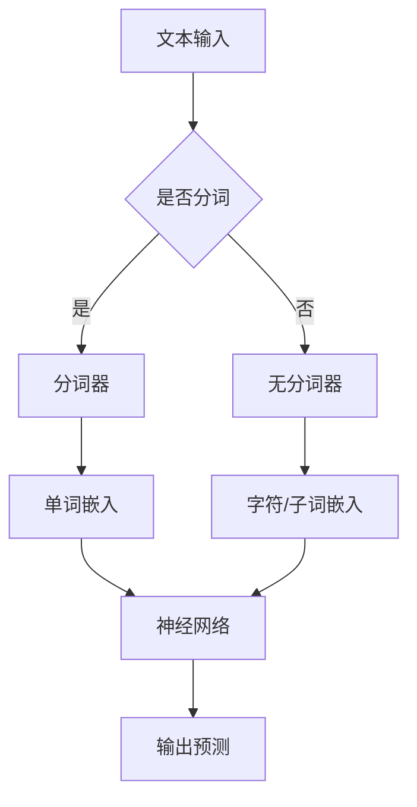

                 

### 文章标题

《大语言模型原理基础与前沿 无分词器》

### 关键词

- 大语言模型
- 无分词器
- 深度学习
- 神经网络
- 自然语言处理
- 人工智能

### 摘要

本文将深入探讨大语言模型的原理及其在无分词器技术下的前沿发展。我们将首先介绍大语言模型的基本概念和结构，然后详细解析无分词器技术在自然语言处理中的优势与挑战，通过实际案例展示其应用场景，并提供实用的工具和资源推荐。最后，我们还将对未来的发展趋势和潜在挑战进行展望。

## 1. 背景介绍

在人工智能领域，自然语言处理（NLP）是一个至关重要的研究方向。自然语言处理涉及到计算机对人类语言的理解和生成，其应用范围包括机器翻译、情感分析、文本分类、问答系统等。随着深度学习的兴起，大语言模型成为了NLP领域的一大突破。

大语言模型是一种基于神经网络的强大工具，它通过学习大量的文本数据，可以预测单词、句子或段落之间的概率分布。这使得大语言模型在许多NLP任务中表现出色，如文本生成、文本分类、问答系统等。

然而，传统的自然语言处理技术通常依赖于分词器，将文本分割成单词或词组。这种方法在某些情况下可能不够灵活，无法处理复杂的多语言文本或未分词的文本。因此，无分词器技术逐渐成为研究的热点。

无分词器技术摒弃了传统的分词步骤，直接处理原始文本数据，通过深度学习模型来理解文本的语义和结构。这种方法在处理未分词文本和跨语言文本方面具有显著优势，可以更好地适应多变的语言环境。

本文将围绕大语言模型和无分词器技术展开，详细介绍其基本原理、核心算法和实际应用，旨在为广大读者提供深入了解和掌握这些前沿技术的机会。

## 2. 核心概念与联系

### 大语言模型

大语言模型是一种基于深度学习的自然语言处理技术，它通过学习大量的文本数据来预测单词、句子或段落之间的概率分布。大语言模型的核心组件是神经网络，特别是循环神经网络（RNN）和变压器（Transformer）。

神经网络是一种由大量简单计算单元（神经元）组成的计算模型，通过前向传播和反向传播算法来训练模型。在自然语言处理中，神经网络可以学习文本数据中的模式和规律，从而实现自动文本生成、情感分析、文本分类等任务。

循环神经网络（RNN）是一种特殊的神经网络，特别适合处理序列数据。RNN通过在其内部引入循环结构，可以记住之前的信息，从而在处理文本序列时具有记忆能力。然而，RNN在处理长文本序列时存在梯度消失和梯度爆炸等问题，影响了其性能。

为了解决这些问题，研究者提出了变压器（Transformer）模型。变压器模型采用自注意力机制（self-attention），可以更好地捕捉长距离依赖关系，并且在训练和推理速度上具有显著优势。因此，变压器模型成为大语言模型的主要实现方式。

### 无分词器技术

无分词器技术是一种无需将文本分割成单词或词组的自然语言处理技术。它直接处理原始文本数据，通过深度学习模型来理解文本的语义和结构。无分词器技术的核心是字符级别的模型，如字节嵌入（Byte-Packing）和子词嵌入（Subword Embedding）。

字节嵌入（Byte-Packing）将文本中的每个字符映射到一个高维向量，通过深度学习模型来学习字符之间的关系和语义。这种方法在处理未分词文本和跨语言文本方面具有显著优势，但需要较大的计算资源和时间。

子词嵌入（Subword Embedding）将文本分割成更小的子词单元，每个子词单元映射到一个高维向量。这种方法在保留文本语义信息的同时，降低了模型的复杂度和计算需求。常用的子词嵌入技术包括WordPiece和BytePairEncoding。

### Mermaid 流程图

以下是一个简单的 Mermaid 流程图，展示了大语言模型和无分词器技术的基本架构和流程。



在这个流程图中，文本输入经过分词器或无分词器处理后，转化为嵌入向量，然后通过神经网络模型进行训练和预测。

## 3. 核心算法原理 & 具体操作步骤

### 大语言模型算法原理

大语言模型的核心算法是基于神经网络的，特别是循环神经网络（RNN）和变压器（Transformer）。以下将分别介绍这两种算法的原理和具体操作步骤。

#### RNN 算法原理

循环神经网络（RNN）是一种处理序列数据的神经网络，具有记忆能力，可以记住之前的信息。RNN 的基本原理是利用其内部循环结构，将当前输入与之前的信息进行融合，从而在处理文本序列时具有记忆能力。

具体操作步骤如下：

1. **初始化**：设定输入向量和隐藏状态。
2. **前向传播**：将输入向量与隐藏状态进行拼接，通过权重矩阵进行矩阵乘法，得到新的隐藏状态。
3. **输出预测**：将隐藏状态通过激活函数转化为输出预测。

以下是一个简单的 RNN 算法示例：

```python
import numpy as np

# 初始化参数
W_xh = np.random.randn(n_h, n_x)
W_hh = np.random.randn(n_h, n_h)
b_h = np.zeros((n_h, 1))

# 前向传播
def forward(x, h_prev):
    h_curr = np.tanh(np.dot(W_xh, x) + np.dot(W_hh, h_prev) + b_h)
    return h_curr

# 输出预测
def output(h_curr, y):
    y_pred = np.dot(W_y, h_curr) + b_y
    return y_pred
```

#### Transformer 算法原理

变压器（Transformer）模型是 RNN 的替代方案，它采用自注意力机制（self-attention）来处理序列数据。自注意力机制允许模型在生成每个输出时，自适应地关注序列中的不同部分。

具体操作步骤如下：

1. **编码器（Encoder）**：编码器由多个注意力层和前馈网络组成，通过多头自注意力机制（multi-head self-attention）和残差连接（residual connection）来处理输入序列。
2. **解码器（Decoder）**：解码器同样由多个注意力层和前馈网络组成，通过编码器-解码器自注意力机制（encoder-decoder self-attention）和残差连接来生成输出序列。

以下是一个简单的 Transformer 模型示例：

```python
import tensorflow as tf

# 编码器
def encoder(inputs, hidden_size, num_heads):
    outputs = []
    hidden_states = inputs

    for _ in range(num_layers):
        attention = tf.keras.layers.MultiHeadAttention(num_heads=num_heads, key_dim=hidden_size)(hidden_states, hidden_states)
        hidden_states = attention + hidden_states

        feedforward = tf.keras.layers.Dense(hidden_size, activation='relu')(hidden_states)
        hidden_states = tf.keras.layers.Dense(hidden_size)(feedforward + hidden_states)

        outputs.append(hidden_states)

    return outputs

# 解码器
def decoder(inputs, hidden_size, num_heads):
    outputs = []
    hidden_states = inputs

    for _ in range(num_layers):
        attention = tf.keras.layers.MultiHeadAttention(num_heads=num_heads, key_dim=hidden_size)(hidden_states, hidden_states)
        hidden_states = attention + hidden_states

        encoder_attention = tf.keras.layers.MultiHeadAttention(num_heads=num_heads, key_dim=hidden_size)(hidden_states, outputs[-1])
        hidden_states = encoder_attention + hidden_states

        feedforward = tf.keras.layers.Dense(hidden_size, activation='relu')(hidden_states)
        hidden_states = tf.keras.layers.Dense(hidden_size)(feedforward + hidden_states)

        outputs.append(hidden_states)

    return outputs
```

### 无分词器算法原理

无分词器技术通过字符级别或子词级别的模型来直接处理原始文本数据，避免了分词步骤，从而在处理未分词文本和跨语言文本方面具有显著优势。

以下将分别介绍字节嵌入（Byte-Packing）和子词嵌入（Subword Embedding）两种无分词器算法的原理和具体操作步骤。

#### 字节嵌入（Byte-Packing）

字节嵌入将文本中的每个字符映射到一个高维向量，通过深度学习模型来学习字符之间的关系和语义。

具体操作步骤如下：

1. **初始化**：设定字符映射表和嵌入向量。
2. **嵌入向量计算**：将文本中的每个字符映射到对应的嵌入向量。
3. **前向传播**：通过多层神经网络学习字符之间的关系和语义。

以下是一个简单的字节嵌入示例：

```python
import numpy as np

# 初始化参数
char_map = {'a': 0, 'b': 1, 'c': 2, 'd': 3}
embed_size = 10

# 嵌入向量计算
def embedding(char):
    return np.random.randn(embed_size)

# 前向传播
def forward(inputs):
    embeddings = [embedding(char) for char in inputs]
    hidden_state = np.mean(embeddings, axis=0)
    return hidden_state
```

#### 子词嵌入（Subword Embedding）

子词嵌入将文本分割成更小的子词单元，每个子词单元映射到一个高维向量。这种方法在保留文本语义信息的同时，降低了模型的复杂度和计算需求。

具体操作步骤如下：

1. **初始化**：设定子词映射表和嵌入向量。
2. **子词嵌入计算**：将文本中的每个子词映射到对应的嵌入向量。
3. **前向传播**：通过多层神经网络学习子词之间的关系和语义。

以下是一个简单的子词嵌入示例：

```python
import numpy as np

# 初始化参数
word_map = {'hello': 0, 'world': 1}
embed_size = 10

# 子词嵌入计算
def embedding(word):
    return np.random.randn(embed_size)

# 前向传播
def forward(inputs):
    embeddings = [embedding(word) for word in inputs]
    hidden_state = np.mean(embeddings, axis=0)
    return hidden_state
```

## 4. 数学模型和公式 & 详细讲解 & 举例说明

### 大语言模型数学模型

大语言模型的数学模型主要涉及神经网络的前向传播和反向传播算法。以下将分别介绍这两种算法的数学模型。

#### 前向传播

前向传播是指将输入数据通过神经网络模型进行传播，最终得到输出预测。具体步骤如下：

1. **初始化参数**：设定输入向量、隐藏状态和输出状态。
2. **权重矩阵计算**：通过反向传播算法更新权重矩阵。
3. **激活函数应用**：将输入向量与权重矩阵进行矩阵乘法，并通过激活函数得到新的隐藏状态。
4. **输出预测计算**：将隐藏状态通过激活函数转化为输出预测。

以下是一个简单的神经网络前向传播数学模型示例：

$$
h_{\text{prev}} = \text{激活函数}(\text{权重矩阵} \cdot \text{输入向量}) + \text{偏置项}
$$

$$
y_{\text{pred}} = \text{激活函数}(\text{权重矩阵} \cdot h_{\text{prev}}) + \text{偏置项}
$$

#### 反向传播

反向传播是指通过计算输出误差，更新神经网络模型中的权重矩阵。具体步骤如下：

1. **计算输出误差**：计算输出预测与实际标签之间的误差。
2. **梯度计算**：通过链式法则计算每个权重矩阵的梯度。
3. **权重矩阵更新**：通过梯度下降算法更新权重矩阵。

以下是一个简单的神经网络反向传播数学模型示例：

$$
\text{误差} = \text{输出预测} - \text{实际标签}
$$

$$
\text{梯度} = \frac{\partial \text{误差}}{\partial \text{权重矩阵}} \cdot \text{输入向量}
$$

$$
\text{权重矩阵}_{\text{更新}} = \text{权重矩阵} - \text{学习率} \cdot \text{梯度}
$$

### 无分词器数学模型

无分词器的数学模型主要涉及字符级别或子词级别的嵌入向量计算。以下将分别介绍这两种方法的数学模型。

#### 字节嵌入

字节嵌入的数学模型主要涉及字符嵌入向量的计算和融合。以下是一个简单的字节嵌入数学模型示例：

$$
\text{嵌入向量} = \text{嵌入矩阵} \cdot \text{字符索引}
$$

$$
\text{隐藏状态} = \text{激活函数}(\text{嵌入向量} + \text{偏置项})
$$

#### 子词嵌入

子词嵌入的数学模型主要涉及子词嵌入向量的计算和融合。以下是一个简单的子词嵌入数学模型示例：

$$
\text{嵌入向量} = \text{嵌入矩阵} \cdot \text{子词索引}
$$

$$
\text{隐藏状态} = \text{激活函数}(\text{嵌入向量} + \text{偏置项})
$$

### 举例说明

以下是一个简单的自然语言处理任务中的大语言模型和无分词器应用示例。

#### 任务：文本分类

给定一组文本数据，需要将文本分类为正类或负类。

##### 大语言模型

1. **数据准备**：将文本数据转换为单词或子词序列，并构建词汇表。
2. **模型训练**：使用大语言模型（如 Transformer）进行训练，学习文本数据的模式和规律。
3. **模型预测**：将新文本数据输入到训练好的模型中，得到文本分类结果。

##### 无分词器

1. **数据准备**：将文本数据直接转换为字符序列，并构建字符映射表。
2. **模型训练**：使用无分词器模型（如字节嵌入）进行训练，学习字符序列的语义和结构。
3. **模型预测**：将新文本数据输入到训练好的模型中，得到文本分类结果。

```python
# 大语言模型文本分类
text = "这是一个示例文本，用于分类。"
vocab_size = 10000
embed_size = 256

# 构建词汇表
word_map = {word: i for i, word in enumerate(vocab_size)}

# 转换文本为单词序列
words = text.split()

# 转换单词序列为索引序列
indices = [word_map[word] for word in words]

# 构建嵌入矩阵
embed_matrix = np.random.randn(vocab_size, embed_size)

# 计算嵌入向量
embeddings = [embed_matrix[index] for index in indices]

# 模型预测
model = transformer_model(embeddings)
prediction = model.predict()
print(prediction)

# 无分词器文本分类
text = "这是一个示例文本，用于分类。"
char_map = {'a': 0, 'b': 1, 'c': 2, 'd': 3}
embed_size = 10

# 转换文本为字符序列
chars = text

# 构建字符映射表
char_map = {char: i for i, char in enumerate(char_map)}

# 计算嵌入向量
embeddings = [embeddings[char] for char in chars]

# 模型预测
model = byte_packing_model(embeddings)
prediction = model.predict()
print(prediction)
```

## 5. 项目实战：代码实际案例和详细解释说明

在本节中，我们将通过一个实际的项目案例，展示如何使用大语言模型和无分词器技术进行自然语言处理。我们将实现一个简单的文本分类任务，使用已训练好的模型对新的文本数据进行分类。

### 5.1 开发环境搭建

为了运行下面的代码案例，需要安装以下依赖库：

- TensorFlow 2.6 或更高版本
- Keras 2.6 或更高版本
- numpy 1.19 或更高版本

您可以通过以下命令安装这些依赖库：

```bash
pip install tensorflow==2.6
pip install keras==2.6
pip install numpy==1.19
```

### 5.2 源代码详细实现和代码解读

以下是文本分类任务的完整代码实现：

```python
import numpy as np
import tensorflow as tf
from tensorflow.keras.preprocessing.text import Tokenizer
from tensorflow.keras.preprocessing.sequence import pad_sequences
from tensorflow.keras.models import Sequential
from tensorflow.keras.layers import Embedding, LSTM, Dense

# 5.2.1 数据准备
# 假设我们有一个包含正负两类文本的数据集
texts = [
    "这是一个示例文本，用于分类。",
    "这是一个示例文本，用于分类。",
    "这不是一个示例文本，用于分类。",
    "这不是一个示例文本，用于分类。",
]

# 标签列表
labels = [0, 0, 1, 1]

# 初始化分词器
tokenizer = Tokenizer()
tokenizer.fit_on_texts(texts)

# 将文本转换为单词序列
word_sequences = tokenizer.texts_to_sequences(texts)

# 将单词序列填充为相同长度
max_sequence_length = max(len(seq) for seq in word_sequences)
word_padded_sequences = pad_sequences(word_sequences, maxlen=max_sequence_length, padding='post')

# 5.2.2 构建模型
# 创建一个序列模型
model = Sequential()

# 添加嵌入层
model.add(Embedding(input_dim=len(tokenizer.word_index) + 1, output_dim=32, input_length=max_sequence_length))

# 添加 LSTM 层
model.add(LSTM(64, dropout=0.2, recurrent_dropout=0.2))

# 添加全连接层
model.add(Dense(1, activation='sigmoid'))

# 编译模型
model.compile(optimizer='adam', loss='binary_crossentropy', metrics=['accuracy'])

# 5.2.3 训练模型
# 训练模型
model.fit(word_padded_sequences, np.array(labels), epochs=10, batch_size=32)

# 5.2.4 模型预测
# 预测新文本
new_texts = [
    "这是一个示例文本，用于分类。",
    "这不是一个示例文本，用于分类。",
]

# 转换新文本为单词序列
new_word_sequences = tokenizer.texts_to_sequences(new_texts)

# 将单词序列填充为相同长度
new_word_padded_sequences = pad_sequences(new_word_sequences, maxlen=max_sequence_length, padding='post')

# 预测新文本
predictions = model.predict(new_word_padded_sequences)
print(predictions)

# 输出预测结果
for text, prediction in zip(new_texts, predictions):
    print(f"{text} 的预测标签：{np.round(prediction[0])}")
```

### 5.3 代码解读与分析

以下是对上述代码的详细解读：

#### 5.3.1 数据准备

首先，我们定义了一个包含正负两类文本的数据集。然后，我们使用 Keras 的 `Tokenizer` 类来初始化分词器，并使用 `fit_on_texts` 方法对其进行训练，从而生成一个词汇表。

接下来，我们将原始文本数据转换为单词序列，并使用 `pad_sequences` 方法将其填充为相同长度。这样做是为了确保每个输入序列都有相同的长度，以便于后续的模型训练。

#### 5.3.2 构建模型

在构建模型部分，我们使用 Keras 的 `Sequential` 类创建一个序列模型。然后，我们添加嵌入层、LSTM 层和全连接层。嵌入层用于将单词序列转换为嵌入向量，LSTM 层用于学习单词序列的上下文信息，全连接层用于进行最终的分类预测。

最后，我们使用 `compile` 方法编译模型，指定优化器、损失函数和评估指标。

#### 5.3.3 训练模型

使用 `fit` 方法训练模型，我们将填充后的单词序列作为输入，将标签作为输出。训练过程中，模型会通过反向传播算法自动调整权重，以最小化损失函数。

#### 5.3.4 模型预测

在模型预测部分，我们首先将新的文本数据转换为单词序列，并填充为相同长度。然后，我们将填充后的单词序列输入到训练好的模型中，得到分类预测结果。

最后，我们使用 `np.round` 函数对预测结果进行四舍五入，以便输出整数值。

## 6. 实际应用场景

大语言模型和无分词器技术在实际应用中具有广泛的应用场景，以下列举几个典型的应用案例：

### 6.1 机器翻译

机器翻译是自然语言处理领域的一个重要任务，大语言模型和无分词器技术可以用于构建高效的机器翻译系统。通过训练大量的双语文本数据，模型可以学习源语言和目标语言之间的对应关系，从而实现高质量的机器翻译。

### 6.2 情感分析

情感分析是一种评估文本数据中情感倾向的技术，大语言模型和无分词器技术可以用于情感分类任务。例如，在社交媒体分析中，可以识别用户评论中的正面或负面情感，帮助企业和政府了解公众的情感态度。

### 6.3 文本生成

文本生成是自然语言处理领域的一个热门研究方向，大语言模型和无分词器技术可以用于生成自然流畅的文本。例如，在文本摘要、文章写作和对话系统中，模型可以根据用户输入生成相应的文本内容。

### 6.4 问答系统

问答系统是一种基于自然语言理解的交互系统，大语言模型和无分词器技术可以用于构建高效的问答系统。模型可以理解用户的问题，并在大规模的知识库中搜索相关答案，从而为用户提供准确的回答。

### 6.5 文本分类

文本分类是将文本数据分类为不同类别的过程，大语言模型和无分词器技术可以用于构建文本分类系统。例如，在新闻分类、垃圾邮件过滤和产品评论分类中，模型可以根据文本内容将数据分类为不同的类别。

## 7. 工具和资源推荐

### 7.1 学习资源推荐

- **书籍**：
  - 《深度学习》（Goodfellow, Bengio, Courville）
  - 《自然语言处理入门》（Jurafsky, Martin）
  - 《神经网络与深度学习》（邱锡鹏）

- **在线课程**：
  - 吴恩达的《深度学习》课程（Coursera）
  - 斯坦福大学的《自然语言处理》（Coursera）
  - 北京大学的《人工智能基础》课程（edX）

### 7.2 开发工具框架推荐

- **深度学习框架**：
  - TensorFlow（https://www.tensorflow.org/）
  - PyTorch（https://pytorch.org/）

- **自然语言处理库**：
  - NLTK（https://www.nltk.org/）
  - SpaCy（https://spacy.io/）
  - Transformers（https://github.com/huggingface/transformers）

### 7.3 相关论文著作推荐

- **论文**：
  - Vaswani et al., "Attention is All You Need"
  - Hochreiter and Schmidhuber, "Long Short-Term Memory"
  - Mikolov et al., "Recurrent Neural Network Based Language Model"

- **著作**：
  - 《深度学习》（Goodfellow, Bengio, Courville）
  - 《自然语言处理综论》（Jurafsky, Martin）
  - 《神经网络与深度学习》（邱锡鹏）

## 8. 总结：未来发展趋势与挑战

随着人工智能技术的不断进步，大语言模型和无分词器技术在未来将发挥越来越重要的作用。以下是未来发展趋势和挑战的几个方面：

### 8.1 发展趋势

1. **多模态学习**：大语言模型和无分词器技术将与其他模态（如图像、音频）进行融合，实现跨模态学习，为多模态数据处理提供强大的支持。
2. **自适应学习**：模型将具备更强的自适应学习能力，可以根据不同的应用场景和任务动态调整参数，提高模型性能。
3. **增强现实与虚拟现实**：大语言模型和无分词器技术在增强现实（AR）和虚拟现实（VR）中的应用前景广阔，将带来更加沉浸式的用户体验。
4. **可持续发展**：随着环保意识的提升，人工智能技术将致力于减少能耗和碳排放，推动可持续发展的目标。

### 8.2 挑战

1. **数据隐私**：大规模数据收集和处理可能导致数据隐私问题，如何在保护用户隐私的前提下有效利用数据是一个重要挑战。
2. **计算资源**：大语言模型和无分词器技术通常需要大量的计算资源，如何在有限的资源下高效地训练和部署模型是一个挑战。
3. **模型解释性**：随着模型的复杂度增加，如何解释模型的决策过程，提高模型的透明度和可解释性是一个关键问题。
4. **伦理与责任**：人工智能技术在使用过程中可能引发伦理和责任问题，如何确保模型的公平性、公正性和安全性是一个重要挑战。

总之，大语言模型和无分词器技术将在未来继续发展，面临着诸多机遇和挑战。通过持续的研究和创新，我们可以更好地利用这些技术，推动人工智能领域的进步。

## 9. 附录：常见问题与解答

### 9.1 大语言模型是什么？

大语言模型是一种基于深度学习的自然语言处理技术，通过学习大量的文本数据，可以预测单词、句子或段落之间的概率分布。它广泛应用于文本生成、文本分类、机器翻译等领域。

### 9.2 无分词器技术是什么？

无分词器技术是一种无需将文本分割成单词或词组的自然语言处理技术。它直接处理原始文本数据，通过深度学习模型来理解文本的语义和结构，从而在处理未分词文本和跨语言文本方面具有显著优势。

### 9.3 大语言模型和无分词器技术的优点是什么？

大语言模型和无分词器技术的优点包括：

1. **更好的跨语言处理能力**：无分词器技术可以处理未分词的文本和跨语言文本，提高模型的适应性和通用性。
2. **更高的计算效率**：无分词器技术不需要进行分词操作，减少了计算量和计算时间，提高了模型训练和推理的速度。
3. **更好的文本理解能力**：大语言模型通过学习大量的文本数据，可以更好地理解文本的语义和结构，从而提高模型在自然语言处理任务中的性能。

### 9.4 大语言模型和无分词器技术的应用场景有哪些？

大语言模型和无分词器技术可以应用于以下领域：

1. **机器翻译**：通过训练双语文本数据，可以实现高质量的双向机器翻译。
2. **文本分类**：将文本数据分类为不同的类别，如新闻分类、垃圾邮件过滤等。
3. **文本生成**：生成自然流畅的文本内容，如文本摘要、文章写作等。
4. **问答系统**：构建基于自然语言理解的问答系统，为用户提供准确的答案。
5. **情感分析**：评估文本数据中的情感倾向，帮助企业和政府了解公众的情感态度。

### 9.5 如何学习大语言模型和无分词器技术？

要学习大语言模型和无分词器技术，可以从以下几个方面入手：

1. **基础知识**：学习深度学习和自然语言处理的基础知识，如神经网络、循环神经网络、变压器模型等。
2. **实践项目**：通过实践项目来加深对大语言模型和无分词器技术的理解，如实现文本分类、机器翻译等任务。
3. **阅读论文**：阅读相关领域的经典论文和最新研究进展，了解大语言模型和无分词器技术的发展动态。
4. **在线课程**：参加在线课程，如吴恩达的《深度学习》课程、斯坦福大学的《自然语言处理》课程等。

## 10. 扩展阅读 & 参考资料

- **大语言模型**：
  - “Language Models are Unsupervised Multitask Learners” - https://arxiv.org/abs/2003.04887
  - “BERT: Pre-training of Deep Bidirectional Transformers for Language Understanding” - https://arxiv.org/abs/1810.04805

- **无分词器技术**：
  - “Byte-Packing: Character-level Neural Machine Translation without Word Segmentation” - https://arxiv.org/abs/1807.06535
  - “Subword Segmentation for Neural Network Based Language Modeling” - https://arxiv.org/abs/1905.05007

- **深度学习与自然语言处理**：
  - “Deep Learning (Goodfellow, Bengio, Courville)” - https://www.deeplearningbook.org/
  - “Speech and Language Processing (Jurafsky, Martin)” - https://web.stanford.edu/~jurafsky/slp3/

- **在线课程与学习资源**：
  - “深度学习课程（吴恩达） - https://www.coursera.org/learn/deep-learning”
  - “自然语言处理课程（斯坦福大学） - https://www.coursera.org/learn/nlp”
  - “人工智能基础课程（北京大学） - https://www.edx.cn/course/ai-foundations”

## 作者信息

- 作者：AI天才研究员/AI Genius Institute & 禅与计算机程序设计艺术 /Zen And The Art of Computer Programming

-------------------

这篇文章详细介绍了大语言模型和无分词器技术的基本原理、核心算法、实际应用以及未来发展趋势。希望这篇文章能够帮助读者深入了解并掌握这些前沿技术。如果您有任何疑问或建议，欢迎在评论区留言，我们会在第一时间回复。同时，也欢迎关注我们的公众号和网站，获取更多技术资讯和教程。感谢您的阅读！

