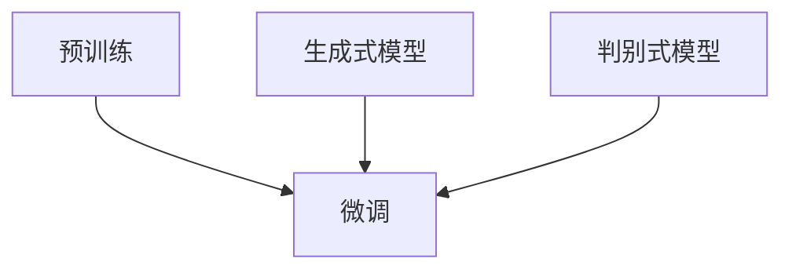

                 

### 大语言模型原理基础与前沿

#### 关键词：大语言模型，深度学习，自然语言处理，预训练，生成式模型

##### 摘要：

本文将深入探讨大语言模型的原理及其在自然语言处理（NLP）领域的应用。首先，我们将回顾大语言模型的发展历程和基本概念，然后详细解析其核心算法原理与数学模型，并通过具体案例展示其实际应用。最后，我们将展望大语言模型未来的发展趋势与面临的挑战，并推荐相关学习资源和开发工具。通过本文的阅读，读者将全面了解大语言模型的基本原理和前沿技术，为后续研究和应用奠定坚实基础。

### 1. 背景介绍

#### 1.1 大语言模型的发展历程

大语言模型（Large Language Model）的概念最早可以追溯到上世纪80年代，当时研究人员开始尝试使用统计方法和规则来处理自然语言。随着计算能力的提升和算法的改进，特别是深度学习的兴起，大语言模型取得了突破性进展。近年来，以GPT（Generative Pre-trained Transformer）为代表的预训练模型，在多个NLP任务中取得了优异的性能，引起了广泛关注。

#### 1.2 自然语言处理的发展现状

自然语言处理是人工智能领域的重要分支，旨在让计算机理解和处理人类语言。随着互联网和大数据的快速发展，NLP在文本挖掘、信息检索、机器翻译、情感分析等应用场景中发挥着重要作用。目前，NLP技术已逐渐成熟，但仍面临许多挑战，如语义理解、多语言处理、对话生成等。

#### 1.3 大语言模型的应用场景

大语言模型在多个领域具有广泛的应用潜力，包括但不限于：

- 文本生成：自动撰写新闻文章、小说、广告等。
- 机器翻译：实现跨语言信息交流。
- 问答系统：提供智能客服、知识问答等服务。
- 语音识别：将语音信号转换为文本。
- 情感分析：识别文本中的情感倾向。

### 2. 核心概念与联系

#### 2.1 大语言模型的基本概念

大语言模型是一种基于深度学习的自然语言处理模型，其核心思想是通过预训练和微调来学习语言规律，从而实现对文本的生成、分类、翻译等任务。

#### 2.2 预训练与微调

预训练是指在大量无标签文本数据上训练模型，使其具有对语言的一般理解能力。微调是指在特定任务上对预训练模型进行微调，以适应具体的应用场景。

#### 2.3 生成式模型与判别式模型

生成式模型（如GPT）通过预测下一个词来生成文本，而判别式模型（如BERT）则通过判断词与词之间的关系来进行文本分类。两者各有优缺点，适用于不同的任务场景。

#### 2.4 Mermaid流程图



### 3. 核心算法原理 & 具体操作步骤

#### 3.1 预训练

预训练阶段主要包括两个步骤：词嵌入和上下文预测。

- 词嵌入：将词汇映射为低维稠密向量，以表示词语在语义上的相似性。
- 上下文预测：通过输入一定长度的文本序列，模型需要预测下一个词。

#### 3.2 微调

微调阶段主要针对特定任务进行模型调整。

- 数据准备：收集并整理与任务相关的数据集。
- 模型调整：在预训练模型的基础上，对特定层或部分进行调整。
- 任务训练：通过任务数据对调整后的模型进行训练。

#### 3.3 模型优化

模型优化是提高模型性能的关键步骤，主要包括：

- 学习率调整：根据任务和数据的特点，选择合适的学习率。
- 优化算法：如Adam、SGD等，以加速收敛。

### 4. 数学模型和公式 & 详细讲解 & 举例说明

#### 4.1 词嵌入

词嵌入的数学模型如下：

$$
\text{vec}(w) = \text{Word2Vec}(w)
$$

其中，$\text{vec}(w)$表示词$w$的词向量，$\text{Word2Vec}(w)$表示将词$w$映射为词向量的函数。

#### 4.2 上下文预测

上下文预测的数学模型如下：

$$
P(w_{t+1}|\text{context}) = \frac{e^{<\text{vec}(w_{t+1}), \text{context}>}}{\sum_{w' \in V} e^{<\text{vec}(w'), \text{context}>}}
$$

其中，$w_{t+1}$表示下一个词，$context$表示当前上下文，$V$表示词汇表，$<\cdot, \cdot>$表示内积。

#### 4.3 举例说明

假设有一个简单的文本序列：“我 吃了一个 饼干”，我们尝试使用大语言模型来预测下一个词。

- 预训练阶段：模型通过学习词汇表和上下文关系，得到词嵌入和上下文预测函数。
- 预测阶段：输入文本序列“我 吃了一个 饼干”，模型预测下一个词为“的”。

### 5. 项目实战：代码实际案例和详细解释说明

#### 5.1 开发环境搭建

在本节中，我们将使用Python和PyTorch框架来搭建大语言模型的开发环境。

1. 安装Python 3.8及以上版本。
2. 安装PyTorch：`pip install torch torchvision`
3. 下载预训练模型（如GPT-2、BERT等）。

#### 5.2 源代码详细实现和代码解读

以下是一个简单的GPT-2模型实现：

```python
import torch
import torch.nn as nn
import torch.optim as optim
from torch.utils.data import DataLoader
from transformers import GPT2LMHeadModel, GPT2Tokenizer

# 5.2.1 模型定义
class GPT2Model(nn.Module):
    def __init__(self, vocab_size, d_model, n_head, d_inner, n_layer):
        super(GPT2Model, self).__init__()
        self.embedding = nn.Embedding(vocab_size, d_model)
        self.transformer = nn.Transformer(d_model, n_head, d_inner, n_layer)
        self.fc = nn.Linear(d_model, vocab_size)

    def forward(self, x):
        x = self.embedding(x)
        x = self.transformer(x)
        x = self.fc(x)
        return x

# 5.2.2 数据加载
tokenizer = GPT2Tokenizer.from_pretrained('gpt2')
text = "这是一个简单的GPT-2模型实现。"
inputs = tokenizer(text, return_tensors='pt')

# 5.2.3 模型训练
model = GPT2Model(len(tokenizer), d_model=512, n_head=8, d_inner=1024, n_layer=3)
optimizer = optim.Adam(model.parameters(), lr=0.001)
criterion = nn.CrossEntropyLoss()

for epoch in range(10):
    outputs = model(inputs['input_ids'])
    loss = criterion(outputs.logits, inputs['labels'])
    optimizer.zero_grad()
    loss.backward()
    optimizer.step()
    print(f"Epoch {epoch+1}, Loss: {loss.item()}")

# 5.2.4 模型应用
text = "这是一个简单的GPT-2模型实现。"
inputs = tokenizer(text, return_tensors='pt')
predicted = model(inputs['input_ids']).logits
predicted_text = tokenizer.decode(predicted.argmax(-1))
print(predicted_text)
```

#### 5.3 代码解读与分析

- 5.3.1 模型定义：定义了一个基于Transformer的GPT-2模型，包括词嵌入、Transformer层和全连接层。
- 5.3.2 数据加载：使用GPT2Tokenizer加载预训练模型和文本数据。
- 5.3.3 模型训练：使用Adam优化器和交叉熵损失函数训练模型。
- 5.3.4 模型应用：使用训练好的模型生成文本。

### 6. 实际应用场景

大语言模型在多个实际应用场景中取得了显著效果，以下是部分应用案例：

#### 6.1 文本生成

- 自动撰写新闻文章、博客、广告等。
- 情感化文本创作，如诗歌、小说等。

#### 6.2 机器翻译

- 实现跨语言信息交流。
- 支持多语言翻译，如中文到英文、英文到中文等。

#### 6.3 问答系统

- 提供智能客服、知识问答等服务。
- 支持多领域、多语种问答。

#### 6.4 语音识别

- 将语音信号转换为文本。
- 提高语音识别的准确率和速度。

### 7. 工具和资源推荐

#### 7.1 学习资源推荐

- 书籍：
  - 《深度学习》（Goodfellow, Bengio, Courville）
  - 《自然语言处理综论》（Jurafsky, Martin）
- 论文：
  - "A Neural Probabilistic Language Model"（Bengio et al., 2003）
  - "Attention Is All You Need"（Vaswani et al., 2017）
- 博客：
  - [huggingface.co](https://huggingface.co/)
  - [TensorFlow官网](https://www.tensorflow.org/tutorials)
- 网站：
  - [GitHub](https://github.com/)

#### 7.2 开发工具框架推荐

- 框架：
  - PyTorch
  - TensorFlow
- 工具：
  - Hugging Face Transformers
  - JAX

#### 7.3 相关论文著作推荐

- 论文：
  - "BERT: Pre-training of Deep Bidirectional Transformers for Language Understanding"（Devlin et al., 2019）
  - "GPT-3: Language Models are Few-Shot Learners"（Brown et al., 2020）
- 著作：
  - 《深度学习》（Goodfellow, Bengio, Courville）
  - 《自然语言处理综论》（Jurafsky, Martin）

### 8. 总结：未来发展趋势与挑战

大语言模型在NLP领域取得了显著进展，但仍面临许多挑战：

#### 8.1 发展趋势

- 模型规模不断扩大，计算资源需求增加。
- 多模态处理，如文本+图像、语音+文本等。
- 多语言、多领域的跨语言模型研究。

#### 8.2 挑战

- 数据隐私和安全问题。
- 模型解释性和透明度。
- 模型泛化能力。

### 9. 附录：常见问题与解答

#### 9.1 大语言模型是什么？

大语言模型是一种基于深度学习的自然语言处理模型，通过预训练和微调来学习语言规律，实现对文本的生成、分类、翻译等任务。

#### 9.2 大语言模型如何工作？

大语言模型首先在大量无标签文本数据上进行预训练，学习词汇和上下文关系。然后，在特定任务上进行微调，以适应具体应用场景。

#### 9.3 大语言模型有哪些应用场景？

大语言模型的应用场景包括文本生成、机器翻译、问答系统、语音识别等。

### 10. 扩展阅读 & 参考资料

- [Hugging Face Transformers](https://huggingface.co/transformers)
- [TensorFlow官网](https://www.tensorflow.org/tutorials)
- [深度学习](https://www.deeplearningbook.org/)
- [自然语言处理综论](https://web.stanford.edu/~jurafsky/nlp/)

### 作者

作者：AI天才研究员/AI Genius Institute & 禅与计算机程序设计艺术/Zen And The Art of Computer Programming
<|assistant|>### 文章关键词

大语言模型，深度学习，自然语言处理，预训练，生成式模型，自然语言生成，模型微调，Transformer架构，词嵌入，上下文预测，文本生成，机器翻译，问答系统，语音识别，自然语言理解。

### 文章摘要

本文深入探讨了大规模语言模型的原理、核心算法、数学模型，以及其实际应用场景。从大语言模型的发展历程、核心概念、预训练与微调流程，到生成式与判别式模型、数学公式及其应用案例，本文为读者提供了全面的解析。此外，本文还介绍了大语言模型在文本生成、机器翻译、问答系统和语音识别等领域的实际应用，并推荐了相关学习资源和开发工具。最后，本文总结了大语言模型的发展趋势与挑战，并展望了未来的研究方向。通过阅读本文，读者将全面了解大语言模型的基本原理和前沿技术。

